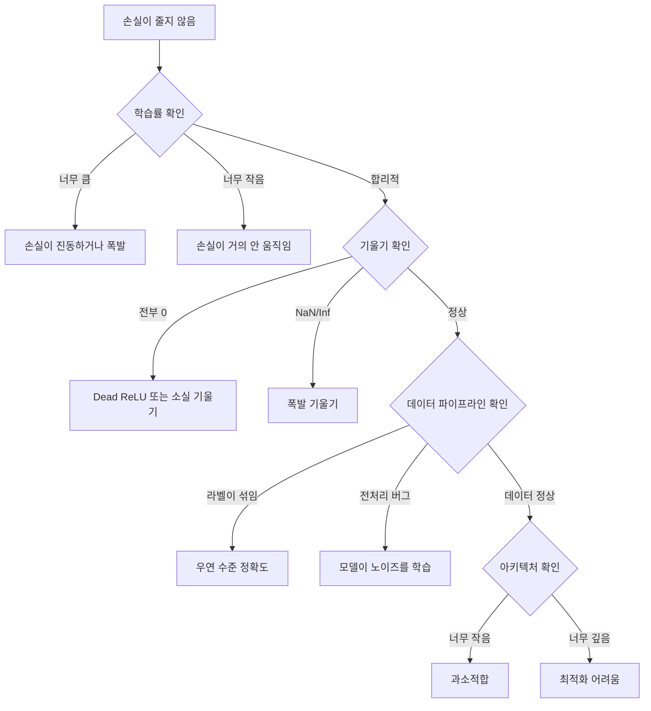
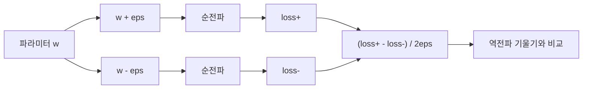
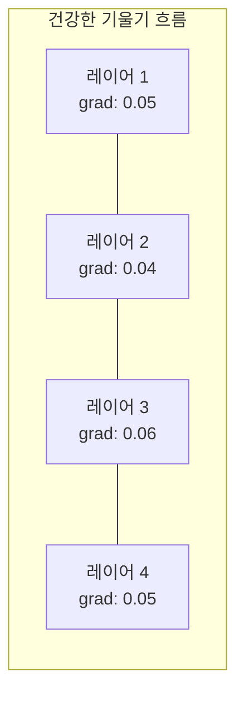
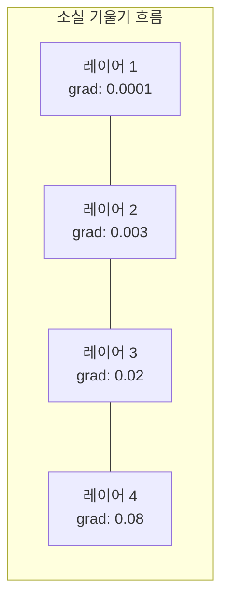
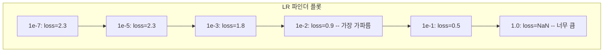

# 신경망 디버깅 (Debugging Neural Networks)

> 네트워크가 컴파일됐습니다. 실행됐습니다. 숫자를 냈습니다. 그 숫자는 틀렸고, 아무것도 크래시하지 않았습니다. 가장 어려운 종류의 디버깅에 오신 것을 환영합니다 — 오류 메시지가 없는 종류.

**Type:** Build
**Languages:** Python, PyTorch
**Prerequisites:** Phase 03 Lessons 01-10 (especially backpropagation, loss functions, optimizers)
**Time:** ~90 minutes

## 학습 목표 (Learning Objectives)

- 체계적인 디버깅 전략으로 흔한 신경망 실패(NaN 손실, 평평한 손실 곡선, 과적합, 진동)를 진단합니다
- "한 배치 과적합(overfit one batch)" 기법으로 모델 아키텍처와 학습 루프가 올바른지 검증합니다
- 기울기 크기, 활성화 분포, 가중치 노름을 검사해 소실/폭발 기울기 문제를 식별합니다
- 데이터 파이프라인, 모델 아키텍처, 손실 함수, 옵티마이저, 학습률 문제를 다루는 디버깅 체크리스트를 만듭니다

## 문제 상황 (The Problem)

전통적 소프트웨어는 깨지면 크래시합니다. null 포인터는 예외를 던집니다. 타입 불일치는 컴파일 시 실패합니다. off-by-one 오류는 분명히 틀린 출력을 냅니다.

신경망은 그런 호사를 주지 않습니다.

깨진 신경망은 끝까지 돌고, 손실 값을 출력하고, 예측을 냅니다. 손실이 줄 수도 있습니다. 예측이 그럴듯해 보일 수도 있습니다. 하지만 모델은 조용히 틀립니다 — 지름길을 배우고, 노이즈를 외우고, 쓸모없는 지역 최솟값에 수렴합니다. Google 연구자들은 ML 디버깅 시간의 60-70%가 오류는 없지만 모델 품질을 떨어뜨리는 "조용한" 버그에 쓰인다고 추정했습니다.

동작하는 모델과 깨진 모델의 차이는 종종 한 줄입니다. 빠진 `zero_grad()`, 전치된 차원, 10배 틀린 학습률. 정석 "Recipe for Training Neural Networks"(2019)는 이렇게 엽니다. "가장 흔한 신경망 실수는 크래시하지 않는 버그다."

이 레슨은 그 버그를 찾는 법을 가르칩니다.

## 핵심 개념 (The Concept)

### 디버깅 마인드셋 (The Debugging Mindset)

print-and-pray 디버깅은 잊으세요. 신경망 디버깅은 체계적 접근이 필요합니다. 피드백 루프가 느리고(학습 런당 수 분~수 시간), 증상이 모호하기 때문입니다(나쁜 손실은 20가지를 뜻할 수 있음).

황금률: **단순하게 시작하고, 복잡도를 한 조각씩 더하고, 각 조각을 독립적으로 검증하세요.**



### 증상 1: 손실이 줄지 않음 (Loss Not Decreasing)

가장 흔한 불만입니다. 학습 루프가 돌고, 에포크가 지나가는데, 손실이 평평하거나 심하게 진동합니다.

**잘못된 학습률.** 너무 큼: 손실이 진동하거나 NaN으로 점프. 너무 작음: 손실이 너무 천천히 줄어 평평해 보임. Adam은 1e-3부터. SGD는 1e-1 또는 1e-2부터. 다른 것이 틀렸다고 결론 내리기 전에, 각각 10배 간격의 학습률 3개(예: 1e-2, 1e-3, 1e-4)를 항상 시도하세요.

**Dead ReLU.** ReLU 뉴런이 큰 음수 입력을 받으면 0을 출력하고 기울기도 0입니다. 다시는 활성화되지 않습니다. 충분히 많은 뉴런이 죽으면 네트워크가 학습할 수 없습니다. 확인: 각 ReLU 레이어 뒤 활성화가 정확히 0인 비율을 출력하세요. 50% 이상이 죽으면 LeakyReLU로 바꾸거나 학습률을 줄이세요.

**소실 기울기 (Vanishing gradients).** sigmoid나 tanh 활성화를 쓰는 깊은 네트워크에서, 기울기가 뒤로 전파되며 지수적으로 줄어듭니다. 첫 레이어에 도착할 때쯤 ~0입니다. 첫 레이어가 학습을 멈춥니다. 수정: ReLU/GELU 사용, residual 연결 추가, 또는 배치 정규화.

**폭발 기울기 (Exploding gradients).** 반대 문제 — 기울기가 지수적으로 커집니다. RNN과 매우 깊은 네트워크에서 흔합니다. 손실이 NaN으로 점프합니다. 수정: 기울기 클리핑(`torch.nn.utils.clip_grad_norm_`), 학습률 낮추기, 또는 정규화 추가.

### 증상 2: 손실은 줄지만 모델이 나쁨 (Loss Decreasing But Model is Bad)

손실이 내려갑니다. 학습 정확도가 99%에 달합니다. 하지만 테스트 정확도는 55%입니다. 또는 실제 데이터에서 말도 안 되는 출력을 냅니다.

**과적합 (Overfitting).** 모델이 패턴 대신 학습 데이터를 외웁니다. 학습과 검증 손실 간격이 시간에 따라 커집니다. 수정: 더 많은 데이터, 드롭아웃, weight decay, early stopping, 데이터 증강.

**데이터 누수 (Data leakage).** 테스트 데이터가 학습에 스며듦. 정확도가 의심스러울 정도로 높습니다. 흔한 원인: 분할 전 셔플, 전체 데이터셋 통계로 전처리, 분할 간 중복 샘플. 수정: 먼저 분할, 그다음 전처리, 중복 확인.

**라벨 오류.** 대부분의 실제 데이터셋에서 라벨의 5-10%가 틀립니다(Northcutt et al., 2021 -- "Pervasive Label Errors in Test Sets"). 모델이 그 노이즈를 배웁니다. 수정: confident learning으로 잘못 라벨된 예제를 찾아 고치거나, 높은 손실 샘플을 무시하는 loss truncation을 쓰세요.

### 증상 3: 손실에 NaN 또는 Inf

손실 값이 `nan` 또는 `inf`가 됩니다. 학습은 끝났습니다.

**학습률이 너무 큼.** 기울기 갱신이 너무 커서 가중치가 폭발합니다. 수정: 10배 줄이세요.

**log(0) 또는 log(음수).** 교차 엔트로피 손실은 `log(p)`를 계산합니다. 모델이 정확히 0 또는 음수 확률을 내면 log가 폭발합니다. 수정: 예측을 `[eps, 1-eps]`로 클램프하세요. `eps=1e-7`.

**0으로 나누기.** 배치 정규화는 표준편차로 나눕니다. 값이 일정한 배치는 std=0입니다. 수정: 분모에 epsilon을 더하세요(PyTorch는 기본으로 하지만, 커스텀 구현은 아닐 수 있음).

**수치 오버플로.** 큰 활성화를 `exp()`에 넣으면 Inf가 됩니다. Softmax가 특히 취약합니다. 수정: 지수화 전에 최댓값을 빼세요(log-sum-exp 트릭).

### 기법 1: 기울기 검사 (Gradient Checking)

해석적 기울기(역전파)를 수치 기울기(유한 차분)와 비교합니다. 불일치하면 역전파에 버그가 있습니다.

파라미터 `w`의 수치 기울기:

```
grad_numerical = (loss(w + eps) - loss(w - eps)) / (2 * eps)
```

일치 지표(상대 차이):

```
rel_diff = |grad_analytical - grad_numerical| / max(|grad_analytical|, |grad_numerical|, 1e-8)
```

`rel_diff < 1e-5`: 올바름. `rel_diff > 1e-3`: 거의 확실히 버그.



### 기법 2: 활성화 통계 (Activation Statistics)

학습 중 각 레이어 뒤 활성화의 평균과 표준편차를 모니터링하세요. 건강한 네트워크는 평균이 0 근처, std가 1 근처(정규화 후)이거나 최소한 유계입니다.

| Health indicator | Mean | Std | Diagnosis |
|-----------------|------|-----|-----------|
| Healthy | ~0 | ~1 | Network is learning normally |
| Saturated | >>0 or <<0 | ~0 | Activations stuck at extreme values |
| Dead | 0 | 0 | Neurons are dead (all zeros) |
| Exploding | >>10 | >>10 | Activations growing without bound |

### 기법 3: 기울기 흐름 시각화 (Gradient Flow Visualization)

각 레이어의 평균 기울기 크기를 그리세요. 건강한 네트워크에서는 레이어에 걸쳐 기울기 크기가 대략 비슷해야 합니다. 초기 레이어 기울기가 후기 레이어보다 1000배 작으면 소실 기울기입니다.





### 기법 4: 한 배치 과적합 테스트 (The Overfit-One-Batch Test)

딥러닝에서 가장 중요한 단일 디버깅 기법입니다.

작은 배치 하나(8-32 샘플)를 가져오세요. 100회 이상 학습하세요. 손실은 거의 0으로, 학습 정확도는 100%에 도달해야 합니다. 그렇지 않으면 모델이나 학습 루프에 근본적 버그가 있습니다 — 전체 학습으로 넘어가지 마세요.

이 테스트가 잡는 것:
- 깨진 손실 함수
- 깨진 역전파
- 데이터를 표현하기에 너무 작은 아키텍처
- 옵티마이저가 모델 파라미터에 연결되지 않음
- 데이터와 라벨 불일치

실행에 30초가 걸리고, 전체 학습 런 디버깅에 몇 시간을 아낍니다.

### 기법 5: 학습률 파인더 (Learning Rate Finder)

Leslie Smith(2017)는 한 에포크에 걸쳐 학습률을 매우 작음(1e-7)에서 매우 큼(10)까지 스윕하며 손실을 기록하자고 제안했습니다. loss vs learning rate를 그리세요. 최적 학습률은 손실이 가장 빠르게 줄기 시작하는 지점보다 대략 10배 작습니다.



이 예시의 최적 LR: ~1e-3 (가장 가파른 점보다 한 자릿수 전).

### 흔한 PyTorch 버그 (Common PyTorch Bugs)

PyTorch 커뮤니티에서 가장 많은 시간을 잡아먹는 버그들입니다:

| Bug | Symptom | Fix |
|-----|---------|-----|
| Forgetting `optimizer.zero_grad()` | Gradients accumulate across batches, loss oscillates | Add `optimizer.zero_grad()` before `loss.backward()` |
| Forgetting `model.eval()` at test time | Dropout and batch norm behave differently, test accuracy varies between runs | Add `model.eval()` and `torch.no_grad()` |
| Wrong tensor shapes | Silent broadcasting produces wrong results, no error | Print shapes after every operation during debugging |
| CPU/GPU mismatch | `RuntimeError: expected CUDA tensor` | Use `.to(device)` on model AND data |
| Not detaching tensors | Computation graph grows forever, OOM | Use `.detach()` or `with torch.no_grad()` |
| In-place operations breaking autograd | `RuntimeError: modified by in-place operation` | Replace `x += 1` with `x = x + 1` |
| Data not normalized | Loss stuck at random-chance level | Normalize inputs to mean=0, std=1 |
| Labels as wrong dtype | Cross-entropy expects `Long`, got `Float` | Cast labels: `labels.long()` |

### 마스터 디버깅 표 (The Master Debugging Table)

| Symptom | Likely cause | First thing to try |
|---------|-------------|-------------------|
| Loss stuck at -log(1/num_classes) | Model predicting uniform distribution | Check data pipeline, verify labels match inputs |
| Loss NaN after a few steps | Learning rate too high | Reduce LR by 10x |
| Loss NaN immediately | log(0) or division by zero | Add epsilon to log/division operations |
| Loss oscillating wildly | LR too high or batch size too small | Reduce LR, increase batch size |
| Loss decreasing then plateaus | LR too high for fine-tuning phase | Add LR schedule (cosine or step decay) |
| Training acc high, test acc low | Overfitting | Add dropout, weight decay, more data |
| Training acc = test acc = chance | Model not learning anything | Run overfit-one-batch test |
| Training acc = test acc but both low | Underfitting | Bigger model, more layers, more features |
| Gradients all zero | Dead ReLUs or detached computation graph | Switch to LeakyReLU, check `.requires_grad` |
| Out of memory during training | Batch too large or graph not freed | Reduce batch size, use `torch.no_grad()` for eval |

```figure
learning-curves
```

## 직접 만들기 (Build It)

활성화, 기울기, 손실 곡선을 모니터링하는 진단 툴킷입니다. 네트워크를 의도적으로 깨뜨리고, 툴킷으로 각 문제를 진단합니다.

### Step 1: NetworkDebugger 클래스

PyTorch 모델에 훅을 걸어 레이어별 활성화·기울기 통계를 기록합니다.

```python
import torch
import torch.nn as nn
import math


class NetworkDebugger:
    def __init__(self, model):
        self.model = model
        self.activation_stats = {}
        self.gradient_stats = {}
        self.loss_history = []
        self.lr_losses = []
        self.hooks = []
        self._register_hooks()

    def _register_hooks(self):
        for name, module in self.model.named_modules():
            if isinstance(module, (nn.Linear, nn.Conv2d, nn.ReLU, nn.LeakyReLU)):
                hook = module.register_forward_hook(self._make_activation_hook(name))
                self.hooks.append(hook)
                hook = module.register_full_backward_hook(self._make_gradient_hook(name))
                self.hooks.append(hook)

    def _make_activation_hook(self, name):
        def hook(module, input, output):
            with torch.no_grad():
                out = output.detach().float()
                self.activation_stats[name] = {
                    "mean": out.mean().item(),
                    "std": out.std().item(),
                    "fraction_zero": (out == 0).float().mean().item(),
                    "min": out.min().item(),
                    "max": out.max().item(),
                }
        return hook

    def _make_gradient_hook(self, name):
        def hook(module, grad_input, grad_output):
            if grad_output[0] is not None:
                with torch.no_grad():
                    grad = grad_output[0].detach().float()
                    self.gradient_stats[name] = {
                        "mean": grad.mean().item(),
                        "std": grad.std().item(),
                        "abs_mean": grad.abs().mean().item(),
                        "max": grad.abs().max().item(),
                    }
        return hook

    def record_loss(self, loss_value):
        self.loss_history.append(loss_value)

    def check_loss_health(self):
        if len(self.loss_history) < 2:
            return "NOT_ENOUGH_DATA"
        recent = self.loss_history[-10:]
        if any(math.isnan(v) or math.isinf(v) for v in recent):
            return "NAN_OR_INF"
        if len(self.loss_history) >= 20:
            first_half = sum(self.loss_history[:10]) / 10
            second_half = sum(self.loss_history[-10:]) / 10
            if second_half >= first_half * 0.99:
                return "NOT_DECREASING"
        if len(recent) >= 5:
            diffs = [recent[i+1] - recent[i] for i in range(len(recent)-1)]
            if max(diffs) - min(diffs) > 2 * abs(sum(diffs) / len(diffs)):
                return "OSCILLATING"
        return "HEALTHY"

    def check_activations(self):
        issues = []
        for name, stats in self.activation_stats.items():
            if stats["fraction_zero"] > 0.5:
                issues.append(f"DEAD_NEURONS: {name} has {stats['fraction_zero']:.0%} zero activations")
            if abs(stats["mean"]) > 10:
                issues.append(f"EXPLODING_ACTIVATIONS: {name} mean={stats['mean']:.2f}")
            if stats["std"] < 1e-6:
                issues.append(f"COLLAPSED_ACTIVATIONS: {name} std={stats['std']:.2e}")
        return issues if issues else ["HEALTHY"]

    def check_gradients(self):
        issues = []
        grad_magnitudes = []
        for name, stats in self.gradient_stats.items():
            grad_magnitudes.append((name, stats["abs_mean"]))
            if stats["abs_mean"] < 1e-7:
                issues.append(f"VANISHING_GRADIENT: {name} abs_mean={stats['abs_mean']:.2e}")
            if stats["abs_mean"] > 100:
                issues.append(f"EXPLODING_GRADIENT: {name} abs_mean={stats['abs_mean']:.2e}")
        if len(grad_magnitudes) >= 2:
            first_mag = grad_magnitudes[0][1]
            last_mag = grad_magnitudes[-1][1]
            if last_mag > 0 and first_mag / last_mag > 100:
                issues.append(f"GRADIENT_RATIO: first/last = {first_mag/last_mag:.0f}x (vanishing)")
        return issues if issues else ["HEALTHY"]

    def print_report(self):
        print("\n=== NETWORK DEBUGGER REPORT ===")
        print(f"\nLoss health: {self.check_loss_health()}")
        if self.loss_history:
            print(f"  Last 5 losses: {[f'{v:.4f}' for v in self.loss_history[-5:]]}")
        print("\nActivation diagnostics:")
        for item in self.check_activations():
            print(f"  {item}")
        print("\nGradient diagnostics:")
        for item in self.check_gradients():
            print(f"  {item}")
        print("\nPer-layer activation stats:")
        for name, stats in self.activation_stats.items():
            print(f"  {name}: mean={stats['mean']:.4f} std={stats['std']:.4f} zero={stats['fraction_zero']:.1%}")
        print("\nPer-layer gradient stats:")
        for name, stats in self.gradient_stats.items():
            print(f"  {name}: abs_mean={stats['abs_mean']:.2e} max={stats['max']:.2e}")

    def remove_hooks(self):
        for hook in self.hooks:
            hook.remove()
        self.hooks.clear()
```

### Step 2: 한 배치 과적합 테스트

```python
def overfit_one_batch(model, x_batch, y_batch, criterion, lr=0.01, steps=200):
    optimizer = torch.optim.Adam(model.parameters(), lr=lr)
    model.train()
    print("\n=== OVERFIT ONE BATCH TEST ===")
    print(f"Batch size: {x_batch.shape[0]}, Steps: {steps}")

    for step in range(steps):
        optimizer.zero_grad()
        output = model(x_batch)
        loss = criterion(output, y_batch)
        loss.backward()
        optimizer.step()

        if step % 50 == 0 or step == steps - 1:
            with torch.no_grad():
                preds = (output > 0).float() if output.shape[-1] == 1 else output.argmax(dim=1)
                targets = y_batch if y_batch.dim() == 1 else y_batch.squeeze()
                acc = (preds.squeeze() == targets).float().mean().item()
            print(f"  Step {step:3d} | Loss: {loss.item():.6f} | Accuracy: {acc:.1%}")

    final_loss = loss.item()
    if final_loss > 0.1:
        print(f"\n  FAIL: Loss did not converge ({final_loss:.4f}). Model or training loop is broken.")
        return False
    print(f"\n  PASS: Loss converged to {final_loss:.6f}")
    return True
```

### Step 3: 학습률 파인더

```python
def find_learning_rate(model, x_data, y_data, criterion, start_lr=1e-7, end_lr=10, steps=100):
    import copy
    original_state = copy.deepcopy(model.state_dict())
    optimizer = torch.optim.SGD(model.parameters(), lr=start_lr)
    lr_mult = (end_lr / start_lr) ** (1 / steps)

    model.train()
    results = []
    best_loss = float("inf")
    current_lr = start_lr

    print("\n=== LEARNING RATE FINDER ===")

    for step in range(steps):
        optimizer.zero_grad()
        output = model(x_data)
        loss = criterion(output, y_data)

        if math.isnan(loss.item()) or loss.item() > best_loss * 10:
            break

        best_loss = min(best_loss, loss.item())
        results.append((current_lr, loss.item()))

        loss.backward()
        optimizer.step()

        current_lr *= lr_mult
        for param_group in optimizer.param_groups:
            param_group["lr"] = current_lr

    model.load_state_dict(original_state)

    if len(results) < 10:
        print("  Could not complete LR sweep -- loss diverged too quickly")
        return results

    min_loss_idx = min(range(len(results)), key=lambda i: results[i][1])
    suggested_lr = results[max(0, min_loss_idx - 10)][0]

    print(f"  Swept {len(results)} steps from {start_lr:.0e} to {results[-1][0]:.0e}")
    print(f"  Minimum loss {results[min_loss_idx][1]:.4f} at lr={results[min_loss_idx][0]:.2e}")
    print(f"  Suggested learning rate: {suggested_lr:.2e}")

    return results
```

### Step 4: 기울기 검사기

```python
def _flat_to_multi_index(flat_idx, shape):
    multi_idx = []
    remaining = flat_idx
    for dim in reversed(shape):
        multi_idx.insert(0, remaining % dim)
        remaining //= dim
    return tuple(multi_idx)


def gradient_check(model, x, y, criterion, eps=1e-4):
    model.train()
    x_double = x.double()
    y_double = y.double()
    model_double = model.double()

    print("\n=== GRADIENT CHECK ===")
    overall_max_diff = 0
    checked = 0

    for name, param in model_double.named_parameters():
        if not param.requires_grad:
            continue

        layer_max_diff = 0

        model_double.zero_grad()
        output = model_double(x_double)
        loss = criterion(output, y_double)
        loss.backward()
        analytical_grad = param.grad.clone()

        num_checks = min(5, param.numel())
        for i in range(num_checks):
            idx = _flat_to_multi_index(i, param.shape)
            original = param.data[idx].item()

            param.data[idx] = original + eps
            with torch.no_grad():
                loss_plus = criterion(model_double(x_double), y_double).item()

            param.data[idx] = original - eps
            with torch.no_grad():
                loss_minus = criterion(model_double(x_double), y_double).item()

            param.data[idx] = original

            numerical = (loss_plus - loss_minus) / (2 * eps)
            analytical = analytical_grad[idx].item()

            denom = max(abs(numerical), abs(analytical), 1e-8)
            rel_diff = abs(numerical - analytical) / denom

            layer_max_diff = max(layer_max_diff, rel_diff)
            checked += 1

        overall_max_diff = max(overall_max_diff, layer_max_diff)
        status = "OK" if layer_max_diff < 1e-5 else "MISMATCH"
        print(f"  {name}: max_rel_diff={layer_max_diff:.2e} [{status}]")

    model.float()

    print(f"\n  Checked {checked} parameters")
    if overall_max_diff < 1e-5:
        print("  PASS: Gradients match (rel_diff < 1e-5)")
    elif overall_max_diff < 1e-3:
        print("  WARN: Small differences (1e-5 < rel_diff < 1e-3)")
    else:
        print("  FAIL: Gradient mismatch detected (rel_diff > 1e-3)")
    return overall_max_diff
```

### Step 5: 의도적으로 깨진 네트워크

이제 툴킷을 깨진 네트워크에 적용하고 각각을 진단합니다.

```python
def demo_broken_networks():
    torch.manual_seed(42)
    x = torch.randn(64, 10)
    y = (x[:, 0] > 0).long()

    print("\n" + "=" * 60)
    print("BUG 1: Learning rate too high (lr=10)")
    print("=" * 60)
    model1 = nn.Sequential(nn.Linear(10, 32), nn.ReLU(), nn.Linear(32, 2))
    debugger1 = NetworkDebugger(model1)
    optimizer1 = torch.optim.SGD(model1.parameters(), lr=10.0)
    criterion = nn.CrossEntropyLoss()
    for step in range(20):
        optimizer1.zero_grad()
        out = model1(x)
        loss = criterion(out, y)
        debugger1.record_loss(loss.item())
        loss.backward()
        optimizer1.step()
    debugger1.print_report()
    debugger1.remove_hooks()

    print("\n" + "=" * 60)
    print("BUG 2: Dead ReLUs from bad initialization")
    print("=" * 60)
    model2 = nn.Sequential(nn.Linear(10, 32), nn.ReLU(), nn.Linear(32, 32), nn.ReLU(), nn.Linear(32, 2))
    with torch.no_grad():
        for m in model2.modules():
            if isinstance(m, nn.Linear):
                m.weight.fill_(-1.0)
                m.bias.fill_(-5.0)
    debugger2 = NetworkDebugger(model2)
    optimizer2 = torch.optim.Adam(model2.parameters(), lr=1e-3)
    for step in range(50):
        optimizer2.zero_grad()
        out = model2(x)
        loss = criterion(out, y)
        debugger2.record_loss(loss.item())
        loss.backward()
        optimizer2.step()
    debugger2.print_report()
    debugger2.remove_hooks()

    print("\n" + "=" * 60)
    print("BUG 3: Missing zero_grad (gradients accumulate)")
    print("=" * 60)
    model3 = nn.Sequential(nn.Linear(10, 32), nn.ReLU(), nn.Linear(32, 2))
    debugger3 = NetworkDebugger(model3)
    optimizer3 = torch.optim.SGD(model3.parameters(), lr=0.01)
    for step in range(50):
        out = model3(x)
        loss = criterion(out, y)
        debugger3.record_loss(loss.item())
        loss.backward()
        optimizer3.step()
    debugger3.print_report()
    debugger3.remove_hooks()

    print("\n" + "=" * 60)
    print("HEALTHY NETWORK: Correct setup for comparison")
    print("=" * 60)
    model_good = nn.Sequential(nn.Linear(10, 32), nn.ReLU(), nn.Linear(32, 2))
    debugger_good = NetworkDebugger(model_good)
    optimizer_good = torch.optim.Adam(model_good.parameters(), lr=1e-3)
    for step in range(50):
        optimizer_good.zero_grad()
        out = model_good(x)
        loss = criterion(out, y)
        debugger_good.record_loss(loss.item())
        loss.backward()
        optimizer_good.step()
    debugger_good.print_report()
    debugger_good.remove_hooks()

    print("\n" + "=" * 60)
    print("OVERFIT-ONE-BATCH TEST (healthy model)")
    print("=" * 60)
    model_test = nn.Sequential(nn.Linear(10, 32), nn.ReLU(), nn.Linear(32, 2))
    overfit_one_batch(model_test, x[:8], y[:8], criterion)

    print("\n" + "=" * 60)
    print("LEARNING RATE FINDER")
    print("=" * 60)
    model_lr = nn.Sequential(nn.Linear(10, 32), nn.ReLU(), nn.Linear(32, 2))
    find_learning_rate(model_lr, x, y, criterion)

    print("\n" + "=" * 60)
    print("GRADIENT CHECK")
    print("=" * 60)
    model_grad = nn.Sequential(nn.Linear(10, 8), nn.ReLU(), nn.Linear(8, 2))
    gradient_check(model_grad, x[:4], y[:4], criterion)
```

## 활용하기 (Use It)

### PyTorch 내장 도구

```python
import torch
import torch.nn as nn

model = nn.Sequential(
    nn.Linear(768, 256),
    nn.ReLU(),
    nn.Linear(256, 10),
)

with torch.autograd.detect_anomaly():
    output = model(input_tensor)
    loss = criterion(output, target)
    loss.backward()

for name, param in model.named_parameters():
    if param.grad is not None:
        print(f"{name}: grad_mean={param.grad.abs().mean():.2e}")
```

### Weights & Biases 연동

```python
import wandb

wandb.init(project="debug-training")

for epoch in range(100):
    loss = train_one_epoch()
    wandb.log({
        "loss": loss,
        "lr": optimizer.param_groups[0]["lr"],
        "grad_norm": torch.nn.utils.clip_grad_norm_(model.parameters(), float("inf")),
    })

    for name, param in model.named_parameters():
        if param.grad is not None:
            wandb.log({f"grad/{name}": wandb.Histogram(param.grad.cpu().numpy())})
```

### TensorBoard

```python
from torch.utils.tensorboard import SummaryWriter

writer = SummaryWriter("runs/debug_experiment")

for epoch in range(100):
    loss = train_one_epoch()
    writer.add_scalar("Loss/train", loss, epoch)

    for name, param in model.named_parameters():
        writer.add_histogram(f"weights/{name}", param, epoch)
        if param.grad is not None:
            writer.add_histogram(f"gradients/{name}", param.grad, epoch)
```

### 디버그 체크리스트 (전체 학습 전)

1. 한 배치 과적합 테스트를 실행하세요. 실패하면 멈추세요.
2. 모델 요약을 출력하세요 — 파라미터 수가 합리적인지 확인하세요.
3. 무작위 데이터로 단일 순전파를 돌리세요 — 출력 shape를 확인하세요.
4. 5 에포크 학습하세요 — 손실이 줄는지 확인하세요.
5. 활성화 통계를 확인하세요 — dead 레이어 없음, 폭발 없음.
6. 기울기 흐름을 확인하세요 — 소실 없음, 폭발 없음.
7. 데이터 파이프라인을 검증하세요 — 라벨과 함께 무작위 샘플 5개를 출력하세요.

## 산출물 (Ship It)

이 레슨이 만드는 것:
- `outputs/prompt-nn-debugger.md` -- 신경망 학습 실패를 진단하는 프롬프트
- `outputs/skill-debug-checklist.md` -- 학습 이슈 디버깅용 결정 트리 체크리스트

디버깅용 핵심 배포 패턴:
- 프로덕션 학습 스크립트에 모니터링 훅 추가
- N step마다 활성화·기울기 통계를 W&B 또는 TensorBoard에 로깅
- NaN 손실, dead 뉴런(>80% zero), 기울기 폭발에 대한 자동 알림 구현
- 아키텍처나 데이터 파이프라인을 바꿀 때 항상 한 배치 과적합 테스트 실행

## 연습 문제 (Exercises)

1. **폭발 기울기 감지기 추가.** `NetworkDebugger`를 수정해 기울기가 임계값을 넘으면 감지하고, 기울기 클리핑 값을 자동으로 제안하세요. 정규화 없는 20층 네트워크에서 테스트하세요.

2. **Dead 뉴런 부활기 만들기.** 항상 0을 출력하는 dead ReLU 뉴런을 찾아, 들어오는 가중치를 Kaiming 초기화로 다시 초기화하는 함수를 쓰세요. 뉴런의 70% 이상이 죽은 네트워크가 회복됨을 보이세요.

3. **플로팅이 있는 학습률 파인더 구현.** `find_learning_rate`를 확장해 결과를 CSV로 저장하고, CSV를 읽어 matplotlib으로 LR vs loss 곡선을 그리는 별도 스크립트를 쓰세요. CIFAR-10의 ResNet-18에 대한 최적 LR을 찾으세요.

4. **데이터 파이프라인 검증기 만들기.** 다음을 확인하는 함수를 쓰세요. train/test 분할 간 중복 샘플, 라벨 분포 불균형(>10:1 비율), 입력 정규화(평균 ~0, std ~1), 데이터의 NaN/Inf. 의도적으로 오염된 데이터셋에서 실행하세요.

5. **실제 실패를 디버깅.** Lesson 10의 미니 프레임워크에 미묘한 버그(예: 역전파에서 가중치 행렬 전치)를 넣고, 기울기 검사로 어떤 파라미터의 기울기가 틀린지 정확히 찾으세요. 디버깅 과정을 문서화하세요.

## 핵심 용어 (Key Terms)

| 용어 | 사람들이 말하는 것 | 실제로 의미하는 것 |
|------|----------------|----------------------|
| Silent bug | "돌아가지만 결과가 나쁨" | 오류는 없지만 모델 품질을 떨어뜨리는 버그 — ML의 지배적 실패 모드 |
| Dead ReLU | "뉴런이 죽었다" | 입력이 항상 음수여서 출력이 0이고 기울기도 영원히 0인 ReLU 뉴런 |
| Vanishing gradients | "초기 레이어가 학습을 멈춤" | 레이어를 통과하며 기울기가 지수적으로 줄어, 초기 레이어 가중치가 사실상 동결됨 |
| Exploding gradients | "손실이 NaN이 됨" | 레이어를 통과하며 기울기가 지수적으로 커져, 가중치 갱신이 오버플로할 정도로 큼 |
| Gradient checking | "역전파가 맞는지 검증" | 역전파의 해석적 기울기를 유한 차분의 수치 기울기와 비교 |
| Overfit-one-batch | "가장 중요한 디버그 테스트" | 작은 배치 하나로 학습해 모델이 학습할 수 있는지 검증 — 못하면 근본적으로 깨진 것 |
| LR finder | "스윕으로 올바른 학습률 찾기" | 한 에포크에 걸쳐 학습률을 지수적으로 올리고, 손실이 발산하기 직전의 율을 고름 |
| Data leakage | "테스트 데이터가 학습에 스며듦" | 테스트셋 정보가 학습을 오염시켜, 인위적으로 높은 정확도가 나옴 |
| Activation statistics | "레이어 건강 모니터링" | 각 레이어 출력의 평균·std·zero-fraction을 추적해 dead·포화·폭발 뉴런 감지 |
| Gradient clipping | "기울기 크기 상한" | 노름이 임계값을 넘으면 기울기를 스케일 다운해, 폭발 기울기 갱신을 막음 |

## 더 읽을거리 (Further Reading)

- Smith, "Cyclical Learning Rates for Training Neural Networks" (2017) -- 학습률 범위 테스트(LR finder)를 소개한 논문
- Northcutt et al., "Pervasive Label Errors in Test Sets Destabilize Machine Learning Benchmarks" (2021) -- ImageNet, CIFAR-10 등 주요 벤치마크의 라벨 3-6%가 틀렸음을 보임
- Zhang et al., "Understanding Deep Learning Requires Rethinking Generalization" (2017) -- 신경망이 무작위 라벨을 외울 수 있음을 보여, 한 배치 과적합 테스트가 동작하는 이유
- PyTorch 문서의 `torch.autograd.detect_anomaly`와 `torch.autograd.set_detect_anomaly` -- 내장 NaN/Inf 감지
