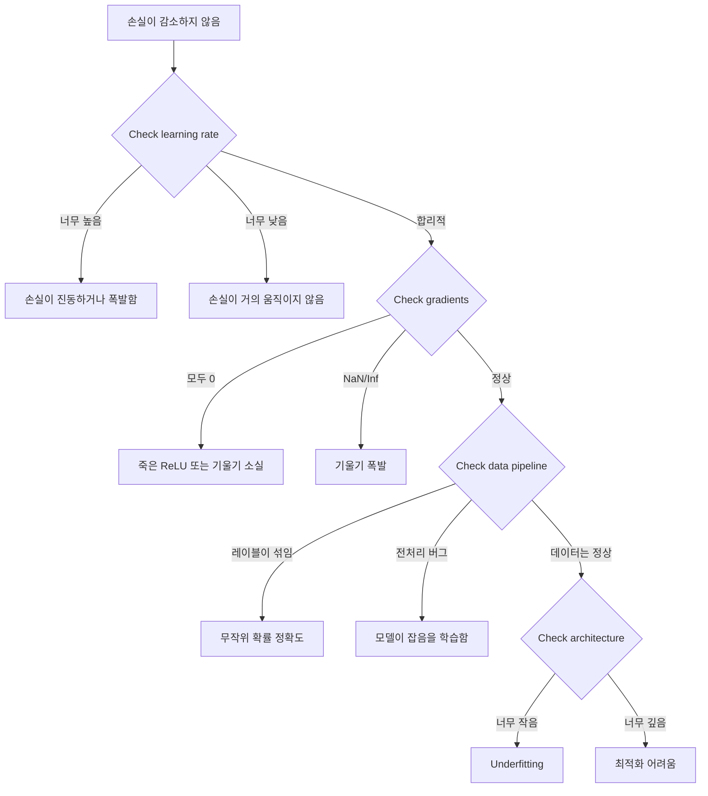
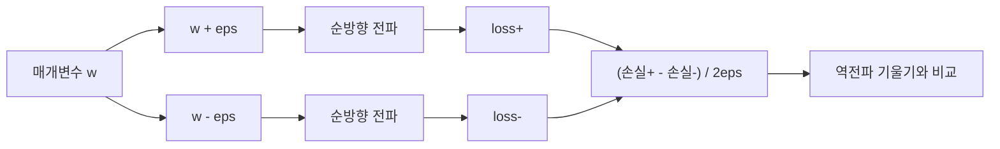
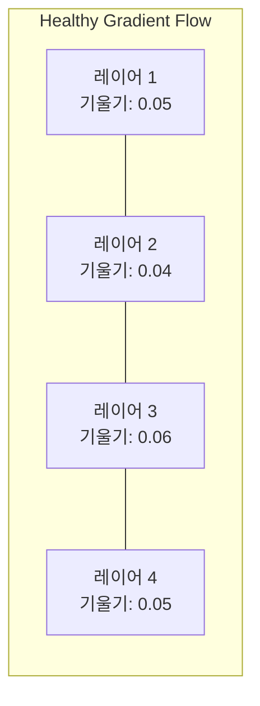
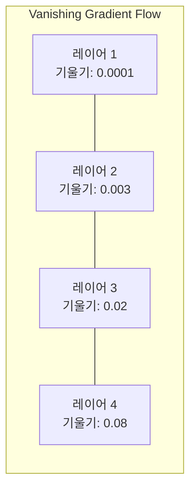
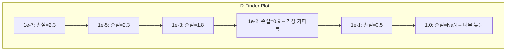

# 신경망 디버깅

> 네트워크가 컴파일되었습니다. 실행되었습니다. 숫자를 산출했습니다. 그 숫자는 틀렸고, 아무것도 크래시되지 않았습니다. 에러 메시지가 없는 디버깅 -- 가장 어려운 종류의 디버깅에 오신 것을 환영합니다.

**유형:** Build
**언어:** Python, PyTorch
**선수 요건:** 03단계 01-10강 (특히 역전파, 손실 함수, 옵티마이저)
**시간:** 약 90분

## 학습 목표

- 체계적인 디버깅 전략을 사용하여 일반적인 신경망 실패 (NaN 손실, 평탄한 손실 곡선, 과적합, 진동)를 진단해 보세요
- "하나의 배치에 과적합" 기법을 적용하여 모델 아키텍처와 학습 루프가 올바른지 검증해 보세요
- 기울기 크기, 활성화 분포, 가중치 노름을 검사하여 기울기 소실/폭발 문제를 식별해 보세요
- 데이터 파이프라인, 모델 아키텍처, 손실 함수, 옵티마이저, 학습률 문제를 포괄하는 디버깅 체크리스트를 구축해 보세요

## 문제점

전통적인 소프트웨어는 고장나면 크래시합니다. 널 포인터는 예외를 발생시킵니다. 타입 불일치는 컴파일 타임에 실패합니다. 오프-바이-원(off-by-one) 오류는 명백히 잘못된 출력을 산출합니다.

신경망은 그런 사치를 제공하지 않습니다.

고장난 신경망은 완주하여 손실 값을 출력하고 예측값을 산출합니다. 손실이 감소할 수 있습니다. 예측값이 그럴듯해 보일 수 있습니다. 하지만 모델은 조용히 틀렸습니다 -- 지름길을 학습하거나, 잡음을 암기하거나, 쓸모없는 국소 최소값으로 수렴합니다. Google 연구원들은 ML 디버깅 시간의 60-70%가 에러를 발생시키지 않지만 모델 품질을 저하시키는 "조용한" 버그에 사용된다고 추정했습니다.

작동하는 모델과 고장난 모델의 차이는 종종 단 한 줄의 잘못된 배치입니다: 누락된 `zero_grad()`, 전치된 차원, 10배 틀린 학습률. 정통 "신경망 학습 레시피"(2019)는 이렇게 시작합니다: "가장 흔한 신경망 실수는 크래시하지 않는 버그입니다."

이 강의는 그런 버그를 찾는 방법을 가르쳐 줍니다.

## 개념

### 디버깅 마인드셋

print-and-pray 디버깅은 잊으세요. 신경망 디버깅은 체계적인 접근이 필요합니다. 왜냐하면 피드백 루프가 느리고(훈련 실행당 몇 분에서 몇 시간) 증상이 모호하기 때문입니다(나쁜 손실은 20가지 다른 원인을 의미할 수 있습니다).

황금률: **단순하게 시작하고, 한 부분씩 복잡성을 더하며, 각 부분을 독립적으로 검증하세요.**



### 증상 1: 손실이 감소하지 않음

가장 흔한 불만입니다. 훈련 루프가 실행되고 에포크(Epoch)가 진행되는데, 손실이 평평한 상태로 유지되거나 극심하게 진동합니다.

**잘못된 학습률(Learning Rate).** 너무 높으면: 손실이 진동하거나 NaN으로 점프합니다. 너무 낮으면: 손실이 너무 느리게 감소하여 평평해 보입니다. Adam의 경우 1e-3에서 시작하세요. SGD의 경우 1e-1 또는 1e-2에서 시작하세요. 다른 문제가 있다고 결론 내리기 전에 항상 10배씩 간격이 있는 3가지 학습률(예: 1e-2, 1e-3, 1e-4)을 시도해 보세요.

**죽은 ReLU.** ReLU 뉴런이 큰 음수 입력을 받으면 0을 출력하고 기울기가 0이 됩니다. 다시 활성화되지 않습니다. 충분한 뉴런이 죽으면 네트워크가 학습할 수 없습니다. 확인 방법: 각 ReLU 레이어 이후 정확히 0인 활성화의 비율을 출력하세요. 50% 이상이 죽은 상태라면 LeakyReLU로 전환하거나 학습률을 낮추세요.

**기울기 소실.** 시그모이드(sigmoid) 또는 tanh 활성화 함수를 사용하는 깊은 네트워크에서는 기울기가 역전파(Backpropagation)되면서 지수적으로 감소합니다. 첫 번째 레이어에 도달할 때쯤에는 ~0이 됩니다. 첫 번째 레이어들이 학습을 멈추게 됩니다. 해결 방법: ReLU/GELU를 사용하거나, 잔여 연결(residual connections)을 추가하거나, 배치 정규화(batch normalization)를 사용하세요.

**폭발하는 기울기.** 반대 문제 -- 기울기가 지수적으로 증가합니다. RNN과 매우 깊은 네트워크에서 흔합니다. 손실이 NaN으로 급증합니다. 해결책: 기울기 클리핑(`torch.nn.utils.clip_grad_norm_`), 더 낮은 학습률, 또는 정규화 추가.

### 증상 2: 손실은 감소하지만 모델은 나쁨

손실이 감소합니다. 학습 정확도가 99%에 도달합니다. 하지만 테스트 정확도는 55%입니다. 또는 모델이 실제 데이터에서 의미 없는 출력을 생성합니다.

**과적합.** 모델이 패턴을 학습하는 대신 학습 데이터를 암기합니다. 학습 손실과 검증 손실 사이의 격차가 시간이 지남에 따라 커집니다. 해결책: 더 많은 데이터, 드롭아웃, 가중치 감쇠, 조기 종료, 데이터 증강.

**데이터 누수.** 테스트 데이터가 학습 데이터에 유입되었습니다. 정확도가 의심스럽게 높습니다. 흔한 원인: 분할 전 셔플링, 전체 데이터셋의 통계로 전처리, 분할 간 중복 샘플. 해결책: 먼저 분할하고, 그 다음 전처리하며, 중복을 확인하세요.

**레이블 오류.** 대부분의 실제 데이터셋에서 레이블의 5-10%가 잘못되어 있습니다 (Northcutt et al., 2021 -- "Pervasive Label Errors in Test Sets"). 모델이 잡음을 학습합니다. 해결책: 확신 학습(confident learning)을 사용하여 레이블이 잘못된 예제를 찾아 수정하거나, 손실 절단(loss truncation)을 사용하여 높은 손실 샘플을 무시하세요.

### 증상 3: 손실에 NaN 또는 Inf 발생

손실 값이 `nan` 또는 `inf`이 됩니다. 학습이 중단됩니다.

**학습률이 너무 높음.** 기울기 업데이트가 너무 크게 overshoot하여 가중치가 폭발합니다. 해결책: 10배로 줄이세요.

**log(0) 또는 log(음수).** 교차 엔트로피 손실은 `log(p)`을 계산합니다. 모델이 정확히 0 또는 음수 확률을 출력하면 로그가 폭발합니다. 해결책: `eps=1e-7`인 `[eps, 1-eps]`로 예측값을 클램프(clamp)하세요.

**0으로 나누기.** 배치 정규화는 표준 편차로 나눕니다. 값이 일정한 배치는 std=0입니다. 해결책: 분모에 epsilon을 더하세요 (PyTorch는 기본적으로 이를 수행하지만, 사용자 정의 구현에서는 하지 않을 수 있습니다).

**수치적 오버플로.** 큰 활성화 값이 `exp()`에 입력되면 Inf가 생성됩니다. Softmax는 특히 취약합니다. 해결책: 지수화하기 전에 최대값을 빼세요 (log-sum-exp 트릭).

### 기법 1: 기울기 검사

분석적 기울기(역전파에서)를 수치적 기울기(유한 차분에서)와 비교하세요. 일치하지 않으면, 역전파에 버그가 있습니다.

매개변수 `w`의 수치적 기울기:

```
grad_numerical = (loss(w + eps) - loss(w - eps)) / (2 * eps)
```

일치 지표 (상대적 차이):

```
rel_diff = |grad_analytical - grad_numerical| / max(|grad_analytical|, |grad_numerical|, 1e-8)
```

`rel_diff < 1e-5`이면: 정확합니다. `rel_diff > 1e-3`이면: 거의 확실히 버그입니다.



### 기법 2: 활성화 통계

학습 중 각 레이어 이후의 활성화 평균과 표준 편차를 모니터링하세요. 건강한 네트워크는 활성화의 평균이 0에 가깝고 표준 편차가 1에 가깝거나 (정규화 후) 최소한 유한한 값을 유지합니다.

| 건강 지표 | 평균 | 표준 편차 | 진단 |
|-----------------|------|-----|-----------|
| 건강 | ~0 | ~1 | 네트워크가 정상적으로 학습 중 |
| 포화 | >>0 또는 <<0 | ~0 | 활성화가 극단적 값에 고착됨 |
| 죽은 상태 | 0 | 0 | 뉴런이 죽은 상태 (모두 0) |
| 폭발 | >>10 | >>10 | 활성화가 무한히 증가 |

### 기법 3: 기울기 흐름 시각화

각 레이어의 평균 기울기 크기를 플롯하세요. 건강한 네트워크에서는 레이어 간 기울기 크기가 대략 유사해야 합니다. 초기 레이어의 기울기가 후기 레이어보다 1000배 작다면, 기울기 소실 문제가 있습니다.





### 기법 4: 단일 배치 과적합 테스트

딥러닝에서 가장 중요한 디버깅 기법입니다.

작은 배치 하나 (8-32 샘플)를 가져와 100회 이상 반복하여 학습하세요. 손실은 거의 0에 가까워지고 학습 정확도는 100%에 도달해야 합니다. 그렇지 않다면, 모델이나 학습 루프에 근본적인 버그가 있습니다 -- 전체 학습으로 진행하지 마세요.

이 테스트는 다음을 포착합니다:
- 손실 함수가 고장남
- 역전파가 깨진 경우
- 데이터를 표현하기에는 아키텍처가 너무 작음
- 옵티마이저가 모델 매개변수에 연결되지 않음
- 데이터와 레이블이 정렬되지 않음

이 과정은 30초가 소요되며, 전체 학습 실행을 디버깅하는 데 걸리는 몇 시간을 절약해 줍니다.

### 기법 5: 학습률 파인더

Leslie Smith (2017)는 한 에포크 동안 학습률을 매우 작은 값 (1e-7)에서 매우 큰 값 (10)까지 스윕하면서 손실을 기록하는 방법을 제안했습니다. 손실 대 학습률을 플롯하세요. 최적의 학습률은 손실이 가장 빠르게 감소하기 시작하는 학습률보다 대략 10배 작은 값입니다.



이 예에서 최적의 학습률: ~1e-3 (가장 가파른 지점보다 한 자리수 작은 값).

### PyTorch의 흔한 버그

PyTorch 커뮤니티에서 가장 많은 시간을 낭비하게 만드는 버그들입니다:

| 버그 | 증상 | 해결 방법 |
|-----|---------|-----|
| `optimizer.zero_grad()`을 잊는 경우 | 배치 간에 기울기가 누적되어 손실이 진동함 | `loss.backward()` 전에 `optimizer.zero_grad()`을 추가하세요 |
| 테스트 시 `model.eval()`을 잊는 경우 | 드롭아웃과 배치 정규화가 다르게 동작하며, 테스트 정확도가 실행 간에 변동됨 | `model.eval()`과 `torch.no_grad()`을 추가하세요 |
| 잘못된 텐서 모양 | 조용한 브로드캐스팅이 잘못된 결과를 생성하며, 오류가 발생하지 않음 | 디버깅 중 모든 연산 후 모양을 출력하세요 |
| CPU/GPU 불일치 | `RuntimeError: expected CUDA tensor` | 모델과 데이터 모두에 `.to(device)`을 사용하세요 |
| 텐서를 분리(detach)하지 않는 경우 | 계산 그래프가 무한히 증가하여 OOM 발생 | `.detach()` 또는 `with torch.no_grad()`을 사용하세요 |
| 오토그라드를 깨뜨리는 제자리(in-place) 연산 | `RuntimeError: modified by in-place operation` | `x += 1`을 `x = x + 1`으로 교체하세요 |
| 데이터가 정규화되지 않은 경우 | 손실이 무작위 수준에 고착됨 | 입력을 mean=0, std=1으로 정규화하세요 |
| 레이블의 dtype가 잘못된 경우 | 교차 엔트로피는 `Long`을 기대하는데 `Float`을 받음 | 레이블을 캐스팅하세요: `labels.long()` |

### 마스터 디버깅 표

| 증상 | 가능한 원인 | 먼저 시도해 볼 것 |
|---------|-------------|-------------------|
| 손실이 -log(1/num_classes)에 고착됨 | 모델이 균일 분포를 예측함 | 데이터 파이프라인 확인, 레이블이 입력과 일치하는지 검증 |
| 몇 단계 후 손실이 NaN이 됨 | 학습률이 너무 높음 | 학습률을 10배 낮추기 |
| 즉시 손실이 NaN이 됨 | log(0) 또는 0으로 나누는 연산 | log/나눗셈 연산에 epsilon 추가 |
| 손실이 극심하게 진동함 | 학습률이 너무 높거나 배치 크기가 너무 작음 | 학습률 낮추기, 배치 크기 늘리기 |
| 손실이 감소하다가 평탄화됨 | 미세 조정 단계에서 학습률이 너무 높음 | 학습률 스케줄 추가 (코사인 또는 스텝 감쇠) |
| 훈련 정확도는 높고, 테스트 정확도는 낮음 | 과적합 | 드롭아웃, 가중치 감쇠, 더 많은 데이터 추가 |
| 훈련 정확도 = 테스트 정확도 = 확률 | 모델이 아무것도 학습하지 못함 | 단일 배치 과적합 테스트 실행 |
| 훈련 정확도 = 테스트 정확도지만 둘 다 낮음 | 과소 적합 | 더 큰 모델, 더 많은 레이어, 더 많은 특징 |
| 모든 기울기가 0임 | 죽은 ReLU 또는 분리된 계산 그래프 | LeakyReLU로 전환, `.requires_grad` 확인 |
| 훈련 중 메모리 부족 | 배치가 너무 크거나 그래프가 해제되지 않음 | 배치 크기 줄이기, 평가 시 `torch.no_grad()` 사용 |

```figure
learning-curves
```

## 구현하기

활성화, 기울기, 손실 곡선을 모니터링하는 진단 도구 키트입니다. 네트워크를 의도적으로 망가뜨리고 도구 키트를 사용하여 각 문제를 진단해 보세요.

### 1단계: NetworkDebugger 클래스

PyTorch 모델에 연결하여 레이어별 활성화 및 기울기 통계를 기록합니다.

```python
import torch
import torch.nn as nn
import math


class NetworkDebugger:
    def __init__(self, model):
        self.model = model
        self.activation_stats = {}
        self.gradient_stats = {}
        self.loss_history = []
        self.lr_losses = []
        self.hooks = []
        self._register_hooks()

    def _register_hooks(self):
        for name, module in self.model.named_modules():
            if isinstance(module, (nn.Linear, nn.Conv2d, nn.ReLU, nn.LeakyReLU)):
                hook = module.register_forward_hook(self._make_activation_hook(name))
                self.hooks.append(hook)
                hook = module.register_full_backward_hook(self._make_gradient_hook(name))
                self.hooks.append(hook)

    def _make_activation_hook(self, name):
        def hook(module, input, output):
            with torch.no_grad():
                out = output.detach().float()
                self.activation_stats[name] = {
                    "mean": out.mean().item(),
                    "std": out.std().item(),
                    "fraction_zero": (out == 0).float().mean().item(),
                    "min": out.min().item(),
                    "max": out.max().item(),
                }
        return hook

    def _make_gradient_hook(self, name):
        def hook(module, grad_input, grad_output):
            if grad_output[0] is not None:
                with torch.no_grad():
                    grad = grad_output[0].detach().float()
                    self.gradient_stats[name] = {
                        "mean": grad.mean().item(),
                        "std": grad.std().item(),
                        "abs_mean": grad.abs().mean().item(),
                        "max": grad.abs().max().item(),
                    }
        return hook

    def record_loss(self, loss_value):
        self.loss_history.append(loss_value)

    def check_loss_health(self):
        if len(self.loss_history) < 2:
            return "NOT_ENOUGH_DATA"
        recent = self.loss_history[-10:]
        if any(math.isnan(v) or math.isinf(v) for v in recent):
            return "NAN_OR_INF"
        if len(self.loss_history) >= 20:
            first_half = sum(self.loss_history[:10]) / 10
            second_half = sum(self.loss_history[-10:]) / 10
            if second_half >= first_half * 0.99:
                return "NOT_DECREASING"
        if len(recent) >= 5:
            diffs = [recent[i+1] - recent[i] for i in range(len(recent)-1)]
            if max(diffs) - min(diffs) > 2 * abs(sum(diffs) / len(diffs)):
                return "OSCILLATING"
        return "HEALTHY"

    def check_activations(self):
        issues = []
        for name, stats in self.activation_stats.items():
            if stats["fraction_zero"] > 0.5:
                issues.append(f"DEAD_NEURONS: {name} has {stats['fraction_zero']:.0%} zero activations")
            if abs(stats["mean"]) > 10:
                issues.append(f"EXPLODING_ACTIVATIONS: {name} mean={stats['mean']:.2f}")
            if stats["std"] < 1e-6:
                issues.append(f"COLLAPSED_ACTIVATIONS: {name} std={stats['std']:.2e}")
        return issues if issues else ["HEALTHY"]

    def check_gradients(self):
        issues = []
        grad_magnitudes = []
        for name, stats in self.gradient_stats.items():
            grad_magnitudes.append((name, stats["abs_mean"]))
            if stats["abs_mean"] < 1e-7:
                issues.append(f"VANISHING_GRADIENT: {name} abs_mean={stats['abs_mean']:.2e}")
            if stats["abs_mean"] > 100:
                issues.append(f"EXPLODING_GRADIENT: {name} abs_mean={stats['abs_mean']:.2e}")
        if len(grad_magnitudes) >= 2:
            first_mag = grad_magnitudes[0][1]
            last_mag = grad_magnitudes[-1][1]
            if last_mag > 0 and first_mag / last_mag > 100:
                issues.append(f"GRADIENT_RATIO: first/last = {first_mag/last_mag:.0f}x (vanishing)")
        return issues if issues else ["HEALTHY"]

    def print_report(self):
        print("\n=== NETWORK DEBUGGER REPORT ===")
        print(f"\nLoss health: {self.check_loss_health()}")
        if self.loss_history:
            print(f"  Last 5 losses: {[f'{v:.4f}' for v in self.loss_history[-5:]]}")
        print("\nActivation diagnostics:")
        for item in self.check_activations():
            print(f"  {item}")
        print("\nGradient diagnostics:")
        for item in self.check_gradients():
            print(f"  {item}")
        print("\nPer-layer activation stats:")
        for name, stats in self.activation_stats.items():
            print(f"  {name}: mean={stats['mean']:.4f} std={stats['std']:.4f} zero={stats['fraction_zero']:.1%}")
        print("\nPer-layer gradient stats:")
        for name, stats in self.gradient_stats.items():
            print(f"  {name}: abs_mean={stats['abs_mean']:.2e} max={stats['max']:.2e}")

    def remove_hooks(self):
        for hook in self.hooks:
            hook.remove()
        self.hooks.clear()
```

### 2단계: 단일 배치 과적합 테스트

```python
def overfit_one_batch(model, x_batch, y_batch, criterion, lr=0.01, steps=200):
    optimizer = torch.optim.Adam(model.parameters(), lr=lr)
    model.train()
    print("\n=== OVERFIT ONE BATCH TEST ===")
    print(f"Batch size: {x_batch.shape[0]}, Steps: {steps}")

    for step in range(steps):
        optimizer.zero_grad()
        output = model(x_batch)
        loss = criterion(output, y_batch)
        loss.backward()
        optimizer.step()

        if step % 50 == 0 or step == steps - 1:
            with torch.no_grad():
                preds = (output > 0).float() if output.shape[-1] == 1 else output.argmax(dim=1)
                targets = y_batch if y_batch.dim() == 1 else y_batch.squeeze()
                acc = (preds.squeeze() == targets).float().mean().item()
            print(f"  Step {step:3d} | Loss: {loss.item():.6f} | Accuracy: {acc:.1%}")

    final_loss = loss.item()
    if final_loss > 0.1:
        print(f"\n  FAIL: Loss did not converge ({final_loss:.4f}). Model or training loop is broken.")
        return False
    print(f"\n  PASS: Loss converged to {final_loss:.6f}")
    return True
```

### 3단계: 학습률 파인더

```python
def find_learning_rate(model, x_data, y_data, criterion, start_lr=1e-7, end_lr=10, steps=100):
    import copy
    original_state = copy.deepcopy(model.state_dict())
    optimizer = torch.optim.SGD(model.parameters(), lr=start_lr)
    lr_mult = (end_lr / start_lr) ** (1 / steps)

    model.train()
    results = []
    best_loss = float("inf")
    current_lr = start_lr

    print("\n=== LEARNING RATE FINDER ===")

    for step in range(steps):
        optimizer.zero_grad()
        output = model(x_data)
        loss = criterion(output, y_data)

        if math.isnan(loss.item()) or loss.item() > best_loss * 10:
            break

        best_loss = min(best_loss, loss.item())
        results.append((current_lr, loss.item()))

        loss.backward()
        optimizer.step()

        current_lr *= lr_mult
        for param_group in optimizer.param_groups:
            param_group["lr"] = current_lr

    model.load_state_dict(original_state)

    if len(results) < 10:
        print("  Could not complete LR sweep -- loss diverged too quickly")
        return results

    min_loss_idx = min(range(len(results)), key=lambda i: results[i][1])
    suggested_lr = results[max(0, min_loss_idx - 10)][0]

    print(f"  Swept {len(results)} steps from {start_lr:.0e} to {results[-1][0]:.0e}")
    print(f"  Minimum loss {results[min_loss_idx][1]:.4f} at lr={results[min_loss_idx][0]:.2e}")
    print(f"  Suggested learning rate: {suggested_lr:.2e}")

    return results
```

### 4단계: 기울기 검사기

```python
def _flat_to_multi_index(flat_idx, shape):
    multi_idx = []
    remaining = flat_idx
    for dim in reversed(shape):
        multi_idx.insert(0, remaining % dim)
        remaining //= dim
    return tuple(multi_idx)


def gradient_check(model, x, y, criterion, eps=1e-4):
    model.train()
    x_double = x.double()
    y_double = y.double()
    model_double = model.double()

    print("\n=== GRADIENT CHECK ===")
    overall_max_diff = 0
    checked = 0

    for name, param in model_double.named_parameters():
        if not param.requires_grad:
            continue

        layer_max_diff = 0

        model_double.zero_grad()
        output = model_double(x_double)
        loss = criterion(output, y_double)
        loss.backward()
        analytical_grad = param.grad.clone()

        num_checks = min(5, param.numel())
        for i in range(num_checks):
            idx = _flat_to_multi_index(i, param.shape)
            original = param.data[idx].item()

            param.data[idx] = original + eps
            with torch.no_grad():
                loss_plus = criterion(model_double(x_double), y_double).item()

            param.data[idx] = original - eps
            with torch.no_grad():
                loss_minus = criterion(model_double(x_double), y_double).item()

            param.data[idx] = original

            numerical = (loss_plus - loss_minus) / (2 * eps)
            analytical = analytical_grad[idx].item()

            denom = max(abs(numerical), abs(analytical), 1e-8)
            rel_diff = abs(numerical - analytical) / denom

            layer_max_diff = max(layer_max_diff, rel_diff)
            checked += 1

        overall_max_diff = max(overall_max_diff, layer_max_diff)
        status = "OK" if layer_max_diff < 1e-5 else "MISMATCH"
        print(f"  {name}: max_rel_diff={layer_max_diff:.2e} [{status}]")

    model.float()

    print(f"\n  Checked {checked} parameters")
    if overall_max_diff < 1e-5:
        print("  PASS: Gradients match (rel_diff < 1e-5)")
    elif overall_max_diff < 1e-3:
        print("  WARN: Small differences (1e-5 < rel_diff < 1e-3)")
    else:
        print("  FAIL: Gradient mismatch detected (rel_diff > 1e-3)")
    return overall_max_diff
```

### 5단계: 의도적으로 망가진 네트워크

이제 도구 키트를 망가진 네트워크에 적용하고 각각을 진단해 보세요.

```python
def demo_broken_networks():
    torch.manual_seed(42)
    x = torch.randn(64, 10)
    y = (x[:, 0] > 0).long()

    print("\n" + "=" * 60)
    print("BUG 1: Learning rate too high (lr=10)")
    print("=" * 60)
    model1 = nn.Sequential(nn.Linear(10, 32), nn.ReLU(), nn.Linear(32, 2))
    debugger1 = NetworkDebugger(model1)
    optimizer1 = torch.optim.SGD(model1.parameters(), lr=10.0)
    criterion = nn.CrossEntropyLoss()
    for step in range(20):
        optimizer1.zero_grad()
        out = model1(x)
        loss = criterion(out, y)
        debugger1.record_loss(loss.item())
        loss.backward()
        optimizer1.step()
    debugger1.print_report()
    debugger1.remove_hooks()

    print("\n" + "=" * 60)
    print("BUG 2: Dead ReLUs from bad initialization")
    print("=" * 60)
    model2 = nn.Sequential(nn.Linear(10, 32), nn.ReLU(), nn.Linear(32, 32), nn.ReLU(), nn.Linear(32, 2))
    with torch.no_grad():
        for m in model2.modules():
            if isinstance(m, nn.Linear):
                m.weight.fill_(-1.0)
                m.bias.fill_(-5.0)
    debugger2 = NetworkDebugger(model2)
    optimizer2 = torch.optim.Adam(model2.parameters(), lr=1e-3)
    for step in range(50):
        optimizer2.zero_grad()
        out = model2(x)
        loss = criterion(out, y)
        debugger2.record_loss(loss.item())
        loss.backward()
        optimizer2.step()
    debugger2.print_report()
    debugger2.remove_hooks()

    print("\n" + "=" * 60)
    print("BUG 3: Missing zero_grad (gradients accumulate)")
    print("=" * 60)
    model3 = nn.Sequential(nn.Linear(10, 32), nn.ReLU(), nn.Linear(32, 2))
    debugger3 = NetworkDebugger(model3)
    optimizer3 = torch.optim.SGD(model3.parameters(), lr=0.01)
    for step in range(50):
        out = model3(x)
        loss = criterion(out, y)
        debugger3.record_loss(loss.item())
        loss.backward()
        optimizer3.step()
    debugger3.print_report()
    debugger3.remove_hooks()

    print("\n" + "=" * 60)
    print("HEALTHY NETWORK: Correct setup for comparison")
    print("=" * 60)
    model_good = nn.Sequential(nn.Linear(10, 32), nn.ReLU(), nn.Linear(32, 2))
    debugger_good = NetworkDebugger(model_good)
    optimizer_good = torch.optim.Adam(model_good.parameters(), lr=1e-3)
    for step in range(50):
        optimizer_good.zero_grad()
        out = model_good(x)
        loss = criterion(out, y)
        debugger_good.record_loss(loss.item())
        loss.backward()
        optimizer_good.step()
    debugger_good.print_report()
    debugger_good.remove_hooks()

    print("\n" + "=" * 60)
    print("OVERFIT-ONE-BATCH TEST (healthy model)")
    print("=" * 60)
    model_test = nn.Sequential(nn.Linear(10, 32), nn.ReLU(), nn.Linear(32, 2))
    overfit_one_batch(model_test, x[:8], y[:8], criterion)

    print("\n" + "=" * 60)
    print("LEARNING RATE FINDER")
    print("=" * 60)
    model_lr = nn.Sequential(nn.Linear(10, 32), nn.ReLU(), nn.Linear(32, 2))
    find_learning_rate(model_lr, x, y, criterion)

    print("\n" + "=" * 60)
    print("GRADIENT CHECK")
    print("=" * 60)
    model_grad = nn.Sequential(nn.Linear(10, 8), nn.ReLU(), nn.Linear(8, 2))
    gradient_check(model_grad, x[:4], y[:4], criterion)
```

## 사용하기

### PyTorch 내장 도구

```python
import torch
import torch.nn as nn

model = nn.Sequential(
    nn.Linear(768, 256),
    nn.ReLU(),
    nn.Linear(256, 10),
)

with torch.autograd.detect_anomaly():
    output = model(input_tensor)
    loss = criterion(output, target)
    loss.backward()

for name, param in model.named_parameters():
    if param.grad is not None:
        print(f"{name}: grad_mean={param.grad.abs().mean():.2e}")
```

### Weights & Biases 통합

```python
import wandb

wandb.init(project="debug-training")

for epoch in range(100):
    loss = train_one_epoch()
    wandb.log({
        "loss": loss,
        "lr": optimizer.param_groups[0]["lr"],
        "grad_norm": torch.nn.utils.clip_grad_norm_(model.parameters(), float("inf")),
    })

    for name, param in model.named_parameters():
        if param.grad is not None:
            wandb.log({f"grad/{name}": wandb.Histogram(param.grad.cpu().numpy())})
```

### TensorBoard

```python
from torch.utils.tensorboard import SummaryWriter

writer = SummaryWriter("runs/debug_experiment")

for epoch in range(100):
    loss = train_one_epoch()
    writer.add_scalar("Loss/train", loss, epoch)

    for name, param in model.named_parameters():
        writer.add_histogram(f"weights/{name}", param, epoch)
        if param.grad is not None:
            writer.add_histogram(f"gradients/{name}", param.grad, epoch)
```

### 디버그 체크리스트 (전체 훈련 전)

1. 단일 배치 과적합 테스트를 실행합니다. 실패하면 중단하세요.
2. 모델 요약 출력 -- 매개변수 수가 합리적인지 확인하세요.
3. 무작위 데이터로 단일 순방향 패스를 실행 -- 출력 형태를 확인하세요.
4. 5 에포크 동안 훈련 -- 손실이 감소하는지 확인하세요.
5. 활성화 통계 확인 -- 죽은 레이어 없음, 폭발 없음.
6. 기울기 흐름 확인 -- 소실 없음, 폭발 없음.
7. 데이터 파이프라인 검증 -- 레이블이 포함된 랜덤 샘플 5개 출력.

## 출시하기

이 강의는 다음을 생성합니다:
- `outputs/prompt-nn-debugger.md` -- 신경망 학습 실패 진단용 프롬프트
- `outputs/skill-debug-checklist.md` -- 학습 문제 디버깅용 의사결정 트리 체크리스트

디버깅을 위한 주요 배포 패턴:
- 프로덕션 학습 스크립트에 모니터링 훅 추가
- N 스텝마다 W&B 또는 TensorBoard에 활성화 및 기울기 통계 기록
- NaN 손실, 죽은 뉴런(>80%가 0), 기울기 폭발에 대한 자동 알림 구현
- 아키텍처나 데이터 파이프라인 변경 시 항상 단일 배치 과적합 테스트 실행

## 연습 문제

1. **기울기 폭발 감지기를 추가하세요.** `NetworkDebugger`를 수정하여 기울기가 임계값을 초과할 때 감지하고 자동으로 기울기 클리핑 값을 제안하도록 하세요. 정규화 없는 20층 네트워크에서 테스트해 보세요.

2. **죽은 뉴런 부활기를 구축하세요.** 항상 0을 출력하는 죽은 ReLU 뉴런을 식별하고, 입력 가중치를 Kaiming 초기화로 재초기화하는 함수를 작성하세요. 뉴런의 70% 이상이 죽은 네트워크에서 이 방법이 회복되는 것을 보여주세요.

3. **플로팅을 포함한 학습률 파인더를 구현하세요.** `find_learning_rate`를 확장하여 결과를 CSV로 저장하고, CSV를 읽어 matplotlib로 LR 대 손실 곡선을 표시하는 별도 스크립트를 작성하세요. CIFAR-10에서 ResNet-18의 최적 LR을 식별하세요.

4. **데이터 파이프라인 검증기를 만드세요.** 다음을 확인하는 함수를 작성하세요: 학습/테스트 분할 간 중복 샘플, 레이블 분포 불균형(>10:1 비율), 입력 정규화(평균이 0에 가깝고 표준편차가 1에 가까움), 데이터의 NaN/Inf 값. 의도적으로 손상된 데이터셋에서 실행하세요.

5. **실제 실패를 디버깅하세요.** 10강의 미니 프레임워크를 가져와 미묘한 버그(예: 역전파에서 가중치 행렬 전치)를 도입하고, 기울기 체크를 사용하여 기울기가 잘못된 매개변수를 정확히 위치하세요. 디버깅 과정을 문서화하세요.

## 핵심 용어

| 용어 | 사람들이 말하는 것 | 실제 의미 |
|------|----------------|----------------------|
| 조용한 버그 | "실행은 되지만 결과가 나쁘다" | 오류는 발생하지 않지만 모델 품질을 저하시키는 버그 -- ML에서 가장 흔한 실패 모드 |
| 죽은 ReLU | "뉴런이 죽었다" | 입력이 항상 음수인 ReLU 뉴런으로, 출력은 0이고 기울기도 영구적으로 0을 받음 |
| 기울기 소실 | "초기 레이어가 학습을 멈춘다" | 기울기가 레이어를 거치며 지수적으로 감소하여, 초기 레이어의 가중치가 사실상 동결됨 |
| 기울기 폭발 | "손실이 NaN으로 변했다" | 기울기가 레이어를 거치며 지수적으로 증가하여, 가중치 업데이트가 너무 커져 오버플로가 발생 |
| 기울기 검사 | "역전파가 정확한지 확인" | 역전파로 계산한 분석적 기울기와 유한 차분으로 계산한 수치적 기울기를 비교 |
| 단일 배치 과적합 | "가장 중요한 디버그 테스트" | 단일 작은 배치로 학습하여 모델이 학습할 수 있는지 확인 -- 학습할 수 없다면 근본적으로 문제가 있음 |
| LR 파인더 | "적절한 학습률을 찾기 위한 스윕" | 한 에포크 동안 학습률을 지수적으로 증가시키고, 손실이 발산하기 직전의 학습률을 선택 |
| 데이터 누수 | "테스트 데이터가 학습에 유입됨" | 테스트 세트의 정보가 학습을 오염시켜, 인위적으로 높은 정확도를 생성 |
| 활성화 통계 | "레이어 건강 상태 모니터링" | 각 레이어 출력의 평균, 표준편차, 0 비율을 추적하여 죽은, 포화, 폭발 뉴런을 감지 |
| 기울기 클리핑 | "기울기 크기를 제한" | 기울기의 노름이 임계값을 초과하면 기울기를 축소하여, 기울기 폭발 업데이트를 방지 |

## 추가 읽기

- Smith, "Cyclical Learning Rates for Training Neural Networks" (2017) -- 학습률 범위 테스트(LR 파인더)를 도입한 논문
- Northcutt et al., "Pervasive Label Errors in Test Sets Destabilize Machine Learning Benchmarks" (2021) -- ImageNet, CIFAR-10 및 기타 주요 벤치마크의 레이블 중 3-6%가 잘못되었음을 입증
- Zhang et al., "Understanding Deep Learning Requires Rethinking Generalization" (2017) -- 신경망이 랜덤 레이블을 암기할 수 있음을 보여준 논문으로, 단일 배치 과적합 테스트가 작동하는 이유
- PyTorch 문서의 `torch.autograd.detect_anomaly` 및 `torch.autograd.set_detect_anomaly`에 대한 내장 NaN/Inf 감지 기능
