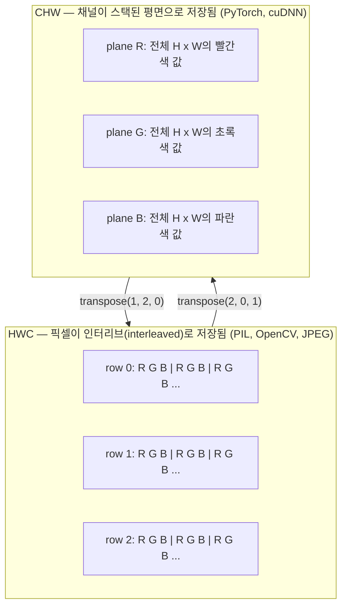

# 이미지 기초 — 픽셀, 채널, 색상 공간

> 이미지는 빛 샘플의 텐서입니다. 여러분이 사용하는 모든 비전 모델은 이 하나의 사실에서 시작합니다.

**유형:** Build
**언어:** Python
**선수 요건:** 1단계 12강 (텐서 연산), 3단계 11강 (PyTorch 입문)
**시간:** 약 45분

## 학습 목표

- 연속적인 장면이 픽셀로 이산화되는 방식을 설명하고, 샘플링 및 양자화 결정이 모든 후속 모델의 상한을 설정하는 이유를 이해해 보세요
- NumPy 배열로서 이미지를 읽고, 슬라이스하고, 검사하며, HWC와 CHW 레이아웃 사이를 유연하게 전환해 보세요
- RGB, 그레이스케일, HSV, YCbCr 간 변환을 수행하고 각 색상 공간이 존재하는 이유를 정당화해 보세요
- 사전 학습된 PyTorch 비전 모델이 기대하는 대로 픽셀 수준 전처리(정규화, 표준화, 리사이즈, 채널 우선)를 적용해 보세요

## 문제점

여러분이 읽는 모든 논문, 다운로드하는 모든 사전 학습 가중치, 호출하는 모든 비전 API는 입력의 특정 인코딩을 가정합니다. 모델이 `float32`을 원하는데 `uint8` 이미지를 전달하면 실행은 되지만 — 조용히 쓰레기 데이터를 생성합니다. RGB로 학습된 네트워크에 BGR을 입력하면 정확도가 10포인트 떨어집니다. 채널 우선 입력을 기대하는 모델에 채널 마지막 입력을 넘겨주면 첫 번째 conv 레이어는 높이를 특징 채널로 취급합니다. 이 모든 것은 오류를 발생시키지 않습니다. 단지 지표가 망가지고, 파일 로드 방식에 있는 버그를 찾아 헤매는 데 일주일을 낭비하게 됩니다.

컨볼루션이 무엇을 슬라이딩하는지 알면 복잡하지 않습니다. 어려운 부분은 "이미지"가 카메라, JPEG 디코더, PIL, OpenCV, torchvision, CUDA 커널마다 다른 것을 의미한다는 점입니다. 각 스택은 자체적인 축 순서, 바이트 범위, 채널 규약을 가지고 있습니다. 이것들을 명확히 구분하지 못하는 비전 엔지니어는 고장난 파이프라인을 출시하게 됩니다.

이 강의는 기초를 고정하여 나머지 단계가 그 위에 구축할 수 있도록 합니다. 끝날 무렵에는 픽셀이 무엇인지, 왜 픽셀당 하나의 숫자 대신 세 개의 숫자가 있는지, "ImageNet 통계로 정규화"가 실제로 무엇을 하는지, 그리고 이 단계의 다른 모든 강의가 가정하는 두세 가지 레이아웃 사이를 이동하는 방법을 알게 될 것입니다.

## 개념

### 전체 전처리 파이프라인 한눈에 보기

모든 프로덕션 비전 시스템은 가역적 변환의 동일한 순서로 구성됩니다. 한 단계를 잘못하면 모델이 학습 시와 다른 입력을 보게 됩니다.

```mermaid
flowchart LR
    A["이미지 파일<br/>(JPEG/PNG)"] --> B["디코딩<br/>uint8 HWC"]
    B --> C["색상 공간 변환<br/>(RGB/BGR/YCbCr)"]
    C --> D["리사이즈<br/>짧은 변 기준"]
    D --> E["중앙 크롭<br/>모델 크기"]
    E --> F["255로 나누기<br/>float32 [0,1]"]
    F --> G["평균 빼기<br/>표준편차로 나누기"]
    G --> H["전치<br/>HWC → CHW"]
    H --> I["배치<br/>CHW → NCHW"]
    I --> J["Model"]

    style A fill:#fef3c7,stroke:#d97706
    style J fill:#ddd6fe,stroke:#7c3aed
    style G fill:#fecaca,stroke:#dc2626
    style H fill:#bfdbfe,stroke:#2563eb
```



빨간색과 파란색 상자는 조용한 실패의 80%가 발생하는 지점입니다: 표준화 누락과 잘못된 레이아웃.

### 픽셀은 샘플이지, 정사각형이 아닙니다

카메라 센서는 미세한 검출기 격자에 도달하는 광자를 세는 장치입니다. 각 검출기는 짧은 시간 동안 빛을 적분하고, 도달한 광자 수에 비례하는 전압을 방출합니다. 센서는 이 전압을 정수 값으로 이산화합니다. 하나의 검출기가 하나의 픽셀이 됩니다.

```
Continuous scene                 Sensor grid                     Digital image
(infinite detail)                (H x W detectors)               (H x W integers)

    ~~~~~                        +--+--+--+--+--+                 210 198 180 155 120
   ~   ~   ~                     |  |  |  |  |  |                 205 195 178 152 118
  ~ light ~      ---->           +--+--+--+--+--+     ---->       200 190 175 150 115
   ~~~~~                         |  |  |  |  |  |                 195 185 170 148 112
                                 +--+--+--+--+--+                 188 180 165 145 108
```

이 단계에서 두 가지 선택이 이루어지며, 이는 이후 모든 단계의 상한을 결정합니다:

- **공간 샘플링**은 장면의 각 도당 검출기 수를 결정합니다. 너무 적으면 가장자리가 들쭉날쭉해집니다(에이리어싱). 너무 많으면 저장 및 연산 비용이 급증합니다.
- **강도 양자화**는 전압을 얼마나 세밀하게 구분하는지 결정합니다. 8비트는 256단계로, 디스플레이 표준입니다. 10, 12, 16비트는 더 매끄러운 그라디언트를 제공하며, 의료 영상, HDR, 원시 센서 파이프라인에서 중요합니다.

픽셀은 면적을 가진 유색 정사각형이 아닙니다. 하나의 측정값입니다. 리사이즈하거나 회전할 때, 이 측정 격자를 재샘플링하는 것입니다.

### 왜 세 개의 채널인가

하나의 검출기는 가시 스펙트럼 전체의 광자를 세며, 이는 그레이스케일입니다. 색상을 얻기 위해 센서는 격자를 빨강, 초록, 파랑 필터의 모자이크로 덮습니다. 디모자이킹 후, 모든 공간 위치는 세 개의 정수를 가집니다: 빨강 필터 검출기, 초록 필터 검출기, 파랑 필터 검출기의 근접 응답입니다. 이 세 정수가 픽셀의 RGB 삼중항입니다.

```
One pixel in memory:

    (R, G, B) = (210, 140, 30)   <- reddish-orange

An H x W RGB image:

    shape (H, W, 3)     stored as   H rows of W pixels of 3 values
                                    each in [0, 255] for uint8
```

3은 마법이 아닙니다. 깊이 카메라는 Z 채널을 추가합니다. 위성은 적외선 및 자외선 밴드를 추가합니다. 의료 스캔은 보통 하나의 채널(X-ray, CT) 또는 여러 채널(초분광)을 가집니다. 채널 수는 마지막 축이며, 합성곱 레이어는 이 축을 따라 혼합을 학습합니다.

### 두 가지 레이아웃 규약: HWC와 CHW

동일한 텐서, 두 가지 순서. 모든 라이브러리는 하나를 선택합니다.

```
HWC (height, width, channels)           CHW (channels, height, width)

   W ->                                    H ->
  +-----+-----+-----+                     +-----+-----+
H |R G B|R G B|R G B|                   C |R R R R R R|
| +-----+-----+-----+                   | +-----+-----+
v |R G B|R G B|R G B|                   v |G G G G G G|
  +-----+-----+-----+                     +-----+-----+
                                          |B B B B B B|
                                          +-----+-----+

   PIL, OpenCV, matplotlib,              PyTorch, most deep learning
   almost every image file on disk       frameworks, cuDNN kernels
```

CHW는 합성곱 커널이 H와 W를 따라 슬라이딩하기 때문에 존재합니다. 채널 축을 먼저 유지하면 각 커널이 채널별로 연속적인 2D 평면을 보게 되어 벡터화가 깔끔하게 수행됩니다. 디스크 형식은 HWC를 유지하는데, 이는 센서에서 스캔라인이 나오는 방식과 일치하기 때문입니다.

천 번은 입력하게 될 한 줄 변환:

```
img_chw = img_hwc.transpose(2, 0, 1)      # NumPy
img_chw = img_hwc.permute(2, 0, 1)        # PyTorch 텐서
```

메모리 레이아웃, 시각화:



### 바이트 범위와 dtype

세 가지 규약이 지배적입니다:

| 규약 | dtype | 범위 | 어디서 볼 수 있는지 |
|------------|-------|-------|------------------|
| Raw | `uint8` | [0, 255] | 디스크 파일, PIL, OpenCV 출력 |
| Normalized | `float32` | [0.0, 1.0] | `img.astype('float32') / 255` 이후 |
| Standardized | `float32` | 대략 [-2, +2] | 평균을 빼고 표준 편차로 나눈 후 |

합성곱 신경망은 표준화된 입력으로 학습되었습니다. ImageNet 통계 `mean=[0.485, 0.456, 0.406]`, `std=[0.229, 0.224, 0.225]`은 [0, 1]로 정규화된 픽셀에 대해 전체 ImageNet 학습 세트의 세 채널에 대한 산술 평균과 표준 편차입니다. 표준화된 float를 기대하는 모델에 원시 `uint8`를 입력하는 것은 적용 비전 분야에서 가장 흔한 조용한 실패입니다.

### 색상 공간과 그 존재 이유

RGB는 캡처 형식이지만, 모델에 항상 가장 유용한 표현은 아닙니다.

```
 RGB               HSV                       YCbCr / YUV

 R red             H hue (angle 0-360)       Y luminance (brightness)
 G green           S saturation (0-1)        Cb chroma blue-yellow
 B blue            V value/brightness (0-1)  Cr chroma red-green

 Linear to         Separates color from      Separates brightness from
 sensor output     brightness. Useful for    color. JPEG and most video
                   color thresholding, UI    codecs compress the chroma
                   sliders, simple filters   channels harder because the
                                             human eye is less sensitive
                                             to chroma detail than to Y.
```

대부분의 최신 CNN은 RGB를 입력으로 받습니다. 다음 경우 다른 색상 공간을 만나게 됩니다:

- **HSV** — 고전적인 CV 코드, 색상 기반 분할, 화이트 밸런싱.
- **YCbCr** — JPEG 내부 구조 읽기, 비디오 파이프라인, Y 채널만 사용하는 초해상도 모델.
- **그레이스케일** — OCR, 문서 모델, 색상이 신호가 아닌 잡음 변수인 모든 경우.

RGB에서 그레이스케일로 변환하는 것은 가중 합이며 평균이 아닙니다. 인간의 눈은 빨간색이나 파란색보다 초록색에 더 민감하기 때문입니다:

```
Y = 0.299 R + 0.587 G + 0.114 B       (ITU-R BT.601, the classic weights)
```

### 종횡비, 리사이징 및 보간

모든 모델은 고정된 입력 크기를 가집니다 (대부분의 ImageNet 분류기는 224x224, 최신 검출기는 384x384 또는 512x512). 이미지들이 이 크기와 일치하는 경우는 드뭅니다. 중요한 세 가지 리사이징 선택지:

- **짧은 변을 리사이징한 후 중앙 크롭** — 표준 ImageNet 레시피. 종횡비를 보존하며, 가장자리 픽셀 스트립을 버립니다.
- **리사이징 후 패딩** — 종횡비와 모든 픽셀을 보존하며, 검은색 바를 추가합니다. 검출 및 OCR의 표준입니다.
- **타겟 크기로 직접 리사이징** — 이미지를 늘립니다. 저렴하지만 기하학을 왜곡하며, 많은 분류 작업에는 적합합니다.

보간 방법은 새로운 그리드가 이전 그리드와 정렬되지 않을 때 중간 픽셀을 계산하는 방식을 결정합니다:

```
Nearest neighbour     fastest, blocky, only choice for masks/labels
Bilinear              fast, smooth, default for most image resizing
Bicubic               slower, sharper on upscaling
Lanczos               slowest, best quality, used for final display
```

경험칙: 학습에는 바이리니어(bilinear), 볼 자산에는 바이큐빅(bicubic) 또는 란초스(lanczos), 정수 클래스 ID가 포함된 모든 것에는 니어스트(nearest)를 사용하세요.

```figure
conv-output-size
```

## 구현하기

### 1단계: 이미지 텐서를 구축하고 그 모양을 검사하세요

첫 실험이 NumPy만으로 오프라인에서 실행되도록 결정적인 합성 이미지로 시작하세요. 파일 디코딩은 별도의 경계입니다: JPEG 또는 PNG 디코더가 RGB 바이트를 반환하면, 아래 모든 텐서 연산은 동일합니다.

```python
import numpy as np

def synthetic_rgb(h=128, w=192, seed=0):
    rng = np.random.default_rng(seed)
    yy, xx = np.meshgrid(np.linspace(0, 1, h), np.linspace(0, 1, w), indexing="ij")
    r = (np.sin(xx * 6) * 0.5 + 0.5) * 255
    g = yy * 255
    b = (1 - yy) * xx * 255
    rgb = np.stack([r, g, b], axis=-1) + rng.normal(0, 6, (h, w, 3))
    return np.clip(rgb, 0, 255).astype(np.uint8)

arr = synthetic_rgb()

print(f"type:   {type(arr).__name__}")
print(f"dtype:  {arr.dtype}")
print(f"shape:  {arr.shape}     # (H, W, C)")
print(f"min:    {arr.min()}")
print(f"max:    {arr.max()}")
print(f"pixel at (0, 0): {arr[0, 0]}")
```

예상 출력: `shape: (H, W, 3)`, `dtype: uint8`, 범위 `[0, 255]`. 이는 바이트가 카메라, 이미지 디코더, 또는 이 합성 생성기에서 왔든 상관없이 표준화된 디코딩된 표현입니다.

### 2단계: 채널을 분리하고 레이아웃을 재순서화하세요

R, G, B를 각각 추출한 후, PyTorch를 위해 HWC에서 CHW로 변환하세요.

```python
R = arr[:, :, 0]
G = arr[:, :, 1]
B = arr[:, :, 2]
print(f"R shape: {R.shape}, mean: {R.mean():.1f}")
print(f"G shape: {G.shape}, mean: {G.mean():.1f}")
print(f"B shape: {B.shape}, mean: {B.mean():.1f}")

arr_chw = arr.transpose(2, 0, 1)
print(f"\nHWC shape: {arr.shape}")
print(f"CHW shape: {arr_chw.shape}")
```

세 개의 그레이스케일 평면, 채널당 하나씩. CHW는 축 순서를 재배열할 뿐이며, 메모리 레이아웃이 허용한다면 데이터 복사가 엄격히 필요하지 않습니다.

### 3단계: 그레이스케일 및 HSV 변환

가중치 합산 그레이스케일, 그 다음 수동으로 RGB-to-HSV 변환.

```python
def rgb_to_grayscale(rgb):
    weights = np.array([0.299, 0.587, 0.114], dtype=np.float32)
    return (rgb.astype(np.float32) @ weights).astype(np.uint8)

def rgb_to_hsv(rgb):
    rgb_f = rgb.astype(np.float32) / 255.0
    r, g, b = rgb_f[..., 0], rgb_f[..., 1], rgb_f[..., 2]
    cmax = np.max(rgb_f, axis=-1)
    cmin = np.min(rgb_f, axis=-1)
    delta = cmax - cmin

    h = np.zeros_like(cmax)
    mask = delta > 0
    argmax = np.argmax(rgb_f, axis=-1)
    rmax = mask & (argmax == 0)
    gmax = mask & (argmax == 1)
    bmax = mask & (argmax == 2)
    h[rmax] = ((g[rmax] - b[rmax]) / delta[rmax]) % 6
    h[gmax] = ((b[gmax] - r[gmax]) / delta[gmax]) + 2
    h[bmax] = ((r[bmax] - g[bmax]) / delta[bmax]) + 4
    h = h * 60.0

    s = np.divide(delta, cmax, out=np.zeros_like(delta), where=cmax > 0)
    v = cmax
    return np.stack([h, s, v], axis=-1)

gray = rgb_to_grayscale(arr)
hsv = rgb_to_hsv(arr)
print(f"gray shape: {gray.shape}, range: [{gray.min()}, {gray.max()}]")
print(f"hsv   shape: {hsv.shape}")
print(f"hue range: [{hsv[..., 0].min():.1f}, {hsv[..., 0].max():.1f}] degrees")
print(f"sat range: [{hsv[..., 1].min():.2f}, {hsv[..., 1].max():.2f}]")
print(f"val range: [{hsv[..., 2].min():.2f}, {hsv[..., 2].max():.2f}]")
```

색조(Hue)는 도수(degrees)로, 채도(Saturation)와 명도(Value)는 [0, 1] 범위로 출력됩니다. 이는 OpenCV `hsv_full` 규약과 일치합니다.

### 4단계: 정규화, 표준화 및 역변환

원시 바이트를 사전 학습된 ImageNet 모델이 기대하는 정확한 텐서로 변환한 후, 다시 역변환합니다.

```python
mean = np.array([0.485, 0.456, 0.406], dtype=np.float32)
std = np.array([0.229, 0.224, 0.225], dtype=np.float32)

def preprocess_imagenet(rgb_uint8):
    x = rgb_uint8.astype(np.float32) / 255.0
    x = (x - mean) / std
    x = x.transpose(2, 0, 1)
    return x

def deprocess_imagenet(chw_float32):
    x = chw_float32.transpose(1, 2, 0)
    x = x * std + mean
    x = np.clip(x * 255.0, 0, 255).astype(np.uint8)
    return x

x = preprocess_imagenet(arr)
print(f"preprocessed shape: {x.shape}     # (C, H, W)")
print(f"preprocessed dtype: {x.dtype}")
print(f"preprocessed mean per channel:  {x.mean(axis=(1, 2)).round(3)}")
print(f"preprocessed std  per channel:  {x.std(axis=(1, 2)).round(3)}")

roundtrip = deprocess_imagenet(x)
max_diff = np.abs(roundtrip.astype(int) - arr.astype(int)).max()
print(f"roundtrip max pixel diff: {max_diff}    # 0 또는 1이어야 합니다")
```

채널별 평균은 0에 가깝고, 표준 편차는 1에 가까워야 합니다. 전처리/후처리 쌍은 모든 torchvision `transforms.Normalize` 호출이 내부적으로 수행하는 작업과 정확히 동일합니다.

### 5단계: 처음부터 리사이즈하기

최근접 이웃(Nearest neighbor)은 각 출력 좌표를 하나의 소스 픽셀로 반올림합니다. 쌍선형 보간(Bilinear interpolation)은 네 개의 주변 픽셀을 찾아 거리로 블렌딩합니다. 아래 두 구현 모두 끝점 정렬 좌표를 사용하므로 첫 번째와 마지막 소스 픽셀은 고정됩니다.

```python
def resize_coordinates(source_length, target_length):
    if target_length == 1:
        return np.zeros(1, dtype=np.float32)
    return np.linspace(0, source_length - 1, target_length, dtype=np.float32)

def nearest_resize(image, target_height, target_width):
    y = np.rint(resize_coordinates(image.shape[0], target_height)).astype(int)
    x = np.rint(resize_coordinates(image.shape[1], target_width)).astype(int)
    return image[y[:, None], x[None, :]]

def bilinear_resize(image, target_height, target_width):
    y = resize_coordinates(image.shape[0], target_height)
    x = resize_coordinates(image.shape[1], target_width)
    y0 = np.floor(y).astype(int)
    x0 = np.floor(x).astype(int)
    y1 = np.minimum(y0 + 1, image.shape[0] - 1)
    x1 = np.minimum(x0 + 1, image.shape[1] - 1)
    wy = (y - y0)[:, None, None]
    wx = (x - x0)[None, :, None]

    source = image.astype(np.float32)
    top = source[y0[:, None], x0[None, :]] * (1 - wx)
    top += source[y0[:, None], x1[None, :]] * wx
    bottom = source[y1[:, None], x0[None, :]] * (1 - wx)
    bottom += source[y1[:, None], x1[None, :]] * wx
    result = top * (1 - wy) + bottom * wy
    return np.clip(np.rint(result), 0, 255).astype(image.dtype)

target_height = arr.shape[0] * 3
target_width = arr.shape[1] * 3
nearest = nearest_resize(arr, target_height, target_width)
bilinear = bilinear_resize(arr, target_height, target_width)

def local_roughness(x):
    gy = np.diff(x.astype(float), axis=0)
    gx = np.diff(x.astype(float), axis=1)
    return float(np.abs(gy).mean() + np.abs(gx).mean())

for name, out in [("nearest", nearest), ("bilinear", bilinear)]:
    print(f"{name:>8}  shape={out.shape}  roughness={local_roughness(out):6.2f}")
```

최근접 이웃은 하드 엣지를 유지하므로 거친 정도(roughness) 점수가 가장 높습니다. 쌍선형은 각 축에서 두 위치를 블렌딩하므로 더 매끄럽습니다. 실행 가능한 동반 코드는 동일한 분리 가능한(separable) 아이디어를 Catmull-Rom 큐비크 커널로 각 축당 네 개의 이웃으로 확장한 후, 이미지 라이브러리 없이 세 가지 결과를 모두 출력합니다.

## 사용하기

PyTorch는 배치된 디바이스 인식 텐서에서 동일한 연산을 수행합니다. 아래 코드는 짧은 변을 리사이즈하고, 중앙 크롭을 취하고, 각 채널을 표준화하며, 사전 학습된 모델이 기대하는 NCHW 텐서를 생성합니다.

```python
import torch
import torch.nn.functional as F

image_hwc = torch.from_numpy(synthetic_rgb(256, 320))
batch = image_hwc.permute(2, 0, 1).unsqueeze(0).float() / 255.0

height, width = batch.shape[-2:]
scale = 256 / min(height, width)
resized_height = round(height * scale)
resized_width = round(width * scale)
batch = F.interpolate(
    batch,
    size=(resized_height, resized_width),
    mode="bilinear",
    align_corners=False,
    antialias=True,
)

top = (resized_height - 224) // 2
left = (resized_width - 224) // 2
batch = batch[:, :, top:top + 224, left:left + 224]

mean = torch.tensor([0.485, 0.456, 0.406]).view(1, 3, 1, 1)
std = torch.tensor([0.229, 0.224, 0.225]).view(1, 3, 1, 1)
batch = (batch - mean) / std

print(f"tensor dtype: {batch.dtype}")
print(f"batched shape: {tuple(batch.shape)}")
print(f"per-channel mean: {batch.mean(dim=(0, 2, 3)).tolist()}")
print(f"per-channel std:  {batch.std(dim=(0, 2, 3)).tolist()}")
```

네 단계, 이 정확한 순서로: 바이트를 float로 변환하고 HWC를 NCHW로 스왑, 짧은 변을 256으로 리사이즈, 224x224 중앙 크롭을 취한 후, ImageNet 평균을 빼고 표준 편차로 나눕니다. 이 순서를 역으로 하면 모델에 도달하는 내용이 조용히 변경됩니다.

## 출시하기

이 강의는 다음을 생성합니다:

- `outputs/prompt-vision-preprocessing-audit.md` — 팀이 준수해야 하는 정확한 전처리 불변 조건에 대한 체크리스트로 모든 모델 카드나 데이터셋 카드를 변환하는 프롬프트.
- `outputs/skill-image-tensor-inspector.md` — 이미지 형태의 텐서나 배열이 주어지면 dtype, 레이아웃, 범위, 그리고 원본(raw), 정규화(normalized), 표준화(standardized) 중 어떤 상태인지 보고하는 스킬입니다.

## 연습 문제

1. **(쉬움)** 네 가지 서로 다른 색상을 가진 2x2 RGB `uint8` 배열을 만들어 보세요. HWC를 CHW로 변환하고 다시 되돌린 후, 두 형상의 크기를 출력하고 왕복 변환이 모든 값을 보존함을 증명해 보세요.
2. **(중간)** `standardize(img, mean, std)`와 그 역변환을 작성하여, 임의의 uint8 이미지에서 `roundtrip_max_diff <= 1` 테스트를 통과하도록 해 보세요. 작성한 함수는 HWC 형식의 단일 이미지와 NCHW 형식의 배치 모두에서 동일한 호출로 작동해야 합니다.
3. **(어려움)** 3채널 ImageNet 표준화 텐서를 가져와 RGB의 가중 혼합을 단일 그레이스케일 채널로 학습하는 1x1 컨볼루션을 실행해 보세요. 가중치를 `[0.299, 0.587, 0.114]`으로 초기화하고 고정(freeze)한 후, 출력 결과가 수동으로 계산한 `rgb_to_grayscale`과 부동 소수점 오차 범위 내에서 일치함을 확인해 보세요. 다른 고전적인 색상 공간 변환은 1x1 컨볼루션으로 표현할 수 있는 것이 무엇인가요?

## 핵심 용어

| 용어 | 사람들이 말하는 것 | 실제 의미 |
|------|----------------|----------------------|
| 픽셀(Pixel) | "색이 있는 정사각형" | 한 격자 위치에서의 빛 강도 샘플 하나 — 색상은 세 개의 숫자, 그레이스케일은 하나의 숫자 |
| 채널(Channel) | "색상" | 이미지 텐서로 쌓아 올린 병렬 공간 격자 중 하나; HWC에서는 마지막 축, CHW에서는 첫 번째 축 |
| HWC / CHW | "형상(shape)" | 이미지 텐서의 축 순서; 디스크와 PIL은 HWC를, PyTorch와 cuDNN은 CHW를 사용 |
| 정규화(Normalize) | "이미지를 스케일링" | 픽셀이 [0, 1] 범위에 있도록 255로 나누는 것 — 필요하지만 충분하지는 않음 |
| 표준화(Standardize) | "0 중심화" | 채널별로 평균을 빼고 표준 편차로 나누어, 입력 분포가 모델이 학습된 분포와 일치하도록 함 |
| 그레이스케일 변환 | "채널 평균" | 인간의 밝기 지각과 일치하는 0.299/0.587/0.114 계수를 사용한 가중 합 |
| 보간(Interpolation) | "리사이즈가 픽셀을 선택하는 방법" | 새로운 격자가 기존 격자와 정렬되지 않을 때 출력 값을 결정하는 규칙 — 레이블에는 nearest, 학습에는 bilinear, 표시에는 bicubic |
| 종횡비(Aspect ratio) | "너비 대 높이" | "리사이즈 후 패딩"과 "리사이즈 후 늘리기"를 구분하는 비율 |

## 추가 읽기

- [Charles Poynton — A Guided Tour of Color Space](https://web.archive.org/web/20251220000525/https://poynton.ca/PDFs/Guided_tour.pdf) — 색상 공간이 왜 이렇게 많은지, 그리고 각각이 언제 중요한지에 대한 가장 명확한 기술적 설명입니다
- [PyTorch Vision Transforms Docs](https://pytorch.org/vision/stable/transforms.html) — 실제 프로덕션 환경에서 구성하게 될 변환의 전체 파이프라인입니다
- [How JPEG Works (Colt McAnlis)](https://www.youtube.com/watch?v=F1kYBnY6mwg) — 크로마 서브샘플링, DCT, 그리고 JPEG가 RGB가 아닌 YCbCr을 인코딩하는 이유를 날카롭게 시각적으로 안내합니다
- [ImageNet Preprocessing Conventions (torchvision models)](https://pytorch.org/vision/stable/models.html) — `mean=[0.485, 0.456, 0.406]`의 원천이며, zoo의 모든 모델이 이를 기대하는 이유입니다
