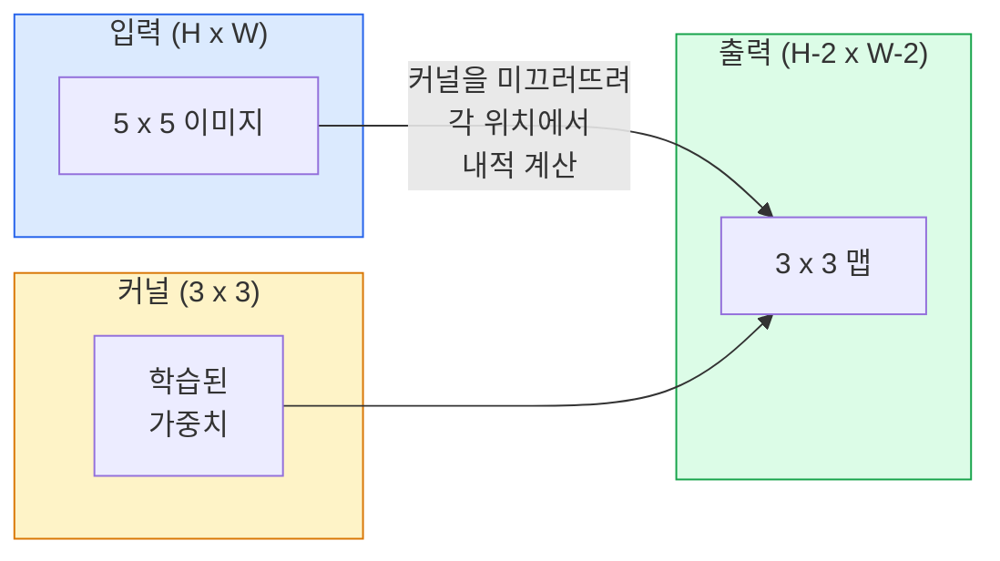
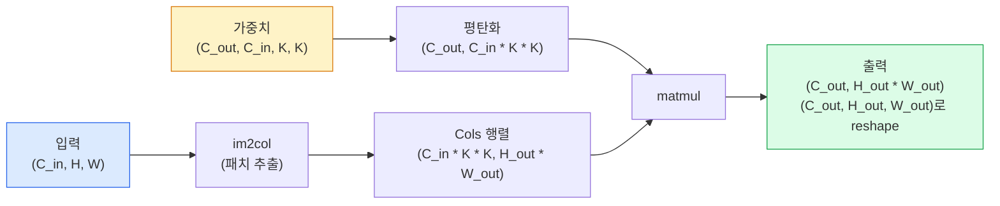

# 처음부터 만드는 합성곱 (Convolutions from Scratch)

> 합성곱(convolution)은 이미지 위를 미끄러뜨리는 작은 완전연결 층으로, 모든 위치에서 같은 가중치를 공유합니다.

**Type:** Build
**Languages:** Python
**Prerequisites:** Phase 3 (Deep Learning Core), Phase 4 Lesson 01 (Image Fundamentals)
**Time:** ~75 minutes

## 학습 목표 (Learning Objectives)

- NumPy만으로 2D 합성곱을 처음부터 구현합니다. 중첩 루프 버전과 벡터화된 `im2col` 버전을 포함합니다
- 입력 크기, 커널 크기, 패딩, 스트라이드의 어떤 조합에 대해서도 출력 공간 크기를 계산하고, `(H - K + 2P) / S + 1` 공식을 정당화합니다
- 커널(가장자리, 블러, 샤픈, Sobel)을 손으로 설계하고, 각각이 왜 그런 활성화 패턴을 내는지 설명합니다
- 합성곱을 쌓아 특징 추출기로 만들고, 스택 깊이와 수용 영역(receptive field) 크기를 연결합니다

## 문제 상황 (The Problem)

224x224 RGB 이미지에 완전연결 층을 쓰면 뉴런당 224 * 224 * 3 = 150,528개 입력 가중치가 필요합니다. 은닉 유닛 1,000개짜리 층 하나만으로도 이미 1억 5천만 파라미터입니다 — 유용한 것을 배우기도 전에. 더 나쁘게도, 그 층은 왼쪽 위의 개와 오른쪽 아래의 개가 같은 패턴이라는 개념이 없습니다. 모든 픽셀 위치를 독립으로 취급하는데, 이미지에는 정확히 틀린 가정입니다: 고양이를 세 픽셀 옮겨도 네트워크가 개념을 다시 배우게 해서는 안 됩니다.

이미지 모델에 필요한 두 성질은 **이동 등변성(translation equivariance)** (입력이 밀리면 출력도 밀림)과 **파라미터 공유(parameter sharing)** (같은 특징 검출기가 어디서나 동작)입니다. 완전연결 층은 둘 다 주지 않습니다. 합성곱은 둘 다 공짜로 줍니다.

합성곱은 딥러닝을 위해 발명된 것이 아닙니다. JPEG 압축, Photoshop의 가우시안 블러, 산업 비전의 가장자리 검출, 출시된 모든 오디오 필터를 구동하는 같은 연산입니다. CNN이 2012부터 2020까지 ImageNet을 지배한 이유는, 근처 값이 관련되고 같은 패턴이 어디에나 나타날 수 있는 데이터에 대해 합성곱이 올바른 사전(prior)이기 때문입니다.

## 핵심 개념 (The Concept)

### 하나의 커널, 미끄러짐

2D 합성곱은 커널(또는 필터)이라 불리는 작은 가중치 행렬을 입력 위로 미끄러뜨리고, 각 위치에서 요소별 곱의 합을 계산합니다. 그 합이 출력 픽셀 하나가 됩니다.



5x5 입력에 대한 구체적인 3x3 예제(패딩 없음, 스트라이드 1):

```
Input X (5 x 5):                Kernel W (3 x 3):

  1  2  0  1  2                   1  0 -1
  0  1  3  1  0                   2  0 -2
  2  1  0  2  1                   1  0 -1
  1  0  2  1  3
  2  1  1  0  1

The kernel slides across every valid 3 x 3 window. Output Y is 3 x 3:

 Y[0,0] = sum( W * X[0:3, 0:3] )
 Y[0,1] = sum( W * X[0:3, 1:4] )
 Y[0,2] = sum( W * X[0:3, 2:5] )
 Y[1,0] = sum( W * X[1:4, 0:3] )
 ... and so on
```

그 한 공식 — **공유 가중치, 지역성, 슬라이딩 윈도우** — 가 전부입니다. 나머지는 장부 정리입니다.

### 출력 크기 공식

입력 공간 크기 `H`, 커널 크기 `K`, 패딩 `P`, 스트라이드 `S`가 주어지면:

```
H_out = floor( (H - K + 2P) / S ) + 1
```

외우세요. 아키텍처당 수십 번 계산하게 됩니다.

| Scenario | H | K | P | S | H_out |
|----------|---|---|---|---|-------|
| Valid conv, no padding | 32 | 3 | 0 | 1 | 30 |
| Same conv (preserves size) | 32 | 3 | 1 | 1 | 32 |
| Downsample by 2 | 32 | 3 | 1 | 2 | 16 |
| Pool 2x2 | 32 | 2 | 0 | 2 | 16 |
| Large receptive field | 32 | 7 | 3 | 2 | 16 |

"Same padding"은 S == 1일 때 H_out == H가 되도록 P를 고르는 것입니다. 홀수 K에서는 P = (K - 1) / 2입니다. 3x3 커널이 지배적인 이유입니다 — 중심이 있는 가장 작은 홀수 커널이기 때문입니다.

### 패딩 (Padding)

패딩이 없으면 모든 합성곱이 특징 맵을 줄입니다. 20개를 쌓으면 224x224 이미지가 184x184가 되어, 경계에서 연산을 낭비하고 형태가 맞아야 하는 잔차 연결을 복잡하게 만듭니다.

```
Zero padding (P = 1) on a 5 x 5 input:

  0  0  0  0  0  0  0
  0  1  2  0  1  2  0
  0  0  1  3  1  0  0
  0  2  1  0  2  1  0       Now the kernel can centre on pixel
  0  1  0  2  1  3  0       (0, 0) and still have three rows and
  0  2  1  1  0  1  0       three columns of values to multiply.
  0  0  0  0  0  0  0
```

실무에서 만나는 모드: `zero`(가장 흔함), `reflect`(가장자리를 거울처럼, 생성 모델에서 딱딱한 경계를 피함), `replicate`(가장자리 복사), `circular`(토로이달 문제에서 쓰는 순환).

### 스트라이드 (Stride)

스트라이드는 슬라이드의 걸음 크기입니다. `stride=1`이 기본입니다. `stride=2`는 공간 차원을 반으로 줄이며, 별도 풀링 층 없이 CNN 안에서 다운샘플하는 고전적 방법입니다 — 모든 현대 아키텍처(ResNet, ConvNeXt, MobileNet)가 어딘가에서 max-pool 대신 스트라이드 conv를 씁니다.

```
Stride 1 on a 5 x 5 input, 3 x 3 kernel:

  starts: (0,0) (0,1) (0,2)        -> output row 0
          (1,0) (1,1) (1,2)        -> output row 1
          (2,0) (2,1) (2,2)        -> output row 2

  Output: 3 x 3

Stride 2 on the same input:

  starts: (0,0) (0,2)              -> output row 0
          (2,0) (2,2)              -> output row 1

  Output: 2 x 2
```

### 다중 입력 채널

실제 이미지는 채널이 셋입니다. RGB 입력의 3x3 합성곱은 실제로 3x3x3 볼륨입니다: 입력 채널당 3x3 슬라이스 하나. 각 공간 위치에서 세 슬라이스 전체에 곱하고 합한 뒤 편향을 더합니다.

```
Input:   (C_in,  H,  W)        3 x 5 x 5
Kernel:  (C_in,  K,  K)        3 x 3 x 3 (one kernel)
Output:  (1,     H', W')       2D map

For a layer that produces C_out output channels, you stack C_out kernels:

Weight:  (C_out, C_in, K, K)   e.g. 64 x 3 x 3 x 3
Output:  (C_out, H', W')       64 x 3 x 3

Parameter count: C_out * C_in * K * K + C_out   (the + C_out is biases)
```

마지막 줄이 모델을 계획할 때 계산하는 것입니다. 3채널 입력에 64채널 3x3 conv는 `64 * 3 * 3 * 3 + 64 = 1,792` 파라미터입니다. 쌉니다.

### im2col 트릭

중첩 루프는 읽기 쉽지만 느립니다. GPU는 큰 행렬곱을 원합니다. 트릭: 입력의 모든 수용 영역 윈도우를 큰 행렬의 한 열로 펼치고, 커널을 한 행으로 펼치면, 전체 합성곱이 단일 matmul이 됩니다.



모든 프로덕션 conv 구현은 이것의 어떤 변형에 캐시 타일링 트릭(direct conv, Winograd, 큰 커널용 FFT conv)을 더한 것입니다. im2col을 이해하면 핵심을 이해합니다.

### 수용 영역 (Receptive field)

단일 3x3 conv는 입력 픽셀 9개를 봅니다. 3x3 conv 두 개를 쌓으면 두 번째 층의 뉴런은 입력 픽셀 5x5를 봅니다. 3x3 세 개는 7x7입니다. 일반적으로:

```
RF after L stacked K x K convs (stride 1) = 1 + L * (K - 1)

With strides:   RF grows multiplicatively with stride along each layer.
```

"끝까지 3x3"(VGG, ResNet, ConvNeXt)이 동작하는 전체 이유는, 3x3 conv 두 개가 5x5 conv 하나와 같은 입력 영역을 보지만 파라미터가 더 적고 사이에 비선형성이 하나 더 있기 때문입니다.

```figure
convolution-kernel
```

## 직접 만들기 (Build It)

### 1단계: 배열에 패딩하기

가장 작은 원시 연산부터: H x W 배열 주변에 0을 채우는 함수.

```python
import numpy as np

def pad2d(x, p):
    if p == 0:
        return x
    h, w = x.shape[-2:]
    out = np.zeros(x.shape[:-2] + (h + 2 * p, w + 2 * p), dtype=x.dtype)
    out[..., p:p + h, p:p + w] = x
    return out

x = np.arange(9).reshape(3, 3)
print(x)
print()
print(pad2d(x, 1))
```

뒤쪽 축 트릭 `x.shape[:-2]` 덕분에 같은 함수가 `(H, W)`, `(C, H, W)`, `(N, C, H, W)`에서 수정 없이 동작합니다.

### 2단계: 중첩 루프로 2D 합성곱

참조 구현 — 느리지만 모호하지 않습니다. 원칙적으로 `torch.nn.functional.conv2d`가 하는 일입니다.

```python
def conv2d_naive(x, w, b=None, stride=1, padding=0):
    c_in, h, w_in = x.shape
    c_out, c_in_w, kh, kw = w.shape
    assert c_in == c_in_w

    x_pad = pad2d(x, padding)
    h_out = (h + 2 * padding - kh) // stride + 1
    w_out = (w_in + 2 * padding - kw) // stride + 1

    out = np.zeros((c_out, h_out, w_out), dtype=np.float32)
    for oc in range(c_out):
        for i in range(h_out):
            for j in range(w_out):
                hs = i * stride
                ws = j * stride
                patch = x_pad[:, hs:hs + kh, ws:ws + kw]
                out[oc, i, j] = np.sum(patch * w[oc])
        if b is not None:
            out[oc] += b[oc]
    return out
```

중첩 루프 네 개(출력 채널, 행, 열, 그리고 C_in, kh, kw에 대한 암묵적 합). 더 빠른 모든 구현을 이 정답에 대조합니다.

### 3단계: 손으로 설계한 커널로 검증

수직 Sobel 커널을 만들고, 합성 계단 이미지에 적용한 뒤, 수직 가장자리가 밝아지는 것을 봅니다.

```python
def synthetic_step_image():
    img = np.zeros((1, 16, 16), dtype=np.float32)
    img[:, :, 8:] = 1.0
    return img

sobel_x = np.array([
    [[-1, 0, 1],
     [-2, 0, 2],
     [-1, 0, 1]]
], dtype=np.float32)[None]

x = synthetic_step_image()
y = conv2d_naive(x, sobel_x, padding=1)
print(y[0].round(1))
```

열 7에서 큰 양수 값(왼쪽에서 오른쪽으로 밝기 증가)과 나머지에서 0을 기대하세요. 그 한 줄 출력이 수식이 맞다는 건전성 검사입니다.

### 4단계: im2col

입력의 모든 커널 크기 윈도우를 행렬의 한 열로 변환합니다. `C_in=3, K=3`이면 각 열은 숫자 27개입니다.

```python
def im2col(x, kh, kw, stride=1, padding=0):
    c_in, h, w = x.shape
    x_pad = pad2d(x, padding)
    h_out = (h + 2 * padding - kh) // stride + 1
    w_out = (w + 2 * padding - kw) // stride + 1

    cols = np.zeros((c_in * kh * kw, h_out * w_out), dtype=x.dtype)
    col = 0
    for i in range(h_out):
        for j in range(w_out):
            hs = i * stride
            ws = j * stride
            patch = x_pad[:, hs:hs + kh, ws:ws + kw]
            cols[:, col] = patch.reshape(-1)
            col += 1
    return cols, h_out, w_out
```

여전히 Python 루프이지만, 무거운 일은 이제 단일 벡터화 matmul이 됩니다.

### 5단계: im2col + matmul로 빠른 conv

사중 루프를 한 번의 행렬곱으로 바꿉니다.

```python
def conv2d_im2col(x, w, b=None, stride=1, padding=0):
    c_out, c_in, kh, kw = w.shape
    cols, h_out, w_out = im2col(x, kh, kw, stride, padding)
    w_flat = w.reshape(c_out, -1)
    out = w_flat @ cols
    if b is not None:
        out += b[:, None]
    return out.reshape(c_out, h_out, w_out)
```

정확성 검사: 두 구현을 모두 실행하고 비교합니다.

```python
rng = np.random.default_rng(0)
x = rng.normal(0, 1, (3, 16, 16)).astype(np.float32)
w = rng.normal(0, 1, (8, 3, 3, 3)).astype(np.float32)
b = rng.normal(0, 1, (8,)).astype(np.float32)

y_naive = conv2d_naive(x, w, b, padding=1)
y_im2col = conv2d_im2col(x, w, b, padding=1)

print(f"max abs diff: {np.max(np.abs(y_naive - y_im2col)):.2e}")
```

`max abs diff`는 대략 `1e-5`여야 합니다 — 차이는 부동소수점 누적 순서이지 버그가 아닙니다.

### 6단계: 손으로 설계한 커널 뱅크

학습 전에 단일 conv 층이 무엇을 표현할 수 있는지 보여주는 필터 다섯 개.

```python
KERNELS = {
    "identity": np.array([[0, 0, 0], [0, 1, 0], [0, 0, 0]], dtype=np.float32),
    "blur_3x3": np.ones((3, 3), dtype=np.float32) / 9.0,
    "sharpen": np.array([[0, -1, 0], [-1, 5, -1], [0, -1, 0]], dtype=np.float32),
    "sobel_x": np.array([[-1, 0, 1], [-2, 0, 2], [-1, 0, 1]], dtype=np.float32),
    "sobel_y": np.array([[-1, -2, -1], [0, 0, 0], [1, 2, 1]], dtype=np.float32),
}

def apply_kernel(img2d, kernel):
    x = img2d[None].astype(np.float32)
    w = kernel[None, None]
    return conv2d_im2col(x, w, padding=1)[0]
```

어떤 그레이스케일 이미지에든, blur는 부드럽게, sharpen은 가장자리를 선명하게, Sobel-x는 수직 가장자리를, Sobel-y는 수평 가장자리를 밝힙니다. 이것들이 AlexNet과 VGG의 *첫* 학습된 conv 층이 결국 배운 패턴과 정확히 같습니다 — 좋은 이미지 모델은 이후 작업이 무엇이든 가장자리와 blob 검출기가 필요하기 때문입니다.

## 활용하기 (Use It)

PyTorch의 `nn.Conv2d`는 같은 연산을 autograd, CUDA 커널, cuDNN 최적화로 감쌉니다. shape 의미는 동일합니다.

```python
import torch
import torch.nn as nn

conv = nn.Conv2d(in_channels=3, out_channels=64, kernel_size=3, stride=1, padding=1)
print(conv)
print(f"weight shape: {tuple(conv.weight.shape)}   # (C_out, C_in, K, K)")
print(f"bias shape:   {tuple(conv.bias.shape)}")
print(f"param count:  {sum(p.numel() for p in conv.parameters())}")

x = torch.randn(8, 3, 224, 224)
y = conv(x)
print(f"\ninput  shape: {tuple(x.shape)}")
print(f"output shape: {tuple(y.shape)}")
```

`padding=1`을 `padding=0`으로 바꾸면 출력이 222x222로 줄고, `stride=1`을 `stride=2`로 바꾸면 112x112로 줍니다. 위에서 외운 같은 공식입니다.

## 산출물 (Ship It)

이 레슨이 만드는 것:

- `outputs/prompt-cnn-architect.md` — 입력 크기, 파라미터 예산, 목표 수용 영역이 주어지면 매 단계에 맞는 K/S/P로 `Conv2d` 층 스택을 설계하는 프롬프트.
- `outputs/skill-conv-shape-calculator.md` — 네트워크 스펙을 층별로 따라가며 모든 블록의 출력 shape, 수용 영역, 파라미터 수를 반환하는 스킬.

## 연습 문제 (Exercises)

1. **(Easy)** 128x128 그레이스케일 입력과 `[Conv3x3(s=1,p=1), Conv3x3(s=2,p=1), Conv3x3(s=1,p=1), Conv3x3(s=2,p=1)]` 스택이 주어지면, 각 층의 출력 공간 크기와 수용 영역을 손으로 계산하세요. 더미 conv의 PyTorch `nn.Sequential`로 검증하세요.
2. **(Medium)** `conv2d_naive`와 `conv2d_im2col`에 `groups` 인자를 받도록 확장하세요. `groups=C_in=C_out`이 depthwise 합성곱을 재현하고, 파라미터 수가 `C * C * K * K`가 아니라 `C * K * K`임을 보이세요.
3. **(Hard)** `conv2d_im2col`의 역전파를 손으로 구현하세요: 출력 기울기가 주어지면 `x`와 `w`의 기울기를 계산합니다. 같은 입력·가중치에서 `torch.autograd.grad`와 대조하세요. 트릭: im2col의 기울기는 `col2im`이고, 겹치는 윈도우를 누적해야 합니다.

## 핵심 용어 (Key Terms)

| Term | What people say | What it actually means |
|------|----------------|----------------------|
| Convolution | "필터를 미끄러뜨림" | 공유 가중치로 모든 공간 위치에 적용되는 학습 가능한 내적; 수학적으로는 상호상관(cross-correlation)이지만 모두 합성곱이라 부름 |
| Kernel / filter | "특징 검출기" | 입력 윈도우와의 내적으로 출력 픽셀 하나를 만드는 shape (C_in, K, K)의 작은 가중치 텐서 |
| Stride | "얼마나 멀리 점프" | 연속 커널 배치 사이의 걸음; 스트라이드 2는 각 공간 차원을 반으로 |
| Padding | "가장자리에 0" | 커널이 경계 픽셀에 중심을 둘 수 있게 입력 주변에 더하는 값; `same` 패딩은 출력 크기를 입력과 같게 유지 |
| Receptive field | "뉴런이 보는 범위" | 주어진 출력 활성화가 의존하는 원본 입력 패치; 깊이와 스트라이드에 따라 커짐 |
| im2col | "GEMM 트릭" | 모든 수용 윈도우를 열로 재배열해 합성곱을 큰 행렬곱 하나로 만듦 — 모든 빠른 conv 커널의 핵심 |
| Depthwise conv | "채널당 커널 하나" | `groups == C_in`인 conv로, 각 출력 채널을 짝 맞는 입력 채널에서만 계산; MobileNet과 ConvNeXt의 백본 |
| Translation equivariance | "밀리면 밀림" | 입력을 k픽셀 밀면 출력도 k픽셀 밀리는 성질; 공유 가중치로 공짜 |

## 더 읽을거리 (Further Reading)

- [A guide to convolution arithmetic for deep learning (Dumoulin & Visin, 2016)](https://arxiv.org/abs/1603.07285) — 모든 코스가 조용히 베끼는 패딩/스트라이드/팽창의 결정판 다이어그램
- [CS231n: Convolutional Neural Networks for Visual Recognition](https://cs231n.github.io/convolutional-networks/) — 원조 im2col 설명을 포함한 표준 강의 노트
- [The Annotated ConvNet (fast.ai)](https://nbviewer.org/github/fastai/fastbook/blob/master/13_convolutions.ipynb) — 수동 합성곱에서 학습된 숫자 분류기까지 가는 노트북
- [Receptive Field Arithmetic for CNNs (Dang Ha The Hien)](https://distill.pub/2019/computing-receptive-fields/) — 수용 영역 계산의 논문급 인터랙티브 해설
