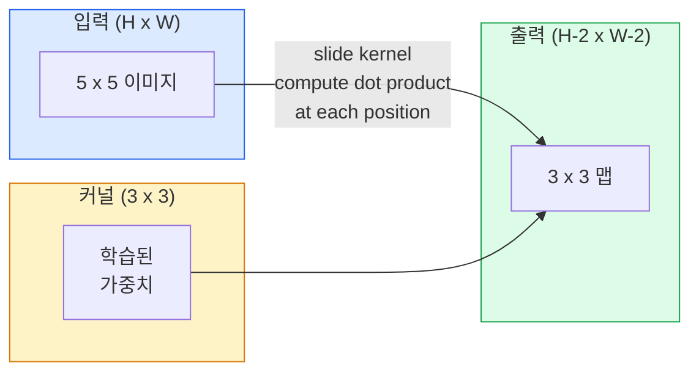
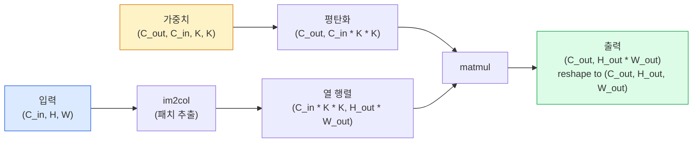

# 처음부터 컨볼루션 구현하기

> 컨볼루션은 이미지를 슬라이딩하며 동일한 가중치를 모든 위치에 공유하는 작은 밀집 레이어입니다.

**유형:** Build
**언어:** Python
**선수 요건:** 3단계 (딥러닝 코어), 4단계 01강 (이미지 기초)
**시간:** 약 75분

## 학습 목표

- NumPy만 사용하여 중첩 루프 버전과 벡터화된 `im2col` 버전을 포함해 2D 컨볼루션을 처음부터 구현해 보세요
- 입력 크기, 커널 크기, 패딩, 스트라이드의 모든 조합에 대해 출력 공간 크기를 계산하고 `(H - K + 2P) / S + 1` 공식을 정당화해 보세요
- 커널(엣지, 블러, 샤프닝, Sobel)을 직접 설계하고 각각이 왜 특정한 활성화 패턴을 생성하는지 설명해 보세요
- 컨볼루션을 스택하여 기능 추출기를 구성하고 스택의 깊이가 수용 필드(receptive field)의 크기와 어떻게 연결되는지 연결해 보세요

## 문제점

224x224 RGB 이미지에 완전 연결 레이어를 적용하려면 뉴런당 224 * 224 * 3 = 150,528개의 입력 가중치가 필요합니다. 1,000개 유닛을 가진 단일 은닉 레이어만으로도 이미 1억 5천만 개의 매개변수가 되며, 유용한 것을 학습하기 전입니다. 더 나쁜 점은, 이 레이어는 좌상단에 있는 개와 우하단에 있는 개가 동일한 패턴이라는 개념이 없다는 것입니다. 모든 픽셀 위치를 독립적으로 취급하는데, 이는 이미지에는 정확히 잘못된 접근입니다. 고양이를 3픽셀 이동시켰다고 해서 네트워크가 개념을 다시 학습해야 할 필요는 없습니다.

이미지 모델이 필요로 하는 두 가지 속성은 **번역 등변성**(입력이 이동하면 출력도 이동함)과 **매개변수 공유**(동일한 특징 검출기가 모든 위치에서 실행됨)입니다. 밀집 레이어는 이 두 가지를 모두 제공하지 못합니다. 컨볼루션은 이 두 가지를 무료로 제공합니다.

컨볼루션은 딥러닝을 위해 발명된 것이 아닙니다. JPEG 압축, Photoshop의 가우시안 블러, 산업용 비전의 엣지 검출, 그리고 출시된 모든 오디오 필터를 구동하는 것과 동일한 연산입니다. CNN이 2012년부터 2020년까지 ImageNet을 지배한 이유는, 가까운 값들이 관련되어 있고 동일한 패턴이 어디에서나 나타날 수 있는 데이터에 대해 컨볼루션이 올바른 사전 분포(prior)이기 때문입니다.

## 개념

### 하나의 커널, 슬라이딩

2D 합성곱은 커널(또는 필터)이라 불리는 작은 가중치 행렬을 받아 입력 위에 슬라이딩하며, 각 위치에서 원소별 곱의 합을 계산합니다. 그 합이 하나의 출력 픽셀이 됩니다.



5x5 입력에 대한 구체적인 3x3 예제 (패딩 없음, 스트라이드 1):

```
Input X (5 x 5):                Kernel W (3 x 3):

  1  2  0  1  2                   1  0 -1
  0  1  3  1  0                   2  0 -2
  2  1  0  2  1                   1  0 -1
  1  0  2  1  3
  2  1  1  0  1

The kernel slides across every valid 3 x 3 window. Output Y is 3 x 3:

 Y[0,0] = sum( W * X[0:3, 0:3] )
 Y[0,1] = sum( W * X[0:3, 1:4] )
 Y[0,2] = sum( W * X[0:3, 2:5] )
 Y[1,0] = sum( W * X[1:4, 0:3] )
 ... and so on
```

이 하나의 공식 — **공유 가중치, 지역성, 슬라이딩 윈도우** — 이 전체 아이디어입니다. 나머지는 모두 기록 관리(bookkeeping)입니다.

### 출력 크기 공식

입력 공간 크기 `H`, 커널 크기 `K`, 패딩 `P`, 스트라이드 `S`가 주어졌을 때:

```
H_out = floor( (H - K + 2P) / S ) + 1
```

이것을 암기하세요. 아키텍처마다 수십 번 계산하게 될 것입니다.

| 시나리오 | H | K | P | S | H_out |
|----------|---|---|---|---|-------|
| 유효 합성곱, 패딩 없음 | 32 | 3 | 0 | 1 | 30 |
| Same 합성곱 (크기 보존) | 32 | 3 | 1 | 1 | 32 |
| 2배 다운샘플링 | 32 | 3 | 1 | 2 | 16 |
| 2x2 풀링 | 32 | 2 | 0 | 2 | 16 |
| 큰 수용 영역 | 32 | 7 | 3 | 2 | 16 |

"Same 패딩"은 S == 1일 때 H_out == H가 되도록 P를 선택하는 것을 의미합니다. K가 홀수인 경우, P = (K - 1) / 2입니다. 3x3 커널이 지배적인 이유는 중심을 가진 가장 작은 홀수 커널이기 때문입니다.

### 패딩

패딩이 없으면 모든 합성곱이 특징 맵을 축소합니다. 20개를 쌓으면 224x224 이미지가 184x184가 되어, 경계에서 연산이 낭비되고 형태가 일치해야 하는 잔연결(residual connections)이 복잡해집니다.

```
Zero padding (P = 1) on a 5 x 5 input:

  0  0  0  0  0  0  0
  0  1  2  0  1  2  0
  0  0  1  3  1  0  0
  0  2  1  0  2  1  0       Now the kernel can centre on pixel
  0  1  0  2  1  3  0       (0, 0) and still have three rows and
  0  2  1  1  0  1  0       three columns of values to multiply.
  0  0  0  0  0  0  0
```

실무에서 만나는 모드: `zero` (가장 흔함), `reflect` (경계를 거울로 반사, 생성 모델에서 하드 경계를 피함), `replicate` (경계를 복사), `circular` (둘레로 감싸기, 토로이드 문제에서 사용).

### 스트라이드

스트라이드는 슬라이딩의 단계 크기입니다. `stride=1`이 기본값입니다. `stride=2`은 공간 차원을 절반으로 줄이며, CNN 내부에서 별도의 풀링 레이어 없이 다운샘플링하는 고전적인 방법입니다. 모든 현대 아키텍처(ResNet, ConvNeXt, MobileNet)는 어딘가에서 max-pool 대신 스트라이드 합성곱을 사용합니다.

```
Stride 1 on a 5 x 5 input, 3 x 3 kernel:

  starts: (0,0) (0,1) (0,2)        -> output row 0
          (1,0) (1,1) (1,2)        -> output row 1
          (2,0) (2,1) (2,2)        -> output row 2

  Output: 3 x 3

Stride 2 on the same input:

  starts: (0,0) (0,2)              -> output row 0
          (2,0) (2,2)              -> output row 1

  Output: 2 x 2
```

### 다중 입력 채널

실제 이미지는 세 개의 채널을 가집니다. RGB 입력에 대한 3x3 컨볼루션은 실제로 3x3x3 부피입니다: 입력 채널마다 하나의 3x3 슬라이스가 존재합니다. 각 공간 위치에서 세 슬라이스 전체에 대해 곱셈과 합산을 수행하고 편향을 더합니다.

```
Input:   (C_in,  H,  W)        3 x 5 x 5
Kernel:  (C_in,  K,  K)        3 x 3 x 3 (one kernel)
Output:  (1,     H', W')       2D map

For a layer that produces C_out output channels, you stack C_out kernels:

Weight:  (C_out, C_in, K, K)   e.g. 64 x 3 x 3 x 3
Output:  (C_out, H', W')       64 x 3 x 3

Parameter count: C_out * C_in * K * K + C_out   (the + C_out is biases)
```

마지막 줄은 모델을 계획할 때 계산해야 하는 부분입니다. 3채널 입력에 대한 64채널 3x3 컨볼루션은 `64 * 3 * 3 * 3 + 64 = 1,792` 매개변수를 가집니다. 저렴합니다.

### im2col 트릭

중첩 루프는 읽기 쉽지만 느립니다. GPU는 큰 행렬 곱셈을 원합니다. 트릭은 다음과 같습니다: 입력의 모든 수용 필드 창을 큰 행렬의 하나의 열로 평탄화하고, 커널을 행으로 평탄화하면 전체 컨볼루션이 단일 matmul이 됩니다.



모든 프로덕션 컨볼루션 구현은 이 변형에 캐시 태일링 트릭(직접 컨볼루션, Winograd, 큰 커널용 FFT 컨볼루션)을 더한 것입니다. im2col을 이해하면 핵심을 이해하게 됩니다.

### 수용 필드

단일 3x3 컨볼루션은 9개의 입력 픽셀을 봅니다. 두 개의 3x3 컨볼루션을 쌓으면 두 번째 층의 뉴런은 5x5 입력 픽셀을 봅니다. 세 개의 3x3 컨볼루션은 7x7을 제공합니다. 일반적으로:

```
RF after L stacked K x K convs (stride 1) = 1 + L * (K - 1)

With strides:   RF grows multiplicatively with stride along each layer.
```

"3x3를 끝까지 사용"하는 방식(VGG, ResNet, ConvNeXt)이 작동하는 전체적인 이유는, 두 개의 3x3 컨볼루션이 하나의 5x5 컨볼루션과 동일한 입력 영역을 보면서도 매개변수가 적고 그 사이에 추가적인 비선형성이 존재하기 때문입니다.

```figure
convolution-kernel
```

## 구현하기

### 1단계: 배열 패딩

가장 작은 원시 요소부터 시작합니다: H x W 배열 주위를 0으로 패딩하는 함수입니다.

```python
import numpy as np

def pad2d(x, p):
    if p == 0:
        return x
    h, w = x.shape[-2:]
    out = np.zeros(x.shape[:-2] + (h + 2 * p, w + 2 * p), dtype=x.dtype)
    out[..., p:p + h, p:p + w] = x
    return out

x = np.arange(9).reshape(3, 3)
print(x)
print()
print(pad2d(x, 1))
```

후미 축 트릭 `x.shape[:-2]` 덕분에 동일한 함수가 수정 없이 `(H, W)`, `(C, H, W)`, 또는 `(N, C, H, W)`에서도 작동합니다.

### 2단계: 중첩 루프를 이용한 2D 컨볼루션

참조 구현입니다 — 느리지만 모호함이 없습니다. `torch.nn.functional.conv2d`가 원칙적으로 수행하는 작업입니다.

```python
def conv2d_naive(x, w, b=None, stride=1, padding=0):
    c_in, h, w_in = x.shape
    c_out, c_in_w, kh, kw = w.shape
    assert c_in == c_in_w

    x_pad = pad2d(x, padding)
    h_out = (h + 2 * padding - kh) // stride + 1
    w_out = (w_in + 2 * padding - kw) // stride + 1

    out = np.zeros((c_out, h_out, w_out), dtype=np.float32)
    for oc in range(c_out):
        for i in range(h_out):
            for j in range(w_out):
                hs = i * stride
                ws = j * stride
                patch = x_pad[:, hs:hs + kh, ws:ws + kw]
                out[oc, i, j] = np.sum(patch * w[oc])
        if b is not None:
            out[oc] += b[oc]
    return out
```

네 개의 중첩 루프(출력 채널, 행, 열, 그리고 C_in, kh, kw에 대한 암시적 합산 포함). 이는 모든 더 빠른 구현을 검증하는 기준이 되는 진실입니다.

### 3단계: 수동으로 설계한 커널로 검증하기

수직 Sobel 커널을 만들고, 합성 계단 이미지(synthetic step image)에 적용하여 수직 가장자리가 밝게 빛나는 것을 확인해 보세요.

```python
def synthetic_step_image():
    img = np.zeros((1, 16, 16), dtype=np.float32)
    img[:, :, 8:] = 1.0
    return img

sobel_x = np.array([
    [[-1, 0, 1],
     [-2, 0, 2],
     [-1, 0, 1]]
], dtype=np.float32)[None]

x = synthetic_step_image()
y = conv2d_naive(x, sobel_x, padding=1)
print(y[0].round(1))
```

7열(왼쪽에서 오른쪽으로 밝기가 증가하는 부분)에 큰 양의 값이 나타나고, 나머지 모든 위치는 0이 되어야 합니다. 이 한 번의 출력이 연산이 정확하다는 것을 확인하는 Sanity Check입니다.

### 4단계: im2col

입력 이미지의 모든 커널 크기 윈도우를 행렬의 열로 변환합니다. `C_in=3, K=3`의 경우, 각 열은 27개의 숫자로 구성됩니다.

```python
def im2col(x, kh, kw, stride=1, padding=0):
    c_in, h, w = x.shape
    x_pad = pad2d(x, padding)
    h_out = (h + 2 * padding - kh) // stride + 1
    w_out = (w + 2 * padding - kw) // stride + 1

    cols = np.zeros((c_in * kh * kw, h_out * w_out), dtype=x.dtype)
    col = 0
    for i in range(h_out):
        for j in range(w_out):
            hs = i * stride
            ws = j * stride
            patch = x_pad[:, hs:hs + kh, ws:ws + kw]
            cols[:, col] = patch.reshape(-1)
            col += 1
    return cols, h_out, w_out
```

여전히 Python 루프가 사용되지만, 이제 무거운 연산은 단일 벡터화된 행렬 곱(matmul)으로 수행됩니다.

### 5단계: im2col + matmul을 통한 빠른 컨볼루션

4중 루프를 하나의 행렬 곱으로 대체합니다.

```python
def conv2d_im2col(x, w, b=None, stride=1, padding=0):
    c_out, c_in, kh, kw = w.shape
    cols, h_out, w_out = im2col(x, kh, kw, stride, padding)
    w_flat = w.reshape(c_out, -1)
    out = w_flat @ cols
    if b is not None:
        out += b[:, None]
    return out.reshape(c_out, h_out, w_out)
```

정확성 검증: 두 구현을 모두 실행하고 결과를 비교합니다.

```python
rng = np.random.default_rng(0)
x = rng.normal(0, 1, (3, 16, 16)).astype(np.float32)
w = rng.normal(0, 1, (8, 3, 3, 3)).astype(np.float32)
b = rng.normal(0, 1, (8,)).astype(np.float32)

y_naive = conv2d_naive(x, w, b, padding=1)
y_im2col = conv2d_im2col(x, w, b, padding=1)

print(f"max abs diff: {np.max(np.abs(y_naive - y_im2col)):.2e}")
```

`max abs diff`는 `1e-5` 근처여야 합니다. 차이는 부동 소수점 누적 순서 때문이며, 버그가 아닙니다.

### 6단계: 수동으로 설계한 커널 뱅크

학습 전에 단일 컨볼루션 레이어가 표현할 수 있는 것을 보여주는 5가지 필터입니다.

```python
KERNELS = {
    "identity": np.array([[0, 0, 0], [0, 1, 0], [0, 0, 0]], dtype=np.float32),
    "blur_3x3": np.ones((3, 3), dtype=np.float32) / 9.0,
    "sharpen": np.array([[0, -1, 0], [-1, 5, -1], [0, -1, 0]], dtype=np.float32),
    "sobel_x": np.array([[-1, 0, 1], [-2, 0, 2], [-1, 0, 1]], dtype=np.float32),
    "sobel_y": np.array([[-1, -2, -1], [0, 0, 0], [1, 2, 1]], dtype=np.float32),
}

def apply_kernel(img2d, kernel):
    x = img2d[None].astype(np.float32)
    w = kernel[None, None]
    return conv2d_im2col(x, w, padding=1)[0]
```

임의의 그레이스케일 이미지에 적용하면, Blur는 이미지를 부드럽게 만들고, Sharpen은 가장자리를 선명하게 하며, Sobel-x는 수직 가장자리를, Sobel-y는 수평 가장자리를 밝게 빛나게 합니다. 이는 AlexNet과 VGG의 *첫 번째* 학습된 컨볼루션 레이어가 학습한 패턴과 정확히 일치합니다. 좋은 이미지 모델은 이후의 작업이 무엇이든 간에 가장자리 및 덩어리(edge and blob) 탐지기가 필요하기 때문입니다.

## 사용하기

PyTorch의 `nn.Conv2d`는 autograd, CUDA 커널, cuDNN 최적화를 포함하여 동일한 연산을 래핑합니다. Shape 의미론은 동일합니다.

```python
import torch
import torch.nn as nn

conv = nn.Conv2d(in_channels=3, out_channels=64, kernel_size=3, stride=1, padding=1)
print(conv)
print(f"weight shape: {tuple(conv.weight.shape)}   # (C_out, C_in, K, K)")
print(f"bias shape:   {tuple(conv.bias.shape)}")
print(f"param count:  {sum(p.numel() for p in conv.parameters())}")

x = torch.randn(8, 3, 224, 224)
y = conv(x)
print(f"\ninput  shape: {tuple(x.shape)}")
print(f"output shape: {tuple(y.shape)}")
```

`padding=1`를 `padding=0`로 바꾸면 출력 크기가 222x222로 줄어듭니다. `stride=1`를 `stride=2`로 바꾸면 112x112로 줄어듭니다. 위에서 암기했던 공식과 동일합니다.

## 출시하기

이 강의에서 생성되는 결과물:

- `outputs/prompt-cnn-architect.md` — 입력 크기, 매개변수 예산, 목표 수용 영역(receptive field)이 주어지면 각 단계에서 올바른 K/S/P를 가진 `Conv2d` 레이어 스택을 설계하는 프롬프트입니다.
- `outputs/skill-conv-shape-calculator.md` — 네트워크 사양을 레이어별로 순회하며 각 블록의 출력 shape, 수용 영역(receptive field), 매개변수 수를 반환하는 스킬입니다.

## 연습 문제

1. **(쉬움)** 128x128 그레이스케일 입력과 `[Conv3x3(s=1,p=1), Conv3x3(s=2,p=1), Conv3x3(s=1,p=1), Conv3x3(s=2,p=1)]` 스택이 주어졌을 때, 각 레이어의 출력 공간 크기와 수용 영역(receptive field)을 손으로 계산해 보세요. PyTorch `nn.Sequential`를 사용하여 더미 conv로 검증해 보세요.
2. **(중간)** `conv2d_naive`와 `conv2d_im2col`를 `groups` 인자를 받도록 확장하세요. `groups=C_in=C_out`가 depthwise convolution을 재현하며, 매개변수 개수가 `C * C * K * K`가 아닌 `C * K * K`임을 보여 주세요.
3. **(어려움)** `conv2d_im2col`의 역전파(backward pass)를 손으로 구현하세요: 출력의 기울기가 주어졌을 때, `x`과 `w`의 기울기를 계산하세요. 동일한 입력과 가중치로 `torch.autograd.grad`과 비교하여 검증하세요. 핵심은 im2col의 기울기가 `col2im`이며, 겹치는 윈도우를 누적해야 한다는 점입니다.

## 핵심 용어

| 용어 | 사람들이 말하는 것 | 실제 의미 |
|------|----------------|----------------------|
| Convolution | "필터를 슬라이딩하는 것" | 공유 가중치를 사용하여 모든 공간 위치에서 적용되는 학습 가능한 내적(dot product); 수학적으로는 교차 상관(cross-correlation)이지만, 모두 convolution이라고 부름 |
| Kernel / filter | "특징 검출기" | 입력 윈도우와의 내적이 하나의 출력 픽셀을 생성하는 (C_in, K, K) 형태의 작은 가중치 텐서 |
| Stride | "점프하는 거리" | 연속적인 kernel 배치 사이의 단계 크기; stride 2는 각 공간 차원을 절반으로 줄임 |
| Padding | "가장자리에 0을 채우는 것" | kernel이 가장자리 픽셀의 중심에 위치할 수 있도록 입력 주변에 추가하는 값; `same` padding은 출력 크기를 입력 크기와 동일하게 유지함 |
| Receptive field | "뉴런이 보는 범위" | 특정 출력 활성화가 의존하는 원본 입력의 패치(patch)로, 깊이와 stride에 따라 증가함 |
| im2col | "GEMM 트릭" | 모든 수용 윈도우를 열(column)로 재배열하여 convolution을 하나의 큰 행렬 곱으로 만드는 것 — 모든 빠른 conv kernel의 핵심 |
| Depthwise conv | "채널당 하나의 kernel" | `groups == C_in`를 사용하는 conv로, 각 출력 채널은 대응하는 입력 채널에서만 계산됨; MobileNet과 ConvNeXt의 백본 |
| Translation equivariance | "입력 시프트는 출력 시프트" | 입력을 k 픽셀만큼 시프트하면 출력도 k 픽셀만큼 시프트되는 성질; 공유 가중치로 인해 자연스럽게 얻어짐 |

## 추가 읽기

- [A guide to convolution arithmetic for deep learning (Dumoulin & Visin, 2016)](https://arxiv.org/abs/1603.07285) — 모든 과정이 조용히 복사하는 패딩/스트라이드/디레이션의 결정적인 다이어그램
- [CS231n: Convolutional Neural Networks for Visual Recognition](https://cs231n.github.io/convolutional-networks/) — 원본 im2col 설명을 포함한 표준 강의 노트
- [The Annotated ConvNet (fast.ai)](https://nbviewer.org/github/fastai/fastbook/blob/master/13_convolutions.ipynb) — 수동 합성곱에서 훈련된 숫자 분류기까지 안내하는 노트북
- [Receptive Field Arithmetic for CNNs (Dang Ha The Hien)](https://distill.pub/2019/computing-receptive-fields/) — 수용 영역 계산에 대한 논문 수준의 인터랙티브 설명 자료
