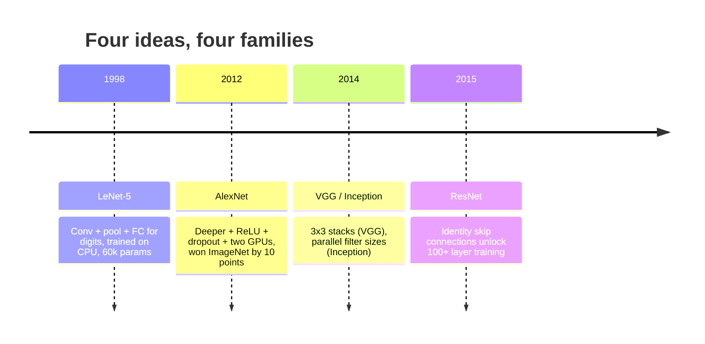
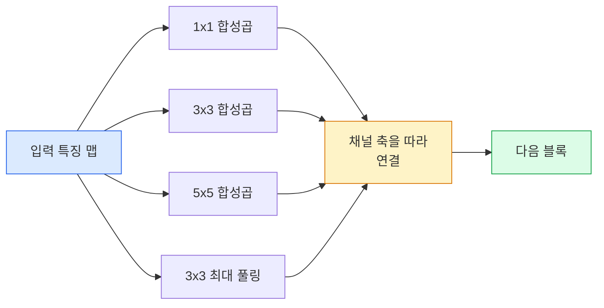
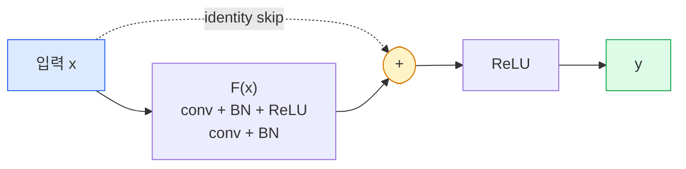

# CNN — LeNet에서 ResNet까지

> 지난 30년간의 주요 CNN은 모두 동일한 '합성곱–비선형성–다운샘플' 레시피에 하나의 새로운 아이디어가 추가된 형태입니다. 이 아이디어들을 순서대로 학습해 보세요.

**유형:** Learn + Build
**언어:** Python
**선수 요건:** 3단계 11강 (PyTorch), 4단계 01강 (이미지 기초), 4단계 02강 (처음부터 구현하는 합성곱)
**시간:** 약 75분

## 학습 목표

- LeNet-5 -> AlexNet -> VGG -> Inception -> ResNet의 아키텍처 계보를 추적하고, 각 계열이 기여한 단일한 새로운 아이디어를 설명할 수 있습니다
- PyTorch로 LeNet-5, VGG 스타일 블록, ResNet BasicBlock을 각각 40줄 미만으로 구현할 수 있습니다
- 잔연결(residual connection)이 1,000층 네트워크를 학습 불가능한 상태에서 최신(state-of-the-art) 상태로 바꾸는 이유를 설명할 수 있습니다
- 최신 백본(backbone)(ResNet-18, ResNet-50)을 읽고, 소스 코드를 보기 전에 출력 형상, 수용 영역(receptive field), 매개변수 수를 예측할 수 있습니다

## 문제점

2011년, ImageNet 분류기의 최고 top-5 정확도는 약 74%였습니다. 2012년 AlexNet은 85%를 기록했고, 2015년 ResNet은 96%를 기록했습니다. 새로운 데이터도 없었고, 새로운 GPU 세대도 없었습니다. 성능 향상은 아키텍처 아이디어에서 나왔습니다. 실무 비전 엔지니어는 어떤 아이디어가 어떤 논문에서 나왔는지 알아야 합니다. 2026년에 출시하는 모든 프로덕션 백본은 이러한 동일한 부품들의 재조합이기 때문입니다. 또한 아이디어는 계속 전이됩니다: 그룹 합성곱(grouped convs)은 CNN에서 트랜스포머로, 잔연결은 ResNet에서 모든 LLM으로, 배치 정규화(batch normalisation)는 확산 모델로 이동했습니다.

이 네트워크들을 순서대로 학습하면 흔한 실수를 방지할 수 있습니다: LeNet 크기의 네트워크로 해결할 수 있는 문제에 가장 큰 모델을 가져다 쓰는 실수입니다. MNIST에는 ResNet이 필요하지 않습니다. 각 계열의 스케일링 곡선을 알면 어디에 위치해야 할지 알 수 있습니다.

## 개념

### 비전 분야를 바꾼 네 가지 아이디어



고전적 비전 분야에서 이 네 가지 도약만큼 중요한 것은 없습니다.

### LeNet-5 (1998)

Yann LeCun의 숫자 인식기입니다. 매개변수 60,000개. 합성곱-풀링(conv-pool) 블록 두 개, 완전 연결(fully connected) 층 두 개, tanh 활성화 함수를 사용합니다. 모든 CNN이 상속하는 템플릿을 정의했습니다:

```
input (1, 32, 32)
  conv 5x5 -> (6, 28, 28)
  avg pool 2x2 -> (6, 14, 14)
  conv 5x5 -> (16, 10, 10)
  avg pool 2x2 -> (16, 5, 5)
  flatten -> 400
  dense -> 120
  dense -> 84
  dense -> 10
```

현대 세계에서 CNN이라 불리는 모든 것 — 합성곱과 다운샘플링이 번갈아 나타나며 작은 분류기 헤드로 이어지는 구조 —는 더 많은 레이어, 더 큰 채널, 더 나은 활성화 함수를 가진 LeNet입니다.

### AlexNet (2012)

ImageNet을 함께 정복한 세 가지 변화:

1. **ReLU**를 tanh 대신 사용했습니다. 기울기가 소실되지 않으며, 학습 속도가 6배 빨라집니다.
2. 완전 연결 헤드에 **Dropout**을 적용했습니다. 정규화가 트릭이 아닌 레이어가 되었습니다.
3. **깊이와 너비**. 5개의 합성곱 레이어, 3개의 밀집 레이어, 60M 매개변수, 모델을 두 GPU에 분할하여 학습했습니다.

논문 그림 2는 GPU 분할을 두 개의 병렬 스트림으로 보여줍니다. 그 병렬 처리는 하드웨어적 우회책이었을 뿐, 아키텍처적 통찰은 아니었습니다. 하지만 위의 세 가지 아이디어는 현재 사용하는 모든 모델에 남아 있습니다.

### VGG (2014)

VGG는 이렇게 물었습니다: 3x3 합성곱만 사용하고 깊게 만들면 어떻게 될까요?

```
stack:   conv 3x3 -> conv 3x3 -> pool 2x2
repeat:  16 or 19 conv layers
```

두 개의 3x3 합성곱은 하나의 5x5 합성곱과 동일한 5x5 입력 영역을 보지만, 매개변수가 더 적습니다 (2*9*C^2 = 18C^2 vs 25*C^2) 그리고 그 사이에 추가 ReLU가 있습니다. VGG는 이 관찰을 전체 아키텍처로 전환했습니다. 단순함 — 하나의 블록 유형을 반복하는 것 —은 이후 모든 것의 기준점이 되었습니다.

비용: 138M 매개변수, 학습이 느리고, 추론이 비쌉니다.

### Inception (2014, 같은 해)

Google의 "어떤 커널 크기를 사용해야 할까요?"에 대한 답은: 모두를 병렬로 사용하자는 것이었습니다.



각 브랜치는 특화됩니다 — 1x1은 채널 혼합, 3x3은 지역 텍스처, 5x5는 더 큰 패턴, 풀링은 이동 불변 특징을 담당합니다. 그리고 연결(concat)은 다음 레이어가 유용한 브랜치를 선택할 수 있게 합니다. Inception v1은 매개변수 수를 합리적으로 유지하기 위해 각 브랜치 내부에 1x1 합성곱을 병목(bottleneck)으로 사용했습니다.

### 성능 저하 문제

2015년경, VGG-19는 작동했지만 VGG-32는 작동하지 않았습니다. 깊이가 도움이 될 것으로 예상되었지만, 약 20층을 넘어서면 학습 손실과 테스트 손실 모두 악화되었습니다. 이는 과적합이 아닙니다. 모든 레이어를 거치며 기울기가 곱셈적으로 축소되어 최적화기가 유용한 가중치를 찾지 못하기 때문입니다.

```
Plain deep network:
  y = f_L( f_{L-1}( ... f_1(x) ... ) )

Gradient wrt early layer:
  dL/dW_1 = dL/dy * df_L/df_{L-1} * ... * df_2/df_1 * df_1/dW_1

Each multiplicative term has magnitude roughly (weight magnitude) * (activation gain).
Stack 100 of them with gains < 1 and the gradient is effectively zero.
```

VGG는 19층에서 작동했는데, 이는 (동시에 발표된) 배치 정규화(batch norm)가 활성값을 잘 스케일링했기 때문입니다. 하지만 배치 정규화조차도 30층 이상의 깊이를 구제할 수는 없었습니다.

### ResNet (2015)

He, Zhang, Ren, Sun은 모든 문제를 해결한 한 가지 변경 사항을 제안했습니다:

```
standard block:   y = F(x)
residual block:   y = F(x) + x
```

`+ x`는 레이어가 `F(x)`을 0으로 만들어 항상 아무것도 하지 않을 수 있음을 의미합니다. 1,000층 ResNet은 이제 1층 네트워크보다 나빠질 수 없습니다. 모든 추가 블록이 자명한 탈출구를 가지고 있기 때문입니다. 이 보장 덕분에 최적화기는 모든 블록이 *약간* 유용하도록 만들 수 있습니다. 그리고 약간 유용한 블록을 100번 쌓으면 최신(state-of-the-art) 성능이 됩니다.



블록의 두 가지 변형이 모든 곳에서 나타납니다:

- **BasicBlock** (ResNet-18, ResNet-34): 두 개의 3x3 conv, 둘을 둘러싼 스킵 연결.
- **Bottleneck** (ResNet-50, -101, -152): 1x1 다운, 3x3 중간, 1x1 업, 세 개를 둘러싼 스킵 연결. 채널 수가 많을 때 더 저렴합니다.

스킵 연결이 다운샘플링(stride=2)을 통과해야 할 때, 형태를 맞추기 위해 항등 경로(identity path)가 stride=2인 1x1 conv로 대체됩니다.

### 비전 분야를 넘어서 잔차(residual)가 중요한 이유

이 아이디어는 실제로 이미지 분류에 관한 것이 아니었습니다. 깊은 네트워크를 "손을 모으고 기울기가 살아남기를 바라는" 상태에서 신뢰할 수 있고 확장 가능한 엔지니어링 도구로 바꾸는 것에 관한 것이었습니다. 다음 단계에서 읽게 될 모든 트랜스포머는 모든 블록에 정확히 동일한 스킵 연결을 가지고 있습니다. ResNet이 없으면 GPT도 없습니다.

```figure
pooling
```

## 구현하기

### 1단계: LeNet-5

최소화된, 충실한 LeNet입니다. Tanh 활성화 함수, 평균 풀링을 사용합니다. 현대적인 요소에 대한 유일한 양보는 원본의 가우시안 연결 대신 `nn.CrossEntropyLoss`을 다운스트림에 사용하는 것입니다.

```python
import torch
import torch.nn as nn
import torch.nn.functional as F

class LeNet5(nn.Module):
    def __init__(self, num_classes=10):
        super().__init__()
        self.conv1 = nn.Conv2d(1, 6, kernel_size=5)
        self.conv2 = nn.Conv2d(6, 16, kernel_size=5)
        self.pool = nn.AvgPool2d(2)
        self.fc1 = nn.Linear(16 * 5 * 5, 120)
        self.fc2 = nn.Linear(120, 84)
        self.fc3 = nn.Linear(84, num_classes)

    def forward(self, x):
        x = self.pool(torch.tanh(self.conv1(x)))
        x = self.pool(torch.tanh(self.conv2(x)))
        x = torch.flatten(x, 1)
        x = torch.tanh(self.fc1(x))
        x = torch.tanh(self.fc2(x))
        return self.fc3(x)

net = LeNet5()
x = torch.randn(1, 1, 32, 32)
print(f"output: {net(x).shape}")
print(f"params: {sum(p.numel() for p in net.parameters()):,}")
```

예상 출력: `output: torch.Size([1, 10])`, `params: 61,706`. 이것이 현대 비전을 시작한 전체 숫자 분류기입니다.

### 2단계: VGG 블록

하나의 재사용 가능한 블록: 두 개의 3x3 conv, ReLU, 배치 정규화, 최대 풀링.

```python
class VGGBlock(nn.Module):
    def __init__(self, in_c, out_c):
        super().__init__()
        self.conv1 = nn.Conv2d(in_c, out_c, kernel_size=3, padding=1)
        self.bn1 = nn.BatchNorm2d(out_c)
        self.conv2 = nn.Conv2d(out_c, out_c, kernel_size=3, padding=1)
        self.bn2 = nn.BatchNorm2d(out_c)
        self.pool = nn.MaxPool2d(2)

    def forward(self, x):
        x = F.relu(self.bn1(self.conv1(x)))
        x = F.relu(self.bn2(self.conv2(x)))
        return self.pool(x)

class MiniVGG(nn.Module):
    def __init__(self, num_classes=10):
        super().__init__()
        self.stack = nn.Sequential(
            VGGBlock(3, 32),
            VGGBlock(32, 64),
            VGGBlock(64, 128),
        )
        self.head = nn.Sequential(
            nn.AdaptiveAvgPool2d(1),
            nn.Flatten(),
            nn.Linear(128, num_classes),
        )

    def forward(self, x):
        return self.head(self.stack(x))

net = MiniVGG()
x = torch.randn(1, 3, 32, 32)
print(f"output: {net(x).shape}")
print(f"params: {sum(p.numel() for p in net.parameters()):,}")
```

CIFAR 크기의 입력에 세 개의 VGG 블록, 적응형 풀링, 하나의 선형 레이어를 사용합니다. 약 290k개의 매개변수입니다. CIFAR-10에는 충분합니다.

### 3단계: ResNet BasicBlock

ResNet-18 및 ResNet-34의 핵심 구성 블록입니다.

```python
class BasicBlock(nn.Module):
    def __init__(self, in_c, out_c, stride=1):
        super().__init__()
        self.conv1 = nn.Conv2d(in_c, out_c, kernel_size=3, stride=stride, padding=1, bias=False)
        self.bn1 = nn.BatchNorm2d(out_c)
        self.conv2 = nn.Conv2d(out_c, out_c, kernel_size=3, stride=1, padding=1, bias=False)
        self.bn2 = nn.BatchNorm2d(out_c)
        if stride != 1 or in_c != out_c:
            self.shortcut = nn.Sequential(
                nn.Conv2d(in_c, out_c, kernel_size=1, stride=stride, bias=False),
                nn.BatchNorm2d(out_c),
            )
        else:
            self.shortcut = nn.Identity()

    def forward(self, x):
        out = F.relu(self.bn1(self.conv1(x)))
        out = self.bn2(self.conv2(out))
        out = out + self.shortcut(x)
        return F.relu(out)
```

conv 레이어의 `bias=False`은 배치 정규화(BN) 관례입니다. BN의 beta 매개변수가 이미 편향을 처리하므로, conv 편향을 추가로 포함하는 것은 낭비입니다. `shortcut`은 stride나 채널 수가 변경될 때만 실제 conv가 필요하며, 그 외의 경우에는 no-op identity로 동작합니다.

### 4단계: 작은 ResNet

네 개의 BasicBlock 그룹을 쌓아 CIFAR 크기의 입력에 작동하는 ResNet을 만드세요.

```python
class TinyResNet(nn.Module):
    def __init__(self, num_classes=10):
        super().__init__()
        self.stem = nn.Sequential(
            nn.Conv2d(3, 32, kernel_size=3, stride=1, padding=1, bias=False),
            nn.BatchNorm2d(32),
            nn.ReLU(inplace=True),
        )
        self.layer1 = self._make_group(32, 32, num_blocks=2, stride=1)
        self.layer2 = self._make_group(32, 64, num_blocks=2, stride=2)
        self.layer3 = self._make_group(64, 128, num_blocks=2, stride=2)
        self.layer4 = self._make_group(128, 256, num_blocks=2, stride=2)
        self.head = nn.Sequential(
            nn.AdaptiveAvgPool2d(1),
            nn.Flatten(),
            nn.Linear(256, num_classes),
        )

    def _make_group(self, in_c, out_c, num_blocks, stride):
        blocks = [BasicBlock(in_c, out_c, stride=stride)]
        for _ in range(num_blocks - 1):
            blocks.append(BasicBlock(out_c, out_c, stride=1))
        return nn.Sequential(*blocks)

    def forward(self, x):
        x = self.stem(x)
        x = self.layer1(x)
        x = self.layer2(x)
        x = self.layer3(x)
        x = self.layer4(x)
        return self.head(x)

net = TinyResNet()
x = torch.randn(1, 3, 32, 32)
print(f"output: {net(x).shape}")
print(f"params: {sum(p.numel() for p in net.parameters()):,}")
```

각 그룹에 두 개의 블록이 있습니다. 그룹 2, 3, 4의 시작에서 stride가 2입니다. 다운샘플링이 일어날 때마다 채널 수가 두 배로 증가합니다. 약 2.8M개의 매개변수입니다. 이는 ResNet-152까지 깔끔하게 확장되는 표준 레시피입니다.

### 5단계: 매개변수 대비 특징 효율성 비교

세 네트워크에 동일한 입력을 실행하여 매개변수 수를 비교하세요.

```python
def summary(name, net, x):
    y = net(x)
    params = sum(p.numel() for p in net.parameters())
    print(f"{name:12s}  input {tuple(x.shape)} -> output {tuple(y.shape)}  params {params:>10,}")

x = torch.randn(1, 3, 32, 32)
summary("LeNet5",     LeNet5(),       torch.randn(1, 1, 32, 32))
summary("MiniVGG",    MiniVGG(),      x)
summary("TinyResNet", TinyResNet(),   x)
```

세 모델, 세 시대, 매개변수 수의 세 자리 수 차이. CIFAR-10 정확도를 얻으려면 몇 에포크 훈련 후 대략적으로: LeNet 60%, MiniVGG 89%, TinyResNet 93%가 필요합니다.

## 사용하기

`torchvision.models`은 위의 모든 모델에 대한 사전 학습된 버전을 제공합니다. 호출 시그니처는 모든 계열에서 동일하며, 이는 백본 추상화의 핵심 목적입니다.

```python
from torchvision.models import resnet18, ResNet18_Weights, vgg16, VGG16_Weights

r18 = resnet18(weights=ResNet18_Weights.IMAGENET1K_V1)
r18.eval()

print(f"ResNet-18 params: {sum(p.numel() for p in r18.parameters()):,}")
print(r18.layer1[0])
print()

v16 = vgg16(weights=VGG16_Weights.IMAGENET1K_V1)
v16.eval()
print(f"VGG-16   params: {sum(p.numel() for p in v16.parameters()):,}")
```

ResNet-18은 11.7M개의 매개변수를 가집니다. VGG-16은 138M개입니다. ImageNet top-1 정확도는 유사합니다(69.8% vs 71.6%). 잔차 연결은 12배의 매개변수 효율성 이점을 제공합니다. 이것이 ResNet 변형이 2016년부터 ViT가 등장한 2021년까지, 그리고 연산이 제약인 실제 배포 환경에서 여전히 지배적인 이유입니다.

전이 학습의 레시피는 항상 동일합니다: 사전 학습된 모델을 로드하고, 백본을 동결하며, 분류기 헤드를 교체하세요.

```python
for p in r18.parameters():
    p.requires_grad = False
r18.fc = nn.Linear(r18.fc.in_features, 10)
```

세 줄입니다. 이제 ImageNet이 지불한 표현을 상속하는 10클래스 CIFAR 분류기가 있습니다.

## 출시하기

이 강의는 다음을 생성합니다:

- `outputs/prompt-backbone-selector.md` — 작업, 데이터셋 크기, 연산 예산에 따라 올바른 CNN 계열(LeNet/VGG/ResNet/MobileNet/ConvNeXt)을 선택하는 프롬프트입니다.
- `outputs/skill-residual-block-reviewer.md` — PyTorch 모듈을 읽고 스킵 연결 실수(스트라이드 변경 시 누락된 숏컷, 숏컷 활성화 순서, 덧셈에 대한 BN 배치)를 표시하는 스킬입니다.

## 연습 문제

1. **(쉬움)** `TinyResNet`의 매개변수를 레이어별로 손으로 세어 보세요. `sum(p.numel() for p in net.parameters())`과 비교해 보세요. 매개변수 예산의 대부분은 어디에 사용됩니까 — 컨볼루션, BN, 분류기 헤드 중 어디에 집중됩니까?
2. **(중간)** Bottleneck 블록(1x1 -> 3x3 -> 1x1, 스킵 포함)을 구현하고 이를 사용하여 CIFAR용 ResNet-50 스타일 네트워크를 구축해 보세요. `TinyResNet`과 매개변수를 비교해 보세요.
3. **(어려움)** `BasicBlock`에서 스킵 연결을 제거하고, CIFAR-10에서 34블록 "plain" 네트워크와 34블록 ResNet을 각각 10에포크 동안 학습해 보세요. 두 네트워크 모두의 에포크별 학습 손실 그래프를 그려 보세요. He et al.의 그림 1 결과인, 깊은 plain 네트워크가 얕은 쌍둥이 네트워크보다 더 높은 손실로 수렴하는 현상을 재현해 보세요.

## 핵심 용어

| 용어 | 사람들이 말하는 표현 | 실제 의미 |
|------|----------------|----------------------|
| Backbone | "모델" | 태스크 헤드에 전달되는 피처 맵을 생성하는 컨볼루션 블록 스택 |
| Residual connection | "Skip connection" | `y = F(x) + x`; F를 0으로 설정하여 옵티마이저가 항등 함수를 학습하게 하며, 이를 통해 임의의 깊이를 학습 가능하게 만듭니다 |
| BasicBlock | "스킵이 있는 두 개의 3x3 컨볼루션" | ResNet-18/34의 구성 블록: conv-BN-ReLU-conv-BN-add-ReLU |
| Bottleneck | "1x1 다운, 3x3, 1x1 업" | ResNet-50/101/152의 블록; 높은 채널 수에서도 3x3이 축소된 너비에서 실행되므로 비용이 저렴합니다 |
| Degradation problem | "더 깊으면 더 나빠짐" | 약 20개 이상의 plain 컨볼루션 레이어 이후에는 학습 및 테스트 오류가 모두 증가합니다; 더 많은 데이터가 아닌 잔차 연결로 해결됩니다 |
| Stem | "첫 번째 레이어" | 3채널 입력을 기본 피처 너비로 변환하는 초기 컨볼루션; ImageNet에서는 보통 7x7 stride 2, CIFAR에서는 3x3 stride 1을 사용합니다 |
| Head | "분류기" | 최종 backbone 블록 이후의 레이어들: adaptive pool, flatten, linear(s) |
| 전이 학습(Transfer Learning) | "사전 학습된 가중치" | ImageNet에서 학습된 backbone을 로드하고 태스크에 대해 헤드만 미세 조정하는 것 |

## 추가 읽기

- [Deep Residual Learning for Image Recognition (He et al., 2015)](https://arxiv.org/abs/1512.03385) — ResNet 논문; 모든 그림은 자세히 살펴볼 가치가 있습니다
- [Very Deep Convolutional Networks (Simonyan & Zisserman, 2014)](https://arxiv.org/abs/1409.1556) — VGG 논문; "왜 3x3인가"에 대한 최고의 참고 자료입니다
- [ImageNet Classification with Deep CNNs (Krizhevsky et al., 2012)](https://papers.nips.cc/paper_files/paper/2012/hash/c399862d3b9d6b76c8436e924a68c45b-Abstract.html) — AlexNet; 수작업 특징 추출 시대를 종결시킨 논문입니다
- [Going Deeper with Convolutions (Szegedy et al., 2014)](https://arxiv.org/abs/1409.4842) — Inception v1; 비전 트랜스포머(Vision Transformer)에서도 여전히 나타나는 병렬 필터 아이디어입니다
