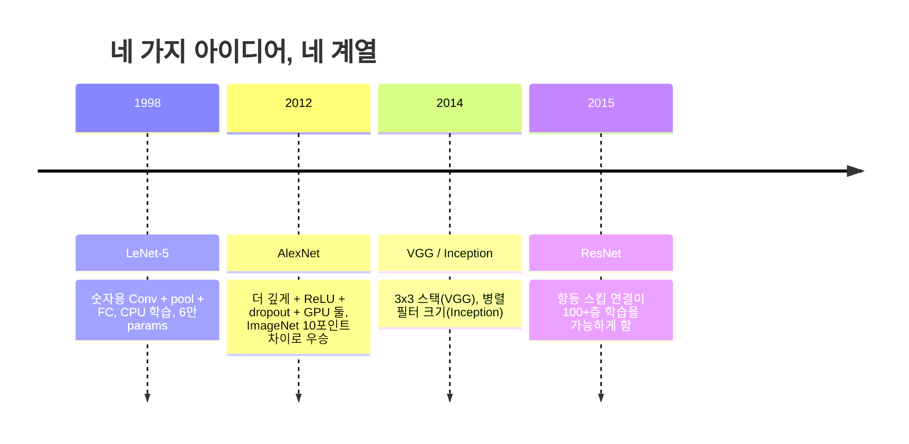
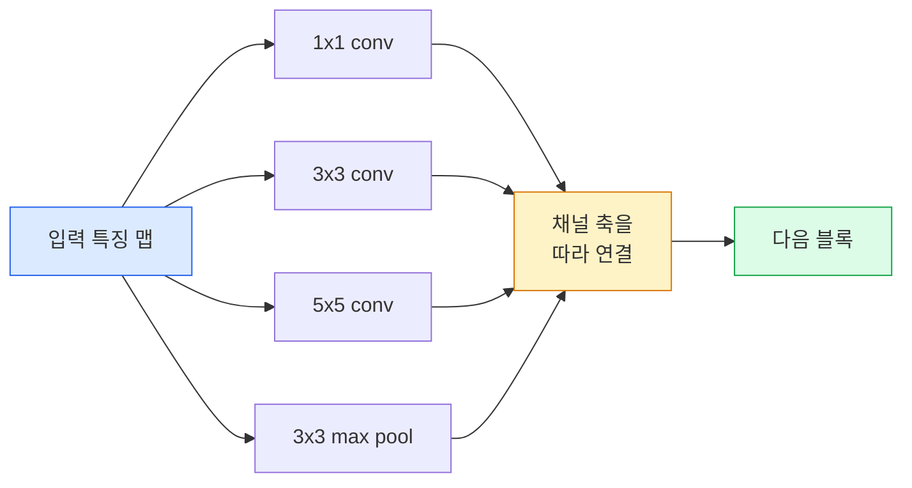
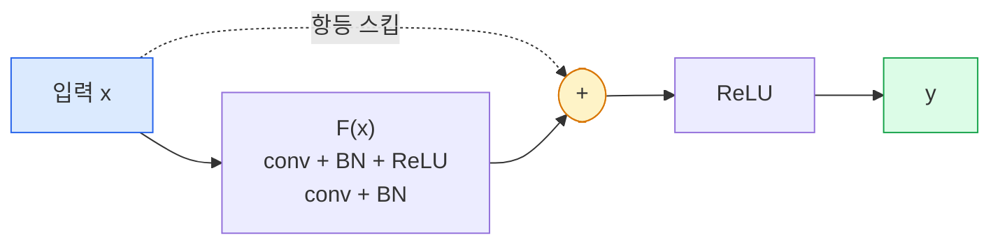

# CNN — LeNet에서 ResNet까지 (CNNs — LeNet to ResNet)

> 지난 삼십 년의 주요 CNN은 모두 같은 conv–비선형성–다운샘플 레시피에 새 아이디어 하나를 붙인 것입니다. 아이디어를 순서대로 배우세요.

**Type:** Learn + Build
**Languages:** Python
**Prerequisites:** Phase 3 Lesson 11 (PyTorch), Phase 4 Lesson 01 (Image Fundamentals), Phase 4 Lesson 02 (Convolutions from Scratch)
**Time:** ~75 minutes

## 학습 목표 (Learning Objectives)

- LeNet-5 -> AlexNet -> VGG -> Inception -> ResNet의 아키텍처 계보를 추적하고, 각 계열이 기여한 단일 새 아이디어를 말합니다
- PyTorch로 LeNet-5, VGG 스타일 블록, ResNet BasicBlock을 각각 40줄 미만으로 구현합니다
- 잔차 연결(residual connections)이 왜 1,000층 네트워크를 학습 불가능에서 최첨단으로 바꾸는지 설명합니다
- 현대 백본(ResNet-18, ResNet-50)을 읽고 소스를 보기 전에 출력 shape, 수용 영역, 파라미터 수를 예측합니다

## 문제 상황 (The Problem)

2011년 최고 ImageNet 분류기는 top-5 정확도 약 74%였습니다. 2012년 AlexNet은 85%였습니다. 2015년 ResNet은 96%였습니다. 새 데이터 없음. 새 GPU 세대 없음. 이득은 아키텍처 아이디어에서 왔습니다. 실무 비전 엔지니어는 어느 아이디어가 어느 논문에서 왔는지 알아야 합니다. 2026년에 출시하는 모든 프로덕션 백본이 같은 조각의 재조합이기 때문이고, 아이디어가 계속 전이되기 때문입니다 — 그룹 conv는 CNN에서 트랜스포머로, 잔차 연결은 ResNet에서 존재하는 모든 LLM으로, 배치 정규화는 확산 모델에 살아 있습니다.

이 네트워크를 순서대로 공부하면 흔한 실수에도 면역이 생깁니다: LeNet 크기 네트워크로 풀릴 문제에 가장 큰 모델을 집는 것. MNIST에는 ResNet이 필요 없습니다. 각 계열의 스케일 곡선을 알면 어디에 앉을지 알 수 있습니다.

## 핵심 개념 (The Concept)

### 비전을 바꾼 네 가지 아이디어



고전 비전에서 이 네 번의 점프만큼 중요한 것은 없었습니다.

### LeNet-5 (1998)

Yann LeCun의 숫자 인식기. 파라미터 60,000개. conv-pool 블록 둘, 완전연결 층 둘, tanh 활성화. 모든 CNN이 물려받는 템플릿을 정의했습니다:

```
input (1, 32, 32)
  conv 5x5 -> (6, 28, 28)
  avg pool 2x2 -> (6, 14, 14)
  conv 5x5 -> (16, 10, 10)
  avg pool 2x2 -> (16, 5, 5)
  flatten -> 400
  dense -> 120
  dense -> 84
  dense -> 10
```

현대 세계가 CNN이라 부르는 모든 것 — 작은 분류기 헤드로 이어지는 교차 합성곱과 다운샘플 — 은 층이 더 많고, 채널이 더 크고, 활성화가 더 나은 LeNet입니다.

### AlexNet (2012)

함께 ImageNet을 깬 세 가지 변화:

1. **ReLU** — tanh 대신. 기울기가 사라지지 않습니다. 학습이 대략 6배 빨라집니다.
2. **Dropout** — 완전연결 헤드에서. 정규화가 트릭이 아니라 층이 됩니다.
3. **깊이와 폭**. conv 층 다섯, dense 층 셋, 파라미터 6천만, 모델을 나눠 두 GPU에서 학습.

논문의 Figure 2는 여전히 GPU 분할을 두 병렬 스트림으로 보여 줍니다. 그 병렬성은 하드웨어 우회이지 아키텍처 통찰은 아니었지만 — 위 세 아이디어는 지금도 쓰는 모든 모델에 있습니다.

### VGG (2014)

VGG가 물은 질문: 3x3 합성곱만 쓰고 깊게 가면 어떻게 되는가?

```
stack:   conv 3x3 -> conv 3x3 -> pool 2x2
repeat:  16 or 19 conv layers
```

3x3 conv 두 개는 5x5 conv 하나와 같은 5x5 입력 영역을 보지만 파라미터가 더 적고(2*9*C^2 = 18C^2 vs 25*C^2) 사이에 ReLU가 하나 더 있습니다. VGG는 이 관찰을 전체 아키텍처로 만들었습니다. 단순함 — 블록 타입 하나, 반복 — 이 이후 모든 것의 기준점이 되었습니다.

비용: 파라미터 1억 3800만, 학습 느림, 추론 비쌈.

### Inception (2014, 같은 해)

"어떤 커널 크기를 써야 하나?"에 대한 Google의 답: 전부, 병렬로.



각 가지가 전문화합니다 — 1x1은 채널 혼합, 3x3은 지역 텍스처, 5x5는 더 큰 패턴, 풀링은 이동 불변 특징 — 그리고 concat으로 다음 층이 유용한 가지를 고릅니다. Inception v1은 파라미터 수를 합리적으로 유지하려고 각 가지 안에 병목으로 1x1 합성곱을 썼습니다.

### 열화 문제 (The degradation problem)

2015년까지 VGG-19는 동작했고 VGG-32는 그렇지 않았습니다. 깊이는 도움이 되어야 했지만 ~20층을 지나면 학습·테스트 손실이 모두 나빠졌습니다. 그것은 과적합이 아닙니다. 모든 층을 지나며 기울기가 곱으로 줄어들어 옵티마이저가 유용한 가중치를 찾지 못하는 것입니다.

```
Plain deep network:
  y = f_L( f_{L-1}( ... f_1(x) ... ) )

Gradient wrt early layer:
  dL/dW_1 = dL/dy * df_L/df_{L-1} * ... * df_2/df_1 * df_1/dW_1

Each multiplicative term has magnitude roughly (weight magnitude) * (activation gain).
Stack 100 of them with gains < 1 and the gradient is effectively zero.
```

VGG가 19층에서 동작한 이유는 배치 정규화(동시에 발표됨)가 활성화를 잘 스케일했기 때문입니다. 하지만 배치 정규화조차 대략 30층 이상의 깊이는 구하지 못했습니다.

### ResNet (2015)

He, Zhang, Ren, Sun은 모든 것을 고친 한 가지 변화를 제안했습니다:

```
standard block:   y = F(x)
residual block:   y = F(x) + x
```

`+ x`는 층이 `F(x)`를 0으로 몰아 아무것도 하지 않기를 항상 선택할 수 있다는 뜻입니다. 1,000층 ResNet은 이제 기껏해야 1층 네트워크만큼만 나쁘며, 모든 추가 블록에 사소한 탈출구가 있기 때문입니다. 그 보장으로 옵티마이저는 모든 블록을 *약간* 유용하게 만들려 하고 — 약간 유용한 것이 100번 쌓이면 최첨단입니다.



블록의 두 변형이 어디에나 나타납니다:

- **BasicBlock** (ResNet-18, ResNet-34): 3x3 conv 둘, 둘 주위를 스킵.
- **Bottleneck** (ResNet-50, -101, -152): 1x1 축소, 가운데 3x3, 1x1 확장, 셋 주위를 스킵. 채널 수가 많을 때 더 쌈.

스킵이 다운샘플(stride=2)을 건너야 하면, 항등 경로는 shape를 맞추는 1x1 stride=2 conv로 바뀝니다.

### 잔차가 비전 너머에서 중요한 이유

아이디어는 사실 이미지 분류에 관한 것이 아니었습니다. 깊은 네트워크를 "손가락 교차하고 기울기가 살아남기를 바라기"에서 신뢰할 수 있고 확장 가능한 공학 도구로 바꾸는 것이었습니다. 다음 페이즈에서 읽게 될 모든 트랜스포머가 모든 블록에 정확히 같은 스킵 연결을 가집니다. ResNet이 없으면 GPT도 없습니다.

```figure
pooling
```

## 직접 만들기 (Build It)

### 1단계: LeNet-5

최소한이면서 충실한 LeNet. Tanh 활성화, 평균 풀링. 현대에 대한 유일한 양보는 원본 가우시안 연결 대신 하류에서 `nn.CrossEntropyLoss`를 쓰는 것입니다.

```python
import torch
import torch.nn as nn
import torch.nn.functional as F

class LeNet5(nn.Module):
    def __init__(self, num_classes=10):
        super().__init__()
        self.conv1 = nn.Conv2d(1, 6, kernel_size=5)
        self.conv2 = nn.Conv2d(6, 16, kernel_size=5)
        self.pool = nn.AvgPool2d(2)
        self.fc1 = nn.Linear(16 * 5 * 5, 120)
        self.fc2 = nn.Linear(120, 84)
        self.fc3 = nn.Linear(84, num_classes)

    def forward(self, x):
        x = self.pool(torch.tanh(self.conv1(x)))
        x = self.pool(torch.tanh(self.conv2(x)))
        x = torch.flatten(x, 1)
        x = torch.tanh(self.fc1(x))
        x = torch.tanh(self.fc2(x))
        return self.fc3(x)

net = LeNet5()
x = torch.randn(1, 1, 32, 32)
print(f"output: {net(x).shape}")
print(f"params: {sum(p.numel() for p in net.parameters()):,}")
```

기대 출력: `output: torch.Size([1, 10])`, `params: 61,706`. 현대 비전을 시작한 전체 숫자 분류기입니다.

### 2단계: VGG 블록

재사용 가능한 블록 하나: 3x3 conv 둘, ReLU, 배치 정규화, max pool.

```python
class VGGBlock(nn.Module):
    def __init__(self, in_c, out_c):
        super().__init__()
        self.conv1 = nn.Conv2d(in_c, out_c, kernel_size=3, padding=1)
        self.bn1 = nn.BatchNorm2d(out_c)
        self.conv2 = nn.Conv2d(out_c, out_c, kernel_size=3, padding=1)
        self.bn2 = nn.BatchNorm2d(out_c)
        self.pool = nn.MaxPool2d(2)

    def forward(self, x):
        x = F.relu(self.bn1(self.conv1(x)))
        x = F.relu(self.bn2(self.conv2(x)))
        return self.pool(x)

class MiniVGG(nn.Module):
    def __init__(self, num_classes=10):
        super().__init__()
        self.stack = nn.Sequential(
            VGGBlock(3, 32),
            VGGBlock(32, 64),
            VGGBlock(64, 128),
        )
        self.head = nn.Sequential(
            nn.AdaptiveAvgPool2d(1),
            nn.Flatten(),
            nn.Linear(128, num_classes),
        )

    def forward(self, x):
        return self.head(self.stack(x))

net = MiniVGG()
x = torch.randn(1, 3, 32, 32)
print(f"output: {net(x).shape}")
print(f"params: {sum(p.numel() for p in net.parameters()):,}")
```

CIFAR 크기 입력에 VGG 블록 셋, adaptive pool, linear 층 하나. ~290k 파라미터. CIFAR-10에 충분합니다.

### 3단계: ResNet BasicBlock

ResNet-18과 ResNet-34의 핵심 빌딩 블록.

```python
class BasicBlock(nn.Module):
    def __init__(self, in_c, out_c, stride=1):
        super().__init__()
        self.conv1 = nn.Conv2d(in_c, out_c, kernel_size=3, stride=stride, padding=1, bias=False)
        self.bn1 = nn.BatchNorm2d(out_c)
        self.conv2 = nn.Conv2d(out_c, out_c, kernel_size=3, stride=1, padding=1, bias=False)
        self.bn2 = nn.BatchNorm2d(out_c)
        if stride != 1 or in_c != out_c:
            self.shortcut = nn.Sequential(
                nn.Conv2d(in_c, out_c, kernel_size=1, stride=stride, bias=False),
                nn.BatchNorm2d(out_c),
            )
        else:
            self.shortcut = nn.Identity()

    def forward(self, x):
        out = F.relu(self.bn1(self.conv1(x)))
        out = self.bn2(self.conv2(out))
        out = out + self.shortcut(x)
        return F.relu(out)
```

conv 층의 `bias=False`는 배치 정규화 관례입니다 — BN의 beta 파라미터가 이미 편향을 처리하므로 conv bias까지 두는 것은 낭비입니다. `shortcut`은 스트라이드나 채널 수가 바뀔 때만 실제 conv가 필요하고, 아니면 no-op 항등입니다.

### 4단계: 작은 ResNet

BasicBlock 네 그룹을 쌓아 CIFAR 크기 입력용 동작하는 ResNet을 만듭니다.

```python
class TinyResNet(nn.Module):
    def __init__(self, num_classes=10):
        super().__init__()
        self.stem = nn.Sequential(
            nn.Conv2d(3, 32, kernel_size=3, stride=1, padding=1, bias=False),
            nn.BatchNorm2d(32),
            nn.ReLU(inplace=True),
        )
        self.layer1 = self._make_group(32, 32, num_blocks=2, stride=1)
        self.layer2 = self._make_group(32, 64, num_blocks=2, stride=2)
        self.layer3 = self._make_group(64, 128, num_blocks=2, stride=2)
        self.layer4 = self._make_group(128, 256, num_blocks=2, stride=2)
        self.head = nn.Sequential(
            nn.AdaptiveAvgPool2d(1),
            nn.Flatten(),
            nn.Linear(256, num_classes),
        )

    def _make_group(self, in_c, out_c, num_blocks, stride):
        blocks = [BasicBlock(in_c, out_c, stride=stride)]
        for _ in range(num_blocks - 1):
            blocks.append(BasicBlock(out_c, out_c, stride=1))
        return nn.Sequential(*blocks)

    def forward(self, x):
        x = self.stem(x)
        x = self.layer1(x)
        x = self.layer2(x)
        x = self.layer3(x)
        x = self.layer4(x)
        return self.head(x)

net = TinyResNet()
x = torch.randn(1, 3, 32, 32)
print(f"output: {net(x).shape}")
print(f"params: {sum(p.numel() for p in net.parameters()):,}")
```

각 그룹에 블록 둘씩 네 그룹. 그룹 2, 3, 4 시작에 스트라이드 2. 다운샘플마다 채널 수 두 배. 대략 2.8M 파라미터. ResNet-152까지 깔끔하게 스케일하는 표준 레시피입니다.

### 5단계: 파라미터 대 특징 효율 비교

같은 입력을 세 네트워크에 넣고 파라미터 수를 비교합니다.

```python
def summary(name, net, x):
    y = net(x)
    params = sum(p.numel() for p in net.parameters())
    print(f"{name:12s}  input {tuple(x.shape)} -> output {tuple(y.shape)}  params {params:>10,}")

x = torch.randn(1, 3, 32, 32)
summary("LeNet5",     LeNet5(),       torch.randn(1, 1, 32, 32))
summary("MiniVGG",    MiniVGG(),      x)
summary("TinyResNet", TinyResNet(),   x)
```

모델 셋, 시대 셋, 파라미터 수에서 세 자릿수 차이. CIFAR-10 정확도에는 대략: LeNet 60%, MiniVGG 89%, TinyResNet 93%(몇 에폭 학습 후)가 필요합니다.

## 활용하기 (Use It)

`torchvision.models`가 위 모두의 사전학습 버전을 줍니다. 호출 시그니처는 계열 간에 동일하며, 그것이 백본 추상화의 요점입니다.

```python
from torchvision.models import resnet18, ResNet18_Weights, vgg16, VGG16_Weights

r18 = resnet18(weights=ResNet18_Weights.IMAGENET1K_V1)
r18.eval()

print(f"ResNet-18 params: {sum(p.numel() for p in r18.parameters()):,}")
print(r18.layer1[0])
print()

v16 = vgg16(weights=VGG16_Weights.IMAGENET1K_V1)
v16.eval()
print(f"VGG-16   params: {sum(p.numel() for p in v16.parameters()):,}")
```

ResNet-18은 파라미터 11.7M. VGG-16은 138M. 비슷한 ImageNet top-1 정확도(69.8% vs 71.6%). 잔차 연결이 12배 파라미터 효율을 삽니다. ResNet 변형이 2016부터 2021 ViT 등장까지 지배한 — 그리고 연산이 제약인 실세계 배포에서 여전히 지배하는 — 이유입니다.

전이 학습의 레시피는 항상 같습니다: 사전학습 로드, 백본 동결, 분류기 헤드 교체.

```python
for p in r18.parameters():
    p.requires_grad = False
r18.fc = nn.Linear(r18.fc.in_features, 10)
```

세 줄. 이제 ImageNet이 비용을 지불한 표현을 물려받은 10클래스 CIFAR 분류기가 있습니다.

## 산출물 (Ship It)

이 레슨이 만드는 것:

- `outputs/prompt-backbone-selector.md` — 작업, 데이터셋 크기, 연산 예산이 주어지면 맞는 CNN 계열(LeNet/VGG/ResNet/MobileNet/ConvNeXt)을 고르는 프롬프트.
- `outputs/skill-residual-block-reviewer.md` — PyTorch 모듈을 읽고 스킵 연결 실수(스트라이드 변경 시 숏컷 누락, 숏컷 활성화 순서, 덧셈 대비 BN 배치)를 표시하는 스킬.

## 연습 문제 (Exercises)

1. **(Easy)** `TinyResNet`의 파라미터를 층별로 손으로 세세요. `sum(p.numel() for p in net.parameters())`와 비교하세요. 파라미터 예산의 대부분은 어디로 갑니까 — conv, BN, 아니면 분류기 헤드?
2. **(Medium)** Bottleneck 블록(1x1 -> 3x3 -> 1x1 with skip)을 구현하고 CIFAR용 ResNet-50 스타일 네트워크를 만드세요. `TinyResNet`과 params를 비교하세요.
3. **(Hard)** `BasicBlock`에서 스킵 연결을 제거하고, 34블록 "plain" 네트워크와 34블록 ResNet을 CIFAR-10에서 각각 10에폭 학습하세요. 둘 다 에폭 대비 학습 손실을 그리세요. plain 깊은 네트워크가 더 얕은 쌍보다 더 높은 손실로 수렴하는 He et al. Figure 1 결과를 재현하세요.

## 핵심 용어 (Key Terms)

| Term | What people say | What it actually means |
|------|----------------|----------------------|
| Backbone | "모델" | 작업 헤드에 넣는 특징 맵을 만드는 합성곱 블록 스택 |
| Residual connection | "스킵 연결" | `y = F(x) + x`; F를 0으로 둬 항등을 학습하게 해 임의 깊이를 학습 가능하게 함 |
| BasicBlock | "스킵이 있는 3x3 conv 둘" | ResNet-18/34 빌딩 블록: conv-BN-ReLU-conv-BN-add-ReLU |
| Bottleneck | "1x1 축소, 3x3, 1x1 확장" | ResNet-50/101/152 블록; 3x3이 줄어든 폭에서 돌아가 채널이 많을 때 쌈 |
| Degradation problem | "깊을수록 나쁨" | ~20 plain conv 층을 지나면 학습·테스트 오차가 모두 증가; 데이터가 아니라 잔차 연결로 해결 |
| Stem | "첫 층" | 3채널 입력을 기본 특징 폭으로 바꾸는 초기 conv; ImageNet은 보통 7x7 stride 2, CIFAR는 3x3 stride 1 |
| Head | "분류기" | 최종 백본 블록 이후 층: adaptive pool, flatten, linear(들) |
| Transfer learning | "사전학습 가중치" | ImageNet으로 학습된 백본을 로드하고 작업의 헤드만 미세조정 |

## 더 읽을거리 (Further Reading)

- [Deep Residual Learning for Image Recognition (He et al., 2015)](https://arxiv.org/abs/1512.03385) — ResNet 논문; 모든 그림이 공부할 가치가 있음
- [Very Deep Convolutional Networks (Simonyan & Zisserman, 2014)](https://arxiv.org/abs/1409.1556) — VGG 논문; "왜 3x3인가"의 여전히 최고 참고
- [ImageNet Classification with Deep CNNs (Krizhevsky et al., 2012)](https://papers.nips.cc/paper_files/paper/2012/hash/c399862d3b9d6b76c8436e924a68c45b-Abstract.html) — AlexNet; 수작업 특징 시대를 끝낸 논문
- [Going Deeper with Convolutions (Szegedy et al., 2014)](https://arxiv.org/abs/1409.4842) — Inception v1; 비전 트랜스포머에도 여전히 나타나는 병렬 필터 아이디어
