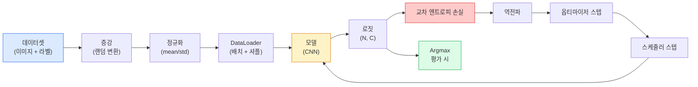

# 이미지 분류 (Image Classification)

> 분류기는 픽셀에서 클래스에 대한 확률 분포로의 함수입니다. 나머지는 전부 배관입니다.

**Type:** Build
**Languages:** Python
**Prerequisites:** Phase 2 Lesson 09 (Model Evaluation), Phase 3 Lesson 10 (Mini Framework), Phase 4 Lesson 03 (CNNs)
**Time:** ~75 minutes

## 학습 목표 (Learning Objectives)

- CIFAR-10에서 엔드투엔드 이미지 분류 파이프라인을 만듭니다: 데이터셋, 증강, 모델, 학습 루프, 평가
- 각 구성 요소(dataloader, loss, optimizer, scheduler, augmentation)의 역할을 설명하고, 하나를 깨면 손실 곡선에 어떻게 나타나는지 예측합니다
- mixup, cutout, label smoothing을 처음부터 구현하고 각각을 언제 더할 가치가 있는지 정당화합니다
- 혼동 행렬과 클래스별 precision/recall 표를 읽어 집계 정확도를 넘어 데이터셋·모델 실패를 진단합니다

## 문제 상황 (The Problem)

출시되는 모든 비전 작업은 어느 수준에서 이미지 분류로 환원됩니다. 검출은 영역을 분류합니다. 분할은 픽셀을 분류합니다. 검색은 클래스 중심과의 유사도로 순위를 매깁니다. 분류를 제대로 하는 것 — 데이터셋 루프, 증강 정책, 손실, 평가 — 이 페이즈의 다른 모든 작업으로 전이되는 기술입니다.

대부분의 분류 버그는 모델에 있지 않습니다. 파이프라인에 삽니다: 깨진 정규화, 셔플되지 않은 학습 집합, 라벨을 왜곡하는 증강, 학습 데이터로 오염된 검증 분할, 에폭 30 이후 조용히 발산하는 학습률. 올바른 설정에서 CIFAR-10에 93%를 찍을 CNN이 깨진 설정에서는 흔히 70-75%를 내고, 손실 곡선은 내내 그럴듯해 보입니다.

이 레슨은 모든 부분이 검사 가능하도록 전체 파이프라인을 손으로 연결합니다. 버그를 숨길 수 있는 `torchvision.datasets`의 어떤 것도 쓰지 않습니다.

## 핵심 개념 (The Concept)

### 분류 파이프라인



이 루프의 모든 줄에 버그가 살 수 있습니다. 교차 엔트로피는 softmax 출력이 아니라 원시 로짓을 받으므로, 손실 전에 `model(x).softmax()`를 하면 조용히 잘못된 기울기를 계산합니다. 증강은 라벨이 아니라 입력에만 적용됩니다 — 둘 다 섞는 mixup은 예외입니다. `optimizer.zero_grad()`는 스텝당 한 번이어야 하며, 건너뛰면 기울기가 누적되어 학습률이 미친 듯이 불안정한 것처럼 보입니다. 그 버그들 각각은 에러 없이 학습 곡선을 평평하게 만듭니다.

### 교차 엔트로피, 로짓, softmax

분류기는 이미지당 `C`개의 숫자(로짓)를 냅니다. Softmax를 적용하면 확률 분포가 됩니다:

```
softmax(z)_i = exp(z_i) / sum_j exp(z_j)
```

교차 엔트로피는 올바른 클래스의 음의 로그 확률을 잽니다:

```
CE(z, y) = -log( softmax(z)_y )
        = -z_y + log( sum_j exp(z_j) )
```

오른쪽 형태가 수치적으로 안정적인 것(log-sum-exp)입니다. PyTorch의 `nn.CrossEntropyLoss`는 softmax + NLL을 한 연산으로 합치고 원시 로짓을 직접 받습니다. 먼저 softmax를 스스로 적용하는 것은 거의 항상 버그입니다 — log(softmax(softmax(z)))라는 무의미한 양을 계산합니다.

### 증강이 동작하는 이유

CNN은 이동에 대한 귀납 편향(가중치 공유)이 있지만 크롭, 플립, 색 지터, 가림에 대한 내장 불변성은 없습니다. 그 불변성을 가르치는 유일한 방법은 그것을 연습하는 픽셀을 보여 주는 것입니다. 학습 중 모든 랜덤 변환은 "이 두 이미지는 같은 라벨이다; 차이를 무시하는 특징을 배워라"라고 말하는 방식입니다.

```
Original crop:  "dog facing left"
Flip:           "dog facing right"       <- same label, different pixels
Rotate(+15):    "dog, slight tilt"
Colour jitter:  "dog in warmer light"
RandomErasing:  "dog with patch missing"
```

규칙: 증강은 라벨을 보존해야 합니다. 숫자에 cutout과 회전을 쓰면 "6"이 "9"로 뒤집을 수 있습니다; 그 데이터셋에서는 더 작은 회전 범위를 쓰고 숫자 특화 불변성을 존중하는 증강을 고릅니다.

### Mixup과 cutmix

보통 증강은 픽셀을 변환하지만 라벨은 one-hot으로 둡니다. **Mixup**과 **cutmix**는 둘 다 보간해 그 규칙을 깹니다.

```
Mixup:
  lambda ~ Beta(a, a)
  x = lambda * x_i + (1 - lambda) * x_j
  y = lambda * y_i + (1 - lambda) * y_j

Cutmix:
  paste a random rectangle of x_j into x_i
  y = area-weighted mix of y_i and y_j
```

도움이 되는 이유: 모델이 뾰족한 one-hot 타깃을 외우기를 멈추고 클래스 사이를 보간하는 법을 배웁니다. 학습 손실은 올라가고, 테스트 정확도는 올라갑니다. 어떤 분류기에도 가장 싼 견고성 업그레이드입니다.

### 라벨 스무딩 (Label smoothing)

Mixup의 사촌입니다. `[0, 0, 1, 0, 0]`에 대해 학습하는 대신, 작은 `eps`(예: 0.1)에 대해 `[eps/C, eps/C, 1-eps, eps/C, eps/C]`에 대해 학습합니다. 모델이 임의로 날카로운 로짓을 내는 것을 막고, 거의 비용 없이 보정을 개선합니다. PyTorch 1.10부터 `nn.CrossEntropyLoss(label_smoothing=0.1)`에 내장되어 있습니다.

### 정확도를 넘는 평가

집계 정확도는 불균형을 숨깁니다. 항상 다수 클래스를 예측하는 90-10 이진 분류기는 90%를 냅니다. 실제로 무슨 일이 일어나는지 알려 주는 도구:

- **클래스별 정확도** — 클래스당 숫자 하나; 저성능 범주를 즉시 드러냅니다.
- **혼동 행렬** — 행 i 열 j = 진짜 클래스 i가 클래스 j로 예측된 횟수인 C x C 격자; 대각선이 맞고, 비대각선이 모델이 사는 곳입니다.
- **Top-1 / Top-5** — 올바른 클래스가 top 1 또는 top 5 예측에 있는지; ImageNet에서는 "Norwich terrier" vs "Norfolk terrier"처럼 진짜로 모호한 클래스 때문에 Top-5가 중요합니다.
- **보정(Calibration, ECE)** — 0.8 신뢰도 예측이 80% 맞습니까? 현대 네트워크는 체계적으로 과신합니다; 온도 스케일링이나 라벨 스무딩으로 고칩니다.

```figure
receptive-field
```

## 직접 만들기 (Build It)

### 1단계: 결정적 합성 데이터셋

CIFAR-10은 디스크에 있습니다. 이 레슨을 재현 가능하고 빠르게 만들려고, CIFAR처럼 보이는 합성 데이터셋을 만듭니다 — 모델이 배워야 하는 클래스별 구조가 있는 32x32 RGB 이미지. 정확히 같은 파이프라인이 실제 CIFAR-10에서도 그대로 동작합니다.

```python
import numpy as np
import torch
from torch.utils.data import Dataset


def synthetic_cifar(num_per_class=1000, num_classes=10, seed=0):
    rng = np.random.default_rng(seed)
    X = []
    Y = []
    for c in range(num_classes):
        centre = rng.uniform(0, 1, (3,))
        freq = 2 + c
        for _ in range(num_per_class):
            yy, xx = np.meshgrid(np.linspace(0, 1, 32), np.linspace(0, 1, 32), indexing="ij")
            r = np.sin(xx * freq) * 0.5 + centre[0]
            g = np.cos(yy * freq) * 0.5 + centre[1]
            b = (xx + yy) * 0.5 * centre[2]
            img = np.stack([r, g, b], axis=-1)
            img += rng.normal(0, 0.08, img.shape)
            img = np.clip(img, 0, 1)
            X.append(img.astype(np.float32))
            Y.append(c)
    X = np.stack(X)
    Y = np.array(Y)
    idx = rng.permutation(len(X))
    return X[idx], Y[idx]


class ArrayDataset(Dataset):
    def __init__(self, X, Y, transform=None):
        self.X = X
        self.Y = Y
        self.transform = transform

    def __len__(self):
        return len(self.X)

    def __getitem__(self, i):
        img = self.X[i]
        if self.transform is not None:
            img = self.transform(img)
        img = torch.from_numpy(img).permute(2, 0, 1)
        return img, int(self.Y[i])
```

각 클래스는 자체 색 팔레트와 주파수 패턴을 갖고, 모델이 픽셀을 외우지 않고 신호를 배우게 하는 가우시안 노이즈가 더해집니다. 클래스 열, 각각 이미지 천 장, 순열됨.

### 2단계: 정규화와 증강

모든 비전 파이프라인이 가진 두 변환.

```python
def standardize(mean, std):
    mean = np.array(mean, dtype=np.float32)
    std = np.array(std, dtype=np.float32)
    def _fn(img):
        return (img - mean) / std
    return _fn


def random_hflip(p=0.5):
    def _fn(img):
        if np.random.random() < p:
            return img[:, ::-1, :].copy()
        return img
    return _fn


def random_crop(pad=4):
    def _fn(img):
        h, w = img.shape[:2]
        padded = np.pad(img, ((pad, pad), (pad, pad), (0, 0)), mode="reflect")
        y = np.random.randint(0, 2 * pad)
        x = np.random.randint(0, 2 * pad)
        return padded[y:y + h, x:x + w, :]
    return _fn


def compose(*fns):
    def _fn(img):
        for fn in fns:
            img = fn(img)
        return img
    return _fn
```

크롭 전에 zero-pad가 아니라 reflect-pad를 쓰세요. 검은 테두리는 모델이 쓸모없는 방식으로 무시하는 법을 배울 신호이기 때문입니다.

### 3단계: Mixup

학습 스텝 안에서 이미지 둘과 라벨 둘을 섞습니다. 데이터셋 안이 아니라 forward 패스 옆에 살도록 배치 변환으로 구현합니다.

```python
def mixup_batch(x, y, num_classes, alpha=0.2):
    if alpha <= 0:
        return x, torch.nn.functional.one_hot(y, num_classes).float()
    lam = float(np.random.beta(alpha, alpha))
    idx = torch.randperm(x.size(0), device=x.device)
    x_mixed = lam * x + (1 - lam) * x[idx]
    y_onehot = torch.nn.functional.one_hot(y, num_classes).float()
    y_mixed = lam * y_onehot + (1 - lam) * y_onehot[idx]
    return x_mixed, y_mixed


def soft_cross_entropy(logits, soft_targets):
    log_probs = torch.log_softmax(logits, dim=-1)
    return -(soft_targets * log_probs).sum(dim=-1).mean()
```

`soft_cross_entropy`는 soft-label 분포에 대한 교차 엔트로피입니다. 타깃이 정확히 one-hot이면 보통의 one-hot 경우로 줄입니다.

### 4단계: 학습 루프

완전한 레시피: 데이터 한 패스, 배치당 기울기 한 번, 에폭당 스케줄러 한 번.

```python
import torch
import torch.nn as nn
from torch.utils.data import DataLoader
from torch.optim import SGD
from torch.optim.lr_scheduler import CosineAnnealingLR

def train_one_epoch(model, loader, optimizer, device, num_classes, use_mixup=True):
    model.train()
    total, correct, loss_sum = 0, 0, 0.0
    for x, y in loader:
        x, y = x.to(device), y.to(device)
        if use_mixup:
            x_m, y_soft = mixup_batch(x, y, num_classes)
            logits = model(x_m)
            loss = soft_cross_entropy(logits, y_soft)
        else:
            logits = model(x)
            loss = nn.functional.cross_entropy(logits, y, label_smoothing=0.1)
        optimizer.zero_grad()
        loss.backward()
        optimizer.step()
        loss_sum += loss.item() * x.size(0)
        total += x.size(0)
        # Training accuracy vs the un-mixed labels `y` is only an approximation
        # when mixup is on (the model saw soft targets, not y). Treat it as a
        # rough progress signal; rely on val accuracy for real performance.
        with torch.no_grad():
            pred = logits.argmax(dim=-1)
            correct += (pred == y).sum().item()
    return loss_sum / total, correct / total


@torch.no_grad()
def evaluate(model, loader, device, num_classes):
    model.eval()
    total, correct = 0, 0
    loss_sum = 0.0
    cm = torch.zeros(num_classes, num_classes, dtype=torch.long)
    for x, y in loader:
        x, y = x.to(device), y.to(device)
        logits = model(x)
        loss = nn.functional.cross_entropy(logits, y)
        pred = logits.argmax(dim=-1)
        for t, p in zip(y.cpu(), pred.cpu()):
            cm[t, p] += 1
        loss_sum += loss.item() * x.size(0)
        total += x.size(0)
        correct += (pred == y).sum().item()
    return loss_sum / total, correct / total, cm
```

학습 루프를 쓸 때마다 검사하는 불변식 다섯:

1. 학습 전 `model.train()`, 평가 전 `model.eval()` — dropout과 batchnorm 동작을 바꿉니다.
2. `.backward()` 전 `.zero_grad()`.
3. 지표를 누적할 때 `.item()`으로 계산 그래프를 살리지 않습니다.
4. 평가 중 `@torch.no_grad()` — 메모리와 시간을 아끼고 미묘한 사고를 막습니다.
5. Softmax가 아니라 원시 로짓에 대한 Argmax — 같은 결과, 연산 하나 적음.

### 5단계: 한데 모으기

이전 레슨의 `TinyResNet`을 쓰고, 몇 에폭 학습하고, 평가합니다.

```python
from main import synthetic_cifar, ArrayDataset
from main import standardize, random_hflip, random_crop, compose
from main import mixup_batch, soft_cross_entropy
from main import train_one_epoch, evaluate
# TinyResNet comes from the previous lesson (03-cnns-lenet-to-resnet).
# Adjust the import path to wherever you stored the previous lesson's code.
from cnns_lenet_to_resnet import TinyResNet  # example placeholder

X, Y = synthetic_cifar(num_per_class=500)
split = int(0.9 * len(X))
X_train, Y_train = X[:split], Y[:split]
X_val, Y_val = X[split:], Y[split:]

mean = [0.5, 0.5, 0.5]
std = [0.25, 0.25, 0.25]
train_tf = compose(random_hflip(), random_crop(pad=4), standardize(mean, std))
eval_tf = standardize(mean, std)

train_ds = ArrayDataset(X_train, Y_train, transform=train_tf)
val_ds = ArrayDataset(X_val, Y_val, transform=eval_tf)

train_loader = DataLoader(train_ds, batch_size=128, shuffle=True, num_workers=0)
val_loader = DataLoader(val_ds, batch_size=256, shuffle=False, num_workers=0)

device = "cuda" if torch.cuda.is_available() else "cpu"
model = TinyResNet(num_classes=10).to(device)
optimizer = SGD(model.parameters(), lr=0.1, momentum=0.9, weight_decay=5e-4, nesterov=True)
scheduler = CosineAnnealingLR(optimizer, T_max=10)

for epoch in range(10):
    tr_loss, tr_acc = train_one_epoch(model, train_loader, optimizer, device, 10, use_mixup=True)
    va_loss, va_acc, _ = evaluate(model, val_loader, device, 10)
    scheduler.step()
    print(f"epoch {epoch:2d}  lr {scheduler.get_last_lr()[0]:.4f}  "
          f"train {tr_loss:.3f}/{tr_acc:.3f}  val {va_loss:.3f}/{va_acc:.3f}")
```

합성 데이터셋에서는 다섯 에폭 안에 거의 완벽한 검증 정확도에 도달합니다. 그것이 요점입니다: 파이프라인이 맞고, 모델은 배울 수 있는 것을 배울 수 있습니다. 데이터셋을 실제 CIFAR-10으로 바꾸면 같은 루프가 변경 없이 ~90%까지 학습합니다.

### 6단계: 혼동 행렬 읽기

정확도만으로는 모델이 어디서 실패하는지 절대 알려 주지 않습니다. 혼동 행렬은 알려 줍니다.

```python
def print_confusion(cm, labels=None):
    c = cm.shape[0]
    labels = labels or [str(i) for i in range(c)]
    print(f"{'':>6}" + "".join(f"{l:>5}" for l in labels))
    for i in range(c):
        row = cm[i].tolist()
        print(f"{labels[i]:>6}" + "".join(f"{v:>5}" for v in row))
    print()
    tp = cm.diag().float()
    fp = cm.sum(dim=0).float() - tp
    fn = cm.sum(dim=1).float() - tp
    prec = tp / (tp + fp).clamp_min(1)
    rec = tp / (tp + fn).clamp_min(1)
    f1 = 2 * prec * rec / (prec + rec).clamp_min(1e-9)
    for i in range(c):
        print(f"{labels[i]:>6}  prec {prec[i]:.3f}  rec {rec[i]:.3f}  f1 {f1[i]:.3f}")

_, _, cm = evaluate(model, val_loader, device, 10)
print_confusion(cm)
```

행은 진짜 클래스, 열은 예측입니다. 클래스 3과 5 사이의 비대각선 카운트 군집은 모델이 그 둘을 혼동한다는 뜻이며, 표적 데이터 수집이나 클래스별 증강의 출발점을 줍니다.

## 활용하기 (Use It)

`torchvision`은 위의 모든 것을 관용적 구성 요소로 감쌉니다. 실제 CIFAR-10에서 전체 파이프라인은 학습 루프 더하기 네 줄입니다.

```python
from torchvision.datasets import CIFAR10
from torchvision.transforms import Compose, RandomCrop, RandomHorizontalFlip, ToTensor, Normalize

mean = (0.4914, 0.4822, 0.4465)
std = (0.2470, 0.2435, 0.2616)
train_tf = Compose([
    RandomCrop(32, padding=4, padding_mode="reflect"),
    RandomHorizontalFlip(),
    ToTensor(),
    Normalize(mean, std),
])
eval_tf = Compose([ToTensor(), Normalize(mean, std)])

train_ds = CIFAR10(root="./data", train=True,  download=True, transform=train_tf)
val_ds   = CIFAR10(root="./data", train=False, download=True, transform=eval_tf)
```

두 가지를 주목하세요: mean/std는 **데이터셋 특화**입니다 — ImageNet이 아니라 CIFAR-10 학습 집합에서 계산됨 — 그리고 reflect pad는 커뮤니티 기본 크롭 정책입니다. 여기에 ImageNet 통계를 복사해 붙이면 ~1% 정확도 누수이며, 누군가 모델을 프로파일하기 전까지 아무도 잡지 않습니다.

## 산출물 (Ship It)

이 레슨이 만드는 것:

- `outputs/prompt-classifier-pipeline-auditor.md` — 학습 스크립트를 위 다섯 불변식에 대해 감사하고 첫 위반을 드러내는 프롬프트.
- `outputs/skill-classification-diagnostics.md` — 혼동 행렬과 클래스 이름 목록이 주어지면 클래스별 실패를 요약하고 가장 영향력 큰 수정 하나를 제안하는 스킬.

## 연습 문제 (Exercises)

1. **(Easy)** 합성 데이터셋에서 mixup 있이/없이 같은 모델을 다섯 에폭 학습하세요. 둘의 train·val 손실을 그리세요. Mixup이 있을 때 train 손실이 더 높은데도 val 정확도가 비슷하거나 나은 이유를 설명하세요.
2. **(Medium)** Cutout을 구현하세요 — 각 학습 이미지에서 랜덤 8x8 사각형을 0으로 — 그리고 증강 없음, hflip+crop, hflip+crop+cutout, hflip+crop+mixup에 대한 ablation을 돌리세요. 각각의 val 정확도를 보고하세요.
3. **(Hard)** CIFAR-100 파이프라인(100클래스, 같은 입력 크기)을 만들고 ResNet-34 학습 실행을 공개 정확도의 1% 안으로 재현하세요. 추가: 학습률 셋과 weight decay 둘을 스윕하고, 로컬 CSV에 로그하고, 최종 혼동-행렬-top-혼동 표를 만드세요.

## 핵심 용어 (Key Terms)

| Term | What people say | What it actually means |
|------|----------------|----------------------|
| Logits | "원시 출력" | 이미지당 C개 숫자의 pre-softmax 벡터; 교차 엔트로피는 softmax된 값이 아니라 이것을 기대 |
| Cross-entropy | "손실" | 올바른 클래스의 음의 로그 확률; log-softmax와 NLL을 하나의 안정적 연산으로 합침 |
| DataLoader | "배처" | 데이터셋을 셔플, 배치, (선택) 멀티워커 로딩으로 감쌈; 학습 버그의 절반이 여기로 돌림 |
| Augmentation | "랜덤 변환" | 라벨을 보존하는 학습 시 픽셀 수준 변환; CNN이 본래 갖지 않는 불변성을 가르침 |
| Mixup / Cutmix | "이미지 둘을 섞음" | 입력과 라벨을 모두 블렌드해 분류기가 딱딱한 경계 대신 부드러운 보간을 배우게 함 |
| Label smoothing | "더 부드러운 타깃" | one-hot을 (1-eps, eps/(C-1), ...)로 바꿈; 보정을 개선하고 정확도를 약간 올림 |
| Top-k accuracy | "Top-5" | 올바른 클래스가 확률 상위 k 예측에 있음; 진짜로 모호한 클래스가 있는 데이터셋에서 사용 |
| Confusion matrix | "오차가 사는 곳" | 항목 (i, j)가 진짜 클래스 i가 j로 예측된 이미지 수인 C x C 표; 대각선이 맞고, 비대각선이 고칠 곳을 말함 |

## 더 읽을거리 (Further Reading)

- [CS231n: Training Neural Networks](https://cs231n.github.io/neural-networks-3/) — 여전히 한 페이지에서 학습 파이프라인의 가장 명확한 투어
- [Bag of Tricks for Image Classification (He et al., 2019)](https://arxiv.org/abs/1812.01187) — 합치면 ImageNet ResNet 정확도에 3-4%를 더하는 모든 작은 트릭
- [mixup: Beyond Empirical Risk Minimization (Zhang et al., 2017)](https://arxiv.org/abs/1710.09412) — 원조 mixup 논문; 이론 세 페이지와 설득력 있는 실험
- [Why temperature scaling matters (Guo et al., 2017)](https://arxiv.org/abs/1706.04599) — 현대 네트워크가 잘못 보정됨을 증명하고 스칼라 파라미터 하나로 고친 논문
