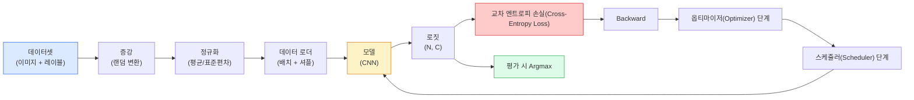

# 이미지 분류

> 분류기는 픽셀을 클래스에 대한 확률 분포로 매핑하는 함수입니다. 나머지 모든 것은 단순한 배선(plumbing)입니다.

**유형:** Build
**언어:** Python
**선수 요건:** 2단계 09강 (모델 평가), 3단계 10강 (미니 프레임워크), 4단계 03강 (CNN)
**시간:** 약 75분

## 학습 목표

- CIFAR-10에서 데이터셋, 증강, 모델, 학습 루프, 평가를 포함한 엔드투엔드 이미지 분류 파이프라인을 구축해 보세요
- 각 구성 요소(데이터 로더, 손실 함수, 옵티마이저, 스케줄러, 증강)의 역할을 설명하고, 그중 하나를 망가뜨렸을 때 손실 곡선에 어떻게 나타나는지 예측해 보세요
- 믹스업(mixup), 컷아웃(cutout), 레이블 스무딩(label smoothing)을 처음부터 구현하고, 각각을 추가할 가치가 있는 시점을 정당화해 보세요
- 혼동 행렬(confusion matrix)과 클래스별 정밀도/재현율 표를 읽어, 집계된 정확도 이상의 데이터셋 및 모델 실패를 진단해 보세요

## 문제점

출시되는 모든 비전 작업은 어느 수준에서 이미지 분류로 귀결됩니다. 탐지(Detection)는 영역을 분류하고, 분할(Segmentation)은 픽셀을 분류하며, 검색(Retrieval)은 클래스 중심점과의 유사도에 따라 순위를 매깁니다. 분류를 올바르게 수행하는 것 — 데이터셋 루프, 증강 정책, 손실 함수, 평가 — 은 해당 단계의 다른 모든 작업으로 전이되는 핵심 기술입니다.

분류 버그의 대부분은 모델에 있지 않습니다. 버그는 파이프라인에 있습니다: 깨진 정규화, 셔플되지 않은 학습 세트, 레이블을 왜곡하는 증강, 학습 데이터로 오염된 검증 분할, 30에포크 이후 조용히 발산하는 학습률. 올바른 설정으로 CIFAR-10에서 93%를 달성할 CNN은 깨진 설정으로 보통 70-75%를 기록하며, 손실 곡선은 내내 그럴듯해 보입니다.

이 강의는 전체 파이프라인을 수동으로 연결하여 모든 부분을 검사할 수 있게 합니다. 버그를 숨길 수 있는 `torchvision.datasets`의 기능은 사용하지 않습니다.

## 개념

### 분류 파이프라인



이 루프의 모든 줄은 버그가 숨어 있을 수 있는 곳입니다. 교차 엔트로피는 소프트맥스(Softmax) 출력값이 아닌 원시 로짓(Logits)을 받습니다. 따라서 손실 함수 이전에 `model(x).softmax()`이 수행되면 조용히 잘못된 기울기를 계산합니다. 증강은 입력에만 적용되며 레이블에는 적용되지 않습니다. 단, mixup은 둘 모두를 혼합합니다. `optimizer.zero_grad()`은 단계마다 한 번 수행해야 합니다. 이를 건너뛰면 기울기가 누적되어 학습률이 극도로 불안정한 것처럼 보입니다. 이러한 버그들은 각각 에러를 발생시키지 않으면서 학습 곡선을 평평하게 만듭니다.

### 교차 엔트로피, 로짓, 소프트맥스

분류기는 이미지마다 `C`개의 숫자를 생성하며 이를 로짓(Logits)이라고 부릅니다. 소프트맥스(Softmax)를 적용하면 이를 확률 분포로 변환합니다:

```
softmax(z)_i = exp(z_i) / sum_j exp(z_j)
```

교차 엔트로피는 올바른 클래스의 음의 로그 확률을 측정합니다:

```
CE(z, y) = -log( softmax(z)_y )
        = -z_y + log( sum_j exp(z_j) )
```

오른쪽 형태는 수치적으로 안정적인 형태(log-sum-exp)입니다. PyTorch의 `nn.CrossEntropyLoss`은 소프트맥스(Softmax)와 NLL을 하나의 연산으로 융합하며 원시 로짓(Logits)을 직접 받습니다. 직접 소프트맥스(Softmax)를 먼저 적용하는 것은 거의 항상 버그입니다. log(softmax(softmax(z)))를 계산하게 되는데, 이는 의미 없는 값입니다.

### 증강이 작동하는 이유

CNN은 가중치 공유로 인해 이동에 대한 귀납적 편향(Inductive Bias)을 가지지만, 크롭, 뒤집기, 색상 지터, 가림에 대한 내장 불변성은 없습니다. 이러한 불변성을 가르치는 유일한 방법은 이를 연습하는 픽셀을 보여주는 것입니다. 학습 중의 모든 랜덤 변환은 "이 두 이미지는 같은 레이블을 가지며, 차이를 무시하는 특징을 학습하라"는 방식입니다.

```
Original crop:  "dog facing left"
Flip:           "dog facing right"       <- same label, different pixels
Rotate(+15):    "dog, slight tilt"
Colour jitter:  "dog in warmer light"
RandomErasing:  "dog with patch missing"
```

규칙: 증강은 레이블을 보존해야 합니다. 숫자에 대한 컷아웃(Cutout)과 회전은 "6"을 "9"로 바꿀 수 있습니다. 해당 데이터셋의 경우 더 작은 회전 범위를 사용하며 숫자 특유의 불변성을 존중하는 증강을 선택합니다.

### Mixup과 cutmix

일반적인 증강은 픽셀을 변환하지만 레이블은 원-핫(one-hot)으로 유지합니다. **Mixup**과 **cutmix**는 둘 모두를 보간하여 이를 깨뜨립니다.

```
Mixup:
  lambda ~ Beta(a, a)
  x = lambda * x_i + (1 - lambda) * x_j
  y = lambda * y_i + (1 - lambda) * y_j

Cutmix:
  paste a random rectangle of x_j into x_i
  y = area-weighted mix of y_i and y_j
```

도움이 되는 이유: 모델은 뾰족한 원--hot(one-hot) 타겟을 암기하는 것을 멈추고 클래스 간에 보간하는 것을 학습합니다. 학습 손실은 증가하지만 테스트 정확도는 증가합니다. 이는 모든 분류기에 대해 가장 저렴한 단일 강건성 업그레이드입니다.

### 레이블 스무딩(Label Smoothing)

mixup의 사촌 격입니다. `[0, 0, 1, 0, 0]`에 대해 학습하는 대신, `eps`가 0.01강 같은 작은 값인 `[eps/C, eps/C, 1-eps, eps/C, eps/C]`에 대해 학습합니다. 모델이 임의로 날카로운 로짓(Logits)을 생성하는 것을 방지하고, 거의 비용 없이 보정(Calibration)을 개선합니다. PyTorch 1.10부터 `nn.CrossEntropyLoss(label_smoothing=0.1)`에 내장되어 있습니다.

### 정확도를 넘어선 평가

집계된 정확도는 불균형을 숨깁니다. 90-10 비율의 이진 분류기가 항상 다수 클래스를 예측하면 90%의 점수를 받습니다. 실제로 일어나는 일을 알려주는 도구들:

- **클래스별 정확도** — 클래스당 하나의 수치; 성능이 낮은 카테고리를 즉시 드러냅니다.
- **혼동 행렬** — C x C 격자로, 행 i 열 j는 참 클래스 i가 클래스 j로 예측된 횟수를 나타냅니다. 대각선은 정확하며, 비대각선은 모델이 실수하는 부분입니다.
- **Top-1 / Top-5** — 올바른 클래스가 상위 1개 또는 상위 5개 예측에 포함되는지 여부; ImageNet에서는 "Norwich terrier"와 "Norfolk terrier" 같은 클래스가 실제로 모호하기 때문에 Top-5가 중요합니다.
- **보정 (ECE)** — 0.8의 신뢰도를 가진 예측이 80%의 확률로 맞습니까? 현대의 네트워크는 체계적으로 과신하는 경향이 있습니다. 온도 스케일링(Temperature Scaling)이나 레이블 스무딩(Label Smoothing)으로 수정하세요.

```figure
receptive-field
```

## 구현하기

### 1단계: 결정론적 합성 데이터셋

CIFAR-10은 디스크에 저장되어 있습니다. 이 강의를 재현 가능하고 빠르게 만들기 위해, CIFAR처럼 보이는 합성 데이터셋을 만듭니다. 32x32 RGB 이미지로, 모델이 학습해야 할 클래스별 구조를 포함합니다. 동일한 파이프라인은 실제 CIFAR-10에서도 변경 없이 작동합니다.

```python
import numpy as np
import torch
from torch.utils.data import Dataset


def synthetic_cifar(num_per_class=1000, num_classes=10, seed=0):
    rng = np.random.default_rng(seed)
    X = []
    Y = []
    for c in range(num_classes):
        centre = rng.uniform(0, 1, (3,))
        freq = 2 + c
        for _ in range(num_per_class):
            yy, xx = np.meshgrid(np.linspace(0, 1, 32), np.linspace(0, 1, 32), indexing="ij")
            r = np.sin(xx * freq) * 0.5 + centre[0]
            g = np.cos(yy * freq) * 0.5 + centre[1]
            b = (xx + yy) * 0.5 * centre[2]
            img = np.stack([r, g, b], axis=-1)
            img += rng.normal(0, 0.08, img.shape)
            img = np.clip(img, 0, 1)
            X.append(img.astype(np.float32))
            Y.append(c)
    X = np.stack(X)
    Y = np.array(Y)
    idx = rng.permutation(len(X))
    return X[idx], Y[idx]


class ArrayDataset(Dataset):
    def __init__(self, X, Y, transform=None):
        self.X = X
        self.Y = Y
        self.transform = transform

    def __len__(self):
        return len(self.X)

    def __getitem__(self, i):
        img = self.X[i]
        if self.transform is not None:
            img = self.transform(img)
        img = torch.from_numpy(img).permute(2, 0, 1)
        return img, int(self.Y[i])
```

각 클래스는 자체 색상 팔레트와 주파수 패턴을 가지며, 가우시안 잡음(Gaussian Noise)이 추가되어 모델이 픽셀을 암기하는 대신 신호를 학습하도록 강제합니다. 10개 클래스, 각 클래스당 천 개의 이미지, 순서가 섞여 있습니다.

### 2단계: 정규화(Normalization)와 증강(Augmentation)

모든 비전 파이프라인이 가진 두 가지 변환입니다.

```python
def standardize(mean, std):
    mean = np.array(mean, dtype=np.float32)
    std = np.array(std, dtype=np.float32)
    def _fn(img):
        return (img - mean) / std
    return _fn


def random_hflip(p=0.5):
    def _fn(img):
        if np.random.random() < p:
            return img[:, ::-1, :].copy()
        return img
    return _fn


def random_crop(pad=4):
    def _fn(img):
        h, w = img.shape[:2]
        padded = np.pad(img, ((pad, pad), (pad, pad), (0, 0)), mode="reflect")
        y = np.random.randint(0, 2 * pad)
        x = np.random.randint(0, 2 * pad)
        return padded[y:y + h, x:x + w, :]
    return _fn


def compose(*fns):
    def _fn(img):
        for fn in fns:
            img = fn(img)
        return img
    return _fn
```

자르기(Crop) 전에 제로 패딩(Zero-pad)이 아닌 리플렉트 패딩(Reflect-pad)을 사용하세요. 검은색 테두리는 모델이 무용한 방식으로 무시하도록 학습하는 신호가 되기 때문입니다.

### 3단계: Mixup

학습 단계 내에서 두 이미지와 두 레이블을 혼합합니다. 배치 변환(Batch Transform)으로 구현되어, 데이터셋 내부가 아니라 순전파(Forward Pass) 옆에 위치합니다.

```python
def mixup_batch(x, y, num_classes, alpha=0.2):
    if alpha <= 0:
        return x, torch.nn.functional.one_hot(y, num_classes).float()
    lam = float(np.random.beta(alpha, alpha))
    idx = torch.randperm(x.size(0), device=x.device)
    x_mixed = lam * x + (1 - lam) * x[idx]
    y_onehot = torch.nn.functional.one_hot(y, num_classes).float()
    y_mixed = lam * y_onehot + (1 - lam) * y_onehot[idx]
    return x_mixed, y_mixed


def soft_cross_entropy(logits, soft_targets):
    log_probs = torch.log_softmax(logits, dim=-1)
    return -(soft_targets * log_probs).sum(dim=-1).mean()
```

`soft_cross_entropy`은 소프트 레이블 분포에 대한 교차 엔트로피(Cross-Entropy)입니다. 타겟이 정확히 원-hot(one-hot)일 경우 일반적인 원-hot 케이스로 축소됩니다.

### 4단계: 학습 루프

완전한 레시피: 데이터를 한 번 순회하고, 배치마다 기울기를 한 번 계산하며, 에포크(Epoch)마다 스케줄러를 한 번 스텝합니다.

```python
import torch
import torch.nn as nn
from torch.utils.data import DataLoader
from torch.optim import SGD
from torch.optim.lr_scheduler import CosineAnnealingLR

def train_one_epoch(model, loader, optimizer, device, num_classes, use_mixup=True):
    model.train()
    total, correct, loss_sum = 0, 0, 0.0
    for x, y in loader:
        x, y = x.to(device), y.to(device)
        if use_mixup:
            x_m, y_soft = mixup_batch(x, y, num_classes)
            logits = model(x_m)
            loss = soft_cross_entropy(logits, y_soft)
        else:
            logits = model(x)
            loss = nn.functional.cross_entropy(logits, y, label_smoothing=0.1)
        optimizer.zero_grad()
        loss.backward()
        optimizer.step()
        loss_sum += loss.item() * x.size(0)
        total += x.size(0)
        # 학습 정확도와 혼합되지 않은 레이블 `y`는 근사치일 뿐입니다
        # mixup이 켜져 있을 때 (모델은 y가 아닌 소프트 타겟을 보았습니다). 이를
        # 대략적인 진행 신호로 취급하세요. 실제 성능은 검증(val) 정확도에 의존해야 합니다.
        with torch.no_grad():
            pred = logits.argmax(dim=-1)
            correct += (pred == y).sum().item()
    return loss_sum / total, correct / total


@torch.no_grad()
def evaluate(model, loader, device, num_classes):
    model.eval()
    total, correct = 0, 0
    loss_sum = 0.0
    cm = torch.zeros(num_classes, num_classes, dtype=torch.long)
    for x, y in loader:
        x, y = x.to(device), y.to(device)
        logits = model(x)
        loss = nn.functional.cross_entropy(logits, y)
        pred = logits.argmax(dim=-1)
        for t, p in zip(y.cpu(), pred.cpu()):
            cm[t, p] += 1
        loss_sum += loss.item() * x.size(0)
        total += x.size(0)
        correct += (pred == y).sum().item()
    return loss_sum / total, correct / total, cm
```

학습 루프를 작성할 때마다 확인해야 하는 다섯 가지 불변 조건입니다:

1. 학습 전 `model.train()`, 평가 전 `model.eval()` — 드롭아웃(Dropout) 및 배치 정규화(batchnorm) 동작을 전환합니다.
2. `.zero_grad()`는 `.backward()`보다 먼저 수행됩니다.
3. 메트릭을 누적할 때 `.item()`를 사용하여 계산 그래프가 살아남지 않도록 합니다.
4. 평가 중 `@torch.no_grad()` — 메모리와 시간을 절약하고 미묘한 사고를 방지합니다.
5. 소프트맥스(Softmax)가 아닌 원시 로짓(Logits)에 대해 Argmax를 수행합니다 — 결과는 같지만 연산이 하나 줄어듭니다.

### 5단계: 통합하기

이전 강의의 `TinyResNet`를 사용하여 몇 에포크 동안 학습하고 평가하세요.

```python
from main import synthetic_cifar, ArrayDataset
from main import standardize, random_hflip, random_crop, compose
from main import mixup_batch, soft_cross_entropy
from main import train_one_epoch, evaluate
# TinyResNet은 이전 강의(03-cnns-lenet-to-resnet)에서 가져옵니다.
# 이전 강의 코드를 저장한 경로에 맞춰 import 경로를 조정하세요.
from cnns_lenet_to_resnet import TinyResNet  # 예시 플레이스홀더

X, Y = synthetic_cifar(num_per_class=500)
split = int(0.9 * len(X))
X_train, Y_train = X[:split], Y[:split]
X_val, Y_val = X[split:], Y[split:]

mean = [0.5, 0.5, 0.5]
std = [0.25, 0.25, 0.25]
train_tf = compose(random_hflip(), random_crop(pad=4), standardize(mean, std))
eval_tf = standardize(mean, std)

train_ds = ArrayDataset(X_train, Y_train, transform=train_tf)
val_ds = ArrayDataset(X_val, Y_val, transform=eval_tf)

train_loader = DataLoader(train_ds, batch_size=128, shuffle=True, num_workers=0)
val_loader = DataLoader(val_ds, batch_size=256, shuffle=False, num_workers=0)

device = "cuda" if torch.cuda.is_available() else "cpu"
model = TinyResNet(num_classes=10).to(device)
optimizer = SGD(model.parameters(), lr=0.1, momentum=0.9, weight_decay=5e-4, nesterov=True)
scheduler = CosineAnnealingLR(optimizer, T_max=10)

for epoch in range(10):
    tr_loss, tr_acc = train_one_epoch(model, train_loader, optimizer, device, 10, use_mixup=True)
    va_loss, va_acc, _ = evaluate(model, val_loader, device, 10)
    scheduler.step()
    print(f"epoch {epoch:2d}  lr {scheduler.get_last_lr()[0]:.4f}  "
          f"train {tr_loss:.3f}/{tr_acc:.3f}  val {va_loss:.3f}/{va_acc:.3f}")
```

합성 데이터셋에서는 5 에포크 이내에 거의 완벽한 검증 정확도에 도달하며, 이것이 핵심입니다: 파이프라인이 정확하고 모델이 학습 가능한 것을 학습할 수 있습니다. 실제 CIFAR-10으로 데이터셋을 교체하면 변경 없이 동일한 루프가 ~90%까지 학습됩니다.

### 6단계: 혼동 행렬 읽기

정확도만으로는 모델이 어디에서 실패하는지 알 수 없습니다. 혼동 행렬이 알려줍니다.

```python
def print_confusion(cm, labels=None):
    c = cm.shape[0]
    labels = labels or [str(i) for i in range(c)]
    print(f"{'':>6}" + "".join(f"{l:>5}" for l in labels))
    for i in range(c):
        row = cm[i].tolist()
        print(f"{labels[i]:>6}" + "".join(f"{v:>5}" for v in row))
    print()
    tp = cm.diag().float()
    fp = cm.sum(dim=0).float() - tp
    fn = cm.sum(dim=1).float() - tp
    prec = tp / (tp + fp).clamp_min(1)
    rec = tp / (tp + fn).clamp_min(1)
    f1 = 2 * prec * rec / (prec + rec).clamp_min(1e-9)
    for i in range(c):
        print(f"{labels[i]:>6}  prec {prec[i]:.3f}  rec {rec[i]:.3f}  f1 {f1[i]:.3f}")

_, _, cm = evaluate(model, val_loader, device, 10)
print_confusion(cm)
```

행은 실제 클래스, 열은 예측입니다. 클래스 03강 5 사이의 비대각선(count) 클러스터는 모델이 두 클래스를 혼동한다는 의미이며, 타겟화된 데이터 수집이나 클래스별 증강(augmentation)의 시작점이 됩니다.

## 사용하기

`torchvision`는 위의 모든 것을 관용적인 컴포넌트로 감쌉니다. 실제 CIFAR-10의 경우 전체 파이프라인은 네 줄과 학습 루프로 구성됩니다.

```python
from torchvision.datasets import CIFAR10
from torchvision.transforms import Compose, RandomCrop, RandomHorizontalFlip, ToTensor, Normalize

mean = (0.4914, 0.4822, 0.4465)
std = (0.2470, 0.2435, 0.2616)
train_tf = Compose([
    RandomCrop(32, padding=4, padding_mode="reflect"),
    RandomHorizontalFlip(),
    ToTensor(),
    Normalize(mean, std),
])
eval_tf = Compose([ToTensor(), Normalize(mean, std)])

train_ds = CIFAR10(root="./data", train=True,  download=True, transform=train_tf)
val_ds   = CIFAR10(root="./data", train=False, download=True, transform=eval_tf)
```

두 가지를 주목해 보세요: 평균/표준 편차는 **데이터셋에 특화**되어 있습니다 — CIFAR-10 훈련 세트에서 계산된 값이지, ImageNet의 값이 아닙니다 — 그리고 리플렉트 패드(reflect pad)는 커뮤니티 기본 크롭 정책입니다. ImageNet 통계를 여기에 복사-붙여넣기하면 약 1%의 정확도 손실이 발생하며, 모델 프로파일링을 하기 전까지는 아무도 이를 발견하지 못합니다.

## 출시하기

이 강의는 다음을 생성합니다:

- `outputs/prompt-classifier-pipeline-auditor.md` — 위 다섯 가지 불변 조건에 대해 훈련 스크립트를 감사하고 첫 번째 위반을 드러내는 프롬프트입니다.
- `outputs/skill-classification-diagnostics.md` — 혼동 행렬과 클래스 이름 목록을 입력으로 받아 클래스별 실패를 요약하고 가장 영향력 있는 단일 수정을 제안하는 스킬입니다.

## 연습 문제

1. **(쉬움)** 합성 데이터셋에서 5 에포크 동안 mixup을 적용한 경우와 적용하지 않은 경우로 동일한 모델을 훈련하세요. 두 경우 모두의 훈련 및 검증 손실을 플롯하세요. mixup을 적용했을 때 훈련 손실이 더 높지만 검증 정확도는 비슷하거나 더 좋은 이유를 설명하세요.
2. **(중간)** Cutout을 구현하세요 — 각 훈련 이미지에서 랜덤한 8x8 정사각형 영역을 0으로 채우세요 — 그리고 증강 없음, hflip+crop, hflip+crop+cutout, hflip+crop+mixup에 대한 Ablation을 수행하세요. 각 경우의 검증 정확도를 보고하세요.
3. **(어려움)** CIFAR-100 파이프라인(100개 클래스, 동일한 입력 크기)을 구축하고 ResNet-34 훈련 실행을 공개된 정확도의 1% 이내로 재현하세요. 추가 과제: 세 가지 학습률과 두 가지 가중치 감쇠를 스윕(sweep)하고, 로컬 CSV에 기록하며, 최종 혼동 행렬의 상위 혼동(confusion-matrix-top-confusions) 표를 생성하세요.

## 핵심 용어

| 용어 | 사람들이 말하는 것 | 실제 의미 |
|------|----------------|----------------------|
| 로짓(Logits) | "원시 출력" | 이미지당 C개의 숫자로 구성된 소프트맥스 이전 벡터입니다. 교차 엔트로피는 소프트맥스된 값이 아닌 이 값을 기대합니다 |
| 교차 엔트로피(Cross-entropy) | "손실 함수" | 올바른 클래스의 음의 로그 확률입니다. 로그 소프트맥스와 NLL을 하나의 안정적인 연산으로 결합합니다 |
| DataLoader | "배치 처리기" | 셔플링, 배치 및 (선택적) 다중 워커 로딩으로 데이터셋을 래핑합니다. 훈련 버그의 절반에 대해 blamed됩니다 |
| 증강(Augmentation) | "랜덤 변환" | 훈련 시 레이블을 보존하는 모든 픽셀 수준 변환입니다. CNN이 본질적으로 가지지 못한 불변성을 가르칩니다 |
| Mixup / Cutmix | "두 이미지를 섞기" | 입력과 레이블을 블렌딩하여 분류기가 하드 경계 대신 부드러운 보간을 학습하도록 합니다 |
| 라벨 스무딩 | "더 부드러운 타겟" | 원 핫(one-hot)을 (1-eps, eps/(C-1), ...)로 대체합니다. 보정(calibration)을 개선하고 정확도를 약간 높입니다 |
| Top-k 정확도 | "Top-5" | 정답 클래스가 k개의 가장 높은 확률 예측 중 하나에 포함됩니다. 진정으로 모호한 클래스가 있는 데이터셋에서 사용됩니다 |
| 혼동 행렬 | "오류가 있는 곳" | C x C 표로, 항목 (i, j)는 참 클래스 i가 j로 예측된 이미지 수를 세는 것입니다. 대각선은 정답이며, 비대각선은 무엇을 수정해야 하는지 알려줍니다 |

## 추가 읽기

- [CS231n: Training Neural Networks](https://cs231n.github.io/neural-networks-3/) — 한 페이지로 학습 파이프라인을 가장 명확하게 안내합니다
- [Bag of Tricks for Image Classification (He et al., 2019)](https://arxiv.org/abs/1812.01187) — ImageNet에서 ResNet 정확도를 3-4% 높이는 모든 작은 기술들
- [mixup: Beyond Empirical Risk Minimization (Zhang et al., 2017)](https://arxiv.org/abs/1710.09412) — 원본 mixup 논문입니다. 3페이지의 이론과 설득력 있는 실험이 포함되어 있습니다
- [Why temperature scaling matters (Guo et al., 2017)](https://arxiv.org/abs/1706.04599) — 현대 네트워크가 보정되지 않았음을 증명하고 하나의 스칼라 매개변수로 이를 해결한 논문입니다
