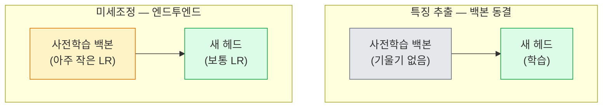

# 전이 학습과 미세조정 (Transfer Learning & Fine-Tuning)

> 누군가 백만 GPU 시간을 들여 네트워크에게 가장자리, 텍스처, 물체 부분이 어떻게 보이는지 가르쳤습니다. 직접 학습하기 전에 그 특징을 빌려야 합니다.

**Type:** Build
**Languages:** Python
**Prerequisites:** Phase 4 Lesson 03 (CNNs), Phase 4 Lesson 04 (Image Classification)
**Time:** ~75 minutes

## 학습 목표 (Learning Objectives)

- 특징 추출(feature extraction)과 미세조정(fine-tuning)을 구분하고, 데이터셋 크기·도메인 거리·연산 예산에 따라 맞는 쪽을 고릅니다
- 사전학습 백본을 로드하고, 분류기 헤드를 교체하고, 헤드만 학습해 20줄 미만으로 동작하는 베이스라인을 만듭니다
- 판별적 학습률(discriminative learning rates)로 층을 점진적으로 동결 해제해, 초기의 일반 특징이 후기의 작업 특화 특징보다 작은 업데이트를 받게 합니다
- 흔한 실패 세 가지를 진단합니다: 동결 해제 블록의 너무 높은 LR로 인한 특징 드리프트, 작은 데이터셋에서 BN 통계 붕괴, 치명적 망각(catastrophic forgetting)

## 문제 상황 (The Problem)

ImageNet에서 ResNet-50을 학습하는 데는 대략 2,000 GPU-시간이 듭니다. 출시하는 모든 작업에 그 예산이 있는 팀은 거의 없습니다. 거의 모든 팀이 실제로 출시하는 것은 작업 특화 이미지 수백·수천 장으로 새 헤드를 학습한 사전학습 백본입니다.

이것은 지름길이 아닙니다. ImageNet으로 학습된 어떤 CNN의 첫 conv 블록도 가장자리와 Gabor형 필터를 배웁니다. 다음 몇 블록은 텍스처와 단순 모티프를 배웁니다. 중간 블록은 물체 부분을 배웁니다. 최종 블록은 ImageNet 1,000 범주처럼 보이기 시작하는 조합을 배웁니다. 그 계층의 처음 90%는 의료 영상, 산업 검사, 위성 데이터, 다른 모든 비전 작업으로 거의 그대로 전이됩니다 — 자연이 가장자리와 텍스처의 제한된 어휘를 갖기 때문입니다. 실제로 학습하는 것은 마지막 10%입니다.

전이를 제대로 하려면 기다리는 버그가 셋 있습니다: 너무 높은 학습률로 사전학습 특징을 파괴하기, 너무 많이 동결해 정보를 굶기기, BatchNorm의 running 통계가 네트워크 나머지가 배운 적 없는 작은 데이터셋으로 드리프트하게 두기. 이 레슨은 각각을 의도적으로 걸어 봅니다.

## 핵심 개념 (The Concept)

### 특징 추출 vs 미세조정

두 체제, 사전학습 특징을 얼마나 신뢰하는지와 데이터가 얼마나 있는지에 따라 고릅니다.



경험 법칙:

| Dataset size | Domain distance | Recipe |
|--------------|-----------------|--------|
| < 1k images | close to ImageNet | Freeze backbone, train head only |
| 1k-10k | close | Freeze first 2-3 stages, fine-tune the rest |
| 10k-100k | any | Fine-tune end-to-end with discriminative LR |
| 100k+ | far | Fine-tune everything; consider training from scratch if domain is far enough |

"ImageNet에 가깝다"는 대략 물체형 내용의 자연 RGB 사진을 뜻합니다. 의료 CT, 위성 오버헤드, 현미경은 먼 도메인입니다 — 특징은 여전히 도움이 되지만, 더 많은 층이 적응하게 해야 합니다.

### 동결이 아예 동작하는 이유

CNN이 배우는 ImageNet 특징은 1,000 범주에 특화된 것이 아닙니다. 자연 이미지의 통계에 특화되어 있습니다: 특정 방향의 가장자리, 텍스처, 대비 패턴, 형태 원형. 그 통계는 인간이 이름 붙일 수 있는 거의 모든 시각 도메인에서 안정적입니다. 그래서 ImageNet으로 학습하고 백본 미세조정 없이 새 선형 헤드만으로 CIFAR-10에 제로샷 평가하면 80%+ 정확도에 도달합니다. 헤드는 이미 배운 특징 중 이 작업에 가중할 것을 배웁니다.

### 판별적 학습률

동결을 풀 때, 초기 층은 후기 층보다 느리게 학습해야 합니다. 초기 층은 보존하고 싶은 일반 특징을 인코딩하고, 후기 층은 많이 움직여야 하는 작업 특화 구조를 인코딩합니다.

```
Typical recipe:

  stage 0 (stem + first group): lr = base_lr / 100    (mostly fixed)
  stage 1:                       lr = base_lr / 10
  stage 2:                       lr = base_lr / 3
  stage 3 (last backbone group): lr = base_lr
  head:                          lr = base_lr  (or slightly higher)
```

PyTorch에서는 옵티마이저에 넘기는 파라미터 그룹 목록일 뿐입니다. 모델 하나, 학습률 다섯, 추가 코드 없음.

### BatchNorm 문제

BN 층은 ImageNet에서 계산된 `running_mean`과 `running_var` 버퍼를 들고 있습니다. 작업의 픽셀 분포가 다르면 — 다른 조명, 다른 센서, 다른 색 공간 — 그 버퍼는 틀립니다. 선호 순서의 세 옵션:

1. **BN을 train 모드로 미세조정.** BN이 다른 모든 것과 함께 running 통계를 갱신하게 둡니다. 작업 데이터셋이 중간 크기(>= 5k 예제)일 때 기본 선택.
2. **BN을 eval 모드로 동결.** ImageNet 통계를 유지하고 가중치만 학습합니다. BN의 이동 평균이 노이즈일 만큼 데이터셋이 작을 때 맞습니다.
3. **BN을 GroupNorm으로 교체.** 이동 평균 문제를 완전히 없앱니다. GPU당 배치 크기가 아주 작은 검출·분할 백본에서 씁니다.

이것을 틀리면 조용히 정확도가 5-15% 무너집니다.

### 헤드 설계

분류기 헤드는 linear 층 1-3개와 선택적 dropout입니다. 모든 torchvision 백본은 교체하는 기본 헤드를 싣습니다:

```
backbone.fc = nn.Linear(backbone.fc.in_features, num_classes)          # ResNet
backbone.classifier[1] = nn.Linear(..., num_classes)                    # EfficientNet, MobileNet
backbone.heads.head = nn.Linear(..., num_classes)                       # torchvision ViT
```

작은 데이터셋에서는 보통 linear 층 하나로 충분합니다. 은닉 층(Linear -> ReLU -> Dropout -> Linear)을 더하는 것은 작업 분포가 백본 학습 분포에서 더 멀 때 도움이 됩니다.

### 층별 LR 감쇠

현대 미세조정(BEiT, DINOv2, ViT-B fine-tunes)에서 쓰는 판별적 LR의 더 부드러운 버전입니다. 층을 스테이지로 묶는 대신, 각 층에 위 층보다 약간 작은 LR을 줍니다:

```
lr_layer_k = base_lr * decay^(L - k)
```

decay = 0.75, L = 12 transformer 블록이면 첫 블록은 헤드 LR의 `0.75^11 ≈ 0.04x`로 학습합니다. 스테이지 그룹 LR로 보통 충분한 CNN보다 트랜스포머 미세조정에서 더 중요합니다.

### 무엇을 평가할지

전이 학습 실행에는 처음부터 학습할 때 추적하지 않을 숫자 둘이 필요합니다:

- **사전학습만 정확도** — 백본을 동결한 헤드의 정확도. 이것이 하한입니다.
- **미세조정 정확도** — 엔드투엔드 학습 후 같은 모델. 이것이 상한입니다.

미세조정이 사전학습만보다 낮으면 학습률 또는 BN 버그가 있습니다. 항상 둘 다 출력하세요.

```figure
transfer-learning
```

## 직접 만들기 (Build It)

### 1단계: 사전학습 백본을 로드하고 검사하기

```python
import torch
import torch.nn as nn
from torchvision.models import resnet18, ResNet18_Weights

backbone = resnet18(weights=ResNet18_Weights.IMAGENET1K_V1)
print(backbone)
print()
print("classifier head:", backbone.fc)
print("feature dim:", backbone.fc.in_features)
```

`ResNet18`은 스테이지 넷(`layer1..layer4`)에 stem과 `fc` 헤드가 있습니다. 모든 torchvision 분류 백본이 유사한 구조를 가집니다.

### 2단계: 특징 추출 — 전부 동결, 헤드 교체

```python
def make_feature_extractor(num_classes=10):
    model = resnet18(weights=ResNet18_Weights.IMAGENET1K_V1)
    for p in model.parameters():
        p.requires_grad = False
    model.fc = nn.Linear(model.fc.in_features, num_classes)
    return model

model = make_feature_extractor(num_classes=10)
trainable = sum(p.numel() for p in model.parameters() if p.requires_grad)
frozen = sum(p.numel() for p in model.parameters() if not p.requires_grad)
print(f"trainable: {trainable:>10,}")
print(f"frozen:    {frozen:>10,}")
```

`model.fc`만 학습 가능합니다. 백본은 동결된 특징 추출기입니다.

### 3단계: 판별적 미세조정

스테이지별 학습률로 파라미터 그룹을 만드는 유틸.

```python
def discriminative_param_groups(model, base_lr=1e-3, decay=0.3):
    stages = [
        ["conv1", "bn1"],
        ["layer1"],
        ["layer2"],
        ["layer3"],
        ["layer4"],
        ["fc"],
    ]
    groups = []
    for i, names in enumerate(stages):
        lr = base_lr * (decay ** (len(stages) - 1 - i))
        params = [p for n, p in model.named_parameters()
                  if any(n.startswith(k) for k in names)]
        if params:
            groups.append({"params": params, "lr": lr, "name": "_".join(names)})
    return groups

model = resnet18(weights=ResNet18_Weights.IMAGENET1K_V1)
model.fc = nn.Linear(model.fc.in_features, 10)
for p in model.parameters():
    p.requires_grad = True

groups = discriminative_param_groups(model)
for g in groups:
    print(f"{g['name']:>10s}  lr={g['lr']:.2e}  params={sum(p.numel() for p in g['params']):>8,}")
```

`decay=0.3`은 각 스테이지가 다음 것의 30% 속도로 학습한다는 뜻입니다. `fc`는 `base_lr`, `layer4`는 `0.3 * base_lr`, `conv1`은 `0.3^5 * base_lr ≈ 0.00243 * base_lr`을 받습니다. 극단적으로 들리지만; 경험적으로 동작합니다.

### 4단계: BatchNorm 처리

가중치는 동결하지 않고 BN running 통계만 동결하는 헬퍼.

```python
def freeze_bn_stats(model):
    for m in model.modules():
        if isinstance(m, (nn.BatchNorm1d, nn.BatchNorm2d, nn.BatchNorm3d)):
            m.eval()
            for p in m.parameters():
                p.requires_grad = False
    return model
```

매 에폭 시작에 `model.train()`을 설정한 뒤 호출하세요. `model.train()`은 모든 것을 학습 모드로 뒤집고, 이것은 BN 층만 되돌립니다.

### 5단계: 최소 엔드투엔드 미세조정 루프

```python
from torch.optim import SGD
from torch.utils.data import DataLoader
from torch.optim.lr_scheduler import CosineAnnealingLR
import torch.nn.functional as F

def fine_tune(model, train_loader, val_loader, device, epochs=5, base_lr=1e-3, freeze_bn=False):
    model = model.to(device)
    groups = discriminative_param_groups(model, base_lr=base_lr)
    optimizer = SGD(groups, momentum=0.9, weight_decay=1e-4, nesterov=True)
    scheduler = CosineAnnealingLR(optimizer, T_max=epochs)

    for epoch in range(epochs):
        model.train()
        if freeze_bn:
            freeze_bn_stats(model)
        tr_loss, tr_correct, tr_total = 0.0, 0, 0
        for x, y in train_loader:
            x, y = x.to(device), y.to(device)
            logits = model(x)
            loss = F.cross_entropy(logits, y, label_smoothing=0.1)
            optimizer.zero_grad()
            loss.backward()
            optimizer.step()
            tr_loss += loss.item() * x.size(0)
            tr_total += x.size(0)
            tr_correct += (logits.argmax(-1) == y).sum().item()
        scheduler.step()

        model.eval()
        va_total, va_correct = 0, 0
        with torch.no_grad():
            for x, y in val_loader:
                x, y = x.to(device), y.to(device)
                pred = model(x).argmax(-1)
                va_total += x.size(0)
                va_correct += (pred == y).sum().item()
        print(f"epoch {epoch}  train {tr_loss/tr_total:.3f}/{tr_correct/tr_total:.3f}  "
              f"val {va_correct/va_total:.3f}")
    return model
```

위 레시피로 CIFAR-10에서 다섯 에폭이면 `ResNet18-IMAGENET1K_V1`을 제로샷 선형 프로브 정확도 ~70%에서 미세조정 정확도 ~93%로 올립니다. 헤드만으로는 백본을 건드리지 않고도 약 86%에서 정체합니다.

### 6단계: 점진적 동결 해제

끝에서 시작을 향해 에폭마다 스테이지 하나를 동결 해제하는 스케줄. 추가 에폭 비용으로 특징 드리프트를 완화합니다.

```python
def progressive_unfreeze_schedule(model):
    stages = ["layer4", "layer3", "layer2", "layer1"]
    yielded = set()

    def start():
        for p in model.parameters():
            p.requires_grad = False
        for p in model.fc.parameters():
            p.requires_grad = True

    def unfreeze(epoch):
        if epoch < len(stages):
            name = stages[epoch]
            yielded.add(name)
            for n, p in model.named_parameters():
                if n.startswith(name):
                    p.requires_grad = True
            return name
        return None

    return start, unfreeze
```

첫 에폭 전에 `start()`를 한 번 호출하세요. 각 에폭 시작에 `unfreeze(epoch)`를 호출하세요. 학습 가능 파라미터 집합이 바뀔 때마다 옵티마이저를 다시 만드세요. 그렇지 않으면 동결된 params가 캐시된 모멘트를 들고 있어 혼란을 줍니다.

## 활용하기 (Use It)

대부분의 실제 작업에서는 `torchvision.models` + 세 줄이면 충분합니다. 위의 무거운 장치는 라이브러리 기본값이 고치지 못하는 문제에 부딪힐 때 중요합니다.

```python
from torchvision.models import resnet50, ResNet50_Weights

model = resnet50(weights=ResNet50_Weights.IMAGENET1K_V2)
model.fc = nn.Linear(model.fc.in_features, num_classes)
optimizer = torch.optim.AdamW(model.parameters(), lr=1e-4, weight_decay=1e-4)
```

프로덕션급 기본값 두 가지 더:

- `timm`은 일관된 API로 사전학습 비전 백본 ~800개를 싣습니다(`timm.create_model("resnet50", pretrained=True, num_classes=10)`). torchvision zoo를 넘는 어떤 미세조정이든 표준입니다.
- 트랜스포머에서는 `transformers.AutoModelForImageClassification.from_pretrained(name, num_labels=N)`가 텍스트 모델과 같은 로딩 의미로 ViT / BEiT / DeiT를 줍니다.

## 산출물 (Ship It)

이 레슨이 만드는 것:

- `outputs/prompt-fine-tune-planner.md` — 데이터셋 크기, 도메인 거리, 연산 예산에 따라 특징 추출 vs 점진적 vs 엔드투엔드 미세조정을 고르는 프롬프트.
- `outputs/skill-freeze-inspector.md` — PyTorch 모델이 주어지면 어떤 파라미터가 학습 가능한지, 어떤 BatchNorm 층이 eval 모드인지, 옵티마이저가 실제로 학습 가능 파라미터를 먹고 있는지 보고하는 스킬.

## 연습 문제 (Exercises)

1. **(Easy)** 같은 합성 CIFAR 데이터셋에서 `ResNet18`을 선형 프로브(백본 동결)와 전체 미세조정으로 학습하세요. 두 정확도를 나란히 보고하세요. 어느 간격이 특징이 잘 전이된다고 말하고, 어느 간격이 그렇지 않다고 말하는지 설명하세요.
2. **(Medium)** 의도적으로 버그를 넣으세요: 헤드가 아니라 백본 스테이지에 `base_lr = 1e-1`을 설정합니다. 학습 손실이 폭발하는 것을 보인 뒤, `discriminative_param_groups` 헬퍼를 적용해 복구하세요. 각 스테이지가 발산하기 시작하는 LR을 기록하세요.
3. **(Hard)** 의료 영상 데이터셋(예: CheXpert-small, PatchCamelyon, HAM10000)을 가져와 세 체제를 비교하세요: (a) ImageNet 사전학습 동결 백본 + 선형 헤드; (b) ImageNet 사전학습 엔드투엔드 미세조정; (c) 처음부터 학습. 각각의 정확도와 연산 비용을 보고하세요. 어느 데이터셋 크기에서 처음부터 학습이 경쟁력이 됩니까?

## 핵심 용어 (Key Terms)

| Term | What people say | What it actually means |
|------|----------------|----------------------|
| Feature extraction | "동결하고 헤드 학습" | 백본 파라미터 동결, 새 분류기 헤드만 기울기를 받음 |
| Fine-tuning | "엔드투엔드 재학습" | 모든 파라미터가 학습 가능, 보통 처음부터보다 훨씬 작은 LR |
| Discriminative LR | "초기 층에 더 작은 LR" | 초기 스테이지 LR이 후기 스테이지 LR의 분수인 옵티마이저 파라미터 그룹 |
| Layer-wise LR decay | "부드러운 LR 경사" | 층마다 LR에 decay^(L - k)를 곱함; 트랜스포머 미세조정에서 흔함 |
| Catastrophic forgetting | "모델이 ImageNet을 잃음" | 너무 높은 LR이 새 작업 신호가 학습되기 전에 사전학습 특징을 덮어씀 |
| BN statistics drift | "running mean이 틀림" | BatchNorm running_mean/var가 현재 작업과 다른 분포에서 계산되어 조용히 정확도를 해침 |
| Linear probe | "동결 백본 + 선형 헤드" | 사전학습 특징의 평가 — 동결 표현 위 최고 선형 분류기의 정확도 |
| Catastrophic collapse | "전부 한 클래스를 예측" | 헤드의 기울기가 안정되기 전에 특징을 파괴할 만큼 높은 LR로 미세조정할 때 발생 |

## 더 읽을거리 (Further Reading)

- [How transferable are features in deep neural networks? (Yosinski et al., 2014)](https://arxiv.org/abs/1411.1792) — 층에 걸친 특징 전이성을 정량화한 논문
- [Universal Language Model Fine-tuning (ULMFiT, Howard & Ruder, 2018)](https://arxiv.org/abs/1801.06146) — 원조 판별적 LR / 점진적 동결 해제 레시피; 아이디어가 비전으로 직접 전이됨
- [timm documentation](https://huggingface.co/docs/timm) — 현대 비전 백본과 그들이 학습된 정확한 미세조정 기본값의 참고
- [A Simple Framework for Linear-Probe Evaluation (Kornblith et al., 2019)](https://arxiv.org/abs/1805.08974) — 왜 선형 프로브 정확도가 중요하고 어떻게 올바르게 보고하는지
