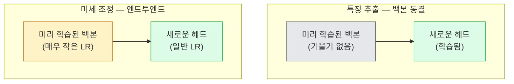

# 전이 학습 및 미세 조정

> 누군가는 수백만 GPU 시간을 들여 네트워크가 가장자리, 텍스처, 객체 부분을 학습하도록 가르쳤습니다. 자신의 모델을 훈련하기 전에 이러한 특징을 빌려 사용해야 합니다.

**유형:** Build
**언어:** Python
**선수 요건:** 4단계 04강 (CNN), 4단계 05강 (이미지 분류)
**시간:** 약 75분

## 학습 목표

- 데이터셋 크기, 도메인 거리, 컴퓨팅 예산에 따라 특징 추출과 미세 조정 중 적절한 방법을 선택하고, 두 방법의 차이를 구분합니다.
- 사전 훈련된 백본을 로드하고 분류기 헤드를 교체한 뒤, 헤드를 20줄 미만의 코드로 훈련하여 작동하는 기준선을 만듭니다.
- 차별적 학습률을 사용하여 층을 점진적으로 언프리즈(freeze 해제)함으로써, 초기의 범용 특징은 작은 업데이트를 받고 후반의 작업 특이적 특징은 더 큰 업데이트를 받도록 합니다.
- 세 가지 흔한 실패를 진단합니다: 언프리즈된 블록에 너무 높은 학습률을 적용하여 발생하는 특징 드리프트, 작은 데이터셋에서 BatchNorm 통계가 붕괴되는 현상, 그리고 파괴적遗忘(catastrophic forgetting)입니다.

## 문제점

ImageNet에서 ResNet-50을 훈련하는 데 약 2,000 GPU 시간이 소요됩니다. 대부분의 팀은 모든 작업에 이 예산을 투입할 수 없습니다. 실제로 대부분의 팀이 배포하는 것은 사전 훈련된 백본에 새로운 헤드를 추가하고, 몇 백 장에서 몇 천 장의 작업 특이적 이미지로 헤드를 훈련하는 방식입니다.

이는 단순한 지름길이 아닙니다. ImageNet으로 훈련된 CNN의 첫 번째 conv 블록은 가장자리와 Gabor 유사 필터를 학습합니다. 그 다음 몇 블록은 텍스처와 단순한 모티프를 학습합니다. 중간 블록은 객체 부분을 학습합니다. 마지막 블록은 1,000개 ImageNet 범주처럼 보이기 시작하는 조합을 학습합니다. 이 계층 구조의 첫 90%는 의료 영상, 산업 검사, 위성 데이터 및 기타 모든 비전 작업으로 거의 변하지 않은 상태로 전이됩니다. 자연은 가장자리와 텍스처의 어휘가 제한적이기 때문입니다. 마지막 10%가 실제로 당신이 훈련하는 부분입니다.

전이 학습을 올바르게 수행하려면 세 가지 버그가 기다리고 있습니다: 너무 높은 학습률로 사전 훈련된 특징을 파괴하는 것, 너무 많은 층을 동결하여 모델에 정보가 부족하게 만드는 것, 그리고 네트워크의 나머지 부분이 학습하지 않은 작은 데이터셋으로 BatchNorm의 실행 통계가 드리프트되도록 방치하는 것입니다. 이 강의에서는 각 버그를 의도적으로 다루며 진행합니다.

## 개념

### 특징 추출 vs 미세 조정

미리 학습된 특징을 얼마나 신뢰하는지와 데이터의 양에 따라 선택하는 두 가지 방식입니다.



경험칙:

| 데이터셋 크기 | 도메인 거리 | 레시피 |
|--------------|-----------------|--------|
| 1천 이미지 미만 | ImageNet과 유사 | 백본 동결, 헤드만 학습 |
| 1천~1만 | 유사 | 첫 2-3 스테이지 동결, 나머지 미세 조정 |
| 1만~10만 | 임의 | 판별적 LR로 엔드투엔드 미세 조정 |
| 10만 이상 | 멀음 | 전체 미세 조정; 도메인이 충분히 멀다면 처음부터 학습 고려 |

"ImageNet과 유사"는 대략 객체와 유사한 내용을 담은 자연 RGB 사진을 의미합니다. 의료 CT 스캔, 상공 위성 이미지, 현미경 이미지는 먼 도메인입니다. 특징은 여전히 도움이 되지만, 더 많은 레이어가 적응하도록 허용해야 합니다.

### 동결이 효과가 있는 이유

CNN이 학습하는 ImageNet 특징은 1,000개 카테고리에 특화되지 않았습니다. 자연 이미지의 통계에 특화되어 있습니다: 특정 방향의 가장자리, 텍스처, 대비 패턴, 형태 원시 요소. 이러한 통계는 사람이 이름 붙일 수 있는 거의 모든 시각 도메인에서 안정적입니다. 그래서 ImageNet으로 학습한 모델이 백본을 미세 조정하지 않고 새로운 선형 헤드만 추가하여 CIFAR-10에서 제로샷으로 평가하면 80% 이상의 정확도를 달성합니다. 헤드는 이 작업을 위해 이미 학습된 특징 중 어떤 것에 가중치를 부여할지 학습하고 있습니다.

### 판별적 학습률

동결을 해제할 때, 초기 레이어는 후기 레이어보다 느리게 학습해야 합니다. 초기 레이어는 보존하려는 범용 특징을 인코딩하고, 후기 레이어는 크게 이동해야 하는 작업 특화 구조를 인코딩합니다.

```
Typical recipe:

  stage 0 (stem + first group): lr = base_lr / 100    (mostly fixed)
  stage 1:                       lr = base_lr / 10
  stage 2:                       lr = base_lr / 3
  stage 3 (last backbone group): lr = base_lr
  head:                          lr = base_lr  (or slightly higher)
```

PyTorch에서는 옵티마이저에 전달하는 매개변수 그룹의 목록으로 구현합니다. 하나의 모델, 다섯 개의 학습률, 추가 코드 없음.

### BatchNorm 문제

BN 레이어는 ImageNet에서 계산된 `running_mean` 및 `running_var` 버퍼를 유지합니다. 작업의 픽셀 분포가 다르면 (조명, 센서, 색상 공간이 다름) 이 버퍼들은 부정확합니다. 선호 순서대로 세 가지 옵션이 있습니다:

1. **학습 모드에서 BN을 미세 조정합니다.** BN이 다른 모든 것과 함께 실행 통계를 업데이트하도록 허용합니다. 작업 데이터셋이 중간 크기 (>= 5k 예제)일 때 기본 선택입니다.
2. **평가 모드에서 BN을 고정합니다.** ImageNet 통계를 유지하고 가중치만 학습합니다. 데이터셋이 BN의 이동 평균이 노이즈가 될 정도로 작을 때 올바른 선택입니다.
3. **BN을 GroupNorm으로 교체합니다.** 이동 평균 문제를 완전히 제거합니다. GPU당 배치 크기가 매우 작은 감지 및 분할 백본에서 사용됩니다.

이 부분을 잘못 설정하면 정확도가 조용히 5-15% 떨어집니다.

### 헤드 설계

분류기 헤드는 1-3개의 선형 레이어와 선택적 드롭아웃으로 구성됩니다. 모든 torchvision 백본은 기본 헤드를 포함하며, 이를 교체해야 합니다:

```
backbone.fc = nn.Linear(backbone.fc.in_features, num_classes)          # ResNet
backbone.classifier[1] = nn.Linear(..., num_classes)                    # EfficientNet, MobileNet
backbone.heads.head = nn.Linear(..., num_classes)                       # torchvision ViT
```

작은 데이터셋의 경우, 단일 선형 레이어가 보통 충분합니다. 작업 분포가 백본의 학습 분포와 거리가 멀 때 숨겨진 레이어 (Linear -> ReLU -> Dropout -> Linear)를 추가하는 것이 도움이 됩니다.

### 레이어별 LR 감쇠

현대 미세 조정 (BEiT, DINOv2, ViT-B 미세 조정)에서 사용되는 판별적 LR의 더 매끄러운 버전입니다. 레이어를 단계로 그룹화하는 대신, 모든 레이어에 바로 위 레이어보다 약간 작은 LR을 부여합니다:

```
lr_layer_k = base_lr * decay^(L - k)
```

decay = 0.75이고 L = 12개의 트랜스포머 블록인 경우, 첫 번째 블록은 `0.75^11 ≈ 0.04x` 헤드 LR로 학습됩니다. CNN보다 트랜스포머 미세 조정에서 더 중요하며, CNN에서는 단계별 그룹화된 LR이 보통 충분합니다.

### 평가할 항목

전이 학습 실행은 처음부터 학습하는 실행에서는 추적하지 않는 두 가지 숫자가 필요합니다:

- **사전 학습 전용 정확도** — 백본이 고정된 상태에서 헤드의 정확도입니다. 이는 하한선입니다.
- **미세 조정된 정확도** — 엔드투엔드 학습 후 동일한 모델의 정확도입니다. 이는 상한선입니다.

미세 조정된 정확도가 사전 학습 전용 정확도보다 낮다면, 학습률 또는 BN 버그가 있습니다. 항상 두 값을 모두 출력하세요.

```figure
transfer-learning
```

## 구현하기

### 1단계: 사전 학습된 백본을 불러와서 검사하기

```python
import torch
import torch.nn as nn
from torchvision.models import resnet18, ResNet18_Weights

backbone = resnet18(weights=ResNet18_Weights.IMAGENET1K_V1)
print(backbone)
print()
print("classifier head:", backbone.fc)
print("feature dim:", backbone.fc.in_features)
```

`ResNet18`는 스템과 `fc` 헤드를 포함하여 네 단계(`layer1..layer4`)로 구성됩니다. 모든 torchvision 분류 백본은 유사한 구조를 가지고 있습니다.

### 2단계: 특징 추출 — 모든 것을 동결하고 헤드 교체하기

```python
def make_feature_extractor(num_classes=10):
    model = resnet18(weights=ResNet18_Weights.IMAGENET1K_V1)
    for p in model.parameters():
        p.requires_grad = False
    model.fc = nn.Linear(model.fc.in_features, num_classes)
    return model

model = make_feature_extractor(num_classes=10)
trainable = sum(p.numel() for p in model.parameters() if p.requires_grad)
frozen = sum(p.numel() for p in model.parameters() if not p.requires_grad)
print(f"trainable: {trainable:>10,}")
print(f"frozen:    {frozen:>10,}")
```

`model.fc`만 학습 가능합니다. 백본은 동결된 특징 추출기입니다.

### 3단계: 판별 미세 조정

단계별 학습률을 사용하여 매개변수 그룹을 구축하는 유틸리티입니다.

```python
def discriminative_param_groups(model, base_lr=1e-3, decay=0.3):
    stages = [
        ["conv1", "bn1"],
        ["layer1"],
        ["layer2"],
        ["layer3"],
        ["layer4"],
        ["fc"],
    ]
    groups = []
    for i, names in enumerate(stages):
        lr = base_lr * (decay ** (len(stages) - 1 - i))
        params = [p for n, p in model.named_parameters()
                  if any(n.startswith(k) for k in names)]
        if params:
            groups.append({"params": params, "lr": lr, "name": "_".join(names)})
    return groups

model = resnet18(weights=ResNet18_Weights.IMAGENET1K_V1)
model.fc = nn.Linear(model.fc.in_features, 10)
for p in model.parameters():
    p.requires_grad = True

groups = discriminative_param_groups(model)
for g in groups:
    print(f"{g['name']:>10s}  lr={g['lr']:.2e}  params={sum(p.numel() for p in g['params']):>8,}")
```

`decay=0.3`는 각 단계가 다음 단계 학습률의 30%로 학습됨을 의미합니다. `fc`는 `base_lr`을, `layer4`는 `0.3 * base_lr`을, `conv1`는 `0.3^5 * base_lr ≈ 0.00243 * base_lr`을 가져갑니다. 극단적으로 들리지만, 경험적으로 효과가 있습니다.

### 4단계: BatchNorm 처리

가중치를 동결하지 않고 BN 실행 통계(run statistics)를 동결하는 헬퍼입니다.

```python
def freeze_bn_stats(model):
    for m in model.modules():
        if isinstance(m, (nn.BatchNorm1d, nn.BatchNorm2d, nn.BatchNorm3d)):
            m.eval()
            for p in m.parameters():
                p.requires_grad = False
    return model
```

매 에포크 시작 시 `model.train()`을 설정한 후 호출하세요. `model.train()`은 모든 것을 학습 모드로 전환합니다. 이 헬퍼는 BN 레이어에 대해서만 이를 되돌립니다.

### 5단계: 최소한의 엔드투엔드 미세 조정 루프

```python
from torch.optim import SGD
from torch.utils.data import DataLoader
from torch.optim.lr_scheduler import CosineAnnealingLR
import torch.nn.functional as F

def fine_tune(model, train_loader, val_loader, device, epochs=5, base_lr=1e-3, freeze_bn=False):
    model = model.to(device)
    groups = discriminative_param_groups(model, base_lr=base_lr)
    optimizer = SGD(groups, momentum=0.9, weight_decay=1e-4, nesterov=True)
    scheduler = CosineAnnealingLR(optimizer, T_max=epochs)

    for epoch in range(epochs):
        model.train()
        if freeze_bn:
            freeze_bn_stats(model)
        tr_loss, tr_correct, tr_total = 0.0, 0, 0
        for x, y in train_loader:
            x, y = x.to(device), y.to(device)
            logits = model(x)
            loss = F.cross_entropy(logits, y, label_smoothing=0.1)
            optimizer.zero_grad()
            loss.backward()
            optimizer.step()
            tr_loss += loss.item() * x.size(0)
            tr_total += x.size(0)
            tr_correct += (logits.argmax(-1) == y).sum().item()
        scheduler.step()

        model.eval()
        va_total, va_correct = 0, 0
        with torch.no_grad():
            for x, y in val_loader:
                x, y = x.to(device), y.to(device)
                pred = model(x).argmax(-1)
                va_total += x.size(0)
                va_correct += (pred == y).sum().item()
        print(f"epoch {epoch}  train {tr_loss/tr_total:.3f}/{tr_correct/tr_total:.3f}  "
              f"val {va_correct/va_total:.3f}")
    return model
```

CIFAR-10에서 위 레시피로 5 에포크를 진행하면 `ResNet18-IMAGENET1K_V1`의 정확도가 제로샷 선형 프로브 기준 약 70%에서 미세 조정 후 약 93%로 향상됩니다. 백본을 건드리지 않으면 헤드만으로는 약 86%에서 정체됩니다.

### 6단계: 점진적 동결 해제

끝에서 시작 쪽으로 에포크마다 한 단계씩 동결을 해제하는 스케줄입니다. 몇몇 추가 에포크의 비용을 치르면서 특징 드리프트(feature drift)를 완화합니다.

```python
def progressive_unfreeze_schedule(model):
    stages = ["layer4", "layer3", "layer2", "layer1"]
    yielded = set()

    def start():
        for p in model.parameters():
            p.requires_grad = False
        for p in model.fc.parameters():
            p.requires_grad = True

    def unfreeze(epoch):
        if epoch < len(stages):
            name = stages[epoch]
            yielded.add(name)
            for n, p in model.named_parameters():
                if n.startswith(name):
                    p.requires_grad = True
            return name
        return None

    return start, unfreeze
```

첫 에포크 전에 `start()`을 한 번 호출하세요. 각 에포크 시작 시 `unfreeze(epoch)`을 호출하세요. 학습 가능한 매개변수 집합이 변경될 때마다 옵티마이저를 재구축하세요. 그렇지 않으면 동결된 매개변수가 옵티마이저를 혼란스럽게 하는 캐시된 모멘트를 계속 보유하게 됩니다.

## 사용하기

대부분의 실제 작업에서는 `torchvision.models` + 세 줄 코드로 충분합니다. 위의 무거운 메커니즘은 라이브러리 기본값이 해결할 수 없는 문제에 직면했을 때 중요합니다.

```python
from torchvision.models import resnet50, ResNet50_Weights

model = resnet50(weights=ResNet50_Weights.IMAGENET1K_V2)
model.fc = nn.Linear(model.fc.in_features, num_classes)
optimizer = torch.optim.AdamW(model.parameters(), lr=1e-4, weight_decay=1e-4)
```

두 가지 추가적인 프로덕션급 기본값:

- `timm`는 일관된 API(`timm.create_model("resnet50", pretrained=True, num_classes=10)`)를 가진 약 800개의 사전 학습된 비전 백본을 제공합니다. torchvision zoo를 넘어서는 미세 조정의 경우 표준입니다.
- 트랜스포머의 경우, `transformers.AutoModelForImageClassification.from_pretrained(name, num_labels=N)`는 텍스트 모델과 동일한 로딩 시맨틱으로 ViT / BEiT / DeiT를 제공합니다.

## 출시하기

이 강의는 다음을 생성합니다:

- `outputs/prompt-fine-tune-planner.md` — 데이터셋 크기, 도메인 거리, 컴퓨팅 예산에 따라 기능 추출(feature extraction) vs 점진적 공개(Progressive Disclosure) vs 엔드투엔드 미세 조정(Fine-tuning)을 선택하는 프롬프트입니다.
- `outputs/skill-freeze-inspector.md` — PyTorch 모델이 주어지면 학습 가능한 매개변수(Parameter)가 무엇인지, BatchNorm 레이어가 평가 모드(eval mode)에 있는지, 그리고 옵티마이저(Optimizer)가 실제로 학습 가능한 매개변수를 입력받는지 보고하는 스킬입니다.

## 연습 문제

1. **(쉬움)** 동일한 합성 CIFAR 데이터셋에서 백본(backbone)을 동결한 선형 프로브(linear probe)로 `ResNet18`를 학습하고, 전체 미세 조정(Fine-tuning)으로도 학습해 보세요. 두 정확도를 나란히 보고하세요. 어떤 격차가 기능(feature)이 잘 전이(Transfer Learning)된다는 것을 나타내는지, 어떤 격차가 전이되지 않는다는 것을 나타내는지 설명하세요.
2. **(중간)** 의도적으로 버그를 도입하세요: 백본(backbone) 단계에 `base_lr = 1e-1`를 설정하고 헤드(head)에는 설정하지 마세요. 학습 손실(Loss Function)이 폭발하는 것을 보여주고, `discriminative_param_groups` 헬퍼를 적용하여 회복하세요. 각 단계가 발산(diverge)하기 시작하는 학습률(Learning Rate)을 기록하세요.
3. **(어려움)** 의료 영상 데이터셋(예: CheXpert-small, PatchCamelyon, HAM10000)을 가져와 세 가지 체제를 비교하세요: (a) ImageNet 사전 학습된 동결 백본 + 선형 헤드; (b) ImageNet 사전 학습된 엔드투엔드 미세 조정(Fine-tuning); (c) 스크래치 학습. 각 경우의 정확도와 컴퓨팅 비용을 보고하세요. 스크래치 학습이 경쟁력을 갖게 되는 데이터셋 크기는 어디인가요?

## 핵심 용어

| 용어 | 사람들이 말하는 것 | 실제 의미 |
|------|----------------|----------------------|
| 기능 추출(Feature Extraction) | "동결하고 헤드 학습" | 백본(backbone) 매개변수(Parameter)가 동결되고, 새로운 분류기 헤드만 기울기(Gradient)를 받습니다 |
| 미세 조정(Fine-tuning) | "엔드투엔드 재학습" | 모든 매개변수(Parameter)가 학습 가능하며, 보통 스크래치 학습보다 훨씬 작은 학습률(Learning Rate)을 사용합니다 |
| 판별적 학습률(Discriminative LR) | "초기 레이어에 더 작은 학습률" | 초기 단계의 학습률이 후기 단계 학습률의 일부인 옵티마이저 매개변수 그룹입니다 |
| 레이어별 학습률 감쇠(Layer-wise LR decay) | "매끄러운 학습률 기울기" | 레이어별 학습률이 decay^(L - k)로 곱해지며, 트랜스포머(Transformer) 미세 조정(Fine-tuning)에서 일반적입니다 |
| 파괴적遗忘(Catastrophic forgetting) | "모델이 ImageNet을 잃어버림" | 너무 높은 학습률(Learning Rate)이 새로운 작업 신호가 학습되기 전에 사전 학습된 기능(features)을 덮어씁니다 |
| BN 통계 드리프트(BN statistics drift) | "런닝 평균이 잘못됨" | BatchNorm의 running_mean/var이 현재 작업과 다른 분포(Distribution Shift)에서 계산되어 정확도를 조용히 해칩니다 |
| 선형 프로브 | "동결된 백본 + 선형 헤드" | 사전 학습된 특징의 평가 — 동결된 표현 위에 최적의 선형 분류기를 얹었을 때의 정확도 |
| 파괴적 붕괴 | "모든 것이 하나의 클래스를 예측" | 헤드에서 기울기가 안정화되기 전에 특징을 파괴할 만큼 충분히 높은 학습률(LR)로 미세 조정할 때 발생 |

## 추가 읽기

- [How transferable are features in deep neural networks? (Yosinski et al., 2014)](https://arxiv.org/abs/1411.1792) — 레이어 간 특징 전이성을 정량화한 논문
- [Universal Language Model Fine-tuning (ULMFiT, Howard & Ruder, 2018)](https://arxiv.org/abs/1801.06146) — 원본 판별적 학습률(LR) / 점진적 언프리즈 레시피; 아이디어는 비전으로 직접 전이됨
- [timm documentation](https://huggingface.co/docs/timm) — 현대 비전 백본과 그 백본이 학습된 정확한 미세 조정 기본값에 대한 참고 자료
- [A Simple Framework for Linear-Probe Evaluation (Kornblith et al., 2019)](https://arxiv.org/abs/1805.08974) — 선형 프로브 정확도가 중요한 이유와 이를 올바르게 보고하는 방법
