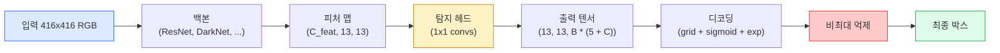

# Object Detection — YOLO from Scratch

> 탐지(Detection)는 분류(Classification)와 회귀(Regression)를 결합한 작업으로, 피처 맵의 모든 위치에서 수행한 뒤 비최대 억제(non-maximum suppression)로 정제합니다.

**유형:** Build
**언어:** Python
**선수 요건:** 4단계 03강 (CNN), 4단계 04강 (이미지 분류), 4단계 05강 (전이 학습)
**시간:** 약 75분

## 학습 목표

- 탐지를 밀집 예측(dense prediction) 문제로 변환하는 그리드(grid) 및 앵커(anchor) 설계 방식을 설명하고, 출력 텐서(output tensor)의 모든 숫자가 의미하는 바를 서술해 보세요
- 박스(box) 간 교차율(Intersection-over-Union, IoU)을 계산하고, 비최대 억제(non-maximum suppression)를 처음부터 구현해 보세요
- 사전 학습된 백본(backbone) 위에 분류(Classification), 객체성(Objectness), 박스 회귀(Box-Regression) 손실(Loss)을 포함하는 최소한의 YOLO 스타일 헤드(head)를 구축해 보세요
- 탐지 지표 행(precision@0.5, recall, mAP@0.5, mAP@0.5:0.95)을 읽고, 다음에 조정할 파라미터를 선택해 보세요

## 문제점

분류(Classification)는 "이 이미지는 개(dog)입니다"라고 말하지만, 탐지(Detection)는 "픽셀 (112, 40, 280, 210)에 개가 있고, (400, 180, 560, 310)에 고양이(cat)가 있으며, 프레임 내에는 그 외의 것이 없다"라고 말합니다. 이미지당 하나의 레이블(label)을 예측하는 대신 레이블이 지정된 박스(box)의 개수를 가변적으로 예측하는 이 하나의 구조적 변화가 모든 자율 시스템, 모든 감시 제품, 모든 문서 레이아웃 파서(parser), 모든 공장 비전 라인(vision line)이 의존하는 핵심입니다.

탐지는 비전(vision)의 모든 엔지니어링 트레이드오프(trade-off)가 한 번에 드러나는 영역이기도 합니다. 정확한 박스(regression head)를 원하고, 각 박스에 올바른 클래스(class)를 할당(classification head)해야 하며, 모델이 탐지할 대상이 없을 때를 알아야(objectness score) 하고, 실제 객체(object)당 정확히 하나의 예측만 생성(non-maximum suppression)해야 합니다. 이 중 하나라도 놓치면 파이프라인(pipeline)은 객체를 놓치거나, 환각(hallucination)된 박스를 보고하거나, 같은 객체를 약간 다른 위치에서 15번 예측하게 됩니다.

YOLO (You Only Look Once, Redmon et al. 2016)는 컨브넷(conv net)의 단일 순전파(single forward pass)로 이 모든 것을 실시간으로 실행하도록 설계되었으며, 동일한 구조적 결정은 현대 탐지 모델(YOLOv8, YOLOv9, YOLO-NAS, RT-DETR)의 백본(backbone)으로 여전히 남아 있습니다. 핵심을 학습하면 모든 변형(variant)은 동일한 부품의 재배치(rearrangement)가 됩니다.

## 개념

### 밀집 예측으로서의 탐지

분류기는 이미지당 C개의 숫자를 출력합니다. YOLO 스타일 탐지기는 이미지당 `(S x S x (5 + C))`개의 숫자를 출력하며, 여기서 S는 공간 그리드 크기입니다.



각 `S * S` 그리드 셀은 `B`개의 박스를 예측합니다. 각 박스에 대해:

- 4개의 숫자는 기하학을 설명합니다: `tx, ty, tw, th`.
- 1개의 숫자는 객체성 점수입니다: "이 셀에 중심을 둔 객체가 있나요?"
- C개의 숫자는 클래스 확률입니다.

셀당 총합: `B * (5 + C)`. `S=13, B=2, C=20`인 VOC의 경우, 셀당 50개의 숫자입니다.

### 그리드와 앵커를 사용하는 이유

단순 회귀는 모든 객체에 대해 절대 좌표로 `(x, y, w, h)`를 예측합니다. 이는 컨볼루션 네트워크에 어렵습니다. 이미지를 이동하면 모든 예측이 동일한 양만큼 이동해야 하는데, 각 객체는 공간적으로 고정되어 있기 때문입니다. 그리드는 이 문제를 해결하기 위해 각 정답 박스를 그 중심이 포함된 그리드 셀에 할당하며, 해당 객체에 대해서는 그 셀만 책임을 집니다.

앵커는 두 번째 문제를 해결합니다. 3x3 컨볼루션은 16픽셀 수용 영역 피처 셀에서 500픽셀 너비의 박스를 쉽게 회귀할 수 없습니다. 대신, 셀당 `B`개의 사전 정의된 박스 형태(앵커)를 미리 정의하고 각 앵커로부터 작은 델타를 예측합니다. 모델은 앵커를 선택하고 미세 조정하는 것을 학습하며, 무에서 회귀하는 것이 아닙니다.

```
Anchor box priors (example for 416x416 input):

  small:   (30,  60)
  medium:  (75,  170)
  large:   (200, 380)

At each grid cell, every anchor emits (tx, ty, tw, th, obj, c_1, ..., c_C).
```

현대 탐지기는 종종 FPN을 사용하며, 해상도마다 다른 앵커 세트가 사용됩니다. 얕은 고해상도 맵에는 작은 앵커를, 깊은 저해상도 맵에는 큰 앵커를 사용합니다. 같은 아이디어, 더 많은 스케일.

### 예측 디코딩

원시 `tx, ty, tw, th`는 박스 좌표가 아닙니다. 플롯하기 전에 변환해야 하는 회귀 대상입니다:

```
centre x  = (sigmoid(tx) + cell_x) * stride
centre y  = (sigmoid(ty) + cell_y) * stride
width     = anchor_w * exp(tw)
height    = anchor_h * exp(th)
```

`sigmoid`는 셀 내부의 중심 오프셋을 유지합니다. `exp`는 부호 반전 없이 앵커로부터 너비를 자유롭게 스케일링합니다. `stride`는 그리드 좌표를 픽셀로 되돌립니다. 이 디코딩 단계는 v2 이후 모든 YOLO 버전에서 동일합니다.

### IoU

두 상자 사이의 보편적인 유사도 측정 지표:

```
IoU(A, B) = area(A intersect B) / area(A union B)
```

IoU = 1은 완전히 일치함을 의미하며, IoU = 0은 겹침이 없음을 의미합니다. 예측값과 정답(Ground Truth) 상자 사이의 IoU는 예측이 참 양성(True Positive)으로 간주되는지 결정합니다 (일반적으로 IoU >= 0.5). 두 예측값 사이의 IoU는 NMS가 중복을 제거하는 데 사용합니다.

### 비최대 억제

인접한 앵커로 학습된 컨볼루션 네트워크는 동일한 객체에 대해 겹치는 상자를 예측하는 경우가 많습니다. NMS는 가장 높은 신뢰도를 가진 예측을 유지하고, 임계값 이상의 IoU를 가진 다른 모든 예측을 삭제합니다.

```
NMS(boxes, scores, iou_threshold):
    sort boxes by score descending
    keep = []
    while boxes not empty:
        pick the top-scoring box, add to keep
        remove every box with IoU > iou_threshold to the picked box
    return keep
```

일반적인 임계값: 객체 감지에서 0.45. 최근의 탐지기는 표준 NMS를 `soft-NMS`, `DIoU-NMS`로 대체하거나 억제 과정을 직접 학습(RT-DETR)하지만, 구조적인 목적은 동일합니다.

### 손실 함수

YOLO 손실은 가중치가 적용된 세 가지 손실의 합입니다:

```
L = lambda_coord * L_box(pred, target, where obj=1)
  + lambda_obj   * L_obj(pred, 1,     where obj=1)
  + lambda_noobj * L_obj(pred, 0,     where obj=0)
  + lambda_cls   * L_cls(pred, target, where obj=1)
```

객체를 포함하는 셀만 상자 회귀 및 분류 손실에 기여합니다. 객체가 없는 셀은 객체성(Objectness) 손실에만 기여합니다 (모델이 침묵하도록 가르침). `lambda_noobj`는 대부분의 셀이 비어 있어 총 손실을 지배할 수 있으므로 보통 작은 값(~0.5)으로 설정됩니다.

현대 변형들은 MSE 상자 손실을 CIoU / DIoU (IoU를 직접 최적화)로 교체하고, 클래스 불균형에 대해 초점 손실(Focal Loss)을 사용하며, 객체성을 품질 초점 손실(Quality Focal Loss)과 균형 있게 조정합니다. 세 가지 구성 요소의 구조는 변하지 않았습니다.

### 감지 지표

정확도는 감지 작업에 그대로 적용되지 않습니다. 다음 네 가지 지표가 적용됩니다:

- **Precision@IoU=0.5** — 양성으로 계산된 예측 중 실제로 올바른 예측이 얼마나 많은지.
- **Recall@IoU=0.5** — 실제 객체 중 우리가 얼마나 많이 찾아냈는지.
- **AP@0.5** — IoU 임계값 0.5에서의 정밀도-재현율 곡선 면적; 클래스당 하나의 값.
- **mAP@0.5:0.95** — IoU 임계값 0.5, 0.55, ..., 0.95에 대한 AP의 평균. COCO 지표; 가장 엄격하고 정보량이 많습니다.

네 가지 모두 보고하세요. mAP@0.5에서는 강하지만 mAP@0.5:0.95에서는 약한 탐지기는 대략적으로 위치를 잡지만 정밀하지는 않습니다. 더 나은 박스 회귀 손실로 수정하세요. 정밀도가 높고 재현율이 낮은 탐지기는 너무 보수적입니다. 신뢰도 임계값을 낮추거나 객체성 가중치를 높이세요.

```figure
object-detection-nms
```

## 구현하기

### 1단계: IoU

이 강의의 핵심 도구입니다. `(x1, y1, x2, y2)` 형식의 두 박스 배열에서 작동합니다.

```python
import numpy as np

def box_iou(boxes_a, boxes_b):
    ax1, ay1, ax2, ay2 = boxes_a[:, 0], boxes_a[:, 1], boxes_a[:, 2], boxes_a[:, 3]
    bx1, by1, bx2, by2 = boxes_b[:, 0], boxes_b[:, 1], boxes_b[:, 2], boxes_b[:, 3]

    inter_x1 = np.maximum(ax1[:, None], bx1[None, :])
    inter_y1 = np.maximum(ay1[:, None], by1[None, :])
    inter_x2 = np.minimum(ax2[:, None], bx2[None, :])
    inter_y2 = np.minimum(ay2[:, None], by2[None, :])

    inter_w = np.clip(inter_x2 - inter_x1, 0, None)
    inter_h = np.clip(inter_y2 - inter_y1, 0, None)
    inter = inter_w * inter_h

    area_a = (ax2 - ax1) * (ay2 - ay1)
    area_b = (bx2 - bx1) * (by2 - by1)
    union = area_a[:, None] + area_b[None, :] - inter
    return inter / np.clip(union, 1e-8, None)
```

`(N_a, N_b)` 크기의 쌍별 IoU 행렬을 반환합니다. 하나의 배열을 `(1, 4)` 모양으로 만들어 단일 정답 박스에 대해 사용하세요.

### 2단계: 비최대 억제

```python
def nms(boxes, scores, iou_threshold=0.45):
    order = np.argsort(-scores)
    keep = []
    while len(order) > 0:
        i = order[0]
        keep.append(i)
        if len(order) == 1:
            break
        rest = order[1:]
        ious = box_iou(boxes[[i]], boxes[rest])[0]
        order = rest[ious <= iou_threshold]
    return np.array(keep, dtype=np.int64)
```

결정적이며, 정렬에서 `O(N log N)`를 반환하고, 동일한 입력에서 `torchvision.ops.nms`의 동작과 일치합니다.

### 3단계: 박스 인코딩 및 디코딩

픽셀 좌표와 네트워크가 실제로 회귀하는 `(tx, ty, tw, th)` 타깃 간에 변환합니다.

```python
def encode(box_xyxy, cell_x, cell_y, stride, anchor_wh):
    x1, y1, x2, y2 = box_xyxy
    cx = 0.5 * (x1 + x2)
    cy = 0.5 * (y1 + y2)
    w = x2 - x1
    h = y2 - y1
    tx = cx / stride - cell_x
    ty = cy / stride - cell_y
    tw = np.log(w / anchor_wh[0] + 1e-8)
    th = np.log(h / anchor_wh[1] + 1e-8)
    return np.array([tx, ty, tw, th])


def decode(tx_ty_tw_th, cell_x, cell_y, stride, anchor_wh):
    tx, ty, tw, th = tx_ty_tw_th
    cx = (sigmoid(tx) + cell_x) * stride
    cy = (sigmoid(ty) + cell_y) * stride
    w = anchor_wh[0] * np.exp(tw)
    h = anchor_wh[1] * np.exp(th)
    return np.array([cx - w / 2, cy - h / 2, cx + w / 2, cy + h / 2])


def sigmoid(x):
    return 1.0 / (1.0 + np.exp(-x))
```

테스트: 박스를 인코딩한 후 디코딩하면 원본과 매우 가까운 값을 얻어야 합니다 (`tx`가 시그모이드 후 범위에 있지 않을 때 시그모이드 역함수가 완전히 가역적이지는 않으므로).

### 4단계: 최소 YOLO 헤드

피처 맵에 1x1 컨볼루션을 적용하고 `(B, S, S, num_anchors, 5 + C)`로 리셰이핑합니다.

```python
import torch
import torch.nn as nn

class YOLOHead(nn.Module):
    def __init__(self, in_c, num_anchors, num_classes):
        super().__init__()
        self.num_anchors = num_anchors
        self.num_classes = num_classes
        self.conv = nn.Conv2d(in_c, num_anchors * (5 + num_classes), kernel_size=1)

    def forward(self, x):
        n, _, h, w = x.shape
        y = self.conv(x)
        y = y.view(n, self.num_anchors, 5 + self.num_classes, h, w)
        y = y.permute(0, 3, 4, 1, 2).contiguous()
        return y
```

출력 모양: `(N, H, W, num_anchors, 5 + C)`. 마지막 차원은 `[tx, ty, tw, th, obj, cls_0, ..., cls_{C-1}]`을 포함합니다.

### 5단계: 정답 할당

모든 정답 박스에 대해 `(cell, anchor)` 중 어느 것이 담당하는지 결정합니다.

```python
def assign_targets(boxes_xyxy, classes, anchors, stride, grid_size, num_classes):
    num_anchors = len(anchors)
    target = np.zeros((grid_size, grid_size, num_anchors, 5 + num_classes), dtype=np.float32)
    has_obj = np.zeros((grid_size, grid_size, num_anchors), dtype=bool)

    for box, cls in zip(boxes_xyxy, classes):
        x1, y1, x2, y2 = box
        cx, cy = 0.5 * (x1 + x2), 0.5 * (y1 + y2)
        gx, gy = int(cx / stride), int(cy / stride)
        bw, bh = x2 - x1, y2 - y1

        ious = np.array([
            (min(bw, aw) * min(bh, ah)) / (bw * bh + aw * ah - min(bw, aw) * min(bh, ah))
            for aw, ah in anchors
        ])
        best = int(np.argmax(ious))
        aw, ah = anchors[best]

        target[gy, gx, best, 0] = cx / stride - gx
        target[gy, gx, best, 1] = cy / stride - gy
        target[gy, gx, best, 2] = np.log(bw / aw + 1e-8)
        target[gy, gx, best, 3] = np.log(bh / ah + 1e-8)
        target[gy, gx, best, 4] = 1.0
        target[gy, gx, best, 5 + cls] = 1.0
        has_obj[gy, gx, best] = True
    return target, has_obj
```

앵커 선택은 "정답과의 최적합 모양 IoU"로, YOLOv2/v3 할당과 일치하는 저렴한 대리 지표입니다. v5 이후는 더 정교한 전략(작업 정렬 매칭, 동적 k)을 사용하여 동일한 아이디어를 개선합니다.

### 6단계: 세 가지 손실

```python
def yolo_loss(pred, target, has_obj, lambda_coord=5.0, lambda_obj=1.0, lambda_noobj=0.5, lambda_cls=1.0):
    has_obj_t = torch.from_numpy(has_obj).bool()
    target_t = torch.from_numpy(target).float()

    # 박스 회귀 손실: 객체가 있는 셀에만 적용
    box_pred = pred[..., :4][has_obj_t]
    box_true = target_t[..., :4][has_obj_t]
    loss_box = torch.nn.functional.mse_loss(box_pred, box_true, reduction="sum")

    # 객체성 손실
    obj_pred = pred[..., 4]
    obj_true = target_t[..., 4]
    loss_obj_pos = torch.nn.functional.binary_cross_entropy_with_logits(
        obj_pred[has_obj_t], obj_true[has_obj_t], reduction="sum")
    loss_obj_neg = torch.nn.functional.binary_cross_entropy_with_logits(
        obj_pred[~has_obj_t], obj_true[~has_obj_t], reduction="sum")

    # 객체가 있는 셀에 대한 분류 손실
    cls_pred = pred[..., 5:][has_obj_t]
    cls_true = target_t[..., 5:][has_obj_t]
    loss_cls = torch.nn.functional.binary_cross_entropy_with_logits(
        cls_pred, cls_true, reduction="sum")

    total = (lambda_coord * loss_box
             + lambda_obj * loss_obj_pos
             + lambda_noobj * loss_obj_neg
             + lambda_cls * loss_cls)
    return total, {"box": loss_box.item(), "obj_pos": loss_obj_pos.item(),
                   "obj_neg": loss_obj_neg.item(), "cls": loss_cls.item()}
```

모든 YOLO 튜토리얼이 하드코딩하거나 스윕하는 다섯 가지 하이퍼파라미터. 비율이 중요합니다: `lambda_coord=5, lambda_noobj=0.5`는 원본 YOLOv1 논문과 동일하며 합리적인 기본값으로 여전히 작동합니다.

### 7단계: 추론 파이프라인

원시 헤드 출력을 디코딩하고, 시그모이드/지수 함수를 적용하고, 객체성 임계값을 적용하고, NMS를 수행합니다.

```python
def postprocess(pred_tensor, anchors, stride, img_size, conf_threshold=0.25, iou_threshold=0.45):
    pred = pred_tensor.detach().cpu().numpy()
    grid_h, grid_w = pred.shape[1], pred.shape[2]
    num_anchors = len(anchors)

    boxes, scores, classes = [], [], []
    for gy in range(grid_h):
        for gx in range(grid_w):
            for a in range(num_anchors):
                tx, ty, tw, th, obj, *cls = pred[0, gy, gx, a]
                score = sigmoid(obj) * sigmoid(np.array(cls)).max()
                if score < conf_threshold:
                    continue
                cls_idx = int(np.argmax(cls))
                cx = (sigmoid(tx) + gx) * stride
                cy = (sigmoid(ty) + gy) * stride
                w = anchors[a][0] * np.exp(tw)
                h = anchors[a][1] * np.exp(th)
                boxes.append([cx - w / 2, cy - h / 2, cx + w / 2, cy + h / 2])
                scores.append(float(score))
                classes.append(cls_idx)

    if not boxes:
        return np.zeros((0, 4)), np.zeros((0,)), np.zeros((0,), dtype=int)
    boxes = np.array(boxes)
    scores = np.array(scores)
    classes = np.array(classes)
    keep = nms(boxes, scores, iou_threshold)
    return boxes[keep], scores[keep], classes[keep]
```

이것이 완전한 평가 경로입니다: head -> decode -> threshold -> NMS.

## 사용하기

`torchvision.models.detection`는 동일한 개념적 구조를 가진 프로덕션 디텍터를 제공합니다. 사전 학습된 모델을 로드하는 데 세 줄이면 됩니다.

```python
import torch
from torchvision.models.detection import fasterrcnn_resnet50_fpn_v2

model = fasterrcnn_resnet50_fpn_v2(weights="DEFAULT")
model.eval()
with torch.no_grad():
    predictions = model([torch.randn(3, 400, 600)])
print(predictions[0].keys())
print(f"boxes:  {predictions[0]['boxes'].shape}")
print(f"scores: {predictions[0]['scores'].shape}")
print(f"labels: {predictions[0]['labels'].shape}")
```

실시간 추론 파이프라인에서는 `ultralytics` (YOLOv8/v9)가 표준입니다: `from ultralytics import YOLO; model = YOLO('yolov8n.pt'); model(img)`. 모델은 디코딩과 NMS를 내부적으로 처리하며, 위에서 구축한 것과 동일한 `boxes / scores / labels` 삼중항(triple)을 반환합니다.

## 출시하기

이 강의는 다음을 생성합니다:

- `outputs/prompt-detection-metric-reader.md` — `precision, recall, AP, mAP@0.5:0.95` 행을 한 줄 진단과 가장 유용한 다음 실험으로 변환하는 프롬프트입니다.
- `outputs/skill-anchor-designer.md` — ground-truth 박스 데이터셋이 주어지면 `(w, h)`에 대해 k-means를 실행하고, FPN 레벨별 앵커 세트와 올바른 수의 앵커를 선택하는 데 필요한 커버리지 통계를 반환하는 스킬입니다.

## 연습 문제

1. **(쉬움)** `box_iou`를 구현하고 1,000개의 랜덤 박스 쌍에 대해 `torchvision.ops.box_iou`를 실행하세요. 최대 절대 차이가 `1e-6` 미만인지 확인하세요.
2. **(중간)** `yolo_loss`를 MSE 대신 `CIoU` 박스 손실을 사용하는 버전으로 포팅하세요. 100개 이미지의 합성 데이터셋에서 동일한 에포크 수에서 CIoU가 MSE보다 더 나은 최종 mAP@0.5:0.95로 수렴함을 보이세요.
3. **(어려움)** 멀티 스케일 추론을 구현하세요: 동일한 이미지를 세 가지 해상도로 모델에 입력하고, 박스 예측을 합친 후 마지막에 단일 NMS를 실행하세요. 홀드아웃 세트에서 단일 스케일 추론 대비 mAP 상승분을 측정하세요.

## 핵심 용어

| 용어 | 사람들이 말하는 표현 | 실제 의미 |
|------|----------------|----------------------|
| 앵커 | "박스 사전" | 네트워크가 절대 좌표 대신 델타를 예측하는 각 그리드 셀의 사전 정의된 박스 형태 |
| IoU | "중복" | 두 박스의 교집합 대 합집합; 탐지에서 보편적인 유사도 측정 |
| NMS | "중복 제거" | 가장 높은 점수의 예측을 유지하고 임계값 이상의 중복된 예측을 제거하는 탐욕 알고리즘 |
| Objectness | "여기에 무언가가 있다" | 앵커별, 셀별 스칼라로, 물체가 해당 셀의 중심에 있는지 예측 |
| 그리드 스트라이드 | "다운샘플 팩터" | 그리드 셀당 픽셀 수; 416px 입력에 13 그리드 head가 있으면 스트라이드는 32 |
| mAP | "Mean average precision" | 정밀도-재현율 곡선 아래 면적의 평균으로, 클래스와 (COCO의 경우) IoU 임계값에 대해 평균을 낸 값 |
| AP@0.5 | "PASCAL VOC AP" | IoU 임계값 0.5에서의 평균 정밀도; 이 지표의 느슨한 버전 |
| mAP@0.5:0.95 | "COCO AP" | IoU 임계값 0.5~0.95를 0.05 간격으로 평균 낸 값; 엄격한 버전이자 현재 커뮤니티 표준 |

## 추가 읽기

- [YOLOv1: You Only Look Once (Redmon et al., 2016)](https://arxiv.org/abs/1506.02640) — 창립 논문; 이후 모든 YOLO는 이 구조의 개선입니다
- [YOLOv3 (Redmon & Farhadi, 2018)](https://arxiv.org/abs/1804.02767) — 다중 스케일 FPN 스타일 헤드를 도입한 논문; 여전히 가장 명확한 다이어그램입니다
- [Ultralytics YOLOv8 docs](https://docs.ultralytics.com) — 현재 생산 환경의 참고 자료; 데이터셋 형식, 증강, 학습 레시피를 다룹니다
- [The Illustrated Guide to Object Detection (Jonathan Hui)](https://jonathan-hui.medium.com/object-detection-series-24d03a12f904) — 전체 디텍터 군집에 대한 가장 평이한 영어 설명; DETR, RetinaNet, FCOS, YOLO의 관계를 이해하는 데 매우 유용합니다
