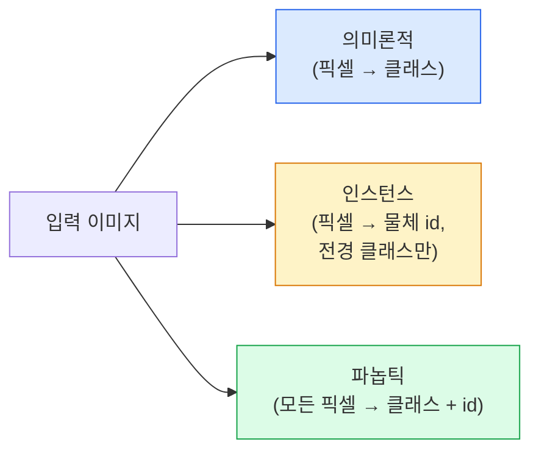

# 의미론적 분할 — U-Net (Semantic Segmentation — U-Net)

> 분할(segmentation)은 모든 픽셀에서의 분류입니다. U-Net은 다운샘플 인코더와 업샘플 디코더를 짝 짓고 그 사이에 스킵 연결을 이어 이를 동작하게 합니다.

**Type:** Build
**Languages:** Python
**Prerequisites:** Phase 4 Lesson 03 (CNNs), Phase 4 Lesson 04 (Image Classification)
**Time:** ~75 minutes

## 학습 목표 (Learning Objectives)

- 의미론적(semantic)·인스턴스(instance)·파놉틱(panoptic) 분할을 구분하고 주어진 문제에 맞는 작업을 고릅니다
- 인코더 블록, 병목, 전치 합성곱 디코더, 스킵 연결로 PyTorch에서 U-Net을 처음부터 만듭니다
- 픽셀별 교차 엔트로피, Dice 손실, 의료·산업 분할의 현재 기본인 결합 손실을 구현합니다
- 클래스별 IoU와 Dice 지표를 읽고, 나쁜 점수가 소물체 recall·경계 정확도·클래스 불균형 중 어디서 오는지 진단합니다

## 문제 상황 (The Problem)

분류는 이미지당 라벨 하나를 출력합니다. 검출은 이미지당 박스 몇 개를 출력합니다. 분할은 픽셀당 라벨 하나를 출력합니다. 크기 `H x W` 입력에 대해 출력은 shape `H x W`(의미론적) 또는 `H x W x N_instances`(인스턴스) 텐서입니다. 이미지당 하나가 아니라 수백만 예측입니다.

분할의 구조가 거의 모든 밀집 예측 비전 제품을 구동하는 이유입니다: 의료 영상(종양 마스크), 자율 주행(도로, 차선, 장애물), 위성(건물 발자국, 작물 경계), 문서 파싱(레이아웃 구역), 로봇(잡을 수 있는 영역). 그 작업 중 어느 것도 물체 주위에 박스를 두는 것으로 풀 수 없습니다; 정확한 실루엣이 필요합니다.

아키텍처 문제는 말하기는 쉽고 풀기는 쉽지 않습니다: 네트워크가 이미지의 전역 맥락(이것이 어떤 종류의 장면인가)과 지역 픽셀 디테일(정확히 어느 픽셀이 도로 vs 보도인가)을 동시에 봐야 합니다. 표준 CNN은 맥락을 얻으려고 공간을 압축하며, 디테일을 버립니다. U-Net이 둘 다 얻은 설계였습니다.

## 핵심 개념 (The Concept)

### 의미론적 vs 인스턴스 vs 파놉틱



- **의미론적(Semantic)** 은 "이 픽셀은 도로, 저 픽셀은 차"라고 말합니다. 나란한 차 두 대가 하나의 blob으로 합쳐집니다.
- **인스턴스(Instance)** 는 "이 픽셀은 차 #3, 저 픽셀은 차 #5"라고 말합니다. 배경 물건("stuff" = 하늘, 도로, 잔디)은 무시합니다.
- **파놉틱(Panoptic)** 은 둘을 통합합니다: 모든 픽셀이 클래스 라벨을 받고, 모든 인스턴스가 고유 id를 받으며, stuff와 things 모두 분할됩니다.

이 레슨은 의미론적을 다룹니다. 다음 레슨(Mask R-CNN)이 인스턴스를 다룹니다.

### U-Net 형태


인코더는 공간 해상도를 네 번 반으로 줄이고 채널을 두 배로 합니다. 디코더는 반대로: 공간 해상도를 네 번 두 배로, 채널을 반으로. 스킵 연결은 모든 해상도에서 짝 맞는 인코더 특징을 디코더 특징과 연결합니다. 최종 1x1 conv는 전체 해상도에서 `64 -> num_classes`를 매핑합니다.

스킵 연결이 필요한 이유: 디코더가 픽셀 수준 예측을 내려 할 때쯤이면 작은 특징 맵만 본 상태입니다. 스킵이 없으면 인코더에서 그 정보가 압축되어 버려졌기 때문에 가장자리를 정확히 위치시킬 수 없습니다. 스킵 연결이 인코더가 내려가며 계산한 고해상도 특징 맵을 건네 줍니다.

### 전치 vs 쌍선형 업샘플

디코더는 공간 차원을 확장해야 합니다. 옵션 둘:

- **전치 합성곱(Transposed convolution)** (`nn.ConvTranspose2d`) — 학습 가능한 업샘플. 역사적 U-Net 기본. 스트라이드와 커널 크기가 균등히 나누어지지 않으면 체커보드 아티팩트를 낼 수 있습니다.
- **쌍선형 업샘플 + 3x3 conv** — 부드러운 업샘플 뒤 conv. 아티팩트 적고, 파라미터 적고, 이제 현대 기본입니다.

둘 다 현장에서 나타납니다. 첫 U-Net에는 bilinear이 더 안전합니다.

### 픽셀 격자 위 교차 엔트로피

C클래스 의미론적 분할에서 모델 출력은 `(N, C, H, W)`입니다. 타깃은 정수 클래스 ID의 `(N, H, W)`입니다. 교차 엔트로피는 분류 경우와 동일하며, 모든 공간 위치에 적용됩니다:

```
Loss = mean over (n, h, w) of -log( softmax(logits[n, :, h, w])[target[n, h, w]] )
```

PyTorch의 `F.cross_entropy`가 이 shape를 네이티브로 처리합니다. reshape 필요 없음.

### Dice 손실과 필요한 이유

교차 엔트로피는 모든 픽셀을 동등하게 취급합니다. 한 클래스가 프레임을 지배할 때(의료 영상: 배경 99%, 종양 1%) 그것은 틀립니다. 네트워크는 모든 곳에 배경을 예측해 정확도 99%를 내고도 여전히 쓸모없을 수 있습니다.

Dice 손실은 예측과 진짜 마스크의 겹침을 직접 최적화해 이를 풉니다:

```
Dice(p, y) = 2 * sum(p * y) / (sum(p) + sum(y) + epsilon)
Dice_loss = 1 - Dice
```

여기서 `p`는 클래스의 sigmoid/softmax 확률 맵이고 `y`는 이진 정답 마스크입니다. 손실은 겹침이 완벽할 때만 0입니다. 비율 기반이므로 클래스 불균형은 무관합니다.

실무에서는 **결합 손실**을 씁니다:

```
L = L_cross_entropy + lambda * L_dice       (lambda ~ 1)
```

교차 엔트로피는 학습 초기에 안정적 기울기를 주고; Dice는 학습 꼬리에서 마스크 형태를 실제로 맞추는 데 집중합니다. 이 조합이 의료 영상 기본이며 어떤 클래스 불균형 데이터셋에서도 이기기 어렵습니다.

### 평가 지표

- **픽셀 정확도** — 올바르게 예측된 픽셀 비율. 쌈. 분류의 정확도와 같은 이유로 불균형 데이터에서 깨짐.
- **클래스별 IoU** — 각 클래스 마스크의 intersection over union; 클래스에 걸쳐 평균 = mIoU.
- **Dice (픽셀의 F1)** — IoU와 비슷; `Dice = 2 * IoU / (1 + IoU)`. 의료 영상은 Dice, 주행 커뮤니티는 IoU를 선호; 단조 관련.
- **Boundary F1** — 예측 경계가 정답 경계에 얼마나 가까운지 재며, 작은 이동도 벌합니다. 반도체 검사 같은 고정밀 작업에 중요.

mIoU만이 아니라 클래스별 IoU를 보고하세요. 평균 IoU는 다른 아홉이 85%일 때 15%인 클래스를 숨깁니다.

### 입력 해상도 트레이드오프

U-Net의 인코더는 해상도를 네 번 반으로 줄이므로 입력은 16으로 나누어져야 합니다. 의료 이미지는 종종 512x512 또는 1024x1024입니다. 자율 주행 크롭은 2048x1024입니다. U-Net의 메모리 비용은 `H * W * C_max`에 비례하고, 1024x1024에 병목 채널 1024이면 forward 패스만으로도 이미 기가바이트의 VRAM을 씁니다.

표준 우회 둘:
1. 입력을 타일 — 겹침 있는 256x256 타일을 처리하고 이어 붙임.
2. 병목을 공간 해상도는 더 높게 유지하면서 수용 영역을 넓히는 dilated convolution으로 교체(DeepLab 계열).

첫 모델에는 64채널 베이스 U-Net과 256x256 입력이 8 GB VRAM에서 편안하게 학습합니다.

```figure
segmentation-flood
```

## 직접 만들기 (Build It)

### 1단계: 인코더 블록

배치 정규화와 ReLU가 있는 3x3 conv 둘. 첫 conv가 채널 수를 바꾸고; 둘째가 유지합니다.

```python
import torch
import torch.nn as nn
import torch.nn.functional as F

class DoubleConv(nn.Module):
    def __init__(self, in_c, out_c):
        super().__init__()
        self.net = nn.Sequential(
            nn.Conv2d(in_c, out_c, kernel_size=3, padding=1, bias=False),
            nn.BatchNorm2d(out_c),
            nn.ReLU(inplace=True),
            nn.Conv2d(out_c, out_c, kernel_size=3, padding=1, bias=False),
            nn.BatchNorm2d(out_c),
            nn.ReLU(inplace=True),
        )

    def forward(self, x):
        return self.net(x)
```

이 블록은 전체에 재사용됩니다. BN의 beta가 편향을 처리하므로 `bias=False`입니다.

### 2단계: Down과 Up 블록

```python
class Down(nn.Module):
    def __init__(self, in_c, out_c):
        super().__init__()
        self.net = nn.Sequential(
            nn.MaxPool2d(2),
            DoubleConv(in_c, out_c),
        )

    def forward(self, x):
        return self.net(x)


class Up(nn.Module):
    def __init__(self, in_c, out_c):
        super().__init__()
        self.up = nn.Upsample(scale_factor=2, mode="bilinear", align_corners=False)
        self.conv = DoubleConv(in_c, out_c)

    def forward(self, x, skip):
        x = self.up(x)
        if x.shape[-2:] != skip.shape[-2:]:
            x = F.interpolate(x, size=skip.shape[-2:], mode="bilinear", align_corners=False)
        x = torch.cat([skip, x], dim=1)
        return self.conv(x)
```

공간만의 shape 검사(`shape[-2:]`)는 차원이 16으로 나누어지지 않는 입력을 처리합니다; 안전한 `F.interpolate`가 concat 전에 텐서를 맞춥니다. 전체 shape를 비교하면 채널 수 차이에서도 트리거되어, 조용한 interpolate가 아니라 시끄러운 에러여야 합니다.

### 3단계: U-Net

```python
class UNet(nn.Module):
    def __init__(self, in_channels=3, num_classes=2, base=64):
        super().__init__()
        self.inc = DoubleConv(in_channels, base)
        self.d1 = Down(base, base * 2)
        self.d2 = Down(base * 2, base * 4)
        self.d3 = Down(base * 4, base * 8)
        self.d4 = Down(base * 8, base * 16)
        self.u1 = Up(base * 16 + base * 8, base * 8)
        self.u2 = Up(base * 8 + base * 4, base * 4)
        self.u3 = Up(base * 4 + base * 2, base * 2)
        self.u4 = Up(base * 2 + base, base)
        self.outc = nn.Conv2d(base, num_classes, kernel_size=1)

    def forward(self, x):
        x1 = self.inc(x)
        x2 = self.d1(x1)
        x3 = self.d2(x2)
        x4 = self.d3(x3)
        x5 = self.d4(x4)
        x = self.u1(x5, x4)
        x = self.u2(x, x3)
        x = self.u3(x, x2)
        x = self.u4(x, x1)
        return self.outc(x)

net = UNet(in_channels=3, num_classes=2, base=32)
x = torch.randn(1, 3, 256, 256)
print(f"output: {net(x).shape}")
print(f"params: {sum(p.numel() for p in net.parameters()):,}")
```

출력 shape `(1, 2, 256, 256)` — 입력과 같은 공간 크기, `num_classes` 채널. `base=32`에서 약 7.7M 파라미터.

### 4단계: 손실

```python
def dice_loss(logits, targets, num_classes, eps=1e-6):
    probs = F.softmax(logits, dim=1)
    targets_one_hot = F.one_hot(targets, num_classes).permute(0, 3, 1, 2).float()
    dims = (0, 2, 3)
    intersection = (probs * targets_one_hot).sum(dim=dims)
    denom = probs.sum(dim=dims) + targets_one_hot.sum(dim=dims)
    dice = (2 * intersection + eps) / (denom + eps)
    return 1 - dice.mean()


def combined_loss(logits, targets, num_classes, lam=1.0):
    ce = F.cross_entropy(logits, targets)
    dc = dice_loss(logits, targets, num_classes)
    return ce + lam * dc, {"ce": ce.item(), "dice": dc.item()}
```

Dice는 클래스별로 계산한 뒤 평균합니다(macro Dice). `eps`는 배치에 없는 클래스에서 0으로 나누는 것을 막습니다.

### 5단계: IoU 지표

```python
@torch.no_grad()
def iou_per_class(logits, targets, num_classes):
    preds = logits.argmax(dim=1)
    ious = torch.zeros(num_classes)
    for c in range(num_classes):
        pred_c = (preds == c)
        true_c = (targets == c)
        inter = (pred_c & true_c).sum().float()
        union = (pred_c | true_c).sum().float()
        ious[c] = (inter / union) if union > 0 else torch.tensor(float("nan"))
    return ious
```

길이 C의 벡터를 반환합니다. `nan`은 배치에 없는 클래스를 표시합니다 — mIoU를 계산할 때 그들에 대해 평균하지 마세요.

### 6단계: 엔드투엔드 검증용 합성 데이터셋

색 배경 위에 형태를 생성해 네트워크가 픽셀 색이 아니라 형태를 배우게 합니다.

```python
import numpy as np
from torch.utils.data import Dataset, DataLoader

def synthetic_segmentation(num_samples=200, size=64, seed=0):
    rng = np.random.default_rng(seed)
    images = np.zeros((num_samples, size, size, 3), dtype=np.float32)
    masks = np.zeros((num_samples, size, size), dtype=np.int64)
    for i in range(num_samples):
        bg = rng.uniform(0, 1, (3,))
        images[i] = bg
        masks[i] = 0
        num_shapes = rng.integers(1, 4)
        for _ in range(num_shapes):
            cls = int(rng.integers(1, 3))
            color = rng.uniform(0, 1, (3,))
            cx, cy = rng.integers(10, size - 10, size=2)
            r = int(rng.integers(4, 12))
            yy, xx = np.meshgrid(np.arange(size), np.arange(size), indexing="ij")
            if cls == 1:
                mask = (xx - cx) ** 2 + (yy - cy) ** 2 < r ** 2
            else:
                mask = (np.abs(xx - cx) < r) & (np.abs(yy - cy) < r)
            images[i][mask] = color
            masks[i][mask] = cls
        images[i] += rng.normal(0, 0.02, images[i].shape)
        images[i] = np.clip(images[i], 0, 1)
    return images, masks


class SegDataset(Dataset):
    def __init__(self, images, masks):
        self.images = images
        self.masks = masks

    def __len__(self):
        return len(self.images)

    def __getitem__(self, i):
        img = torch.from_numpy(self.images[i]).permute(2, 0, 1).float()
        mask = torch.from_numpy(self.masks[i]).long()
        return img, mask
```

클래스 셋: 배경(0), 원(1), 사각형(2). 네트워크는 형태를 구분하는 법을 배워야 합니다.

### 7단계: 학습 루프

```python
def train_one_epoch(model, loader, optimizer, device, num_classes):
    model.train()
    loss_sum, total = 0.0, 0
    iou_sum = torch.zeros(num_classes)
    for x, y in loader:
        x, y = x.to(device), y.to(device)
        logits = model(x)
        loss, _ = combined_loss(logits, y, num_classes)
        optimizer.zero_grad()
        loss.backward()
        optimizer.step()
        loss_sum += loss.item() * x.size(0)
        total += x.size(0)
        iou_sum += iou_per_class(logits, y, num_classes).nan_to_num(0)
    return loss_sum / total, iou_sum / len(loader)
```

합성 데이터셋에서 10-30에폭 돌리고 형태 클래스의 mIoU가 0.9를 넘는 것을 보세요. `nan_to_num(0)`은 배치에 없는 클래스를 0으로 취급합니다; 정확한 클래스별 IoU를 위해서는 존재로 마스크하고 여기서 평균하기보다 평가 시 배치에 걸쳐 `torch.nanmean`을 쓰세요.

## 활용하기 (Use It)

프로덕션에서는 `segmentation_models_pytorch`("smp")가 모든 표준 분할 아키텍처를 어떤 torchvision 또는 timm 백본과도 감쌉니다. 세 줄:

```python
import segmentation_models_pytorch as smp

model = smp.Unet(
    encoder_name="resnet34",
    encoder_weights="imagenet",
    in_channels=3,
    classes=3,
)
```

실제 작업에서 알아 둘 것:
- **DeepLabV3+** 는 max-pool 기반 다운샘플을 dilated conv로 바꿔 병목이 해상도를 유지합니다; 위성·주행 데이터에서 더 빠른 경계.
- **SegFormer** 는 conv 인코더를 계층적 트랜스포머로 바꿉니다; 많은 벤치마크에서 현재 SOTA.
- **Mask2Former** / **OneFormer** 는 의미론적·인스턴스·파놉틱 분할을 단일 아키텍처로 통합합니다.

셋 모두 `smp`나 `transformers`에서 같은 데이터 로더로 드롭인 교체입니다.

## 산출물 (Ship It)

이 레슨이 만드는 것:

- `outputs/prompt-segmentation-task-picker.md` — 의미론적·인스턴스·파놉틱 분할 중 고르고 주어진 작업의 아키텍처를 이름 붙이는 프롬프트.
- `outputs/skill-segmentation-mask-inspector.md` — 클래스 분포, 예측 마스크 통계, 과소 예측되거나 경계가 흐린 클래스를 보고하는 스킬.

## 연습 문제 (Exercises)

1. **(Easy)** 이진 분할 작업(전경 vs 배경)용 `bce_dice_loss`를 구현하세요. 전경이 픽셀의 5%인 합성 이클래스 데이터셋에서 결합 손실이 BCE만보다 더 빨리 수렴함을 검증하세요.
2. **(Medium)** `nn.Upsample + conv` up-block을 `nn.ConvTranspose2d` up-block으로 바꾸세요. 합성 데이터셋에서 둘을 학습하고 mIoU를 비교하세요. 전치 conv 버전에서 체커보드 아티팩트가 어디에 나타나는지 관찰하세요.
3. **(Hard)** 실제 분할 데이터셋(Oxford-IIIT Pets, Cityscapes mini split, 또는 의료 부분집합)을 가져와 U-Net을 `smp.Unet` 참고의 2 IoU 포인트 안으로 학습하세요. 클래스별 IoU를 보고하고, 손실에 Dice를 더하는 것이 어느 클래스에 가장 이로운지 식별하세요.

## 핵심 용어 (Key Terms)

| Term | What people say | What it actually means |
|------|----------------|----------------------|
| Semantic segmentation | "모든 픽셀에 라벨" | C클래스로의 픽셀별 분류; 같은 클래스의 인스턴스는 합쳐짐 |
| Instance segmentation | "모든 물체에 라벨" | 같은 클래스의 구분된 인스턴스를 분리; 전경만 |
| Panoptic segmentation | "의미론적 + 인스턴스" | 모든 픽셀이 클래스를 받고; 모든 thing 인스턴스가 고유 id도 받음 |
| Skip connection | "U-Net 다리" | 짝 해상도 디코더 특징으로의 인코더 특징 연결; 고주파 디테일 보존 |
| Transposed conv | "디컨볼루션" | 학습 가능한 업샘플; 체커보드 아티팩트를 낼 수 있음 |
| Dice loss | "겹침 손실" | 1 - 2\|A ∩ B\| / (\|A\| + \|B\|); 마스크 겹침을 직접 최적화하고 클래스 불균형에 견고 |
| mIoU | "평균 intersection over union" | 클래스에 걸친 평균 IoU; 분할의 커뮤니티 표준 지표 |
| Boundary F1 | "경계 정확도" | 경계 픽셀만에서 계산한 F1; 정밀도 핵심 작업에 중요 |

## 더 읽을거리 (Further Reading)

- [U-Net: Convolutional Networks for Biomedical Image Segmentation (Ronneberger et al., 2015)](https://arxiv.org/abs/1505.04597) — 원조 논문; 모두가 베끼는 그림이 2쪽에 있음
- [Fully Convolutional Networks (Long et al., 2015)](https://arxiv.org/abs/1411.4038) — 분할을 엔드투엔드 conv 문제로 처음 만든 논문
- [segmentation_models_pytorch](https://github.com/qubvel/segmentation_models.pytorch) — 프로덕션 분할의 참고; 모든 표준 아키텍처와 모든 표준 손실
- [Lessons learned from training SOTA segmentation (kaggle.com competitions)](https://www.kaggle.com/code/iafoss/carvana-unet-pytorch) — 실제 데이터에서 TTA, 의사 라벨링, 클래스 가중치가 왜 중요한지에 대한 워크스루
