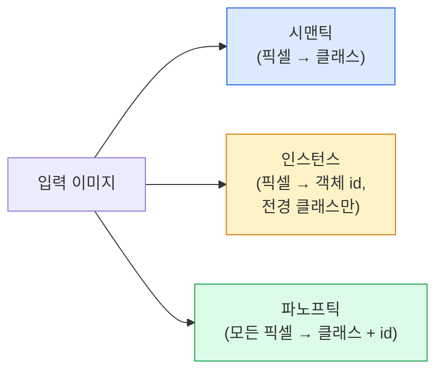
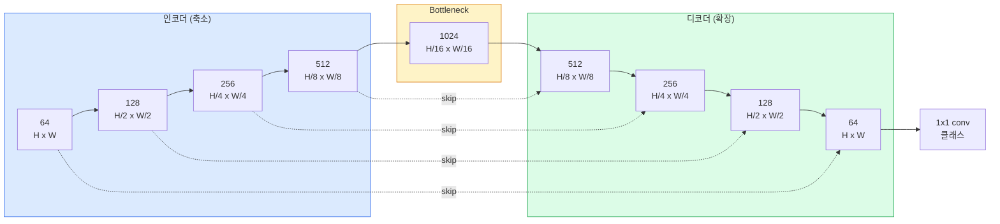

# 시맨틱 분할 — U-Net

> 분할은 모든 픽셀에 대한 분류입니다. U-Net은 다운샘플링 인코더와 업샘플링 디코더를 쌍으로 연결하고, 그 사이에 스킵 연결을 연결하여 이를 구현합니다.

**유형:** Build
**언어:** Python
**선수 요건:** 4단계 03강 (CNN), 4단계 04강 (이미지 분류)
**시간:** 약 75분

## 학습 목표

- 시맨틱, 인스턴스, 파노프틱 분할을 구분하고, 주어진 문제에 적합한 작업을 선택하세요
- PyTorch로 인코더 블록, 병목(bottleneck), 전치 합성곱(convolution)을 포함한 디코더, 스킵 연결을 사용하여 U-Net을 처음부터 구축하세요
- 픽셀 단위 교차 엔트로피(Cross-Entropy), Dice 손실, 그리고 현재 의료 및 산업 분할의 기본 손실로 사용되는 결합 손실을 구현하세요
- 클래스별 IoU 및 Dice 지표를 읽고, 낮은 점수가 작은 객체의 재현율(recall), 경계 정확도, 클래스 불균형 중 어디에서 비롯되는지 진단하세요

## 문제점

분류는 이미지당 하나의 레이블을 출력합니다. 탐지(detection)는 이미지당 몇 개의 박스를 출력합니다. 분할은 픽셀당 하나의 레이블을 출력합니다. 크기가 `H x W`인 입력의 경우, 출력은 `H x W` (시맨틱) 또는 `H x W x N_instances` (인스턴스) 형태의 텐서입니다. 이는 이미지당 하나의 예측이 아니라 수백만 개의 예측입니다.

분할의 구조는 거의 모든 밀집 예측(dense-prediction) 비전 제품을 뒷받침하는 이유입니다: 의료 영상(종양 마스크), 자율 주행(도로, 차선, 장애물), 위성 이미지(건물 윤곽, 작물 경계), 문서 파싱(레이아웃 영역), 로봇공학(파지 가능 영역). 이러한 작업 중 어느 것도 객체에 박스를 둘러싸는 방식으로 해결할 수 없으며, 정확한 윤곽(silhouette)이 필요합니다.

아키텍처 문제는 간단히 설명할 수 있지만 해결하기는 어렵습니다: 네트워크가 이미지의 전역적 컨텍스트(이것이 어떤 종류의 장면인지)와 지역적 픽셀 세부 사항(정확히 어떤 픽셀이 도로이고 어떤 픽셀이 보도인지)을 동시에 파악해야 합니다. 표준 CNN은 컨텍스트를 얻기 위해 공간을 압축하며, 이는 세부 사항을 버립니다. U-Net은 이 두 가지를 모두 달성한 설계였습니다.

## 개념

### 시맨틱 vs 인스턴스 vs 파노프틱



- **시맨틱**은 "이 픽셀은 도로, 저 픽셀은 자동차"라고 말합니다. 나란히 있는 두 자동차는 하나의 덩어리로 합쳐집니다.
- **인스턴스**는 "이 픽셀은 자동차 #3, 저 픽셀은 자동차 #5"라고 말합니다. 배경 요소("stuff" = 하늘, 도로, 잔디)는 무시합니다.
- **파노프틱**은 두 가지를 통합합니다: 모든 픽셀이 클래스 레이블을 받고, 모든 인스턴스가 고유 id를 받으며, stuff와 things 모두 분할됩니다.

이 강의는 시맨틱을 다룹니다. 다음 강의(Mask R-CNN)는 인스턴스를 다룹니다.

### U-Net의 형태



인코더는 공간 해상도를 네 번 절반으로 줄이고 채널을 두 배로 늘립니다. 디코더는 반대로 공간 해상도를 네 번 두 배로 늘리고 채널을 절반으로 줄입니다. 스킵 연결은 모든 해상도에서 일치하는 인코더 특징과 디코더 특징을 연결합니다. 최종 1x1 conv는 `64 -> num_classes`을 전체 해상도로 매핑합니다.

스킵 연결이 필요한 이유: 디코더는 픽셀 단위 예측을 출력하려고 할 때 작은 특징 맵만 본 상태입니다. 스킵이 없으면 그 정보가 인코더에서 압축되어 사라졌기 때문에 가장자리를 정확하게 위치시킬 수 없습니다. 스킵 연결은 인코더가 내려가는 동안 계산한 고해상도 특징 맵을 디코더에 전달합니다.

### 트랜스포즈드 vs 바이리니어 업샘플

디코더는 공간 차원을 확장해야 합니다. 두 가지 옵션이 있습니다:

- **트랜스포즈드 컨볼루션** (`nn.ConvTranspose2d`) — 학습 가능한 업샘플. 역사적 U-Net 기본값. 스트라이드와 커널 크기가 나누어떨어지지 않으면 체커보드 아티팩트가 발생할 수 있습니다.
- **바이리니어 업샘플 + 3x3 conv** — 매끄러운 업샘플 뒤에 conv가 따릅니다. 아티팩트가 적고 매개변수가 적으며, 현대의 기본값입니다.

두 가지 모두 실전에서 사용됩니다. 첫 U-Net에서는 바이리니어가 더 안전합니다.

### 픽셀 그리드에서의 교차 엔트로피(Cross-Entropy)

C개의 클래스를 가진 시맨틱 분할(Semantic Segmentation)에서 모델 출력은 `(N, C, H, W)`이며, 타겟은 정수 클래스 ID를 가진 `(N, H, W)`입니다. 교차 엔트로피는 분류(Classification) 경우와 동일하며, 모든 공간 위치에 적용됩니다:

```
Loss = mean over (n, h, w) of -log( softmax(logits[n, :, h, w])[target[n, h, w]] )
```

PyTorch의 `F.cross_entropy`는 이 형태를 네이티브로 처리합니다. 리셰이프(Reshape)가 필요하지 않습니다.

### Dice 손실(Dice Loss)과 그 필요성

교차 엔트로피는 모든 픽셀을 동일하게 취급합니다. 한 클래스가 프레임을 지배할 때(의료 영상: 99% 배경, 1% 종양) 이는 잘못된 접근입니다. 네트워크는 모든 픽셀을 배경으로 예측하여 99%의 정확도를 얻을 수 있지만, 실제로는 쓸모가 없습니다.

Dice 손실은 예측 마스크와 실제 마스크 간의 겹침(Overlap)을 직접 최적화하여 이 문제를 해결합니다:

```
Dice(p, y) = 2 * sum(p * y) / (sum(p) + sum(y) + epsilon)
Dice_loss = 1 - Dice
```

여기서 `p`는 특정 클래스에 대한 시그모이드(Sigmoid)/소프트맥스(Softmax) 확률 맵이고, `y`는 바이너리(Binary) 정답 마스크입니다. 겹침이 완벽할 때만 손실이 0이 됩니다. 비율 기반이므로 클래스 불균형(Class Imbalance)은 문제가 되지 않습니다.

실제로는 **결합 손실(Combined Loss)**을 사용하세요:

```
L = L_cross_entropy + lambda * L_dice       (lambda ~ 1)
```

교차 엔트로피는 학습 초기에 안정적인 기울기(Gradient)를 제공하며, Dice는 학습 후반부에 마스크 형태를 실제로 일치시키는 데 집중합니다. 이 조합은 의료 영상의 기본값이며, 클래스 불균형이 있는 어떤 데이터셋에서도 쉽게 이길 수 없는 조합입니다.

### 평가 지표

- **픽셀 정확도(Pixel Accuracy)** — 올바르게 예측된 픽셀의 비율입니다. 계산이 저렴합니다. 분류에서의 정확도와 동일한 이유로 불균형 데이터에서는 신뢰할 수 없습니다.
- **클래스별 IoU(IoU per class)** — 각 클래스의 마스크에 대한 교집합 대 합집합(Intersection over Union)이며, 클래스 전체의 평균이 mIoU입니다.
- **Dice (픽셀에 대한 F1)** — IoU와 유사하며, `Dice = 2 * IoU / (1 + IoU)`입니다. 의료 영상은 Dice를 선호하고, 자율주행 커뮤니티는 IoU를 선호합니다. 두 지표는 단조적으로 관련되어 있습니다.
- **경계 F1(Boundary F1)** — 예측된 경계가 정답 경계에 얼마나 가까운지 측정하며, 작은 이동도 페널티를 부여합니다. 반도체 검사 등 고정밀 작업에 중요합니다.

mIoU만 보고하지 말고, 클래스별 IoU를 보고하세요. 평균 IoU는 다른 9개 클래스가 85%일 때 한 클래스가 15%인 경우를 숨깁니다.

### 입력 해상도 트레이드오프(Input Resolution Trade-off)

U-Net의 인코더는 해상도를 네 번에 걸쳐 절반으로 줄이므로, 입력은 16으로 나누어떨어져야 합니다. 의료 영상은 보통 512x512 또는 1024x1024이고, 자율주행용 크롭은 2048x1024입니다. U-Net의 메모리 비용은 `H * W * C_max`에 비례하며, 1024x1024 입력에 1024개의 병목 채널을 사용할 경우 순전파만으로도 수 GB의 VRAM을 소모합니다.

두 가지 표준적인 우회 방법이 있습니다:
1. 입력을 타일링 — 겹치는 256x256 타일을 처리한 후 이어 붙입니다.
2. 병목 부분을 확장된(dilated) 합성곱으로 대체하여 공간 해상도를 더 높게 유지하면서 수용 영역을 넓히세요 (DeepLab 계열).

첫 번째 모델의 경우, 256x256 입력과 기본 채널 수 64인 U-Net은 8 GB VRAM에서 편안하게 학습할 수 있습니다.

```figure
segmentation-flood
```

## 구현하기

### 1단계: 인코더 블록

배치 정규화와 ReLU를 적용한 3x3 합성곱 두 개. 첫 번째 합성곱은 채널 수를 변경하고, 두 번째는 유지합니다.

```python
import torch
import torch.nn as nn
import torch.nn.functional as F

class DoubleConv(nn.Module):
    def __init__(self, in_c, out_c):
        super().__init__()
        self.net = nn.Sequential(
            nn.Conv2d(in_c, out_c, kernel_size=3, padding=1, bias=False),
            nn.BatchNorm2d(out_c),
            nn.ReLU(inplace=True),
            nn.Conv2d(out_c, out_c, kernel_size=3, padding=1, bias=False),
            nn.BatchNorm2d(out_c),
            nn.ReLU(inplace=True),
        )

    def forward(self, x):
        return self.net(x)
```

이 블록은 전체에 걸쳐 재사용됩니다. BN의 beta가 편향을 처리하므로 `bias=False`입니다.

### 2단계: 다운 및 업 블록

```python
class Down(nn.Module):
    def __init__(self, in_c, out_c):
        super().__init__()
        self.net = nn.Sequential(
            nn.MaxPool2d(2),
            DoubleConv(in_c, out_c),
        )

    def forward(self, x):
        return self.net(x)


class Up(nn.Module):
    def __init__(self, in_c, out_c):
        super().__init__()
        self.up = nn.Upsample(scale_factor=2, mode="bilinear", align_corners=False)
        self.conv = DoubleConv(in_c, out_c)

    def forward(self, x, skip):
        x = self.up(x)
        if x.shape[-2:] != skip.shape[-2:]:
            x = F.interpolate(x, size=skip.shape[-2:], mode="bilinear", align_corners=False)
        x = torch.cat([skip, x], dim=1)
        return self.conv(x)
```

공간 차원만 검사하는 `shape[-2:]`은 차원이 16으로 나누어떨어지지 않는 입력을 처리합니다. 안전한 `F.interpolate`은 concat 전에 텐서를 정렬합니다. 전체 차원을 비교하면 채널 수 차이에서도 트리거되는데, 이는 조용한 보간이 아니라 큰 오류로 처리해야 합니다.

### 3단계: U-Net

```python
class UNet(nn.Module):
    def __init__(self, in_channels=3, num_classes=2, base=64):
        super().__init__()
        self.inc = DoubleConv(in_channels, base)
        self.d1 = Down(base, base * 2)
        self.d2 = Down(base * 2, base * 4)
        self.d3 = Down(base * 4, base * 8)
        self.d4 = Down(base * 8, base * 16)
        self.u1 = Up(base * 16 + base * 8, base * 8)
        self.u2 = Up(base * 8 + base * 4, base * 4)
        self.u3 = Up(base * 4 + base * 2, base * 2)
        self.u4 = Up(base * 2 + base, base)
        self.outc = nn.Conv2d(base, num_classes, kernel_size=1)

    def forward(self, x):
        x1 = self.inc(x)
        x2 = self.d1(x1)
        x3 = self.d2(x2)
        x4 = self.d3(x3)
        x5 = self.d4(x4)
        x = self.u1(x5, x4)
        x = self.u2(x, x3)
        x = self.u3(x, x2)
        x = self.u4(x, x1)
        return self.outc(x)

net = UNet(in_channels=3, num_classes=2, base=32)
x = torch.randn(1, 3, 256, 256)
print(f"output: {net(x).shape}")
print(f"params: {sum(p.numel() for p in net.parameters()):,}")
```

출력 차원 `(1, 2, 256, 256)` — 입력과 동일한 공간 크기, `num_classes`개의 채널. `base=32`에서 약 7.7M개의 매개변수입니다.

### 4단계: 손실 함수

```python
def dice_loss(logits, targets, num_classes, eps=1e-6):
    probs = F.softmax(logits, dim=1)
    targets_one_hot = F.one_hot(targets, num_classes).permute(0, 3, 1, 2).float()
    dims = (0, 2, 3)
    intersection = (probs * targets_one_hot).sum(dim=dims)
    denom = probs.sum(dim=dims) + targets_one_hot.sum(dim=dims)
    dice = (2 * intersection + eps) / (denom + eps)
    return 1 - dice.mean()


def combined_loss(logits, targets, num_classes, lam=1.0):
    ce = F.cross_entropy(logits, targets)
    dc = dice_loss(logits, targets, num_classes)
    return ce + lam * dc, {"ce": ce.item(), "dice": dc.item()}
```

Dice는 클래스별로 계산한 후 평균 내는 방식(매크로 Dice)을 사용합니다. `eps`은 배치에 없는 클래스에서 0으로 나누는 것을 방지합니다.

### 5단계: IoU 지표

```python
@torch.no_grad()
def iou_per_class(logits, targets, num_classes):
    preds = logits.argmax(dim=1)
    ious = torch.zeros(num_classes)
    for c in range(num_classes):
        pred_c = (preds == c)
        true_c = (targets == c)
        inter = (pred_c & true_c).sum().float()
        union = (pred_c | true_c).sum().float()
        ious[c] = (inter / union) if union > 0 else torch.tensor(float("nan"))
    return ious
```

길이 C인 벡터를 반환합니다. `nan`은 배치에 없는 클래스를 표시합니다 — mIoU를 계산할 때 해당 클래스는 평균에 포함하지 마세요.

### 6단계: 종단 간 검증을 위한 합성 데이터셋

색상 배경 위에 도형을 생성하여 네트워크가 픽셀 색이 아닌 형태를 학습하도록 하세요.

```python
import numpy as np
from torch.utils.data import Dataset, DataLoader

def synthetic_segmentation(num_samples=200, size=64, seed=0):
    rng = np.random.default_rng(seed)
    images = np.zeros((num_samples, size, size, 3), dtype=np.float32)
    masks = np.zeros((num_samples, size, size), dtype=np.int64)
    for i in range(num_samples):
        bg = rng.uniform(0, 1, (3,))
        images[i] = bg
        masks[i] = 0
        num_shapes = rng.integers(1, 4)
        for _ in range(num_shapes):
            cls = int(rng.integers(1, 3))
            color = rng.uniform(0, 1, (3,))
            cx, cy = rng.integers(10, size - 10, size=2)
            r = int(rng.integers(4, 12))
            yy, xx = np.meshgrid(np.arange(size), np.arange(size), indexing="ij")
            if cls == 1:
                mask = (xx - cx) ** 2 + (yy - cy) ** 2 < r ** 2
            else:
                mask = (np.abs(xx - cx) < r) & (np.abs(yy - cy) < r)
            images[i][mask] = color
            masks[i][mask] = cls
        images[i] += rng.normal(0, 0.02, images[i].shape)
        images[i] = np.clip(images[i], 0, 1)
    return images, masks


class SegDataset(Dataset):
    def __init__(self, images, masks):
        self.images = images
        self.masks = masks

    def __len__(self):
        return len(self.images)

    def __getitem__(self, i):
        img = torch.from_numpy(self.images[i]).permute(2, 0, 1).float()
        mask = torch.from_numpy(self.masks[i]).long()
        return img, mask
```

세 가지 클래스: 배경(0), 원(1), 사각형(2). 네트워크는 형태를 구분하는 법을 학습해야 합니다.

### 7단계: 학습 루프

```python
def train_one_epoch(model, loader, optimizer, device, num_classes):
    model.train()
    loss_sum, total = 0.0, 0
    iou_sum = torch.zeros(num_classes)
    for x, y in loader:
        x, y = x.to(device), y.to(device)
        logits = model(x)
        loss, _ = combined_loss(logits, y, num_classes)
        optimizer.zero_grad()
        loss.backward()
        optimizer.step()
        loss_sum += loss.item() * x.size(0)
        total += x.size(0)
        iou_sum += iou_per_class(logits, y, num_classes).nan_to_num(0)
    return loss_sum / total, iou_sum / len(loader)
```

합성 데이터셋에서 10~30 에포크(epoch) 동안 실행하고, 형태 클래스의 mIoU가 0.9를 넘어서는지 확인해 보세요. `nan_to_num(0)`는 배치(batch)에 없는 클래스를 0으로 처리합니다. 정확한 클래스별 IoU를 얻으려면 존재 여부에 따라 마스크를 적용하고, 여기서 평균을 내는 대신 평가 시점에 `torch.nanmean`를 배치 전체에 걸쳐 사용해야 합니다.

## 사용하기

프로덕션 환경에서는 `segmentation_models_pytorch` ("smp")가 모든 표준 분할 아키텍처를 torchvision 또는 timm 백본(backbone)과 함께 래핑(wrapping)합니다. 세 줄로 작성됩니다:

```python
import segmentation_models_pytorch as smp

model = smp.Unet(
    encoder_name="resnet34",
    encoder_weights="imagenet",
    in_channels=3,
    classes=3,
)
```

실제 작업에서도 알아두면 유용한 사항:
- **DeepLabV3+**는 최대 풀링(max-pool) 기반 다운샘플링을 확장(dilated) 컨볼루션으로 대체하여 병목 구간(bottleneck)이 해상도를 유지하도록 합니다. 위성 및 주행 데이터에서 더 빠른 경계 처리를 제공합니다.
- **SegFormer**는 컨볼루션 인코더를 계층적 트랜스포머(hierarchical transformer)로 교체하며, 많은 벤치마크에서 현재 SOTA(state-of-the-art) 성능을 달성합니다.
- **Mask2Former** / **OneFormer**는 시맨틱, 인스턴스, 파노프틱 분할을 단일 아키텍처로 통합합니다.

이 세 가지는 동일한 데이터 로더로 `smp` 또는 `transformers`에서 드롭인(drop-in) 대체가 가능합니다.

## 출시하기

이 강의는 다음을 생성합니다:

- `outputs/prompt-segmentation-task-picker.md` — 주어진 작업에 대해 시맨틱, 인스턴스, 파노프틱 분할 중 하나를 선택하고 아키텍처를 지정하는 프롬프트입니다.
- `outputs/skill-segmentation-mask-inspector.md` — 클래스 분포, 예측 마스크 통계, 그리고 과소 예측되거나 경계가 흐려진 클래스를 보고하는 스킬입니다.

## 연습 문제

1. **(쉬움)** 이진 분할 작업(전경 vs 배경)에 `bce_dice_loss`를 구현해 보세요. 전경이 픽셀의 5%인 합성 2클래스 데이터셋에서, BCE 단독보다 결합 손실(combined loss)이 더 빠르게 수렴하는지 확인하세요.
2. **(중간)** `nn.Upsample + conv` 업블록(up-block)을 `nn.ConvTranspose2d` 업블록으로 교체하세요. 합성 데이터셋에서 두 버전을 모두 학습하고 mIoU를 비교하세요. 전치 컨볼루션(transposed-conv) 버전에서 체커보드 아티팩트(checkerboard artifacts)가 어디에 나타나는지 관찰하세요.
3. **(어려움)** 실제 분할 데이터셋(Oxford-IIIT Pets, Cityscapes 미니 분할, 또는 의료 하위 집합)을 사용하여 U-Net을 `smp.Unet` 참조 기준과 IoU 점수 2 이내로 학습하세요. 클래스별 IoU를 보고하고, 손실에 Dice를 추가했을 때 가장 큰 이점을 얻는 클래스가 무엇인지 식별하세요.

## 핵심 용어

| 용어 | 사람들이 말하는 표현 | 실제 의미 |
|------|----------------|----------------------|
| 시맨틱 분할 | "모든 픽셀에 레이블 지정" | C개 클래스로 픽셀 단위 분류; 같은 클래스의 인스턴스는 병합됨 |
| 인스턴스 분할 | "모든 객체에 레이블 지정" | 같은 클래스의 서로 다른 인스턴스를 분리; 전경만 포함 |
| 파노프틱 분할 | "시맨틱 + 인스턴스" | 모든 픽셀에 클래스가 지정되며, 모든 사물(thing) 인스턴스에도 고유 ID가 부여됨 |
| 스킵 연결 | "U-Net 브리지" | 인코더 특징을 동일한 해상도의 디코더 특징과 연결(concatenation); 고주파 세부 정보를 보존 |
| 전치 합성곱 | "디컨볼루션" | 학습 가능한 업샘플링; 체커보드 아티팩트를 생성할 수 있음 |
| Dice 손실 | "중복 손실" | 1 - 2|A ∩ B| / (|A| + |B|); 마스크 중복을 직접 최적화하며 클래스 불균형에 강건 |
| mIoU | "평균 교차율(IoU)" | 클래스 간 평균 IoU; 분할 작업의 커뮤니티 표준 지표 |
| 경계 F1 | "경계 정확도" | 경계 픽셀에만 계산된 F1 점수; 정밀도가 중요한 작업에 중요 |

## 추가 읽기

- [U-Net: Convolutional Networks for Biomedical Image Segmentation (Ronneberger et al., 2015)](https://arxiv.org/abs/1505.04597) — 원 논문; 모두가 인용하는 그림은 2페이지에 있습니다
- [Fully Convolutional Networks (Long et al., 2015)](https://arxiv.org/abs/1411.4038) — 분할을 엔드투엔드 합성곱 문제로 처음 만든 논문
- [segmentation_models_pytorch](https://github.com/qubvel/segmentation_models.pytorch) — 프로덕션 분할의 참고 자료; 모든 표준 아키텍처와 모든 표준 손실 함수 포함
- [iafoss, Unet34 submission with TTA (Kaggle notebook)](https://www.kaggle.com/code/iafoss/unet34-submission-tta-0-699-new-public-lb) — 실제 분할 대회에서 U-Net에 적용한 테스트 타임 증강
