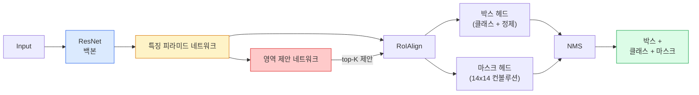

# 인스턴스 분할 — Mask R-CNN

> Faster R-CNN 탐지기에 작은 마스크 브랜치를 추가하면 인스턴스 분할이 됩니다. 어려운 부분은 RoIAlign이며, 이는 보이는 것보다 더 어렵습니다.

**유형:** Build + Learn
**언어:** Python
**선수 요건:** 4단계 06강 (YOLO), 4단계 07강 (U-Net)
**시간:** 약 75분

## 학습 목표

- 백본, FPN, RPN, RoIAlign, 박스 헤드, 마스크 헤드를 포함하여 Mask R-CNN 아키텍처를 처음부터 끝까지 추적해 보세요
- RoIAlign을 처음부터 구현하고 RoIPool이 더 이상 사용되지 않는 이유를 설명해 보세요
- torchvision `maskrcnn_resnet50_fpn_v2` 사전 학습된 모델을 사용하여 생산 품질의 인스턴스 마스크를 생성하고 출력 형식을 올바르게 읽어 보세요
- 박스 헤드와 마스크 헤드를 교체하고 백본을 고정하여 작은 사용자 정의 데이터셋에 Mask R-CNN을 미세 조정(Fine-tuning)해 보세요

## 문제점

시맨틱 분할은 클래스당 하나의 마스크를 제공합니다. 인스턴스 분할은 두 객체가 같은 클래스를 공유하더라도 객체당 하나의 마스크를 제공합니다. 개체를 세고, 프레임 간에 추적하며, 측정하는 작업(벽의 각 벽돌의 경계 상자, 현미경 이미지의 각 세포 등)은 모두 인스턴스 분할을 요구합니다.

Mask R-CNN (He et al., 2017)은 인스턴스 분할을 탐지 + 마스크로 재정의하여 이 문제를 해결했습니다. 디자인이 매우 깔끔해서 향후 5년간 거의 모든 인스턴스 분할 논문이 Mask R-CNN 변형이었고, torchvision 구현은 여전히 소규모 및 중규모 데이터셋의 생산 기본값입니다.

어려운 엔지니어링 문제는 샘플링입니다: 모서리가 픽셀 경계에 정렬되지 않은 제안 박스에서 고정 크기의 특징 영역을 어떻게 잘라내나요? 이를 잘못하면 모든 곳에서 mAP 점수의 0.1점이 손실됩니다. RoIAlign이 정답입니다.

## 개념

### 아키텍처



이해해야 할 다섯 가지 요소:

1. **백본(Backbone)** — ImageNet으로 학습된 ResNet-50 또는 ResNet-101. 스트라이드 4, 8, 16, 32에서 계층적 특징 맵(feature maps)을 생성합니다.
2. **FPN (Feature Pyramid Network)** — 상향식(top-down) + 측면 연결(lateral connections)으로 모든 레벨에 의미적으로 풍부한 특징을 C 채널로 제공합니다. 탐지(Detection)는 물체 크기에 해당하는 FPN 레벨을 참조합니다.
3. **RPN (Region Proposal Network)** — 작은 컨브(conv) 헤드로, 모든 앵커(anchor) 위치에서 "여기에 물체가 있는가?"와 "상자(box)를 어떻게 정제(refine)할 것인가?"를 예측합니다. 이미지당 약 1000개의 제안(proposals)을 생성합니다.
4. **RoIAlign** — 모든 FPN 레벨의 모든 상자에서 고정 크기(예: 7x7)의 특징 패치(feature patch)를 샘플링합니다. 이중 선형(bilinear) 샘플링을 사용하며 양자화(quantisation)가 없습니다.
5. **헤드(Heads)** — 상자를 정제하고 클래스를 선택하는 2층 상자 헤드(box head)와 각 제안에 대해 `28x28` 바이너리 마스크(binary mask)를 출력하는 작은 컨브(conv) 헤드가 있습니다.

### RoIPool이 아닌 RoIAlign을 사용하는 이유

원래의 Fast R-CNN은 RoIPool을 사용했습니다. RoIPool은 제안(proposal) 상자를 격자(grid)로 나누고, 각 셀에서 최대 특징을 취하며, 모든 좌표를 정수로 반올림합니다. 이 반올림은 입력 픽셀 좌표와 특징 맵(feature map)을 최대 하나의 특징 맵 픽셀만큼 어긋나게 만듭니다. 224x224 이미지에서는 작은 문제지만, 스트라이드 32인 특징 맵에서는 치명적입니다.

```
RoIPool:
  box (34.7, 51.3, 98.2, 142.9)
  round -> (34, 51, 98, 142)
  split grid -> round each cell boundary
  misalignment accumulates at every step

RoIAlign:
  box (34.7, 51.3, 98.2, 142.9)
  sample at exact float coordinates using bilinear interpolation
  no rounding anywhere
```

RoIAlign은 COCO에서 마스크 AP를 3-4 포인트 무료로 상승시킵니다. 위치 추정(localisation)을 중시하는 모든 탐지기는 이를 사용합니다 — YOLOv7 seg, RT-DETR, Mask2Former 모두 마찬가지입니다.

### RPN 한 문단 요약

특징 맵의 모든 위치에 크기와 모양이 다른 K개의 앵커(anchor) 상자를 배치합니다. 각 앵커에 대해 물체성(objectness) 점수와 앵커를 더 잘 맞는 상자로 변환하기 위한 회귀(offset)를 예측합니다. 점수 순으로 상위 약 1,000개 상자를 유지하고, IoU 0.7에서 NMS를 적용한 후 생존한 상자를 헤드(heads)에 전달합니다. RPN은 자체 미니 손실(mini-loss)로 학습됩니다 — 06강의 YOLO 손실과 동일한 구조이며, 두 클래스(물체 / 물체 없음)만 있습니다.

### 마스크 헤드(mask head)

각 제안(RoIAlign 이후)에 대해 마스크 헤드는 작은 FCN입니다: 네 개의 3x3 컨브(conv), 2x 디컨브(deconv), `28x28` 해상도에서 `num_classes` 출력 채널을 생성하는 최종 1x1 컨브(conv)가 있습니다. 예측된 클래스에 해당하는 채널만 유지하고, 나머지는 무시합니다. 이는 마스크 예측을 분류(classification)와 분리합니다.

28x28 마스크를 제안(proposal)의 원래 픽셀 크기로 업샘플(upsample)하여 최종 바이너리 마스크(binary mask)를 생성합니다.

### 손실 함수

Mask R-CNN은 네 가지 손실 함수를 합산합니다:

```
L = L_rpn_cls + L_rpn_box + L_box_cls + L_box_reg + L_mask
```

- `L_rpn_cls`, `L_rpn_box` — RPN 제안에 대한 객체성 + 박스 회귀.
- `L_box_cls` — 헤드의 분류기에 대한 (C+1)개 클래스(배경 포함)의 교차 엔트로피.
- `L_box_reg` — 헤드의 박스 정제에 대한 smooth L1.
- `L_mask` — 28x28 마스크 출력에 대한 픽셀 단위 이진 교차 엔트로피.

각 손실 함수는 자체 기본 가중치를 가지며, torchvision 구현에서는 이를 생성자 인수로 노출합니다.

### 출력 형식

`torchvision.models.detection.maskrcnn_resnet50_fpn_v2`는 이미지당 하나의 dict를 담은 리스트를 반환합니다:

```
{
    "boxes":  (N, 4) in (x1, y1, x2, y2) pixel coordinates,
    "labels": (N,) class IDs, 0 = background so indices are 1-based,
    "scores": (N,) confidence scores,
    "masks":  (N, 1, H, W) float masks in [0, 1] — threshold at 0.5 for binary,
}
```

마스크는 이미 전체 이미지 해상도입니다. 28x28 헤드 출력은 내부적으로 업샘플링되었습니다.

```figure
cv3-roialign-sampling
```

## 구현하기

### 1단계: RoIAlign을 처음부터 구현하기

Mask R-CNN의 구성 요소 중 코드로 이해하는 것이 산문으로 이해하는 것보다 더 간단한 유일한 부분입니다.

```python
import torch
import torch.nn.functional as F

def roi_align_single(feature, box, output_size=7, spatial_scale=1 / 16.0):
    """
    feature: (C, H, W) single-image feature map
    box: (x1, y1, x2, y2) in original image pixel coordinates
    output_size: side of the output grid (7 for box head, 14 for mask head)
    spatial_scale: reciprocal of the feature map stride
    """
    C, H, W = feature.shape
    x1, y1, x2, y2 = [c * spatial_scale - 0.5 for c in box]
    bin_w = (x2 - x1) / output_size
    bin_h = (y2 - y1) / output_size

    grid_y = torch.linspace(y1 + bin_h / 2, y2 - bin_h / 2, output_size)
    grid_x = torch.linspace(x1 + bin_w / 2, x2 - bin_w / 2, output_size)
    yy, xx = torch.meshgrid(grid_y, grid_x, indexing="ij")

    gx = 2 * (xx + 0.5) / W - 1
    gy = 2 * (yy + 0.5) / H - 1
    grid = torch.stack([gx, gy], dim=-1).unsqueeze(0)
    sampled = F.grid_sample(feature.unsqueeze(0), grid, mode="bilinear",
                            align_corners=False)
    return sampled.squeeze(0)
```

모든 숫자는 이중 선형 보간된 위치에 있습니다. 반올림, 양자화, 기울기 드롭이 없습니다.

### 2단계: torchvision의 RoIAlign과 비교하기

```python
from torchvision.ops import roi_align

feature = torch.randn(1, 16, 50, 50)
boxes = torch.tensor([[0, 10, 20, 100, 90]], dtype=torch.float32)  # (batch_idx, x1, y1, x2, y2)

ours = roi_align_single(feature[0], boxes[0, 1:].tolist(), output_size=7, spatial_scale=1/4)
theirs = roi_align(feature, boxes, output_size=(7, 7), spatial_scale=1/4, sampling_ratio=1, aligned=True)[0]

print(f"shape ours:   {tuple(ours.shape)}")
print(f"shape theirs: {tuple(theirs.shape)}")
print(f"max|diff|:    {(ours - theirs).abs().max().item():.3e}")
```

`sampling_ratio=1`와 `aligned=True`을 사용하면 두 결과가 `1e-5` 이내로 일치합니다.

### 3단계: 사전 학습된 Mask R-CNN 로드하기

```python
import torch
from torchvision.models.detection import maskrcnn_resnet50_fpn_v2, MaskRCNN_ResNet50_FPN_V2_Weights

model = maskrcnn_resnet50_fpn_v2(weights=MaskRCNN_ResNet50_FPN_V2_Weights.DEFAULT)
model.eval()
print(f"params: {sum(p.numel() for p in model.parameters()):,}")
print(f"classes (including background): {len(model.roi_heads.box_predictor.cls_score.out_features * [0])}")
```

46M 매개변수, 91개 클래스(COCO). 첫 번째 클래스(id 0)는 배경이며, 모델이 실제로 감지하는 모든 것은 id 1부터 시작합니다.

### 4단계: 추론 실행하기

```python
with torch.no_grad():
    x = torch.randn(3, 400, 600)
    predictions = model([x])
p = predictions[0]
print(f"boxes:  {tuple(p['boxes'].shape)}")
print(f"labels: {tuple(p['labels'].shape)}")
print(f"scores: {tuple(p['scores'].shape)}")
print(f"masks:  {tuple(p['masks'].shape)}")
```

마스크 텐서의 모양은 `(N, 1, H, W)`입니다. 0.5로 임계값 처리하여 객체별 이진 마스크를 얻습니다:

```python
binary_masks = (p['masks'] > 0.5).squeeze(1)  # (N, H, W) boolean
```

### 5단계: 헤드를 사용자 정의 클래스 수로 교체하기

일반적인 미세 조정 레시피: 백본, FPN, RPN을 재사용하고 두 분류 헤드를 교체합니다.

```python
from torchvision.models.detection.faster_rcnn import FastRCNNPredictor
from torchvision.models.detection.mask_rcnn import MaskRCNNPredictor

def build_custom_maskrcnn(num_classes):
    model = maskrcnn_resnet50_fpn_v2(weights=MaskRCNN_ResNet50_FPN_V2_Weights.DEFAULT)
    in_features = model.roi_heads.box_predictor.cls_score.in_features
    model.roi_heads.box_predictor = FastRCNNPredictor(in_features, num_classes)
    in_features_mask = model.roi_heads.mask_predictor.conv5_mask.in_channels
    hidden_layer = 256
    model.roi_heads.mask_predictor = MaskRCNNPredictor(in_features_mask, hidden_layer, num_classes)
    return model

custom = build_custom_maskrcnn(num_classes=5)
print(f"custom cls_score.out_features: {custom.roi_heads.box_predictor.cls_score.out_features}")
```

`num_classes`는 배경 클래스를 포함해야 하므로, 4개 객체 클래스가 있는 데이터셋은 `num_classes=5`을 사용합니다.

### 6단계: 학습이 필요 없는 부분 동결하기

소규모 데이터셋에서는 백본과 FPN을 동결합니다. RPN의 객체성 + 회귀와 두 헤드만 학습합니다.

```python
def freeze_backbone_and_fpn(model):
    # torchvision Mask R-CNN은 FPN을 `model.backbone` 내부에 포함합니다 (as
    # `model.backbone.fpn`), 따라서 `model.backbone.parameters()`을 반복하면
    # ResNet 특징 레이어와 FPN의 측방/출력 컨볼루션 모두에 적용됩니다.
    for p in model.backbone.parameters():
        p.requires_grad = False
    return model

custom = freeze_backbone_and_fpn(custom)
trainable = sum(p.numel() for p in custom.parameters() if p.requires_grad)
print(f"trainable after freeze: {trainable:,}")
```

500개 이미지 데이터셋에서는 수렴과 과적합의 차이를 결정짓는 요소입니다.

## 사용하기

torchvision에서 Mask R-CNN의 전체 학습 루프는 40줄이며, 작업 간에 의미 있는 변화가 거의 없습니다. 데이터셋만 교체하면 됩니다.

```python
def train_step(model, images, targets, optimizer):
    model.train()
    loss_dict = model(images, targets)
    losses = sum(loss for loss in loss_dict.values())
    optimizer.zero_grad()
    losses.backward()
    optimizer.step()
    return {k: v.item() for k, v in loss_dict.items()}
```

`targets` 리스트는 이미지별 사전(dictionary)으로 `boxes`, `labels`, `masks` (`(num_instances, H, W)` 바이너리 텐서)를 포함해야 합니다. 모델은 학습 중 네 가지 손실 값을 사전으로 반환하고, 평가 중에는 `model.training`를 키로 하는 예측 리스트를 반환합니다.

`pycocotools` 평가기는 상자와 마스크 모두에 대해 mAP@IoU=0.5:0.95를 산출합니다. 상자 헤드와 마스크 헤드 중 어느 쪽이 병목인지 파악하려면 두 값 모두 필요합니다.

## 출시하기

이 강의에서 생성되는 결과물:

- `outputs/prompt-instance-vs-semantic-router.md` — 세 가지 질문을 던져 인스턴스, 시맨틱, 파노프틱 중 하나를 선택하고, 시작할 정확한 모델을 고르는 프롬프트입니다.
- `outputs/skill-mask-rcnn-head-swapper.md` — 새로운 `num_classes`를 입력으로 받아 torchvision의 모든 탐지 모델에서 헤드를 교체하는 10줄의 코드를 생성하는 스킬입니다.

## 연습 문제

1. **(쉬움)** 100개의 랜덤 상자에 대해 RoIAlign을 `torchvision.ops.roi_align`와 비교 검증하세요. 최대 절대 차이를 보고하세요. 또한 RoIPool (2017년 이전 동작)을 실행하여, 경계 근처의 상자에서 약 1-2 특징 맵 픽셀만큼 차이가 발생함을 보이세요.
2. **(중간)** 50개 이미지로 구성된 사용자 정의 데이터셋 (풍선, 물고기, 포트홀, 로고 등 두 클래스)에 `maskrcnn_resnet50_fpn_v2`를 미세 조정하세요. 백본을 고정하고 20 에포크 동안 학습한 후, mask AP@0.5를 보고하세요.
3. **(어려움)** Mask R-CNN의 마스크 헤드를 28x28 대신 56x56에서 예측하도록 교체하세요. 교체 전후의 mAP@IoU=0.75를 측정하세요. 성능 향상 (또는 향상 없음)가 예상되는 경계 정밀도 / 메모리 트레이드오프와 일치하는 이유를 설명하세요.

## 핵심 용어

| 용어 | 사람들이 말하는 표현 | 실제 의미 |
|------|----------------|----------------------|
| Mask R-CNN | "탐지 + 마스크" | Faster R-CNN + 제안(proposal)마다 클래스별 28x28 마스크를 예측하는 작은 FCN 헤드 |
| FPN | "특징 피라미드" | 상향(top-down) + 측방(lateral) 연결로 모든 스트라이드 레벨에 C채널의 의미 풍부한 특징을 제공 |
| RPN | "영역 제안자" | 이미지마다 약 1000개의 객체/비객체 제안(proposal)을 생성하는 작은 컨볼루션 헤드 |
| RoIAlign | "반올림 없는 크롭" | 임의의 float 좌표 박스에서 고정 크기 특징 그리드를 이중선형 보간으로 샘플링합니다 |
| RoIPool | "2017년 이전 크롭" | RoIAlign과 동일한 목적을 가지지만 박스 좌표를 반올림합니다; 구식입니다 |
| Mask AP | "인스턴스 mAP" | 박스 IoU 대신 마스크 IoU로 계산된 평균 정밀도; COCO 인스턴스 분할 지표입니다 |
| Binary mask head | "클래스별 마스크" | 각 제안에 대해 클래스별로 하나의 이진 마스크를 예측합니다; 예측된 클래스의 채널만 유지됩니다 |
| Background class | "클래스 0" | "객체 없음"을 포함하는 포괄적인 클래스; 실제 클래스의 인덱스는 1부터 시작합니다 |

## 추가 읽기

- [Mask R-CNN (He et al., 2017)](https://arxiv.org/abs/1703.06870) — 논문; RoIAlign에 대한 3절이 핵심 읽기 자료입니다
- [FPN: Feature Pyramid Networks (Lin et al., 2017)](https://arxiv.org/abs/1612.03144) — FPN 논문; 모든 현대적 탐지기가 이를 사용합니다
- [torchvision Mask R-CNN tutorial](https://pytorch.org/tutorials/intermediate/torchvision_tutorial.html) — 미세 조정 루프의 참고 자료입니다
- [Detectron2 model zoo](https://github.com/facebookresearch/detectron2/blob/main/MODEL_ZOO.md) — 거의 모든 탐지 및 분할 변형에 대해 학습된 가중치를 갖춘 프로덕션 구현입니다
