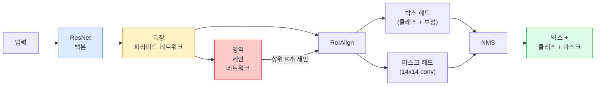

# 인스턴스 세그멘테이션 — Mask R-CNN (Instance Segmentation — Mask R-CNN)

> Faster R-CNN 검출기에 작은 마스크 브랜치를 붙이면 인스턴스 세그멘테이션이 됩니다. 어려운 부분은 RoIAlign이며, 보기보다 훨씬 까다롭습니다.

**Type:** Build + Learn
**Languages:** Python
**Prerequisites:** Phase 4 Lesson 06 (YOLO), Phase 4 Lesson 07 (U-Net)
**Time:** ~75 minutes

## 학습 목표 (Learning Objectives)

- Mask R-CNN 아키텍처를 끝까지 추적합니다: 백본, FPN, RPN, RoIAlign, 박스 헤드, 마스크 헤드
- RoIAlign을 처음부터 구현하고, RoIPool이 더 이상 쓰이지 않는 이유를 설명합니다
- torchvision의 `maskrcnn_resnet50_fpn_v2` 사전학습 모델로 프로덕션급 인스턴스 마스크를 만들고, 출력 형식을 올바르게 읽습니다
- 박스·마스크 헤드를 교체하고 백본을 동결한 채, 작은 커스텀 데이터셋에서 Mask R-CNN을 파인튜닝합니다

## 문제 상황 (The Problem)

시맨틱 세그멘테이션은 클래스당 하나의 마스크를 줍니다. 인스턴스 세그멘테이션은 두 객체가 같은 클래스여도 객체마다 하나의 마스크를 줍니다. 개체를 세기, 프레임 간 추적, 측정(벽의 각 벽돌 바운딩 박스, 현미경 이미지의 각 세포)은 모두 인스턴스 세그멘테이션이 필요합니다.

Mask R-CNN(He et al., 2017)은 인스턴스 세그멘테이션을 검출+마스크로 재구성해 이 문제를 풀었습니다. 설계가 매우 깔끔해서 이후 5년 동안 거의 모든 인스턴스 세그멘테이션 논문이 Mask R-CNN 변형이었고, torchvision 구현은 여전히 중소 규모 데이터셋의 프로덕션 기본값입니다.

어려운 엔지니어링 문제는 샘플링입니다. 모서리가 픽셀 경계에 맞지 않는 제안 박스에서 고정 크기 특징 영역을 어떻게 자를까요? 잘못하면 어디서나 mAP가 0.1 단위로 깎입니다. 답이 RoIAlign입니다.

## 핵심 개념 (The Concept)

### 아키텍처 (The architecture)



이해해야 할 다섯 조각:

1. **백본(Backbone)** — ImageNet으로 학습된 ResNet-50 또는 ResNet-101. stride 4, 8, 16, 32의 특징맵 계층을 만듭니다.
2. **FPN (Feature Pyramid Network)** — top-down + lateral 연결로 모든 레벨에 의미적으로 풍부한 C채널 특징을 줍니다. 검출은 객체 크기에 맞는 FPN 레벨을 조회합니다.
3. **RPN (Region Proposal Network)** — 모든 앵커 위치에서 "여기 객체가 있는가?"와 "박스를 어떻게 보정할까?"를 예측하는 작은 conv 헤드입니다. 이미지당 약 1000개의 제안을 만듭니다.
4. **RoIAlign** — 어떤 FPN 레벨의 어떤 박스에서도 고정 크기(예: 7x7) 특징 패치를 샘플링합니다. 이중선형 샘플링, 양자화 없음.
5. **헤드(Heads)** — 박스를 보정하고 클래스를 고르는 2층 박스 헤드와, 제안마다 `28x28` 이진 마스크를 출력하는 작은 conv 헤드.

### RoIPool이 아니라 RoIAlign인 이유 (Why RoIAlign, not RoIPool)

원래 Fast R-CNN은 RoIPool을 썼습니다. 제안 박스를 격자로 나누고, 각 셀에서 최대 특징을 취하며, 모든 좌표를 정수로 반올림합니다. 그 반올림은 특징맵을 입력 픽셀 좌표에서 최대 한 특징맵 픽셀만큼 어긋나게 합니다 — 224x224 이미지에서는 작지만, 특징맵 stride가 32일 때는 치명적입니다.

```
RoIPool:
  box (34.7, 51.3, 98.2, 142.9)
  round -> (34, 51, 98, 142)
  split grid -> round each cell boundary
  misalignment accumulates at every step

RoIAlign:
  box (34.7, 51.3, 98.2, 142.9)
  sample at exact float coordinates using bilinear interpolation
  no rounding anywhere
```

RoIAlign은 COCO에서 마스크 AP를 공짜로 3–4포인트 올립니다. 위치 추정에 신경 쓰는 모든 검출기가 이제 이를 씁니다 — YOLOv7 seg, RT-DETR, Mask2Former 모두 마찬가지입니다.

### 한 문단으로 보는 RPN (The RPN in one paragraph)

특징맵의 모든 위치에 크기·모양이 다른 K개의 앵커 박스를 둡니다. 각 앵커에 대해 objectness 점수와, 앵커를 더 잘 맞는 박스로 바꾸는 회귀 오프셋을 예측합니다. 점수 기준 상위 약 1,000개 박스를 남기고, IoU 0.7로 NMS를 적용한 뒤 생존자를 헤드에 넘깁니다. RPN은 자체 미니 손실로 학습합니다 — Lesson 6의 YOLO 손실과 같은 구조이되, 클래스가 둘(object / no object)뿐입니다.

### 마스크 헤드 (The mask head)

각 제안(RoIAlign 이후)에 대해 마스크 헤드는 작은 FCN입니다: 3x3 conv 네 개, 2x deconv 하나, 최종 1x1 conv가 `28x28` 해상도로 `num_classes` 출력 채널을 만듭니다. 예측 클래스에 해당하는 채널만 남기고 나머지는 무시합니다. 이렇게 마스크 예측을 분류와 분리합니다.

28x28 마스크를 제안의 원래 픽셀 크기로 업샘플해 최종 이진 마스크를 만듭니다.

### 손실 (Losses)

Mask R-CNN은 네 가지 손실을 더합니다:

```
L = L_rpn_cls + L_rpn_box + L_box_cls + L_box_reg + L_mask
```

- `L_rpn_cls`, `L_rpn_box` — RPN 제안에 대한 objectness + 박스 회귀.
- `L_box_cls` — 헤드 분류기에 대한 (C+1) 클래스(배경 포함) 교차 엔트로피.
- `L_box_reg` — 헤드 박스 보정에 대한 smooth L1.
- `L_mask` — 28x28 마스크 출력에 대한 픽셀별 이진 교차 엔트로피.

각 손실에는 기본 가중치가 있고, torchvision 구현은 생성자 인자로 노출합니다.

### 출력 형식 (Output format)

`torchvision.models.detection.maskrcnn_resnet50_fpn_v2`는 이미지당 하나의 dict 리스트를 반환합니다:

```
{
    "boxes":  (N, 4) in (x1, y1, x2, y2) pixel coordinates,
    "labels": (N,) class IDs, 0 = background so indices are 1-based,
    "scores": (N,) confidence scores,
    "masks":  (N, 1, H, W) float masks in [0, 1] — threshold at 0.5 for binary,
}
```

마스크는 이미 전체 이미지 해상도입니다. 28x28 헤드 출력은 내부에서 업샘플되었습니다.

```figure
cv3-roialign-sampling
```

## 직접 만들기 (Build It)

### 1단계: RoIAlign을 처음부터 (Step 1: RoIAlign from scratch)

Mask R-CNN에서 문장보다 코드로 이해하기 쉬운 유일한 구성 요소입니다.

```python
import torch
import torch.nn.functional as F

def roi_align_single(feature, box, output_size=7, spatial_scale=1 / 16.0):
    """
    feature: (C, H, W) single-image feature map
    box: (x1, y1, x2, y2) in original image pixel coordinates
    output_size: side of the output grid (7 for box head, 14 for mask head)
    spatial_scale: reciprocal of the feature map stride
    """
    C, H, W = feature.shape
    x1, y1, x2, y2 = [c * spatial_scale - 0.5 for c in box]
    bin_w = (x2 - x1) / output_size
    bin_h = (y2 - y1) / output_size

    grid_y = torch.linspace(y1 + bin_h / 2, y2 - bin_h / 2, output_size)
    grid_x = torch.linspace(x1 + bin_w / 2, x2 - bin_w / 2, output_size)
    yy, xx = torch.meshgrid(grid_y, grid_x, indexing="ij")

    gx = 2 * (xx + 0.5) / W - 1
    gy = 2 * (yy + 0.5) / H - 1
    grid = torch.stack([gx, gy], dim=-1).unsqueeze(0)
    sampled = F.grid_sample(feature.unsqueeze(0), grid, mode="bilinear",
                            align_corners=False)
    return sampled.squeeze(0)
```

모든 숫자는 이중선형으로 샘플링된 위치에 있습니다. 반올림도, 양자화도, 끊긴 기울기도 없습니다.

### 2단계: torchvision RoIAlign과 비교 (Step 2: Compare to torchvision's RoIAlign)

```python
from torchvision.ops import roi_align

feature = torch.randn(1, 16, 50, 50)
boxes = torch.tensor([[0, 10, 20, 100, 90]], dtype=torch.float32)  # (batch_idx, x1, y1, x2, y2)

ours = roi_align_single(feature[0], boxes[0, 1:].tolist(), output_size=7, spatial_scale=1/4)
theirs = roi_align(feature, boxes, output_size=(7, 7), spatial_scale=1/4, sampling_ratio=1, aligned=True)[0]

print(f"shape ours:   {tuple(ours.shape)}")
print(f"shape theirs: {tuple(theirs.shape)}")
print(f"max|diff|:    {(ours - theirs).abs().max().item():.3e}")
```

`sampling_ratio=1`과 `aligned=True`이면 둘은 `1e-5` 이내로 일치합니다.

### 3단계: 사전학습 Mask R-CNN 로드 (Step 3: Load a pretrained Mask R-CNN)

```python
import torch
from torchvision.models.detection import maskrcnn_resnet50_fpn_v2, MaskRCNN_ResNet50_FPN_V2_Weights

model = maskrcnn_resnet50_fpn_v2(weights=MaskRCNN_ResNet50_FPN_V2_Weights.DEFAULT)
model.eval()
print(f"params: {sum(p.numel() for p in model.parameters()):,}")
print(f"classes (including background): {len(model.roi_heads.box_predictor.cls_score.out_features * [0])}")
```

46M 파라미터, 91 클래스(COCO). 첫 클래스(id 0)는 배경이고, 모델이 실제로 검출하는 모든 것은 id 1부터입니다.

### 4단계: 추론 실행 (Step 4: Run inference)

```python
with torch.no_grad():
    x = torch.randn(3, 400, 600)
    predictions = model([x])
p = predictions[0]
print(f"boxes:  {tuple(p['boxes'].shape)}")
print(f"labels: {tuple(p['labels'].shape)}")
print(f"scores: {tuple(p['scores'].shape)}")
print(f"masks:  {tuple(p['masks'].shape)}")
```

마스크 텐서 shape는 `(N, 1, H, W)`입니다. 0.5로 임계값을 걸어 객체별 이진 마스크를 얻습니다:

```python
binary_masks = (p['masks'] > 0.5).squeeze(1)  # (N, H, W) boolean
```

### 5단계: 커스텀 클래스 수에 맞게 헤드 교체 (Step 5: Swap the heads for a custom class count)

흔한 파인튜닝 레시피: 백본, FPN, RPN은 재사용하고 두 분류기 헤드만 교체합니다.

```python
from torchvision.models.detection.faster_rcnn import FastRCNNPredictor
from torchvision.models.detection.mask_rcnn import MaskRCNNPredictor

def build_custom_maskrcnn(num_classes):
    model = maskrcnn_resnet50_fpn_v2(weights=MaskRCNN_ResNet50_FPN_V2_Weights.DEFAULT)
    in_features = model.roi_heads.box_predictor.cls_score.in_features
    model.roi_heads.box_predictor = FastRCNNPredictor(in_features, num_classes)
    in_features_mask = model.roi_heads.mask_predictor.conv5_mask.in_channels
    hidden_layer = 256
    model.roi_heads.mask_predictor = MaskRCNNPredictor(in_features_mask, hidden_layer, num_classes)
    return model

custom = build_custom_maskrcnn(num_classes=5)
print(f"custom cls_score.out_features: {custom.roi_heads.box_predictor.cls_score.out_features}")
```

`num_classes`에는 배경 클래스가 포함되어야 하므로, 객체 클래스 4개인 데이터셋은 `num_classes=5`를 씁니다.

### 6단계: 학습이 필요 없는 부분 동결 (Step 6: Freeze what does not need training)

작은 데이터셋에서는 백본과 FPN을 동결합니다. RPN objectness + 회귀와 두 헤드만 학습합니다.

```python
def freeze_backbone_and_fpn(model):
    # torchvision Mask R-CNN packs the FPN inside `model.backbone` (as
    # `model.backbone.fpn`), so iterating `model.backbone.parameters()` covers
    # both the ResNet feature layers and the FPN lateral/output convs.
    for p in model.backbone.parameters():
        p.requires_grad = False
    return model

custom = freeze_backbone_and_fpn(custom)
trainable = sum(p.numel() for p in custom.parameters() if p.requires_grad)
print(f"trainable after freeze: {trainable:,}")
```

500장 데이터셋에서는 이것이 수렴과 과적합의 차이입니다.

## 활용하기 (Use It)

torchvision에서 Mask R-CNN 전체 학습 루프는 40줄이며, 태스크 간에 의미 있게 바뀌지 않습니다 — 데이터셋만 바꾸고 가면 됩니다.

```python
def train_step(model, images, targets, optimizer):
    model.train()
    loss_dict = model(images, targets)
    losses = sum(loss for loss in loss_dict.values())
    optimizer.zero_grad()
    losses.backward()
    optimizer.step()
    return {k: v.item() for k, v in loss_dict.items()}
```

`targets` 리스트는 이미지마다 `boxes`, `labels`, `masks`(`(num_instances, H, W)` 이진 텐서)가 있는 dict여야 합니다. 모델은 학습 중에는 네 손실의 dict를, eval 중에는 예측 리스트를 반환하며, `model.training`에 따라 갈립니다.

`pycocotools` 평가기는 박스와 마스크 모두에 대해 mAP@IoU=0.5:0.95를 냅니다. 병목이 박스 헤드인지 마스크 헤드인지 알려면 두 숫자가 모두 필요합니다.

## 결과물 배포 (Ship It)

이 레슨이 만드는 것:

- `outputs/prompt-instance-vs-semantic-router.md` — 세 질문을 묻고 인스턴스 vs 시맨틱 vs 패놉틱과 시작할 정확한 모델을 고르는 프롬프트.
- `outputs/skill-mask-rcnn-head-swapper.md` — 새 `num_classes`가 주어지면 어떤 torchvision 검출 모델에서도 헤드 교체용 10줄 코드를 생성하는 스킬.

## 연습 문제 (Exercises)

1. **(Easy)** 100개의 임의 박스에서 RoIAlign을 `torchvision.ops.roi_align`과 검증하세요. 최대 절대 차이를 보고하세요. 또한 RoIPool(2017 이전 동작)을 실행해 경계 근처 박스에서 특징맵 픽셀 ~1–2만큼 어긋남을 보이세요.
2. **(Medium)** 50장 커스텀 데이터셋(풍선, 물고기, 포트홀, 로고 등 아무 두 클래스)에서 `maskrcnn_resnet50_fpn_v2`를 파인튜닝하세요. 백본을 동결하고 20 에폭 학습한 뒤 mask AP@0.5를 보고하세요.
3. **(Hard)** Mask R-CNN의 마스크 헤드를 28x28 대신 56x56로 예측하도록 바꾸세요. 전후 mAP@IoU=0.75를 측정하세요. 이득(또는 부재)이 예상되는 경계 정밀도 / 메모리 트레이드오프와 맞는 이유를 설명하세요.

## 핵심 용어 (Key Terms)

| 용어 | 사람들이 말하는 것 | 실제 의미 |
|------|----------------|----------------------|
| Mask R-CNN | "검출 플러스 마스크" | Faster R-CNN + 제안·클래스마다 28x28 마스크를 예측하는 작은 FCN 헤드 |
| FPN | "특징 피라미드" | 모든 stride 레벨에 의미적으로 풍부한 C채널 특징을 주는 top-down + lateral 연결 |
| RPN | "영역 제안기" | 이미지당 약 1000개의 object/no-object 제안을 만드는 작은 conv 헤드 |
| RoIAlign | "반올림 없는 크롭" | 임의 실수 좌표 박스에서 고정 크기 특징 격자를 이중선형 샘플링 |
| RoIPool | "2017 이전 크롭" | RoIAlign과 목적은 같지만 박스 좌표를 반올림함; 구식 |
| Mask AP | "인스턴스 mAP" | 박스 IoU 대신 마스크 IoU로 계산한 평균 정밀도; COCO 인스턴스 세그멘테이션 지표 |
| Binary mask head | "클래스별 마스크" | 제안마다 클래스당 하나의 이진 마스크를 예측; 예측 클래스 채널만 유지 |
| Background class | "클래스 0" | "객체 없음" 잡동사니 클래스; 실제 클래스 인덱스는 1부터 |

## 더 읽을거리 (Further Reading)

- [Mask R-CNN (He et al., 2017)](https://arxiv.org/abs/1703.06870) — 논문; RoIAlign에 관한 3장이 핵심
- [FPN: Feature Pyramid Networks (Lin et al., 2017)](https://arxiv.org/abs/1612.03144) — FPN 논문; 모든 현대 검출기가 사용
- [torchvision Mask R-CNN tutorial](https://pytorch.org/tutorials/intermediate/torchvision_tutorial.html) — 파인튜닝 루프 참고
- [Detectron2 model zoo](https://github.com/facebookresearch/detectron2/blob/main/MODEL_ZOO.md) — 거의 모든 검출·세그멘테이션 변형의 학습 가중치가 있는 프로덕션 구현
