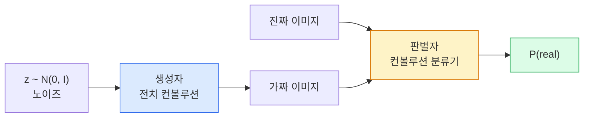
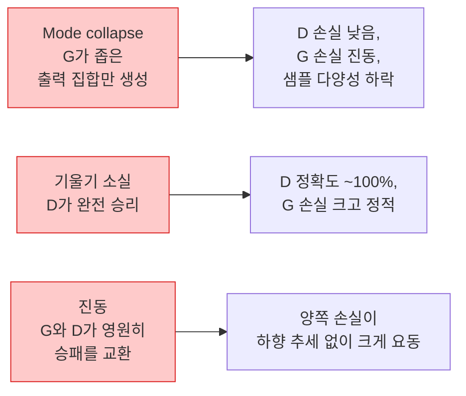

# 이미지 생성 — GAN (Image Generation — GANs)

> GAN은 고정된 게임 속의 두 신경망입니다. 하나는 그리고, 하나는 비평합니다. 그림이 비평가를 속일 때까지 함께 나아집니다.

**Type:** Build
**Languages:** Python
**Prerequisites:** Phase 4 Lesson 03 (CNNs), Phase 3 Lesson 06 (Optimizers), Phase 3 Lesson 07 (Regularization)
**Time:** ~75 minutes

## 학습 목표 (Learning Objectives)

- 생성자와 판별자 사이의 minimax 게임을 설명하고, 균형이 p_model = p_data에 해당하는 이유를 말합니다
- PyTorch로 DCGAN을 구현해 60줄 미만으로 일관된 32x32 합성 이미지를 생성합니다
- 비포화 손실, spectral norm, TTUR(two-timescale update rule) 세 가지 표준 기법으로 GAN 학습을 안정화합니다
- 건강한 수렴과 mode collapse, 진동, 판별자 완전 승리을 구분하는 학습 곡선을 읽습니다

## 문제 상황 (The Problem)

분류는 네트워크가 이미지를 라벨에 매핑하도록 가르칩니다. 생성은 문제를 뒤집습니다: 같은 분포에서 온 것처럼 보이는 새 이미지를 샘플링합니다. diff로 비교할 "정답" 출력이 없고, 흉내 내고 싶은 분포만 있습니다.

표준 손실(MSE, 교차 엔트로피)은 "이 샘플이 실제 분포에서 왔는가"를 측정할 수 없습니다. 픽셀별 오차를 최소화하면 현실적인 샘플이 아니라 흐릿한 평균이 나옵니다. 돌파구는 손실을 배우는 것이었습니다: 진짜와 가짜를 가리는 두 번째 네트워크를 학습하고, 그 판단으로 생성자를 밀어줍니다.

GAN(Goodfellow et al., 2014)이 그 프레임워크를 정의했습니다. 2018년 StyleGAN은 사진과 구별하기 어려운 1024x1024 얼굴을 만들었습니다. 이후 확산 모델이 품질과 제어성에서 왕좌를 차지했지만, 확산을 실용적으로 만든 모든 기법 — 정규화 선택, 잠재 공간, 특징 손실 — 은 먼저 GAN에서 이해되었습니다.

## 핵심 개념 (The Concept)

### 두 네트워크 (The two networks)



**생성자(Generator)** G는 노이즈 벡터 `z`를 받아 이미지를 출력합니다. **판별자(Discriminator)** D는 이미지를 받아 스칼라 하나 — 이미지가 진짜일 확률 — 를 출력합니다.

### 게임 (The game)

G는 D가 틀리기를 원합니다. D는 맞기를 원합니다. 형식적으로:

```
min_G max_D  E_x[log D(x)] + E_z[log(1 - D(G(z)))]
```

오른쪽에서 왼쪽으로 읽습니다: D는 진짜(`log D(real)`)와 가짜(`log (1 - D(fake))`) 이미지에서 정확도를 최대화합니다. G는 가짜에 대한 D의 정확도를 최소화합니다 — `D(G(z))`가 높기를 원합니다.

Goodfellow는 이 minimax의 전역 균형이 `p_G = p_data`, D가 어디서나 0.5를 출력하며, 생성·실제 분포 사이 Jensen-Shannon 발산이 0임을 증명했습니다. 어려운 것은 거기에 도달하는 일입니다.

### 비포화 손실 (Non-saturating loss)

위 형태는 수치적으로 불안정합니다. 학습 초기에 모든 가짜에 대해 `D(G(z))`가 거의 0이므로, `log(1 - D(G(z)))`는 G에 대해 기울기가 사라집니다. 해결: G의 손실을 뒤집습니다.

```
L_D = -E_x[log D(x)] - E_z[log(1 - D(G(z)))]
L_G = -E_z[log D(G(z))]                          # non-saturating
```

이제 `D(G(z))`가 거의 0일 때 G의 손실은 크고 기울기가 유의미합니다. 모든 현대 GAN이 이 변형으로 학습합니다.

### DCGAN 아키텍처 규칙 (DCGAN architecture rules)

Radford, Metz, Chintala(2015)는 수년간의 실패 실험을 다섯 규칙으로 압축해 GAN 학습을 안정화했습니다:

1. 풀링을 stride conv로 바꿉니다(양쪽 네트워크).
2. 생성자와 판별자 모두에 배치 정규화를 쓰되, G의 출력과 D의 입력은 제외합니다.
3. 더 깊은 아키텍처에서는 완전 연결 층을 제거합니다.
4. G는 출력(출력이 [-1, 1]이면 tanh)을 제외한 모든 층에 ReLU를 씁니다.
5. D는 모든 층에 LeakyReLU(negative_slope=0.2)를 씁니다.

모든 현대 conv 기반 GAN(StyleGAN, BigGAN, GigaGAN)은 여전히 이 규칙에서 시작해 조각을 하나씩 바꿉니다.

### 실패 모드와 그 징후 (Failure modes and their signatures)



- **Mode collapse**: G가 D를 속이는 한 이미지를 찾아 그것만 만듭니다. 해결: minibatch discrimination, spectral norm, 또는 라벨 조건을 추가합니다.
- **판별자 승리**: D가 너무 빨리 강해져 G의 기울기가 사라집니다. 해결: 더 작은 D, 더 낮은 D 학습률, 또는 진짜 라벨에 label smoothing.
- **진동**: 두 네트워크가 균형에 접근하지 못한 채 승패를 교환합니다. 해결: TTUR(D가 G보다 2–4배 빠르게 학습), 또는 Wasserstein 손실로 전환.

### 평가 (Evaluation)

GAN에는 정답이 없으니, 잘 되는지 어떻게 알까요?

- **샘플 검사** — 매 에폭 끝에 64개 샘플을 그냥 보세요. 협상 불가.
- **FID (Fréchet Inception Distance)** — 실제·생성 집합의 Inception-v3 특징 분포 거리. 낮을수록 좋습니다. 커뮤니티 표준.
- **Inception Score** — 더 오래되고 더 취약합니다; FID를 선호하세요.
- **생성 모델용 Precision/Recall** — 품질(precision)과 커버리지(recall)를 따로 측정합니다. FID만보다 정보가 많습니다.

작은 합성 데이터 실행에서는 샘플 검사로 충분합니다.

```figure
cv-gan-image
```

## 직접 만들기 (Build It)

### 1단계: 생성자 (Step 1: Generator)

64차원 노이즈를 받아 32x32 이미지를 만드는 작은 DCGAN 생성자입니다.

```python
import torch
import torch.nn as nn

class Generator(nn.Module):
    def __init__(self, z_dim=64, img_channels=3, feat=64):
        super().__init__()
        self.net = nn.Sequential(
            nn.ConvTranspose2d(z_dim, feat * 4, kernel_size=4, stride=1, padding=0, bias=False),
            nn.BatchNorm2d(feat * 4),
            nn.ReLU(inplace=True),
            nn.ConvTranspose2d(feat * 4, feat * 2, kernel_size=4, stride=2, padding=1, bias=False),
            nn.BatchNorm2d(feat * 2),
            nn.ReLU(inplace=True),
            nn.ConvTranspose2d(feat * 2, feat, kernel_size=4, stride=2, padding=1, bias=False),
            nn.BatchNorm2d(feat),
            nn.ReLU(inplace=True),
            nn.ConvTranspose2d(feat, img_channels, kernel_size=4, stride=2, padding=1, bias=False),
            nn.Tanh(),
        )

    def forward(self, z):
        return self.net(z.view(z.size(0), -1, 1, 1))
```

전치 컨볼루션 네 개, 각각 `kernel_size=4, stride=2, padding=1`로 공간 크기를 깔끔히 두 배로 만듭니다. 출력 활성화는 tanh로 [-1, 1]입니다.

### 2단계: 판별자 (Step 2: Discriminator)

생성자의 거울입니다. LeakyReLU, stride conv, 스칼라 로짓으로 끝납니다.

```python
class Discriminator(nn.Module):
    def __init__(self, img_channels=3, feat=64):
        super().__init__()
        self.net = nn.Sequential(
            nn.Conv2d(img_channels, feat, kernel_size=4, stride=2, padding=1),
            nn.LeakyReLU(0.2, inplace=True),
            nn.Conv2d(feat, feat * 2, kernel_size=4, stride=2, padding=1, bias=False),
            nn.BatchNorm2d(feat * 2),
            nn.LeakyReLU(0.2, inplace=True),
            nn.Conv2d(feat * 2, feat * 4, kernel_size=4, stride=2, padding=1, bias=False),
            nn.BatchNorm2d(feat * 4),
            nn.LeakyReLU(0.2, inplace=True),
            nn.Conv2d(feat * 4, 1, kernel_size=4, stride=1, padding=0),
        )

    def forward(self, x):
        return self.net(x).view(-1)
```

마지막 conv는 `4x4` 특징맵을 `1x1`로 줄입니다. 출력은 이미지당 스칼라 하나; sigmoid는 손실 계산 시에만 적용합니다.

### 3단계: 학습 스텝 (Step 3: Training step)

배치마다 D를 한 번, 그다음 G를 한 번 갱신합니다.

```python
import torch.nn.functional as F

def train_step(G, D, real, z, opt_g, opt_d, device):
    real = real.to(device)
    bs = real.size(0)

    # D step
    opt_d.zero_grad()
    d_real = D(real)
    d_fake = D(G(z).detach())
    loss_d = (F.binary_cross_entropy_with_logits(d_real, torch.ones_like(d_real))
              + F.binary_cross_entropy_with_logits(d_fake, torch.zeros_like(d_fake)))
    loss_d.backward()
    opt_d.step()

    # G step
    opt_g.zero_grad()
    d_fake = D(G(z))
    loss_g = F.binary_cross_entropy_with_logits(d_fake, torch.ones_like(d_fake))
    loss_g.backward()
    opt_g.step()

    return loss_d.item(), loss_g.item()
```

D 스텝의 `G(z).detach()`가 중요합니다: D 갱신 중에 G로 기울기가 흐르면 안 됩니다. 이를 잊는 것이 고전적인 초보 버그입니다.

### 4단계: 합성 도형에서 전체 학습 루프 (Step 4: Full training loop on synthetic shapes)

```python
from torch.utils.data import DataLoader, TensorDataset
import numpy as np

def synthetic_images(num=2000, size=32, seed=0):
    rng = np.random.default_rng(seed)
    imgs = np.zeros((num, 3, size, size), dtype=np.float32) - 1.0
    for i in range(num):
        r = rng.uniform(6, 12)
        cx, cy = rng.uniform(r, size - r, size=2)
        yy, xx = np.meshgrid(np.arange(size), np.arange(size), indexing="ij")
        mask = (xx - cx) ** 2 + (yy - cy) ** 2 < r ** 2
        color = rng.uniform(-0.5, 1.0, size=3)
        for c in range(3):
            imgs[i, c][mask] = color[c]
    return torch.from_numpy(imgs)

device = "cuda" if torch.cuda.is_available() else "cpu"
data = synthetic_images()
loader = DataLoader(TensorDataset(data), batch_size=64, shuffle=True)

G = Generator(z_dim=64, img_channels=3, feat=32).to(device)
D = Discriminator(img_channels=3, feat=32).to(device)
opt_g = torch.optim.Adam(G.parameters(), lr=2e-4, betas=(0.5, 0.999))
opt_d = torch.optim.Adam(D.parameters(), lr=2e-4, betas=(0.5, 0.999))

for epoch in range(10):
    for (batch,) in loader:
        z = torch.randn(batch.size(0), 64, device=device)
        ld, lg = train_step(G, D, batch, z, opt_g, opt_d, device)
    print(f"epoch {epoch}  D {ld:.3f}  G {lg:.3f}")
```

`Adam(lr=2e-4, betas=(0.5, 0.999))`가 DCGAN 기본값입니다 — 낮은 beta1은 모멘텀 항이 적대적 게임을 너무 안정화하지 않게 합니다.

### 5단계: 샘플링 (Step 5: Sampling)

```python
@torch.no_grad()
def sample(G, n=16, z_dim=64, device="cpu"):
    G.eval()
    z = torch.randn(n, z_dim, device=device)
    imgs = G(z)
    imgs = (imgs + 1) / 2
    return imgs.clamp(0, 1)
```

샘플링 전에 항상 eval 모드로 전환하세요. DCGAN에서는 배치의 통계 대신 배치 정규화 running stats가 쓰이므로 중요합니다.

### 6단계: Spectral normalisation

판별자에서 BN을 대체하는 드롭인으로, 네트워크가 1-Lipschitz임을 보장합니다. 대부분의 "D가 너무 강하게 이김" 실패를 고칩니다.

```python
from torch.nn.utils import spectral_norm

def build_sn_discriminator(img_channels=3, feat=64):
    return nn.Sequential(
        spectral_norm(nn.Conv2d(img_channels, feat, 4, 2, 1)),
        nn.LeakyReLU(0.2, inplace=True),
        spectral_norm(nn.Conv2d(feat, feat * 2, 4, 2, 1)),
        nn.LeakyReLU(0.2, inplace=True),
        spectral_norm(nn.Conv2d(feat * 2, feat * 4, 4, 2, 1)),
        nn.LeakyReLU(0.2, inplace=True),
        spectral_norm(nn.Conv2d(feat * 4, 1, 4, 1, 0)),
    )
```

`Discriminator`를 `build_sn_discriminator()`로 바꾸면 TTUR 트릭이 필요 없는 경우가 많습니다. Spectral norm은 적용할 수 있는 가장 쉬운 단일 견고성 업그레이드입니다.

## 활용하기 (Use It)

진지한 생성에는 사전학습 가중치를 쓰거나 확산으로 전환하세요. 두 표준 라이브러리:

- `torch_fidelity`는 커스텀 평가 코드를 쓰지 않고 생성자에 대해 FID / IS를 계산합니다.
- `pytorch-gan-zoo`(레거시)와 `StudioGAN`은 DCGAN, WGAN-GP, SN-GAN, StyleGAN, BigGAN의 검증된 구현을 제공합니다.

2026년에도 GAN이 여전히 최선인 경우: 실시간 이미지 생성(지연 <10 ms), 스타일 전이, 정밀 제어가 있는 이미지-이미지 변환(Pix2Pix, CycleGAN). 사실성과 텍스트 조건에서는 확산이 이깁니다.

## 결과물 배포 (Ship It)

이 레슨이 만드는 것:

- `outputs/prompt-gan-training-triage.md` — 학습 곡선 설명을 읽고 실패 모드(mode collapse, D-wins, 진동)와 단일 권장 수정을 고르는 프롬프트.
- `outputs/skill-dcgan-scaffold.md` — `z_dim`, 목표 `image_size`, `num_channels`로부터 학습 루프와 샘플 저장기를 포함한 DCGAN 스캐폴드를 작성하는 스킬.

## 연습 문제 (Exercises)

1. **(Easy)** 위 DCGAN을 합성 원 데이터셋에서 학습하고, 매 에폭 끝에 16개 샘플 그리드를 저장하세요. 몇 번째 에폭부터 생성된 원이 분명히 원형이 되나요?
2. **(Medium)** 판별자의 배치 정규화를 spectral norm으로 바꾸세요. 두 버전을 나란히 학습하세요. 어느 쪽이 더 빨리 수렴하나요? 어느 쪽이 시드 세 개에 걸쳐 분산이 더 낮은가요?
3. **(Hard)** 조건부 DCGAN을 구현하세요: 클래스 라벨을 G와 D 모두에 넣습니다(G에서는 노이즈에 one-hot을 concat, D에서는 클래스 임베딩 채널을 concat). Lesson 7의 합성 "원 vs 사각형" 데이터셋에서 학습하고, 특정 라벨로 샘플링해 클래스 조건이 동작함을 보이세요.

## 핵심 용어 (Key Terms)

| 용어 | 사람들이 말하는 것 | 실제 의미 |
|------|----------------|----------------------|
| Generator (G) | "그리는 네트" | 노이즈를 이미지로 매핑; 판별자를 속이도록 학습 |
| Discriminator (D) | "비평가" | 이진 분류기; 진짜와 생성 이미지를 구분하도록 학습 |
| Minimax | "그 게임" | 적대적 손실에 대해 G는 min, D는 max; 균형은 p_G = p_data |
| Non-saturating loss | "수치적으로 안전한 버전" | 학습 초반 기울기 소실을 피하려고 G 손실이 log(1 - D(G(z))) 대신 -log(D(G(z))) |
| Mode collapse | "생성자가 한 가지만 만듦" | G가 데이터 분포의 작은 부분집합만 생성; SN, minibatch discrimination, 또는 더 큰 배치로 수정 |
| TTUR | "두 학습률" | D가 G보다 보통 2–4배 빠르게 학습; 학습을 안정화 |
| Spectral norm | "1-Lipschitz 층" | 각 층의 Lipschitz 상수를 묶는 가중치 정규화; D가 임의로 가파라지는 것을 막음 |
| FID | "Fréchet Inception Distance" | 실제·생성 집합의 Inception-v3 특징 분포 거리; 표준 평가 지표 |

## 더 읽을거리 (Further Reading)

- [Generative Adversarial Networks (Goodfellow et al., 2014)](https://arxiv.org/abs/1406.2661) — 모든 것을 시작한 논문
- [DCGAN (Radford, Metz, Chintala, 2015)](https://arxiv.org/abs/1511.06434) — GAN을 학습 가능하게 만든 아키텍처 규칙
- [Spectral Normalization for GANs (Miyato et al., 2018)](https://arxiv.org/abs/1802.05957) — 가장 유용한 단일 안정화 기법
- [StyleGAN3 (Karras et al., 2021)](https://arxiv.org/abs/2106.12423) — SOTA GAN; 지난 10년의 모든 기법을 모아 놓은 베스트 앨범처럼 읽힘
