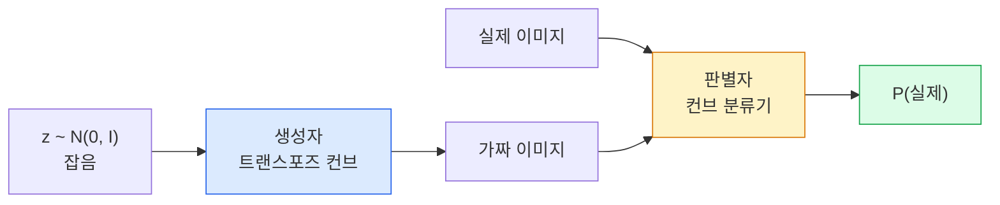
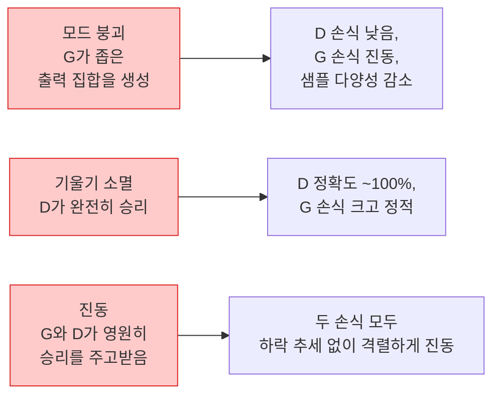

# 이미지 생성 — GAN

> GAN은 고정된 게임으로 이루어진 두 개의 신경망입니다. 하나는 그림을 그리고, 하나는 비판합니다. 그림이 비판자를 속일 때까지 함께 발전합니다.

**유형:** Build
**언어:** Python
**선수 요건:** 4단계 03강 (CNN), 3단계 06강 (옵티마이저), 3단계 07강 (정규화)
**시간:** 약 75분

## 학습 목표

- 생성자와 판별자 사이의 미니맥스 게임을 설명하고, 평형 상태가 p_model = p_data에 대응하는 이유를 설명하세요
- PyTorch에서 DCGAN을 구현하고, 60줄 미만의 코드로 일관된 32x32 합성 이미지를 생성하세요
- 세 가지 표준 기법(비포화 손실, 스펙트럼 노름, TTUR(두 배속 업데이트 규칙))을 사용하여 GAN 학습을 안정화하세요
- 건강한 수렴, 모드 붕괴, 진동, 판별자 완전 승리 등을 구분하는 학습 곡선을 읽으세요

## 문제점

분류는 네트워크가 이미지를 레이블에 매핑하도록 가르칩니다. 생성은 이 문제를 역전시킵니다: 같은 분포에서 나온 것처럼 보이는 새로운 이미지를 샘플링하는 것입니다. 비교할 "정답" 출력은 없으며, 모방하려는 분포만 있습니다.

표준 손실 함수(MSE, 교차 엔트로피)는 "이 샘플이 실제 분포에서 나왔는지"를 측정할 수 없습니다. 픽셀 단위 오차를 최소화하면 흐릿한 평균이 생성될 뿐, 현실적인 샘플이 나오지 않습니다. 돌파구는 손실을 학습하는 것이었습니다: 진짜와 가짜를 구분하는 역할을 하는 두 번째 네트워크를 학습하고, 그 판단을 사용하여 생성자를 밀어붙이는 것입니다.

GAN(Goodfellow et al., 2014)이 그 프레임워크를 정의했습니다. 2018년까지 StyleGAN은 사진과 구분할 수 없는 1024x1024 얼굴을 생성했습니다. 이후 확산 모델이 품질과 제어 가능성의 왕좌를 차지했지만, 확산 모델을 실용적으로 만드는 모든 기법(정규화 선택, 잠재 공간, 특징 손실)은 GAN에서 처음 이해되었습니다.

## 개념

### 두 개의 네트워크



**생성기** G는 잡음 벡터 `z`를 입력받아 이미지를 출력합니다. **판별기** D는 이미지를 입력받아 단일 스칼라를 출력합니다: 이미지가 진짜일 확률입니다.

### 게임

G는 D가 틀리기를 원합니다. D는 맞기를 원합니다. 형식적으로:

```
min_G max_D  E_x[log D(x)] + E_z[log(1 - D(G(z)))]
```

오른쪽에서 왼쪽으로 읽으세요: D는 진짜 이미지(`log D(real)`)와 가짜 이미지(`log (1 - D(fake))`)에 대한 정확도를 최대화합니다. G는 가짜 이미지에 대한 D의 정확도를 최소화합니다 — `D(G(z))`가 높기를 원합니다.

Goodfellow는 이 미니맥스가 `p_G = p_data`, D가 모든 곳에서 0.5를 출력하며, 생성된 분포와 실제 분포 간의 Jensen-Shannon 발산이 0인 전역 균형점을 가진다는 것을 증명했습니다. 어려운 부분은 거기에 도달하는 것입니다.

### 비포화 손실

위 형식은 수치적으로 불안정합니다. 학습 초기에는 모든 가짜 이미지에 대해 `D(G(z))`가 0에 가까우므로, `log(1 - D(G(z)))`은 G에 대해 소멸하는 기울기를 가집니다. 해결책: G의 손식을 뒤집습니다.

```
L_D = -E_x[log D(x)] - E_z[log(1 - D(G(z)))]
L_G = -E_z[log D(G(z))]                          # 비포화
```

이제 `D(G(z))`가 0에 가까울 때, G의 손식은 크고 그 기울기는 정보적입니다. 모든 현대 GAN은 이 변형으로 학습합니다.

### DCGAN 아키텍처 규칙

Radford, Metz, Chintala (2015)는 수년간의 실패한 실험을 GAN 학습을 안정적으로 만드는 5가지 규칙으로 정제했습니다:

1. 풀링을 스트라이드 컨브로 대체하세요 (양쪽 네트워크 모두).
2. G의 출력과 D의 입력을 제외하고, 생성기와 판별기 모두에 배치 노름을 사용하세요.
3. 더 깊은 아키텍처에서는 완전 연결층을 제거하세요.
4. G는 출력층을 제외하고 모든 층에 ReLU를 사용하세요 (출력층은 [-1, 1] 범위의 tanh를 사용).
5. D는 모든 층에 LeakyReLU (negative_slope=0.2)를 사용하세요.

모든 현대적인 컨브 기반 GAN (StyleGAN, BigGAN, GigaGAN)은 여전히 이 규칙에서 시작하여 조각을 하나씩 교체합니다.

### 실패 모드와 그 징후



- **모드 붕괴(Mode Collapse)**: 생성자(G)가 판별자(D)를 속이는 하나의 이미지를 찾아서 그 이미지만 생성합니다. 해결책: 미니배치 판별(minibatch discrimination), 스펙트럼 노름(spectral norm), 또는 레이블 조건부(label-conditioning)를 추가하세요.
- **판별자 우세(Discriminator Wins)**: 판별자(D)가 너무 강해져서 생성자(G)의 기울기가 사라집니다. 해결책: 판별자를 더 작게 만들거나, 판별자의 학습률을 낮추거나, 실제 레이블에 레이블 스무딩(label smoothing)을 적용하세요.
- **진동(Oscillation)**: 두 네트워크가 승패를 반복하며 평형 상태에 도달하지 못합니다. 해결책: TTUR (판별자가 생성자보다 2-4배 빠르게 학습)을 사용하거나, Wasserstein 손실로 전환하세요.

### 평가

GAN에는 정답(ground truth)이 없으므로, 작동하는지 어떻게 알 수 있나요?

- **샘플 검사(Sample Inspection)** — 매 에포크结束时 64개의 샘플을 직접 확인하세요. 필수입니다.
- **FID (Fréchet Inception Distance)** — 실제 데이터와 생성된 데이터의 Inception-v3 특징 분포 간 거리입니다. 낮을수록 좋습니다. 커뮤니티 표준입니다.
- **Inception Score** — 오래되고 더 취약합니다. FID를 선호하세요.
- **생성 모델용 정밀도/재현율(Precision/Recall for Generative Models)** — 품질(정밀도)과 커버리지(재현율)를 각각 측정합니다. FID만 사용하는 것보다 더 많은 정보를 제공합니다.

소규모 합성 데이터 실행의 경우, 샘플 검사만으로도 충분합니다.

```figure
cv-gan-image
```

## 구현하기

### 1단계: 생성자

64차원 잡음을 입력받아 32x32 이미지를 생성하는 작은 DCGAN 생성자입니다.

```python
import torch
import torch.nn as nn

class Generator(nn.Module):
    def __init__(self, z_dim=64, img_channels=3, feat=64):
        super().__init__()
        self.net = nn.Sequential(
            nn.ConvTranspose2d(z_dim, feat * 4, kernel_size=4, stride=1, padding=0, bias=False),
            nn.BatchNorm2d(feat * 4),
            nn.ReLU(inplace=True),
            nn.ConvTranspose2d(feat * 4, feat * 2, kernel_size=4, stride=2, padding=1, bias=False),
            nn.BatchNorm2d(feat * 2),
            nn.ReLU(inplace=True),
            nn.ConvTranspose2d(feat * 2, feat, kernel_size=4, stride=2, padding=1, bias=False),
            nn.BatchNorm2d(feat),
            nn.ReLU(inplace=True),
            nn.ConvTranspose2d(feat, img_channels, kernel_size=4, stride=2, padding=1, bias=False),
            nn.Tanh(),
        )

    def forward(self, z):
        return self.net(z.view(z.size(0), -1, 1, 1))
```

`kernel_size=4, stride=2, padding=1`을 가진 전치 합성곱(transposed conv) 4개를 사용하여 공간 크기를 깔끔하게 두 배로 늘립니다. tanh를 통해 출력 활성값을 [-1, 1] 범위로 만드세요.

### 2단계: 판별자

생성자의 거울상입니다. LeakyReLU, 스트라이드 합성곱(strided conv)을 사용하며, 끝에 스칼라 로짓(scalar logit)이 나옵니다.

```python
class Discriminator(nn.Module):
    def __init__(self, img_channels=3, feat=64):
        super().__init__()
        self.net = nn.Sequential(
            nn.Conv2d(img_channels, feat, kernel_size=4, stride=2, padding=1),
            nn.LeakyReLU(0.2, inplace=True),
            nn.Conv2d(feat, feat * 2, kernel_size=4, stride=2, padding=1, bias=False),
            nn.BatchNorm2d(feat * 2),
            nn.LeakyReLU(0.2, inplace=True),
            nn.Conv2d(feat * 2, feat * 4, kernel_size=4, stride=2, padding=1, bias=False),
            nn.BatchNorm2d(feat * 4),
            nn.LeakyReLU(0.2, inplace=True),
            nn.Conv2d(feat * 4, 1, kernel_size=4, stride=1, padding=0),
        )

    def forward(self, x):
        return self.net(x).view(-1)
```

마지막 합성곱은 `4x4` 특징 맵을 `1x1`로 줄입니다. 출력은 이미지당 단일 스칼라 값이며, sigmoid는 손실 계산 시에만 적용하세요.

### 3단계: 학습 단계

교대로 진행: 매 배치마다 판별자(D)를 한 번 업데이트한 후, 생성자(G)를 한 번 업데이트하세요.

```python
import torch.nn.functional as F

def train_step(G, D, real, z, opt_g, opt_d, device):
    real = real.to(device)
    bs = real.size(0)

    # 판별자(D) 단계
    opt_d.zero_grad()
    d_real = D(real)
    d_fake = D(G(z).detach())
    loss_d = (F.binary_cross_entropy_with_logits(d_real, torch.ones_like(d_real))
              + F.binary_cross_entropy_with_logits(d_fake, torch.zeros_like(d_fake)))
    loss_d.backward()
    opt_d.step()

    # 생성자(G) 단계
    opt_g.zero_grad()
    d_fake = D(G(z))
    loss_g = F.binary_cross_entropy_with_logits(d_fake, torch.ones_like(d_fake))
    loss_g.backward()
    opt_g.step()

    return loss_d.item(), loss_g.item()
```

판별자(D) 단계에서 `G(z).detach()`는 매우 중요합니다: 생성자(G)의 업데이트 중에는 생성자로 기울기가 흐르지 않도록 해야 합니다. 이를 잊는 것은 초보자의 전형적인 버그입니다.

### 4단계: 합성 도형에 대한 전체 학습 루프

```python
from torch.utils.data import DataLoader, TensorDataset
import numpy as np

def synthetic_images(num=2000, size=32, seed=0):
    rng = np.random.default_rng(seed)
    imgs = np.zeros((num, 3, size, size), dtype=np.float32) - 1.0
    for i in range(num):
        r = rng.uniform(6, 12)
        cx, cy = rng.uniform(r, size - r, size=2)
        yy, xx = np.meshgrid(np.arange(size), np.arange(size), indexing="ij")
        mask = (xx - cx) ** 2 + (yy - cy) ** 2 < r ** 2
        color = rng.uniform(-0.5, 1.0, size=3)
        for c in range(3):
            imgs[i, c][mask] = color[c]
    return torch.from_numpy(imgs)

device = "cuda" if torch.cuda.is_available() else "cpu"
data = synthetic_images()
loader = DataLoader(TensorDataset(data), batch_size=64, shuffle=True)

G = Generator(z_dim=64, img_channels=3, feat=32).to(device)
D = Discriminator(img_channels=3, feat=32).to(device)
opt_g = torch.optim.Adam(G.parameters(), lr=2e-4, betas=(0.5, 0.999))
opt_d = torch.optim.Adam(D.parameters(), lr=2e-4, betas=(0.5, 0.999))

for epoch in range(10):
    for (batch,) in loader:
        z = torch.randn(batch.size(0), 64, device=device)
        ld, lg = train_step(G, D, batch, z, opt_g, opt_d, device)
    print(f"epoch {epoch}  D {ld:.3f}  G {lg:.3f}")
```

`Adam(lr=2e-4, betas=(0.5, 0.999))`는 DCGAN의 기본값입니다 — 낮은 beta1은 모멘텀 항이 적대적 게임(adversarial game)을 너무 많이 안정화하지 않도록 합니다.

### 5단계: 샘플링

```python
@torch.no_grad()
def sample(G, n=16, z_dim=64, device="cpu"):
    G.eval()
    z = torch.randn(n, z_dim, device=device)
    imgs = G(z)
    imgs = (imgs + 1) / 2
    return imgs.clamp(0, 1)
```

샘플링 전에 항상 eval 모드로 전환하세요. DCGAN의 경우 배치 정규화(batch norm)의 실행 통계(running stats)가 배치의 통계 대신 사용되므로 이 점이 중요합니다.

### 6단계: 스펙트럴 정규화

판별자(discriminator)의 BN을 대체하는 drop-in replacement으로, 네트워크가 1-Lipschitz 조건을 만족하도록 보장합니다. "판별자가 너무 강하게 이기는(D wins too hard)" 실패를 대부분 해결합니다.

```python
from torch.nn.utils import spectral_norm

def build_sn_discriminator(img_channels=3, feat=64):
    return nn.Sequential(
        spectral_norm(nn.Conv2d(img_channels, feat, 4, 2, 1)),
        nn.LeakyReLU(0.2, inplace=True),
        spectral_norm(nn.Conv2d(feat, feat * 2, 4, 2, 1)),
        nn.LeakyReLU(0.2, inplace=True),
        spectral_norm(nn.Conv2d(feat * 2, feat * 4, 4, 2, 1)),
        nn.LeakyReLU(0.2, inplace=True),
        spectral_norm(nn.Conv2d(feat * 4, 1, 4, 1, 0)),
    )
```

`Discriminator`을 `build_sn_discriminator()`으로 교체하면 TTUR 트릭이 필요하지 않은 경우가 많습니다. 스펙트럴 정규화는 적용할 수 있는 가장 쉬운 단일 robustness upgrade입니다.

## 사용하기

본격적인 생성 작업에는 사전 학습된 가중치를 사용하거나 diffusion으로 전환하세요. 두 가지 표준 라이브러리:

- `torch_fidelity`는 custom eval 코드를 작성하지 않고도 generator에 대해 FID / IS를 계산합니다.
- `pytorch-gan-zoo` (legacy)와 `StudioGAN`은 DCGAN, WGAN-GP, SN-GAN, StyleGAN, BigGAN의 테스트된 구현을 제공합니다.

2026년에도 GAN은 실시간 이미지 생성(레이턴시 <10 ms), 스타일 전송, 정밀한 제어가 가능한 image-to-image translation(Pix2Pix, CycleGAN)에 여전히 최선의 선택입니다. Photorealism과 text conditioning에서는 diffusion이 우세합니다.

## 출시하기

이 강은 다음을 생성합니다:

- `outputs/prompt-gan-training-triage.md` — 학습 곡선 설명을 읽고 실패 모드(mode collapse, D-wins, oscillation)와 단일 권장 수정 사항을 선택하는 prompt.
- `outputs/skill-dcgan-scaffold.md` — `z_dim`, target `image_size`, `num_channels`로부터 DCGAN scaffold를 작성하는 skill. training loop와 sample saver를 포함합니다.

## 연습 문제

1. **(쉬움)** 위의 DCGAN을 synthetic circle dataset으로 학습하고 각 에포크结束时 16개 샘플의 grid를 저장하세요. 몇 번째 에포크에서 생성된 원이 명확한 원형이 됩니까?
2. **(중간)** 판별자의 batch norm을 spectral norm으로 교체하세요. 두 버전을 나란히 학습하세요. 어느 것이 더 빨리 수렴합니까? 세 개의 seed에 걸쳐 variance가 더 낮은 것은 어느 쪽입니까?
3. **(어려움)** conditional DCGAN을 구현하세요: class label을 G와 D 모두에 입력하세요(G에서는 noise에 one-hot을 concat하고, D에서는 class embedding channel을 concat하세요). 7강의 synthetic "circles vs squares" dataset으로 학습하고, 특정 label로 샘플링하여 class conditioning이 작동함을 보이세요.

## 핵심 용어

| 용어 | 사람들이 말하는 표현 | 실제 의미 |
|------|----------------|----------------------|
| 생성기 (G) | "그림 그리는 네트워크" | 잡음을 이미지로 매핑; 판별기를 속이도록 학습 |
| 판별기 (D) | "비평가" | 이진 분류기; 실제 이미지와 생성된 이미지를 구분하도록 학습 |
| 미니맥스 | "게임" | G에 대한 min, D에 대한 max의 적대적 손실; 균형점은 p_G = p_data |
| 비포화 손실 | "수치적으로 안전한 버전" | G의 손실은 log(1 - D(G(z))) 대신 -log(D(G(z)))를 사용하며, 초기 학습에서 기울기 소실을 방지 |
| 모드 붕괴 | "생성기가 한 가지만 만듦" | G가 데이터 분포의 작은 하위 집합만 생성; SN, 미니배치 판별, 더 큰 배치로 해결 |
| TTUR | "두 개의 학습률" | D가 G보다 더 빠르게 학습하며, 일반적으로 2-4배 차이; 학습을 안정화 |
| 스펙트럴 노름 | "1-Lipschitz 레이어" | 각 레이어의 Lipschitz 상수를 제한하는 가중치 정규화; D가 임의로 가파르게 되는 것을 방지 |
| FID | "Fréchet Inception Distance" | 실제 및 생성된 집합의 Inception-v3 특징 분포 간 거리; 표준 평가 지표 |

## 추가 읽기

- [Generative Adversarial Networks (Goodfellow et al., 2014)](https://arxiv.org/abs/1406.2661) — 모든 것을 시작한 논문
- [DCGAN (Radford, Metz, Chintala, 2015)](https://arxiv.org/abs/1511.06434) — GAN을 학습 가능하게 만든 아키텍처 규칙
- [Spectral Normalization for GANs (Miyato et al., 2018)](https://arxiv.org/abs/1802.05957) — 가장 유용한 안정화 트릭
- [StyleGAN3 (Karras et al., 2021)](https://arxiv.org/abs/2106.12423) — SOTA GAN; 지난 10년간의 모든 트릭을 모은 greatest-hits 앨범처럼 읽힘
