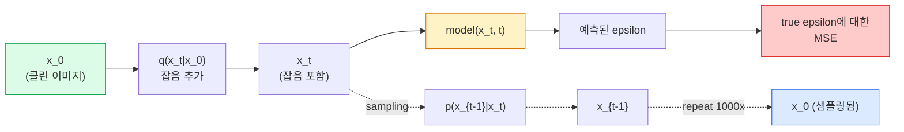

# 이미지 생성 — 확산 모델(Diffusion Models)

> 확산 모델(Diffusion Model)은 노이즈를 제거하는 것을 학습합니다. 노이즈가 있는 이미지에서 아주 작은 노이즈를 제거하도록 학습하고, 그 과정을 역순으로 천 번 반복하면 이미지 생성기가 됩니다.

**유형:** Build
**언어:** Python
**선수 요건:** 4단계 07강 (U-Net), 1단계 06강 (확률), 3단계 06강 (옵티마이저)
**시간:** 약 75분

## 학습 목표

- 순방향 노이즈화 과정 `x_0 -> x_1 -> ... -> x_T`을 유도하고, 왜 `q(x_t | x_0)`의 닫힌 형식이 모든 t에 대해 성립하는지 설명하세요
- 각 단계에서 추가된 노이즈를 회귀하는 DDPM 스타일 학습 목표와, 순수 노이즈에서 이미지로 역행하는 샘플러를 구현하세요
- CPU에서 학습할 수 있을 만큼 작은 시간 조건부 U-Net을 구축하여, 모든 타임스텝에 대한 노이즈를 예측하세요
- DDPM과 DDIM 샘플링의 차이점, 그리고 각각이 적합한 시점을 설명하세요 (23강에서 흐름 매칭과 정류 흐름을 심도 있게 다룹니다)

## 문제점

GAN은 한 번에 생성합니다: 노이즈가 입력되고, 이미지가 출력되며, 한 번의 순방향 패스로 끝납니다. GAN은 빠르지만 학습하기 어렵습니다. 확산 모델(Diffusion Model)은 반복적으로 생성합니다: 순수 노이즈에서 시작하여, 작은 단계로 노이즈를 제거하면, 이미지가 나타납니다. 확산 모델은 느리지만 학습하기 쉽습니다. 지난 5년간 후자의 특성이 지배적이었습니다: 작은 팀도 확산 모델(Diffusion Model)을 학습하여 합리적인 샘플을 얻을 수 있습니다. GAN 학습은 수년간의 실패한 실행을 통해 익히는 기술입니다.

학습 안정성을 넘어, 확산 모델(Diffusion Model)의 반복적 구조는 현대 이미지 생성이 하는 모든 것을 가능하게 합니다: 텍스트 조건부, 인페인팅, 이미지 편집, 초해상도, 제어 가능한 스타일. 샘플링 루프의 각 단계는 새로운 제약 조건을 주입할 수 있는 지점입니다. 이 훅(hook) 때문에 Stable Diffusion, Imagen, DALL-E 3, Midjourney, 그리고 여러분이 사용할 모든 제어 가능한 이미지 모델이 확산 모델(Diffusion Model) 기반입니다.

이 강의는 최소한의 DDPM을 구축합니다: 순방향 노이즈화, 역방향 노이즈 제거, 학습 루프. 다음 강의(Stable Diffusion)는 이를 VAE, 텍스트 인코더, 분류기 없는 가이드(classifier-free guidance)를 갖춘 생산 시스템으로 연결합니다.

## 개념

### 순방향 과정

이미지 `x_0`를 가져오세요. `x_1`를 얻기 위해 가우시안 잡음을 아주 조금 추가하세요. `x_2`를 얻기 위해 조금 더 추가하세요. `x_T`이 순수 가우시안 잡음과 거의 구별할 수 없을 때까지 T 단계 동안 계속 진행하세요.

```
q(x_t | x_{t-1}) = N(x_t; sqrt(1 - beta_t) * x_{t-1},  beta_t * I)
```

`beta_t`는 작은 분산 스케줄이며, 일반적으로 T=1000 단계에 걸쳐 0.0001에서 0.02까지 선형으로 증가합니다. 각 단계에서 신호가 약간 줄어들고 새로운 잡음이 주입됩니다.

### 폐형 점프

한 단계씩 잡음을 추가하는 것은 마르코프 체인이지만, 수학적 계산이 단순화됩니다: `x_0`에서 `x_t`를 한 단계로 직접 샘플링할 수 있습니다.

```
Define alpha_t = 1 - beta_t
Define alpha_bar_t = prod_{s=1..t} alpha_s

Then:
  q(x_t | x_0) = N(x_t; sqrt(alpha_bar_t) * x_0,  (1 - alpha_bar_t) * I)

Equivalently:
  x_t = sqrt(alpha_bar_t) * x_0 + sqrt(1 - alpha_bar_t) * epsilon
  where epsilon ~ N(0, I)
```

이 하나의 방정식이 확산(diffusion) 모델이 실용적인 이유의 전부입니다. 학습 중에는 랜덤한 `t`를 선택하고, `x_0`에서 `x_t`를 직접 샘플링하여 한 단계로 학습합니다. 전체 마르코프 체인을 시뮬레이션할 필요가 없습니다.

### 역과정

순방향 과정은 고정되어 있습니다. 역과정 `p(x_{t-1} | x_t)`는 신경망이 학습하는 부분입니다. 확산 모델은 `x_{t-1}`를 직접 예측하지 않습니다. 대신 단계 t에서 추가된 잡음 `epsilon`를 예측하며, 수학적으로 `x_{t-1}`를 이를 통해 유도합니다.



### 학습 손실

모든 학습 단계에서:

1. 실제 이미지 `x_0`를 샘플링하세요.
2. [1, T]에서 균일하게 시간 단계 `t`를 샘플링하세요.
3. 잡음 `epsilon ~ N(0, I)`를 샘플링하세요.
4. `x_t = sqrt(alpha_bar_t) * x_0 + sqrt(1 - alpha_bar_t) * epsilon`를 계산하세요.
5. 네트워크로 `epsilon_theta(x_t, t)`를 예측하세요.
6. `|| epsilon - epsilon_theta(x_t, t) ||^2`를 최소화하세요.

이것이 전부입니다. 신경망은 임의의 시간 단계에서 잡음을 예측하는 법을 학습합니다. 손실은 MSE입니다. 적대적 게임, 붕괴, 진동은 없습니다.

### 샘플러 (DDPM)

생성하려면 `x_T ~ N(0, I)`에서 시작하여 한 단계씩 거꾸로 이동하세요.

```
for t = T, T-1, ..., 1:
    eps = model(x_t, t)
    x_{t-1} = (1 / sqrt(alpha_t)) * (x_t - (beta_t / sqrt(1 - alpha_bar_t)) * eps) + sqrt(beta_t) * z
    where z ~ N(0, I) if t > 1, else 0
return x_0
```

핵심은 역 조건부 확률이 일반적으로 닫힌 형태로 알려져 있지 않지만, 이 특정 가우시안 순방향 과정에서는 닫힌 형태로 존재한다는 점입니다. 보기 흉한 계수들은 베이즈 정리가 제공하는 결과입니다.

### 왜 1000 단계인가

순방향 노이즈 스케줄은 각 단계가 역방향 단계를 거의 가우시안으로 만들 만큼 충분한 노이즈를 추가하도록 선택됩니다. 단계가 너무 적으면 역방향 단계가 가우시안에서 멀리 떨어져 있어 네트워크가 이를 잘 모델링할 수 없습니다. 단계가 너무 많으면 샘플링 비용이 증가하지만 이득은 감소합니다. T=1000강 선형 스케줄은 DDPM의 기본값입니다.

### DDIM: 20배 빠른 샘플링

학습은 동일합니다. 샘플링이 변경됩니다. DDIM (Song et al., 2020)은 재학습 없이 타임스텝을 건너뛰는 결정론적 역방향 과정을 정의합니다. DDIM으로 50단계 샘플링을 수행하면 거의 1000단계 DDPM 품질을 얻습니다. 모든 프로덕션 시스템은 DDIM 또는 더 빠른 변형(DPM-Solver, Euler ancestral)을 사용합니다.

### 시간 조건부

네트워크 `epsilon_theta(x_t, t)`는 어떤 타임스텝을 디노이징하는지 알아야 합니다. 최신 확산 모델은 트랜스포머의 위치 인코딩과 동일한 개념인 사인(time) 시간 임베딩을 통해 `t`를 주입하며, 이는 U-Net의 모든 레벨에서 특징 맵에 추가됩니다.

```
t_embedding = sinusoidal(t)
feature_map += MLP(t_embedding)
```

시간 조건부가 없으면 네트워크는 이미지 자체에서 노이즈 수준을 추론해야 하며, 이는 작동하지만 샘플 효율성이 훨씬 낮습니다.

```figure
cv-diffusion-image
```

## 구현하기

### 1단계: 노이즈 스케줄

```python
import torch

def linear_beta_schedule(T=1000, beta_start=1e-4, beta_end=2e-2):
    return torch.linspace(beta_start, beta_end, T)


def precompute_schedule(betas):
    alphas = 1.0 - betas
    alphas_cumprod = torch.cumprod(alphas, dim=0)
    return {
        "betas": betas,
        "alphas": alphas,
        "alphas_cumprod": alphas_cumprod,
        "sqrt_alphas_cumprod": torch.sqrt(alphas_cumprod),
        "sqrt_one_minus_alphas_cumprod": torch.sqrt(1.0 - alphas_cumprod),
        "sqrt_recip_alphas": torch.sqrt(1.0 / alphas),
    }

schedule = precompute_schedule(linear_beta_schedule(T=1000))
```

한 번에 사전 계산하고, 학습 및 샘플링 중 인덱스로 수집합니다.

### 2단계: 순방향 확산 (q_sample)

```python
def q_sample(x0, t, noise, schedule):
    sqrt_a = schedule["sqrt_alphas_cumprod"][t].view(-1, 1, 1, 1)
    sqrt_one_minus_a = schedule["sqrt_one_minus_alphas_cumprod"][t].view(-1, 1, 1, 1)
    return sqrt_a * x0 + sqrt_one_minus_a * noise
```

한 줄의 닫힌 형태입니다. `t`는 배치 내 각 이미지당 하나의 타임스텝을 포함하는 배치입니다.

### 3단계: 작은 시간 조건부 U-Net

```python
import torch.nn as nn
import torch.nn.functional as F
import math

def timestep_embedding(t, dim=64):
    half = dim // 2
    freqs = torch.exp(-math.log(10000) * torch.arange(half, device=t.device) / half)
    args = t[:, None].float() * freqs[None]
    emb = torch.cat([args.sin(), args.cos()], dim=-1)
    return emb


class TinyUNet(nn.Module):
    def __init__(self, img_channels=3, base=32, t_dim=64):
        super().__init__()
        self.t_mlp = nn.Sequential(
            nn.Linear(t_dim, base * 4),
            nn.SiLU(),
            nn.Linear(base * 4, base * 4),
        )
        self.t_dim = t_dim
        self.enc1 = nn.Conv2d(img_channels, base, 3, padding=1)
        self.enc2 = nn.Conv2d(base, base * 2, 4, stride=2, padding=1)
        self.mid = nn.Conv2d(base * 2, base * 2, 3, padding=1)
        self.dec1 = nn.ConvTranspose2d(base * 2, base, 4, stride=2, padding=1)
        self.dec2 = nn.Conv2d(base * 2, img_channels, 3, padding=1)
        self.time_proj = nn.Linear(base * 4, base * 2)

    def forward(self, x, t):
        t_emb = timestep_embedding(t, self.t_dim)
        t_emb = self.t_mlp(t_emb)
        t_proj = self.time_proj(t_emb)[:, :, None, None]

        h1 = F.silu(self.enc1(x))
        h2 = F.silu(self.enc2(h1)) + t_proj
        h3 = F.silu(self.mid(h2))
        d1 = F.silu(self.dec1(h3))
        d2 = torch.cat([d1, h1], dim=1)
        return self.dec2(d2)
```

병목 부분(bottleneck)에 시간 조건부가 주입된 2레벨 U-Net입니다. 실제 이미지를 위해 깊이와 너비를 확장하세요.

### 4단계: 학습 루프

```python
def train_step(model, x0, schedule, optimizer, device, T=1000):
    model.train()
    x0 = x0.to(device)
    bs = x0.size(0)
    t = torch.randint(0, T, (bs,), device=device)
    noise = torch.randn_like(x0)
    x_t = q_sample(x0, t, noise, schedule)
    pred = model(x_t, t)
    loss = F.mse_loss(pred, noise)
    optimizer.zero_grad()
    loss.backward()
    optimizer.step()
    return loss.item()
```

이것이 전체 학습 루프입니다. GAN 게임도, 특수한 손실 함수도 없으며, 하나의 MSE 호출만 필요합니다.

### 5단계: 샘플러 (DDPM)

```python
@torch.no_grad()
def sample(model, schedule, shape, T=1000, device="cpu"):
    model.eval()
    x = torch.randn(shape, device=device)
    betas = schedule["betas"].to(device)
    sqrt_one_minus_a = schedule["sqrt_one_minus_alphas_cumprod"].to(device)
    sqrt_recip_alphas = schedule["sqrt_recip_alphas"].to(device)

    for t in reversed(range(T)):
        t_batch = torch.full((shape[0],), t, dtype=torch.long, device=device)
        eps = model(x, t_batch)
        coef = betas[t] / sqrt_one_minus_a[t]
        mean = sqrt_recip_alphas[t] * (x - coef * eps)
        if t > 0:
            x = mean + torch.sqrt(betas[t]) * torch.randn_like(x)
        else:
            x = mean
    return x
```

하나의 샘플 배치를 생성하기 위해 1000번의 순방향 전달이 필요합니다. 실제 코드에서는 DDIM 50단계 샘플러로 교체하세요.

### 6단계: DDIM 샘플러 (결정론적, 약 20배 빠름)

```python
@torch.no_grad()
def sample_ddim(model, schedule, shape, steps=50, T=1000, device="cpu", eta=0.0):
    model.eval()
    x = torch.randn(shape, device=device)
    alphas_cumprod = schedule["alphas_cumprod"].to(device)

    ts = torch.linspace(T - 1, 0, steps + 1).long()
    for i in range(steps):
        t = ts[i]
        t_prev = ts[i + 1]
        t_batch = torch.full((shape[0],), t, dtype=torch.long, device=device)
        eps = model(x, t_batch)
        a_t = alphas_cumprod[t]
        a_prev = alphas_cumprod[t_prev] if t_prev >= 0 else torch.tensor(1.0, device=device)
        x0_pred = (x - torch.sqrt(1 - a_t) * eps) / torch.sqrt(a_t)
        sigma = eta * torch.sqrt((1 - a_prev) / (1 - a_t) * (1 - a_t / a_prev))
        dir_xt = torch.sqrt(1 - a_prev - sigma ** 2) * eps
        noise = sigma * torch.randn_like(x) if eta > 0 else 0
        x = torch.sqrt(a_prev) * x0_pred + dir_xt + noise
    return x
```

`eta=0`은 완전히 결정적입니다 (동일한 노이즈 입력은 항상 동일한 출력을 생성합니다). `eta=1`은 DDPM을 복원합니다.

## 사용하기

프로덕션 작업에서는 `diffusers`을 사용하세요:

```python
from diffusers import DDPMScheduler, UNet2DModel

unet = UNet2DModel(sample_size=32, in_channels=3, out_channels=3, layers_per_block=2)
scheduler = DDPMScheduler(num_train_timesteps=1000)
```

이 라이브러리는 완성된 스케줄러 (DDPM, DDIM, DPM-Solver, Euler, Heun), 설정 가능한 U-Net, 텍스트-이미지 및 이미지-이미지 파이프라인, LoRA 미세 조정 헬퍼를 제공합니다.

연구용으로는 `k-diffusion` (Katherine Crowson)가 가장 충실한 참조 구현과 최상의 샘플링 변형을 갖추고 있습니다.

## 출시하기

이 강의는 다음을 생성합니다:

- `outputs/prompt-diffusion-sampler-picker.md` — 품질 목표, 지연 예산, 조건 유형에 따라 DDPM / DDIM / DPM-Solver / Euler를 선택하는 프롬프트입니다.
- `outputs/skill-noise-schedule-designer.md` — T와 목표 손상 수준을 입력으로 받아 선형, 코사인, 시그모이드 beta 스케줄을 생성하고, 시간에 따른 신호 대 잡음비(SNR) 진단 플롯을 포함하는 스킬입니다.

## 연습 문제

1. **(쉬움)** 순방향 과정을 시각화하세요: 하나의 이미지를 가져와 `t in [0, 100, 250, 500, 750, 1000]`에서 `x_t`을 플롯합니다. `x_1000`이 순수 가우시안 노이즈처럼 보이는지 확인하세요.
2. **(중간)** 합성 원数据集(synthetic-circles dataset)에서 TinyUNet을 20 에포크 동안 학습하고 16개의 원을 샘플링하세요. DDPM (1000 스텝)과 DDIM (50 스텝) 샘플링을 비교하세요 — 동일한 노이즈 시드에서 유사한 이미지를 생성하나요?
3. **(어려움)** 코사인 노이즈 스케줄 (Nichol & Dhariwal, 2021)을 구현하세요: `alpha_bar_t = cos^2((t/T + s) / (1 + s) * pi / 2)`. 동일한 모델을 선형 및 코사인 스케줄로 학습하고, 낮은 스텝 수에서 코사인 스케줄이 더 나은 샘플을 제공함을 보이세요.

## 핵심 용어

| 용어 | 사람들이 말하는 것 | 실제 의미 |
|------|----------------|----------------------|
| 순방향 과정 | "시간에 따라 노이즈를 추가" | T 스텝에 걸쳐 이미지를 가우시안 노이즈로 손상시키는 고정 마르코프 체인 |
| 역방향 과정 | "단계별로 노이즈 제거" | 노이즈에서 이미지로 되돌아가는 학습된 분포 |
| Epsilon 예측 | "노이즈를 예측" | 학습 목표: `epsilon_theta(x_t, t)`은 스텝 t에서 추가된 노이즈를 예측합니다 |
| Beta 스케줄 | "노이즈 양" | 스텝마다 얼마나 많은 노이즈가 들어가는지 정의하는 T개의 작은 분산 시퀀스 |
| alpha_bar_t | "누적 유지 계수" | 시간 t까지의 (1 - beta_s) 곱; t가 클수록 신호가 적게 남습니다 |
| DDPM 샘플러 | "Ancestral, stochastic" | 각 x_{t-1}을 조건부 가우시안에서 샘플링; 1000 단계 |
| DDIM 샘플러 | "Deterministic, fast" | 샘플링을 결정론적 ODE로 재작성; 유사한 품질로 20-100 단계 |
| 시간 조건부 | "Tell the model which t" | t의 사인 코사인 임베딩을 U-Net에 주입하여 노이즈 수준을 인식하게 함 |

## 추가 읽기

- [Denoising Diffusion Probabilistic Models (Ho et al., 2020)](https://arxiv.org/abs/2006.11239) — 확산 모델을 실용화하고 FID에서 GAN을 능가한 논문
- [Improved DDPM (Nichol & Dhariwal, 2021)](https://arxiv.org/abs/2102.09672) — 코사인을 스케줄과 v-파라미터화
- [DDIM (Song, Meng, Ermon, 2020)](https://arxiv.org/abs/2010.02502) — 실시간 추론을 가능하게 한 결정론적 샘플러
- [Elucidating the Design Space of Diffusion (Karras et al., 2022)](https://arxiv.org/abs/2206.00364) — 모든 확산 설계 선택에 대한 통합된 관점; 현재 최상의 참고 자료
