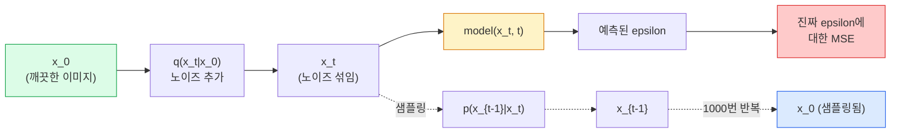

# 이미지 생성 — 확산 모델 (Image Generation — Diffusion Models)

> 확산 모델은 디노이즈하는 법을 배웁니다. 노이즈가 섞인 이미지에서 아주 작은 노이즈를 제거하도록 학습하고, 그 과정을 거꾸로 천 번 반복하면 이미지 생성기가 됩니다.

**Type:** Build
**Languages:** Python
**Prerequisites:** Phase 4 Lesson 07 (U-Net), Phase 1 Lesson 06 (Probability), Phase 3 Lesson 06 (Optimizers)
**Time:** ~75 minutes

## 학습 목표 (Learning Objectives)

- 순방향 노이즈 과정 `x_0 -> x_1 -> ... -> x_T`를 유도하고, 임의의 t에 대해 닫힌 형태 `q(x_t | x_0)`가 성립하는 이유를 설명합니다
- 각 단계에서 추가된 노이즈를 회귀하는 DDPM 스타일 학습 목적과, 순수 노이즈에서 이미지로 되돌아가는 샘플러를 구현합니다
- 임의의 타임스텝에 대한 노이즈를 예측하는 시간 조건 U-Net(CPU에서 학습할 만큼 작은)을 만듭니다
- DDPM과 DDIM 샘플링의 차이를 설명하고, 각각이 적절한 시점을 말합니다(Lesson 23이 flow matching과 rectified flow를 깊이 다룹니다)

## 문제 상황 (The Problem)

GAN은 한 번에 생성합니다: 노이즈 입력, 이미지 출력, 순방향 패스 한 번. 빠르고 학습이 어렵습니다. 확산 모델은 반복적으로 생성합니다: 순수 노이즈에서 시작해 작은 단계로 디노이즈하면 이미지가 드러납니다. 느리고 학습이 쉽습니다. 지난 5년은 후자의 성질이 지배했습니다: 작은 팀도 확산 모델을 학습해 합리적인 샘플을 얻을 수 있고, GAN 학습은 실패한 실행을 수년 겪으며 배우는 기술입니다.

학습 안정성을 넘어, 확산의 반복 구조가 현대 이미지 생성의 모든 것을 엽니다: 텍스트 조건, 인페인팅, 이미지 편집, 초해상도, 제어 가능한 스타일. 샘플링 루프의 각 단계는 새 제약을 주입할 자리입니다. Stable Diffusion, Imagen, DALL-E 3, Midjourney, 그리고 쓸 모든 제어 가능 이미지 모델이 확산 기반인 이유입니다.

이 레슨은 최소 DDPM을 만듭니다: 순방향 노이즈, 역방향 디노이즈, 학습 루프. 다음 레슨(Stable Diffusion)은 VAE, 텍스트 인코더, classifier-free guidance와 함께 프로덕션 시스템으로 연결합니다.

## 핵심 개념 (The Concept)

### 순방향 과정 (The forward process)

이미지 `x_0`를 가져옵니다. 아주 작은 가우시안 노이즈를 더해 `x_1`을 얻습니다. 조금 더 더해 `x_2`를 얻습니다. T 스텝 동안 계속하면 `x_T`는 순수 가우시안 노이즈와 거의 구별되지 않습니다.

```
q(x_t | x_{t-1}) = N(x_t; sqrt(1 - beta_t) * x_{t-1},  beta_t * I)
```

`beta_t`는 작은 분산 스케줄로, 보통 T=1000 스텝에 걸쳐 0.0001에서 0.02로 선형입니다. 각 스텝은 신호를 살짝 줄이고 새 노이즈를 주입합니다.

### 닫힌 형태 점프 (The closed-form jump)

한 스텝씩 노이즈를 더하는 것은 마르코프 체인이지만, 수학이 접힙니다: `x_t`를 `x_0`에서 한 스텝으로 직접 샘플링할 수 있습니다.

```
Define alpha_t = 1 - beta_t
Define alpha_bar_t = prod_{s=1..t} alpha_s

Then:
  q(x_t | x_0) = N(x_t; sqrt(alpha_bar_t) * x_0,  (1 - alpha_bar_t) * I)

Equivalently:
  x_t = sqrt(alpha_bar_t) * x_0 + sqrt(1 - alpha_bar_t) * epsilon
  where epsilon ~ N(0, I)
```

이 한 방정식이 확산을 실용적으로 만드는 전부입니다. 학습 중에는 임의 `t`를 고르고, `x_0`에서 `x_t`를 직접 샘플링해 한 스텝으로 학습합니다 — 전체 마르코프 체인 시뮬레이션이 필요 없습니다.

### 역과정 (The reverse process)

순방향 과정은 고정입니다. 역과정 `p(x_{t-1} | x_t)`가 신경망이 배우는 것입니다. 확산 모델은 `x_{t-1}`을 직접 예측하지 않고, 스텝 t에서 추가된 노이즈 `epsilon`을 예측하며, 수학이 그로부터 `x_{t-1}`을 유도합니다.



### 학습 손실 (The training loss)

매 학습 스텝마다:

1. 실제 이미지 `x_0`를 샘플링합니다.
2. [1, T]에서 타임스텝 `t`를 균등 샘플링합니다.
3. 노이즈 `epsilon ~ N(0, I)`를 샘플링합니다.
4. `x_t = sqrt(alpha_bar_t) * x_0 + sqrt(1 - alpha_bar_t) * epsilon`을 계산합니다.
5. 네트워크로 `epsilon_theta(x_t, t)`를 예측합니다.
6. `|| epsilon - epsilon_theta(x_t, t) ||^2`를 최소화합니다.

그게 전부입니다. 신경망은 임의의 타임스텝에서 노이즈를 예측하는 법을 배웁니다. 손실은 MSE입니다. 적대적 게임도, collapse도, 진동도 없습니다.

### 샘플러 (DDPM) (The sampler (DDPM))

생성하려면: `x_T ~ N(0, I)`에서 시작해 한 스텝씩 뒤로 걷습니다.

```
for t = T, T-1, ..., 1:
    eps = model(x_t, t)
    x_{t-1} = (1 / sqrt(alpha_t)) * (x_t - (beta_t / sqrt(1 - alpha_bar_t)) * eps) + sqrt(beta_t) * z
    where z ~ N(0, I) if t > 1, else 0
return x_0
```

핵심은 일반적으로 역 조건부 분포가 닫힌 형태로 알려지지 않아도, 이 특정 가우시안 순방향 과정에서는 가능하다는 점입니다. 보기 흉한 계수는 베이즈 규칙이 주는 것입니다.

### 왜 1000 스텝인가 (Why 1000 steps)

순방향 노이즈 스케줄은 각 스텝이 역스텝이 거의 가우시안이 될 만큼만 노이즈를 더하도록 고릅니다. 스텝이 너무 적으면 역스텝이 가우시안에서 멀어져 네트워크가 잘 모델링하지 못합니다. 너무 많으면 샘플링이 비싸고 이득이 줄어듭니다. 선형 스케줄의 T=1000이 DDPM 기본값입니다.

### DDIM: 약 20배 빠른 샘플링 (DDIM: 20x faster sampling)

학습은 같습니다. 샘플링이 바뀝니다. DDIM(Song et al., 2020)은 재학습 없이 타임스텝을 건너뛰는 결정적 역과정을 정의합니다. DDIM으로 50 스텝 샘플링하면 1000 스텝 DDPM에 가까운 품질이 나옵니다. 모든 프로덕션 시스템은 DDIM 또는 더 빠른 변형(DPM-Solver, Euler ancestral)을 씁니다.

### 시간 조건화 (Time conditioning)

네트워크 `epsilon_theta(x_t, t)`는 어느 타임스텝을 디노이즈하는지 알아야 합니다. 현대 확산 모델은 (트랜스포머의 위치 인코딩과 같은 아이디어의) 사인파 시간 임베딩으로 `t`를 주입해 모든 U-Net 레벨의 특징맵에 더합니다.

```
t_embedding = sinusoidal(t)
feature_map += MLP(t_embedding)
```

시간 조건이 없으면 네트워크가 이미지 자체에서 노이즈 수준을 추측해야 하며, 동작은 하지만 샘플 효율이 훨씬 떨어집니다.

```figure
cv-diffusion-image
```

## 직접 만들기 (Build It)

### 1단계: 노이즈 스케줄 (Step 1: Noise schedule)

```python
import torch

def linear_beta_schedule(T=1000, beta_start=1e-4, beta_end=2e-2):
    return torch.linspace(beta_start, beta_end, T)


def precompute_schedule(betas):
    alphas = 1.0 - betas
    alphas_cumprod = torch.cumprod(alphas, dim=0)
    return {
        "betas": betas,
        "alphas": alphas,
        "alphas_cumprod": alphas_cumprod,
        "sqrt_alphas_cumprod": torch.sqrt(alphas_cumprod),
        "sqrt_one_minus_alphas_cumprod": torch.sqrt(1.0 - alphas_cumprod),
        "sqrt_recip_alphas": torch.sqrt(1.0 / alphas),
    }

schedule = precompute_schedule(linear_beta_schedule(T=1000))
```

한 번 미리 계산하고, 학습·샘플링 중 인덱스로 gather합니다.

### 2단계: 순방향 확산 (q_sample) (Step 2: Forward diffusion (q_sample))

```python
def q_sample(x0, t, noise, schedule):
    sqrt_a = schedule["sqrt_alphas_cumprod"][t].view(-1, 1, 1, 1)
    sqrt_one_minus_a = schedule["sqrt_one_minus_alphas_cumprod"][t].view(-1, 1, 1, 1)
    return sqrt_a * x0 + sqrt_one_minus_a * noise
```

한 줄짜리 닫힌 형태입니다. `t`는 배치의 이미지마다 하나씩인 타임스텝 배치입니다.

### 3단계: 작은 시간 조건 U-Net (Step 3: A tiny time-conditioned U-Net)

```python
import torch.nn as nn
import torch.nn.functional as F
import math

def timestep_embedding(t, dim=64):
    half = dim // 2
    freqs = torch.exp(-math.log(10000) * torch.arange(half, device=t.device) / half)
    args = t[:, None].float() * freqs[None]
    emb = torch.cat([args.sin(), args.cos()], dim=-1)
    return emb


class TinyUNet(nn.Module):
    def __init__(self, img_channels=3, base=32, t_dim=64):
        super().__init__()
        self.t_mlp = nn.Sequential(
            nn.Linear(t_dim, base * 4),
            nn.SiLU(),
            nn.Linear(base * 4, base * 4),
        )
        self.t_dim = t_dim
        self.enc1 = nn.Conv2d(img_channels, base, 3, padding=1)
        self.enc2 = nn.Conv2d(base, base * 2, 4, stride=2, padding=1)
        self.mid = nn.Conv2d(base * 2, base * 2, 3, padding=1)
        self.dec1 = nn.ConvTranspose2d(base * 2, base, 4, stride=2, padding=1)
        self.dec2 = nn.Conv2d(base * 2, img_channels, 3, padding=1)
        self.time_proj = nn.Linear(base * 4, base * 2)

    def forward(self, x, t):
        t_emb = timestep_embedding(t, self.t_dim)
        t_emb = self.t_mlp(t_emb)
        t_proj = self.time_proj(t_emb)[:, :, None, None]

        h1 = F.silu(self.enc1(x))
        h2 = F.silu(self.enc2(h1)) + t_proj
        h3 = F.silu(self.mid(h2))
        d1 = F.silu(self.dec1(h3))
        d2 = torch.cat([d1, h1], dim=1)
        return self.dec2(d2)
```

병목에 시간 조건을 주입한 2레벨 U-Net입니다. 실제 이미지에는 깊이와 폭을 키우세요.

### 4단계: 학습 루프 (Step 4: Training loop)

```python
def train_step(model, x0, schedule, optimizer, device, T=1000):
    model.train()
    x0 = x0.to(device)
    bs = x0.size(0)
    t = torch.randint(0, T, (bs,), device=device)
    noise = torch.randn_like(x0)
    x_t = q_sample(x0, t, noise, schedule)
    pred = model(x_t, t)
    loss = F.mse_loss(pred, noise)
    optimizer.zero_grad()
    loss.backward()
    optimizer.step()
    return loss.item()
```

이것이 전체 학습 루프입니다. GAN 게임도, 특수 손실도 없고 MSE 호출 한 번입니다.

### 5단계: 샘플러 (DDPM) (Step 5: Sampler (DDPM))

```python
@torch.no_grad()
def sample(model, schedule, shape, T=1000, device="cpu"):
    model.eval()
    x = torch.randn(shape, device=device)
    betas = schedule["betas"].to(device)
    sqrt_one_minus_a = schedule["sqrt_one_minus_alphas_cumprod"].to(device)
    sqrt_recip_alphas = schedule["sqrt_recip_alphas"].to(device)

    for t in reversed(range(T)):
        t_batch = torch.full((shape[0],), t, dtype=torch.long, device=device)
        eps = model(x, t_batch)
        coef = betas[t] / sqrt_one_minus_a[t]
        mean = sqrt_recip_alphas[t] * (x - coef * eps)
        if t > 0:
            x = mean + torch.sqrt(betas[t]) * torch.randn_like(x)
        else:
            x = mean
    return x
```

한 배치의 샘플을 만들려면 순방향 패스 1000번입니다. 실제 코드에서는 DDIM 50스텝 샘플러로 바꿉니다.

### 6단계: DDIM 샘플러 (결정적, ~20배 빠름) (Step 6: DDIM sampler (deterministic, ~20x faster))

```python
@torch.no_grad()
def sample_ddim(model, schedule, shape, steps=50, T=1000, device="cpu", eta=0.0):
    model.eval()
    x = torch.randn(shape, device=device)
    alphas_cumprod = schedule["alphas_cumprod"].to(device)

    ts = torch.linspace(T - 1, 0, steps + 1).long()
    for i in range(steps):
        t = ts[i]
        t_prev = ts[i + 1]
        t_batch = torch.full((shape[0],), t, dtype=torch.long, device=device)
        eps = model(x, t_batch)
        a_t = alphas_cumprod[t]
        a_prev = alphas_cumprod[t_prev] if t_prev >= 0 else torch.tensor(1.0, device=device)
        x0_pred = (x - torch.sqrt(1 - a_t) * eps) / torch.sqrt(a_t)
        sigma = eta * torch.sqrt((1 - a_prev) / (1 - a_t) * (1 - a_t / a_prev))
        dir_xt = torch.sqrt(1 - a_prev - sigma ** 2) * eps
        noise = sigma * torch.randn_like(x) if eta > 0 else 0
        x = torch.sqrt(a_prev) * x0_pred + dir_xt + noise
    return x
```

`eta=0`은 완전 결정적입니다(같은 노이즈 입력은 항상 같은 출력). `eta=1`은 DDPM을 복원합니다.

## 활용하기 (Use It)

프로덕션 작업에는 `diffusers`를 쓰세요:

```python
from diffusers import DDPMScheduler, UNet2DModel

unet = UNet2DModel(sample_size=32, in_channels=3, out_channels=3, layers_per_block=2)
scheduler = DDPMScheduler(num_train_timesteps=1000)
```

라이브러리는 준비된 스케줄러(DDPM, DDIM, DPM-Solver, Euler, Heun), 설정 가능한 U-Net, 텍스트-이미지·이미지-이미지 파이프라인, LoRA 파인튜닝 헬퍼를 제공합니다.

연구용으로는 Katherine Crowson의 `k-diffusion`이 가장 충실한 참고 구현과 최고의 샘플링 변형을 가집니다.

## 결과물 배포 (Ship It)

이 레슨이 만드는 것:

- `outputs/prompt-diffusion-sampler-picker.md` — 품질 목표, 지연 예산, 조건 유형에 따라 DDPM / DDIM / DPM-Solver / Euler를 고르는 프롬프트.
- `outputs/skill-noise-schedule-designer.md` — T와 목표 손상 수준이 주어지면 선형·코사인·시그모이드 베타 스케줄과 시간에 따른 SNR 진단 플롯을 만드는 스킬.

## 연습 문제 (Exercises)

1. **(Easy)** 순방향 과정을 시각화하세요: 한 이미지를 가져와 `t in [0, 100, 250, 500, 750, 1000]`에서 `x_t`를 플롯하세요. `x_1000`이 순수 가우시안 노이즈처럼 보이는지 확인하세요.
2. **(Medium)** TinyUNet을 합성 원 데이터셋에서 20 에폭 학습하고 16개 원을 샘플링하세요. DDPM(1000 스텝)과 DDIM(50 스텝) 샘플링을 비교하세요 — 같은 노이즈 시드에서 비슷한 이미지가 나오나요?
3. **(Hard)** 코사인 노이즈 스케줄(Nichol & Dhariwal, 2021)을 구현하세요: `alpha_bar_t = cos^2((t/T + s) / (1 + s) * pi / 2)`. 같은 모델을 선형·코사인 스케줄로 학습하고, 낮은 스텝 수에서 코사인이 더 나은 샘플을 줌을 보이세요.

## 핵심 용어 (Key Terms)

| 용어 | 사람들이 말하는 것 | 실제 의미 |
|------|----------------|----------------------|
| Forward process | "시간에 따라 노이즈 추가" | T 스텝에 걸쳐 이미지를 가우시안 노이즈로 손상시키는 고정 마르코프 체인 |
| Reverse process | "한 스텝씩 디노이즈" | 노이즈에서 이미지로 되돌아가는 학습된 분포 |
| Epsilon prediction | "노이즈를 예측" | 학습 타깃: `epsilon_theta(x_t, t)`가 스텝 t에서 추가된 노이즈를 예측 |
| Beta schedule | "노이즈 양" | 스텝마다 들어가는 노이즈 양을 정의하는 T개의 작은 분산 시퀀스 |
| alpha_bar_t | "누적 유지 계수" | 시간 t까지의 (1 - beta_s) 곱; t가 클수록 남은 신호가 적음 |
| DDPM sampler | "조상적, 확률적" | 각 x_{t-1}을 조건부 가우시안에서 샘플링; 1000 스텝 |
| DDIM sampler | "결정적, 빠름" | 샘플링을 결정적 ODE로 다시 씀; 비슷한 품질로 20–100 스텝 |
| Time conditioning | "모델에 t를 알려줌" | U-Net에 주입된 t의 사인파 임베딩으로 노이즈 수준을 알게 함 |

## 더 읽을거리 (Further Reading)

- [Denoising Diffusion Probabilistic Models (Ho et al., 2020)](https://arxiv.org/abs/2006.11239) — 확산을 실용적으로 만들고 FID에서 GAN을 이긴 논문
- [Improved DDPM (Nichol & Dhariwal, 2021)](https://arxiv.org/abs/2102.09672) — 코사인 스케줄과 v-파라미터화
- [DDIM (Song, Meng, Ermon, 2020)](https://arxiv.org/abs/2010.02502) — 실시간 추론을 가능하게 한 결정적 샘플러
- [Elucidating the Design Space of Diffusion (Karras et al., 2022)](https://arxiv.org/abs/2206.00364) — 모든 확산 설계 선택의 통합 관점; 현재 최고의 참고
