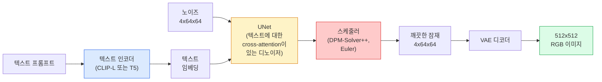

# Stable Diffusion — 아키텍처와 파인튜닝 (Architecture & Fine-Tuning)

> Stable Diffusion은 사전학습 VAE의 잠재 공간에서 돌아가는 DDPM으로, cross-attention으로 텍스트에 조건화되고, 빠른 결정적 ODE 솔버로 샘플링되며, classifier-free guidance로 조향됩니다.

**Type:** Learn + Use
**Languages:** Python
**Prerequisites:** Phase 4 Lesson 10 (Diffusion), Phase 7 Lesson 02 (Self-Attention)
**Time:** ~75 minutes

## 학습 목표 (Learning Objectives)

- Stable Diffusion 파이프라인의 다섯 조각을 추적합니다: VAE, 텍스트 인코더, U-Net, 스케줄러, 세이프티 체커 — 그리고 각각이 실제로 하는 일
- 잠재 확산을 설명하고, 왜 3x512x512 이미지 대신 4x64x64 잠재 공간에서 학습하면 품질 손실 없이 연산이 48배 줄어드는지 말합니다
- `diffusers`로 이미지 생성, image-to-image, 인페인팅, ControlNet 유도 생성을 실행합니다
- 작은 커스텀 데이터셋에서 LoRA로 Stable Diffusion을 파인튜닝하고, 추론 시 LoRA 어댑터를 로드합니다

## 문제 상황 (The Problem)

512x512 RGB 이미지에서 DDPM을 직접 학습하는 것은 비쌉니다. 매 학습 스텝이 3x512x512 = 786,432 입력 값을 보는 U-Net을 통해 역전파하고, 샘플링은 같은 U-Net을 통해 50회 이상 순방향 패스를 합니다. Stable Diffusion 1.5(2022 출시) 품질 수준에서, 픽셀 공간 확산은 대략 256 GPU-월의 학습과 소비자 GPU에서 이미지당 10–30초가 필요합니다.

오픈 가중치 텍스트-이미지를 실용적으로 만든 트릭은 **잠재 확산(latent diffusion)**(Rombach et al., CVPR 2022)이었습니다. 3x512x512 이미지를 4x64x64 잠재 텐서로 갔다가 돌아오는 VAE를 학습한 뒤, 그 잠재 공간에서 확산을 합니다. 연산은 `(3*512*512)/(4*64*64) = 48x` 줄어듭니다. 샘플링은 같은 GPU에서 수십 초에서 2초 미만으로 떨어집니다.

거의 모든 현대 이미지 생성 모델 — SDXL, SD3, FLUX, HunyuanDiT, Wan-Video — 은 오토인코더, 디노이저(U-Net 또는 DiT), 텍스트 조건의 변형이 있는 잠재 확산 모델입니다. Stable Diffusion을 배우면 그 템플릿을 배운 것입니다.

## 핵심 개념 (The Concept)

### 파이프라인 (The pipeline)



- **VAE** — 동결된 오토인코더. 인코더는 이미지를 잠재로 바꿉니다(img2img와 학습에 사용). 디코더는 잠재를 이미지로 되돌립니다.
- **텍스트 인코더** — CLIP 텍스트 인코더(SD 1.x/2.x), CLIP-L + CLIP-G(SDXL), 또는 T5-XXL(SD3/FLUX). 토큰 임베딩 시퀀스를 만듭니다.
- **U-Net** — 디노이저. 모든 해상도 레벨에서 잠재에서 텍스트 임베딩으로 attend하는 cross-attention 층을 가집니다.
- **스케줄러** — 샘플링 알고리즘(DDIM, Euler, DPM-Solver++). 시그마를 고르고 예측된 노이즈를 잠재에 다시 섞습니다.
- **세이프티 체커** — 출력 이미지에 대한 선택적 NSFW / 불법 콘텐츠 필터.

### Classifier-free guidance (CFG)

평범한 텍스트 조건은 모든 프롬프트 `c`에 대해 `epsilon_theta(x_t, t, c)`를 학습합니다. CFG는 같은 네트워크를 `c`가 10%의 시간 동안 드롭된 채(빈 임베딩으로 대체) 학습해, 조건부·무조건부 노이즈를 모두 예측하는 단일 모델을 줍니다. 추론 시:

```
eps = eps_uncond + w * (eps_cond - eps_uncond)
```

`w`는 guidance scale입니다. `w=0`은 무조건부, `w=1`은 평범한 조건부, `w>1`은 다양성을 대가로 출력을 "프롬프트에 더 조건화된" 쪽으로 밀어냅니다. SD 기본값은 `w=7.5`입니다.

CFG가 텍스트-이미지가 프로덕션 품질로 동작하는 이유입니다. 없으면 프롬프트가 출력을 약하게만 편향시키고, 있으면 프롬프트가 지배합니다.

### 잠재 공간 기하 (Latent space geometry)

VAE의 4채널 잠재는 압축된 이미지만이 아닙니다. 산술이 대략 의미적 편집에 해당하는 매니폴드이며(프롬프트 엔지니어링과 보간이 둘 다 여기 살고), 확산 U-Net이 전체 모델링 예산을 쓰도록 학습된 곳입니다. 임의 4x64x64 잠재를 디코딩하면 임의처럼 보이는 이미지가 나오지 않습니다 — 유효한 이미지로 디코딩되는 특정 부분 매니폴드만 있기 때문에 쓰레기가 나옵니다.

두 가지 결과:

1. **Img2img** = 이미지를 잠재로 인코딩, 부분 노이즈 추가, 디노이저 실행, 디코딩. 인코딩이 거의 가역이라 이미지 구조가 살아남고, 내용은 프롬프트에 따라 바뀝니다.
2. **인페인팅** = img2img와 같되 디노이저가 마스크된 영역만 갱신하고, 마스크되지 않은 영역은 인코딩된 잠재로 유지합니다.

### U-Net 아키텍처 (The U-Net architecture)

SD U-Net은 Lesson 10의 TinyUNet의 큰 버전으로, 세 가지가 추가됩니다:

- 모든 공간 해상도의 **트랜스포머 블록**, self-attention + 텍스트 임베딩에 대한 cross-attention 포함.
- 사인파 인코딩 위 MLP를 통한 **시간 임베딩**.
- 매칭되는 해상도에서 인코더와 디코더 사이의 **스킵 연결**.

SD 1.5 총 파라미터: ~860M. SDXL: ~2.6B. FLUX: ~12B. 파라미터 증가는 대부분 어텐션 층에 있습니다.

### LoRA 파인튜닝 (LoRA fine-tuning)

Stable Diffusion 전체 파인튜닝은 20GB 이상의 VRAM이 필요하고 860M 파라미터를 갱신합니다. LoRA(Low-Rank Adaptation)는 베이스 모델을 동결하고 어텐션 층에 작은 랭크 분해 행렬을 주입합니다. SD용 LoRA 어댑터는 보통 10–50 MB이고, 단일 소비자 GPU에서 10–60분 학습되며, 추론 시 드롭인 수정으로 로드됩니다.

```
Original: W_q : (d_in, d_out)   frozen
LoRA:     W_q + alpha * (A @ B)   where A : (d_in, r), B : (r, d_out)

r is typically 4-32.
```

LoRA는 거의 모든 커뮤니티 파인튜닝이 배포되는 방식입니다. CivitAI와 Hugging Face가 수백만 개를 호스팅합니다.

### 보게 될 스케줄러 (Schedulers you will see)

- **DDIM** — 결정적, ~50 스텝, 단순.
- **Euler ancestral** — 확률적, 30–50 스텝, 약간 더 창의적인 샘플.
- **DPM-Solver++ 2M Karras** — 결정적, 20–30 스텝, 프로덕션 기본값.
- **LCM / TCD / Turbo** — consistency 모델과 증류 변형; 약간의 품질을 대가로 1–4 스텝.

`diffusers`에서 스케줄러 교체는 한 줄 변경이며, 재학습 없이 샘플 문제를 고치는 경우도 있습니다.

```figure
cv3-latent-compression
```

## 직접 만들기 (Build It)

이 레슨은 Stable Diffusion을 처음부터 다시 만들지 않고 `diffusers`를 end-to-end로 씁니다. 다시 만들어야 할 조각(VAE, 텍스트 인코더, U-Net, 스케줄러)은 각자 레슨의 주제이고; 여기서 목표는 프로덕션 API에 익숙해지는 것입니다.

### 1단계: 텍스트-이미지 (Step 1: Text-to-image)

```python
import torch
from diffusers import StableDiffusionPipeline

pipe = StableDiffusionPipeline.from_pretrained(
    "runwayml/stable-diffusion-v1-5",
    torch_dtype=torch.float16,
).to("cuda")

image = pipe(
    prompt="a dog riding a skateboard in tokyo, studio ghibli style",
    guidance_scale=7.5,
    num_inference_steps=25,
    generator=torch.Generator("cuda").manual_seed(42),
).images[0]
image.save("dog.png")
```

`float16`은 눈에 보이는 품질 손실 없이 VRAM을 절반으로 줄입니다. 기본 DPM-Solver++의 `num_inference_steps=25`는 DDIM의 `num_inference_steps=50`과 맞먹습니다.

### 2단계: 스케줄러 교체 (Step 2: Swap the scheduler)

```python
from diffusers import DPMSolverMultistepScheduler, EulerAncestralDiscreteScheduler

pipe.scheduler = DPMSolverMultistepScheduler.from_config(pipe.scheduler.config)
pipe.scheduler = EulerAncestralDiscreteScheduler.from_config(pipe.scheduler.config)
```

스케줄러 상태는 U-Net 가중치와 분리되어 있습니다. DDPM으로 학습하고 어떤 스케줄러로든 샘플링할 수 있습니다.

### 3단계: Image-to-image (Step 3: Image-to-image)

```python
from diffusers import StableDiffusionImg2ImgPipeline
from PIL import Image

img2img = StableDiffusionImg2ImgPipeline.from_pretrained(
    "runwayml/stable-diffusion-v1-5",
    torch_dtype=torch.float16,
).to("cuda")

init_image = Image.open("dog.png").convert("RGB").resize((512, 512))
out = img2img(
    prompt="a dog riding a skateboard, oil painting",
    image=init_image,
    strength=0.6,
    guidance_scale=7.5,
).images[0]
```

`strength`는 디노이즈 전에 더할 노이즈 양입니다(0.0 = 변경 없음, 1.0 = 완전 재생성). 0.5–0.7이 스타일 전이의 표준 범위입니다.

### 4단계: 인페인팅 (Step 4: Inpainting)

```python
from diffusers import StableDiffusionInpaintPipeline

inpaint = StableDiffusionInpaintPipeline.from_pretrained(
    "runwayml/stable-diffusion-inpainting",
    torch_dtype=torch.float16,
).to("cuda")

image = Image.open("dog.png").convert("RGB").resize((512, 512))
mask = Image.open("dog_mask.png").convert("L").resize((512, 512))

out = inpaint(
    prompt="a cat",
    image=image,
    mask_image=mask,
    guidance_scale=7.5,
).images[0]
```

마스크의 흰색 픽셀이 재생성할 영역입니다. 검은색 픽셀은 보존됩니다.

### 5단계: LoRA 로드 (Step 5: LoRA loading)

```python
pipe.load_lora_weights("sayakpaul/sd-lora-ghibli")
pipe.fuse_lora(lora_scale=0.8)

image = pipe(prompt="a village square in ghibli style").images[0]
```

`lora_scale`은 강도를 제어합니다; 0.0 = 효과 없음, 1.0 = 전체 효과. `fuse_lora`는 속도를 위해 어댑터를 가중치에 제자리에서 굽지만, 교체를 막습니다. 다른 어댑터를 로드하기 전에 `pipe.unfuse_lora()`를 호출하세요.

### 6단계: LoRA 학습 (스케치) (Step 6: LoRA training (sketch))

실제 LoRA 학습은 `peft` 또는 `diffusers.training`에 있습니다. 개요:

```python
# Pseudocode
for step, batch in enumerate(dataloader):
    images, prompts = batch
    latents = vae.encode(images).latent_dist.sample() * 0.18215

    t = torch.randint(0, num_train_timesteps, (batch_size,))
    noise = torch.randn_like(latents)
    noisy_latents = scheduler.add_noise(latents, noise, t)

    text_emb = text_encoder(tokenizer(prompts))

    pred_noise = unet(noisy_latents, t, text_emb)  # LoRA weights injected here

    loss = F.mse_loss(pred_noise, noise)
    loss.backward()
    optimizer.step()
```

LoRA 행렬만 기울기를 받고; 베이스 U-Net, VAE, 텍스트 인코더는 동결됩니다. 배치 크기 1과 gradient checkpointing이면 8 GB VRAM에 들어갑니다.

## 활용하기 (Use It)

프로덕션에서 실제로 내리는 결정:

- **모델 패밀리**: 오픈소스 커뮤니티 파인튜닝에는 SD 1.5, 더 높은 충실도에는 SDXL, 최신 기술과 엄격한 라이선스 요구에는 SD3 / FLUX.
- **스케줄러**: 20–30 스텝에는 DPM-Solver++ 2M Karras, 지연이 1초 미만이면 LCM-LoRA.
- **정밀도**: 4080/4090에서는 `float16`, A100 이상에서는 `bfloat16`, VRAM이 빠듯하면 `int8`(`bitsandbytes` 또는 `compel` 경유).
- **조건화**: 평범한 텍스트로도 동작; 더 강한 제어에는 베이스 파이프라인 위에 ControlNet(canny, depth, pose)을 추가.

배치 생성에는 `AUTO1111` / `ComfyUI`가 커뮤니티 도구이고; 프로덕션 API에는 `diffusers` + `accelerate` 또는 TensorRT 컴파일이 있는 `optimum-nvidia`입니다.

## 결과물 배포 (Ship It)

이 레슨이 만드는 것:

- `outputs/prompt-sd-pipeline-planner.md` — 지연 예산, 충실도 목표, 라이선스 제약이 주어지면 SD 1.5 / SDXL / SD3 / FLUX와 스케줄러·정밀도를 고르는 프롬프트.
- `outputs/skill-lora-training-setup.md` — 캡션, 랭크, 배치 크기, 학습률을 포함한 커스텀 데이터셋용 전체 LoRA 학습 설정을 작성하는 스킬.

## 연습 문제 (Exercises)

1. **(Easy)** 같은 프롬프트를 `guidance_scale` in `[1, 3, 5, 7.5, 10, 15]`로 생성하세요. 이미지가 어떻게 변하는지 설명하세요. 어느 guidance 값에서 아티팩트가 나타나나요?
2. **(Medium)** 아무 실제 사진을 가져와 `strength` in `[0.2, 0.4, 0.6, 0.8, 1.0]`로 `StableDiffusionImg2ImgPipeline`을 돌리세요. 어느 strength가 구도를 유지하면서 스타일을 바꾸나요? 왜 1.0은 입력을 완전히 무시하나요?
3. **(Hard)** 단일 피사체(반려동물, 로고, 캐릭터)의 10–20장 이미지로 LoRA를 학습하고, 그 피사체가 들어간 새 장면을 생성하세요. 입력 이미지에 과적합하지 않으면서 정체성 보존이 가장 좋았던 LoRA 랭크와 학습 스텝을 보고하세요.

## 핵심 용어 (Key Terms)

| 용어 | 사람들이 말하는 것 | 실제 의미 |
|------|----------------|----------------------|
| Latent diffusion | "잠재에서 확산" | 픽셀 공간(3x512x512) 대신 VAE 잠재 공간(4x64x64)에서 전체 DDPM을 실행; 48배 연산 절감 |
| VAE scale factor | "0.18215" | VAE의 원시 잠재를 대략 단위 분산으로 재스케일하는 상수; 모든 SD 파이프라인에 하드코딩 |
| Classifier-free guidance | "CFG" | 조건부·무조건부 노이즈 예측을 혼합; 가장 영향력 큰 단일 추론 노브 |
| Scheduler | "샘플러" | 노이즈 + 모델 예측을 디노이즈된 잠재 궤적으로 바꾸는 알고리즘 |
| LoRA | "저랭크 어댑터" | 베이스 가중치를 건드리지 않고 어텐션 층을 파인튜닝하는 작은 랭크 분해 행렬 |
| Cross-attention | "텍스트-이미지 어텐션" | 잠재 토큰에서 텍스트 토큰으로의 어텐션; 모든 U-Net 레벨에 프롬프트 정보 주입 |
| ControlNet | "구조 조건화" | 추가 입력(canny, depth, pose, 세그멘테이션)으로 SD를 조향하는 별도 학습 어댑터 |
| DPM-Solver++ | "기본 스케줄러" | 2차 결정적 ODE 솔버; 2026년 낮은 스텝 수(20–30)에서 최고 품질 |

## 더 읽을거리 (Further Reading)

- [High-Resolution Image Synthesis with Latent Diffusion (Rombach et al., 2022)](https://arxiv.org/abs/2112.10752) — Stable Diffusion 논문; 설계를 정당화하는 모든 ablation 포함
- [Classifier-Free Diffusion Guidance (Ho & Salimans, 2022)](https://arxiv.org/abs/2207.12598) — CFG 논문
- [LoRA: Low-Rank Adaptation of Large Language Models (Hu et al., 2021)](https://arxiv.org/abs/2106.09685) — LoRA는 NLP 우선이었고; 거의 변경 없이 SD로 전이됨
- [diffusers documentation](https://huggingface.co/docs/diffusers) — 모든 SD / SDXL / SD3 / FLUX 파이프라인 참고
