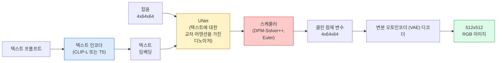

# Stable Diffusion — 아키텍처 및 미세 조정

> Stable Diffusion은 사전 학습된 VAE의 잠재 공간에서 실행되는 DDPM입니다. 텍스트 조건은 교차 어텐션(Cross-Attention)을 통해 적용되며, 빠른 결정론적 ODE 솔버로 샘플링되고, 분류기 없는 가이드(classifier-free guidance)로 제어됩니다.

**유형:** 학습 + 사용
**언어:** Python
**선수 요건:** 4단계 10강 (확산 모델), 7단계 02강 (셀프 어텐션)
**시간:** 약 75분

## 학습 목표

- Stable Diffusion 파이프라인의 다섯 구성 요소인 VAE, 텍스트 인코더, U-Net, 스케줄러, 안전 체크어(safety checker)를 추적하고, 각 구성 요소가 실제로 수행하는 작업을 이해해 보세요.
- 잠재 확산(latent diffusion)을 설명하고, 3x512x512 이미지 대신 4x64x64 잠재 공간에서 학습하면 품질 손실 없이 연산량이 48배 감소하는 이유를 이해해 보세요.
- `diffusers`를 사용하여 이미지를 생성하고, 이미지-to-image, 인페인팅(inpainting), ControlNet 가이드 생성을 실행해 보세요.
- 소규모 사용자 정의 데이터셋으로 Stable Diffusion을 LoRA로 미세 조정하고, 추론 시 LoRA 어댑터를 로드해 보세요.

## 문제점

512x512 RGB 이미지에 직접 DDPM을 학습하는 것은 비용이 많이 듭니다. 모든 학습 단계에서 U-Net은 3x512x512 = 786,432개의 입력 값을 보며 역전파(backpropagation)를 수행하고, 샘플링은 동일한 U-Net을 통해 50회 이상의 순방향 전파(forward pass)를 수행합니다. Stable Diffusion 1.5 (2022년 출시)의 품질 수준에서는 픽셀 공간 확산이 약 256 GPU-월의 학습 시간과 소비자용 GPU에서 이미지당 10-30초가 필요합니다.

오픈 웨이트 텍스트-to-image를 실용적으로 만든 핵심은 **잠재 확산(latent diffusion)** (Rombach et al., CVPR 2022)입니다. 3x512x512 이미지를 4x64x64 잠재 텐서로 매핑하고 복원하는 VAE를 학습한 후, 그 잠재 공간에서 확산을 수행합니다. 연산량이 `(3*512*512)/(4*64*64) = 48x`만큼 감소합니다. 샘플링 시간은 동일한 GPU에서 수십 초에서 2초 미만으로 줄어듭니다.

거의 모든 현대적 이미지 생성 모델 — SDXL, SD3, FLUX, HunyuanDiT, Wan-Video —은 오토인코더, 디노이저(U-Net 또는 DiT), 텍스트 조건에 변형을 가한 잠재 확산 모델입니다. Stable Diffusion을 학습하면 이 템플릿을 습득하게 됩니다.

## 개념

### 파이프라인



- **변분 오토인코더 (VAE)** — 동결된 오토인코더. 인코더는 이미지를 잠재 변수로 변환합니다 (img2img 및 학습에 사용됨). 디코더는 잠재 변수를 이미지로 복원합니다.
- **텍스트 인코더** — CLIP 텍스트 인코더 (SD 1.x/2.x), CLIP-L + CLIP-G (SDXL), 또는 T5-XXL (SD3/FLUX). 토큰 임베딩 시퀀스를 생성합니다.
- **U-Net** — 디노이저입니다. 모든 해상도 수준에서 잠재 변수가 텍스트 임베딩을 참조하는 교차 어텐션 레이어를 가지고 있습니다.
- **스케줄러** — 샘플링 알고리즘 (DDIM, Euler, DPM-Solver++). 시그마를 선택하고 예측된 잡음을 잠재 변수에 다시 혼합합니다.
- **안전 검사기** — 출력 이미지에 대한 선택적 NSFW / 불법 콘텐츠 필터입니다.

### 분류기 없는 가이드 (CFG)

일반 텍스트 조건은 모든 프롬프트 `c`에 대해 `epsilon_theta(x_t, t, c)`를 학습합니다. CFG는 네트워크를 동일한 방식으로 학습하되, 10%의 확률로 `c`를 드롭하여 (빈 임베딩으로 대체) 조건부 및 무조건부 잡음을 모두 예측하는 단일 모델을 생성합니다. 추론 시:

```
eps = eps_uncond + w * (eps_cond - eps_uncond)
```

`w`는 가이드 스케일입니다. `w=0`는 무조건부, `w=1`는 일반 조건부이며, `w>1`는 다양성의 대가로 출력값을 "프롬프트에 더 조건부"로 만듭니다. SD의 기본값은 `w=7.5`입니다.

CFG는 텍스트-이미지 생성이 생산 품질로 작동하는 이유입니다. 이것이 없으면 프롬프트가 출력에 약한 편향을 미치지만, 이것이 있으면 프롬프트가 출력을 지배합니다.

### 잠재 공간 기하학

VAE의 4채널 잠재 변수는 단순한 압축 이미지가 아닙니다. 이는 산술 연산이 대략적으로 의미적 편집에 대응하는 다양체이며 (프롬프트 엔지니어링과 보간 모두 여기서 이루어짐), 확산 U-Net이 전체 모델링 예산을 소비하도록 학습된 공간입니다. 랜덤한 4x64x64 잠재 변수를 디코딩하면 랜덤해 보이는 이미지가 생성되지 않습니다. 이는 유효한 이미지로 디코딩되는 특정 하위 다양체에 속하지 않기 때문에 쓰레기(garbage)가 생성됩니다.

두 가지 결과:

1. **Img2img** = 이미지를 잠재 공간(latent)으로 인코딩하고, 부분적인 노이즈를 추가한 뒤, 디노이저(denoiser)를 실행하고, 디코딩합니다. 인코딩이 거의 역변환 가능하기 때문에 이미지 구조가 유지되며, 프롬프트에 따라 내용이 변경됩니다.
2. **Inpainting** = img2img와 동일하지만, 디노이저가 마스킹된 영역만 업데이트하며, 마스킹되지 않은 영역은 인코딩된 잠재 공간(latent) 상태로 유지됩니다.

### U-Net 아키텍처

SD U-Net은 10강의 TinyUNet의 확장판으로, 세 가지 추가 기능이 있습니다:

- **Transformer 블록**이 모든 공간 해상도에 위치하며, 셀프 어텐션(self-attention)과 텍스트 임베딩에 대한 교차 어텐션(cross-attention)을 포함합니다.
- **시간 임베딩**은 사인(sin) 인코딩에 MLP를 적용하여 생성됩니다.
- 인코더와 디코더 사이에 동일한 해상도에서 **스킵 연결(skip connections)**이 존재합니다.

SD 1.5의 총 매개변수 수: 약 860M. SDXL: 약 2.6B. FLUX: 약 12B. 매개변수 수의 급격한 증가는 주로 어텐션 레이어에서 발생합니다.

### LoRA 미세 조정

Stable Diffusion의 전체 미세 조정은 20GB 이상의 VRAM이 필요하며 860M개의 매개변수를 업데이트합니다. LoRA (저랭크 적응)(LoRA (Low-Rank Adaptation))는 기본 모델을 동결(frozen) 상태로 유지하고, 어텐션 레이어에 작은 랭크 분해(rank-decomposition) 행렬을 주입합니다. SD용 LoRA 어댑터는 일반적으로 10-50MB이며, 단일 소비자용 GPU에서 10-60분 동안 학습되고, 추론 시 드롭인(drop-in) 수정으로 로드됩니다.

```
Original: W_q : (d_in, d_out)   frozen
LoRA:     W_q + alpha * (A @ B)   where A : (d_in, r), B : (r, d_out)

r is typically 4-32.
```

LoRA는 커뮤니티의 거의 모든 미세 조정 모델이 배포되는 방식입니다. CivitAI와 Hugging Face에는 수백만 개의 LoRA가 호스팅되어 있습니다.

### 주요 스케줄러

- **DDIM** — 결정론적(deterministic), 약 50 스텝, 단순합니다.
- **Euler ancestral** — 확률적(stochastic), 30-50 스텝, 조금 더 창의적인 샘플을 생성합니다.
- **DPM-Solver++ 2M Karras** — 결정론적(deterministic), 20-30 스텝, 생산 환경의 기본값입니다.
- **LCM / TCD / Turbo** — 일관성 모델(consistency models) 및 증류(distilled) 변형; 품질의 일부 손실을 감수하고 1-4 스텝으로 수행합니다.

스케줄러 교체는 `diffusers`에서 한 줄 변경으로 이루어지며, 재학습 없이 샘플 문제를 해결하는 경우가 종종 있습니다.

```figure
cv3-latent-compression
```

## 구현하기

이 강의는 Stable Diffusion을 처음부터 재구축하는 대신 `diffusers`를 엔드투엔드(end-to-end)로 사용합니다. 재구축에 필요한 구성 요소(VAE, 텍스트 인코더, U-Net, 스케줄러)는 각각 별도의 강의 주제이며, 여기서는 프로덕션 API에 대한 숙련도를 목표로 합니다.

### 1단계: 텍스트-이미지 생성

```python
import torch
from diffusers import StableDiffusionPipeline

pipe = StableDiffusionPipeline.from_pretrained(
    "runwayml/stable-diffusion-v1-5",
    torch_dtype=torch.float16,
).to("cuda")

image = pipe(
    prompt="a dog riding a skateboard in tokyo, studio ghibli style",
    guidance_scale=7.5,
    num_inference_steps=25,
    generator=torch.Generator("cuda").manual_seed(42),
).images[0]
image.save("dog.png")
```

`float16`는 가시적인 품질 저하 없이 VRAM을 절반으로 줄입니다. `num_inference_steps=25`는 기본 DPM-Solver++를 사용했을 때 `num_inference_steps=50`가 DDIM을 사용했을 때와 일치합니다.

### 2단계: 스케줄러 교체

```python
from diffusers import DPMSolverMultistepScheduler, EulerAncestralDiscreteScheduler

pipe.scheduler = DPMSolverMultistepScheduler.from_config(pipe.scheduler.config)
pipe.scheduler = EulerAncestralDiscreteScheduler.from_config(pipe.scheduler.config)
```

스케줄러 상태는 U-Net 가중치와 분리되어 있습니다. DDPM으로 학습하고 임의의 스케줄러로 샘플링할 수 있습니다.

### 3단계: 이미지-투-이미지

```python
from diffusers import StableDiffusionImg2ImgPipeline
from PIL import Image

img2img = StableDiffusionImg2ImgPipeline.from_pretrained(
    "runwayml/stable-diffusion-v1-5",
    torch_dtype=torch.float16,
).to("cuda")

init_image = Image.open("dog.png").convert("RGB").resize((512, 512))
out = img2img(
    prompt="a dog riding a skateboard, oil painting",
    image=init_image,
    strength=0.6,
    guidance_scale=7.5,
).images[0]
```

`strength`는 디노이징 전에 추가할 노이즈의 양입니다 (0.0 = 변경 없음, 1.0 = 완전 재생성). 스타일 전송의 표준 범위는 0.5-0.7입니다.

### 4단계: 인페인팅

```python
from diffusers import StableDiffusionInpaintPipeline

inpaint = StableDiffusionInpaintPipeline.from_pretrained(
    "runwayml/stable-diffusion-inpainting",
    torch_dtype=torch.float16,
).to("cuda")

image = Image.open("dog.png").convert("RGB").resize((512, 512))
mask = Image.open("dog_mask.png").convert("L").resize((512, 512))

out = inpaint(
    prompt="a cat",
    image=image,
    mask_image=mask,
    guidance_scale=7.5,
).images[0]
```

마스크의 흰색 픽셀은 재생성할 영역이며, 검은색 픽셀은 보존됩니다.

### 5단계: LoRA 로드

```python
pipe.load_lora_weights(
    "artificialguybr/studioghibli-redmond-1-5v-studio-ghibli-lora-for-liberteredmond-sd-1-5",
    weight_name="StudioGhibliRedmond-15V-LiberteRedmond-StdGBRedmAF-StudioGhibli.safetensors",
)
pipe.fuse_lora(lora_scale=0.8)

image = pipe(prompt="a village square, StdGBRedmAF, Studio Ghibli").images[0]
```

모델 카드의 트리거 문구(`StdGBRedmAF, Studio Ghibli`)가 스타일을 활성화합니다. `lora_scale`는 강도를 제어합니다; 0.0 = 효과 없음, 1.0 = 완전한 효과. `fuse_lora`는 어댑터를 가중치에 직접 구워 넣어 속도를 높이지만, 교체를 방지합니다. 다른 어댑터를 로드하기 전에 `pipe.unfuse_lora()`를 호출하세요.

### 6단계: LoRA 학습 (개요)

실제 LoRA 학습은 `peft` 또는 `diffusers.training`에 있습니다. 개요는 다음과 같습니다:

```python
# 의사 코드
for step, batch in enumerate(dataloader):
    images, prompts = batch
    latents = vae.encode(images).latent_dist.sample() * 0.18215

    t = torch.randint(0, num_train_timesteps, (batch_size,))
    noise = torch.randn_like(latents)
    noisy_latents = scheduler.add_noise(latents, noise, t)

    text_emb = text_encoder(tokenizer(prompts))

    pred_noise = unet(noisy_latents, t, text_emb)  # LoRA 가중치가 여기에 주입됩니다

    loss = F.mse_loss(pred_noise, noise)
    loss.backward()
    optimizer.step()
```

LoRA 행렬에만 기울기가 적용되며, 기본 U-Net, VAE 및 텍스트 인코더는 고정됩니다. 배치 크기가 1이고 활성화 체크포인팅(Activation Checkpointing)을 사용하면 8 GB의 VRAM에 fits합니다.

## 사용하기

프로덕션 환경에서 실제로 내리는 결정은 다음과 같습니다:

- **모델 계열**: 오픈소스 커뮤니티 미세 조정에는 SD 1.5, 더 높은 충실도에는 SDXL, 최신 기술 및 엄격한 라이선스 요구 사항에는 SD3 / FLUX를 사용합니다.
- **스케줄러**: 20-30 스텝에는 DPM-Solver++ 2M Karras, 지연 시간이 1초 미만일 때는 LCM-LoRA를 사용합니다.
- **정밀도**: 4080/4090에서는 `float16`, A100 및 이후 모델에서는 `bfloat16`, VRAM이 부족할 때는 `int8` (`bitsandbytes` 또는 `compel`를 통해)를 사용합니다.
- **조건부**: 일반 텍스트가 작동합니다; 더 강한 제어를 위해 기본 파이프라인 위에 ControlNet (canny, depth, pose)을 추가하세요.

배치 생성의 경우 `AUTO1111` / `ComfyUI`가 커뮤니티 도구입니다; 프로덕션 API의 경우 TensorRT 컴파일과 함께 `diffusers` + `accelerate` 또는 `optimum-nvidia`를 사용합니다.

## 출시하기

이 강의는 다음을 생성합니다:

- `outputs/prompt-sd-pipeline-planner.md` — 지연 시간 예산, 충실도 목표, 라이선스 제약 조건을 고려하여 SD 1.5 / SDXL / SD3 / FLUX와 스케줄러 및 정밀도를 선택하는 프롬프트입니다.
- `outputs/skill-lora-training-setup.md` — 캡션, 랭크, 배치 크기 및 학습률을 포함하여 사용자 정의 데이터셋에 대한 전체 LoRA 학습 구성을 작성하는 스킬입니다.

## 연습 문제

1. **(쉬움)** `[1, 3, 5, 7.5, 10, 15]`에서 `guidance_scale`를 사용하여 동일한 프롬프트를 생성해 보세요. 이미지가 어떻게 변하는지 설명해 보세요. 어떤 가이던스 값에서 아티팩트가 나타나나요?
2. **(중간)** 실제 사진을 가져와 `[0.2, 0.4, 0.6, 0.8, 1.0]`에서 `strength` 강도로 `StableDiffusionImg2ImgPipeline`를 실행해 보세요. 스타일을 변경하면서 구성을 보존하는 강도는 무엇인가요? 왜 1.0은 입력을 완전히 무시하나요?
3. **(어려움)** 단일 대상(宠物, 로고, 캐릭터)의 이미지 10-20장으로 LoRA를 학습하고 그 대상이 포함된 새로운 장면을 생성해 보세요. 입력 이미지에 과적합하지 않으면서 최상의 정체성 보존을 달성한 LoRA 랭크와 학습 단계를 보고해 보세요.

## 핵심 용어

| 용어 | 사람들이 말하는 것 | 실제 의미 |
|------|----------------|----------------------|
| Latent diffusion (잠재 확산) | "잠재 공간에서 확산" | 픽셀 공간(3x512x512)이 아닌 VAE 잠재 공간(4x64x64)에서 전체 DDPM을 실행; 연산량 48배 절감 |
| VAE scale factor (VAE 스케일 팩터) | "0.18215" | VAE의 원시 잠재 변수를 대략 단위 분산으로 재스케일링하는 상수; 모든 SD 파이프라인에 하드코딩되어 있음 |
| Classifier-free guidance (분류기 없는 가이던스) | "CFG" | 조건부 및 무조건부 노이즈 예측을 혼합; 가장 영향력 있는 추론 매개변수 |
| Scheduler (스케줄러) | "Sampler (샘플러)" | 노이즈와 모델 예측을 결합하여 노이즈가 제거된 잠재 궤적을 생성하는 알고리즘 |
| LoRA (저랭크 적응)(LoRA (Low-Rank Adaptation)) | "Low-rank adapter (저랭크 어댑터)" | 기본 가중치를 건드리지 않고 어텐션 레이어를 미세 조정하는 작은 랭크 분해 행렬 |
| Cross-attention (교차 어텐션)(Cross-Attention) | "Text-image attention (텍스트-이미지 어텐션)" | 잠재 토큰에서 텍스트 토큰으로의 어텐션; 모든 U-Net 레벨에서 프롬프트 정보를 주입 |
| ControlNet (컨트롤넷)(ControlNet) | "Structure conditioning (구조 조건화)" | 추가 입력(canny, depth, pose, segmentation)으로 SD를 제어하는 별도로 학습된 어댑터 |
| DPM-Solver++ | "The default scheduler (기본 스케줄러)" | 2차 결정론적 ODE 솔버; 2026년 기준 낮은 스텝 수(20-30)에서 최상의 품질 |

## 추가 읽기

- [High-Resolution Image Synthesis with Latent Diffusion (Rombach et al., 2022)](https://arxiv.org/abs/2112.10752) — Stable Diffusion 논문; 설계의 근거가 되는 모든 애블레이션이 포함되어 있습니다
- [Classifier-Free Diffusion Guidance (Ho & Salimans, 2022)](https://arxiv.org/abs/2207.12598) — CFG 논문
- [LoRA: Low-Rank Adaptation of Large Language Models (Hu et al., 2021)](https://arxiv.org/abs/2106.09685) — LoRA는 NLP에서 먼저 시작되었으며, 거의 변경 없이 SD로 전이되었습니다
- [diffusers documentation](https://huggingface.co/docs/diffusers) — 모든 SD / SDXL / SD3 / FLUX 파이프라인의 참고 자료
