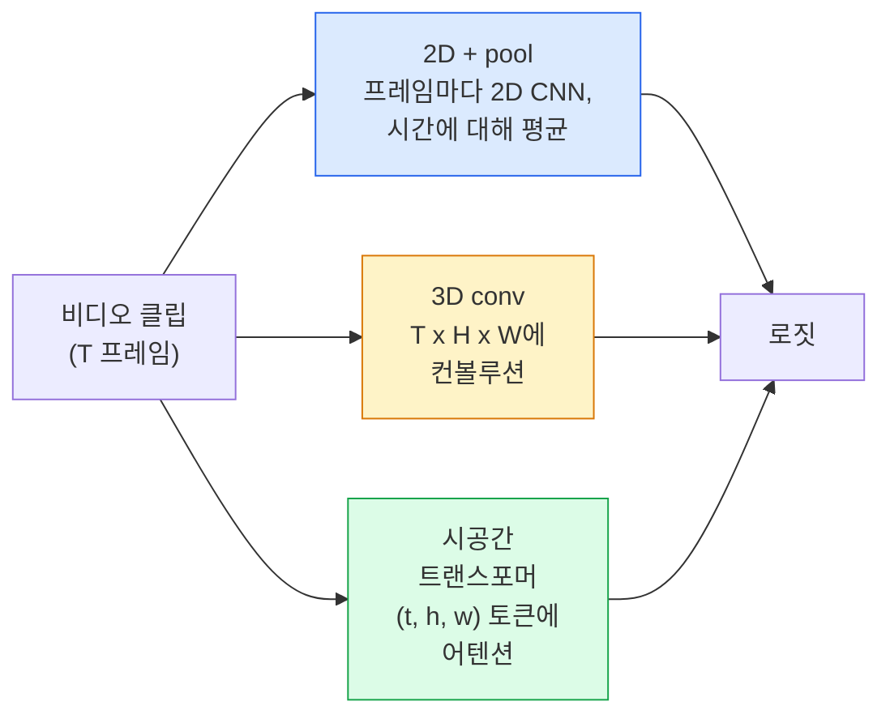

# 비디오 이해 — 시간 모델링 (Video Understanding — Temporal Modeling)

> 비디오는 이미지 시퀀스에 그것들을 연결하는 물리입니다. 모든 비디오 모델은 시간을 추가 축(3D conv)으로, attend할 시퀀스(트랜스포머)로, 또는 한 번 추출해 풀링할 특징(2D+pool)으로 취급합니다.

**Type:** Learn + Build
**Languages:** Python
**Prerequisites:** Phase 4 Lesson 03 (CNNs), Phase 4 Lesson 04 (Image Classification)
**Time:** ~45 minutes

## 학습 목표 (Learning Objectives)

- 세 가지 주요 비디오 모델링 접근(2D+pool, 3D conv, spatio-temporal transformer)을 구분하고 비용·정확도 트레이드오프를 예측합니다
- PyTorch로 프레임 샘플링, 시간 풀링, 2D+pool 베이스라인 분류기를 구현합니다
- I3D의 "팽창된" 3D 커널이 ImageNet 가중치에서 잘 전이되는 이유와, 분해된 (2+1)D conv가 다르게 하는 일을 설명합니다
- 표준 행동 인식 데이터셋과 지표를 읽습니다: Kinetics-400/600, UCF101, Something-Something V2; 클립·비디오 수준 top-1 정확도

## 문제 상황 (The Problem)

30 fps의 30초 비디오는 900장 이미지입니다. 단순하게 보면 비디오 분류는 이미지 분류를 900번 돌린 뒤 어떤 집계를 하는 것입니다. 거의 모든 프레임에 행동이 보이는 경우(스포츠, 요리, 운동 비디오)에는 동작하고, 행동 자체가 움직임으로 정의될 때는 크게 실패합니다: "무언가를 왼쪽에서 오른쪽으로 밀기"는 매 프레임에서 정지한 두 물체처럼 보입니다.

모든 비디오 아키텍처의 핵심 질문은: 시간 구조는 언제, 어떻게 모델링되는가? 답이 다른 모든 것을 결정합니다 — 연산 비용, 사전학습 전략, ImageNet 가중치 재사용 가능 여부, 모델이 학습하는 데이터셋.

이 레슨은 정적 이미지 레슨보다 의도적으로 짧습니다. 핵심 이미지 기계는 이미 갖춰져 있고, 비디오 이해는 대부분 시간 이야기입니다: 샘플링, 모델링, 집계.

## 핵심 개념 (The Concept)

### 세 아키텍처 패밀리 (The three architectural families)



### 2D + pool

2D CNN(ResNet, EfficientNet, ViT)을 가져옵니다. 샘플링된 모든 프레임에서 독립적으로 돌립니다. 프레임별 임베딩을 평균(또는 max-pool, 또는 attention-pool)합니다. 풀링된 벡터를 분류기에 넣습니다.

장점:
- ImageNet 사전학습이 직접 전이됩니다.
- 구현이 가장 단순합니다.
- 저렴합니다: T 프레임 * 단일 이미지 추론 비용.

단점:
- 움직임을 모델링할 수 없습니다. 행동 = 외양의 집계.
- 시간 풀링은 순서 불변입니다; "문 열기"와 "문 닫기"가 같아 보입니다.

언제 쓰나: 외양 중심 태스크, 작은 비디오 데이터셋의 전이 학습, 초기 베이스라인.

### 3D 컨볼루션 (3D convolutions)

2D (H, W) 커널을 3D (T, H, W) 커널로 바꿉니다. 네트워크가 공간과 시간 모두에 컨볼루션합니다. 초기 패밀리: C3D, I3D, SlowFast.

I3D 트릭: 사전학습된 2D ImageNet 모델을 가져와, 각 2D 커널을 새 시간 축을 따라 복사해 "팽창"합니다. 3x3 2D conv가 3x3x3 3D conv가 됩니다. 이렇게 3D 모델이 처음부터 학습하는 대신 강한 사전학습 가중치를 얻습니다.

장점:
- 움직임을 직접 모델링합니다.
- I3D 팽창이 공짜 전이 학습을 줍니다.

단점:
- 2D 대응물보다 FLOPs가 T/8배 많습니다(시간 커널 3을 세 번 쌓을 때).
- 시간 커널이 작아 장거리 움직임에는 피라미드나 듀얼 스트림이 필요합니다.

언제 쓰나: 움직임이 신호인 행동 인식(Something-Something V2, 움직임 중심 클래스의 Kinetics).

### 시공간 트랜스포머 (Spatio-temporal transformers)

비디오를 시공간 패치 격자로 토큰화하고 전체에 attend합니다. TimeSformer, ViViT, Video Swin, VideoMAE.

중요한 어텐션 패턴:
- **Joint** — (t, h, w)에 대한 하나의 큰 어텐션. `T*H*W`에 대해 이차; 비쌈.
- **Divided** — 블록당 어텐션 두 개: 시간에 하나, 공간에 하나. 거의 선형 스케일.
- **Factorised** — 블록에 걸쳐 시간 어텐션과 공간 어텐션이 교대.

장점:
- 모든 주요 벤치마크에서 SOTA 정확도.
- 패치 팽창을 통해 이미지 트랜스포머(ViT)에서 전이.
- 희소 어텐션으로 긴 컨텍스트 비디오 지원.

단점:
- 연산이 많이 듭니다.
- 어텐션 패턴을 신중히 고르지 않으면 런타임이 폭증합니다.

언제 쓰나: 큰 데이터셋, 고충실도 비디오 이해, 멀티모달 비디오+텍스트 태스크.

### 프레임 샘플링 (Frame sampling)

30 fps의 10초 클립은 300 프레임이며; 300 전부를 어떤 모델에든 넣는 것은 낭비입니다. 표준 전략:

- **Uniform sampling** — 클립에 걸쳐 T 프레임을 고르게 고릅니다. 2D+pool의 기본값.
- **Dense sampling** — 임의 연속 T-프레임 창. 움직임에 이웃 프레임이 필요하므로 3D conv에 흔함.
- **Multi-clip** — 같은 비디오에서 여러 T-프레임 창을 샘플링하고, 각각을 분류한 뒤 테스트 시 예측을 평균합니다.

T는 보통 8, 16, 32, 또는 64입니다. 더 높은 T = 더 많은 연산으로 더 많은 시간 신호.

### 평가 (Evaluation)

두 수준:
- **클립 수준 정확도** — 모델이 T-프레임 클립 하나를 보고 top-k를 보고.
- **비디오 수준 정확도** — 비디오당 여러 클립에 걸쳐 클립 수준 예측을 평균; 더 높고 더 안정적.

항상 둘 다 보고하세요. 클립 78% / 비디오 82%인 모델은 테스트 시 평균에 크게 의존하고; 80% / 81%인 모델은 클립당 더 견고합니다.

### 만나게 될 데이터셋 (Datasets you will meet)

- **Kinetics-400 / 600 / 700** — 범용 행동 데이터셋. 40만 클립; YouTube URL(지금은 많은 것이 죽음).
- **Something-Something V2** — 움직임으로 정의된 행동("X를 왼쪽에서 오른쪽으로 옮기기"). 2D+pool로 풀 수 없음.
- **UCF-101**, **HMDB-51** — 더 오래되고 작지만 여전히 보고됨.
- **AVA** — 공간·시간에서의 행동 *위치 추정*; 분류보다 어려움.

```figure
v4-video-temporal
```

## 직접 만들기 (Build It)

### 1단계: 프레임 샘플러 (Step 1: Frame sampler)

프레임 리스트(또는 비디오 텐서)에서 동작하는 균등·밀집 샘플러입니다.

```python
import numpy as np

def sample_uniform(num_frames_total, T):
    if num_frames_total <= T:
        return list(range(num_frames_total)) + [num_frames_total - 1] * (T - num_frames_total)
    step = num_frames_total / T
    return [int(i * step) for i in range(T)]


def sample_dense(num_frames_total, T, rng=None):
    rng = rng or np.random.default_rng()
    if num_frames_total <= T:
        return list(range(num_frames_total)) + [num_frames_total - 1] * (T - num_frames_total)
    start = int(rng.integers(0, num_frames_total - T + 1))
    return list(range(start, start + T))
```

둘 다 비디오 텐서를 슬라이스하는 데 쓰는 `T`개 인덱스를 반환합니다.

### 2단계: 2D+pool 베이스라인 (Step 2: A 2D+pool baseline)

모든 프레임에 2D ResNet-18을 돌리고, 특징을 average-pool한 뒤 분류합니다.

```python
import torch
import torch.nn as nn
from torchvision.models import resnet18, ResNet18_Weights

class FramePool(nn.Module):
    def __init__(self, num_classes=400, pretrained=True):
        super().__init__()
        weights = ResNet18_Weights.IMAGENET1K_V1 if pretrained else None
        backbone = resnet18(weights=weights)
        self.features = nn.Sequential(*(list(backbone.children())[:-1]))  # global avg pool kept
        self.head = nn.Linear(512, num_classes)

    def forward(self, x):
        # x: (N, T, 3, H, W)
        N, T = x.shape[:2]
        x = x.view(N * T, *x.shape[2:])
        feats = self.features(x).view(N, T, -1)
        pooled = feats.mean(dim=1)
        return self.head(pooled)

model = FramePool(num_classes=10)
x = torch.randn(2, 8, 3, 224, 224)
print(f"output: {model(x).shape}")
print(f"params: {sum(p.numel() for p in model.parameters()):,}")
```

천만 파라미터, ImageNet 사전학습, 프레임별 실행, 평균, 분류. 이 베이스라인은 외양 중심 태스크에서 제대로 된 3D 모델과 5–10포인트 차이인 경우가 많고 — 더 강한 ImageNet 백본을 재사용하기에 더 나은 경우도 있습니다.

### 3단계: I3D 스타일 팽창 3D conv (Step 3: An I3D-style inflated 3D conv)

단일 2D conv를 새 시간 축을 따라 가중치를 반복해 3D conv로 바꿉니다.

```python
def inflate_2d_to_3d(conv2d, time_kernel=3):
    out_c, in_c, kh, kw = conv2d.weight.shape
    weight_3d = conv2d.weight.data.unsqueeze(2)  # (out, in, 1, kh, kw)
    weight_3d = weight_3d.repeat(1, 1, time_kernel, 1, 1) / time_kernel
    conv3d = nn.Conv3d(in_c, out_c, kernel_size=(time_kernel, kh, kw),
                        padding=(time_kernel // 2, conv2d.padding[0], conv2d.padding[1]),
                        stride=(1, conv2d.stride[0], conv2d.stride[1]),
                        bias=False)
    conv3d.weight.data = weight_3d
    return conv3d

conv2d = nn.Conv2d(3, 64, kernel_size=3, padding=1, bias=False)
conv3d = inflate_2d_to_3d(conv2d, time_kernel=3)
print(f"2D weight shape:  {tuple(conv2d.weight.shape)}")
print(f"3D weight shape:  {tuple(conv3d.weight.shape)}")
x = torch.randn(1, 3, 8, 56, 56)
print(f"3D output shape:  {tuple(conv3d(x).shape)}")
```

`time_kernel`로 나누면 활성화 크기가 대략 일정하게 유지됩니다 — 첫 패스에서 배치 정규화 통계를 깨지 않는 데 중요합니다.

### 4단계: 분해된 (2+1)D conv (Step 4: Factorised (2+1)D conv)

3D conv를 2D(공간)와 1D(시간) conv로 나눕니다. 같은 수용 필드, 더 적은 파라미터, 일부 벤치마크에서 더 나은 정확도.

```python
class Conv2Plus1D(nn.Module):
    def __init__(self, in_c, out_c, kernel_size=3):
        super().__init__()
        mid_c = (in_c * out_c * kernel_size * kernel_size * kernel_size) \
                // (in_c * kernel_size * kernel_size + out_c * kernel_size)
        self.spatial = nn.Conv3d(in_c, mid_c, kernel_size=(1, kernel_size, kernel_size),
                                 padding=(0, kernel_size // 2, kernel_size // 2), bias=False)
        self.bn = nn.BatchNorm3d(mid_c)
        self.act = nn.ReLU(inplace=True)
        self.temporal = nn.Conv3d(mid_c, out_c, kernel_size=(kernel_size, 1, 1),
                                  padding=(kernel_size // 2, 0, 0), bias=False)

    def forward(self, x):
        return self.temporal(self.act(self.bn(self.spatial(x))))

c = Conv2Plus1D(3, 64)
x = torch.randn(1, 3, 8, 56, 56)
print(f"(2+1)D output: {tuple(c(x).shape)}")
```

전체 R(2+1)D 네트워크는 모든 3x3 conv를 `Conv2Plus1D`로 바꾼 ResNet-18과 같습니다.

## 활용하기 (Use It)

프로덕션 비디오 작업을 커버하는 두 라이브러리:

- `torchvision.models.video` — 사전학습 Kinetics 가중치가 있는 R(2+1)D, MViT, Swin3D. 이미지 모델과 같은 API.
- `pytorchvideo`(Meta) — 모델 동물원, Kinetics / SSv2 / AVA용 데이터 로더, 표준 변환.

Vision-Language 비디오 모델(비디오 캡셔닝, 비디오 QA)에는 `transformers`(`VideoMAE`, `VideoLLaMA`, `InternVideo`)를 쓰세요.

## 결과물 배포 (Ship It)

이 레슨이 만드는 것:

- `outputs/prompt-video-architecture-picker.md` — 외양 vs 움직임, 데이터셋 크기, 연산 예산에 따라 2D+pool / I3D / (2+1)D / 트랜스포머를 고르는 프롬프트.
- `outputs/skill-frame-sampler-auditor.md` — 비디오 파이프라인의 샘플러를 검사하고 흔한 버그를 플래그하는 스킬: off-by-one 인덱스, `num_frames < T`일 때 불균등 샘플링, 종횡비 보존 크롭 부재 등.

## 연습 문제 (Exercises)

1. **(Easy)** T=8인 FramePool과 T=8인 I3D 스타일 3D ResNet의 FLOPs(대략)를 계산하세요. 왜 2D+pool이 3–5배 저렴한지 정당화하세요.
2. **(Medium)** 합성 비디오 데이터셋을 만드세요: 임의 방향으로 움직이는 임의 공, 움직임 방향으로 라벨("left-to-right", "right-to-left", "diagonal-up"). 그 위에서 FramePool을 학습하세요. 거의 우연 정확도를 달성해, 외양만으로는 움직임 태스크에 불충분함을 보이세요.
3. **(Hard)** ResNet-18의 모든 Conv2d를 `Conv2Plus1D`로 바꿔 R(2+1)D-18을 만드세요. ImageNet 사전학습 ResNet-18에서 첫 conv의 가중치를 팽창하세요. 연습 2의 움직임 데이터셋에서 학습해 FramePool을 이기세요.

## 핵심 용어 (Key Terms)

| 용어 | 사람들이 말하는 것 | 실제 의미 |
|------|----------------|----------------------|
| 2D + pool | "프레임별 분류기" | 샘플링된 모든 프레임에 2D CNN을 돌리고, 시간에 걸쳐 특징을 average-pool한 뒤 분류 |
| 3D convolution | "시공간 커널" | (T, H, W)에 컨볼루션하는 커널; 움직임을 네이티브로 모델링 가능 |
| Inflation | "2D 가중치를 3D로 올림" | 2D conv 가중치를 새 시간 축을 따라 반복한 뒤 kernel_T로 나눠 활성화 스케일을 보존하며 3D conv를 초기화 |
| (2+1)D | "분해된 conv" | 3D를 2D 공간 + 1D 시간으로 분할; 더 적은 파라미터, 사이에 추가 비선형성 |
| Divided attention | "시간 다음 공간" | 같은 프레임의 토큰에 하나, 같은 위치의 토큰에 하나인 어텐션 두 개가 있는 트랜스포머 블록 |
| Clip | "T-프레임 창" | 샘플링된 T 프레임 부분 시퀀스; 비디오 모델이 소비하는 단위 |
| Clip vs video accuracy | "두 평가 설정" | 클립 = 비디오당 샘플 하나, 비디오 = 여러 샘플링된 클립에 걸친 평균 |
| Kinetics | "비디오의 ImageNet" | 400–700 행동 클래스, 30만+ YouTube 클립, 표준 비디오 사전학습 코퍼스 |

## 더 읽을거리 (Further Reading)

- [I3D: Quo Vadis, Action Recognition (Carreira & Zisserman, 2017)](https://arxiv.org/abs/1705.07750) — 팽창과 Kinetics 데이터셋 소개
- [R(2+1)D: A Closer Look at Spatiotemporal Convolutions (Tran et al., 2018)](https://arxiv.org/abs/1711.11248) — 분해된 conv, 여전히 강한 베이스라인
- [TimeSformer: Is Space-Time Attention All You Need? (Bertasius et al., 2021)](https://arxiv.org/abs/2102.05095) — 첫 강한 비디오 트랜스포머
- [VideoMAE (Tong et al., 2022)](https://arxiv.org/abs/2203.12602) — 비디오용 마스크드 오토인코더 사전학습; 현재 지배적 사전학습 레시피
