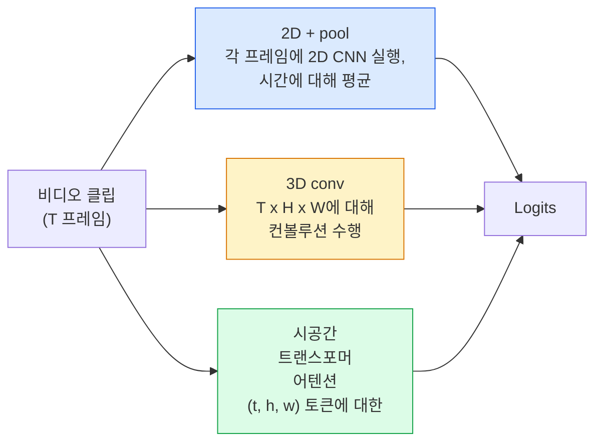

# 비전 이해 — 시간적 모델링

> 비디오는 이미지 시퀀스이며, 이를 연결하는 물리 법칙이 포함됩니다. 모든 비디오 모델은 시간을 추가 축으로 취급(3D conv), 어텐션 대상 시퀀스로 취급(transformer), 또는 한 번 추출하고 풀링하는 특징으로 취급(2D+pool)합니다.

**유형:** Learn + Build
**언어:** Python
**선수 요건:** 4단계 03강 (CNN), 4단계 04강 (이미지 분류)
**시간:** 약 45분

## 학습 목표

- 세 가지 주요 비디오 모델링 접근법(2D+pool, 3D conv, 시공간 transformer)을 구분하고, 비용 및 정확도 트레이드오프를 예측해 보세요
- PyTorch에서 프레임 샘플링, 시간적 풀링, 2D+pool 기반 분류기를 구현해 보세요
- I3D의 "inflated" 3D 커널이 ImageNet 가중치로부터 잘 전이되는 이유와, 분해된(factorised) (2+1)D conv가 어떻게 다른지 설명해 보세요
- 표준 동작 인식 데이터셋과 지표(Kinetics-400/600, UCF101, Something-Something V2; 클립 및 비디오 수준의 top-1 정확도)를 읽어 보세요

## 문제점

30초짜리 30fps 비디오는 900개의 이미지입니다. 단순하게 생각하면, 비디오 분류는 이미지 분류를 900번 실행한 후 어떤 종류의 집계(aggregation)를 수행하는 것입니다. 스포츠, 요리, 운동 비디오처럼 거의 모든 프레임에서 동작이 보이는 경우에는 잘 작동하지만, 동작 자체가 움직임으로 정의되는 경우(예: "무언가를 왼쪽에서 오른쪽으로 밀기")에는 심각하게 실패합니다. 모든 프레임에서 두 개의 정지된 객체처럼 보이기 때문입니다.

모든 비디오 아키텍처의 핵심 질문은 다음과 같습니다: 시간적 구조가 언제 모델링되며, 어떻게 모델링되는가? 이 답은 컴퓨팅 비용, 사전 학습 전략, ImageNet 가중치 재사용 가능 여부, 모델이 학습하는 데이터셋 등 모든 것을 결정합니다.

이 강의는 정적 이미지 강의보다 의도적으로 짧습니다. 핵심 이미지 처리 메커니즘은 이미 준비되어 있으며, 비디오 이해는 주로 시간적 스토리(샘플링, 모델링, 집계)에 관한 것입니다.

## 개념

### 세 가지 아키텍처 계열



### 2D + 풀링

2D CNN (ResNet, EfficientNet, ViT)을 선택하세요. 샘플링된 모든 프레임에 독립적으로 실행하세요. 프레임별 임베딩을 평균 내거나 (또는 max-pool, attention-pool) 풀링하세요. 풀링된 벡터를 분류기에 입력하세요.

장점:
- ImageNet 사전 학습이 직접 전이됩니다.
- 구현이 가장 간단합니다.
- 저비용: T 프레임 * 단일 이미지 추론 비용.

단점:
- 움직임을 모델링할 수 없습니다. 행동은 외형의 집합입니다.
- 시간 풀링은 순서에 무관합니다. "문을 열기"와 "문을 닫기"가 동일하게 보입니다.

사용 시점: 외형 중심 작업, 작은 비디오 데이터셋에서의 전이 학습, 초기 기준선.

### 3D 합성곱

2D (H, W) 커널을 3D (T, H, W) 커널로 교체하세요. 네트워크는 공간과 시간 모두에 대해 합성곱 연산을 수행합니다. 초기 계열: C3D, I3D, SlowFast.

I3D 트릭: 사전 학습된 2D ImageNet 모델을 가져와, 새로운 시간 축을 따라 각 2D 커널을 복사하여 "팽창(inflate)"하세요. 3x3 2D 합성곱은 3x3x3 3D 합성곱이 됩니다. 이를 통해 3D 모델은 처음부터 학습하는 대신 강력한 사전 학습 가중치를 얻습니다.

장점:
- 움직임을 직접 모델링합니다.
- I3D 팽창은 무료 전이 학습을 제공합니다.

단점:
- 3D 대응 모델보다 FLOPs가 T/8 더 많습니다 (시간 커널이 3개 스택된 경우).
- 시간 커널이 작습니다. 장거리 움직임은 피라미드 또는 이중 스트림 접근법이 필요합니다.

사용 시점: 움직임이 신호인 행동 인식 (Something-Something V2, 움직임이 많은 클래스가 포함된 Kinetics).

### 시공간 트랜스포머

비디오를 시공간 패치 그리드로 토큰화하고 모든 패치에 대해 어텐션을 수행하세요. TimeSformer, ViViT, Video Swin, VideoMAE.

중요한 어텐션 패턴:
- **Joint** — (t, h, w)에 대한 하나의 큰 어텐션. `T*H*W`에 대해 2차 함수이며, 비용이 높습니다.
- **Divided** — 블록당 두 개의 어텐션: 하나는 시간에 대해, 하나는 공간에 대해. 선형에 가까운 스케일링.
- **Factorised** — 블록 전체에 걸쳐 시간 어텐션과 공간 어텐션이 교대로 수행됩니다.

장점:
- 주요 벤치마크 전반에서 SOTA 정확도를 달성합니다.
- 패치 팽창(patch inflation)을 통해 이미지 트랜스포머(ViT)에서 전이 학습합니다.
- 희소 어텐션(sparse attention)을 통해 긴 컨텍스트 비디오를 지원합니다.

단점:
- 연산 자원을 많이 소모합니다.
- 어텐션 패턴을 신중하게 선택하지 않으면 런타임이 급증합니다.

사용 시점: 대규모 데이터셋, 고충실도 비디오 이해, 멀티모달 비디오+텍스트 작업.

### 프레임 샘플링

30 fps의 10초 클립은 300프레임입니다. 모든 300프레임을 모델에 입력하는 것은 비효율적입니다. 표준 전략은 다음과 같습니다:

- **균일 샘플링** — 클립 전체에서 T개의 프레임을 균등하게 선택합니다. 2D+풀(pool)의 기본 전략입니다.
- **밀집 샘플링** — 연속된 T프레임 윈도우를 무작위로 선택합니다. 운동(motion)이 인접 프레임을 필요로 하므로 3D 합성곱(conv)에서 흔히 사용됩니다.
- **멀티 클립** — 동일한 비디오에서 여러 T프레임 윈도우를 샘플링하고, 각각을 분류한 후 테스트 시점에 예측값을 평균냅니다.

T는 보통 8, 16, 32, 64입니다. T가 높을수록 더 많은 연산으로 더 많은 시간적 신호를 포착합니다.

### 평가

두 가지 수준이 있습니다:
- **클립 수준 정확도** — 모델이 하나의 T프레임 클립을 보고 top-k를 보고합니다.
- **비디오 수준 정확도** — 하나의 비디오에 대해 여러 클립의 클립 수준 예측값을 평균냅니다. 더 높고 안정적입니다.

항상 두 값을 모두 보고하세요. 클립 78% / 비디오 82% 점수를 받는 모델은 테스트 시점 평균화에 크게 의존하고 있으며, 클립 80% / 비디오 81% 점수를 받는 모델은 클립 단위에서 더 견고합니다.

### 만날 데이터셋

- **Kinetics-400 / 600 / 700** — 범용 동작(action) 데이터셋입니다. 40만 개의 클립이 있으며, YouTube URL을 포함합니다(현재 많은 URL이 죽어 있습니다).
- **Something-Something V2** — 운동(motion)으로 정의되는 동작("X를 왼쪽에서 오른쪽으로 이동")입니다. 2D+풀로는 해결할 수 없습니다.
- **UCF-101**, **HMDB-51** — 오래되고 작은 데이터셋이지만, 여전히 보고됩니다.
- **AVA** — 공간 및 시간에서의 동작 *위치 지정(localisation)*입니다. 분류보다 어렵습니다.

```figure
v4-video-temporal
```

## 구현하기

### 1단계: 프레임 샘플러

프레임 목록(또는 비디오 텐서)에서 작동하는 균일 및 밀집 샘플러를 구현해 보세요.

```python
import numpy as np

def sample_uniform(num_frames_total, T):
    if num_frames_total <= T:
        return list(range(num_frames_total)) + [num_frames_total - 1] * (T - num_frames_total)
    step = num_frames_total / T
    return [int(i * step) for i in range(T)]


def sample_dense(num_frames_total, T, rng=None):
    rng = rng or np.random.default_rng()
    if num_frames_total <= T:
        return list(range(num_frames_total)) + [num_frames_total - 1] * (T - num_frames_total)
    start = int(rng.integers(0, num_frames_total - T + 1))
    return list(range(start, start + T))
```

두 샘플러 모두 비디오 텐서를 슬라이싱하는 데 사용하는 `T` 인덱스를 반환합니다.

### 2단계: 2D+풀(baseline)

모든 프레임에 2D ResNet-18을 실행하고, 특징을 평균 풀링한 후 분류합니다.

```python
import torch
import torch.nn as nn
from torchvision.models import resnet18, ResNet18_Weights

class FramePool(nn.Module):
    def __init__(self, num_classes=400, pretrained=True):
        super().__init__()
        weights = ResNet18_Weights.IMAGENET1K_V1 if pretrained else None
        backbone = resnet18(weights=weights)
        self.features = nn.Sequential(*(list(backbone.children())[:-1]))  # 전역 평균 풀링 유지
        self.head = nn.Linear(512, num_classes)

    def forward(self, x):
        # x: (N, T, 3, H, W)
        N, T = x.shape[:2]
        x = x.view(N * T, *x.shape[2:])
        feats = self.features(x).view(N, T, -1)
        pooled = feats.mean(dim=1)
        return self.head(pooled)

model = FramePool(num_classes=10)
x = torch.randn(2, 8, 3, 224, 224)
print(f"output: {model(x).shape}")
print(f"params: {sum(p.numel() for p in model.parameters()):,}")
```

1100만 개의 매개변수를 가진 ImageNet 사전 학습 모델로, 프레임별로 실행하여 평균을 내고 분류합니다. 이 기준선은 외형 중심 작업에서 적절한 3D 모델과 5-10점 이내의 성능 차이를 보이는 경우가 많으며, 더 강력한 ImageNet 백본을 재사용하기 때문에 때로는 더 나은 성능을 보이기도 합니다.

### 3단계: I3D 스타일의 팽창된 3D 컨볼루션

새로운 시간 축을 따라 가중치를 반복하여 단일 2D 컨볼루션을 3D 컨볼루션으로 변환합니다.

```python
def inflate_2d_to_3d(conv2d, time_kernel=3):
    out_c, in_c, kh, kw = conv2d.weight.shape
    weight_3d = conv2d.weight.data.unsqueeze(2)  # (out, in, 1, kh, kw)
    weight_3d = weight_3d.repeat(1, 1, time_kernel, 1, 1) / time_kernel
    conv3d = nn.Conv3d(in_c, out_c, kernel_size=(time_kernel, kh, kw),
                        padding=(time_kernel // 2, conv2d.padding[0], conv2d.padding[1]),
                        stride=(1, conv2d.stride[0], conv2d.stride[1]),
                        bias=False)
    conv3d.weight.data = weight_3d
    return conv3d

conv2d = nn.Conv2d(3, 64, kernel_size=3, padding=1, bias=False)
conv3d = inflate_2d_to_3d(conv2d, time_kernel=3)
print(f"2D weight shape:  {tuple(conv2d.weight.shape)}")
print(f"3D weight shape:  {tuple(conv3d.weight.shape)}")
x = torch.randn(1, 3, 8, 56, 56)
print(f"3D output shape:  {tuple(conv3d(x).shape)}")
```

`time_kernel`으로 나누는 연산은 활성화 크기를 대략 일정하게 유지합니다. 이는 첫 번째 패스에서 배치 정규화 통계가 깨지지 않도록 하는 데 중요합니다.

### 4단계: 분해된 (2+1)D 컨볼루션

3D 컨볼루션을 2D (공간) 컨볼루션과 1D (시간) 컨볼루션으로 분리합니다. 동일한 수용 영역을 가지며 매개변수가 적고, 일부 벤치마크에서 더 높은 정확도를 제공합니다.

```python
class Conv2Plus1D(nn.Module):
    def __init__(self, in_c, out_c, kernel_size=3):
        super().__init__()
        mid_c = (in_c * out_c * kernel_size * kernel_size * kernel_size) \
                // (in_c * kernel_size * kernel_size + out_c * kernel_size)
        self.spatial = nn.Conv3d(in_c, mid_c, kernel_size=(1, kernel_size, kernel_size),
                                 padding=(0, kernel_size // 2, kernel_size // 2), bias=False)
        self.bn = nn.BatchNorm3d(mid_c)
        self.act = nn.ReLU(inplace=True)
        self.temporal = nn.Conv3d(mid_c, out_c, kernel_size=(kernel_size, 1, 1),
                                  padding=(kernel_size // 2, 0, 0), bias=False)

    def forward(self, x):
        return self.temporal(self.act(self.bn(self.spatial(x))))

c = Conv2Plus1D(3, 64)
x = torch.randn(1, 3, 8, 56, 56)
print(f"(2+1)D output: {tuple(c(x).shape)}")
```

전체 R(2+1)D 네트워크는 모든 3x3 컨볼루션을 `Conv2Plus1D`으로 대체한 ResNet-18강 동일합니다.

## 사용하기

프로덕션 비디오 작업은 두 개의 라이브러리가 커버합니다:

- `torchvision.models.video` — Kinetics 사전 학습 가중치를 가진 R(2+1)D, MViT, Swin3D. 이미지 모델과 동일한 API를 사용합니다.
- `pytorchvideo` (Meta) — 모델 주, Kinetics / SSv2 / AVA용 데이터 로더, 표준 변환.

비전-언어 비디오 모델(비디오 캡셔닝, 비디오 QA)을 사용하려면 `transformers` (`VideoMAE`, `VideoLLaMA`, `InternVideo`)을 사용하세요.

## 출시하기

이 강의는 다음을 생성합니다:

- `outputs/prompt-video-architecture-picker.md` — 외형 대 움직임, 데이터셋 크기, 컴퓨팅 예산에 따라 2D+풀링 / I3D / (2+1)D / 트랜스포머를 선택하는 프롬프트.
- `outputs/skill-frame-sampler-auditor.md` — 비디오 파이프라인의 샘플러를 검사하고 일반적인 버그를 플래그하는 스킬: 오프 바이 원 인덱스, `num_frames < T` 시 불균등한 샘플링, 종횡비 보존 크롭 누락 등.

## 연습 문제

1. **(쉬움)** T=8인 FramePool과 T=8인 I3D 스타일 3D ResNet의 FLOPs를 (대략적으로) 계산하세요. 2D+풀링이 3-5배 더 저렴한 이유를 설명하세요.
2. **(중간)** 합성 비디오 데이터셋을 생성해 보세요: 랜덤한 공이 랜덤한 방향으로 움직이고, 운동 방향("왼쪽에서 오른쪽", "오른쪽에서 왼쪽", "대각선 위")으로 라벨링합니다. FramePool을 이 데이터셋으로 학습하세요. FramePool이 거의 무작위 수준의 정확도를 달성함을 보여주세요. 이는 외관만으로는 운동(motion) 작업에 충분하지 않음을 증명합니다.
3. **(어려움)** ResNet-18의 모든 Conv2d를 `Conv2Plus1D`로 교체하여 R(2+1)D-18을 구축하세요. ImageNet 사전 학습된 ResNet-18의 가중치로 첫 번째 conv의 가중치를 팽창(inflate)하세요. 연습 문제 2의 운동(motion) 데이터셋으로 학습하여 FramePool을 능가하세요.

## 핵심 용어

| 용어 | 사람들이 말하는 것 | 실제 의미 |
|------|----------------|----------------------|
| 2D + 풀(pool) | "프레임별 분류기" | 모든 샘플링된 프레임에 2D CNN을 실행하고, 시간 축에 걸쳐 특징을 평균 풀링한 후 분류 |
| 3D 컨볼루션 | "시공간 커널" | (T, H, W)에 걸쳐 컨볼루션하는 커널; 운동(motion)을 본질적으로 모델링할 수 있음 |
| 팽창(Inflation) | "2D 가중치를 3D로 리프트" | 새로운 시간 축을 따라 2D conv의 가중치를 반복하여 3D conv 가중치를 초기화한 후, kernel_T로 나누어 활성화(scale)를 보존 |
| (2+1)D | "분해된 conv" | 3D를 2D 공간 + 1D 시간으로 분할; 매개변수 감소, 사이에 추가 비선형성 |
| 분할 어텐션(Divided attention) | "시간 후 공간" | 두 개의 어텐션을 가진 트랜스포머 블록: 같은 프레임의 토큰에 대한 어텐션, 같은 위치의 토큰에 대한 어텐션 |
| 클립(Clip) | "T-프레임 윈도우" | T개의 프레임을 샘플링한 하위 시퀀스; 비디오 모델이 소비하는 단위 |
| 클립 vs 비디오 정확도 | "두 가지 평가 설정" | 클립 = 비디오당 하나의 샘플, 비디오 = 여러 샘플링된 클립의 평균 |
| Kinetics | "비디오의 ImageNet" | 400-700개의 액션 클래스, 30만 개 이상의 YouTube 클립, 표준 비디오 사전 학습 코퍼스 |

## 추가 읽기

- [I3D: Quo Vadis, Action Recognition (Carreira & Zisserman, 2017)](https://arxiv.org/abs/1705.07750) — 팽창(inflation)과 Kinetics 데이터셋을 소개
- [R(2+1)D: A Closer Look at Spatiotemporal Convolutions (Tran et al., 2018)](https://arxiv.org/abs/1711.11248) — 분해된 conv, 여전히 강력한 기준선(baseline)
- [TimeSformer: Is Space-Time Attention All You Need? (Bertasius et al., 2021)](https://arxiv.org/abs/2102.05095) — 최초의 강력한 비디오 트랜스포머
- [VideoMAE (Tong et al., 2022)](https://arxiv.org/abs/2203.12602) — 비디오를 위한 마스킹 오토인코더 사전 학습; 현재 지배적인 사전 학습 레시피
