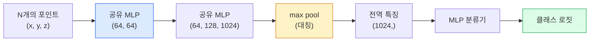

# 3D 비전 — 포인트 클라우드 & NeRF

> 3D 비전에는 두 가지 유형이 있습니다. 포인트 클라우드는 센서의 원시 출력입니다. NeRF는 학습된 볼륨 필드입니다. 둘 다 "공간에서 무엇이 어디에 있는가"에 대한 답을 제공합니다.

**유형:** 학습 + 빌드
**언어:** Python
**선수 요건:** 4단계 03강 (CNN), 1단계 12강 (텐서 연산)
**시간:** 약 45분

## 학습 목표

- 명시적 표현(포인트 클라우드, 메시, 복셀)과 암시적 표현(부호 거리 필드, NeRF)의 3D 표현을 구분하고, 각각이 언제 사용되는지 이해해 보세요
- PointNet의 대칭 함수 트릭이 순서가 없는 점 집합에 대해 신경망을 순열 불변(permutation-invariant)하게 만드는 방식을 이해해 보세요
- NeRF의 순방향 전파를 추적해 보세요: 광선 투사, 볼륨 렌더링, 위치 인코딩, MLP 밀도+색상 헤드
- `nerfstudio` 또는 `instant-ngp`를 사용하여 소량의 포즈가 지정된 이미지로부터 사전 학습된 3D 복원을 수행해 보세요

## 문제점

카메라는 2D 이미지를 생성합니다. LIDAR는 순서가 없는 3D 점 집합을 생성합니다. 구조-from-motion 파이프라인은 3D 키포인트의 희소 클라우드를 생성합니다. NeRF는 몇 장의 포즈가 지정된 이미지로부터 전체 3D 장면을 복원합니다. 이 모든 것은 "비전"이지만, CNN이 원하는 밀집 텐서처럼 보이지는 않습니다.

3D 비전이 중요한 이유는 거의 모든 고가치 로봇 작업이 3D 공간에서 수행되기 때문입니다: 그리핑, 장애물 회피, 내비게이션, AR 가림 처리, 3D 콘텐츠 캡처. 2D 이미지만 이해하는 비전 엔지니어는 가장 빠르게 성장하는 분야(AR/VR 콘텐츠, 로봇공학, 자율 주행 스택, 부동산이나 건설을 위한 NeRF 기반 3D 복원)에서 배제됩니다.

두 표현 방식은 서로 다른 이유로 지배적입니다. 포인트 클라우드는 센서가 무료로 제공하는 것입니다. NeRF와 그 후속 기술(3D 가우시안 스플래팅, 신경 SDF)은 신경망에 장면을 학습하도록 요청했을 때 얻는 결과입니다.

## 개념

### 포인트 클라우드

포인트 클라우드는 R^3에 있는 N개의 순서가 없는 점 집합이며, 선택적으로 각 점에 특징(색상, 강도, 법선)이 포함될 수 있습니다.

```
cloud = [
  (x1, y1, z1, r1, g1, b1),
  (x2, y2, z2, r2, g2, b2),
  ...
  (xN, yN, zN, rN, gN, bN),
]
```

그리드도 연결성도 없습니다. 두 가지 특성이 신경망에 이 문제를 어렵게 만듭니다:

- **순열 불변성** — 출력은 포인트 순서에 의존하지 않아야 합니다.
- **가변 N** — 하나의 모델이 서로 다른 크기의 포인트 클라우드를 처리해야 합니다.

PointNet (Qi et al., 2017)은 하나의 아이디어로 두 문제를 해결했습니다: 모든 포인트에 공유 MLP를 적용한 후, 대칭 함수(max pool)로 집계하는 것입니다. 그 결과, 순서에 의존하지 않는 고정 크기의 벡터가 생성됩니다.

```
f(P) = max_{p in P} MLP(p)
```

이것이 PointNet의 핵심입니다. 더 깊은 변형들(PointNet++, Point Transformer)은 계층적 샘플링과 지역적 집계를 추가하지만, 대칭 함수 트릭은 변하지 않습니다.

### PointNet 아키텍처



"공유 MLP"는 동일한 MLP가 모든 포인트에 독립적으로 실행됨을 의미합니다. 효율성을 위해 포인트 차원에서의 1x1 conv로 구현됩니다.

### 신경 방사선 필드(Neural Radiance Fields, NeRFs)

NeRFs (Mildenhall et al., 2020)는 "N개의 사진으로 3D 장면을 재구성할 수 있는가?"라는 질문에 대해, 그 자체가 장면인 신경망으로 답변했습니다. 이 네트워크는 `(x, y, z, viewing_direction)`를 `(density, colour)`로 매핑합니다. 새로운 뷰를 렌더링하는 것은 이 네트워크에 대한 레이 캐스팅 루프입니다.

```
NeRF MLP:  (x, y, z, theta, phi) -> (sigma, r, g, b)

To render a pixel (u, v) of a new view:
  1. Cast a ray from the camera through pixel (u, v)
  2. Sample points along the ray at distances t_1, t_2, ..., t_N
  3. Query the MLP at each point
  4. Composite the colours weighted by (1 - exp(-sigma * dt))
  5. The sum is the rendered pixel colour
```

손실 함수는 렌더링된 픽셀을 학습 사진의 실제 픽셀과 비교합니다. 렌더링 단계를 거친 역전파가 MLP를 업데이트합니다. 3D 실제 데이터도, 명시적인 기하학도 필요 없습니다. 장면은 MLP 가중치에 저장됩니다.

### NeRF에서의 위치 인코딩

`(x, y, z)`에 대한 단순 MLP는 MLP가 스펙트럼적으로 저주파수에 편향되어 있어 고주파 세부 사항을 표현할 수 없습니다. NeRF는 MLP 전에 각 좌표를 푸리에 특징 벡터로 인코딩하여 이를 해결합니다:

```
gamma(p) = (sin(2^0 pi p), cos(2^0 pi p), sin(2^1 pi p), cos(2^1 pi p), ...)
```

L=10까지의 주파수 레벨을 사용합니다. 이는 트랜스포머가 위치 인코딩에 사용하는 것과 동일한 기법이며, 확산 모델의 시간 조건부 처리에서도 다시 등장합니다(10강). 이 기법이 없으면 NeRF는 흐릿해 보입니다.

### 볼륨 렌더링

```
C(r) = sum_i T_i * (1 - exp(-sigma_i * delta_i)) * c_i

T_i  = exp(- sum_{j<i} sigma_j * delta_j)
delta_i = t_{i+1} - t_i
```

`T_i`는 투과율(transmittance)로, 포인트 i까지 빛이 얼마나 살아남는지를 나타냅니다. `(1 - exp(-sigma_i * delta_i))`는 포인트 i에서의 불투명도(opacity)입니다. `c_i`는 색상입니다. 최종 픽셀은 레이를 따라 가중 합산된 값입니다.

### NeRF를 대체한 것

순수 NeRF는 학습이 느리고(수 시간) 렌더링도 느립니다(이미지당 수 초). 이후의 계보:

- **Instant-NGP** (2022) — 해시 그리드 인코딩이 MLP의 위치 입력을 대체하며, 몇 초 만에 학습됩니다.
- **Mip-NeRF 360** — 무한한(unbounded) 장면과 안티 앨리어싱을 처리합니다.
- **3D Gaussian Splatting** (2023) — 볼륨 필드를 수백만 개의 3D 가우시안으로 대체하며, 몇 분 만에 학습되고 실시간으로 렌더링됩니다. 현재 생산 환경의 기본값입니다.

2026년 현재 거의 모든 실제 NeRF 제품은 실제로는 3D Gaussian Splatting입니다. 개념적 모델은 여전히 NeRF입니다.

### 데이터셋 및 벤치마크

- **ShapeNet** — 3D CAD 모델을 점 클라우드(point cloud)로 분류 및 분할(segmentation)합니다.
- **ScanNet** — 분할(segmentation)을 위한 실제 실내 스캔 데이터입니다.
- **KITTI** — 자율 주행을 위한 야외 LIDAR 점 클라우드(point cloud)입니다.
- **NeRF Synthetic** / **Blended MVS** — 뷰 합성(view synthesis)을 위한 포즈가 지정된 이미지 데이터셋입니다.
- **Mip-NeRF 360** 데이터셋 — 무한한(unbounded) 실제 장면입니다.

```figure
nerf-rays
```

## 구현하기

### 1단계: PointNet 분류기

```python
import torch
import torch.nn as nn

class PointNet(nn.Module):
    def __init__(self, num_classes=10):
        super().__init__()
        self.mlp1 = nn.Sequential(
            nn.Conv1d(3, 64, 1),    nn.BatchNorm1d(64),   nn.ReLU(inplace=True),
            nn.Conv1d(64, 64, 1),   nn.BatchNorm1d(64),   nn.ReLU(inplace=True),
        )
        self.mlp2 = nn.Sequential(
            nn.Conv1d(64, 128, 1),  nn.BatchNorm1d(128),  nn.ReLU(inplace=True),
            nn.Conv1d(128, 1024, 1), nn.BatchNorm1d(1024), nn.ReLU(inplace=True),
        )
        self.head = nn.Sequential(
            nn.Linear(1024, 512),   nn.BatchNorm1d(512),  nn.ReLU(inplace=True),
            nn.Dropout(0.3),
            nn.Linear(512, 256),    nn.BatchNorm1d(256),  nn.ReLU(inplace=True),
            nn.Dropout(0.3),
            nn.Linear(256, num_classes),
        )

    def forward(self, x):
        # x: (N, 3, num_points) — Conv1d를 위해 전치(transpose)됨
        x = self.mlp1(x)
        x = self.mlp2(x)
        x = torch.max(x, dim=-1)[0]       # (N, 1024)
        return self.head(x)

pts = torch.randn(4, 3, 1024)
net = PointNet(num_classes=10)
print(f"output: {net(pts).shape}")
print(f"params: {sum(p.numel() for p in net.parameters()):,}")
```

약 160만 개의 매개변수(Parameter)가 있으며, 클라우드당 1,024개의 점을 처리합니다.

### 2단계: 위치 인코딩

```python
def positional_encoding(x, L=10):
    """
    x: (..., D) -> (..., D * 2 * L)
    """
    freqs = 2.0 ** torch.arange(L, dtype=x.dtype, device=x.device)
    args = x.unsqueeze(-1) * freqs * 3.141592653589793
    sinc = torch.cat([args.sin(), args.cos()], dim=-1)
    return sinc.reshape(*x.shape[:-1], -1)

x = torch.randn(5, 3)
y = positional_encoding(x, L=10)
print(f"input:  {x.shape}")
print(f"encoded: {y.shape}     # (5, 60)")
```

`2^l * pi`를 곱하면 점진적으로 더 높은 주파수가 생성됩니다.

### 3단계: 작은 NeRF MLP

```python
class TinyNeRF(nn.Module):
    def __init__(self, L_pos=10, L_dir=4, hidden=128):
        super().__init__()
        self.L_pos = L_pos
        self.L_dir = L_dir
        pos_dim = 3 * 2 * L_pos
        dir_dim = 3 * 2 * L_dir
        self.trunk = nn.Sequential(
            nn.Linear(pos_dim, hidden), nn.ReLU(inplace=True),
            nn.Linear(hidden, hidden),  nn.ReLU(inplace=True),
            nn.Linear(hidden, hidden),  nn.ReLU(inplace=True),
            nn.Linear(hidden, hidden),  nn.ReLU(inplace=True),
        )
        self.sigma = nn.Linear(hidden, 1)
        self.color = nn.Sequential(
            nn.Linear(hidden + dir_dim, hidden // 2), nn.ReLU(inplace=True),
            nn.Linear(hidden // 2, 3), nn.Sigmoid(),
        )

    def forward(self, x, d):
        x_enc = positional_encoding(x, self.L_pos)
        d_enc = positional_encoding(d, self.L_dir)
        h = self.trunk(x_enc)
        sigma = torch.relu(self.sigma(h)).squeeze(-1)
        rgb = self.color(torch.cat([h, d_enc], dim=-1))
        return sigma, rgb

nerf = TinyNeRF()
x = torch.randn(128, 3)
d = torch.randn(128, 3)
s, c = nerf(x, d)
print(f"sigma: {s.shape}   rgb: {c.shape}")
```

원래 NeRF(깊이 8인 MLP 트렁크 2개)와 비교하면 매우 작습니다. 아키텍처를 시연하기에 충분합니다.

### 4단계: 광선을 따른 볼륨 렌더링

```python
def volumetric_render(sigma, rgb, t_vals):
    """
    sigma: (..., N_samples)
    rgb:   (..., N_samples, 3)
    t_vals: (N_samples,) distances along the ray
    """
    delta = torch.cat([t_vals[1:] - t_vals[:-1], torch.full_like(t_vals[:1], 1e10)])
    alpha = 1.0 - torch.exp(-sigma * delta)
    trans = torch.cumprod(torch.cat([torch.ones_like(alpha[..., :1]), 1.0 - alpha + 1e-10], dim=-1), dim=-1)[..., :-1]
    weights = alpha * trans
    rendered = (weights.unsqueeze(-1) * rgb).sum(dim=-2)
    depth = (weights * t_vals).sum(dim=-1)
    return rendered, depth, weights


N = 64
t_vals = torch.linspace(2.0, 6.0, N)
sigma = torch.rand(N) * 0.5
rgb = torch.rand(N, 3)
rendered, depth, weights = volumetric_render(sigma, rgb, t_vals)
print(f"rendered colour: {rendered.tolist()}")
print(f"depth:           {depth.item():.2f}")
```

광선 하나, 샘플 64개, 단일 RGB 픽셀과 깊이(depth)로 합성합니다.

## 사용하기

실제 작업을 위해:

- `nerfstudio` (Tancik et al.) — NeRF / Instant-NGP / Gaussian Splatting의 현재 참조 라이브러리입니다. 명령줄 및 웹 뷰어 포함.
- `pytorch3d` (Meta) — 미분 가능한 렌더링, 점 클라우드 유틸리티, 메시 연산입니다.
- `open3d` — 점 클라우드 처리, 등록(registration), 시각화입니다.

배포 측면에서는 3D 가우시안 스플래팅이 순수 NeRF를 대부분 대체했습니다. 렌더링 속도가 100배 더 빠르기 때문입니다. 재구성 품질은 동등합니다.

## 출시하기

이 강의는 다음을 생성합니다:

- `outputs/prompt-3d-task-router.md` — 작업과 입력 데이터에 따라 올바른 3D 표현(점 클라우드, 메시, 복셀, NeRF, 가우시안 스플래팅)으로 라우팅하는 프롬프트입니다.
- `outputs/skill-point-cloud-loader.md` — .ply / .pcd / .xyz 파일에 대해 올바른 정규화, 중심 정렬 및 점 샘플링을 수행하는 PyTorch `Dataset`을 작성하는 스킬입니다.

## 연습 문제

1. **(쉬움)** PointNet이 순열 불변(permutation-invariant)임을 보여 보세요. 동일한 점 클라우드를 두 번 실행하되, 한 번은 점을 섞어서 실행합니다. 출력 결과가 부동 소수점 잡음을 제외하고 동일함을 확인하세요.
2. **(중간)** 카메라 내부 파라미터(intrinsics)와 자세(pose)가 주어졌을 때, H x W 이미지의 모든 픽셀에 대해 광선(ray)의 시작점과 방향을 생성하는 최소한의 광선 생성 함수를 구현하세요.
3. **(어려움)** 색이 칠해진 큐브의 렌더링된 뷰로 구성된 합성 데이터셋에 TinyNeRF를 학습하세요. 에포크 1, 10, 100에서의 렌더링 손실을 보고하세요. 모델이 인식 가능한 뷰를 생성하기 시작하는 에포크는 몇 번째인가요?

## 핵심 용어

| 용어 | 사람들이 말하는 표현 | 실제 의미 |
|------|----------------|----------------------|
| 점 클라우드 | "LIDAR의 3D 점" | (x, y, z)의 순서가 없는 집합 + 점별 선택적 특징 |
| PointNet | "점 클라우드에 대한 최초의 신경망" | 점별 공유 MLP + 대칭적(max) 풀; 구조적으로 순열 불변 |
| NeRF | "장면 그 자체인 MLP" | (x, y, z, dir)를 (밀도, 색상)로 매핑하는 네트워크; 광선 투사(ray casting)로 렌더링 |
| 위치 인코딩 | "푸리에 특징" | 각 좌표를 여러 주파수의 sin/cos로 인코딩하여 MLP의 저주파 편향을 극복 |
| 볼륨 렌더링 | "광선 적분" | 광선을 따라 샘플을 전이율(transmittance)과 알파(alpha)를 사용하여 단일 픽셀로 합성 |
| Instant-NGP | "해시 그리드 NeRF" | NeRF의 좌표 MLP를 다중 해상도 해시 그리드로 대체; 100-1000배 더 빠름 |
| 3D 가우시안 스플래팅 | "수백만 개의 가우시안" | 장면 = 3D 가우시안의 집합; 실시간 렌더링, 몇 분 만에 학습 |
| SDF | "Signed distance field" | 가장 가까운 표면까지의 부호 있는 거리를 반환하는 함수; 또 다른 암시적 표현 |

## 추가 읽기

- [PointNet (Qi et al., 2017)](https://arxiv.org/abs/1612.00593) — 순열 불변 분류기
- [NeRF (Mildenhall et al., 2020)](https://arxiv.org/abs/2003.08934) — 사진에서 3D 재구성 문제를 신경망 문제로 만든 논문
- [Instant-NGP (Müller et al., 2022)](https://arxiv.org/abs/2201.05989) — 해시 그리드, 1000배 속도 향상
- [3D Gaussian Splatting (Kerbl et al., 2023)](https://arxiv.org/abs/2308.04079) — 프로덕션 환경에서 NeRF를 대체한 아키텍처
