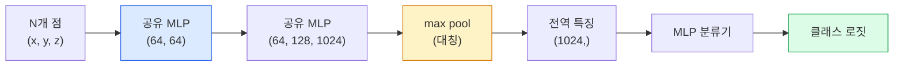

# 3D 비전 — 포인트 클라우드와 NeRF (3D Vision — Point Clouds & NeRFs)

> 3D 비전은 두 가지 맛이 있습니다. 포인트 클라우드는 센서의 원시 출력입니다. NeRF는 학습된 체적 필드입니다. 둘 다 "공간에서 무엇이 어디에 있는가"에 답합니다.

**Type:** Learn + Build
**Languages:** Python
**Prerequisites:** Phase 4 Lesson 03 (CNNs), Phase 1 Lesson 12 (Tensor Operations)
**Time:** ~45 minutes

## 학습 목표 (Learning Objectives)

- 명시적(포인트 클라우드, 메시, 복셀)과 암시적(부호 거리 필드, NeRF) 3D 표현을 구분하고 각각이 쓰이는 시점을 말합니다
- 순서가 없는 점 집합에 대해 신경망을 순열 불변으로 만드는 PointNet의 대칭 함수 트릭을 이해합니다
- NeRF 순방향 패스를 추적합니다: 레이 캐스팅, 체적 렌더링, 위치 인코딩, MLP density+colour 헤드
- 소수의 포즈 이미지에서 사전학습 3D 재구성에 `nerfstudio` 또는 `instant-ngp`를 사용합니다

## 문제 상황 (The Problem)

카메라는 2D 이미지를 만듭니다. LIDAR는 순서가 없는 3D 점 집합을 만듭니다. Structure-from-motion 파이프라인은 희소 3D 키포인트 클라우드를 만듭니다. NeRF는 소수의 포즈 이미지에서 전체 3D 장면을 재구성합니다. 모두 "비전"이지만, CNN이 원하는 밀집 텐서처럼 보이는 것은 없습니다.

3D 비전이 중요한 이유는 거의 모든 고가치 로봇 태스크가 3D에서 돌아가기 때문입니다: 파지, 장애물 회피, 내비게이션, AR 오클루전, 3D 콘텐츠 캡처. 2D 이미지만 이해하는 비전 엔지니어는 가장 빠르게 성장하는 분야 조각(AR/VR 콘텐츠, 로보틱스, 자율주행 스택, 부동산·건설용 NeRF 기반 3D 재구성)에서 배제됩니다.

두 표현이 지배하는 이유는 다릅니다. 포인트 클라우드는 센서가 공짜로 주는 것입니다. NeRF와 그 후속(3D Gaussian splatting, neural SDF)은 신경망에게 장면을 배우라고 요청할 때 얻는 것입니다.

## 핵심 개념 (The Concept)

### 포인트 클라우드 (Point clouds)

포인트 클라우드는 R^3의 순서 없는 N개 점 집합이며, 선택적으로 각 점에 특징(색, 강도, 법선)이 있습니다.

```
cloud = [
  (x1, y1, z1, r1, g1, b1),
  (x2, y2, z2, r2, g2, b2),
  ...
  (xN, yN, zN, rN, gN, bN),
]
```

격자도, 연결성도 없습니다. 두 성질이 신경망에 어렵게 만듭니다:

- **순열 불변성(Permutation invariance)** — 출력이 점 순서에 의존하면 안 됩니다.
- **가변 N** — 단일 모델이 크기가 다른 클라우드를 다뤄야 합니다.

PointNet(Qi et al., 2017)은 한 아이디어로 둘을 풀었습니다: 모든 점에 공유 MLP를 적용한 뒤, 대칭 함수(max pool)로 집계합니다. 결과는 순서에 의존하지 않는 고정 크기 벡터입니다.

```
f(P) = max_{p in P} MLP(p)
```

이것이 PointNet의 전체 핵심입니다. 더 깊은 변형(PointNet++, Point Transformer)은 계층적 샘플링과 지역 집계를 더하지만 대칭 함수 트릭은 변하지 않습니다.

### PointNet 아키텍처 (The PointNet architecture)



"공유 MLP"는 같은 MLP가 모든 점에서 독립적으로 돈다는 뜻입니다. 효율을 위해 점 차원에 대한 1x1 conv로 구현합니다.

### Neural Radiance Fields (NeRFs)

NeRF(Mildenhall et al., 2020)는 "N장의 사진에서 3D 장면을 재구성할 수 있는가?"에 장면인 신경망으로 답했습니다. 네트워크는 `(x, y, z, viewing_direction)`을 `(density, colour)`로 매핑합니다. 새 뷰를 렌더링하는 것은 이 네트워크에 대한 레이 캐스팅 루프입니다.

```
NeRF MLP:  (x, y, z, theta, phi) -> (sigma, r, g, b)

To render a pixel (u, v) of a new view:
  1. Cast a ray from the camera through pixel (u, v)
  2. Sample points along the ray at distances t_1, t_2, ..., t_N
  3. Query the MLP at each point
  4. Composite the colours weighted by (1 - exp(-sigma * dt))
  5. The sum is the rendered pixel colour
```

손실은 렌더링된 픽셀을 학습 사진의 정답 픽셀과 비교합니다. 렌더링 스텝을 통한 역전파가 MLP를 갱신합니다. 3D 정답도, 명시적 기하도 없습니다 — 장면은 MLP 가중치에 저장됩니다.

### NeRF의 위치 인코딩 (Positional encoding in NeRF)

`(x, y, z)`에 대한 평범한 MLP는 고주파 디테일을 표현할 수 없습니다. MLP가 저주파 쪽으로 스펙트럼 편향되어 있기 때문입니다. NeRF는 MLP 전에 각 좌표를 푸리에 특징 벡터로 인코딩해 이를 고칩니다:

```
gamma(p) = (sin(2^0 pi p), cos(2^0 pi p), sin(2^1 pi p), cos(2^1 pi p), ...)
```

최대 L=10 주파수 레벨. 트랜스포머가 위치에 쓰는 것과 같은 트릭이며, 확산 시간 조건화(Lesson 10)에서도 다시 나타납니다. 없으면 NeRF가 흐릿해 보입니다.

### 체적 렌더링 (Volumetric rendering)

```
C(r) = sum_i T_i * (1 - exp(-sigma_i * delta_i)) * c_i

T_i  = exp(- sum_{j<i} sigma_j * delta_j)
delta_i = t_{i+1} - t_i
```

`T_i`는 투과율 — 점 i까지 빛이 얼마나 살아남는지입니다. `(1 - exp(-sigma_i * delta_i))`는 점 i의 불투명도입니다. `c_i`는 색입니다. 최종 픽셀은 레이를 따른 가중 합입니다.

### NeRF를 대체한 것 (What replaced NeRFs)

순수 NeRF는 학습이 느리고(수 시간) 렌더링이 느립니다(이미지당 수 초). 이후 계보:

- **Instant-NGP** (2022) — 해시 그리드 인코딩이 MLP의 위치 입력을 대체; 수 초 만에 학습.
- **Mip-NeRF 360** — 비유계 장면과 안티앨리어싱을 처리.
- **3D Gaussian Splatting** (2023) — 체적 필드를 수백만 3D 가우시안으로 대체; 수 분 학습, 실시간 렌더링. 현재 프로덕션 기본값.

2026년의 거의 모든 실제 NeRF 제품은 사실 3D Gaussian splatting입니다. 멘탈 모델은 여전히 NeRF입니다.

### 데이터셋과 벤치마크 (Datasets and benchmarks)

- **ShapeNet** — 포인트 클라우드로서의 3D CAD 모델 분류·세그멘테이션.
- **ScanNet** — 세그멘테이션용 실제 실내 스캔.
- **KITTI** — 자율주행용 실외 LIDAR 포인트 클라우드.
- **NeRF Synthetic** / **Blended MVS** — 뷰 합성을 위한 포즈 이미지 데이터셋.
- **Mip-NeRF 360** 데이터셋 — 비유계 실제 장면.

```figure
nerf-rays
```

## 직접 만들기 (Build It)

### 1단계: PointNet 분류기 (Step 1: PointNet classifier)

```python
import torch
import torch.nn as nn

class PointNet(nn.Module):
    def __init__(self, num_classes=10):
        super().__init__()
        self.mlp1 = nn.Sequential(
            nn.Conv1d(3, 64, 1),    nn.BatchNorm1d(64),   nn.ReLU(inplace=True),
            nn.Conv1d(64, 64, 1),   nn.BatchNorm1d(64),   nn.ReLU(inplace=True),
        )
        self.mlp2 = nn.Sequential(
            nn.Conv1d(64, 128, 1),  nn.BatchNorm1d(128),  nn.ReLU(inplace=True),
            nn.Conv1d(128, 1024, 1), nn.BatchNorm1d(1024), nn.ReLU(inplace=True),
        )
        self.head = nn.Sequential(
            nn.Linear(1024, 512),   nn.BatchNorm1d(512),  nn.ReLU(inplace=True),
            nn.Dropout(0.3),
            nn.Linear(512, 256),    nn.BatchNorm1d(256),  nn.ReLU(inplace=True),
            nn.Dropout(0.3),
            nn.Linear(256, num_classes),
        )

    def forward(self, x):
        # x: (N, 3, num_points) — transposed for Conv1d
        x = self.mlp1(x)
        x = self.mlp2(x)
        x = torch.max(x, dim=-1)[0]       # (N, 1024)
        return self.head(x)

pts = torch.randn(4, 3, 1024)
net = PointNet(num_classes=10)
print(f"output: {net(pts).shape}")
print(f"params: {sum(p.numel() for p in net.parameters()):,}")
```

약 1.6M 파라미터. 클라우드당 1,024점에서 동작합니다.

### 2단계: 위치 인코딩 (Step 2: Positional encoding)

```python
def positional_encoding(x, L=10):
    """
    x: (..., D) -> (..., D * 2 * L)
    """
    freqs = 2.0 ** torch.arange(L, dtype=x.dtype, device=x.device)
    args = x.unsqueeze(-1) * freqs * 3.141592653589793
    sinc = torch.cat([args.sin(), args.cos()], dim=-1)
    return sinc.reshape(*x.shape[:-1], -1)

x = torch.randn(5, 3)
y = positional_encoding(x, L=10)
print(f"input:  {x.shape}")
print(f"encoded: {y.shape}     # (5, 60)")
```

`2^l * pi`를 곱하면 점진적으로 더 높은 주파수가 됩니다.

### 3단계: Tiny NeRF MLP (Step 3: Tiny NeRF MLP)

```python
class TinyNeRF(nn.Module):
    def __init__(self, L_pos=10, L_dir=4, hidden=128):
        super().__init__()
        self.L_pos = L_pos
        self.L_dir = L_dir
        pos_dim = 3 * 2 * L_pos
        dir_dim = 3 * 2 * L_dir
        self.trunk = nn.Sequential(
            nn.Linear(pos_dim, hidden), nn.ReLU(inplace=True),
            nn.Linear(hidden, hidden),  nn.ReLU(inplace=True),
            nn.Linear(hidden, hidden),  nn.ReLU(inplace=True),
            nn.Linear(hidden, hidden),  nn.ReLU(inplace=True),
        )
        self.sigma = nn.Linear(hidden, 1)
        self.color = nn.Sequential(
            nn.Linear(hidden + dir_dim, hidden // 2), nn.ReLU(inplace=True),
            nn.Linear(hidden // 2, 3), nn.Sigmoid(),
        )

    def forward(self, x, d):
        x_enc = positional_encoding(x, self.L_pos)
        d_enc = positional_encoding(d, self.L_dir)
        h = self.trunk(x_enc)
        sigma = torch.relu(self.sigma(h)).squeeze(-1)
        rgb = self.color(torch.cat([h, d_enc], dim=-1))
        return sigma, rgb

nerf = TinyNeRF()
x = torch.randn(128, 3)
d = torch.randn(128, 3)
s, c = nerf(x, d)
print(f"sigma: {s.shape}   rgb: {c.shape}")
```

원본 NeRF(깊이 8의 MLP 트렁크 2개)에 비해 작습니다. 아키텍처를 보여주기에 충분합니다.

### 4단계: 레이를 따른 체적 렌더링 (Step 4: Volumetric rendering along a ray)

```python
def volumetric_render(sigma, rgb, t_vals):
    """
    sigma: (..., N_samples)
    rgb:   (..., N_samples, 3)
    t_vals: (N_samples,) distances along the ray
    """
    delta = torch.cat([t_vals[1:] - t_vals[:-1], torch.full_like(t_vals[:1], 1e10)])
    alpha = 1.0 - torch.exp(-sigma * delta)
    trans = torch.cumprod(torch.cat([torch.ones_like(alpha[..., :1]), 1.0 - alpha + 1e-10], dim=-1), dim=-1)[..., :-1]
    weights = alpha * trans
    rendered = (weights.unsqueeze(-1) * rgb).sum(dim=-2)
    depth = (weights * t_vals).sum(dim=-1)
    return rendered, depth, weights


N = 64
t_vals = torch.linspace(2.0, 6.0, N)
sigma = torch.rand(N) * 0.5
rgb = torch.rand(N, 3)
rendered, depth, weights = volumetric_render(sigma, rgb, t_vals)
print(f"rendered colour: {rendered.tolist()}")
print(f"depth:           {depth.item():.2f}")
```

레이 하나, 64 샘플, 단일 RGB 픽셀과 깊이로 합성합니다.

## 활용하기 (Use It)

실제 작업에는:

- `nerfstudio`(Tancik et al.) — NeRF / Instant-NGP / Gaussian Splatting의 현재 참고 라이브러리. 커맨드라인과 웹 뷰어.
- `pytorch3d`(Meta) — 미분 가능 렌더링, 포인트 클라우드 유틸리티, 메시 연산.
- `open3d` — 포인트 클라우드 처리, 정합, 시각화.

배포에서는 렌더링이 100배 빨라 3D Gaussian splatting이 순수 NeRF를 대체했습니다. 재구성 품질은 비슷합니다.

## 결과물 배포 (Ship It)

이 레슨이 만드는 것:

- `outputs/prompt-3d-task-router.md` — 태스크와 입력 데이터에 따라 올바른 3D 표현(포인트 클라우드, 메시, 복셀, NeRF, Gaussian splat)으로 라우팅하는 프롬프트.
- `outputs/skill-point-cloud-loader.md` — 올바른 정규화·중심화·점 샘플링으로 .ply / .pcd / .xyz 파일용 PyTorch `Dataset`을 작성하는 스킬.

## 연습 문제 (Exercises)

1. **(Easy)** PointNet이 순열 불변임을 보이세요: 같은 클라우드를 점을 섞은 채와 섞지 않은 채로 두 번 돌리세요. 출력이 부동소수점 노이즈까지 동일함을 검증하세요.
2. **(Medium)** 카메라 내부 파라미터와 포즈가 주어지면 H x W 이미지의 모든 픽셀에 대한 레이 원점과 방향을 만드는 최소 레이 생성 함수를 구현하세요.
3. **(Hard)** 색 있는 큐브의 렌더링된 뷰 합성 데이터셋(미분 가능 렌더링 또는 단순 레이 트레이서로 생성)에서 TinyNeRF를 학습하세요. 에폭 1, 10, 100의 렌더링 손실을 보고하세요. 어느 에폭에서 모델이 알아볼 수 있는 뷰를 만드나요?

## 핵심 용어 (Key Terms)

| 용어 | 사람들이 말하는 것 | 실제 의미 |
|------|----------------|----------------------|
| Point cloud | "LIDAR의 3D 점" | 순서 없는 (x, y, z) + 점당 선택적 특징 집합 |
| PointNet | "포인트 클라우드의 첫 신경망" | 점당 공유 MLP + 대칭(max) 풀; 구성상 순열 불변 |
| NeRF | "장면인 MLP" | (x, y, z, dir)을 (density, colour)로 매핑하는 네트워크; 레이 캐스팅으로 렌더링 |
| Positional encoding | "푸리에 특징" | MLP 저주파 편향을 극복하려고 각 좌표를 여러 주파수의 sin/cos로 인코딩 |
| Volumetric rendering | "레이 적분" | 투과율과 알파로 레이를 따른 샘플을 단일 픽셀로 합성 |
| Instant-NGP | "해시 그리드 NeRF" | NeRF의 좌표 MLP를 다중 해상도 해시 그리드로 대체; 100–1000배 빠름 |
| 3D Gaussian splatting | "수백만 가우시안" | 장면 = 3D 가우시안 모음; 실시간 렌더링, 수 분 학습 |
| SDF | "부호 거리 필드" | 가장 가까운 표면까지의 부호 거리를 반환하는 함수; 또 다른 암시적 표현 |

## 더 읽을거리 (Further Reading)

- [PointNet (Qi et al., 2017)](https://arxiv.org/abs/1612.00593) — 순열 불변 분류기
- [NeRF (Mildenhall et al., 2020)](https://arxiv.org/abs/2003.08934) — 사진에서 3D 재구성을 신경망 문제로 만든 논문
- [Instant-NGP (Müller et al., 2022)](https://arxiv.org/abs/2201.05989) — 해시 그리드, 1000배 가속
- [3D Gaussian Splatting (Kerbl et al., 2023)](https://arxiv.org/abs/2308.04079) — 프로덕션에서 NeRF를 대체한 아키텍처
