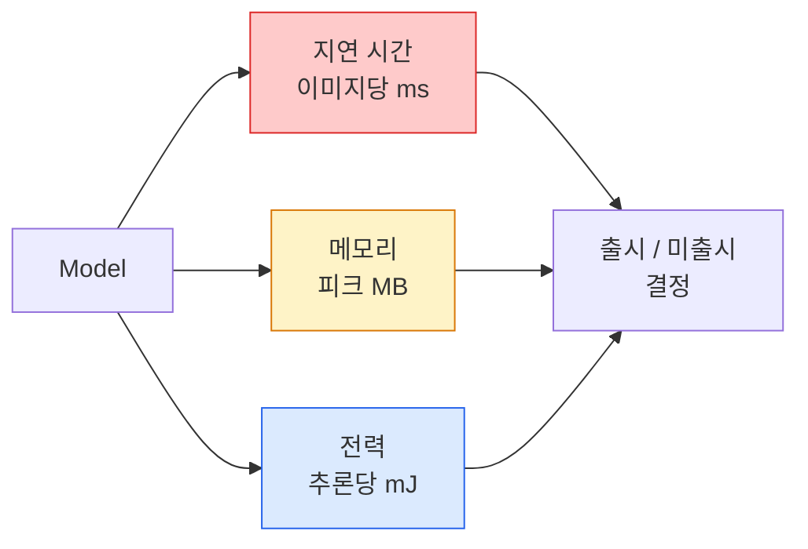

# 실시간 비전 — 엣지 배포

> 엣지 추론은 2 GB RAM을 가진 장치에서 90% 정확도의 모델을 30 fps로 실행하는 학문입니다. 정확도의 모든 백분율 포인트는 지연 시간의 밀리초와 트레이드오프됩니다.

**유형:** Learn + Build
**언어:** Python
**선수 요건:** 4단계 04강 (이미지 분류), 10단계 11강 (양자화)
**시간:** 약 75분

## 학습 목표

- 임의의 PyTorch 모델에 대해 추론 지연 시간, 피크 메모리 및 처리량을 측정하고, FLOPs / 매개변수 / 지연 시간의 트레이드오프를 읽어 보세요
- PyTorch의 사후 학습 양자화를 사용하여 비전 모델을 INT8로 양자화하고 정확도 손실이 1% 미만임을 검증해 보세요
- ONNX로 내보내고 ONNX Runtime 또는 TensorRT로 컴파일하세요. 가장 흔한 세 가지 내보내기 실패 유형과 그 해결책을 나열해 보세요
- 엣지 제약 조건이 있을 때 MobileNetV3, EfficientNet-Lite, ConvNeXt-Tiny 또는 MobileViT 중 하나를 선택해야 하는 시점을 설명해 보세요

## 문제점

학습 시간의 비전 모델은 부동 소수점 괴물입니다. 1억 개의 매개변수, 순방향 패스당 10 GFLOPs, 2 GB의 VRAM. 이 중 어느 것도 스마트폰, 자동차의 인포테인먼트 유닛, 산업용 카메라 또는 드론에 맞지 않습니다. 비전 시스템을 출시한다는 것은 예측을 100배 더 작은 예산에 맞추는 것을 의미합니다.

세 가지 조절 변수가 대부분의 작업을 수행합니다. 모델 선택 (동일한 레시피를 가진 더 작은 아키텍처), 양자화 (FP32 대신 INT8), 추론 런타임 (ONNX Runtime, TensorRT, Core ML, TFLite)입니다. 이들을 올바르게 설정하는 것은 워크스테이션에서 실행되는 데모와 $30 카메라 모듈에 출시되는 제품 간의 차이입니다.

이 강의는 먼저 측정 규율을 설정합니다 (측정할 수 없는 것은 최적화할 수 없습니다). 그런 다음 세 가지 조절 변수를 살펴봅니다. 목표는 모든 엣지 런타임을 배우는 것이 아니라, 어떤 레버가 존재하는지 알고 각각이 의도한 대로 작동하는지 검증하는 방법을 아는 것입니다.

## 개념

### 세 가지 예산



- **지연 시간**: p50, p95, p99. p50만 평균 내면 실시간 시스템에 중요한 꼬리(tail) 동작이 숨겨집니다.
- **피크 메모리**: 장치가 경험하는 최대값이며, 정상 상태 평균이 아닙니다. 임베디드 대상에서는 OOM이 치명적이므로 중요합니다.
- **전력 / 에너지**: 배터리 전원 장치에서 추론당 밀리줄(millijoules)입니다. 일반적으로 CPU/GPU 사용률 * 시간으로 근사합니다.

(모델, 지연 시간, 메모리, 정확도) 표는 엣지 결정을 내리는 근거입니다. 모든 셀은 워크스테이션이 아닌 대상 장치에서 측정됩니다.

### 측정 규율

모든 엣지 프로파일은 다음 세 가지 규칙을 따라야 합니다:

1. **워밍업**을 위해 측정 전에 5-10번의 더미 순방향 전파를 수행하세요. 차가운 캐시와 JIT 컴파일은 대표적이지 않은 첫 번째 수치를 생성합니다.
2. 시간 측정 블록 전후로 GPU 워크로드를 `torch.cuda.synchronize()`와 **동기화**하세요. 이렇게 하지 않으면 커널 실행이 아닌 커널 디스패치를 측정하게 됩니다.
3. **입력 크기를 고정**하여 프로덕션 해상도로 설정하세요. 224x224에서의 지연 시간은 512x512에서의 지연 시간과 다릅니다.

### FLOPs를 대리 지표로 사용

FLOPs (추론당 부동 소수점 연산)는 지연 시간에 대한 저렴하고 장치 독립적인 대리 지표입니다. 아키텍처 비교에는 유용하지만, 절대적인 벽 시계(wall-clock) 시간으로는 오해를 불러일으킬 수 있습니다. FLOPs가 10% 더 많은 모델이 하드웨어 친화적인 연산(깊이별 합성곱은 잘 컴파일되지만, 큰 7x7 합성곱은 그렇지 않음)을 사용하므로 실제로는 2배 더 빠를 수 있습니다.

규칙: 아키텍처 검색에는 FLOPs를 사용하세요. 배포 결정에는 장치 내 지연 시간을 사용하세요.

### 양자화 한 단락 요약

FP32 가중치와 활성화를 INT8로 교체하세요. 모델 크기가 4배 감소하고, 메모리 대역폭이 4배 감소하며, INT8 커널을 가진 하드웨어(모든 현대적 모바일 SoC, Tensor Cores가 있는 모든 NVIDIA GPU)에서는 연산량이 2-4배 감소합니다. 사후 학습 정적 양자화를 사용할 경우 비전 작업의 정확도 손실은 일반적으로 0.1-1 퍼센트 포인트입니다.

유형:

- **동적(Dynamic)** — 가중치를 INT8로 양자화하고, 활성화를 FP로 계산합니다. 쉽지만, 속도 향상은 미미합니다.
- **정적 (사후 학습)** — 가중치를 양자화하고, 작은 캘리브레이션 세트에서 활성화 범위를 보정합니다. 동적 양자화보다 훨씬 빠릅니다.
- **양자화 인식 학습(QAT)** — 학습 중에 양자화를 시뮬레이션하여 모델이 이를 고려하여 학습하도록 합니다. 가장 좋은 정확도를 제공하며, 레이블이 지정된 데이터가 필요합니다.

비전 모델의 경우, 사후 학습 정적 양자화(post-training static quantisation)는 노력의 5%로 이점의 95%를 얻을 수 있습니다. PTQ로 인한 정확도 손실이 허용 불가능한 경우에만 QAT를 사용해 보세요.

### 가지치기와 증류

- **가지치기(Pruning)** — 중요하지 않은 가중치(크기 기반) 또는 채널(구조적)을 제거합니다. 과매개변수화된 모델에서 잘 작동하며, 이미 컴팩트한 아키텍처에서는 덜 유용합니다.
- **증류(Distillation)** — 작은 학생 모델이 큰 교사 모델의 로짓(Logits)을 모방하도록 학습합니다. 모델 크기를 줄여 잃은 정확도의 대부분을 회복하는 경우가 많습니다. 프로덕션 엣지 모델의 표준입니다.

### 추론 런타임

- **PyTorch eager** — 느리므로 배포용으로는 적합하지 않습니다. 개발 전용으로만 사용하세요.
- **TorchScript** — 레거시입니다. `torch.compile` 및 ONNX 내보내기(export)에 의해 대체되었습니다.
- **ONNX Runtime** — 중립적인 런타임입니다. CPU, CUDA, CoreML, TensorRT, OpenVINO 모두 ONNX 프로바이더를 제공합니다. 여기서 시작하세요.
- **TensorRT** — NVIDIA의 컴파일러입니다. NVIDIA GPU(워크스테이션 및 Jetson)에서 최상의 지연(latency)을 제공합니다. ONNX Runtime과 통합하거나 독립적으로 사용할 수 있습니다.
- **Core ML** — iOS/macOS용 Apple의 런타임입니다. `.mlmodel` 또는 `.mlpackage`가 필요합니다.
- **TFLite** — Android/ARM용 Google의 런타임입니다. `.tflite`가 필요합니다.
- **OpenVINO** — CPU/VPU용 Intel의 런타임입니다. `.xml` + `.bin`가 필요합니다.

실제로는: PyTorch -> ONNX -> 타겟에 맞는 런타임을 선택하세요. ONNX는 공통 언어(lingua franca)입니다.

### 엣지 아키텍처 선택기

| 예산 | 모델 | 이유 |
|--------|-------|-----|
| < 3M 파라미터 | MobileNetV3-Small | 모든 환경에서 컴파일되며, 좋은 기준선(baseline) |
| 3-10M | EfficientNet-Lite-B0 | TFLite에서 파라미터당 최상의 정확도 |
| 10-20M | ConvNeXt-Tiny | 파라미터당 최상의 정확도, CPU 친화적 |
| 20-30M | MobileViT-S 또는 EfficientViT | ImageNet 정확도를 갖춘 트랜스포머 |
| 30-80M | Swin-V2-Tiny | 스택이 윈도우 어텐션(window attention)을 지원하는 경우 |

특정 이유가 없는 한 이 모든 모델을 INT8로 양자화하세요.

```figure
cnn-param-count
```

## 구현하기

### 1단계: 지연(latency)을 올바르게 측정하기

```python
import time
import torch

def measure_latency(model, input_shape, device="cpu", warmup=10, iters=50):
    model = model.to(device).eval()
    x = torch.randn(input_shape, device=device)
    with torch.no_grad():
        for _ in range(warmup):
            model(x)
        if device == "cuda":
            torch.cuda.synchronize()
        times = []
        for _ in range(iters):
            if device == "cuda":
                torch.cuda.synchronize()
            t0 = time.perf_counter()
            model(x)
            if device == "cuda":
                torch.cuda.synchronize()
            times.append((time.perf_counter() - t0) * 1000)
    times.sort()
    return {
        "p50_ms": times[len(times) // 2],
        "p95_ms": times[int(len(times) * 0.95)],
        "p99_ms": times[int(len(times) * 0.99)],
        "mean_ms": sum(times) / len(times),
    }
```

워밍업(Warmup), 동기화(synchronise)를 수행하고 `time.perf_counter()`를 사용하세요. 평균뿐만 아니라 백분위(percentiles)를 보고하세요.

### 2단계: 파라미터 및 FLOP 개수 세기

```python
def parameter_count(model):
    return sum(p.numel() for p in model.parameters())

def flops_estimate(model, input_shape):
    """
    Rough FLOP count for a conv/linear-only model. For production use `fvcore` or `ptflops`.
    """
    total = 0
    def conv_hook(m, inp, out):
        nonlocal total
        c_out, c_in, kh, kw = m.weight.shape
        h, w = out.shape[-2:]
        total += 2 * c_in * c_out * kh * kw * h * w
    def linear_hook(m, inp, out):
        nonlocal total
        total += 2 * m.in_features * m.out_features
    hooks = []
    for m in model.modules():
        if isinstance(m, torch.nn.Conv2d):
            hooks.append(m.register_forward_hook(conv_hook))
        elif isinstance(m, torch.nn.Linear):
            hooks.append(m.register_forward_hook(linear_hook))
    model.eval()
    with torch.no_grad():
        model(torch.randn(input_shape))
    for h in hooks:
        h.remove()
    return total
```

실제 프로젝트에서는 `fvcore.nn.FlopCountAnalysis` 또는 `ptflops`를 사용하세요. 모든 모듈 유형을 올바르게 처리합니다.

### 3단계: 학습 후 정적 양자화

```python
def quantise_ptq(model, calibration_loader, backend="x86"):
    import torch.ao.quantization as tq
    model = model.eval().cpu()
    model.qconfig = tq.get_default_qconfig(backend)
    tq.prepare(model, inplace=True)
    with torch.no_grad():
        for x, _ in calibration_loader:
            model(x)
    tq.convert(model, inplace=True)
    return model
```

세 단계: 구성, 준비(관찰자 삽입), 실제 데이터로 보정, 변환(융합 + 양자화). 모델이 융합되어야 합니다(`Conv -> BN -> ReLU` -> `ConvBnReLU`). `torch.ao.quantization.fuse_modules`가 이를 처리합니다.

### 4단계: ONNX로 내보내기

```python
def export_onnx(model, sample_input, path="model.onnx"):
    model = model.eval()
    torch.onnx.export(
        model,
        sample_input,
        path,
        input_names=["input"],
        output_names=["output"],
        dynamic_axes={"input": {0: "batch"}, "output": {0: "batch"}},
        opset_version=17,
    )
    return path
```

`opset_version=17`는 2026년 기준 안전한 기본값입니다. `dynamic_axes`를 사용하면 임의의 배치 크기로 ONNX 모델을 실행할 수 있습니다.

### 5단계: 벤치마크 및 레짐 비교

```python
import torch.nn as nn
from torchvision.models import mobilenet_v3_small

def compare_regimes():
    model = mobilenet_v3_small(weights=None, num_classes=10)
    params = parameter_count(model)
    flops = flops_estimate(model, (1, 3, 224, 224))
    lat_fp32 = measure_latency(model, (1, 3, 224, 224), device="cpu")
    print(f"FP32 MobileNetV3-Small: {params:,} params  {flops/1e9:.2f} GFLOPs  "
          f"p50={lat_fp32['p50_ms']:.2f}ms  p95={lat_fp32['p95_ms']:.2f}ms")
```

`resnet50`, `efficientnet_v2_s`, `convnext_tiny`에 대해 동일한 함수를 실행하면 배포 결정을 위한 비교 표가 생성됩니다.

## 사용하기

프로덕션 스택은 세 가지 경로 중 하나로 수렴합니다:

- **웹 / 서버리스**: PyTorch -> ONNX -> ONNX Runtime (CPU 또는 CUDA 제공자). 가장 쉬우며, 대부분에 충분합니다.
- **NVIDIA 엣지 (Jetson, GPU 서버)**: PyTorch -> ONNX -> TensorRT. 지연 시간이 가장 좋지만, 엔지니어링 노력이 가장 큽니다.
- **모바일**: PyTorch -> ONNX -> Core ML (iOS) 또는 TFLite (Android). 내보내기 전에 양자화하세요.

측정을 위해 macOS의 `torch-tb-profiler`, `nvprof` / `nsys`, Instruments는 레이어별 상세 분석을 제공합니다. `benchmark_app` (OpenVINO)와 `trtexec` (TensorRT)는 독립적인 CLI 수치를 제공합니다.

## 출시하기

이 강의는 다음을 생성합니다:

- `outputs/prompt-edge-deployment-planner.md` — 대상 장치와 지연 SLA를 고려하여 백본, 양자화 전략, 런타임을 선택하는 프롬프트입니다.
- `outputs/skill-latency-profiler.md` — 워밍업, 동기화, 백분위수, 메모리 추적을 포함한 완전한 지연 시간 벤치마킹 스크립트를 작성하는 스킬입니다.

## 연습 문제

1. **(쉬움)** CPU에서 224x224 크기로 `resnet18`, `mobilenet_v3_small`, `efficientnet_v2_s`, `convnext_tiny`의 p50 지연 시간을 측정하세요. 표를 보고하고 ms당 정확도가 가장 높은 아키텍처를 식별하세요.
2. **(중간)** `mobilenet_v3_small`에 학습 후 정적 양자화를 적용하세요. CIFAR-10의 유지된 하위 집합이나 유사한 데이터셋에서 FP32와 INT8의 지연 시간 및 정확도 손실을 보고하세요.
3. **(난이도: 상)** `convnext_tiny`를 ONNX로 내보내고, `onnxruntime`와 `CPUExecutionProvider`를 사용하여 실행한 후 PyTorch eager 기준선과 지연 시간을 비교하세요. ONNX Runtime이 더 빠른 첫 번째 레이어를 식별하고 그 이유를 설명하세요.

## 핵심 용어

| 용어 | 사람들이 말하는 것 | 실제 의미 |
|------|----------------|----------------------|
| 지연 시간 | "얼마나 빠른가" | 입력에서 출력까지의 시간; 평균이 아닌 p50/p95/p99 백분위수 |
| FLOPs | "모델 크기" | 순전파당 부동 소수점 연산 횟수; 연산 비용의 대략적인 지표 |
| INT8 양자화 | "8비트" | FP32 가중치/활성화를 8비트 정수로 대체; 약 4배 더 작고, 2-4배 더 빠름 |
| PTQ | "학습 후 양자화" | 재학습 없이 학습된 모델을 양자화; 쉬우며, 보통 충분함 |
| QAT | "양자화 인식 학습" | 학습 중 양자화를 시뮬레이션; 최상의 정확도, 레이블이 지정된 데이터 필요 |
| ONNX | "중립 형식" | 모든 주요 추론 런타임이 지원하는 모델 교환 형식 |
| TensorRT | "NVIDIA 컴파일러" | ONNX를 NVIDIA GPU용 최적화된 엔진으로 컴파일 |
| 증류 | "교사 -> 학생" | 큰 모델의 로짓을 모방하도록 작은 모델을 학습; 손실된 정확도의 대부분을 회복 |

## 추가 읽기

- [EfficientNet (Tan & Le, 2019)](https://arxiv.org/abs/1905.11946) — 효율적인 아키텍처를 위한 복합 스케일링
- [MobileNetV3 (Howard et al., 2019)](https://arxiv.org/abs/1905.02244) — h-swish 및 squeeze-excite를 사용하는 모바일 우선 아키텍처
- [Accelerating Inference Up to 6x Faster in PyTorch with Torch-TensorRT (NVIDIA)](https://developer.nvidia.com/blog/accelerating-inference-up-to-6x-faster-in-pytorch-with-torch-tensorrt/) — 논문에서 처리량 수치를 실제로 얻는 방법
- [ONNX Runtime docs](https://onnxruntime.ai/docs/) — 양자화, 그래프 최적화, 공급자 선택
