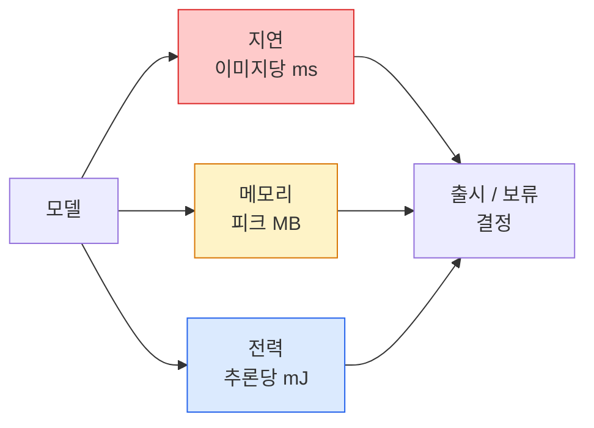

# 실시간 비전 — 엣지 배포 (Real-Time Vision — Edge Deployment)

> 엣지 추론은 정확도 90인 모델을 2 GB RAM 기기에서 30 fps로 돌리는 규율입니다. 정확도 1포인트마다 지연 시간 밀리초와 맞바꿉니다.

**Type:** Learn + Build
**Languages:** Python
**Prerequisites:** Phase 4 Lesson 04 (Image Classification), Phase 10 Lesson 11 (Quantization)
**Time:** ~75 minutes

## 학습 목표 (Learning Objectives)

- 임의의 PyTorch 모델에 대해 추론 지연, 피크 메모리, 처리량을 측정하고 FLOPs / 파라미터 / 지연 트레이드오프를 읽습니다
- PyTorch 사후 학습 양자화로 비전 모델을 INT8로 양자화하고 정확도 손실이 1% 미만인지 검증합니다
- ONNX로 내보내고 ONNX Runtime 또는 TensorRT로 컴파일합니다. 가장 흔한 내보내기 실패 세 가지와 수정법을 말합니다
- 엣지 제약에 따라 MobileNetV3, EfficientNet-Lite, ConvNeXt-Tiny, MobileViT 중 무엇을 고를지 설명합니다

## 문제 상황 (The Problem)

학습 시점의 비전 모델은 부동소수점 괴물입니다. 파라미터 1억 개, 순전파당 10 GFLOPs, VRAM 2 GB. 휴대폰, 차량 인포테인먼트, 산업용 카메라, 드론에는 하나도 맞지 않습니다. 비전 시스템을 출시한다는 것은 같은 예측을 100배 작은 예산에 넣는 일입니다.

대부분의 일은 세 개의 손잡이가 합니다. 모델 선택(같은 레시피의 더 작은 아키텍처), 양자화(FP32 대신 INT8), 추론 런타임(ONNX Runtime, TensorRT, Core ML, TFLite). 이를 제대로 맞추는 것이 워크스테이션에서 도는 데모와 $30 카메라 모듈에 실리는 제품의 차이입니다.

이 레슨은 먼저 측정 규율을 세웁니다(측정할 수 없으면 최적화할 수 없습니다). 그다음 세 손잡이를 걷습니다. 목표는 모든 엣지 런타임을 외우는 것이 아니라, 어떤 레버가 있고 각각이 생각한 대로인지 어떻게 검증하는지 아는 것입니다.

## 핵심 개념 (The Concept)

### 세 가지 예산



- **지연 (Latency)**: p50, p95, p99. p50만 평균 내면 실시간 시스템에 중요한 꼬리 행동이 가려집니다.
- **피크 메모리**: 기기가 한 번이라도 보는 최댓값이지 정상 상태 평균이 아닙니다. 임베디드에서 OOM은 치명적이기 때문입니다.
- **전력 / 에너지**: 배터리 기기에서 추론당 밀리줄. 종종 CPU/GPU 사용률 × 시간으로 대리합니다.

(모델, 지연, 메모리, 정확도) 표가 엣지 결정의 근거입니다. 모든 칸은 워크스테이션이 아니라 대상 기기에서 측정합니다.

### 측정 규율

모든 엣지 프로파일이 따라야 할 세 규칙:

1. 측정 전에 더미 순전파 5–10회로 모델을 **워밍업**합니다. 차가운 캐시와 JIT 컴파일은 첫 숫자를 대표하지 않게 만듭니다.
2. 타이밍 블록 전후에 `torch.cuda.synchronize()`로 GPU 작업을 **동기화**합니다. 없으면 커널 실행이 아니라 커널 디스패치를 측정합니다.
3. 입력 크기를 프로덕션 해상도로 **고정**합니다. 224×224 지연은 512×512 지연이 아닙니다.

### 대리 지표로서의 FLOPs

FLOPs(추론당 부동소수점 연산)는 저렴하고 기기 독립적인 지연 대리 지표입니다. 아키텍처 비교에는 유용하고, 절대 벽시계로는 오해를 줍니다. FLOPs가 10% 더 많은 모델이 실제로는 2배 빠를 수 있습니다. 하드웨어 친화적 연산(depthwise conv는 잘 컴파일되고, 큰 7×7 conv는 그렇지 않음)을 쓰기 때문입니다.

규칙: 아키텍처 탐색에는 FLOPs, 배포 결정에는 온디바이스 지연을 씁니다.

### 한 단락으로 보는 양자화

FP32 가중치와 활성화를 INT8로 바꿉니다. 모델 크기는 4배, 메모리 대역폭은 4배, INT8 커널이 있는 하드웨어(모든 현대 모바일 SoC, Tensor Core가 있는 모든 NVIDIA GPU)에서는 연산이 2–4배 줄어듭니다. 비전 과제에서 사후 학습 정적 양자화의 정확도 손실은 보통 0.1–1포인트입니다.

종류:

- **동적 (Dynamic)** — 가중치는 INT8, 활성화는 FP로 계산. 쉽고 가속은 작습니다.
- **정적 (사후 학습, Static PTQ)** — 가중치 양자화 + 작은 캘리브레이션 세트로 활성화 범위 캘리브레이션. 동적보다 훨씬 빠릅니다.
- **양자화 인식 학습 (QAT)** — 학습 중 양자화를 시뮬레이션해 모델이 그에 맞춰 학습. 정확도가 가장 좋고 라벨 데이터가 필요합니다.

비전에서는 사후 학습 정적 양자화가 노력의 5%로 이득의 95%를 줍니다. PTQ 정확도 손실이 감당되지 않을 때만 QAT를 씁니다.

### 가지치기와 증류

- **가지치기 (Pruning)** — 중요하지 않은 가중치(크기 기반) 또는 채널(구조화)을 제거. 과파라미터 모델에 잘 맞고, 이미 압축된 아키텍처에는 덜 유용합니다.
- **증류 (Distillation)** — 큰 교사의 로짓을 흉내 내도록 작은 학생을 학습. 모델을 줄일 때 잃은 정확도를 대부분 회복합니다. 프로덕션 엣지 모델의 표준입니다.

### 추론 런타임

- **PyTorch eager** — 느리고 배포용이 아닙니다. 개발에만 씁니다.
- **TorchScript** — 레거시. `torch.compile`과 ONNX 내보내기로 대체되었습니다.
- **ONNX Runtime** — 중립 런타임. CPU, CUDA, CoreML, TensorRT, OpenVINO 모두 ONNX 프로바이더가 있습니다. 여기서 시작합니다.
- **TensorRT** — NVIDIA 컴파일러. NVIDIA GPU(워크스테이션과 Jetson)에서 지연이 가장 좋습니다. ONNX Runtime과 통합하거나 단독으로 씁니다.
- **Core ML** — iOS/macOS용 Apple 런타임. `.mlmodel` 또는 `.mlpackage`가 필요합니다.
- **TFLite** — Android/ARM용 Google 런타임. `.tflite`가 필요합니다.
- **OpenVINO** — CPU/VPU용 Intel 런타임. `.xml` + `.bin`이 필요합니다.

실무: PyTorch -> ONNX -> 대상 런타임 선택. ONNX가 공용어입니다.

### 엣지 아키텍처 선택표

| 예산 | 모델 | 이유 |
|--------|-------|-----|
| < 3M params | MobileNetV3-Small | 어디서든 컴파일, 좋은 베이스라인 |
| 3-10M | EfficientNet-Lite-B0 | TFLite에서 파라미터당 정확도 최고 |
| 10-20M | ConvNeXt-Tiny | 파라미터당 정확도 최고, CPU 친화 |
| 20-30M | MobileViT-S 또는 EfficientViT | ImageNet 정확도의 Transformer |
| 30-80M | Swin-V2-Tiny | 스택이 window attention을 지원할 때 |

특별한 이유가 없으면 모두 INT8로 양자화합니다.

```figure
cnn-param-count
```

## 구현하기 (Build It)

### 1단계: 지연을 올바르게 측정하기

```python
import time
import torch

def measure_latency(model, input_shape, device="cpu", warmup=10, iters=50):
    model = model.to(device).eval()
    x = torch.randn(input_shape, device=device)
    with torch.no_grad():
        for _ in range(warmup):
            model(x)
        if device == "cuda":
            torch.cuda.synchronize()
        times = []
        for _ in range(iters):
            if device == "cuda":
                torch.cuda.synchronize()
            t0 = time.perf_counter()
            model(x)
            if device == "cuda":
                torch.cuda.synchronize()
            times.append((time.perf_counter() - t0) * 1000)
    times.sort()
    return {
        "p50_ms": times[len(times) // 2],
        "p95_ms": times[int(len(times) * 0.95)],
        "p99_ms": times[int(len(times) * 0.99)],
        "mean_ms": sum(times) / len(times),
    }
```

워밍업하고, 동기화하고, `time.perf_counter()`를 씁니다. 평균만이 아니라 백분위수를 보고합니다.

### 2단계: 파라미터와 FLOP 수

```python
def parameter_count(model):
    return sum(p.numel() for p in model.parameters())

def flops_estimate(model, input_shape):
    """
    Rough FLOP count for a conv/linear-only model. For production use `fvcore` or `ptflops`.
    """
    total = 0
    def conv_hook(m, inp, out):
        nonlocal total
        c_out, c_in, kh, kw = m.weight.shape
        h, w = out.shape[-2:]
        total += 2 * c_in * c_out * kh * kw * h * w
    def linear_hook(m, inp, out):
        nonlocal total
        total += 2 * m.in_features * m.out_features
    hooks = []
    for m in model.modules():
        if isinstance(m, torch.nn.Conv2d):
            hooks.append(m.register_forward_hook(conv_hook))
        elif isinstance(m, torch.nn.Linear):
            hooks.append(m.register_forward_hook(linear_hook))
    model.eval()
    with torch.no_grad():
        model(torch.randn(input_shape))
    for h in hooks:
        h.remove()
    return total
```

실제 프로젝트에서는 `fvcore.nn.FlopCountAnalysis` 또는 `ptflops`를 쓰세요. 모든 모듈 타입을 올바르게 처리합니다.

### 3단계: 사후 학습 정적 양자화

```python
def quantise_ptq(model, calibration_loader, backend="x86"):
    import torch.ao.quantization as tq
    model = model.eval().cpu()
    model.qconfig = tq.get_default_qconfig(backend)
    tq.prepare(model, inplace=True)
    with torch.no_grad():
        for x, _ in calibration_loader:
            model(x)
    tq.convert(model, inplace=True)
    return model
```

세 단계: 설정, prepare(옵저버 삽입), 실제 데이터로 캘리브레이션, convert(퓨즈 + 양자화). 모델이 퓨즈되어 있어야 합니다(`Conv -> BN -> ReLU` -> `ConvBnReLU`). `torch.ao.quantization.fuse_modules`가 처리합니다.

### 4단계: ONNX로 내보내기

```python
def export_onnx(model, sample_input, path="model.onnx"):
    model = model.eval()
    torch.onnx.export(
        model,
        sample_input,
        path,
        input_names=["input"],
        output_names=["output"],
        dynamic_axes={"input": {0: "batch"}, "output": {0: "batch"}},
        opset_version=17,
    )
    return path
```

`opset_version=17`은 2026년 안전한 기본값입니다. `dynamic_axes`로 임의 배치 크기에서 ONNX 모델을 실행할 수 있습니다.

### 5단계: 레짐 벤치마크와 비교

```python
import torch.nn as nn
from torchvision.models import mobilenet_v3_small

def compare_regimes():
    model = mobilenet_v3_small(weights=None, num_classes=10)
    params = parameter_count(model)
    flops = flops_estimate(model, (1, 3, 224, 224))
    lat_fp32 = measure_latency(model, (1, 3, 224, 224), device="cpu")
    print(f"FP32 MobileNetV3-Small: {params:,} params  {flops/1e9:.2f} GFLOPs  "
          f"p50={lat_fp32['p50_ms']:.2f}ms  p95={lat_fp32['p95_ms']:.2f}ms")
```

같은 함수를 `resnet50`, `efficientnet_v2_s`, `convnext_tiny`에 돌리면 배포 결정에 필요한 비교표가 나옵니다.

## 실용 활용 (Use It)

프로덕션 스택은 세 경로 중 하나로 수렴합니다.

- **웹 / 서버리스**: PyTorch -> ONNX -> ONNX Runtime (CPU 또는 CUDA 프로바이더). 가장 쉽고 대부분에 충분합니다.
- **NVIDIA 엣지 (Jetson, GPU 서버)**: PyTorch -> ONNX -> TensorRT. 지연이 가장 좋고 엔지니어링 비용이 가장 큽니다.
- **모바일**: PyTorch -> ONNX -> Core ML (iOS) 또는 TFLite (Android). 내보내기 전에 양자화합니다.

측정에는 `torch-tb-profiler`, `nvprof` / `nsys`, macOS의 Instruments가 레이어별 분해를 줍니다. `benchmark_app`(OpenVINO)과 `trtexec`(TensorRT)는 단독 CLI 숫자를 줍니다.

## 배포할 산출물 (Ship It)

이 레슨이 만드는 것:

- `outputs/prompt-edge-deployment-planner.md` — 대상 기기와 지연 SLA가 주어지면 백본, 양자화 전략, 런타임을 고르는 프롬프트.
- `outputs/skill-latency-profiler.md` — 워밍업, 동기화, 백분위수, 메모리 추적이 있는 완전한 지연 벤치마크 스크립트를 쓰는 스킬.

## 연습 문제 (Exercises)

1. **(Easy)** CPU에서 224×224로 `resnet18`, `mobilenet_v3_small`, `efficientnet_v2_s`, `convnext_tiny`의 p50 지연을 측정하세요. 표를 보고하고 밀리초당 정확도가 가장 좋은 아키텍처를 고르세요.
2. **(Medium)** `mobilenet_v3_small`에 사후 학습 정적 양자화를 적용하세요. CIFAR-10 등 홀드아웃 서브셋에서 FP32 vs INT8 지연과 정확도 손실을 보고하세요.
3. **(Hard)** `convnext_tiny`를 ONNX로 내보내고 `CPUExecutionProvider`로 `onnxruntime`에서 실행한 뒤 PyTorch eager 베이스라인과 지연을 비교하세요. ONNX Runtime이 더 빠른 첫 레이어를 찾고 이유를 설명하세요.

## 핵심 용어 (Key Terms)

| 용어 | 사람들이 말하는 것 | 실제 의미 |
|------|----------------|----------------------|
| Latency | "얼마나 빠른가" | 입력부터 출력까지의 시간; 평균이 아니라 p50/p95/p99 백분위수 |
| FLOPs | "모델 크기" | 순전파당 부동소수점 연산; 계산 비용의 거친 대리 |
| INT8 quantisation | "8비트" | FP32 가중치/활성화를 8비트 정수로 교체; ~4배 작아지고 2–4배 빨라짐 |
| PTQ | "사후 학습 양자화" | 재학습 없이 학습된 모델을 양자화; 쉽고 보통 충분함 |
| QAT | "양자화 인식 학습" | 학습 중 양자화 시뮬레이션; 정확도 최고, 라벨 데이터 필요 |
| ONNX | "중립 포맷" | 모든 주류 추론 런타임이 지원하는 모델 교환 포맷 |
| TensorRT | "NVIDIA 컴파일러" | ONNX를 NVIDIA GPU용 최적화 엔진으로 컴파일 |
| Distillation | "교사 -> 학생" | 큰 모델의 로짓을 흉내 내도록 작은 모델을 학습; 잃은 정확도를 대부분 회복 |

## 더 읽을거리 (Further Reading)

- [EfficientNet (Tan & Le, 2019)](https://arxiv.org/abs/1905.11946) — 효율적 아키텍처를 위한 복합 스케일링
- [MobileNetV3 (Howard et al., 2019)](https://arxiv.org/abs/1905.02244) — h-swish와 squeeze-excite가 있는 모바일 우선 아키텍처
- [A Practical Guide to TensorRT Optimization (NVIDIA)](https://developer.nvidia.com/blog/accelerating-model-inference-with-tensorrt-tips-and-best-practices-for-pytorch-users/) — 논문의 처리량 숫자를 실제로 얻는 방법
- [ONNX Runtime docs](https://onnxruntime.ai/docs/) — 양자화, 그래프 최적화, 프로바이더 선택
