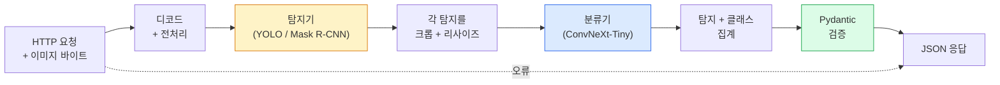

# 완전한 비전 파이프라인 구축 — 캡스톤 (Build a Complete Vision Pipeline — Capstone)

> 프로덕션 비전 시스템은 데이터 계약으로 이어 붙인 모델과 규칙의 사슬입니다. 조각은 이미 이 페이즈에 있고, 캡스톤이 엔드투엔드로 연결합니다.

**Type:** Build
**Languages:** Python
**Prerequisites:** Phase 4 Lessons 01-15
**Time:** ~120 minutes

## 학습 목표 (Learning Objectives)

- 객체를 탐지·분류하고 구조화된 JSON을 내보내는 프로덕션 비전 파이프라인을 설계합니다. 모든 실패 경로를 처리합니다
- 탐지기(Mask R-CNN 또는 YOLO), 분류기(ConvNeXt-Tiny), 데이터 계약(Pydantic)을 하나의 서비스에 꽂습니다
- 엔드투엔드 파이프라인을 벤치마크하고 첫 병목을 찾습니다(보통 전처리, 그다음 탐지기)
- 이미지 업로드를 받아 파이프라인을 돌리고 분류가 붙은 탐지를 반환하는 최소 FastAPI 서비스를 출시합니다

## 문제 상황 (The Problem)

개별 비전 모델은 유용하고, 비전 제품은 그 사슬입니다. 소매 선반 감사는 탐지기 + 제품 분류기 + 가격 OCR 파이프라인입니다. 자율주행은 2D 탐지기 + 3D 탐지기 + 세그멘터 + 트래커 + 플래너입니다. 의료 사전 스크리닝은 세그멘터 + 영역 분류기 + 임상의 UI입니다.

그 사슬을 연결하는 일이 프로토타입과 제품을 가릅니다. 모델 사이 인터페이스마다 버그가 생깁니다. 좌표 변환, 정규화, 마스크 리사이즈마다 조용한 실패 후보입니다. 파이프라인은 가장 약한 인터페이스만큼만 강합니다.

이 캡스톤은 최소 가능 파이프라인을 세웁니다: 탐지 + 분류 + 구조화 출력 + 서빙 레이어. Phase 4의 나머지는 이 골격에 꽂습니다. Mask R-CNN을 YOLOv8로 바꾸고, OCR 헤드를 추가하고, 세그멘테이션 분기를 추가하고, 트래커를 추가합니다. 아키텍처는 안정적이고 조각은 교체 가능합니다.

## 핵심 개념 (The Concept)

### 파이프라인



일곱 단계. 모델 단계 둘이 비싸고, 나머지 다섯에 버그가 삽니다.

### Pydantic 데이터 계약

모든 모델 경계가 타입이 있는 객체가 됩니다. 조용한 실패를 시끄러운 실패로 바꿉니다.

```
Detection(
    box: tuple[float, float, float, float],   # (x1, y1, x2, y2), absolute pixels
    score: float,                              # [0, 1]
    class_id: int,                             # from detector's label map
    mask: Optional[list[list[int]]],           # RLE-encoded if present
)

PipelineResult(
    image_id: str,
    detections: list[Detection],
    classifications: list[Classification],
    inference_ms: float,
)
```

탐지기가 `(x1, y1, x2, y2)` 대신 `(cx, cy, w, h)`로 박스를 반환하면, Pydantic 검증이 경계에서 실패하고 다운스트림 크롭이 조용히 빈 영역을 반환하기 전에 바로 알 수 있습니다.

### 지연이 가는 곳

거의 모든 비전 파이프라인에서 세 가지가 성립합니다.

1. **전처리가 종종 가장 큰 단일 블록입니다.** JPEG 디코드, 색 공간 변환, 리사이즈 — CPU 바운드이고 잊기 쉽습니다.
2. **탐지기가 GPU 시간을 지배합니다.** GPU 시간의 70–90%가 탐지 순전파입니다.
3. **후처리(NMS, RLE 인코드/디코드)는 GPU에서는 싸고 CPU에서는 비쌉니다.** 항상 실제 대상에서 프로파일하세요.

분포를 아는 것이 최적화를 우선순위 목록으로 만듭니다.

### 실패 모드

- **빈 탐지** — 빈 리스트를 반환하고 크래시하지 마세요. 로그하세요.
- **경계를 넘는 박스** — 크롭 전에 이미지 크기로 클램프하세요.
- **아주 작은 크롭** — 분류기 최소 입력보다 작은 박스는 분류를 건너뛰세요.
- **손상된 업로드** — 500이 아니라 구체적 오류 코드의 400 응답.
- **모델 로드 실패** — 첫 요청이 아니라 서비스 기동 시 실패하세요.

프로덕션 파이프라인은 실패를 숨기는 일반 `try/except` 없이 각각을 처리합니다. 모든 실패에 이름 있는 코드와 응답이 있습니다.

### 배칭

프로덕션 서비스는 여러 클라이언트를 서빙합니다. 요청을 가로질러 탐지와 분류를 배칭하면 처리량이 곱해집니다. 트레이드오프: 배치가 찰 때까지 기다리는 추가 지연. 전형적 설정: 최대 20ms 요청을 모아 배칭하고, 처리하고, 응답을 분배합니다. `torchserve`와 `triton`은 네이티브로 하고, 부하가 예측 가능한 작은 서비스는 자체 마이크로배처를 만듭니다.

```figure
v4-vision-pipeline
```

## 구현하기 (Build It)

### 1단계: 데이터 계약

```python
from pydantic import BaseModel, Field
from typing import List, Optional, Tuple

class Detection(BaseModel):
    box: Tuple[float, float, float, float]
    score: float = Field(ge=0, le=1)
    class_id: int = Field(ge=0)
    mask_rle: Optional[str] = None


class Classification(BaseModel):
    detection_index: int
    class_id: int
    class_name: str
    score: float = Field(ge=0, le=1)


class PipelineResult(BaseModel):
    image_id: str
    detections: List[Detection]
    classifications: List[Classification]
    inference_ms: float
```

5초 코드가 진지한 파이프라인에서 한 시간의 디버깅을 아낍니다.

### 2단계: 최소 Pipeline 클래스

```python
import time
import numpy as np
import torch
from PIL import Image

class VisionPipeline:
    def __init__(self, detector, classifier, class_names,
                 device="cpu", min_crop=32):
        self.detector = detector.to(device).eval()
        self.classifier = classifier.to(device).eval()
        self.class_names = class_names
        self.device = device
        self.min_crop = min_crop

    def preprocess(self, image):
        """
        image: PIL.Image or np.ndarray (H, W, 3) uint8
        returns: CHW float tensor on device
        """
        if isinstance(image, Image.Image):
            image = np.asarray(image.convert("RGB"))
        tensor = torch.from_numpy(image).permute(2, 0, 1).float() / 255.0
        return tensor.to(self.device)

    @torch.no_grad()
    def detect(self, image_tensor):
        return self.detector([image_tensor])[0]

    @torch.no_grad()
    def classify(self, crops):
        if len(crops) == 0:
            return []
        batch = torch.stack(crops).to(self.device)
        logits = self.classifier(batch)
        probs = logits.softmax(-1)
        scores, cls = probs.max(-1)
        return list(zip(cls.tolist(), scores.tolist()))

    def run(self, image, image_id="anonymous"):
        t0 = time.perf_counter()
        tensor = self.preprocess(image)
        det = self.detect(tensor)

        crops = []
        detections = []
        valid_indices = []
        for i, (box, score, cls) in enumerate(zip(det["boxes"], det["scores"], det["labels"])):
            x1, y1, x2, y2 = [max(0, int(b)) for b in box.tolist()]
            x2 = min(x2, tensor.shape[-1])
            y2 = min(y2, tensor.shape[-2])
            detections.append(Detection(
                box=(x1, y1, x2, y2),
                score=float(score),
                class_id=int(cls),
            ))
            if (x2 - x1) < self.min_crop or (y2 - y1) < self.min_crop:
                continue
            crop = tensor[:, y1:y2, x1:x2]
            crop = torch.nn.functional.interpolate(
                crop.unsqueeze(0),
                size=(224, 224),
                mode="bilinear",
                align_corners=False,
            )[0]
            crops.append(crop)
            valid_indices.append(i)

        class_preds = self.classify(crops)

        classifications = []
        for valid_idx, (cls_id, cls_score) in zip(valid_indices, class_preds):
            classifications.append(Classification(
                detection_index=valid_idx,
                class_id=int(cls_id),
                class_name=self.class_names[cls_id],
                score=float(cls_score),
            ))

        return PipelineResult(
            image_id=image_id,
            detections=detections,
            classifications=classifications,
            inference_ms=(time.perf_counter() - t0) * 1000,
        )
```

모든 인터페이스에 타입이 있습니다. 모든 실패 경로에 구체적 처리 결정이 있습니다.

### 3단계: 탐지기와 분류기 연결

```python
from torchvision.models.detection import maskrcnn_resnet50_fpn_v2
from torchvision.models import convnext_tiny

# Use ImageNet-pretrained weights for a realistic pipeline without training
detector = maskrcnn_resnet50_fpn_v2(weights="DEFAULT")
classifier = convnext_tiny(weights="DEFAULT")
class_names = [f"imagenet_class_{i}" for i in range(1000)]

pipe = VisionPipeline(detector, classifier, class_names)

# Smoke test with a synthetic image
test_image = (np.random.rand(400, 600, 3) * 255).astype(np.uint8)
result = pipe.run(test_image, image_id="demo")
print(result.model_dump_json(indent=2)[:500])
```

### 4단계: FastAPI 서비스

```python
from fastapi import FastAPI, UploadFile, HTTPException
from io import BytesIO

app = FastAPI()
pipe = None  # initialised on startup

@app.on_event("startup")
def load():
    global pipe
    detector = maskrcnn_resnet50_fpn_v2(weights="DEFAULT").eval()
    classifier = convnext_tiny(weights="DEFAULT").eval()
    pipe = VisionPipeline(detector, classifier, class_names=[f"c{i}" for i in range(1000)])

@app.post("/detect")
async def detect_endpoint(file: UploadFile):
    if file.content_type not in {"image/jpeg", "image/png", "image/webp"}:
        raise HTTPException(status_code=400, detail="unsupported image type")
    data = await file.read()
    try:
        img = Image.open(BytesIO(data)).convert("RGB")
    except Exception:
        raise HTTPException(status_code=400, detail="cannot decode image")
    result = pipe.run(img, image_id=file.filename or "upload")
    return result.model_dump()
```

`uvicorn main:app --host 0.0.0.0 --port 8000`으로 실행합니다. `curl -F 'file=@dog.jpg' http://localhost:8000/detect`로 테스트합니다.

### 5단계: 파이프라인 벤치마크

```python
import time

def benchmark(pipe, num_runs=20, image_size=(400, 600)):
    img = (np.random.rand(*image_size, 3) * 255).astype(np.uint8)
    pipe.run(img)  # warm up

    stages = {"preprocess": [], "detect": [], "classify": [], "total": []}
    for _ in range(num_runs):
        t0 = time.perf_counter()
        tensor = pipe.preprocess(img)
        t1 = time.perf_counter()
        det = pipe.detect(tensor)
        t2 = time.perf_counter()
        crops = []
        for box in det["boxes"]:
            x1, y1, x2, y2 = [max(0, int(b)) for b in box.tolist()]
            x2 = min(x2, tensor.shape[-1])
            y2 = min(y2, tensor.shape[-2])
            if (x2 - x1) >= pipe.min_crop and (y2 - y1) >= pipe.min_crop:
                crop = tensor[:, y1:y2, x1:x2]
                crop = torch.nn.functional.interpolate(
                    crop.unsqueeze(0), size=(224, 224), mode="bilinear", align_corners=False
                )[0]
                crops.append(crop)
        pipe.classify(crops)
        t3 = time.perf_counter()
        stages["preprocess"].append((t1 - t0) * 1000)
        stages["detect"].append((t2 - t1) * 1000)
        stages["classify"].append((t3 - t2) * 1000)
        stages["total"].append((t3 - t0) * 1000)

    for stage, times in stages.items():
        times.sort()
        print(f"{stage:12s}  p50={times[len(times)//2]:7.1f} ms  p95={times[int(len(times)*0.95)]:7.1f} ms")
```

CPU에서의 전형적 출력: 전처리 ~3 ms, 탐지 300–500 ms, 분류 20–40 ms, 합계 350–550 ms. GPU에서는 탐지가 20–40 ms이고 전처리 + 분류가 상대적으로 더 중요해집니다.

## 실용 활용 (Use It)

프로덕션 템플릿은 같은 구조로 수렴하고, 여기에 더합니다.

- **모델 버저닝** — 응답에 항상 모델 이름과 가중치 해시를 로그하세요.
- **요청별 트레이스 ID** — 느린 응답을 단계와 상관지을 수 있도록 모든 요청의 모든 단계 타이밍을 로그하세요.
- **폴백 경로** — 분류기가 타임아웃하면 전체 요청을 실패시키지 말고 분류 없이 탐지를 반환하세요.
- **안전 필터** — NSFW / PII 필터는 분류 후, 응답이 서비스를 떠나기 전에 돌립니다.
- **배치 엔드포인트** — 대량 처리를 위해 이미지 URL 리스트를 받는 `/detect_batch`.

프로덕션 서빙에는 `torchserve`, `Triton Inference Server`, `BentoML`이 배칭, 버저닝, 메트릭, 헬스 체크를 기본으로 합니다. `FastAPI`를 직접 돌리는 것은 프로토타입과 소규모 제품에 충분합니다.

## 배포할 산출물 (Ship It)

이 레슨이 만드는 것:

- `outputs/prompt-vision-service-shape-reviewer.md` — 비전 서비스 코드의 계약/응답 형태 위반을 검토하고 첫 깨는 버그를 이름 붙이는 프롬프트.
- `outputs/skill-pipeline-budget-planner.md` — 목표 지연과 처리량이 주어지면 모든 파이프라인 단계에 시간 예산을 할당하고 어떤 단계가 예산을 먼저 못 지킬지 표시하는 스킬.

## 연습 문제 (Exercises)

1. **(Easy)** 임의의 공개 데이터셋에서 이미지 10장에 파이프라인을 돌리세요. 단계별 평균 시간과 이미지당 탐지 수 분포를 보고하세요.
2. **(Medium)** `Detection`에 마스크 출력 필드를 추가하고 RLE로 인코딩하세요. 객체 10개인 이미지에서도 JSON이 1MB 미만인지 검증하세요.
3. **(Hard)** 분류기 앞에 마이크로배처를 추가하세요: 최대 10 ms까지 크롭을 모아 한 번의 GPU 호출로 분류하고, 요청별로 결과를 반환하세요. 초당 동시 요청 5개에서 처리량 이득과 추가된 지연을 측정하세요.

## 핵심 용어 (Key Terms)

| 용어 | 사람들이 말하는 것 | 실제 의미 |
|------|----------------|----------------------|
| Pipeline | "시스템" | 전처리·추론·후처리의 순서 있는 사슬과 각 쌍 사이의 타입 인터페이스 |
| Data contract | "스키마" | 모든 단계 입출력이 따르는 Pydantic / dataclass 정의; 경계에서 통합 버그를 잡음 |
| Preprocessing | "모델 전" | 디코드, 색 변환, 리사이즈, 정규화; 보통 가장 큰 CPU 시간 싱크 |
| Postprocessing | "모델 후" | NMS, 마스크 리사이즈, 임계값, RLE 인코드; GPU에서는 싸고 CPU에서는 비쌈 |
| Microbatcher | "모아서 순전파" | 고정 창 동안 여러 요청을 기다렸다가 한 번의 배칭 순전파를 돌리는 집계기 |
| Trace ID | "요청 id" | 느린 요청을 엔드투엔드로 추적하도록 모든 단계에서 로그하는 요청별 식별자 |
| Failure code | "이름 있는 오류" | 일반 500 대신 실패 클래스별 구체적 오류 코드; 클라이언트 재시도 로직을 가능하게 함 |
| Health check | "준비 프로브" | 서비스가 응답할 수 있는지 보고하는 저렴한 엔드포인트; 로드밸런서가 이에 의존 |

## 더 읽을거리 (Further Reading)

- [Full Stack Deep Learning — Deploying Models](https://fullstackdeeplearning.com/course/2022/lecture-5-deployment/) — 프로덕션 ML 배포의 정전 개요
- [BentoML docs](https://docs.bentoml.com) — 배칭, 버저닝, 메트릭이 있는 서빙 프레임워크
- [torchserve docs](https://pytorch.org/serve/) — PyTorch 공식 서빙 라이브러리
- [NVIDIA Triton Inference Server](https://developer.nvidia.com/triton-inference-server) — 배칭과 멀티 모델 지원이 있는 고처리량 서빙
