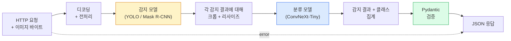

# 완전한 비전 파이프라인 구축 — 캡스톤

> 프로덕션 비전 시스템은 모델과 규칙이 데이터 계약으로 연결된 체인입니다. 이 단계의 구성 요소는 이미 준비되어 있으며, 캡스톤은 이를 엔드투엔드(end-to-end)로 연결합니다.

**유형:** Build
**언어:** Python
**선수 요건:** 4단계 01-15강
**시간:** 약 120분

## 학습 목표

- 객체를 감지하고 분류하며 구조화된 JSON을 생성하는 프로덕션 비전 파이프라인을 설계해 보세요. 모든 실패 경로가 처리되도록 구성합니다.
- 감지 모델(Mask R-CNN 또는 YOLO), 분류 모델(ConvNeXt-Tiny), 데이터 계약(Pydantic)을 하나의 서비스로 통합해 보세요.
- 엔드투엔드 파이프라인을 벤치마킹하고 첫 번째 병목 현상(보통 전처리, 그 다음 감지 모델)을 식별해 보세요.
- 이미지 업로드를 받아 파이프라인을 실행하고 분류된 감지 결과를 반환하는 최소한의 FastAPI 서비스를 출시해 보세요.

## 문제점

개별 비전 모델은 유용하지만, 비전 제품은 모델의 체인입니다. 소매 진열대 감사(shelf audit)는 감지 모델, 제품 분류 모델, 가격 OCR 파이프라인의 조합입니다. 자율 주행은 2D 감지 모델, 3D 감지 모델, 분할 모델(segmenter), 추적 모델(tracker), 계획 모델(planner)의 조합입니다. 의료 사전 스크리닝은 분할 모델, 지역 분류 모델, 임상의 UI의 조합입니다.

이러한 체인을 연결하는 것이 ML 프로토타입과 제품을 구분하는 부분입니다. 모델 간의 모든 인터페이스는 버그가 발생할 수 있는 새로운 지점입니다. 모든 좌표 변환, 모든 정규화, 모든 마스크 크기 조정은 조용한 실패(silent-failure)의 후보입니다. 파이프라인은 가장 약한 인터페이스만큼만 강합니다.

이 캡스톤은 최소한의 실행 가능한 파이프라인(감지 + 분류 + 구조화된 출력 + 서빙 레이어)을 설정합니다. 4단계의 나머지 요소는 이 뼈대에 들어맞습니다: Mask R-CNN을 YOLOv8로 교체하고, OCR 헤드를 추가하고, 분할 브랜치를 추가하고, 추적기를 추가합니다. 아키텍처는 안정적이며, 구성 요소는 교체(pluggable) 가능합니다.

## 개념

### 파이프라인



7단계입니다. 두 모델 단계는 비용이 많이 들며, 나머지 5단계는 버그가 발생하는 곳입니다.

### Pydantic을 활용한 데이터 계약

모든 모델 경계는 타입이 지정된 객체가 됩니다. 이를 통해 조용한 실패가 명확한 실패로 바뀝니다.

```
Detection(
    box: tuple[float, float, float, float],   # (x1, y1, x2, y2), 절대 픽셀
    score: float,                              # [0, 1]
    class_id: int,                             # 디텍터의 레이블 맵에서
    mask: Optional[list[list[int]]],           # 존재하는 경우 RLE 인코딩
)

PipelineResult(
    image_id: str,
    detections: list[Detection],
    classifications: list[Classification],
    inference_ms: float,
)
```

디텍터가 `(x1, y1, x2, y2)` 대신 `(cx, cy, w, h)`로 박스를 반환하면, Pydantic 검증이 경계에서 실패하며, 조용히 빈 영역을 반환하는 다운스트림 크롭을 디버깅하는 대신 즉시 문제를 발견할 수 있습니다.

### 레이턴시가 발생하는 위치

거의 모든 비전 파이프라인에서 세 가지 사실이 성립합니다:

1. **전처리(preprocessing)는 종종 가장 큰 단일 블록입니다.** JPEG 디코딩, 색상 공간 변환, 리사이징 — 이들은 CPU 바운드이며 잊기 쉽습니다.
2. **디텍터가 GPU 시간을 지배합니다.** GPU 시간의 70-90%는 디텍션 순전파(forward pass)에 있습니다.
3. **후처리(postprocessing) (NMS, RLE 인코딩/디코딩)는 GPU에서는 저렴하지만 CPU에서는 비쌉니다.** 항상 실제 타겟으로 프로파일링하세요.

분포를 아는 것은 최적화를 우선순위 목록으로 만듭니다.

### 실패 모드

- **빈 감지 결과** — 빈 리스트를 반환하고, 크래시하지 마세요. 로깅하세요.
- **경계 밖 박스** — 크롭하기 전에 이미지 크기로 클램프(clamp)하세요.
- **작은 크롭** — 분류기의 최소 입력보다 작은 박스에 대해서는 분류를 건너뛰세요.
- **손상된 업로드** — 500이 아닌, 특정 오류 코드가 포함된 400 응답을 반환하세요.
- **모델 로드 실패** — 첫 요청이 아닌, 서비스 시작 시에 실패하세요.

프로덕션 파이프라인은 실패를 숨기는 일반적인 `try/except`를 작성하지 않고도 각각의 경우를 처리합니다. 모든 실패는 이름이 지정된 코드와 응답을 가집니다.

### 배치 처리

프로덕션 서비스는 여러 클라이언트에 서비스를 제공합니다. 요청 간에 탐지 및 분류를 배치 처리하면 처리량이 증가합니다. 트레이드오프는 배치가 채워질 때까지 기다리는 추가 지연입니다. 일반적인 설정: 최대 20ms 동안 요청을 수집하고, 함께 배치 처리하며, 응답을 분배합니다. `torchserve` 및 `triton`는 이를 네이티브로 지원하며, 예측 가능한 부하를 가진 작은 서비스는 자체 마이크로 배치기를 구현합니다.

```figure
v4-vision-pipeline
```

## 구현하기

### 1단계: 데이터 계약

```python
from pydantic import BaseModel, Field
from typing import List, Optional, Tuple

class Detection(BaseModel):
    box: Tuple[float, float, float, float]
    score: float = Field(ge=0, le=1)
    class_id: int = Field(ge=0)
    mask_rle: Optional[str] = None


class Classification(BaseModel):
    detection_index: int
    class_id: int
    class_name: str
    score: float = Field(ge=0, le=1)


class PipelineResult(BaseModel):
    image_id: str
    detections: List[Detection]
    classifications: List[Classification]
    inference_ms: float
```

5초의 코딩이 중요한 파이프라인에서 1시간의 디버깅을 절약합니다.

### 2단계: 최소한의 Pipeline 클래스

```python
import time
import numpy as np
import torch
from PIL import Image

class VisionPipeline:
    def __init__(self, detector, classifier, class_names,
                 device="cpu", min_crop=32):
        self.detector = detector.to(device).eval()
        self.classifier = classifier.to(device).eval()
        self.class_names = class_names
        self.device = device
        self.min_crop = min_crop

    def preprocess(self, image):
        """
        image: PIL.Image or np.ndarray (H, W, 3) uint8
        returns: CHW float tensor on device
        """
        if isinstance(image, Image.Image):
            image = np.asarray(image.convert("RGB"))
        tensor = torch.from_numpy(image).permute(2, 0, 1).float() / 255.0
        return tensor.to(self.device)

    @torch.no_grad()
    def detect(self, image_tensor):
        return self.detector([image_tensor])[0]

    @torch.no_grad()
    def classify(self, crops):
        if len(crops) == 0:
            return []
        batch = torch.stack(crops).to(self.device)
        logits = self.classifier(batch)
        probs = logits.softmax(-1)
        scores, cls = probs.max(-1)
        return list(zip(cls.tolist(), scores.tolist()))

    def run(self, image, image_id="anonymous"):
        t0 = time.perf_counter()
        tensor = self.preprocess(image)
        det = self.detect(tensor)

        crops = []
        detections = []
        valid_indices = []
        for i, (box, score, cls) in enumerate(zip(det["boxes"], det["scores"], det["labels"])):
            x1, y1, x2, y2 = [max(0, int(b)) for b in box.tolist()]
            x2 = min(x2, tensor.shape[-1])
            y2 = min(y2, tensor.shape[-2])
            detections.append(Detection(
                box=(x1, y1, x2, y2),
                score=float(score),
                class_id=int(cls),
            ))
            if (x2 - x1) < self.min_crop or (y2 - y1) < self.min_crop:
                continue
            crop = tensor[:, y1:y2, x1:x2]
            crop = torch.nn.functional.interpolate(
                crop.unsqueeze(0),
                size=(224, 224),
                mode="bilinear",
                align_corners=False,
            )[0]
            crops.append(crop)
            valid_indices.append(i)

        class_preds = self.classify(crops)

        classifications = []
        for valid_idx, (cls_id, cls_score) in zip(valid_indices, class_preds):
            classifications.append(Classification(
                detection_index=valid_idx,
                class_id=int(cls_id),
                class_name=self.class_names[cls_id],
                score=float(cls_score),
            ))

        return PipelineResult(
            image_id=image_id,
            detections=detections,
            classifications=classifications,
            inference_ms=(time.perf_counter() - t0) * 1000,
        )
```

모든 인터페이스는 타입이 지정되어 있습니다. 모든 실패 경로에는 구체적인 처리 결정이 있습니다.

### 3단계: 탐지기와 분류기 연결

```python
from torchvision.models.detection import maskrcnn_resnet50_fpn_v2
from torchvision.models import convnext_tiny

# 학습 없이 현실적인 파이프라인을 위해 ImageNet 사전 학습 가중치를 사용하세요
detector = maskrcnn_resnet50_fpn_v2(weights="DEFAULT")
classifier = convnext_tiny(weights="DEFAULT")
class_names = [f"imagenet_class_{i}" for i in range(1000)]

pipe = VisionPipeline(detector, classifier, class_names)

# 합성 이미지로 스모크 테스트 수행
test_image = (np.random.rand(400, 600, 3) * 255).astype(np.uint8)
result = pipe.run(test_image, image_id="demo")
print(result.model_dump_json(indent=2)[:500])
```

### 4단계: FastAPI 서비스

```python
from fastapi import FastAPI, UploadFile, HTTPException
from io import BytesIO

app = FastAPI()
pipe = None  # 시작 시 초기화

@app.on_event("startup")
def load():
    global pipe
    detector = maskrcnn_resnet50_fpn_v2(weights="DEFAULT").eval()
    classifier = convnext_tiny(weights="DEFAULT").eval()
    pipe = VisionPipeline(detector, classifier, class_names=[f"c{i}" for i in range(1000)])

@app.post("/detect")
async def detect_endpoint(file: UploadFile):
    if file.content_type not in {"image/jpeg", "image/png", "image/webp"}:
        raise HTTPException(status_code=400, detail="unsupported image type")
    data = await file.read()
    try:
        img = Image.open(BytesIO(data)).convert("RGB")
    except Exception:
        raise HTTPException(status_code=400, detail="cannot decode image")
    result = pipe.run(img, image_id=file.filename or "upload")
    return result.model_dump()
```

`uvicorn main:app --host 0.0.0.0 --port 8000`로 실행하세요. `curl -F 'file=@dog.jpg' http://localhost:8000/detect`로 테스트하세요.

### 5단계: 파이프라인 벤치마킹

```python
import time

def benchmark(pipe, num_runs=20, image_size=(400, 600)):
    img = (np.random.rand(*image_size, 3) * 255).astype(np.uint8)
    pipe.run(img)  # 워밍업

    stages = {"preprocess": [], "detect": [], "classify": [], "total": []}
    for _ in range(num_runs):
        t0 = time.perf_counter()
        tensor = pipe.preprocess(img)
        t1 = time.perf_counter()
        det = pipe.detect(tensor)
        t2 = time.perf_counter()
        crops = []
        for box in det["boxes"]:
            x1, y1, x2, y2 = [max(0, int(b)) for b in box.tolist()]
            x2 = min(x2, tensor.shape[-1])
            y2 = min(y2, tensor.shape[-2])
            if (x2 - x1) >= pipe.min_crop and (y2 - y1) >= pipe.min_crop:
                crop = tensor[:, y1:y2, x1:x2]
                crop = torch.nn.functional.interpolate(
                    crop.unsqueeze(0), size=(224, 224), mode="bilinear", align_corners=False
                )[0]
                crops.append(crop)
        pipe.classify(crops)
        t3 = time.perf_counter()
        stages["preprocess"].append((t1 - t0) * 1000)
        stages["detect"].append((t2 - t1) * 1000)
        stages["classify"].append((t3 - t2) * 1000)
        stages["total"].append((t3 - t0) * 1000)

    for stage, times in stages.items():
        times.sort()
        print(f"{stage:12s}  p50={times[len(times)//2]:7.1f} ms  p95={times[int(len(times)*0.95)]:7.1f} ms")
```

CPU에서의 일반적인 출력: 전처리 ~3 ms, 탐지 300-500 ms, 분류 20-40 ms, 총 350-550 ms. GPU에서는 탐지가 20-40 ms이며, 전처리 + 분류가 상대적으로 더 중요해집니다.

## 사용하기

프로덕션 템플릿은 동일한 구조로 수렴하며, 추가로:

- **모델 버전 관리** — 항상 모델 이름과 가중치 해시를 응답에 기록하세요.
- **요청별 추적 ID** — 모든 요청의 모든 단계 타이밍을 기록하여 느린 응답을 단계와 상관관계 지을 수 있습니다.
- **폴백 경로** — 분류기가 시간 초과되면 전체 요청을 실패시키지 말고 분류 없이 탐지 결과만 반환하세요.
- **안전 필터** — NSFW / PII 필터는 분류 후, 응답이 서비스를 떠나기 전에 실행됩니다.
- **배치 엔드포인트** — 대량 처리를 위해 이미지 URL 목록을 받는 `/detect_batch`.

프로덕션 서빙을 위해 `torchserve`, `Triton Inference Server`, `BentoML`는 배치, 버전 관리, 지표 및 건강 검진을 기본으로 처리합니다. `FastAPI`를 직접 실행하는 것은 프로토타입 및 소규모 제품에는 적합합니다.

## 출시하기

이 강의는 다음을 생성합니다:

- `outputs/prompt-vision-service-shape-reviewer.md` — 비전 서비스의 코드에서 계약/응답 형식 위반을 검토하고 첫 번째 파괴적 버그를 식별하는 프롬프트입니다.
- `outputs/skill-pipeline-budget-planner.md` — 목표 지연 시간과 처리량에 따라 모든 파이프라인 단계에 시간 예산을 할당하고, 예산을 먼저 초과할 단계를 표시하는 스킬입니다.

## 연습 문제

1. **(쉬움)** 오픈 데이터셋의 이미지 10장에 대해 파이프라인을 실행하세요. 단계별 평균 시간과 이미지별 감지 수 분포를 보고해 보세요.
2. **(중간)** `Detection`에 마스크 출력 필드를 추가하고 RLE로 인코딩하세요. 10개 객체가 있는 이미지에서도 JSON이 1MB 미만으로 유지되는지 확인하세요.
3. **(어려움)** 분류기 앞에 마이크로배처를 추가하세요: 최대 10ms 동안 크롭을 수집하고, 단일 GPU 호출로 모두 분류한 후 요청별로 결과를 반환하세요. 초당 5개 동시 요청에서의 처리량 향상과 추가된 지연 시간을 측정하세요.

## 핵심 용어

| 용어 | 사람들이 말하는 표현 | 실제 의미 |
|------|----------------|----------------------|
| 파이프라인 | "시스템" | 전처리, 추론, 후처리 단계의 순서 있는 연결로, 각 쌍 사이에 타입이 지정된 인터페이스가 존재하는 구조 |
| 데이터 계약 | "스키마" | 모든 단계의 입력과 출력이 따르는 Pydantic / dataclass 정의; 경계에서 통합 버그를 잡아냅니다 |
| 전처리 | "모델 이전" | 디코딩, 색상 변환, 크기 조정, 정규화; 일반적으로 가장 큰 CPU 시간 소모 지점 |
| 후처리 | "모델 이후" | NMS, 마스크 크기 조정, 임계값, RLE 인코딩; GPU에서는 저렴하지만 CPU에서는 비용이 높음 |
| 마이크로배처 | "수집 후 전달" | 여러 요청을 위해 고정된 윈도우를 기다린 후 단일 배처드 순전파를 실행하는 집계기 |
| 추적 ID | "요청 ID" | 모든 단계에서 기록되는 요청별 식별자; 느린 요청을 엔드투엔드로 추적할 수 있음 |
| 실패 코드 | "명명된 오류" | 범용 500 대신 실패 클래스별 특정 오류 코드; 클라이언트 재시도 로직을 가능하게 함 |
| 헬스 체크 | "준비 상태 프로브" | 서비스가 응답할 수 있는지 보고하는 저렴한 엔드포인트; 로드밸런서가 이를 의존합니다 |

## 추가 읽기

- [Full Stack Deep Learning — Deploying Models](https://fullstackdeeplearning.com/course/2022/lecture-5-deployment/) — 프로덕션 ML 배포에 대한 표준 개요입니다
- [BentoML docs](https://docs.bentoml.com) — 배치 처리, 버전 관리, 메트릭을 지원하는 서빙 프레임워크
- [torchserve docs](https://pytorch.org/serve/) — PyTorch의 공식 서빙 라이브러리
- [NVIDIA Triton Inference Server](https://developer.nvidia.com/triton-inference-server) — 배치 처리 및 다중 모델 지원으로 높은 처리량 서빙
