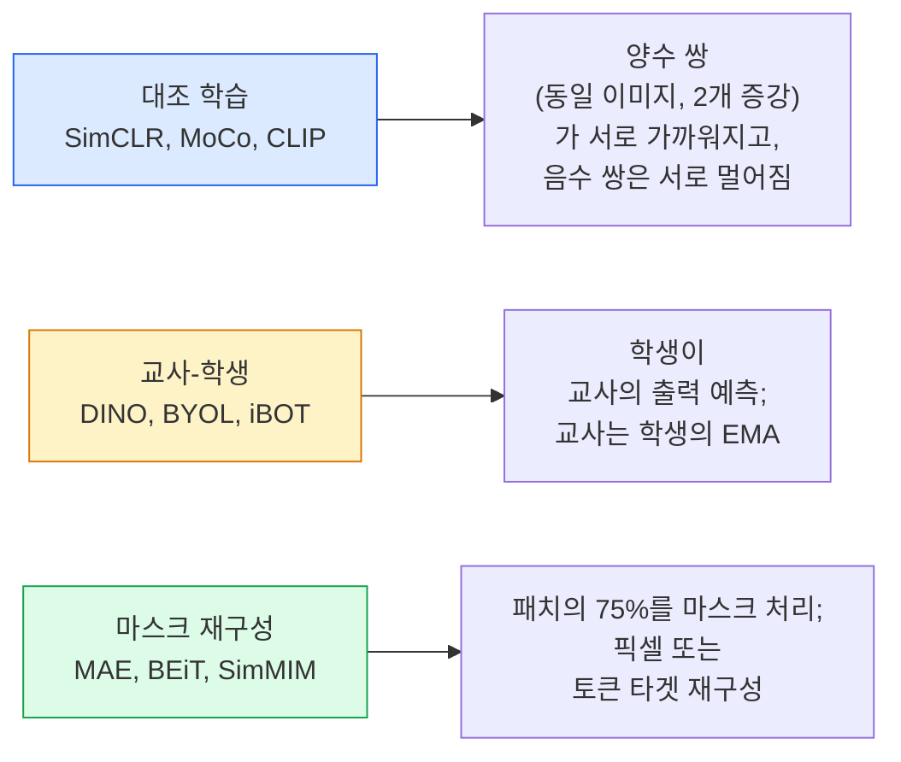

# 자기 지도 비전 — SimCLR, DINO, MAE

> 레이블은 지도 학습 비전의 병목입니다. 자기 지도 사전 학습은 레이블을 제거합니다: 1억 개의 레이블 없는 이미지에서 시각적 특징을 학습하고, 1만 개의 레이블이 있는 이미지로 미세 조정(Fine-tuning)을 수행합니다.

**유형:** Learn + Build
**언어:** Python
**선수 요건:** 4단계 04강 (이미지 분류), 4단계 14강 (비전 트랜스포머 (ViT)(Vision Transformer (ViT)))
**시간:** 약 75분

## 학습 목표

- 세 가지 주요 자기 지도 계열 — 대조 학습(Contrastive Learning) (SimCLR), 교사-학생(Teacher-Student) (DINO), 마스킹 재구성(Masked Reconstruction) (MAE) —을 추적하고 각각이 무엇을 최적화하는지 설명해 보세요
- InfoNCE 손실 함수를 처음부터 구현하고, 왜 배치 크기(batch size) 512는 작동하지만 32는 실패하는지 설명해 보세요
- MAE의 75% 마스킹 비율이 임의적이지 않은 이유와 텍스트에서 BERT의 15%와 어떻게 다른지 설명해 보세요
- 선형 프로빙(linear probing)과 제로샷(Zero-Shot) 검색을 위해 DINOv2 또는 MAE ImageNet 체크포인트(Checkpoint)를 사용해 보세요

## 문제점

지도 학습 ImageNet은 130만 개의 레이블이 있는 이미지를 포함하며, 주석 달기에 약 1,000만 달러가 소요되는 것으로 추정됩니다. 의료 및 산업 데이터셋은 더 작고 레이블을 달기가 훨씬 더 비쌉니다. 모든 비전 팀은 묻습니다: 값싼 레이블 없는 데이터(YouTube 프레임, 웹 크롤링, 웹캠 영상, 위성 스캔)로 사전 학습한 후, 작은 레이블이 있는 세트에서 미세 조정(Fine-tuning)할 수 있을까요?

자기 지도 학습이 답입니다. LAION이나 JFT로 학습된 현대적인 자기 지도 비전 트랜스포머(ViT)는 미세 조정(Fine-tuning) 시 지도 학습 ImageNet의 정확도에 도달하거나 이를 능가합니다. 또한 지도 학습 사전 학습보다 다운스트림 작업(검출, 분할, 깊이)으로 더 잘 전이됩니다. DINOv2 (Meta, 2023)와 MAE (Meta, 2022)는 전이 가능한 비전 특징을 위한 현재 생산 기본 설정입니다.

개념적 전환은 사전 작업(pretext task) — 모델이 학습해야 하는 것 —이 다운스트림 작업일 필요가 없다는 점입니다. 중요한 것은 모델이 유용한 특징을 학습하도록 강제하는 것입니다. 그레이스케일 이미지의 색상을 예측하거나, 이미지를 회전시키고 모델이 회전 각도를 분류하도록 요청하거나, 패치를 마스킹하고 재구성하는 것 — 모두 효과가 있었습니다. 확장 가능한 세 가지 접근법은 대조 학습(Contrastive Learning), 교사-학생 증류(Teacher-Student Distillation), 마스킹 재구성(Masked Reconstruction)입니다.

## 개념

### 세 가지 계열



### 대조 학습 (SimCLR)

이미지 하나를 가져와 두 개의 랜덤 증강을 적용하여 두 개의 뷰를 생성합니다. 두 뷰 모두 동일한 인코더와 투사 헤드(projection head)를 통과시킵니다. "이 두 임베딩은 가까워야 한다"와 "이 임베딩은 배치 내의 다른 모든 이미지 임베딩과 멀리 떨어져야 한다"는 손실 함수를 최소화합니다.

```
Loss for positive pair (z_i, z_j) among 2N views per batch:

   L_ij = -log( exp(sim(z_i, z_j) / tau) / sum_k in batch \ {i} exp(sim(z_i, z_k) / tau) )

sim = cosine similarity
tau = temperature (0.1 standard)
```

이것이 InfoNCE 손실입니다. 양수 쌍마다 많은 음수 쌍이 필요하므로 배치 크기가 중요합니다. SimCLR은 512-8192의 배치 크기가 필요합니다. MoCo는 음수 개수를 배치 크기와 분리하기 위해 과거 배치의 모멘텀 큐(momentum queue)를 도입했습니다.

### 교사-학생 (DINO)

동일한 아키텍처를 가진 두 개의 네트워크: 학생과 교사. 교사는 학생 가중치의 지수 이동 평균(EMA)입니다. 두 네트워크 모두 이미지의 증강된 뷰를 봅니다. 학생의 출력은 교사의 출력과 일치하도록 학습되며, 명시적인 음수 쌍은 없습니다.

```
loss = CE( student_output(view_1),  teacher_output(view_2) )
     + CE( student_output(view_2),  teacher_output(view_1) )

teacher_weights = m * teacher_weights + (1 - m) * student_weights   (m ≈ 0.996)
```

"상수 예측"으로 붕괴(collapse)되지 않는 이유: 교사의 출력은 중심화(centering, 차원별 평균 차감)되고 날카롭게(sharpening, 작은 온도로 나누기) 처리됩니다. 중심화는 한 차원이 지배하는 것을 방지하고, 날카롭게 처리하는 것은 출력이 균일하게 붕괴되는 것을 방지합니다.

DINO는 DINOv2가 142M개의 큐레이션된 이미지로 확장한 모델입니다. resulting features는 제로샷(zero-shot) 시각 검색 및 밀집 예측(dense prediction)의 현재 SOTA입니다.

### 마스크 재구성 (MAE)

ViT 입력의 패치 중 75%를 마스크 처리합니다. 가시적인 25%만 인코더를 통과시킵니다. 작은 디코더는 인코더의 출력과 마스크된 위치의 마스크 토큰을 받아 마스크된 패치의 픽셀을 재구성하도록 학습됩니다.

```
Encoder:  visible 25% of patches -> features
Decoder:  features + mask tokens at masked positions -> reconstructed pixels
Loss:     MSE between reconstructed and original pixels on masked patches only
```

MAE가 작동하도록 하는 주요 설계 선택:

- **75% 마스크 비율** — 높음. 인코더가 시맨틱 특징을 학습하도록 강제합니다. 25%를 재구성하는 것은 거의 자명합니다(인접 픽셀이 매우 상관되어 있어 CNN이 쉽게 해결할 수 있기 때문입니다).
- **비대칭 인코더/디코더** — 큰 ViT 인코더는 가시적인 패치만 보며, 작은 디코더(8층, 512차원)가 재구성 처리를 담당합니다. 단순한 BEiT보다 프리트레이닝이 3배 더 빠릅니다.
- **픽셀 공간 재구성 타겟** — BEiT의 토큰화된 타겟보다 단순하며 ViT에서 더 잘 작동합니다.

프리트레이닝 후 디코더는 버립니다. 인코더가 특징 추출기입니다.

### 왜 75%이고 15%가 아닌가

BERT는 토큰의 15%를 마스킹합니다. MAE는 75%를 마스킹합니다. 이 차이는 정보 밀도 때문입니다.

- 자연어는 토큰당 엔트로피가 높습니다. 토큰의 15%를 예측하는 것은 여전히 어려운데, 각 마스킹된 위치에는 많은 가능한 완성 후보가 있기 때문입니다.
- 이미지 패치는 엔트로피가 낮습니다. 마스킹되지 않은 이웃은 마스킹된 패치의 픽셀을 거의 정확히 결정하는 경우가 많습니다. 예측이 의미적 이해를 요구하려면 공격적으로 마스킹해야 합니다.

75%는 단순한 공간적 외삽으로 작업을 해결할 수 없을 만큼 높습니다. 인코더는 이미지 내용을 표현해야 합니다.

### 선형 프로브 평가

자기 지도 프리트레이닝 후, 표준 평가는 **선형 프로브**입니다. 인코더를 고정하고 ImageNet 레이블로 단일 선형 분류기를 상위에 학습합니다. top-1 정확도를 보고합니다.

- SimCLR ResNet-50: ~71% (2020)
- DINO ViT-S/16: ~77% (2021)
- MAE ViT-L/16: ~76% (2022)
- DINOv2 ViT-g/14: ~86% (2023)

선형 프로브는 특징 품질의 순수한 측정 지표입니다. 미세 조정은 보통 2-5점을 추가하지만 헤드 재학습의 효과도 섞입니다.

```figure
data-augmentation
```

## 구현하기

### 1단계: 두 뷰 증강 파이프라인

```python
import torch
import torchvision.transforms as T

two_view_train = lambda: T.Compose([
    T.RandomResizedCrop(96, scale=(0.2, 1.0)),
    T.RandomHorizontalFlip(),
    T.ColorJitter(0.4, 0.4, 0.4, 0.1),
    T.RandomGrayscale(p=0.2),
    T.ToTensor(),
])


class TwoViewDataset(torch.utils.data.Dataset):
    def __init__(self, base):
        self.base = base
        self.aug = two_view_train()

    def __len__(self):
        return len(self.base)

    def __getitem__(self, i):
        img, _ = self.base[i]
        v1 = self.aug(img)
        v2 = self.aug(img)
        return v1, v2
```

각 __getitem__는 같은 이미지의 두 증강된 뷰를 반환합니다. 레이블은 필요하지 않습니다.

### 2단계: InfoNCE 손실

```python
import torch.nn.functional as F

def info_nce(z1, z2, tau=0.1):
    """
    z1, z2: (N, D) L2-normalised embeddings of paired views
    """
    N, D = z1.shape
    z = torch.cat([z1, z2], dim=0)  # (2N, D)
    sim = z @ z.T / tau              # (2N, 2N)

    mask = torch.eye(2 * N, dtype=torch.bool, device=z.device)
    sim = sim.masked_fill(mask, float("-inf"))

    targets = torch.cat([torch.arange(N, 2 * N), torch.arange(0, N)]).to(z.device)
    return F.cross_entropy(sim, targets)
```

호출 전에 임베딩을 L2 정규화합니다. `tau=0.1`는 SimCLR 기본값입니다. 낮추면 손실이 더 날카로워지고 더 많은 음성이 필요합니다.

### 3단계: InfoNCE Sanity Check

```python
z1 = F.normalize(torch.randn(16, 32), dim=-1)
z2 = z1.clone()
loss_same = info_nce(z1, z2, tau=0.1).item()
z2_random = F.normalize(torch.randn(16, 32), dim=-1)
loss_random = info_nce(z1, z2_random, tau=0.1).item()
print(f"InfoNCE with identical pairs:  {loss_same:.3f}")
print(f"InfoNCE with random pairs:     {loss_random:.3f}")
```

동일한 쌍은 낮은 손실(큰 배치와 낮은 온도에서 0에 가까움)을 주어야 합니다. 랜덤 쌍은 16쌍 배치에서 log(2N-1) = ~log(31) = ~3.4를 주어야 합니다.

### 4단계: MAE 스타일 마스킹

```python
def random_mask_indices(num_patches, mask_ratio=0.75, seed=0):
    g = torch.Generator().manual_seed(seed)
    n_keep = int(num_patches * (1 - mask_ratio))
    perm = torch.randperm(num_patches, generator=g)
    visible = perm[:n_keep]
    masked = perm[n_keep:]
    return visible.sort().values, masked.sort().values


num_patches = 196
visible, masked = random_mask_indices(num_patches, mask_ratio=0.75)
print(f"visible: {len(visible)} / {num_patches}")
print(f"masked:  {len(masked)} / {num_patches}")
```

주어진 시드에 대해 단순하고, 빠르며, 결정적입니다. 실제 MAE 구현에서는 이를 배치 처리하고 샘플별 마스크를 유지합니다.

## 사용하기

DINOv2는 2026년 생산 표준입니다:

```python
import torch
from transformers import AutoImageProcessor, AutoModel

processor = AutoImageProcessor.from_pretrained("facebook/dinov2-base")
model = AutoModel.from_pretrained("facebook/dinov2-base")
model.eval()

# 제로샷 검색을 위한 이미지별 임베딩
with torch.no_grad():
    inputs = processor(images=[pil_image], return_tensors="pt")
    outputs = model(**inputs)
    embedding = outputs.last_hidden_state[:, 0]  # CLS 토큰
```

결과적으로 생성된 768차원 임베딩은 현대적인 이미지 검색, 밀집 대응(dense correspondence), 제로샷 전이 파이프라인의 백본입니다. 다운스트림 작업에 대한 미세 조정에는 선형 헤드(linear head) 이상은 거의 필요하지 않습니다.

이미지-텍스트 임베딩의 경우 SigLIP 또는 OpenCLIP가 동등한 선택지이며, MAE 스타일 미세 조정의 경우 `timm` 저장소는 모든 MAE 체크포인트를 제공합니다.

## 출시하기

이 강의는 다음을 생성합니다:

- `outputs/prompt-ssl-pretraining-picker.md` — 데이터셋 크기, 컴퓨팅 자원, 다운스트림 작업에 따라 SimCLR / MAE / DINOv2를 선택하는 프롬프트입니다.
- `outputs/skill-linear-probe-runner.md` — 동결된 인코더와 레이블이 지정된 데이터셋에 대해 선형 프로브(linear-probe) 평가를 작성하는 스킬입니다.

## 연습 문제

1. **(쉬움)** 잘 정렬된 임베딩의 경우 온도를 낮추면 InfoNCE 손실이 감소하고, 랜덤 임베딩의 경우 온도를 낮추면 손실이 증가함을 확인해 보세요. `tau in [0.05, 0.1, 0.2, 0.5]`와 손실의 관계를 그래프로 나타내 보세요.
2. **(중간)** DINO 스타일의 중심 버퍼(centre buffer)를 구현해 보세요. 중심화(centring)가 없으면 학생(student) 네트워크가 몇 에포크(epoch) 내에 상수 벡터로 붕괴(collapse)함을 보여 주세요.
3. **(어려움)** 10강의 TinyUNet을 백본으로 사용하여 CIFAR-100에서 MAE를 훈련하세요. 10, 50, 200 에포크에서의 선형 프로브(linear-probe) 정확도를 보고하세요. 동일한 1,000개 이미지 하위 집합에서 MAE 사전 훈련된 선형 프로브가 처음부터(scratch) 훈련된 지도 학습 선형 프로브보다 성능이 뛰어남을 보여 주세요.

## 핵심 용어

| 용어 | 사람들이 말하는 표현 | 실제 의미 |
|------|----------------|----------------------|
| 자기 지도 학습(Self-supervised) | "레이블 없는" | 레이블이 없는 데이터로부터 유용한 표현(representation)을 생성하는 사전 작업(pretext task) |
| 사전 작업(Pretext task) | "가짜 작업" | SSL 중 사용되는 목적 함수(패치 재구성, 뷰 매칭 등); 사전 훈련 후 폐기됨 |
| 선형 프로브(Linear probe) | "동결된 인코더 + 선형 헤드" | 표준 SSL 평가: 동결된 특징(features) 위에 선형 분류기만 훈련 |
| InfoNCE | "대조 손실(Contrastive loss)" | 코사인 유사도에 대한 softmax; 양의 쌍(positive pair)은 타겟 클래스이며, 나머지는 모두 음의 예시(negatives) |
| EMA 교사 | "이동 평균 교사" | 가중치가 학생의 지수 이동 평균인 교사; BYOL, MoCo, DINO에서 사용 |
| 마스크 비율 | "패치 숨김 비율" | MAE 중 마스크된 패치의 비율; 비전에서는 75%, 텍스트에서는 15% |
| 표현 붕괴 | "상수 출력" | 인코더가 모든 입력에 대해 상수 벡터를 출력하는 SSL 실패; 중심화, 날카롭게 하기(sharpening), 음의 예제를 통해 방지 |
| DINOv2 | "프로덕션 SSL 백본" | Meta의 2023년 자기 지도 ViT; 2026년 기준 가장 강력한 범용 이미지 특징 |

## 추가 읽기

- [SimCLR (Chen et al., 2020)](https://arxiv.org/abs/2002.05709) — 대조 학습 참고 자료
- [DINO (Caron et al., 2021)](https://arxiv.org/abs/2104.14294) — 모멘텀, 중심화, 날카롭게 하기(sharpening)가 적용된 교사-학생
- [MAE (He et al., 2022)](https://arxiv.org/abs/2111.06377) — ViT를 위한 마스크 오토인코더 사전 학습
- [DINOv2 (Oquab et al., 2023)](https://arxiv.org/abs/2304.07193) — 프로덕션 특징을 위한 자기 지도 ViT 확장
