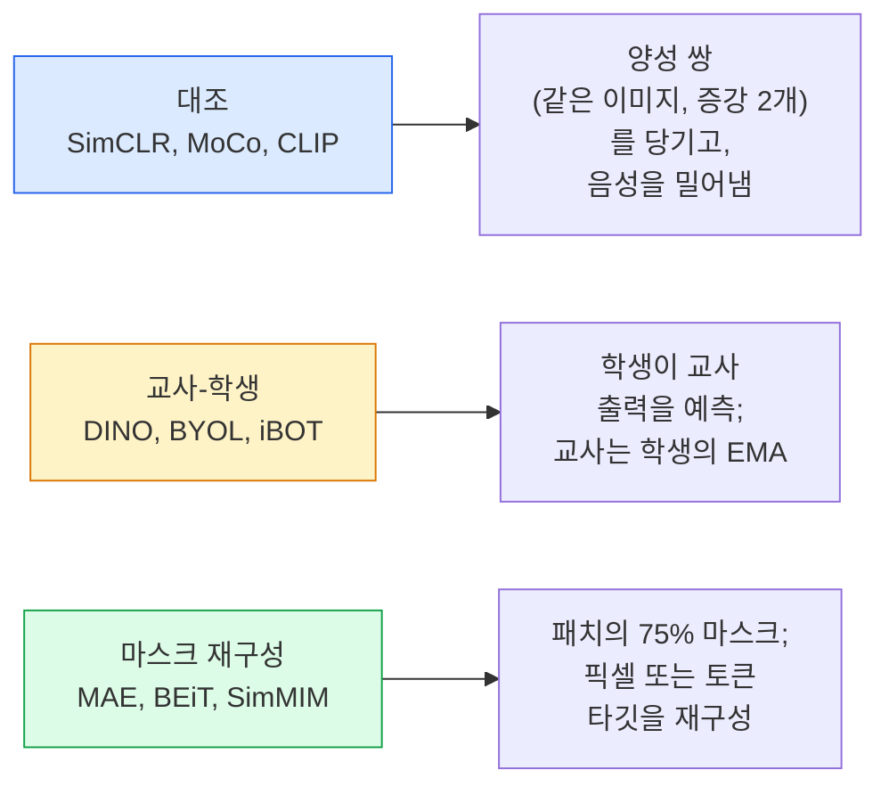

# 자기지도 비전 — SimCLR, DINO, MAE (Self-Supervised Vision — SimCLR, DINO, MAE)

> 라벨은 지도 비전의 병목입니다. 자기지도 사전학습이 이를 제거합니다. 라벨 없는 이미지 1억 장에서 시각 특징을 배우고, 라벨된 1만 장으로 파인튜닝합니다.

**Type:** Learn + Build
**Languages:** Python
**Prerequisites:** Phase 4 Lesson 04 (Image Classification), Phase 4 Lesson 14 (ViT)
**Time:** ~75 minutes

## 학습 목표 (Learning Objectives)

- 자기지도의 세 주요 계열 — 대조(SimCLR), 교사-학생(DINO), 마스크 재구성(MAE) — 을 추적하고 각각이 무엇을 최적화하는지 말합니다
- InfoNCE 손실을 처음부터 구현하고, 배치 512는 되고 32는 실패하는 이유를 설명합니다
- MAE의 75% 마스킹 비율이 임의가 아닌 이유와 텍스트용 BERT의 15%와 어떻게 다른지 설명합니다
- 선형 프로빙과 제로샷 검색에 DINOv2 또는 MAE ImageNet 체크포인트를 사용합니다

## 문제 상황 (The Problem)

지도 ImageNet은 라벨된 이미지 130만 장이며, 주석 비용은 약 $1,000만으로 추정됩니다. 의료·산업 데이터셋은 더 작고 라벨 비용은 더 큽니다. 모든 비전 팀이 묻습니다. 저렴한 비라벨 데이터 — YouTube 프레임, 웹 크롤, 웹캠, 위성 스윕 — 로 사전학습한 뒤 작은 라벨 세트로 파인튜닝할 수 있을까?

자기지도 학습이 답입니다. LAION이나 JFT로 학습한 현대 자기지도 ViT는 파인튜닝 시 지도 ImageNet 정확도에 도달하거나 넘어섭니다. 다운스트림 과제(탐지, 세그멘테이션, 깊이)로의 전이도 지도 사전학습보다 낫습니다. DINOv2(Meta, 2023)와 MAE(Meta, 2022)가 전이 가능 비전 특징의 현재 프로덕션 기본값입니다.

개념적 전환은 사전과제 — 모델이 학습 중 하는 일 — 가 다운스트림 과제일 필요가 없다는 것입니다. 유용한 특징을 배우도록 강제하면 됩니다. 그레이스케일 이미지의 색을 예측하고, 이미지를 회전해 회전을 분류하게 하고, 패치를 마스크하고 재구성합니다 — 모두 작동했습니다. 스케일하는 세 접근은 대조 학습, 교사-학생 증류, 마스크 재구성입니다.

## 핵심 개념 (The Concept)

### 세 계열



### 대조 학습 (SimCLR)

이미지 하나에 무작위 증강 두 개를 적용해 두 뷰를 만듭니다. 같은 인코더와 프로젝션 헤드에 둘 다 통과시킵니다. "이 두 임베딩은 가까워야 한다"와 "이 임베딩은 배치 안의 다른 모든 이미지 임베딩과 멀어야 한다"는 손실을 최소화합니다.

```
Loss for positive pair (z_i, z_j) among 2N views per batch:

   L_ij = -log( exp(sim(z_i, z_j) / tau) / sum_k in batch \ {i} exp(sim(z_i, z_k) / tau) )

sim = cosine similarity
tau = temperature (0.1 standard)
```

이것이 InfoNCE 손실입니다. 양성당 음성이 많아야 하므로 배치 크기가 중요합니다 — SimCLR은 512–8192가 필요합니다. MoCo는 과거 배치의 모멘텀 큐를 도입해 음성 수를 배치 크기에서 분리했습니다.

### 교사-학생 (DINO)

같은 아키텍처의 두 네트워크: 학생과 교사. 교사는 학생 가중치의 지수이동평균(EMA)입니다. 둘 다 이미지의 증강 뷰를 봅니다. 학생 출력이 교사와 맞도록 학습합니다 — 명시적 음성이 없습니다.

```
loss = CE( student_output(view_1),  teacher_output(view_2) )
     + CE( student_output(view_2),  teacher_output(view_1) )

teacher_weights = m * teacher_weights + (1 - m) * student_weights   (m ≈ 0.996)
```

"상수를 예측"으로 붕괴하지 않는 이유: 교사 출력을 중심화(차원별 평균을 뺌)하고 날카롭게(작은 온도로 나눔) 합니다. 중심화는 한 차원이 지배하지 못하게 하고, 날카로움은 출력이 균등으로 붕괴하지 못하게 합니다.

DINO를 큐레이션된 이미지 1억 4,200만 장으로 키운 것이 DINOv2입니다. 결과 특징은 제로샷 시각 검색과 밀집 예측의 현재 SOTA입니다.

### 마스크 재구성 (MAE)

ViT 입력 패치의 75%를 마스크합니다. 보이는 25%만 인코더에 통과시킵니다. 작은 디코더가 인코더 출력과 마스크 위치의 마스크 토큰을 받아, 마스크된 패치의 픽셀을 재구성하도록 학습합니다.

```
Encoder:  visible 25% of patches -> features
Decoder:  features + mask tokens at masked positions -> reconstructed pixels
Loss:     MSE between reconstructed and original pixels on masked patches only
```

MAE를 작동시키는 핵심 설계:

- **75% 마스크 비율** — 높습니다. 인코더가 의미 특징을 배우도록 강제합니다. 25%만 재구성하면 거의 자명합니다(이웃 픽셀이 너무 상관되어 CNN이 맞출 수 있음).
- **비대칭 인코더/디코더** — 큰 ViT 인코더는 보이는 패치만 보고, 작은 디코더(8층, 512차원)가 재구성을 담당합니다. 나이브 BEiT보다 사전학습이 3배 빠릅니다.
- **픽셀 공간 재구성 타깃** — BEiT의 토큰화 타깃보다 단순하고 ViT에서 더 잘 동작합니다.

사전학습 후 디코더는 버립니다. 인코더가 특징 추출기입니다.

### 왜 15%가 아니라 75%인가

BERT는 토큰의 15%를 마스크합니다. MAE는 75%를 마스크합니다. 차이는 정보 밀도입니다.

- 자연어는 토큰당 엔트로피가 높습니다. 토큰의 15%를 예측해도 각 마스크 위치에 그럴듯한 완성이 많아 여전히 어렵습니다.
- 이미지 패치는 엔트로피가 낮습니다 — 마스크되지 않은 이웃이 마스크된 패치 픽셀을 거의 정확히 결정하는 경우가 많습니다. 예측이 의미 이해를 요구하게 하려면 공격적으로 마스크해야 합니다.

75%는 단순 공간 외삽으로 과제를 풀 수 없을 만큼 높아, 인코더가 이미지 내용을 표현해야 합니다.

### 선형 프로브 평가

자기지도 사전학습 후 표준 평가는 **선형 프로브**입니다. 인코더를 동결하고 ImageNet 라벨 위에서 단일 선형 분류기만 학습합니다. top-1 정확도를 보고합니다.

- SimCLR ResNet-50: ~71% (2020)
- DINO ViT-S/16: ~77% (2021)
- MAE ViT-L/16: ~76% (2022)
- DINOv2 ViT-g/14: ~86% (2023)

선형 프로브는 특징 품질의 순수 측정입니다. 파인튜닝은 보통 2–5포인트를 더하지만 헤드 재학습 효과도 섞입니다.

```figure
data-augmentation
```

## 구현하기 (Build It)

### 1단계: 두 뷰 증강 파이프라인

```python
import torch
import torchvision.transforms as T

two_view_train = lambda: T.Compose([
    T.RandomResizedCrop(96, scale=(0.2, 1.0)),
    T.RandomHorizontalFlip(),
    T.ColorJitter(0.4, 0.4, 0.4, 0.1),
    T.RandomGrayscale(p=0.2),
    T.ToTensor(),
])


class TwoViewDataset(torch.utils.data.Dataset):
    def __init__(self, base):
        self.base = base
        self.aug = two_view_train()

    def __len__(self):
        return len(self.base)

    def __getitem__(self, i):
        img, _ = self.base[i]
        v1 = self.aug(img)
        v2 = self.aug(img)
        return v1, v2
```

각 __getitem__은 같은 이미지의 증강 뷰 두 개를 반환합니다. 라벨은 필요 없습니다.

### 2단계: InfoNCE 손실

```python
import torch.nn.functional as F

def info_nce(z1, z2, tau=0.1):
    """
    z1, z2: (N, D) L2-normalised embeddings of paired views
    """
    N, D = z1.shape
    z = torch.cat([z1, z2], dim=0)  # (2N, D)
    sim = z @ z.T / tau              # (2N, 2N)

    mask = torch.eye(2 * N, dtype=torch.bool, device=z.device)
    sim = sim.masked_fill(mask, float("-inf"))

    targets = torch.cat([torch.arange(N, 2 * N), torch.arange(0, N)]).to(z.device)
    return F.cross_entropy(sim, targets)
```

호출 전에 임베딩을 L2-정규화하세요. `tau=0.1`이 SimCLR 기본값입니다. 낮을수록 손실이 날카로워지고 음성이 더 필요합니다.

### 3단계: InfoNCE 건전성 검사

```python
z1 = F.normalize(torch.randn(16, 32), dim=-1)
z2 = z1.clone()
loss_same = info_nce(z1, z2, tau=0.1).item()
z2_random = F.normalize(torch.randn(16, 32), dim=-1)
loss_random = info_nce(z1, z2_random, tau=0.1).item()
print(f"InfoNCE with identical pairs:  {loss_same:.3f}")
print(f"InfoNCE with random pairs:     {loss_random:.3f}")
```

동일 쌍은 낮은 손실을 줘야 합니다(큰 배치와 차가운 온도에서 0에 가깝게). 무작위 쌍은 16쌍 배치에서 log(2N-1) = ~log(31) = ~3.4를 줘야 합니다.

### 4단계: MAE 스타일 마스킹

```python
def random_mask_indices(num_patches, mask_ratio=0.75, seed=0):
    g = torch.Generator().manual_seed(seed)
    n_keep = int(num_patches * (1 - mask_ratio))
    perm = torch.randperm(num_patches, generator=g)
    visible = perm[:n_keep]
    masked = perm[n_keep:]
    return visible.sort().values, masked.sort().values


num_patches = 196
visible, masked = random_mask_indices(num_patches, mask_ratio=0.75)
print(f"visible: {len(visible)} / {num_patches}")
print(f"masked:  {len(masked)} / {num_patches}")
```

단순하고 빠르며 주어진 시드에 대해 결정적입니다. 실제 MAE 구현은 이를 배칭하고 샘플별 마스크를 유지합니다.

## 실용 활용 (Use It)

2026년 프로덕션 표준은 DINOv2입니다.

```python
import torch
from transformers import AutoImageProcessor, AutoModel

processor = AutoImageProcessor.from_pretrained("facebook/dinov2-base")
model = AutoModel.from_pretrained("facebook/dinov2-base")
model.eval()

# Per-image embeddings for zero-shot retrieval
with torch.no_grad():
    inputs = processor(images=[pil_image], return_tensors="pt")
    outputs = model(**inputs)
    embedding = outputs.last_hidden_state[:, 0]  # CLS token
```

결과 768차원 임베딩이 현대 이미지 검색, 밀집 대응, 제로샷 전이 파이프라인의 백본입니다. 다운스트림 과제 파인튜닝은 선형 헤드 이상일 필요가 거의 없습니다.

이미지-텍스트 임베딩에는 SigLIP 또는 OpenCLIP이 등가입니다. MAE 스타일 파인튜닝에는 `timm` 저장소가 모든 MAE 체크포인트를 제공합니다.

## 배포할 산출물 (Ship It)

이 레슨이 만드는 것:

- `outputs/prompt-ssl-pretraining-picker.md` — 데이터셋 크기, 컴퓨트, 다운스트림 과제가 주어지면 SimCLR / MAE / DINOv2를 고르는 프롬프트.
- `outputs/skill-linear-probe-runner.md` — 임의의 동결 인코더 + 라벨 데이터셋에 대한 선형 프로브 평가를 쓰는 스킬.

## 연습 문제 (Exercises)

1. **(Easy)** 잘 정렬된 임베딩에서는 온도를 낮출 때 InfoNCE 손실이 떨어지고, 무작위 임베딩에서는 온도를 낮출 때 올라가는지 검증하세요. `tau in [0.05, 0.1, 0.2, 0.5]` vs 손실 플롯을 만드세요.
2. **(Medium)** DINO 스타일 중심 버퍼를 구현하세요. 중심화 없이 학생이 몇 에폭 안에 상수 벡터로 붕괴함을 보이세요.
3. **(Hard)** Lesson 10의 TinyUNet을 백본으로 CIFAR-100에서 MAE를 학습하세요. 10, 50, 200 에폭에서 선형 프로브 정확도를 보고하세요. 같은 1,000장 서브셋에서 MAE 사전학습 선형 프로브가 처음부터 지도 학습한 선형 프로브보다 낫음을 보이세요.

## 핵심 용어 (Key Terms)

| 용어 | 사람들이 말하는 것 | 실제 의미 |
|------|----------------|----------------------|
| Self-supervised | "라벨 없음" | 비라벨 데이터에서 유용한 표현을 만드는 사전과제 |
| Pretext task | "가짜 과제" | SSL 중 쓰는 목표(패치 재구성, 뷰 매칭); 사전학습 후 버림 |
| Linear probe | "동결 인코더 + 선형 헤드" | 표준 SSL 평가: 동결 특징 위에 선형 분류기만 학습 |
| InfoNCE | "대조 손실" | 코사인 유사도에 대한 softmax; 양성 쌍이 타깃 클래스, 나머지는 음성 |
| EMA teacher | "이동평균 교사" | 가중치가 학생의 지수이동평균인 교사; BYOL, MoCo, DINO가 사용 |
| Mask ratio | "가려진 패치 %" | MAE 중 마스크된 패치 비율; 비전 75%, 텍스트 15% |
| Representation collapse | "상수 출력" | 인코더가 모든 입력에 상수 벡터를 내는 SSL 실패; 중심화·날카로움·음성으로 방지 |
| DINOv2 | "프로덕션 SSL 백본" | Meta의 2023 자기지도 ViT; 2026년 가장 강한 범용 이미지 특징 |

## 더 읽을거리 (Further Reading)

- [SimCLR (Chen et al., 2020)](https://arxiv.org/abs/2002.05709) — 대조 학습 레퍼런스
- [DINO (Caron et al., 2021)](https://arxiv.org/abs/2104.14294) — 모멘텀, 중심화, 날카로움이 있는 교사-학생
- [MAE (He et al., 2022)](https://arxiv.org/abs/2111.06377) — ViT용 마스크 오토인코더 사전학습
- [DINOv2 (Oquab et al., 2023)](https://arxiv.org/abs/2304.07193) — 자기지도 ViT를 프로덕션 특징으로 스케일링
