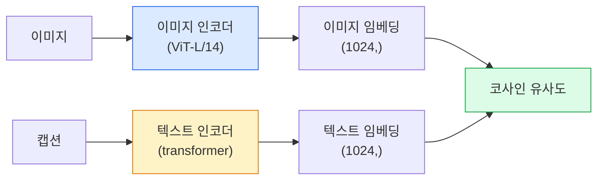

# 개방 어휘 비전 — CLIP (Open-Vocabulary Vision — CLIP)

> 이미지 인코더와 텍스트 인코더를 함께 학습해, 맞는 (이미지, 캡션) 쌍이 공유 공간의 같은 점에 놓이게 합니다. 트릭은 그것뿐입니다.

**Type:** Build + Use
**Languages:** Python
**Prerequisites:** Phase 4 Lesson 14 (ViT), Phase 4 Lesson 17 (Self-Supervised)
**Time:** ~45 minutes

## 학습 목표 (Learning Objectives)

- CLIP의 투 타워 아키텍처와 대조 학습 목표를 설명합니다
- 과제별 학습 없이 사전학습 CLIP(또는 SigLIP)로 제로샷 분류를 합니다
- 제로샷 분류를 처음부터 구현합니다: 클래스 프롬프트를 인코딩하고, 코사인 유사도를 계산하고, argmax를 취합니다
- CLIP, SigLIP, OpenCLIP, LLaVA/LLaMA-vision 모델을 구분합니다 — 2026년에 각각이 무엇을 위한 것인지

## 문제 상황 (The Problem)

전통 분류기는 폐쇄 어휘입니다. 1000클래스 ImageNet 모델은 1000개 라벨만 예측합니다. 새 범주마다 라벨 데이터와 재학습한 헤드가 필요합니다.

CLIP(Radford et al., OpenAI 2021)은 웹에서 긁은 (이미지, 캡션) 쌍 4억 개로 학습하면, 추론 시 자연어로만 기술된 임의의 범주 집합으로 분류할 수 있음을 보였습니다. 문장을 쓰면 새 클래스가 됩니다.

그 능력 — 제로샷 전이 — 이 모든 현대 비전 시스템이 CLIP 계열 체크포인트로 시작하는 이유입니다. 탐지(Grounding DINO, OWL-ViT), 세그멘테이션(CLIPSeg, SAM), 검색, 콘텐츠 모더레이션, VLM, 텍스트-이미지 생성은 모두 CLIP 스타일 공동 임베딩 위에 쌓입니다.

## 핵심 개념 (The Concept)

### 투 타워



두 인코더는 같은 임베딩 차원(CLIP-B/32는 512, CLIP-L/14는 1024)으로의 선형 프로젝션으로 끝납니다. L2-정규화하고 코사인 유사도를 계산합니다.

### 목표

N개의 (이미지, 캡션) 쌍 배치가 주어지면 NxN 유사도 행렬을 만듭니다. 대각(맞는 쌍)은 유사도가 높고 비대각(안 맞는 쌍)은 낮도록 두 인코더를 학습합니다.

```
sim_matrix = image_embeddings @ text_embeddings.T / tau

loss_i2t = cross_entropy(sim_matrix,       targets=arange(N))
loss_t2i = cross_entropy(sim_matrix.T,     targets=arange(N))
loss = (loss_i2t + loss_t2i) / 2
```

이미지→텍스트와 텍스트→이미지 검색이 모두 동작해야 하므로 대칭입니다. `tau`(온도)는 보통 스칼라 파라미터로 학습되며, 0.07로 초기화됩니다.

### SigLIP: 더 나은 손실

SigLIP(Zhai et al., 2023)은 softmax를 쌍별 sigmoid로 바꿨습니다.

```
loss = mean over pairs of log(1 + exp(-y_ij * sim_ij))
y_ij = +1 if matching, -1 otherwise
```

쌍별 손실은 CLIP이 요구하는 배치 수준 정규화를 제거합니다. SigLIP은 작은 배치에서도 잘 학습하고, 같은 데이터에서 CLIP과 맞먹거나 넘어섭니다.

### 제로샷 분류

학습된 CLIP이 주어지면:

1. 각 클래스에 프롬프트를 만듭니다: "a photo of a {class}".
2. 텍스트 인코더로 모든 클래스 프롬프트를 인코딩 -> `T` 모양 (C, d).
3. 테스트 이미지를 인코딩 -> `I` 모양 (1, d).
4. 유사도 = `I @ T.T` 모양 (1, C).
5. Argmax -> 예측 클래스.

프롬프트 엔지니어링이 중요합니다. OpenAI는 ImageNet용 프롬프트 템플릿 80개를 공개했습니다("a photo of a {}", "a blurry photo of a {}", "a sketch of a {}", ...). 클래스당 모든 템플릿 임베딩을 평균하면 top-1이 1–3% 더 올라갑니다.

### 2026년에 CLIP 스타일 모델이 쓰이는 곳

- **제로샷 분류** — 직접 사용.
- **이미지 검색** — 모든 이미지를 한 번 인코딩하고, 추론 시 쿼리를 임베딩.
- **텍스트 조건 탐지** — Grounding DINO, OWL-ViT가 CLIP 텍스트 타워를 탐지기 주위에 감쌉니다.
- **텍스트 조건 세그멘테이션** — CLIPSeg; SAM은 CLIP을 통해 텍스트 프롬프트 입력을 씁니다.
- **VLM** — LLaVA, Qwen-VL, InternVL이 CLIP 계열 비전 인코더를 LLM에 연결합니다.
- **텍스트-이미지 생성** — Stable Diffusion, DALL-E 3가 CLIP 텍스트 임베딩에 조건화합니다.

공유 임베딩 공간이 있으면 모든 비전+언어 과제가 거리 계산이 됩니다.

```figure
clip-contrastive
```

## 구현하기 (Build It)

### 1단계: 작은 투 타워 모델

실제 CLIP은 ViT + transformer입니다. 이 레슨에서는 CPU에서 학습 신호가 보이도록, 미리 추출한 특징 위의 작은 MLP가 타워입니다.

```python
import torch
import torch.nn as nn
import torch.nn.functional as F


class TwoTower(nn.Module):
    def __init__(self, img_in=128, txt_in=64, emb=64):
        super().__init__()
        self.image_proj = nn.Sequential(nn.Linear(img_in, 128), nn.ReLU(), nn.Linear(128, emb))
        self.text_proj = nn.Sequential(nn.Linear(txt_in, 128), nn.ReLU(), nn.Linear(128, emb))
        self.logit_scale = nn.Parameter(torch.ones([]) * 2.6592)  # ln(1/0.07)

    def forward(self, img_feats, txt_feats):
        i = F.normalize(self.image_proj(img_feats), dim=-1)
        t = F.normalize(self.text_proj(txt_feats), dim=-1)
        return i, t, self.logit_scale.exp()
```

두 프로젝션, 공유 차원 출력, 학습된 온도. 실제 CLIP API와 같은 형태입니다.

### 2단계: 대조 손실

```python
def clip_loss(image_emb, text_emb, logit_scale):
    N = image_emb.size(0)
    sim = logit_scale * image_emb @ text_emb.T
    targets = torch.arange(N, device=sim.device)
    l_i = F.cross_entropy(sim, targets)
    l_t = F.cross_entropy(sim.T, targets)
    return (l_i + l_t) / 2
```

대칭입니다. logit_scale이 높을수록 softmax가 날카로워지고 확신은 커지지만 불안정 위험이 있습니다.

### 3단계: 제로샷 분류기

```python
@torch.no_grad()
def zero_shot_classify(model, image_feats, class_text_feats, class_names):
    """
    image_feats:      (N, img_in)
    class_text_feats: (C, txt_in)   one averaged embedding per class
    """
    i = F.normalize(model.image_proj(image_feats), dim=-1)
    t = F.normalize(model.text_proj(class_text_feats), dim=-1)
    sim = i @ t.T
    pred = sim.argmax(dim=-1)
    return [class_names[p] for p in pred.tolist()]
```

단계당 한 줄. 프로덕션 CLIP 체크포인트와 정확히 같은 제로샷 절차입니다.

### 4단계: 건전성 검사

```python
torch.manual_seed(0)
model = TwoTower()

img = torch.randn(8, 128)
txt = torch.randn(8, 64)
i, t, scale = model(img, txt)
loss = clip_loss(i, t, scale)
print(f"batch size: {i.size(0)}   loss: {loss.item():.3f}")
```

무작위 초기화 모델에서 손실은 `log(N) = log(8) = 2.08`에 가까워야 합니다 — 아직 구조가 학습되지 않았을 때의 대칭 교차엔트로피 타깃입니다.

## 실용 활용 (Use It)

2026년 커뮤니티 기본값은 OpenCLIP입니다.

```python
import open_clip
import torch
from PIL import Image

model, _, preprocess = open_clip.create_model_and_transforms("ViT-B-32", pretrained="laion2b_s34b_b79k")
tokenizer = open_clip.get_tokenizer("ViT-B-32")

image = preprocess(Image.open("dog.jpg")).unsqueeze(0)
text = tokenizer(["a photo of a dog", "a photo of a cat", "a photo of a car"])

with torch.no_grad():
    image_features = model.encode_image(image)
    text_features = model.encode_text(text)
    image_features = image_features / image_features.norm(dim=-1, keepdim=True)
    text_features = text_features / text_features.norm(dim=-1, keepdim=True)
    probs = (100.0 * image_features @ text_features.T).softmax(dim=-1)

print(probs)
```

SigLIP은 더 새롭고 작은 스케일에서 더 잘 학습하며 새 작업에 선호됩니다: `google/siglip-base-patch16-224`. Hugging Face가 둘 다 제공합니다.

## 배포할 산출물 (Ship It)

이 레슨이 만드는 것:

- `outputs/prompt-zero-shot-class-picker.md` — 클래스 목록과 도메인이 주어지면 제로샷 CLIP용 클래스 템플릿을 설계하는 프롬프트.
- `outputs/skill-image-text-retriever.md` — 임의의 CLIP 체크포인트로 이미지 임베딩 인덱스를 만들고, 텍스트 쿼리와 이미지 쿼리를 지원하는 스킬.

## 연습 문제 (Exercises)

1. **(Easy)** 사전학습 OpenCLIP ViT-B/32와 80-템플릿 프롬프트 세트로 CIFAR-10에서 제로샷 분류를 하세요. top-1 정확도를 보고하세요. 약 85–90%여야 합니다.
2. **(Medium)** 같은 CIFAR-10 과제에서 단일 템플릿("a photo of a {}") vs 80-템플릿 평균 임베딩을 비교하세요. 격차를 수치화하고 템플릿이 돕는 이유를 설명하세요.
3. **(Hard)** 제로샷 이미지 검색 인덱스를 만드세요: CLIP으로 이미지 1,000장을 임베딩하고, FAISS 인덱스를 만들고, 자연어 설명으로 쿼리하세요. 손으로 쓴 홀드아웃 쿼리 20개에 대해 retrieval recall@5를 보고하세요.

## 핵심 용어 (Key Terms)

| 용어 | 사람들이 말하는 것 | 실제 의미 |
|------|----------------|----------------------|
| Two-tower | "듀얼 인코더" | 공유 차원 프로젝션 헤드로 끝나는 별도 이미지·텍스트 인코더 |
| Zero-shot | "과제별 학습 없음" | 추론 시 텍스트로만 기술된 클래스로 분류; 라벨을 건드리지 않음 |
| Temperature / logit_scale | "tau" | softmax 전에 유사도 행렬을 스케일하는 학습된 스칼라 |
| Prompt template | "A photo of a {}" | 클래스 이름 주위의 자연어 래퍼; 많은 템플릿을 평균하면 제로샷 정확도가 올라감 |
| CLIP | "이미지+텍스트 모델" | 2021 OpenAI 모델; 2026년 분야의 어휘 |
| SigLIP | "Sigmoid CLIP" | softmax를 쌍별 sigmoid로 교체; 작은 배치에서 더 잘 학습 |
| OpenCLIP | "오픈 재현" | LAION에서 커뮤니티가 학습한 CLIP 변형; 오픈소스 파이프라인의 프로덕션 기본값 |
| VLM | "비전-언어 모델" | CLIP 계열 인코더와 LLM을 합치고, 이미지에 대한 질문에 답하도록 학습 |

## 더 읽을거리 (Further Reading)

- [CLIP: Learning Transferable Visual Models from Natural Language Supervision (Radford et al., 2021)](https://arxiv.org/abs/2103.00020)
- [SigLIP: Sigmoid Loss for Language-Image Pre-Training (Zhai et al., 2023)](https://arxiv.org/abs/2303.15343)
- [OpenCLIP](https://github.com/mlfoundations/open_clip) — 커뮤니티 코드베이스
- [DINOv2 vs CLIP vs MAE: a features comparison](https://huggingface.co/blog/dinov2) — 나란히 비교한 HF 가이드
