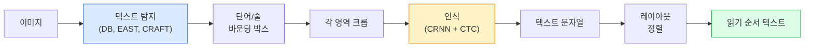

# OCR과 문서 이해 (OCR & Document Understanding)

> OCR은 세 단계 파이프라인입니다 — 텍스트 박스를 탐지하고, 문자를 인식하고, 레이아웃을 잡습니다. 모든 현대 OCR 시스템은 이 단계를 재배열하거나 병합합니다.

**Type:** Learn + Use
**Languages:** Python
**Prerequisites:** Phase 4 Lesson 06 (Detection), Phase 7 Lesson 02 (Self-Attention)
**Time:** ~45 minutes

## 학습 목표 (Learning Objectives)

- 고전 OCR 파이프라인(탐지 -> 인식 -> 레이아웃)과 현대 엔드투엔드 대안(Donut, Qwen-VL-OCR)을 추적합니다
- 시퀀스-투-시퀀스 OCR 학습을 위한 CTC(Connectionist Temporal Classification) 손실을 구현합니다
- 학습 없이 프로덕션 문서 파싱에 PaddleOCR 또는 EasyOCR을 사용합니다
- OCR, 레이아웃 파싱, 문서 이해를 구분하고 — 과제마다 올바른 도구를 고릅니다

## 문제 상황 (The Problem)

텍스트가 가득한 이미지는 어디에나 있습니다. 영수증, 송장, ID, 스캔된 책, 양식, 화이트보드, 간판, 스크린샷. 여기서 구조화된 데이터를 뽑는 것 — 문자만이 아니라 "이것이 합계 금액이다" — 은 가장 가치 높은 응용 비전 문제 중 하나입니다.

분야는 세 기술 계층으로 나뉩니다.

1. **OCR 본연**: 픽셀을 텍스트로.
2. **레이아웃 파싱**: OCR 출력을 영역(제목, 본문, 표, 헤더)으로 묶기.
3. **문서 이해**: 레이아웃에서 구조화 필드("invoice_total = $42.50")를 추출.

각 계층에 고전·현대 접근이 있고, "이미지에서 텍스트가 필요하다"와 "이 영수증에서 합계가 필요하다" 사이의 격차는 대부분 팀이 생각하는 것보다 큽니다.

## 핵심 개념 (The Concept)

### 고전 파이프라인



- **텍스트 탐지**는 줄별 또는 단어별 사각형을 만듭니다.
- **인식**은 각 영역을 고정 높이로 크롭하고, CNN + BiLSTM + CTC로 문자 시퀀스를 만듭니다.
- **레이아웃**은 읽기 순서를 재구성합니다(라틴어권은 위→아래, 왼→오; 아랍어·일본어는 다름).

### 한 단락으로 보는 CTC

OCR 인식은 고정 길이 특징 맵에서 가변 길이 시퀀스를 만듭니다. CTC(Graves et al., 2006)는 문자 수준 정렬 없이 이를 학습하게 합니다. 모델은 매 시간 단계에서 (어휘 + blank)에 대한 분포를 내고, CTC 손실은 반복을 합치고 blank를 제거한 뒤 타깃 텍스트로 줄여지는 모든 정렬에 대해 주변화합니다.

```
raw output: "h h h _ _ e e l l _ l l o _ _"
after merge repeats and remove blanks: "hello"
```

CTC가 2015년 CRNN이 동작한 이유이며, 2026년에도 대부분 프로덕션 OCR 모델을 학습시킵니다.

### 현대 엔드투엔드 모델

- **Donut** (Kim et al., 2022) — ViT 인코더 + 텍스트 디코더; 이미지를 읽고 JSON을 직접 냅니다. 텍스트 탐지기·레이아웃 모듈이 없습니다.
- **TrOCR** — 줄 수준 OCR용 ViT + transformer 디코더.
- **Qwen-VL-OCR / InternVL** — OCR 과제에 파인튜닝된 풀 비전-언어 모델; 2026년 복잡한 문서에서 정확도가 최고입니다.
- **PaddleOCR** — 성숙한 프로덕션 패키지의 고전 DB + CRNN 파이프라인; 여전히 오픈소스 주력입니다.

엔드투엔드 모델은 데이터와 컴퓨트가 더 필요하지만 다단계 파이프라인의 오류 누적을 건너뜁니다.

### 레이아웃 파싱

구조화 문서에는 각 영역에 Title, Paragraph, Figure, Table, Footnote 라벨을 붙이는 레이아웃 탐지기(LayoutLMv3, DocLayNet)를 돌립니다. 읽기 순서는 "레이아웃 순서로 영역을 순회하며 이어 붙이기"가 됩니다.

양식에는 **키-값 추출** 모델(시각적으로 풍부한 문서는 Donut, 일반 스캔은 LayoutLMv3)을 씁니다. 이미지 + 탐지된 텍스트 + 위치를 받아 구조화된 키-값 쌍을 예측합니다.

### 평가 지표

- **Character Error Rate (CER)** — 레벤슈타인 거리 / 참조 길이. 낮을수록 좋습니다. 프로덕션 목표: 깨끗한 스캔에서 < 2%.
- **Word Error Rate (WER)** — 같은 것을 단어 수준에서.
- **구조화 필드의 F1** — 키-값 과제용; `{invoice_total: 42.50}`이 올바르게 나타나는지 측정.
- **JSON의 편집 거리** — 엔드투엔드 문서 파싱용; Donut 논문이 정규화된 트리 편집 거리를 도입했습니다.

```figure
cv3-ctc-collapse
```

## 구현하기 (Build It)

### 1단계: CTC 손실 + 그리디 디코더

```python
import torch
import torch.nn as nn
import torch.nn.functional as F


def ctc_loss(log_probs, targets, input_lengths, target_lengths, blank=0):
    """
    log_probs:      (T, N, C) log-softmax over vocab including blank at index 0
    targets:        (N, S) int targets (no blanks)
    input_lengths:  (N,) per-sample time steps used
    target_lengths: (N,) per-sample target length
    """
    return F.ctc_loss(log_probs, targets, input_lengths, target_lengths,
                      blank=blank, reduction="mean", zero_infinity=True)


def greedy_ctc_decode(log_probs, blank=0):
    """
    log_probs: (T, N, C) log-softmax
    returns: list of index sequences (blanks removed, repeats merged)
    """
    preds = log_probs.argmax(dim=-1).transpose(0, 1).cpu().tolist()
    out = []
    for seq in preds:
        decoded = []
        prev = None
        for idx in seq:
            if idx != prev and idx != blank:
                decoded.append(idx)
            prev = idx
        out.append(decoded)
    return out
```

`F.ctc_loss`는 가능하면 효율적인 CuDNN 구현을 씁니다. 그리디 디코더는 빔 서치보다 단순하고 보통 CER이 1% 이내로 가깝습니다.

### 2단계: Tiny CRNN 인식기

줄 OCR용 최소 CNN + BiLSTM.

```python
class TinyCRNN(nn.Module):
    def __init__(self, vocab_size=40, hidden=128, feat=32):
        super().__init__()
        self.cnn = nn.Sequential(
            nn.Conv2d(1, feat, 3, 1, 1), nn.BatchNorm2d(feat), nn.ReLU(inplace=True),
            nn.MaxPool2d(2),
            nn.Conv2d(feat, feat * 2, 3, 1, 1), nn.BatchNorm2d(feat * 2), nn.ReLU(inplace=True),
            nn.MaxPool2d(2),
            nn.Conv2d(feat * 2, feat * 4, 3, 1, 1), nn.BatchNorm2d(feat * 4), nn.ReLU(inplace=True),
            nn.MaxPool2d((2, 1)),
            nn.Conv2d(feat * 4, feat * 4, 3, 1, 1), nn.BatchNorm2d(feat * 4), nn.ReLU(inplace=True),
            nn.MaxPool2d((2, 1)),
        )
        self.rnn = nn.LSTM(feat * 4, hidden, bidirectional=True, batch_first=True)
        self.head = nn.Linear(hidden * 2, vocab_size)

    def forward(self, x):
        # x: (N, 1, H, W)
        f = self.cnn(x)                # (N, C, H', W')
        f = f.mean(dim=2).transpose(1, 2)  # (N, W', C)
        h, _ = self.rnn(f)
        return F.log_softmax(self.head(h).transpose(0, 1), dim=-1)  # (W', N, vocab)
```

고정 높이 입력(CNN이 높이를 1로 max-pool). 너비가 CTC의 시간 차원입니다.

### 3단계: 합성 OCR

엔드투엔드 스모크 테스트용 흰-on-화이트 숫자 문자열을 생성합니다.

```python
import numpy as np

def synthetic_line(text, height=32, char_width=16):
    W = char_width * len(text)
    img = np.ones((height, W), dtype=np.float32)
    for i, c in enumerate(text):
        x = i * char_width
        shade = 0.0 if c.isalnum() else 0.5
        img[6:height - 6, x + 2:x + char_width - 2] = shade
    return img


def build_batch(strings, vocab):
    H = 32
    W = 16 * max(len(s) for s in strings)
    imgs = np.ones((len(strings), 1, H, W), dtype=np.float32)
    target_lengths = []
    targets = []
    for i, s in enumerate(strings):
        imgs[i, 0, :, :16 * len(s)] = synthetic_line(s)
        ids = [vocab.index(c) for c in s]
        targets.extend(ids)
        target_lengths.append(len(ids))
    return torch.from_numpy(imgs), torch.tensor(targets), torch.tensor(target_lengths)


vocab = ["_"] + list("0123456789abcdefghijklmnopqrstuvwxyz")
imgs, targets, lengths = build_batch(["hello", "world"], vocab)
print(f"images: {imgs.shape}   targets: {targets.shape}   lengths: {lengths.tolist()}")
```

실제 OCR 데이터셋은 폰트, 노이즈, 회전, 블러, 색을 더합니다. 위 파이프라인은 동일합니다.

### 4단계: 학습 스케치

```python
model = TinyCRNN(vocab_size=len(vocab))
opt = torch.optim.Adam(model.parameters(), lr=1e-3)

for step in range(200):
    strings = ["abc" + str(step % 10)] * 4 + ["xyz" + str((step + 1) % 10)] * 4
    imgs, targets, target_lens = build_batch(strings, vocab)
    log_probs = model(imgs)  # (W', 8, vocab)
    input_lens = torch.full((8,), log_probs.size(0), dtype=torch.long)
    loss = ctc_loss(log_probs, targets, input_lens, target_lens, blank=0)
    opt.zero_grad(); loss.backward(); opt.step()
```

이 자명한 합성 데이터에서 손실은 200스텝에 걸쳐 ~3에서 ~0.2로 떨어져야 합니다.

## 실용 활용 (Use It)

프로덕션 경로 세 가지:

- **PaddleOCR** — 성숙하고 빠르며 다국어. 한 줄 사용: `paddleocr.PaddleOCR(lang="en").ocr(image_path)`.
- **EasyOCR** — Python 네이티브, 다국어, PyTorch 백본.
- **Tesseract** — 고전; 모델이 어려워하는 오래된 스캔 문서에 여전히 유용합니다.

엔드투엔드 문서 파싱에는 Donut 또는 VLM을 쓰세요.

```python
from transformers import DonutProcessor, VisionEncoderDecoderModel

processor = DonutProcessor.from_pretrained("naver-clova-ix/donut-base-finetuned-cord-v2")
model = VisionEncoderDecoderModel.from_pretrained("naver-clova-ix/donut-base-finetuned-cord-v2")
```

반복 구조의 영수증·송장·양식에는 Donut을 파인튜닝하세요. 임의 문서나 추론이 있는 OCR에는 Qwen-VL-OCR 같은 VLM이 현재 기본값입니다.

## 배포할 산출물 (Ship It)

이 레슨이 만드는 것:

- `outputs/prompt-ocr-stack-picker.md` — 문서 유형, 언어, 구조가 주어지면 Tesseract / PaddleOCR / Donut / VLM-OCR을 고르는 프롬프트.
- `outputs/skill-ctc-decoder.md` — 길이 정규화를 포함해 그리디와 빔 서치 CTC 디코더를 처음부터 쓰는 스킬.

## 연습 문제 (Exercises)

1. **(Easy)** 5자리 무작위 숫자 문자열로 TinyCRNN을 500스텝 학습하세요. 홀드아웃 세트의 CER을 보고하세요.
2. **(Medium)** 그리디 디코딩을 빔 서치(beam_width=5)로 바꾸세요. CER 델타를 보고하세요. 어떤 입력에서 빔 서치가 이기나요?
3. **(Hard)** 영수증 20장에 PaddleOCR을 쓰고, 라인 아이템을 추출하고, {item_name, price} 쌍에 대해 손라벨 정답과 F1을 계산하세요.

## 핵심 용어 (Key Terms)

| 용어 | 사람들이 말하는 것 | 실제 의미 |
|------|----------------|----------------------|
| OCR | "픽셀에서 텍스트" | 이미지 영역을 문자 시퀀스로 바꾸는 것 |
| CTC | "정렬 없는 손실" | 타임스텝별 라벨 없이 시퀀스 모델을 학습하는 손실; 정렬에 대해 주변화 |
| CRNN | "고전 OCR 모델" | Conv 특징 추출기 + BiLSTM + CTC; 2015 베이스라인이 여전히 프로덕션에 쓰임 |
| Donut | "엔드투엔드 OCR" | ViT 인코더 + 텍스트 디코더; 이미지에서 JSON을 직접 냄 |
| Layout parsing | "영역 찾기" | 문서에서 Title/Table/Figure/Paragraph 영역을 탐지하고 라벨링 |
| Reading order | "텍스트 시퀀스" | 인식된 영역을 문장으로 정렬; 라틴어권은 자명, 혼합 레이아웃은 비자명 |
| CER / WER | "오류율" | 문자 또는 단어 단위의 레벤슈타인 거리 / 참조 길이 |
| VLM-OCR | "읽는 LLM" | OCR 과제에 학습되거나 프롬프트된 비전-언어 모델; 복잡한 문서의 현재 SOTA |

## 더 읽을거리 (Further Reading)

- [CRNN (Shi et al., 2015)](https://arxiv.org/abs/1507.05717) — 원조 CNN+RNN+CTC 아키텍처
- [CTC (Graves et al., 2006)](https://www.cs.toronto.edu/~graves/icml_2006.pdf) — 원조 CTC 논문; 알고리즘 아이디어로 빽빽함
- [Donut (Kim et al., 2022)](https://arxiv.org/abs/2111.15664) — OCR 없는 문서 이해 트랜스포머
- [PaddleOCR](https://github.com/PaddlePaddle/PaddleOCR) — 오픈소스 프로덕션 OCR 스택
