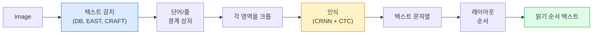

# OCR 및 문서 이해

> OCR은 텍스트 상자를 감지하고, 문자를 인식한 후, 이를 배치하는 3단계 파이프라인입니다. 모든 최신 OCR 시스템은 이 단계들의 순서를 재배열하거나 병합합니다.

**유형:** 학습 + 사용
**언어:** Python
**선수 요건:** 4단계 06강 (감지), 7단계 02강 (셀프 어텐션)
**시간:** 약 45분

## 학습 목표

- 고전적인 OCR 파이프라인(감지 -> 인식 -> 배치)과 최신 엔드투엔드 대안(Donut, Qwen-VL-OCR)을 추적해 보세요
- 시퀀스 투 시퀀스 OCR 학습을 위해 CTC (연결주의 시간 분류)(Connectionist Temporal Classification) 손실 함수를 구현해 보세요
- 학습 없이 PaddleOCR 또는 EasyOCR을 사용하여 프로덕션 문서 파싱을 수행해 보세요
- OCR, 레이아웃 파싱, 문서 이해를 구분하고, 작업에 맞는 적절한 도구를 선택해 보세요

## 문제점

텍스트가 가득한 이미지는 어디에나 있습니다: 영수증, 청구서, 신분증, 스캔된 책, 양식, 화이트보드, 표지판, 스크린샷. 이러한 이미지에서 구조화된 데이터를 추출하는 것 — 문자뿐만 아니라 "이것이 총 금액이다"라는 것을 파악하는 것 —은 가장 가치 있는 응용 비전 문제 중 하나입니다.

이 분야는 세 가지 기술 계층으로 나뉩니다:

1. **OCR 그 자체**: 픽셀을 텍스트로 변환합니다.
2. **레이아웃 파싱**: OCR 출력을 영역(제목, 본문, 표, 헤더)으로 그룹화합니다.
3. **문서 이해**: 레이아웃에서 구조화된 필드("invoice_total = $42.50")를 추출합니다.

각 계층에는 고전적인 접근법과 최신 접근법이 있으며, "이미지에서 텍스트를 얻고 싶다"와 "이 영수증에서 총 금액이 필요하다" 사이의 간격은 대부분의 팀이 인식하는 것보다 훨씬 큽니다.

## 개념

### 고전적인 파이프라인



- **텍스트 감지**는 줄 단위 또는 단어 단위 사각형(quadrilaterals)을 생성합니다.
- **인식**은 각 영역을 고정된 높이로 크롭하고, CNN + BiLSTM + CTC를 실행하여 문자 시퀀스를 생성합니다.
- **레이아웃**은 읽기 순서를 재구성합니다 (라틴 문자는 위에서 아래로, 왼쪽에서 오른쪽으로; 아랍어, 일본어는 다름).

### CTC를 한 단락으로 설명

OCR 인식은 고정된 길이의 특징 맵에서 가변 길이의 시퀀스를 생성합니다. CTC (Graves et al., 2006)는 문자 단위 정렬 없이 이를 학습할 수 있게 해줍니다. 모델은 모든 시간 단계에서 (어휘 + 공백)에 대한 분포를 출력합니다; CTC 손실은 반복을 병합하고 공백을 제거한 후 대상 텍스트로 줄어드는 모든 정렬에 대해 주변화(marginalises)합니다.

```
raw output: "h h h _ _ e e l l _ l l o _ _"
after merge repeats and remove blanks: "hello"
```

CTC는 CRNN이 2015년에 작동했고 2026년에도 대부분의 생산용 OCR 모델을 학습시키는 이유입니다.

### 현대적인 엔드투엔드 모델

- **Donut** (Kim et al., 2022) — ViT 인코더 + 텍스트 디코더; 이미지를 읽고 JSON을 직접 출력합니다. 텍스트 감지기가 없고, 레이아웃 모듈도 없습니다.
- **TrOCR** — 라인 단위 OCR을 위한 ViT + 트랜스포머 디코더.
- **Qwen-VL-OCR / InternVL** — OCR 작업에 미세 조정된 완전한 비전-언어 모델; 2026년 복잡한 문서에서 가장 높은 정확도를 보입니다.
- **PaddleOCR** — 성숙한 생산 패키지에서의 고전적인 DB + CRNN 파이프라인; 여전히 오픈소스 주력 도구입니다.

엔드투엔드 모델은 더 많은 데이터와 컴퓨팅이 필요하지만, 다단계 파이프라인의 오류 누적은 건너뜁니다.

### 레이아웃 파싱

구조화된 문서의 경우, 각 영역에 Title, Paragraph, Figure, Table, Footnote 레이블을 붙이는 레이아웃 감지기 (LayoutLMv3, DocLayNet)를 실행합니다. 읽기 순서는 "레이아웃 순서로 영역을 반복하고 연결"하는 것이 됩니다.

양식의 경우, **키-값 추출** 모델 (시각적으로 풍부한 문서에는 Donut, 평면 스캔에는 LayoutLMv3)을 사용합니다. 이들은 이미지 + 감지된 텍스트 + 위치를 입력으로 받아 구조화된 키-값 쌍을 예측합니다.

### 평가 지표

- **문자 오류율 (CER)** — 레벤슈타인 거리 / 참조 길이. 낮을수록 좋습니다. 생산 목표: 깨끗한 스캔에서 < 2%.
- **단어 오류율 (WER)** — 단어 수준에서 동일합니다.
- **구조화된 필드에 대한 F1** — 키-값 작업용; `{invoice_total: 42.50}`이 올바르게 나타나는지 측정합니다.
- **JSON의 편집 거리** — 문서 전체 파싱에 사용; Donut 논문은 정규화된 트리 편집 거리를 도입했습니다.

```figure
cv3-ctc-collapse
```

## 구현하기

### 1단계: CTC 손실 + 그리디 디코더

```python
import torch
import torch.nn as nn
import torch.nn.functional as F


def ctc_loss(log_probs, targets, input_lengths, target_lengths, blank=0):
    """
    log_probs:      (T, N, C) log-softmax over vocab including blank at index 0
    targets:        (N, S) int targets (no blanks)
    input_lengths:  (N,) per-sample time steps used
    target_lengths: (N,) per-sample target length
    """
    return F.ctc_loss(log_probs, targets, input_lengths, target_lengths,
                      blank=blank, reduction="mean", zero_infinity=True)


def greedy_ctc_decode(log_probs, blank=0):
    """
    log_probs: (T, N, C) log-softmax
    returns: list of index sequences (blanks removed, repeats merged)
    """
    preds = log_probs.argmax(dim=-1).transpose(0, 1).cpu().tolist()
    out = []
    for seq in preds:
        decoded = []
        prev = None
        for idx in seq:
            if idx != prev and idx != blank:
                decoded.append(idx)
            prev = idx
        out.append(decoded)
    return out
```

`F.ctc_loss`는 사용 가능한 경우 효율적인 CuDNN 구현을 사용합니다. 그리디 디코더는 빔 서치보다 단순하며, 보통 CER가 빔 서치와 1% 이내로 차이가 납니다.

### 2단계: 소형 CRNN 인식기

라인 OCR을 위한 최소한의 CNN + BiLSTM입니다.

```python
class TinyCRNN(nn.Module):
    def __init__(self, vocab_size=40, hidden=128, feat=32):
        super().__init__()
        self.cnn = nn.Sequential(
            nn.Conv2d(1, feat, 3, 1, 1), nn.BatchNorm2d(feat), nn.ReLU(inplace=True),
            nn.MaxPool2d(2),
            nn.Conv2d(feat, feat * 2, 3, 1, 1), nn.BatchNorm2d(feat * 2), nn.ReLU(inplace=True),
            nn.MaxPool2d(2),
            nn.Conv2d(feat * 2, feat * 4, 3, 1, 1), nn.BatchNorm2d(feat * 4), nn.ReLU(inplace=True),
            nn.MaxPool2d((2, 1)),
            nn.Conv2d(feat * 4, feat * 4, 3, 1, 1), nn.BatchNorm2d(feat * 4), nn.ReLU(inplace=True),
            nn.MaxPool2d((2, 1)),
        )
        self.rnn = nn.LSTM(feat * 4, hidden, bidirectional=True, batch_first=True)
        self.head = nn.Linear(hidden * 2, vocab_size)

    def forward(self, x):
        # x: (N, 1, H, W)
        f = self.cnn(x)                # (N, C, H', W')
        f = f.mean(dim=2).transpose(1, 2)  # (N, W', C)
        h, _ = self.rnn(f)
        return F.log_softmax(self.head(h).transpose(0, 1), dim=-1)  # (W', N, vocab)
```

높이가 고정된 입력 (CNN이 높이를 1로 최대 풀링합니다). 너비는 CTC의 시간 차원입니다.

### 3단계: 합성 OCR

문서 전체 파싱을 위한 스모크 테스트로 흰색 배경에 검은색 숫자 문자열을 생성합니다.

```python
import numpy as np

def synthetic_line(text, height=32, char_width=16):
    W = char_width * len(text)
    img = np.ones((height, W), dtype=np.float32)
    for i, c in enumerate(text):
        x = i * char_width
        shade = 0.0 if c.isalnum() else 0.5
        img[6:height - 6, x + 2:x + char_width - 2] = shade
    return img


def build_batch(strings, vocab):
    H = 32
    W = 16 * max(len(s) for s in strings)
    imgs = np.ones((len(strings), 1, H, W), dtype=np.float32)
    target_lengths = []
    targets = []
    for i, s in enumerate(strings):
        imgs[i, 0, :, :16 * len(s)] = synthetic_line(s)
        ids = [vocab.index(c) for c in s]
        targets.extend(ids)
        target_lengths.append(len(ids))
    return torch.from_numpy(imgs), torch.tensor(targets), torch.tensor(target_lengths)


vocab = ["_"] + list("0123456789abcdefghijklmnopqrstuvwxyz")
imgs, targets, lengths = build_batch(["hello", "world"], vocab)
print(f"images: {imgs.shape}   targets: {targets.shape}   lengths: {lengths.tolist()}")
```

실제 OCR 데이터셋은 폰트, 잡음, 회전, 흐림, 색상 등을 포함합니다. 위의 파이프라인은 동일합니다.

### 4단계: 학습 개요

```python
model = TinyCRNN(vocab_size=len(vocab))
opt = torch.optim.Adam(model.parameters(), lr=1e-3)

for step in range(200):
    strings = ["abc" + str(step % 10)] * 4 + ["xyz" + str((step + 1) % 10)] * 4
    imgs, targets, target_lens = build_batch(strings, vocab)
    log_probs = model(imgs)  # (W', 8, vocab)
    input_lens = torch.full((8,), log_probs.size(0), dtype=torch.long)
    loss = ctc_loss(log_probs, targets, input_lens, target_lens, blank=0)
    opt.zero_grad(); loss.backward(); opt.step()
```

이 단순한 합성 데이터에서 200 스텝 동안 손실이 약 3에서 약 0.2로 감소해야 합니다.

## 사용하기

세 가지 프로덕션 경로가 있습니다:

- **PaddleOCR** — 성숙하고, 빠르며, 다국어 지원. 한 줄 사용법: `paddleocr.PaddleOCR(lang="en").ocr(image_path)`.
- **EasyOCR** — Python 네이티브, 다국어 지원, PyTorch 백본.
- **Tesseract** — 고전적; 모델이 어려움을 겪는 오래된 스캔 문서에 여전히 유용합니다.

문서 전체 파싱에는 Donut나 VLM을 사용하세요:

```python
from transformers import DonutProcessor, VisionEncoderDecoderModel

processor = DonutProcessor.from_pretrained("naver-clova-ix/donut-base-finetuned-cord-v2")
model = VisionEncoderDecoderModel.from_pretrained("naver-clova-ix/donut-base-finetuned-cord-v2")
```

반복 가능한 구조를 가진 영수증, 청구서, 양식에는 Donut을 미세 조정하세요. 임의의 문서나 추론을 포함한 OCR에는 Qwen-VL-OCR 같은 VLM이 현재 기본 선택입니다.

## 출시하기

이 강의는 다음을 생성합니다:

- `outputs/prompt-ocr-stack-picker.md` — 문서 유형, 언어, 구조에 따라 Tesseract / PaddleOCR / Donut / VLM-OCR을 선택하는 프롬프트입니다.
- `outputs/skill-ctc-decoder.md` — 길이 정규화를 포함하여 그리디 및 빔 서치 CTC 디코더를 처음부터 작성하는 스킬입니다.

## 연습 문제

1. **(쉬움)** 5자리 랜덤 숫자 문자열로 TinyCRNN을 500 스텝 동안 학습하세요. 홀드아웃 세트에서 CER를 보고하세요.
2. **(중간)** 탐욕 디코딩을 빔 서치(beam_width=5)로 교체하세요. CER 델타를 보고하세요. 어떤 입력에서 빔 서치가 더 나은 결과를 내나요?
3. **(어려움)** PaddleOCR을 사용하여 영수증 20개 세트에서 품목 항목을 추출하고, {item_name, price} 쌍에 대해 수동으로 라벨링된 정답(ground truth)과 비교하여 F1을 계산하세요.

## 핵심 용어

| 용어 | 사람들이 말하는 것 | 실제 의미 |
|------|----------------|----------------------|
| OCR | "픽셀에서 텍스트 추출" | 이미지 영역을 문자 시퀀스로 변환하는 것 |
| CTC | "정렬 없는 손실 함수" | 시간 단계별 라벨 없이 시퀀스 모델을 학습하는 손실 함수로, 정렬에 대해 주변화(marginalise)합니다 |
| CRNN | "고전적인 OCR 모델" | 합성곱 특징 추출기 + BiLSTM + CTC; 2015년 기준선으로, 현재까지 프로덕션에서 사용됨 |
| Donut | "엔드투엔드 OCR" | ViT 인코더 + 텍스트 디코더; 이미지에서 JSON을 직접 생성 |
| 레이아웃 파싱 | "영역 찾기" | 문서에서 제목/표/그림/단락 영역을 감지하고 라벨링하는 것 |
| 읽기 순서 | "텍스트 시퀀스" | 인식된 영역을 문장으로 순서화하는 것; 라틴 문자는 단순하지만, 혼합 레이아웃은 복잡함 |
| CER / WER | "오류율" | 문자 또는 단어 단위에서 레벤슈타인 거리 / 참조 길이 |
| VLM-OCR | "읽는 LLM" | OCR 작업을 위해 학습되거나 프롬프트된 비전-언어 모델; 복잡한 문서에서 현재 SOTA |

## 추가 읽기

- [CRNN (Shi et al., 2015)](https://arxiv.org/abs/1507.05717) — 원본 CNN+RNN+CTC 아키텍처
- [CTC (Graves et al., 2006)](https://www.cs.toronto.edu/~graves/icml_2006.pdf) — 원본 CTC 논문; 알고리즘적 아이디어가 밀집되어 있음
- [Donut (Kim et al., 2022)](https://arxiv.org/abs/2111.15664) — OCR 없는 문서 이해 트랜스포머
- [PaddleOCR](https://github.com/PaddlePaddle/PaddleOCR) — 오픈소스 프로덕션 OCR 스택
