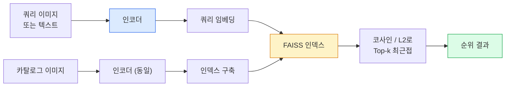

# 이미지 검색과 메트릭 학습 (Image Retrieval & Metric Learning)

> 검색 시스템은 임베딩 공간의 거리로 후보를 순위를 매깁니다. 메트릭 학습은 그 거리를 원하는 의미로 만들도록 공간을 다듬는 규율입니다.

**Type:** Build
**Languages:** Python
**Prerequisites:** Phase 4 Lesson 14 (ViT), Phase 4 Lesson 18 (CLIP)
**Time:** ~45 minutes

## 학습 목표 (Learning Objectives)

- 트리플렛, 대조, 프록시 기반 메트릭 학습 손실을 설명하고 주어진 데이터셋에 맞는 것을 고릅니다
- L2-정규화와 코사인 유사도를 올바르게 구현하고 "같은 아이템"과 "같은 클래스" 검색의 차이를 감사합니다
- FAISS 인덱스를 만들고, 텍스트와 이미지로 쿼리하고, 홀드아웃 쿼리 세트에 대해 recall@K를 보고합니다
- DINOv2, CLIP, SigLIP을 기성 임베딩 백본으로 쓰고 각각이 언제 이기는지 압니다

## 문제 상황 (The Problem)

검색은 프로덕션 비전 어디에나 있습니다. 중복 탐지, 역이미지 검색, 시각 검색("비슷한 제품 찾기"), 얼굴 재식별, 감시를 위한 사람 re-ID, 이커머스 인스턴스 매칭. 제품 질문은 항상 같습니다. "이 쿼리 이미지가 주어지면 내 카탈로그를 순위매겨라."

두 설계 결정이 전체 시스템을 만듭니다. 임베딩 — 어떤 모델이 벡터를 만드는지. 인덱스 — 규모에서 최근접 이웃을 어떻게 찾는지. 둘 다 2026년에는 상품입니다(임베딩은 DINOv2, 인덱스는 FAISS). 그래서 기준이 올라갑니다. 어려운 부분은 애플리케이션에서 *무엇이 비슷한지* 정의한 뒤, 거리가 그에 맞도록 임베딩 공간을 다듬는 일입니다.

그 다듬기가 메트릭 학습입니다. 작지만 레버리지가 큰 규율입니다.

## 핵심 개념 (The Concept)

### 한눈에 보는 검색



### 네 손실 계열

| Loss | Requires | Pros | Cons |
|------|----------|------|------|
| **Contrastive** | (anchor, positive) + negatives | 단순, 어떤 쌍 라벨과도 동작 | 음성이 많아야 수렴이 빠름 |
| **Triplet** | (anchor, positive, negative) | 직관적; 마진을 직접 제어 | Hard-triplet 마이닝이 비쌈 |
| **NT-Xent / InfoNCE** | Pairs + batch-mined negatives | 큰 배치로 스케일 | 큰 배치 또는 모멘텀 큐 필요 |
| **Proxy-based (ProxyNCA)** | Class labels only | 빠르고 안정, 마이닝 없음 | 작은 데이터셋에서 프록시에 과적합 가능 |

대부분 프로덕션 사용례에서는 사전학습 백본으로 시작하고, 기성 임베딩이 테스트 세트에서 부족할 때만 메트릭 학습 파인튜닝을 추가합니다.

### 트리플렛 손실 형식

```
L = max(0, ||f(a) - f(p)||^2 - ||f(a) - f(n)||^2 + margin)
```

앵커 `a`를 양성 `p`에 당기고, 음성 `n`에서 밀어내며, 간격을 보장하는 `margin`을 둡니다. 세 이미지 구조는 어떤 유사도 순서에도 일반화됩니다.

마이닝이 중요합니다. 쉬운 트리플렛(`n`이 이미 `a`에서 멀음)은 손실에 기여하지 않고, hard 트리플렛만 네트워크를 가르칩니다. Semi-hard 마이닝(`n`이 `p`보다 멀지만 마진 안)이 2016 FaceNet 레시피이며 여전히 지배적입니다.

### 코사인 유사도 vs L2

두 지표, 두 관례:

- **코사인**: 벡터 사이 각. L2-정규화된 임베딩이 필요합니다.
- **L2**: 유클리드 거리. 원시 또는 정규화 임베딩에서 동작하지만, 보통 L2-정규화 + 제곱 L2와 짝을 이룹니다.

대부분 현대 망에서 둘은 등가입니다. `||a|| = ||b|| = 1`일 때 `||a - b||^2 = 2 - 2 cos(a, b)`. 임베딩 학습과 맞는 관례를 고르세요. 섞으면 "최근접"의 의미가 조용히 바뀝니다.

### Recall@K

표준 검색 지표:

```
recall@K = fraction of queries where at least one correct match is in the top K results
```

recall@1, @5, @10을 나란히 보고하세요. recall@10이 0.95 이상이고 recall@1이 0.5 미만이면 임베딩 공간 구조는 맞지만 순위가 노이즈입니다 — 더 긴 파인튜닝이나 재순위 단계를 시도하세요.

중복 탐지에서는 모든 거짓 양성이 사용자에게 보이는 실수라 precision@K가 더 중요합니다. 시각 검색에서는 recall@K가 제품 신호입니다.

### 한 단락으로 보는 FAISS

Facebook AI Similarity Search. 최근접 이웃 검색의 사실상 라이브러리. 인덱스 선택 세 가지:

- `IndexFlatIP` / `IndexFlatL2` — 무차별, 정확, 학습 없음. ~100만 벡터까지.
- `IndexIVFFlat` — K개 셀로 분할하고 가장 가까운 몇 셀만 검색. 근사, 빠름, 학습 데이터 필요.
- `IndexHNSW` — 그래프 기반, 많은 쿼리에 가장 빠르고 인덱스 크기가 큼.

10만 벡터면 코사인에 `IndexFlatIP`가 맞습니다. 1000만이면 `IndexIVFFlat`. 1억+이면 product quantisation(`IndexIVFPQ`)과 조합합니다.

### 인스턴스 수준 vs 범주 수준 검색

같은 이름의 아주 다른 두 문제:

- **범주 수준** — "카탈로그에서 고양이 찾기." 클래스 조건부 유사도; 기성 CLIP / DINOv2 임베딩이 잘 동작합니다.
- **인스턴스 수준** — "카탈로그에서 *이 정확한 제품* 찾기." 같은 클래스의 시각적으로 비슷한 객체 사이를 세밀히 구분해야 합니다. 기성 임베딩은 부족하고, 메트릭 학습 파인튜닝이 중요합니다.

모델을 고르기 전에 어느 쪽을 푸는지 항상 물으세요.

```figure
metric-embedding
```

## 구현하기 (Build It)

### 1단계: 트리플렛 손실

```python
import torch
import torch.nn.functional as F

def triplet_loss(anchor, positive, negative, margin=0.2):
    d_ap = F.pairwise_distance(anchor, positive, p=2)
    d_an = F.pairwise_distance(anchor, negative, p=2)
    return F.relu(d_ap - d_an + margin).mean()
```

한 줄. L2-정규화 또는 원시 임베딩에서 동작합니다.

### 2단계: Semi-hard 마이닝

임베딩과 라벨 배치가 주어지면, 각 앵커에 대해 가장 어려운 semi-hard 음성을 찾습니다.

```python
def semi_hard_negatives(emb, labels, margin=0.2):
    dist = torch.cdist(emb, emb)
    same_class = labels[:, None] == labels[None, :]
    diff_class = ~same_class
    N = emb.size(0)

    positives = dist.clone()
    positives[~same_class] = float("-inf")
    positives.fill_diagonal_(float("-inf"))
    pos_idx = positives.argmax(dim=1)

    semi_hard = dist.clone()
    semi_hard[same_class] = float("inf")
    d_ap = dist[torch.arange(N), pos_idx].unsqueeze(1)
    semi_hard[dist <= d_ap] = float("inf")
    neg_idx = semi_hard.argmin(dim=1)

    fallback_mask = semi_hard[torch.arange(N), neg_idx] == float("inf")
    if fallback_mask.any():
        hardest = dist.clone()
        hardest[same_class] = float("inf")
        neg_idx = torch.where(fallback_mask, hardest.argmin(dim=1), neg_idx)
    return pos_idx, neg_idx
```

각 앵커는 클래스 내 가장 어려운 양성과, 양성보다 멀지만 마진 안인 semi-hard 음성을 받습니다.

### 3단계: Recall@K

```python
def recall_at_k(query_emb, gallery_emb, query_labels, gallery_labels, k=1):
    sim = query_emb @ gallery_emb.T
    _, top_k = sim.topk(k, dim=-1)
    matches = (gallery_labels[top_k] == query_labels[:, None]).any(dim=-1)
    return matches.float().mean().item()
```

L2-정규화된 임베딩에서 내적 top-k는 코사인 top-k와 같습니다. 올바른 이웃이 하나라도 있는 쿼리 비율의 평균을 보고합니다.

### 4단계: 합치기

```python
import torch
import torch.nn as nn
from torch.optim import Adam

class Encoder(nn.Module):
    def __init__(self, in_dim=128, emb_dim=64):
        super().__init__()
        self.net = nn.Sequential(
            nn.Linear(in_dim, 128), nn.ReLU(),
            nn.Linear(128, emb_dim),
        )

    def forward(self, x):
        return F.normalize(self.net(x), dim=-1)

torch.manual_seed(0)
num_classes = 6
protos = F.normalize(torch.randn(num_classes, 128), dim=-1)

def sample_batch(bs=32):
    labels = torch.randint(0, num_classes, (bs,))
    x = protos[labels] + 0.15 * torch.randn(bs, 128)
    return x, labels

enc = Encoder()
opt = Adam(enc.parameters(), lr=3e-3)

for step in range(200):
    x, y = sample_batch(32)
    emb = enc(x)
    pos_idx, neg_idx = semi_hard_negatives(emb, y)
    loss = triplet_loss(emb, emb[pos_idx], emb[neg_idx])
    opt.zero_grad(); loss.backward(); opt.step()
```

수백 스텝 후 임베딩 클러스터가 클래스당 하나로 형성됩니다.

## 실용 활용 (Use It)

2026년 프로덕션 스택:

- **DINOv2 + FAISS** — 범용 시각 검색. 기성으로 동작합니다.
- **CLIP + FAISS** — 쿼리가 텍스트일 때.
- **파인튜닝 DINOv2 + FAISS** — 인스턴스 수준 검색, 얼굴 re-ID, 패션, 이커머스.
- **Milvus / Weaviate / Qdrant** — FAISS 또는 HNSW 주변의 관리형 벡터 DB 래퍼.

SOTA 인스턴스 검색 레시피: DINOv2 백본, 임베딩 헤드 추가, 인스턴스 라벨 쌍에 트리플렛 또는 InfoNCE로 파인튜닝, FAISS에 인덱싱.

## 배포할 산출물 (Ship It)

이 레슨이 만드는 것:

- `outputs/prompt-retrieval-loss-picker.md` — 주어진 검색 문제에 트리플렛 / InfoNCE / ProxyNCA를 고르는 프롬프트.
- `outputs/skill-recall-at-k-runner.md` — train/val/gallery 분할과 올바른 데이터 계약으로 recall@K용 깨끗한 평가 하네스를 쓰는 스킬.

## 연습 문제 (Exercises)

1. **(Easy)** 위 토이 예제를 돌리세요. 학습 전후 임베딩을 PCA로 플롯해 여섯 클러스터가 형성되는 것을 보세요.
2. **(Medium)** ProxyNCA 손실 구현을 추가하세요: 클래스당 학습된 "프록시" 하나, 코사인 유사도에 표준 교차엔트로피. 토이 데이터에서 트리플렛 손실 대비 수렴 속도를 비교하세요.
3. **(Hard)** ImageNet 검증 이미지 1,000장을 취해 HuggingFace DINOv2로 임베딩하고, FAISS flat 인덱스를 만들고, 같은 이미지를 쿼리로 했을 때 recall@{1, 5, 10}을 보고하세요(1.0이어야 함). ImageNet 라벨을 정답으로 한 홀드아웃 분할에 대해서도 보고하세요.

## 핵심 용어 (Key Terms)

| 용어 | 사람들이 말하는 것 | 실제 의미 |
|------|----------------|----------------------|
| Metric learning | "공간을 다듬기" | 출력 공간의 거리가 목표 유사도를 반영하도록 인코더를 학습 |
| Triplet loss | "당기고 밀기" | L = max(0, d(a, p) - d(a, n) + margin); 정전 메트릭 학습 손실 |
| Semi-hard mining | "유용한 음성" | 앵커에서 양성보다 멀지만 마진 안인 음성; 경험적으로 가장 정보적 |
| Proxy-based loss | "클래스 프로토타입" | 클래스당 학습된 프록시 하나; 프록시 유사도에 교차엔트로피; 쌍 마이닝 없음 |
| Recall@K | "Top-K 적중률" | top K에 올바른 결과가 하나라도 있는 쿼리 비율 |
| Instance retrieval | "이 정확한 것 찾기" | 세밀 매칭; 기성 특징은 보통 부족 |
| FAISS | "NN 라이브러리" | Facebook의 최근접 이웃 라이브러리; 정확·근사 인덱스 지원 |
| HNSW | "그래프 인덱스" | Hierarchical navigable small world; 메모리 오버헤드가 작은 빠른 근사 NN |

## 더 읽을거리 (Further Reading)

- [FaceNet: A Unified Embedding for Face Recognition (Schroff et al., 2015)](https://arxiv.org/abs/1503.03832) — 트리플렛 손실 / semi-hard 마이닝 논문
- [In Defense of the Triplet Loss for Person Re-Identification (Hermans et al., 2017)](https://arxiv.org/abs/1703.07737) — 트리플렛 파인튜닝 실무 가이드
- [FAISS documentation](https://github.com/facebookresearch/faiss/wiki) — 모든 인덱스, 모든 트레이드오프
- [SMoT: Metric Learning Taxonomy (Kim et al., 2021)](https://arxiv.org/abs/2010.06927) — 현대 손실과 그 연결의 서베이
