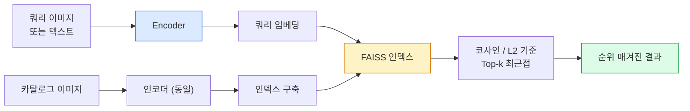

# 이미지 검색 및 메트릭 학습

> 검색 시스템은 임베딩 공간에서의 거리를 기준으로 후보를 순위를 매깁니다. 메트릭 학습은 그 거리가 의도한 의미를 갖도록 공간을 형성하는 학문입니다.

**유형:** Build
**언어:** Python
**선수 요건:** 4단계 14강 (ViT), 4단계 18강 (CLIP)
**시간:** 약 45분

## 학습 목표

- 트리플렛, 대조 학습, 프록시 기반 메트릭 학습 손실 함수를 설명하고 주어진 데이터셋에 적합한 손실 함수를 선택해 보세요
- L2 정규화와 코사인 유사도를 올바르게 구현하고 "동일 항목"과 "동일 클래스" 검색의 차이를 감사해 보세요
- FAISS 인덱스를 구축하고 텍스트 및 이미지로 쿼리하며, 홀드아웃 쿼리 세트에 대해 recall@K를 보고해 보세요
- DINOv2, CLIP, SigLIP을 즉시 사용 가능한 임베딩 백본으로 활용하고, 각 모델이 어떤 상황에서 우세한지 파악해 보세요

## 문제점

검색은 프로덕션 비전 전반에 걸쳐 존재합니다: 중복 감지, 역 이미지 검색, 시각 검색("유사 제품 찾기"), 얼굴 재식별, 감시를 위한 사람 재식별, 전자 상거래를 위한 인스턴스 수준 매칭. 제품 질문은 항상 동일합니다: "이 쿼리 이미지가 주어졌을 때, 내 카탈로그를 순위 매겨라."

두 가지 설계 결정이 전체 시스템을 형성합니다. 임베딩 — 벡터를 생성하는 모델. 인덱스 — 대규모로 최근접 이웃을 찾는 방법. 둘 다 2026년에는 상품화되어 있습니다 (임베딩은 DINOv2, 인덱스는 FAISS). 이는 기준을 높입니다: 어려운 부분은 애플리케이션에 대해 *무엇이 유사한 것으로 간주되는지* 정의한 다음, 거리가 그 정의와 일치하도록 임베딩 공간을 형성하는 것입니다.

그 형성 과정이 메트릭 학습입니다. 작지만 높은 레버리지를 가진 학문입니다.

## 개념

### 검색 개요



### 네 가지 손실 함수 계열

| 손실 함수 | 요구 사항 | 장점 | 단점 |
|------|----------|------|------|
| **대조 학습(Contrastive)** | (앵커, 양의 예) + 음의 예 | 단순하며 모든 쌍 레이블과 작동 | 음의 예가 많지 않으면 수렴이 느림 |
| **트리플릿(Triplet)** | (앵커, 양의 예, 음의 예) | 직관적; 직접적인 마진 제어 | 하드 트리플릿 마이닝은 비용이 많이 듦 |
| **NT-Xent / InfoNCE** | 쌍 + 배치 마이닝된 음의 예 | 대규모 배치로 확장 가능 | 큰 배치나 모멘텀 큐가 필요 |
| **프록시 기반 (ProxyNCA)** | 클래스 레이블만 | 빠르고 안정적이며 마이닝 불필요 | 작은 데이터셋에서는 프록시에 과적합될 수 있음 |

대부분의 프로덕션 사용 사례에서는 사전 학습된 백본(backbone)으로 시작하고, 시중의 임베딩이 테스트 세트에서 성능이 떨어질 때만 메트릭 학습 미세 조정(metric-learning fine-tune)을 추가해 보세요.

### 트리플릿 손실(Triplet loss)의 공식 정의

```
L = max(0, ||f(a) - f(p)||^2 - ||f(a) - f(n)||^2 + margin)
```

앵커 `a`를 양의 예 `p`에 가깝게 당기고, 음의 예 `n`에서 밀어내며, `margin`을 통해 간격을 보장합니다. 세 이미지 구조는 모든 유사도 순서에 일반화됩니다.

마이닝이 중요합니다: 쉬운 트리플릿(`n`이 이미 `a`에서 멀리 떨어져 있는 경우)은 손실에 기여하지 않으며, 하드 트리플릿만 네트워크를 학습시킵니다. 세미 하드 마이닝(`n`이 `p`보다 멀리 있지만 마진 내에 있는 경우)은 2016년 FaceNet 레시피이며 여전히 지배적입니다.

### 코사인 유사도(Cosine similarity) vs L2

두 가지 메트릭, 두 가지 관례:

- **코사인(Cosine)**: 벡터 사이의 각도. L2 정규화된 임베딩이 필요합니다.
- **L2**: 유클리드 거리. 원본 또는 정규화된 임베딩에서 작동하지만, 일반적으로 L2 정규화 + 제곱 L2와 함께 사용됩니다.

대부분의 최신 네트워크에서는 두 메트릭이 동등합니다: `||a - b||^2 = 2 - 2 cos(a, b)` when `||a|| = ||b|| = 1`. 임베딩 학습과 일치하는 관례를 선택하세요. 이를 혼합하면 "가장 가까운(nearest)"의 의미가 조용히 변합니다.

### Recall@K

표준 검색 메트릭:

```
recall@K = fraction of queries where at least one correct match is in the top K results
```

recall@1, @5, @10을 나란히 보고하세요. recall@10이 0.95 이상인데 recall@1이 0.5 미만이라면 임베딩 공간은 올바른 구조를 가지고 있지만 순위가 노이즈가 많다는 의미입니다. 더 긴 미세 조정이나 리랭킹(re-ranking) 단계를 시도해 보세요.

중복 감지에서는 모든 오탐(false positive)이 사용자에게 보이는 실수이므로 precision@K가 더 중요합니다. 시각적 검색에서는 recall@K가 제품 신호입니다.

### FAISS를 한 단락으로 요약

Facebook AI Similarity Search. 최근접 이웃 검색의 사실상 표준 라이브러리입니다. 세 가지 인덱스 선택지:

- `IndexFlatIP` / `IndexFlatL2` — 브루트 포스, 정확, 학습 불필요. 약 100만 벡터까지 사용하세요.
- `IndexIVFFlat` — K개의 셀로 분할하고 가장 가까운 몇 개의 셀만 검색합니다. 근사적, 빠름, 학습 데이터 필요.
- `IndexHNSW` — 그래프 기반, 다수의 쿼리에 대해 가장 빠름, 인덱스 크기가 큼.

10만 벡터라면 코사인 유사도로 `IndexFlatIP`를 사용하는 것이 좋습니다. 1000만 벡터라면 `IndexIVFFlat`를 사용하세요. 1억 이상이라면 `IndexIVFPQ`와 결합하여 사용하세요.

### 인스턴스 수준 vs 카테고리 수준 검색

이름은 같지만 매우 다른 두 가지 문제입니다:

- **카테고리 수준** — "카탈로그에서 고양이 찾기." 클래스 조건부 유사성; 시판되는 CLIP / DINOv2 임베딩이 잘 작동합니다.
- **인스턴스 수준** — "카탈로그에서 *이 정확한 제품* 찾기." 같은 클래스의 시각적으로 유사한 객체 간에 세밀한 구별이 필요합니다. 시판되는 임베딩은 성능이 떨어지며, 메트릭 학습을 통한 미세 조정이 중요합니다.

모델을 선택하기 전에 어떤 문제를 해결하고 있는지 항상 확인하세요.

```figure
metric-embedding
```

## 구현하기

### 1단계: Triplet 손실

```python
import torch
import torch.nn.functional as F

def triplet_loss(anchor, positive, negative, margin=0.2):
    d_ap = F.pairwise_distance(anchor, positive, p=2)
    d_an = F.pairwise_distance(anchor, negative, p=2)
    return F.relu(d_ap - d_an + margin).mean()
```

한 줄입니다. L2 정규화되거나 원시 임베딩에서 작동합니다.

### 2단계: Semi-hard 마이닝

임베딩과 레이블의 배치가 주어지면, 각 앵커에 대해 가장 어려운 semi-hard 음성을 찾습니다.

```python
def semi_hard_negatives(emb, labels, margin=0.2):
    dist = torch.cdist(emb, emb)
    same_class = labels[:, None] == labels[None, :]
    diff_class = ~same_class
    N = emb.size(0)

    positives = dist.clone()
    positives[~same_class] = float("-inf")
    positives.fill_diagonal_(float("-inf"))
    pos_idx = positives.argmax(dim=1)

    semi_hard = dist.clone()
    semi_hard[same_class] = float("inf")
    d_ap = dist[torch.arange(N), pos_idx].unsqueeze(1)
    semi_hard[dist <= d_ap] = float("inf")
    neg_idx = semi_hard.argmin(dim=1)

    fallback_mask = semi_hard[torch.arange(N), neg_idx] == float("inf")
    if fallback_mask.any():
        hardest = dist.clone()
        hardest[same_class] = float("inf")
        neg_idx = torch.where(fallback_mask, hardest.argmin(dim=1), neg_idx)
    return pos_idx, neg_idx
```

각 앵커는 클래스 내 가장 어려운 양성과, 양성보다 멀지만 마진 내에 있는 semi-hard 음성을 선택합니다.

### 3단계: Recall@K

```python
def recall_at_k(query_emb, gallery_emb, query_labels, gallery_labels, k=1):
    sim = query_emb @ gallery_emb.T
    _, top_k = sim.topk(k, dim=-1)
    matches = (gallery_labels[top_k] == query_labels[:, None]).any(dim=-1)
    return matches.float().mean().item()
```

L2 정규화된 임베딩에서의 내적(top-k)은 코사인 유사도의 top-k와 같습니다. 적어도 하나의 올바른 이웃을 가진 쿼리의 평균 비율을 보고하세요.

### 4단계: 통합하기

```python
import torch
import torch.nn as nn
from torch.optim import Adam

class Encoder(nn.Module):
    def __init__(self, in_dim=128, emb_dim=64):
        super().__init__()
        self.net = nn.Sequential(
            nn.Linear(in_dim, 128), nn.ReLU(),
            nn.Linear(128, emb_dim),
        )

    def forward(self, x):
        return F.normalize(self.net(x), dim=-1)

torch.manual_seed(0)
num_classes = 6
protos = F.normalize(torch.randn(num_classes, 128), dim=-1)

def sample_batch(bs=32):
    labels = torch.randint(0, num_classes, (bs,))
    x = protos[labels] + 0.15 * torch.randn(bs, 128)
    return x, labels

enc = Encoder()
opt = Adam(enc.parameters(), lr=3e-3)

for step in range(200):
    x, y = sample_batch(32)
    emb = enc(x)
    pos_idx, neg_idx = semi_hard_negatives(emb, y)
    loss = triplet_loss(emb, emb[pos_idx], emb[neg_idx])
    opt.zero_grad(); loss.backward(); opt.step()
```

몇 hundred 단계 후, 임베딩 클러스터는 클래스당 하나의 클러스터를 형성합니다.

## 사용하기

2026년 생산 스택:

- **DINOv2 + FAISS** — 범용 시각 검색. 시판 상태로 잘 작동합니다.
- **CLIP + FAISS** — 쿼리가 텍스트일 때.
- **미세 조정된 DINOv2 + FAISS** — 인스턴스 수준 검색, 얼굴 재식별, 패션, 전자 상거래.
- **Milvus / Weaviate / Qdrant** — FAISS 또는 HNSW를 둘러싼 관리형 벡터 DB 래퍼입니다.

SOTA 인스턴스 검색을 위한 레시피는 다음과 같습니다: DINOv2 백본, 임베딩 헤드 추가, 인스턴스 레이블이 지정된 쌍에 대해 삼중항(triplet) 또는 InfoNCE 손실로 미세 조정, FAISS에 인덱싱.

## 출시하기

이 강의는 다음을 생성합니다:

- `outputs/prompt-retrieval-loss-picker.md` — 주어진 검색 문제에 대해 삼중항 / InfoNCE / ProxyNCA를 선택하는 프롬프트입니다.
- `outputs/skill-recall-at-k-runner.md` — train/val/gallery 분할과 적절한 데이터 계약이 포함된 recall@K를 위한 깔끔한 평가 하네스를 작성하는 스킬입니다.

## 연습 문제

1. **(쉬움)** 위의 장난감 예제를 실행하세요. 학습 전후의 임베딩을 PCA로 플롯하여 6개의 클러스터가 형성되는 것을 확인해 보세요.
2. **(중간)** ProxyNCA 손실 구현을 추가하세요: 클래스당 하나의 학습된 "프록시", 코사인 유사도에 대한 표준 교차 엔트로피. 장난감 데이터에서 삼중항 손실과 수렴 속도를 비교하세요.
3. **(어려움)** ImageNet 검증 이미지 1,000개를 가져와 HuggingFace를 통해 DINOv2로 임베딩하고, FAISS 평면 인덱스를 구축한 후, 같은 이미지를 쿼리로 사용했을 때의 recall@{1, 5, 10} (1.0이어야 함)과 ImageNet 레이블을 정답으로 사용하는 홀드아웃 분할에 대한 recall@{1, 5, 10}을 보고하세요.

## 핵심 용어

| 용어 | 사람들이 말하는 것 | 실제 의미 |
|------|----------------|----------------------|
| 메트릭 학습 | "공간을 형성한다" | 출력 공간의 거리가 목표 유사성을 반영하도록 인코더를 학습하는 것 |
| 삼중항 손실 | "당기고 밀어낸다" | L = max(0, d(a, p) - d(a, n) + margin); 표준 메트릭 학습 손실 |
| 반-하드 마이닝 | "유용한 음수" | 양수보다 앵커에서 더 멀리 있지만 마진 내에 있는 음수; 경험적으로 가장 정보량이 높음 |
| 프록시 기반 손실 | "클래스 프로토타입" | 클래스당 하나의 학습된 프록시; 프록시 유사성에 대한 교차 엔트로피; 쌍 마이닝 없음 |
| Recall@K | "Top-K 히트율" | 상위 K개 결과에 최소한 하나의 정답이 포함된 쿼리의 비율 |
| 인스턴스 검색 | "이 정확한 것을 찾는다" | 세밀한 매칭; 기성품 기능은 일반적으로 성능이 저하됨 |
| FAISS | "NN 라이브러리" | Facebook의 최근접 이웃 라이브러리; 정확 및 근사 인덱스를 지원 |
| HNSW | "그래프 인덱스" | 계층적 탐색 가능한 작은 세계; 작은 메모리 오버헤드로 빠른 근사 NN |

## 추가 읽기

- [FaceNet: A Unified Embedding for Face Recognition (Schroff et al., 2015)](https://arxiv.org/abs/1503.03832) — 삼중 손실 / semi-hard 마이닝 논문
- [In Defense of the Triplet Loss for Person Re-Identification (Hermans et al., 2017)](https://arxiv.org/abs/1703.07737) — 삼중 손실 미세 조정 실전 가이드
- [FAISS documentation](https://github.com/facebookresearch/faiss/wiki) — 모든 인덱스, 모든 트레이드오프
- [SMoT: Metric Learning Taxonomy (Kim et al., 2021)](https://arxiv.org/abs/2010.06927) — 현대 손실 함수와 그 연결성에 대한 조사
