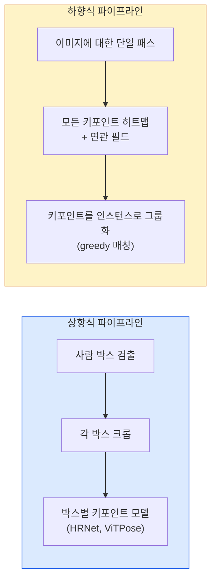

# 키포인트 검출 및 자세 추정

> 자세는 순서가 정해진 키포인트의 집합입니다. 키포인트 검출기는 히트맵 회귀기입니다. 나머지 모든 것은 관리 작업에 불과합니다.

**유형:** Build
**언어:** Python
**선수 요건:** 4단계 06강 (검출), 4단계 07강 (U-Net)
**시간:** 약 45분

## 학습 목표

- 상향식(top-down)과 하향식(bottom-up) 자세 추정을 구분하고, 각각이 사용될 때를 설명해 보세요
- K개의 키포인트에 대해 키포인트별 가우시안 타겟으로 히트맵을 회귀하고, 추론 시 키포인트 좌표를 추출해 보세요
- 부분 친화 필드(PAF, Part Affinity Fields)를 설명하고, 하향식 파이프라인이 키포인트를 인스턴스로 연결하는 방식을 이해해 보세요
- 프로덕션 환경에서 키포인트 추정을 위해 MediaPipe Pose 또는 MMPose를 사용하고, 그 출력 형식을 이해해 보세요

## 문제점

키포인트 작업은 다양한 이름으로 숨어 있습니다: 인간 자세(17개 관절), 얼굴 랜드마크(68개 또는 478개 점), 손(21개 점), 동물 자세, 로봇 객체 자세, 의료 해부학적 랜드마크. 이 모든 작업은 동일한 구조를 공유합니다: 객체 위에 K개의 이산적인 점을 검출하고 그 (x, y) 좌표를 출력하는 것입니다.

자세 추정은 모션 캡처, 피트니스 앱, 스포츠 분석, 제스처 제어, 애니메이션, AR 가상 착용, 로봇 그리핑의 기반입니다. 2D 케이스는 성숙 단계에 있으며, 3D 자세(단일 카메라로부터 세계 좌표계에서 관절 위치를 추정하는 것)는 현재 연구의 최전선입니다.

엔지니어링의 핵심 질문은 규모입니다. 단일 이미지, 단일 사람의 자세 추정은 20ms 문제입니다. 30fps의 군중 속 다중 사람 자세 추정은 아키텍처가 다른 별개의 문제입니다.

## 개념

### 상향식 vs 하향식



- **상향식(Top-down)** — 먼저 사람을 검출한 후, 각 크롭에 대해 사람별 키포인트 모델을 실행합니다. 정확도가 가장 높으며, 사람 수에 따라 선형적으로 확장됩니다.
- **하향식(bottom-up)** — 한 번의 순방향 전파(forward pass)로 모든 키포인트(keypoint)와 연관 필드(association field)를 예측하고, 이를 그룹화합니다. 군중 크기와 무관하게 일정한 시간 복잡도를 가집니다.

상향식(top-down)(HRNet, ViTPose)은 정확도 측면에서 우위이며, 하향식(bottom-up)(OpenPose, HigherHRNet)은 혼잡한 장면에서 처리량(throughput) 측면에서 우위입니다.

### 히트맵(hotmap) 회귀

`(x, y)`을 직접 회귀하는 대신, 실제 위치를 중심으로 가우시안 블롭(Gaussian blob)을 가진 키포인트별 `H x W` 히트맵을 예측합니다.

```
target[k, y, x] = exp(-((x - cx_k)^2 + (y - cy_k)^2) / (2 sigma^2))
```

추론(inference) 시 각 히트맵의 argmax가 예측된 키포인트 위치가 됩니다.

히트맵이 직접 회귀보다 더 잘 작동하는 이유: 네트워크의 공간적 구조(합성곱(conv) 특징 맵)가 공간적 출력과 자연스럽게 정렬됩니다. 가우시안 타깃은 정규화(regularise) 효과도 제공합니다 — 작은 위치 오차는 작은 손실을 생성하며, 0이 되지는 않습니다.

### 서브픽셀(sub-pixel) 위치 결정

Argmax는 정수 좌표를 제공합니다. 서브픽셀 정밀도를 위해 argmax와 그 이웃에 포물선을 피팅(fitting)하여 정밀화하거나, 잘 알려진 오프셋 `(dx, dy) = 0.25 * (heatmap[y, x+1] - heatmap[y, x-1], ...)` 방향을 사용하세요.

### 부속 친화 필드(Part Affinity Fields, PAFs)

하향식(bottom-up) 연관성을 위한 OpenPose의 기법입니다. 연결된 키포인트 쌍(예: 왼쪽 어깨에서 왼쪽 팔꿈치)마다 하나의 키포인트에서 다른 키포인트를 가리키는 단위 벡터를 인코딩하는 2채널 필드를 예측합니다. 어깨를 팔꿈치와 연관시키려면, 후보 쌍을 연결하는 선을 따라 PAF를 적분(integrate)합니다. 적분값이 가장 높은 쌍이 매칭됩니다.

```
For each connection (limb):
  PAF channels: 2 (unit vector x, y)
  Line integral: sum over sample points of (PAF . line_direction)
  Higher integral = stronger match
```

우아하며, 사람별 크롭(crop) 없이 임의의 군중 크기로 확장(scale)됩니다.

### COCO 키포인트

표준 신체 자세(body-pose) 데이터셋입니다. 사람당 17개의 키포인트를 가지며, PCK(Percentage of Correct Keypoints, 정확한 키포인트 비율)와 OKS(Object Keypoint Similarity, 객체 키포인트 유사도)가 지표로 사용됩니다. OKS는 키포인트 버전의 IoU이며, COCO mAP@OKS가 보고하는 지표입니다.

### 2D vs 3D

- **2D 자세(pose)** — 이미지 좌표; 생산 품질(production quality) 수준에서 해결되었습니다(MediaPipe, HRNet, ViTPose).
- **3D 자세(pose)** — 세계(world) / 카메라 좌표; 여전히 활발한 연구 분야입니다. 일반적인 접근법:
  - 작은 MLP를 사용하여 2D 예측을 3D로 리프트(lift)합니다(VideoPose3D).
  - 이미지에서 직접 3D 회귀(regression)를 수행합니다(PyMAF, MHFormer).
  - 정답(ground truth)을 위해 다중 뷰(multi-view) 설정(CMU Panoptic)을 사용합니다.

```figure
cv3-pose-heatmap
```

## 구현하기

### 1단계: 가우시안 히트맵 타깃

```python
import numpy as np
import torch

def gaussian_heatmap(size, cx, cy, sigma=2.0):
    yy, xx = np.meshgrid(np.arange(size), np.arange(size), indexing="ij")
    return np.exp(-((xx - cx) ** 2 + (yy - cy) ** 2) / (2 * sigma ** 2)).astype(np.float32)

hm = gaussian_heatmap(64, 32, 32, sigma=2.0)
print(f"peak: {hm.max():.3f} at ({hm.argmax() % 64}, {hm.argmax() // 64})")
```

채널 축을 따라 쌓인 키포인트 히트맵이 전체 타겟 텐서를 제공합니다.

### 2단계: 작은 키포인트 헤드

K개의 히트맵 채널을 출력하는 U-Net 스타일 모델입니다.

```python
import torch.nn as nn
import torch.nn.functional as F

class TinyKeypointNet(nn.Module):
    def __init__(self, num_keypoints=4, base=16):
        super().__init__()
        self.down1 = nn.Sequential(nn.Conv2d(3, base, 3, 2, 1), nn.ReLU(inplace=True))
        self.down2 = nn.Sequential(nn.Conv2d(base, base * 2, 3, 2, 1), nn.ReLU(inplace=True))
        self.mid = nn.Sequential(nn.Conv2d(base * 2, base * 2, 3, 1, 1), nn.ReLU(inplace=True))
        self.up1 = nn.ConvTranspose2d(base * 2, base, 2, 2)
        self.up2 = nn.ConvTranspose2d(base, num_keypoints, 2, 2)

    def forward(self, x):
        h1 = self.down1(x)
        h2 = self.down2(h1)
        h3 = self.mid(h2)
        u1 = self.up1(h3)
        return self.up2(u1)
```

입력 `(N, 3, H, W)`, 출력 `(N, K, H, W)`. 손실은 가우시안 타겟에 대한 픽셀 단위 MSE입니다.

### 3단계: 추론 — 키포인트 좌표 추출

```python
def heatmap_to_coords(heatmaps):
    """
    heatmaps: (N, K, H, W)
    returns:  (N, K, 2) float coordinates in image pixels
    """
    N, K, H, W = heatmaps.shape
    hm = heatmaps.reshape(N, K, -1)
    idx = hm.argmax(dim=-1)
    ys = (idx // W).float()
    xs = (idx % W).float()
    return torch.stack([xs, ys], dim=-1)

coords = heatmap_to_coords(torch.randn(2, 4, 32, 32))
print(f"coords: {coords.shape}")  # (2, 4, 2)
```

추론 시 한 줄로 처리합니다. 서브픽셀 정밀도를 위해 argmax 주변을 보간해 보세요.

### 4단계: 합성 키포인트 데이터셋

단순합니다: 흰색 캔버스에 네 개의 점을 그리고 이를 예측하도록 학습합니다.

```python
def make_synthetic_sample(size=64):
    img = np.ones((3, size, size), dtype=np.float32)
    rng = np.random.default_rng()
    kps = rng.integers(8, size - 8, size=(4, 2))
    for cx, cy in kps:
        img[:, cy - 2:cy + 2, cx - 2:cx + 2] = 0.0
    hms = np.stack([gaussian_heatmap(size, cx, cy) for cx, cy in kps])
    return img, hms, kps
```

작은 모델이 1분 안에 학습할 수 있을 정도로 쉽습니다.

### 5단계: 학습

```python
model = TinyKeypointNet(num_keypoints=4)
opt = torch.optim.Adam(model.parameters(), lr=3e-3)

for step in range(200):
    batch = [make_synthetic_sample() for _ in range(16)]
    imgs = torch.from_numpy(np.stack([b[0] for b in batch]))
    hms = torch.from_numpy(np.stack([b[1] for b in batch]))
    pred = model(imgs)
    # 예측값을 전체 해상도로 업샘플링
    pred = F.interpolate(pred, size=hms.shape[-2:], mode="bilinear", align_corners=False)
    loss = F.mse_loss(pred, hms)
    opt.zero_grad(); loss.backward(); opt.step()
```

## 사용하기

- **MediaPipe Pose** — Google의 프로덕션 포즈 추정기; WebGL 및 모바일 런타임을 포함하며 10ms 미만의 지연 시간을 제공합니다.
- **MMPose** (OpenMMLab) — 종합적인 연구 코드베이스; 모든 SOTA 아키텍처가 사전 학습된 가중치를 포함합니다.
- **YOLOv8-pose** — 단일 순방향 패스로 가장 빠른 실시간 다중 인체 포즈 추정.
- **transformers HumanDPT / PoseAnything** — 오픈 어휘 포즈(임의의 객체, 임의의 키포인트 세트)를 위한 최신 비전-언어(Vision-Language) 접근법.

## 출시하기

이 강의는 다음을 생성합니다:

- `outputs/prompt-pose-stack-picker.md` — 지연 시간, 군중 크기, 2D vs 3D 필요성에 따라 MediaPipe / YOLOv8-pose / HRNet / ViTPose를 선택하는 프롬프트입니다.
- `outputs/skill-heatmap-to-coords.md` — 모든 프로덕션 포즈 모델이 사용하는 서브픽셀 히트맵-좌표 변환 루틴을 작성하는 스킬입니다.

## 연습 문제

1. **(쉬움)** 합성 4점 데이터셋으로 작은 키포인트 모델을 학습합니다. 200 스텝 후 예측된 키포인트와 실제 키포인트 간의 평균 L2 오차를 보고하세요.
2. **(중간)** 서브픽셀 정밀도를 추가합니다: argmax 위치가 주어지면, 인접 픽셀로부터 x와 y 방향으로 1D 포물선을 피팅합니다. 정수 argmax 대비 정확도 향상분을 보고하세요.
3. **(어려움)** 각 이미지가 4-키포인트 패턴의 두 인스턴스를 보여주는 2인 합성 데이터셋을 구축합니다. PAF를 사용하여 어떤 키포인트가 어떤 인스턴스에 속하는지 예측하는 바텀업 파이프라인을 학습하고, OKS로 평가하세요.

## 핵심 용어

| 용어 | 사람들이 말하는 표현 | 실제 의미 |
|------|----------------|----------------------|
| Keypoint | "랜드마크" | 객체 위의 특정 순서가 있는 포인트 (관절, 모서리, 특징) |
| Pose | "스켈레톤" | 하나의 인스턴스에 속하는 keypoints의 순서가 있는 집합 |
| Top-down | "검출 후 포즈" | 2단계 파이프라인: 사람 검출기 + 크롭별 keypoint 모델; 가장 높은 정확도 |
| Bottom-up | "먼저 포즈, 나중에 그룹화" | 단일 패스 전체 keypoint 예측 + 그룹화; 군중 크기에 대해 일정한 시간 |
| Heatmap | "가우시안 타겟" | true 위치에서 피크를 갖는 keypoint별 H x W 텐서; 선호되는 회귀 타겟 |
| PAF | "Part Affinity Field" | 사지 방향을 인코딩하는 2채널 단위 벡터 필드; keypoints를 인스턴스로 그룹화하는 데 사용 |
| OKS | "Keypoint IoU" | Object Keypoint Similarity; 포즈에 대한 COCO 지표 |
| HRNet | "High-Resolution Net" | 지배적인 top-down keypoint 아키텍처; 전체에 걸쳐 고해상도 특징을 보존 |

## 추가 읽기

- [OpenPose (Cao et al., 2017)](https://arxiv.org/abs/1812.08008) — PAF를 사용한 bottom-up; 이 접근법에 대한 최고의 설명
- [HRNet (Sun et al., 2019)](https://arxiv.org/abs/1902.09212) — top-down 참조 아키텍처
- [ViTPose (Xu et al., 2022)](https://arxiv.org/abs/2204.12484) — 포즈 백본으로서의 plain ViT; 많은 벤치마크에서 현재 SOTA
- [MediaPipe Pose](https://developers.google.com/mediapipe/solutions/vision/pose_landmarker) — 생산용 실시간 포즈; 2026년 가장 빠르게 배포된 스택
