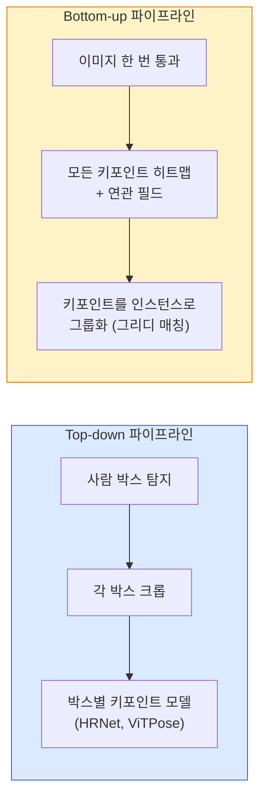

# 키포인트 탐지와 포즈 추정 (Keypoint Detection & Pose Estimation)

> 포즈는 순서가 있는 키포인트 집합입니다. 키포인트 탐지기는 히트맵 회귀기입니다. 나머지는 장부 정리입니다.

**Type:** Build
**Languages:** Python
**Prerequisites:** Phase 4 Lesson 06 (Detection), Phase 4 Lesson 07 (U-Net)
**Time:** ~45 minutes

## 학습 목표 (Learning Objectives)

- Top-down과 bottom-up 포즈 추정을 구분하고 각각을 언제 쓰는지 말합니다
- 키포인트당 가우시안 타깃으로 K개 키포인트의 히트맵을 회귀하고, 추론에서 키포인트 좌표를 추출합니다
- Part Affinity Fields (PAF)와 bottom-up 파이프라인이 키포인트를 인스턴스로 연관짓는 방식을 설명합니다
- 프로덕션 키포인트 추정에 MediaPipe Pose 또는 MMPose를 쓰고 출력 형식을 이해합니다

## 문제 상황 (The Problem)

키포인트 과제는 많은 이름 아래 숨습니다. 사람 포즈(신체 관절 17개), 얼굴 랜드마크(68 또는 478점), 손(21점), 동물 포즈, 로봇 물체 포즈, 의료 해부 랜드마크. 모두 같은 구조를 공유합니다. 객체에서 K개의 이산 점을 탐지하고 (x, y) 좌표를 출력합니다.

포즈 추정은 모션 캡처, 피트니스 앱, 스포츠 분석, 제스처 제어, 애니메이션, AR 피팅, 로봇 파지의 기초입니다. 2D 케이스는 성숙했고, 3D 포즈(단일 카메라에서 세계 좌표의 관절 위치 추정)가 현재 연구 프런티어입니다.

엔지니어링 질문은 규모입니다. 단일 이미지·단일 인물 포즈는 20ms 문제입니다. 군중 속 다중 인물 포즈를 30 fps로 돌리는 것은 다른 문제이고 다른 아키텍처입니다.

## 핵심 개념 (The Concept)

### Top-down vs bottom-up



- **Top-down** — 사람을 먼저 탐지한 뒤, 각 크롭에 인물별 키포인트 모델을 돌립니다. 정확도가 가장 높고, 사람 수에 선형으로 스케일합니다.
- **Bottom-up** — 한 번의 순전파가 모든 키포인트와 연관 필드를 예측하고, 그룹화합니다. 군중 크기와 무관하게 상수 시간입니다.

Top-down(HRNet, ViTPose)이 정확도 리더이고, bottom-up(OpenPose, HigherHRNet)이 혼잡 장면의 처리량 리더입니다.

### 히트맵 회귀

`(x, y)`를 직접 회귀하는 대신, 참 위치를 중심으로 한 가우시안 블롭이 있는 키포인트당 `H x W` 히트맵을 예측합니다.

```
target[k, y, x] = exp(-((x - cx_k)^2 + (y - cy_k)^2) / (2 sigma^2))
```

추론에서 각 히트맵의 argmax가 예측 키포인트 위치입니다.

히트맵이 직접 회귀보다 잘 되는 이유: 네트워크의 공간 구조(conv 특징 맵)가 공간 출력과 자연스럽게 맞습니다. 가우시안 타깃도 정규화합니다 — 작은 위치 오차가 0이 아니라 작은 손실을 냅니다.

### 서브픽셀 위치 추정

Argmax는 정수 좌표를 줍니다. 서브픽셀 정밀도를 위해 argmax와 이웃에 포물선을 맞추거나, 잘 알려진 오프셋 `(dx, dy) = 0.25 * (heatmap[y, x+1] - heatmap[y, x-1], ...)` 방향을 씁니다.

### Part Affinity Fields (PAF)

OpenPose의 bottom-up 연관 트릭입니다. 연결된 키포인트 쌍마다(예: 왼어깨→왼팔꿈치) 한쪽에서 다른 쪽을 가리키는 단위 벡터를 인코딩하는 2채널 필드를 예측합니다. 어깨를 팔꿈치와 연관하려면 후보 쌍을 잇는 선을 따라 PAF를 적분합니다. 적분이 가장 큰 쌍이 매칭됩니다.

```
For each connection (limb):
  PAF channels: 2 (unit vector x, y)
  Line integral: sum over sample points of (PAF . line_direction)
  Higher integral = stronger match
```

우아하고, 인물별 크롭 없이 임의 군중 크기로 스케일합니다.

### COCO 키포인트

표준 신체 포즈 데이터셋: 인물당 키포인트 17개, 지표는 PCK(Percentage of Correct Keypoints)와 OKS(Object Keypoint Similarity). OKS는 키포인트의 IoU 유사물이고, COCO mAP@OKS가 보고하는 것입니다.

### 2D vs 3D

- **2D 포즈** — 이미지 좌표; 프로덕션 품질로 해결됨(MediaPipe, HRNet, ViTPose).
- **3D 포즈** — 세계 / 카메라 좌표; 여전히 활발한 연구. 흔한 접근:
  - 작은 MLP로 2D 예측을 3D로 리프트(VideoPose3D).
  - 이미지에서 직접 3D 회귀(PyMAF, MHFormer).
  - 정답용 다중 뷰 설정(CMU Panoptic).

```figure
cv3-pose-heatmap
```

## 구현하기 (Build It)

### 1단계: 가우시안 히트맵 타깃

```python
import numpy as np
import torch

def gaussian_heatmap(size, cx, cy, sigma=2.0):
    yy, xx = np.meshgrid(np.arange(size), np.arange(size), indexing="ij")
    return np.exp(-((xx - cx) ** 2 + (yy - cy) ** 2) / (2 * sigma ** 2)).astype(np.float32)

hm = gaussian_heatmap(64, 32, 32, sigma=2.0)
print(f"peak: {hm.max():.3f} at ({hm.argmax() % 64}, {hm.argmax() // 64})")
```

키포인트별 히트맵을 채널 축으로 쌓으면 전체 타깃 텐서가 됩니다.

### 2단계: Tiny 키포인트 헤드

K개 히트맵 채널을 내는 U-Net 스타일 모델.

```python
import torch.nn as nn
import torch.nn.functional as F

class TinyKeypointNet(nn.Module):
    def __init__(self, num_keypoints=4, base=16):
        super().__init__()
        self.down1 = nn.Sequential(nn.Conv2d(3, base, 3, 2, 1), nn.ReLU(inplace=True))
        self.down2 = nn.Sequential(nn.Conv2d(base, base * 2, 3, 2, 1), nn.ReLU(inplace=True))
        self.mid = nn.Sequential(nn.Conv2d(base * 2, base * 2, 3, 1, 1), nn.ReLU(inplace=True))
        self.up1 = nn.ConvTranspose2d(base * 2, base, 2, 2)
        self.up2 = nn.ConvTranspose2d(base, num_keypoints, 2, 2)

    def forward(self, x):
        h1 = self.down1(x)
        h2 = self.down2(h1)
        h3 = self.mid(h2)
        u1 = self.up1(h3)
        return self.up2(u1)
```

입력 `(N, 3, H, W)`, 출력 `(N, K, H, W)`. 손실은 가우시안 타깃에 대한 픽셀별 MSE입니다.

### 3단계: 추론 — 키포인트 좌표 추출

```python
def heatmap_to_coords(heatmaps):
    """
    heatmaps: (N, K, H, W)
    returns:  (N, K, 2) float coordinates in image pixels
    """
    N, K, H, W = heatmaps.shape
    hm = heatmaps.reshape(N, K, -1)
    idx = hm.argmax(dim=-1)
    ys = (idx // W).float()
    xs = (idx % W).float()
    return torch.stack([xs, ys], dim=-1)

coords = heatmap_to_coords(torch.randn(2, 4, 32, 32))
print(f"coords: {coords.shape}")  # (2, 4, 2)
```

추론에서 한 줄. 서브픽셀 정제를 위해 argmax 주변을 보간합니다.

### 4단계: 합성 키포인트 데이터셋

단순: 흰 캔버스에 점 네 개를 그리고 예측을 학습합니다.

```python
def make_synthetic_sample(size=64):
    img = np.ones((3, size, size), dtype=np.float32)
    rng = np.random.default_rng()
    kps = rng.integers(8, size - 8, size=(4, 2))
    for cx, cy in kps:
        img[:, cy - 2:cy + 2, cx - 2:cx + 2] = 0.0
    hms = np.stack([gaussian_heatmap(size, cx, cy) for cx, cy in kps])
    return img, hms, kps
```

작은 모델이 1분 안에 배우기 충분합니다.

### 5단계: 학습

```python
model = TinyKeypointNet(num_keypoints=4)
opt = torch.optim.Adam(model.parameters(), lr=3e-3)

for step in range(200):
    batch = [make_synthetic_sample() for _ in range(16)]
    imgs = torch.from_numpy(np.stack([b[0] for b in batch]))
    hms = torch.from_numpy(np.stack([b[1] for b in batch]))
    pred = model(imgs)
    # Upsample pred to full resolution
    pred = F.interpolate(pred, size=hms.shape[-2:], mode="bilinear", align_corners=False)
    loss = F.mse_loss(pred, hms)
    opt.zero_grad(); loss.backward(); opt.step()
```

## 실용 활용 (Use It)

- **MediaPipe Pose** — Google의 프로덕션 포즈 추정기; WebGL + 모바일 런타임과 함께 10ms 미만 지연으로 제공됩니다.
- **MMPose** (OpenMMLab) — 포괄적 연구 코드베이스; 사전학습 가중치가 있는 모든 SOTA 아키텍처.
- **YOLOv8-pose** — 단일 순전파로 가장 빠른 실시간 다중 인물 포즈.
- **transformers HumanDPT / PoseAnything** — 개방 어휘 포즈(임의 객체, 임의 키포인트 세트)용 더 새로운 비전-언어 접근.

## 배포할 산출물 (Ship It)

이 레슨이 만드는 것:

- `outputs/prompt-pose-stack-picker.md` — 지연, 군중 크기, 2D vs 3D 필요가 주어지면 MediaPipe / YOLOv8-pose / HRNet / ViTPose를 고르는 프롬프트.
- `outputs/skill-heatmap-to-coords.md` — 모든 프로덕션 포즈 모델이 쓰는 서브픽셀 히트맵→좌표 루틴을 쓰는 스킬.

## 연습 문제 (Exercises)

1. **(Easy)** 합성 4점 데이터셋에서 tiny 키포인트 모델을 학습하세요. 200스텝 후 예측과 참 키포인트 사이 평균 L2 오차를 보고하세요.
2. **(Medium)** 서브픽셀 정제를 추가하세요: argmax 위치가 주어지면 이웃 픽셀에서 x·y를 따라 1D 포물선을 맞춥니다. 정수 argmax 대비 정확도 이득을 보고하세요.
3. **(Hard)** 각 이미지에 4-키포인트 패턴의 인스턴스 두 개가 있는 2인 합성 데이터셋을 만드세요. 어떤 키포인트가 어떤 인스턴스에 속하는지 예측하는 PAF가 있는 bottom-up 파이프라인을 학습하고 OKS를 평가하세요.

## 핵심 용어 (Key Terms)

| 용어 | 사람들이 말하는 것 | 실제 의미 |
|------|----------------|----------------------|
| Keypoint | "랜드마크" | 객체의 특정 순서 점(관절, 모서리, 특징) |
| Pose | "골격" | 한 인스턴스에 속하는 순서 있는 키포인트 집합 |
| Top-down | "탐지 후 포즈" | 2단계 파이프라인: 사람 탐지기 + 크롭별 키포인트 모델; 정확도 최고 |
| Bottom-up | "포즈 먼저, 나중에 그룹" | 단일 패스 전체 키포인트 예측 + 그룹화; 군중 크기와 무관하게 상수 시간 |
| Heatmap | "가우시안 타깃" | 참 위치에 피크가 있는 키포인트당 H×W 텐서; 선호되는 회귀 타깃 |
| PAF | "Part Affinity Field" | 사지 방향을 인코딩하는 2채널 단위 벡터 필드; 키포인트를 인스턴스로 그룹화에 사용 |
| OKS | "키포인트 IoU" | Object Keypoint Similarity; 포즈용 COCO 지표 |
| HRNet | "High-Resolution Net" | 지배적인 top-down 키포인트 아키텍처; 전 과정에서 고해상도 특징을 유지 |

## 더 읽을거리 (Further Reading)

- [OpenPose (Cao et al., 2017)](https://arxiv.org/abs/1812.08008) — PAF가 있는 bottom-up; 여전히 이 접근의 최고 서술
- [HRNet (Sun et al., 2019)](https://arxiv.org/abs/1902.09212) — top-down 레퍼런스 아키텍처
- [ViTPose (Xu et al., 2022)](https://arxiv.org/abs/2204.12484) — 포즈 백본으로서의 plain ViT; 많은 벤치마크의 현재 SOTA
- [MediaPipe Pose](https://developers.google.com/mediapipe/solutions/vision/pose_landmarker) — 프로덕션 실시간 포즈; 2026년 가장 빠르게 배포된 스택
