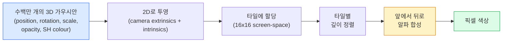

# 처음부터 구현하는 3D 가우시안 스플래팅

> 장면은 수백만 개의 3D 가우시안 구름으로 구성됩니다. 각각은 위치, 방향, 크기, 불투명도, 그리고 시선 방향에 따라 달라지는 색상을 가집니다. 이를 래스터화하고, 래스터화 과정을 통해 역전파하면 끝입니다.

**유형:** Build
**언어:** Python
**선수 요건:** 4단계 13강 (3D 비전 및 NeRF), 1단계 12강 (텐서 연산), 4단계 10강 (확산 모델 기초, 선택 사항)
**시간:** 약 90분

## 학습 목표

- 2026년, 사실적인 3D 재구성에서 NeRF를 대체하여 생산 기본값이 된 3D 가우시안 스플래팅의 이유를 설명해 보세요.
- 가우시안별 6개 매개변수(위치, 회전 쿼터니언, 크기, 불투명도, 구면 조화 색상, 선택적 기능)와 각각이 기여하는 부동 소수점 수를 나열해 보세요.
- `alpha` 합성을 사용하여 2D 가우시안 스플래팅 래스터라이저를 처음부터 구현하고, 3D의 경우 동일한 루프로 투영되는 방식을 보여주세요.
- `nerfstudio`, `gsplat`, 또는 `SuperSplat`를 사용하여 20-50장의 사진으로 장면을 재구성하고 `KHR_gaussian_splatting` glTF 확장자 또는 OpenUSD 26.03 `UsdVolParticleField3DGaussianSplat` 스키마로 내보내 보세요.

## 문제점

NeRF는 장면을 MLP의 가중치로 저장합니다. 렌더링된 모든 픽셀은 광선을 따라 수백 번의 MLP 쿼리를 수행합니다. 학습은 몇 시간이 걸리고, 렌더링은 몇 초가 걸리며, 가중치를 편집할 수 없습니다. 장면 안의 의자를 옮기려면 재학습해야 합니다.

3D 가우시안 스플래팅(Kerbl, Kopanas, Leimkühler, Drettakis, SIGGRAPH 2023)은 이 모든 것을 대체했습니다. 장면은 명시적인 3D 가우시안 집합입니다. 렌더링은 GPU 래스터화로 100+ fps로 수행됩니다. 학습은 몇 분이면 됩니다. 편집은 직접적입니다. 가우시안 하위 집합을 이동하면 의자가 이동합니다. 2026년 현재 Khronos Group은 가우시안 스플래팅용 glTF 확장자를 비준했고, OpenUSD 26.03은 가우시안 스플래팅 스키마를 제공하며, Zillow와 Apartments.com은 이를 사용하여 부동산을 렌더링하고, 3D 재구성에 관한 대부분의 새로운 연구 논문은 핵심 3DGS 아이디어의 변형입니다.

멘탈 모델은 간단하지만, 수학에는 많은 이동 부분이 있어 대부분의 소개는 래스터화부터 시작하여 투영과 구면 조화를 건너뛰곤 합니다. 이 강의는 전체를 구축합니다. 먼저 2D 버전을 만들고, 그 다음 3D 확장으로 진행합니다.

## 개념

### 가우시안이 담고 있는 것

하나의 3D 가우시안은 공간 내의 매개변수화된 블롭이며, 다음과 같은 속성을 가집니다:

```
position         mu         (3,)    centre in world coordinates
rotation         q          (4,)    unit quaternion encoding orientation
scale            s          (3,)    log-scales per axis (exponentiated at render time)
opacity          alpha      (1,)    post-sigmoid opacity [0, 1]
SH coefficients  c_lm       (3 * (L+1)^2,)   view-dependent colour
```

회전과 스케일이 3x3 공분산 `Sigma = R S S^T R^T`을 구성합니다. 이것이 3D에서 가우시안의 형태입니다. 구면 조화 함수(Spherical Harmonics)는 viewing direction에 따라 색상이 변하도록 허용합니다 — specular highlights, subtle sheen, view-dependent glow — per-view textures를 저장하지 않고도 가능합니다. SH degree 3을 사용하면 색상 채널당 16개의 계수를 얻으며, 색상만으로도 가우시안당 48개의 floats가 필요합니다.

일반적인 장면은 1-5백만 개의 가우시안을 포함합니다. 각각은 대략 60개의 floats (3 + 4 + 3 + 1 + 48 + misc)를 저장합니다. 이는 5백만 가우시안 장면의 경우 240 MB이며, per-point texture를 가진 동등한 point cloud보다 훨씬 작고, 고해상도로 다시 렌더링된 NeRF의 MLP weights보다 한 자리 수(order of magnitude) 더 작습니다.

### 레이 마칭이 아닌 래스터화



5단계이며, 모두 GPU 친화적입니다. 픽셀당 MLP 쿼리가 없습니다. 단일 RTX 3080 Ti는 6백만 splats를 147 fps로 렌더링합니다.

### 투영 단계

World position `mu`에 있는 3D 가우시안과 3D 공분산 `Sigma`은 Screen position `mu'`에 있는 2D 가우시안과 2D 공분산 `Sigma'`으로 투영됩니다:

```
mu' = project(mu)
Sigma' = J W Sigma W^T J^T          (2 x 2)

W = viewing transform (rotation + translation of camera)
J = Jacobian of the perspective projection at mu'
```

2D 가우시안의 footprint는 `Sigma'`의 고유 벡터가 축인 타원입니다. 그 타원 내부의 모든 픽셀은 `exp(-0.5 * (p - mu')^T Sigma'^-1 (p - mu'))`에 의해 가중치가 적용된 가우시안의 기여를 받습니다.

### 알파 합성 규칙

하나의 픽셀에 대해, 이를 덮는 가우시안들은 뒤에서 앞으로 정렬됩니다 (또는 동일한 공식의 역으로 앞에서 뒤로 정렬됩니다). 색상은 1980년대 이후 모든 semi-transparent rasteriser가 사용하는 것과 동일한 방정식으로 합성됩니다:

```
C_pixel = sum_i alpha_i * T_i * c_i

T_i = prod_{j < i} (1 - alpha_j)       transmittance up to i
alpha_i = opacity_i * exp(-0.5 * d^T Sigma'^-1 d)   local contribution
c_i = eval_SH(SH_i, view_direction)    view-dependent colour
```

이것은 **NeRF의 volumetric render와 동일한 방정식**입니다. 다만 ray를 따라 dense samples가 아닌 explicit sparse set of Gaussians에 대해 적용됩니다. 이 동일성이 렌더링 품질이 NeRF와 일치하는 이유입니다. 둘 다 동일한 radiance-field 방정식을 적분하고 있습니다.

### 미분 가능한 이유

모든 단계 — 투영, 타일 할당, 알파 합성, SH 평가 —는 가우시안 매개변수에 대해 미분 가능합니다. ground-truth 이미지를 기준으로 렌더링된 픽셀 손실을 계산하고, 래스터라이저를 통해 역전파하며, 모든 `(mu, q, s, alpha, c_lm)`를 경사 하강법으로 업데이트합니다. 약 30,000번의 반복을 거치면 가우시안들은 올바른 위치, 스케일, 색상을 찾습니다.

### 밀집화 및 가지치기

고정된 가우시안 집합은 복잡한 장면을 커버할 수 없습니다. 학습에는 두 가지 적응형 메커니즘이 포함됩니다:

- 기울기 크기가 크지만 스케일이 작은 가우시안은 현재 위치에서 **복제(Clone)**합니다. 이 영역은 더 많은 디테일이 필요합니다.
- 기울기가 큰 대규모 가우시안은 두 개의 작은 가우시안으로 **분할(Split)**합니다. 하나의 큰 가우시안으로는 해당 영역을 매끄럽게 표현하기 어렵습니다.
- 불투명도가 임계값 아래로 떨어진 가우시안은 **가지치기(Prune)**합니다. 이들은 기여하지 않기 때문입니다.

밀집화는 N번 반복마다 실행됩니다. 장면은 일반적으로 초기 가우시안 약 100k개(SfM 포인트에서 시드됨)에서 학습 종료 시 1-5M개로 증가합니다.

### 구면 조화 함수 한 단락

시점 의존적 색상은 단위 구면 위의 함수 `c(direction)`입니다. 구면 조화 함수는 구의 푸리에 기저입니다. 차수 `L`에서 절단하면 채널당 `(L+1)^2`개의 기저 함수를 얻습니다. 새로운 시점의 색상을 평가하는 것은 학습된 SH 계수와 시선 방향에서 평가된 기저 간의 내적입니다. 차수 0 = 계수 1개 = 상수 색상. 차수 3 = 계수 16개 = 램버트 음영, 스페큘러, 약한 반사를 포착하기에 충분합니다. SD 가우시안 스플래팅 논문은 기본적으로 차수 3을 사용합니다.

### 2026년 프로덕션 스택

```
1. Capture         smartphone / DJI drone / handheld scanner
2. SfM / MVS       COLMAP or GLOMAP derives camera poses + sparse points
3. Train 3DGS      nerfstudio / gsplat / inria official / PostShot (~10-30 min on RTX 4090)
4. Edit            SuperSplat / SplatForge (clean floaters, segment)
5. Export          .ply -> glTF KHR_gaussian_splatting or .usd (OpenUSD 26.03)
6. View            Cesium / Unreal / Babylon.js / Three.js / Vision Pro
```

### 4D 및 생성형 변형

- **4D 가우시안 스플래팅** — 가우시안은 시간의 함수입니다. 볼루메트릭 비디오(Superman 2026, A$AP Rocky의 "Helicopter")에 사용됩니다.
- **생성형 스플랫** — 전체 장면을 환각하는 텍스트-투-스플랫 모델(Marble by World Labs).
- **3D 가우시안 무향 변환** — 자율 주행 시뮬레이션을 위한 NVIDIA NuRec의 변형.

```figure
cv3-gaussian-splat
```

## 구현하기

### 1단계: 2D 가우시안

먼저 2D 래스터라이저를 구축합니다. 3D 케이스는 투사 후 이 케이스로 환원됩니다.

```python
import torch
import torch.nn as nn
import torch.nn.functional as F


def eval_2d_gaussian(means, covs, points):
    """
    means:  (G, 2)      centres
    covs:   (G, 2, 2)   covariance matrices
    points: (H, W, 2)   pixel coordinates
    returns: (G, H, W)  density at every pixel for every Gaussian
    """
    G = means.size(0)
    H, W, _ = points.shape
    flat = points.view(-1, 2)
    inv = torch.linalg.inv(covs)
    diff = flat[None, :, :] - means[:, None, :]
    d = torch.einsum("gpi,gij,gpj->gp", diff, inv, diff)
    density = torch.exp(-0.5 * d)
    return density.view(G, H, W)
```

`einsum`는 모든 (가우시안, 픽셀) 쌍에 대해 `diff^T Sigma^-1 diff` 이차 형식을 계산합니다.

### 2단계: 2D 스플래팅 래스터라이저

앞에서 뒤로 알파 합성합니다. 2D에서는 깊이가 의미가 없으므로 순서를 결정하기 위해 학습된 가우시안별 스칼라 값을 사용합니다.

```python
def rasterise_2d(means, covs, colours, opacities, depths, image_size):
    """
    means:     (G, 2)
    covs:      (G, 2, 2)
    colours:   (G, 3)
    opacities: (G,)     in [0, 1]
    depths:    (G,)     per-Gaussian scalar used for ordering
    image_size: (H, W)
    returns:   (H, W, 3) rendered image
    """
    H, W = image_size
    yy, xx = torch.meshgrid(
        torch.arange(H, dtype=torch.float32, device=means.device),
        torch.arange(W, dtype=torch.float32, device=means.device),
        indexing="ij",
    )
    points = torch.stack([xx, yy], dim=-1)

    densities = eval_2d_gaussian(means, covs, points)
    alphas = opacities[:, None, None] * densities
    alphas = alphas.clamp(0.0, 0.99)

    order = torch.argsort(depths)
    alphas = alphas[order]
    colours_sorted = colours[order]

    T = torch.ones(H, W, device=means.device)
    out = torch.zeros(H, W, 3, device=means.device)
    for i in range(means.size(0)):
        a = alphas[i]
        out += (T * a)[..., None] * colours_sorted[i][None, None, :]
        T = T * (1.0 - a)
    return out
```

속도는 빠르지 않지만 — 실제 구현은 타일 기반 CUDA 커널을 사용합니다 — 수학은 정확하며 완전히 미분 가능합니다.

### 3단계: 학습 가능한 2D 스플래트 장면

```python
class Splats2D(nn.Module):
    def __init__(self, num_splats=128, image_size=64, seed=0):
        super().__init__()
        g = torch.Generator().manual_seed(seed)
        H, W = image_size, image_size
        self.means = nn.Parameter(torch.rand(num_splats, 2, generator=g) * torch.tensor([W, H]))
        self.log_scale = nn.Parameter(torch.ones(num_splats, 2) * math.log(2.0))
        self.rot = nn.Parameter(torch.zeros(num_splats))  # 2D에서의 단일 각도
        self.colour_logits = nn.Parameter(torch.randn(num_splats, 3, generator=g) * 0.5)
        self.opacity_logit = nn.Parameter(torch.zeros(num_splats))
        self.depth = nn.Parameter(torch.rand(num_splats, generator=g))

    def covs(self):
        s = torch.exp(self.log_scale)
        c, si = torch.cos(self.rot), torch.sin(self.rot)
        R = torch.stack([
            torch.stack([c, -si], dim=-1),
            torch.stack([si, c], dim=-1),
        ], dim=-2)
        S = torch.diag_embed(s ** 2)
        return R @ S @ R.transpose(-1, -2)

    def forward(self, image_size):
        covs = self.covs()
        colours = torch.sigmoid(self.colour_logits)
        opacities = torch.sigmoid(self.opacity_logit)
        return rasterise_2d(self.means, covs, colours, opacities, self.depth, image_size)
```

`log_scale`, `opacity_logit`, `colour_logits`는 렌더링 시 적절한 활성화 함수를 통해 매핑되는 모든 무제약 매개변수입니다. 이는 모든 3DGS 구현의 표준 패턴입니다.

### 4단계: 목표 이미지에 2D 가우시안 맞추기

```python
import math
import numpy as np

def make_target(size=64):
    yy, xx = np.meshgrid(np.arange(size), np.arange(size), indexing="ij")
    img = np.zeros((size, size, 3), dtype=np.float32)
    # 빨간색 원
    mask = (xx - 20) ** 2 + (yy - 20) ** 2 < 10 ** 2
    img[mask] = [1.0, 0.2, 0.2]
    # 파란색 사각형
    mask = (np.abs(xx - 45) < 8) & (np.abs(yy - 40) < 8)
    img[mask] = [0.2, 0.3, 1.0]
    return torch.from_numpy(img)


target = make_target(64)
model = Splats2D(num_splats=64, image_size=64)
opt = torch.optim.Adam(model.parameters(), lr=0.05)

for step in range(200):
    pred = model((64, 64))
    loss = F.mse_loss(pred, target)
    opt.zero_grad(); loss.backward(); opt.step()
    if step % 40 == 0:
        print(f"step {step:3d}  mse {loss.item():.4f}")
```

200 스텝 동안 64개의 가우시안이 두 가지 형태로 수렴합니다. 이것이 전체 아이디어입니다 — 명시적인 기하학적 프리미티브에 대한 경사 하강법입니다.

### 5단계: 2D에서 3D로

3D 확장도 동일한 루프를 유지합니다. 추가되는 내용은 다음과 같습니다:

1. 가우시안별 회전은 단일 각도 대신 쿼터니언입니다.
2. 공변량은 `R S S^T R^T`이며, `R`는 쿼터니언과 `S = diag(exp(log_scale))`로부터 구성됩니다.
3. 투사 `(mu, Sigma) -> (mu', Sigma')`는 카메라 외적 파라미터와 `mu`에서의 원근 투사 자코비안을 사용합니다.
4. 색상은 구면 조화 함수 전개가 되며, 시선 방향에서 이를 평가합니다.
5. 깊이 정렬은 학습된 스칼라 대신 실제 카메라 공간의 z 값을 사용합니다.

모든 프로덕션 구현 (`gsplat`, `inria/gaussian-splatting`, `nerfstudio`)은 GPU에서 타일 기반 CUDA 커널을 사용하여 정확히 이 작업을 수행합니다.

### 6단계: 구면 조화 함수 평가

3차까지의 SH 기저는 채널당 16개 항을 가집니다. 평가는 다음과 같습니다:

```python
def eval_sh_degree_3(sh_coeffs, dirs):
    """
    sh_coeffs: (..., 16, 3)   last dim is RGB channels
    dirs:      (..., 3)       unit vectors
    returns:   (..., 3)
    """
    C0 = 0.282094791773878
    C1 = 0.488602511902920
    C2 = [1.092548430592079, 1.092548430592079,
          0.315391565252520, 1.092548430592079,
          0.546274215296039]
    x, y, z = dirs[..., 0], dirs[..., 1], dirs[..., 2]
    x2, y2, z2 = x * x, y * y, z * z
    xy, yz, xz = x * y, y * z, x * z

    result = C0 * sh_coeffs[..., 0, :]
    result = result - C1 * y[..., None] * sh_coeffs[..., 1, :]
    result = result + C1 * z[..., None] * sh_coeffs[..., 2, :]
    result = result - C1 * x[..., None] * sh_coeffs[..., 3, :]

    result = result + C2[0] * xy[..., None] * sh_coeffs[..., 4, :]
    result = result + C2[1] * yz[..., None] * sh_coeffs[..., 5, :]
    result = result + C2[2] * (2.0 * z2 - x2 - y2)[..., None] * sh_coeffs[..., 6, :]
    result = result + C2[3] * xz[..., None] * sh_coeffs[..., 7, :]
    result = result + C2[4] * (x2 - y2)[..., None] * sh_coeffs[..., 8, :]

    # 간결성을 위해 3차 항은 생략했으며, 전체 16계수 버전은 코드 파일에 있습니다.
    return result
```

학습된 `sh_coeffs`는 해당 가우시안의 "모든 방향에서의 색상"을 저장합니다. 렌더링 시 현재 시선 방향에 대해 평가하여 3벡터 RGB를 얻습니다.

## 사용하기

실제 3DGS 작업을 위해 `gsplat` (Meta) 또는 `nerfstudio`를 사용해 보세요:

```bash
pip install nerfstudio gsplat
ns-download-data example
ns-train splatfacto --data path/to/data
```

`splatfacto`는 nerfstudio의 3DGS 트레이너입니다. 일반적인 장면의 경우 RTX 4090에서 실행 시간이 10~30분입니다.

2026년 기준으로 중요한 내보내기 옵션은 다음과 같습니다:

- `.ply` — 원시 가우시안 클라우드 (이식성 높음, 파일 크기 최대).
- `.splat` — PlayCanvas / SuperSplat 양자화 형식.
- glTF `KHR_gaussian_splatting` — Khronos 표준, 모든 뷰어에서 이식 가능 (2026년 2월 RC).
- OpenUSD `UsdVolParticleField3DGaussianSplat` — USD 네이티브, NVIDIA Omniverse 및 Vision Pro 파이프라인용.

4D / 동적 장면을 위해 `4DGS`와 `Deformable-3DGS`는 시간 변화하는 평균과 불투명도를 포함해 동일한 메커니즘을 확장합니다.

## 출시하기

이 강의에서 생성되는 결과물:

- `outputs/prompt-3dgs-capture-planner.md` — 주어진 장면 유형에 대해 촬영 세션(사진 수, 카메라 경로, 조명)을 계획하는 프롬프트.
- `outputs/skill-3dgs-export-router.md` — 다운스트림 뷰어 또는 엔진에 따라 올바른 내보내기 형식(`.ply` / `.splat` / glTF / USD)을 선택하는 스킬.

## 연습 문제

1. **(쉬움)** 위의 2D splat 트레이너를 다른 합성 이미지에서 실행해 보세요. `[16, 64, 256]`에서 `num_splats`를 변경하고 각 단계별 MSE를 그래프로 그려 보세요. 수익 체감 지점을 식별해 보세요.
2. **(중간)** 2D 래스터라이저가 2차 조화 함수를 통해 스칼라 "시각 각도"에 의존하는 가우시안별 RGB 색상을 지원하도록 확장해 보세요. 두 개의 타겟 이미지 쌍으로 학습하고 모델이 두 이미지를 모두 재구성하는지 검증해 보세요.
3. **(어려움)** `nerfstudio`를 클론하고 `splatfacto`를 당신이 가진 임의의 장면(책상, 식물, 얼굴, 방)의 20장 사진 촬영으로 학습해 보세요. glTF `KHR_gaussian_splatting`로 내보내고 뷰어(Three.js `GaussianSplats3D`, SuperSplat, Babylon.js V9)에서 열어 보세요. 학습 시간, 가우시안 수, 렌더링 fps를 보고해 보세요.

## 핵심 용어

| 용어 | 사람들이 말하는 것 | 실제 의미 |
|------|----------------|----------------------|
| 3DGS | "가우시안 splats" | 가우시안별 위치, 회전, 스케일, 불투명도, SH 색상으로 수백만 개의 3D 가우시안을 명시적으로 표현한 장면 표현 |
| 공분산 | "가우시안의 모양" | `Sigma = R S S^T R^T`; 하나의 가우시안의 방향과 이방성 스케일 |
| 알파 합성 | "뒤에서 앞으로 블렌딩" | NeRF의 볼륨 렌더링과 동일한 방정식, 이제 명시적인 희소 집합에 적용 |
| 밀집화 | "클론 및 분할" | 재구성 적합도가 낮은 영역에 새로운 가우시안을 적응적으로 추가 |
| 가지치기 | "저투명도 삭제" | 학습 중 투명도가 거의 0에 수렴한 가우시안 제거 |
| 구면 조화 함수 | "시점 의존 색상" | 구 위의 푸리에 기저; viewing direction에 따른 색상 함수로 저장 |
| Splatfacto | "nerfstudio의 3DGS" | 2026년 3DGS 학습을 위한 가장 쉬운 경로 |
| `KHR_gaussian_splatting` | "glTF 표준" | 3DGS를 뷰어 및 엔진 간에 이식 가능하게 만드는 Khronos 2026 확장 |

## 추가 읽기

- [3D Gaussian Splatting for Real-Time Radiance Field Rendering (Kerbl et al., SIGGRAPH 2023)](https://repo-sam.inria.fr/fungraph/3d-gaussian-splatting/) — 원 논문
- [gsplat (Meta/nerfstudio)](https://github.com/nerfstudio-project/gsplat) — 프로덕션 품질 CUDA 래스터라이저
- [nerfstudio Splatfacto](https://docs.nerf.studio/nerfology/methods/splat.html) — 참고 학습 레시피
- [Khronos KHR_gaussian_splatting extension](https://github.com/KhronosGroup/glTF/blob/main/extensions/2.0/Khronos/KHR_gaussian_splatting/README.md) — 2026년 이식 가능한 형식
- [OpenUSD 26.03 release notes](https://openusd.org/release/) — `UsdVolParticleField3DGaussianSplat` 스키마
- [THE FUTURE 3D State of Gaussian Splatting 2026](https://www.thefuture3d.com/blog-0/2026/4/4/state-of-gaussian-splatting-2026) — 산업 개요
