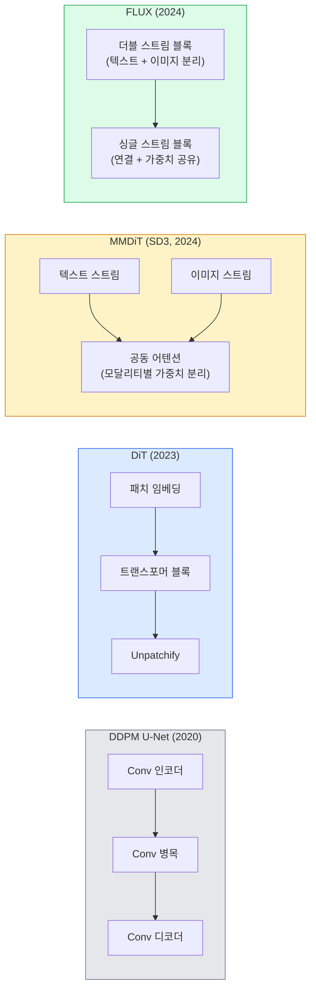

# 확산 트랜스포머와 정류 흐름(Rectified Flow)

> U-Net은 확산 모델의 비밀이 아닙니다. U-Net을 트랜스포머로 교체하고, 노이즈 스케줄을 직선 흐름으로 바꾸면 SD3, FLUX 및 모든 2026년 텍스트-이미지 모델이 됩니다.

**유형:** Learn + Build
**언어:** Python
**선수 요건:** 4단계 10강 (Diffusion DDPM), 4단계 14강 (ViT), 7단계 02강 (Self-Attention)
**시간:** 약 75분

## 학습 목표

- U-Net DDPM (10강)에서 Diffusion Transformer (DiT), MMDiT (SD3), 단일+이중 스트림 DiT (FLUX)로 진화하는 과정을 추적해 보세요
- 정류 흐름(rectified flow)을 설명해 보세요: 노이즈와 데이터 사이의 직선 궤적이 모델이 1000단계가 아닌 20단계로 샘플링할 수 있게 하는 이유를 이해해 보세요
- 100줄 미만의 작은 DiT 블록과 정류 흐름 학습 루프를 구현해 보세요
- SD3, FLUX.1-dev, FLUX.1-schnell, Z-Image, Qwen-Image의 모델 변형을 아키텍처, 매개변수 수, 라이선스로 구분해 보세요

## 문제점

10강에서는 U-Net 디노이저를 사용한 DDPM을 구축했습니다. 이 레시피는 2020-2023년을 지배했습니다: U-Net + beta 스케줄 + 노이즈 예측 손실. 이 레시피는 Stable Diffusion 1.5, 2.1 및 DALL-E 2를 생성했습니다.

2026년 최신 텍스트-이미지 모델은 모두 이 레시피를 넘어섰습니다. Stable Diffusion 3, FLUX, SD4, Z-Image, Qwen-Image, Hunyuan-Image는 U-Net을 사용하지 않습니다. Diffusion Transformers (DiT)를 사용합니다. SD3와 FLUX는 DDPM 노이즈 스케줄을 정류 흐름(rectified flow)으로 교체하여, 노이즈에서 데이터까지의 경로를 직선화하고, 일관성 또는 증류 변형을 통해 1-4단계 추론을 가능하게 합니다.

이 변화는 확산 기반 이미지 생성이 제어 가능해지고, 프롬프트 정확도가 높아지며(SD3/SD4는 텍스트 렌더링을 해결), 생산 속도가 빨라진 이유이기 때문에 중요합니다. DiT + 정류 흐름을 이해하는 것은 2026년 생성 이미지 스택을 이해하는 것입니다.

## 개념

### U-Net에서 트랜스포머로



- **DiT** (Peebles & Xie, 2023) — U-Net을 잠재 패치에 적용된 ViT 유사 트랜스포머로 대체합니다. 적응형 레이어 노름(AdaLN)을 통해 조건을 적용합니다.
- **MMDiT** (SD3, Esser et al., 2024) — 텍스트 및 이미지 토큰에 대해 가중치가 분리된 두 개의 스트림이 공동 어텐션을 공유합니다.
- **FLUX** (Black Forest Labs, 2024) — 첫 N개 블록은 SD3처럼 더블 스트림을 사용하며, 이후 블록은 더 깊은 깊이에서의 효율성을 위해 연결하고 가중치를 공유합니다(싱글 스트림).
- **Z-Image** (2025) — 60억 매개변수의 효율적인 싱글 스트림 DiT로 "무조건적인 확장"에 도전합니다.

### 직선 흐름(rectified flow)을 한 단락으로 설명

DDPM은 순방향 과정을 `x_t`이 점점 더 오염되는 잡음 SDE로 정의합니다. 학습된 역방향은 두 번째 SDE이며, 1000개의 작은 단계로 해결됩니다.

직선 흐름(rectified flow)은 깨끗한 데이터와 순수한 잡음 사이의 **직선 보간**을 정의합니다:

```
x_t = (1 - t) * x_0 + t * epsilon,     t in [0, 1]
```

네트워크가 속도 `v_theta(x_t, t) = epsilon - x_0`를 예측하도록 학습합니다. 이는 깨끗한 데이터에서 잡음으로 가는 직선 경로상의 순방향 방향(`dx_t/dt`)입니다. 샘플링 중에는 이 속도를 역방향으로 적분하여 잡음에서 데이터로 단계적으로 이동합니다. resulting ODE는 직선에 훨씬 더 가까우므로, 샘플링에 필요한 적분 단계 수가 훨씬 적습니다.

SD3는 이를 **직선 흐름 매칭(Rectified Flow Matching)**이라고 부릅니다. FLUX, Z-Image 및 대부분의 2026년 모델은 동일한 목적 함수를 사용합니다. 일반적인 추론: 20-30개의 오일러 단계(결정적) vs. 이전 DDPM 방식의 50개 이상의 DDIM 단계. 증류(distilled) / 터보(turbo) / 슈넬(schnell) / LCM 변형은 이를 1-4단계로 줄입니다.

### AdaLN 조건 적용

DiT는 **적응형 레이어 노름**을 통해 시간 단계 및 클래스/텍스트에 조건을 적용합니다: 조건 벡터에서 `scale`와 `shift`를 예측하고, 레이어 노름(LayerNorm) 이후에 이를 적용합니다. U-Net의 FiLM 스타일 변조보다 훨씬 깔끔하며, 모든 최신 DiT의 기본값입니다.

```
cond -> MLP -> (scale, shift, gate)
norm(x) * (1 + scale) + shift, then residual add * gate
```

### SD3 및 FLUX의 텍스트 인코더

- **SD3**는 세 개의 텍스트 인코더를 사용합니다: 두 개의 CLIP 모델 + T5-XXL. 임베딩이 연결되어 텍스트 조건으로 이미지 스트림에 입력됩니다.
- **FLUX**는 CLIP-L + T5-XXL를 하나 사용합니다.
- **Qwen-Image / Z-Image** 변형은 자체 개발한 텍스트 인코더를 사용하며, 이는 해당 모델의 기본 LLM과 정렬(aligned)되어 있습니다.

텍스트 인코더는 SD3/FLUX가 SD1.5보다 프롬프트를 훨씬 더 잘 이해하는 이유의 큰 부분을 차지합니다. T5-XXL만으로도 47억(4.7B) 파라미터입니다.

### Classifier-free guidance는 여전히 유효합니다

Rectified flow는 샘플러를 변경할 뿐, 조건부 처리(conditioning)는 변경하지 않습니다. Classifier-free guidance (학습 중 10% 확률로 텍스트를 드롭하고, 추론 시 조건부 및 무조건부 예측을 혼합)는 rectified flow에서도 동일하게 작동합니다. 2026년 대부분의 모델은 guidance scale을 3.5-5로 사용하며, 이는 rectified flow 모델이 기본적으로 프롬프트를 더 엄격하게 따르기 때문에 SD1.5의 7.5보다 낮습니다.

### Consistency, Turbo, Schnell, LCM

네 가지 이름은 모두 동일한 개념을 가리킵니다: 느린 다단계 모델을 빠른 소수 단계 모델로 증류(distil)하는 것입니다.

- **LCM (Latent Consistency Model)** — 임의의 중간 `x_t`에서 최종 `x_0`을 한 단계로 예측하는 학생(student) 모델을 학습합니다.
- **SDXL Turbo / FLUX schnell** — 적대적 diffusion distillation으로 학습된 1-4 단계 모델입니다.
- **SD Turbo** — OpenAI 스타일의 Consistency Models를 latent diffusion에 적용한 것입니다.

새로운 모델의 프로덕션 서빙은 "full quality" 체크포인트와 "turbo / schnell" 변형을 모두 포함하여 출시합니다. Schnell (독일어로 "fast", Black Forest Labs의 관례)은 1-4 단계로 실행되며 실시간 파이프라인에 적합합니다.

### 2026년 모델 현황

| 모델 | 크기 | 아키텍처 | 라이선스 |
|-------|------|--------------|---------|
| Stable Diffusion 3 Medium | 2B | MMDiT | SAI Community |
| Stable Diffusion 3.5 Large | 8B | MMDiT | SAI Community |
| FLUX.1-dev | 12B | Double + Single Stream DiT | 비영리 |
| FLUX.1-schnell | 12B | 동일, 증류(distilled) | Apache 2.0 |
| FLUX.2 | — | FLUX.1 반복(iterated) | 혼합 |
| Z-Image | 6B | S3-DiT (Scalable Single-Stream) | 허용적(permissive) |
| Qwen-Image | ~20B | DiT + Qwen 텍스트 타워 | Apache 2.0 |
| Hunyuan-Image-3.0 | ~80B | DiT | 연구용 |
| SD4 Turbo | 3B | DiT + 증류(distillation) | SAI Commercial |

FLUX.1-schnell은 2026년 오픈소스 기본값입니다. Z-Image는 효율성 리더입니다. FLUX.2와 SD4는 현재 품질의 정점입니다.

### 이 단계적 변화가 중요한 이유

DDPM + U-Net은 작동했습니다. DiT + rectified flow는 **더 잘, 더 빠르게, 더 깔끔하게 확장됩니다**. 이 전환은 NLP에서 RNN에서 트랜스포머로의 전환과 유사합니다. 두 아키텍처 모두 동일한 문제를 해결했지만, 트랜스포머가 확장되어 현재 지배하고 있습니다. 2026년 이미지, 비디오 또는 3D 생성에 관한 모든 논문은 DiT 형태의 디노이저와 일반적으로 rectified flow 목적 함수를 사용합니다. U-Net DDPM은 현재 주로 교육적 목적(10강)으로 사용됩니다.

```figure
cv3-rectified-flow
```

## 구현하기

### 1단계: AdaLN을 포함한 DiT 블록

```python
import torch
import torch.nn as nn


class AdaLNZero(nn.Module):
    """
    Adaptive LayerNorm with a gate. Predicts (scale, shift, gate) from the conditioning.
    Init such that the whole block starts as identity ("zero init").
    """

    def __init__(self, dim, cond_dim):
        super().__init__()
        self.norm = nn.LayerNorm(dim, elementwise_affine=False)
        self.mlp = nn.Linear(cond_dim, dim * 3)
        nn.init.zeros_(self.mlp.weight)
        nn.init.zeros_(self.mlp.bias)

    def forward(self, x, cond):
        scale, shift, gate = self.mlp(cond).chunk(3, dim=-1)
        h = self.norm(x) * (1 + scale.unsqueeze(1)) + shift.unsqueeze(1)
        return h, gate.unsqueeze(1)


class DiTBlock(nn.Module):
    def __init__(self, dim=192, heads=3, mlp_ratio=4, cond_dim=192):
        super().__init__()
        self.adaln1 = AdaLNZero(dim, cond_dim)
        self.attn = nn.MultiheadAttention(dim, heads, batch_first=True)
        self.adaln2 = AdaLNZero(dim, cond_dim)
        self.mlp = nn.Sequential(
            nn.Linear(dim, dim * mlp_ratio),
            nn.GELU(),
            nn.Linear(dim * mlp_ratio, dim),
        )

    def forward(self, x, cond):
        h, gate1 = self.adaln1(x, cond)
        a, _ = self.attn(h, h, h, need_weights=False)
        x = x + gate1 * a
        h, gate2 = self.adaln2(x, cond)
        x = x + gate2 * self.mlp(h)
        return x
```

`AdaLNZero`는 MLP 가중치가 0으로 초기화되어 항등 매핑(identity mapping)으로 시작합니다. 학습은 블록을 항등 매핑에서 벗어나게 유도하며, 이는 깊은 트랜스포머 확산 모델을 극적으로 안정화합니다.

### 2단계: 작은 DiT

```python
def timestep_embedding(t, dim):
    import math
    half = dim // 2
    freqs = torch.exp(-math.log(10000) * torch.arange(half, device=t.device) / half)
    args = t[:, None].float() * freqs[None]
    return torch.cat([args.sin(), args.cos()], dim=-1)


class TinyDiT(nn.Module):
    def __init__(self, image_size=16, patch_size=2, in_channels=3, dim=96, depth=4, heads=3):
        super().__init__()
        self.patch_size = patch_size
        self.num_patches = (image_size // patch_size) ** 2
        self.patch = nn.Conv2d(in_channels, dim, kernel_size=patch_size, stride=patch_size)
        self.pos = nn.Parameter(torch.zeros(1, self.num_patches, dim))
        self.time_mlp = nn.Sequential(
            nn.Linear(dim, dim * 2),
            nn.SiLU(),
            nn.Linear(dim * 2, dim),
        )
        self.blocks = nn.ModuleList([DiTBlock(dim, heads, cond_dim=dim) for _ in range(depth)])
        self.norm_out = nn.LayerNorm(dim, elementwise_affine=False)
        self.head = nn.Linear(dim, patch_size * patch_size * in_channels)

    def forward(self, x, t):
        n = x.size(0)
        x = self.patch(x)
        x = x.flatten(2).transpose(1, 2) + self.pos
        t_emb = self.time_mlp(timestep_embedding(t, self.pos.size(-1)))
        for blk in self.blocks:
            x = blk(x, t_emb)
        x = self.norm_out(x)
        x = self.head(x)
        return self._unpatchify(x, n)

    def _unpatchify(self, x, n):
        p = self.patch_size
        h = w = int(self.num_patches ** 0.5)
        x = x.view(n, h, w, p, p, -1).permute(0, 5, 1, 3, 2, 4).reshape(n, -1, h * p, w * p)
        return x
```

### 3단계: Rectified flow 학습

```python
import torch.nn.functional as F

def rectified_flow_train_step(model, x0, optimizer, device):
    model.train()
    x0 = x0.to(device)
    n = x0.size(0)
    t = torch.rand(n, device=device)
    epsilon = torch.randn_like(x0)
    x_t = (1 - t[:, None, None, None]) * x0 + t[:, None, None, None] * epsilon

    target_velocity = epsilon - x0
    pred_velocity = model(x_t, t)

    loss = F.mse_loss(pred_velocity, target_velocity)
    optimizer.zero_grad()
    loss.backward()
    optimizer.step()
    return loss.item()
```

DDPM의 노이즈 예측 손실(10강)과 비교해 보세요: 구조는 같지만 목표가 다릅니다. 노이즈 `epsilon`를 예측하는 대신, 데이터에서 노이즈로 직선 보간을 따라 가리키는 **속도(velocity)** `epsilon - x_0`를 예측합니다.

### 4단계: 오일러 샘플러

Rectified flow는 ODE입니다. 오일러 방법은 가장 단순하며, 잘 학습된 rectified flow 모델에서는 20+ 단계에서 고차 솔vers와 거의 동일한 정확도를 제공합니다.

```python
@torch.no_grad()
def rectified_flow_sample(model, shape, steps=20, device="cpu"):
    model.eval()
    x = torch.randn(shape, device=device)
    dt = 1.0 / steps
    t = torch.ones(shape[0], device=device)
    for _ in range(steps):
        v = model(x, t)
        x = x - dt * v
        t = t - dt
    return x
```

20단계. 학습된 모델에서는 1000단계 DDPM과 비교할 수 있는 샘플을 생성합니다.

### 5단계: 엔드투엔드 스모크 테스트

```python
import numpy as np

def synthetic_blobs(num=200, size=16, seed=0):
    rng = np.random.default_rng(seed)
    out = np.zeros((num, 3, size, size), dtype=np.float32)
    yy, xx = np.meshgrid(np.arange(size), np.arange(size), indexing="ij")
    for i in range(num):
        cx, cy = rng.uniform(4, size - 4, size=2)
        r = rng.uniform(2, 4)
        mask = (xx - cx) ** 2 + (yy - cy) ** 2 < r ** 2
        colour = rng.uniform(-1, 1, size=3)
        for c in range(3):
            out[i, c][mask] = colour[c]
    return torch.from_numpy(out)
```

이 모델에 `TinyDiT`를 rectified flow로 학습하세요. 500단계 후, 샘플링된 출력은 희미한 색상 덩어리처럼 보여야 합니다.

## 사용하기

FLUX / SD3 / Z-Image로 실제 이미지 생성을 할 때, `diffusers`는 통합 API로 모든 모델을 제공합니다:

```python
from diffusers import FluxPipeline, StableDiffusion3Pipeline
import torch

pipe = FluxPipeline.from_pretrained(
    "black-forest-labs/FLUX.1-schnell",
    torch_dtype=torch.bfloat16,
).to("cuda")

out = pipe(
    prompt="a golden retriever surfing a tsunami, hyperrealistic, studio lighting",
    guidance_scale=0.0,           # schnell은 CFG 없이 학습되었습니다
    num_inference_steps=4,
    max_sequence_length=256,
).images[0]
out.save("surf.png")
```

세 줄 코드. `FLUX.1-schnell`는 4단계로 실행됩니다. 모델 ID를 `black-forest-labs/FLUX.1-dev`로 바꾸면 20-30단계에서 CFG를 사용하여 더 높은 품질을 얻을 수 있습니다.

SD3의 경우:

```python
pipe = StableDiffusion3Pipeline.from_pretrained(
    "stabilityai/stable-diffusion-3.5-large",
    torch_dtype=torch.bfloat16,
).to("cuda")
out = pipe(prompt, guidance_scale=3.5, num_inference_steps=28).images[0]
```

## 출시하기

이 강의는 다음을 생성합니다:

- `outputs/prompt-dit-model-picker.md` — 품질, 지연 시간 및 라이선스 제약 조건에 따라 SD3, FLUX.1-dev, FLUX.1-schnell, Z-Image, SD4 Turbo 중 하나를 선택합니다.
- `outputs/skill-rectified-flow-trainer.md` — AdaLN DiT와 오일러 샘플링을 사용하여 rectified flow의 완전한 학습 루프를 작성합니다.

## 연습 문제

1. **(쉬움)** 위의 TinyDiT를 합성 blob 데이터셋에서 500단계 동안 학습해 보세요. 10, 20, 50 오일러 단계로 생성된 샘플을 비교해 보세요.
2. **(중간)** 학습된 클래스 임베딩을 시간 임베딩에 연결하여 텍스트 조건을 추가해 보세요 (색상별 10개 blob "클래스"). 클래스 0, 5, 9로 샘플링하고 색상이 일치하는지 확인해 보세요.
3. **(어려움)** 동일한 데이터에서 동일한 단계 수로 학습된 rectified-flow와 DDPM 버전의 같은 크기 네트워크에서 생성된 샘플 간의 Fréchet 거리 (FID 대리 지표)를 계산해 보세요. 어떤 모델이 더 빠르게 수렴하는지 보고해 보세요.

## 핵심 용어

| 용어 | 사람들이 말하는 것 | 실제 의미 |
|------|----------------|----------------------|
| DiT | "확산 트랜스포머" | U-Net을 대체하여 확산 디노이저로 작동하는 트랜스포머; 패치화된 잠재 변수(latent)에서 작동 |
| AdaLN | "적응형 레이어 정규화" | LayerNorm 이후에 적용되는 학습된 스케일, 시프트, 게이트를 통한 시간 단계/텍스트 조건; 모든 최신 DiT의 표준 |
| MMDiT | "멀티모달 DiT (SD3)" | 텍스트 및 이미지 토큰에 대한 분리된 가중치 스트림이 결합된 셀프 어텐션을 공유 |
| 단일 스트림 / 이중 스트림 | "FLUX 트릭" | 첫 N 블록은 이중 스트림 (모달리티별 분리 가중치), 이후 블록은 단일 스트림 (연결 + 공유 가중치)으로 효율성을 높임 |
| Rectified flow | "직선 노이즈-데이터" | 데이터와 노이즈 간의 선형 보간; 네트워크가 속도(velocity)를 예측; 추론 시 더 적은 ODE 단계 필요 |
| 속도 목표 | "epsilon - x_0" | rectified flow의 회귀 목표; 깨끗한 데이터에서 노이즈를 가리킴 |
| CFG 가이던스 | "분류기 없는 가이던스" | 조건부 및 무조건부 예측을 혼합; rectified-flow 모델에서도 여전히 사용 |
| Schnell / turbo / LCM | "1-4 단계 증류" | 고품질 모델에서 증류된 소단계 변형; 실시간 생산용 |

## 추가 읽기

- [Scalable Diffusion Models with Transformers (Peebles & Xie, 2023)](https://arxiv.org/abs/2212.09748) — DiT 논문
- [Scaling Rectified Flow Transformers (Esser et al., SD3 paper)](https://arxiv.org/abs/2403.03206) — 대규모 MMDiT 및 rectified-flow
- [FLUX.1 model card and technical report (Black Forest Labs)](https://huggingface.co/black-forest-labs/FLUX.1-dev) — 이중 + 단일 스트림 세부 사항
- [Z-Image: Efficient Image Generation Foundation Model (2025)](https://arxiv.org/html/2511.22699v1) — 6B 단일 스트림 DiT
- [Elucidating the Design Space of Diffusion (Karras et al., 2022)](https://arxiv.org/abs/2206.00364) — 모든 확산 설계 트레이드오프의 기준
- [Latent Consistency Models (Luo et al., 2023)](https://arxiv.org/abs/2310.04378) — LCM-LoRA가 4단계 추론을 제공하는 방법
