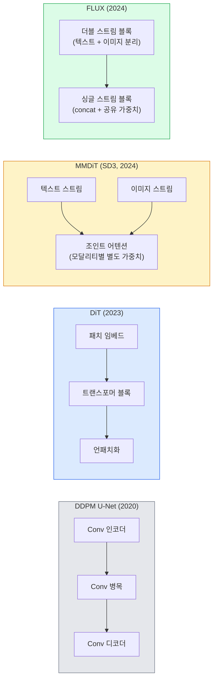

# Diffusion Transformer와 Rectified Flow (Diffusion Transformers & Rectified Flow)

> 확산의 비밀은 U-Net이 아닙니다. 트랜스포머로 바꾸고, 노이즈 스케줄을 직선 흐름으로 바꾸면, 갑자기 SD3, FLUX, 그리고 모든 2026 text-to-image 모델이 됩니다.

**Type:** Learn + Build
**Languages:** Python
**Prerequisites:** Phase 4 Lesson 10 (Diffusion DDPM), Phase 4 Lesson 14 (ViT), Phase 7 Lesson 02 (Self-Attention)
**Time:** ~75 minutes

## 학습 목표 (Learning Objectives)

- U-Net DDPM(Lesson 10)에서 Diffusion Transformer(DiT), MMDiT(SD3), single+double-stream DiT(FLUX)로의 진화를 추적합니다
- Rectified flow를 설명합니다: 노이즈와 데이터 사이 직선 궤적이 왜 1000스텝 대신 20스텝 샘플링을 가능하게 하는지
- 100줄 미만으로 작은 DiT 블록과 rectified-flow 학습 루프를 구현합니다
- 아키텍처, 파라미터 수, 라이선스로 모델 변형(SD3, FLUX.1-dev, FLUX.1-schnell, Z-Image, Qwen-Image)을 구분합니다

## 문제 상황 (The Problem)

Lesson 10은 U-Net 디노이저로 DDPM을 만들었습니다. 그 레시피가 2020–2023을 지배했습니다: U-Net + beta 스케줄 + 노이즈 예측 손실. Stable Diffusion 1.5와 2.1, DALL-E 2를 낳았습니다.

모든 2026 SOTA text-to-image 모델은 그것을 넘어섰습니다. Stable Diffusion 3, FLUX, SD4, Z-Image, Qwen-Image, Hunyuan-Image — 어느 것도 U-Net을 쓰지 않습니다. Diffusion Transformer(DiT)를 씁니다. SD3와 FLUX는 또한 DDPM 노이즈 스케줄을 rectified flow로 바꿔, 노이즈에서 데이터로의 경로를 곧게 만들고 consistency 또는 distilled 변형으로 1–4스텝 추론을 가능하게 합니다.

이 전환이 중요한 이유는, 확산 기반 이미지 생성이 제어 가능하고, 프롬프트에 정확하며(SD3/SD4가 텍스트 렌더링을 해결), 프로덕션에서 빨라진 이유이기 때문입니다. DiT + rectified flow를 이해하는 것은 2026 생성 이미지 스택을 이해하는 것입니다.

## 핵심 개념 (The Concept)

### U-Net에서 트랜스포머로 (From U-Net to transformer)



- **DiT** (Peebles & Xie, 2023) — U-Net을 잠재 패치 위의 ViT형 트랜스포머로 교체. Adaptive layer norm(AdaLN)으로 조건화.
- **MMDiT** (SD3, Esser et al., 2024) — 텍스트와 이미지 토큰에 별도 가중치를 가진 두 스트림이 조인트 어텐션을 공유.
- **FLUX** (Black Forest Labs, 2024) — 처음 N블록은 SD3처럼 더블 스트림, 이후 블록은 concat 후 가중치 공유(싱글 스트림)로 더 깊은 깊이에서 효율.
- **Z-Image** (2025) — 6B 파라미터의 효율적 싱글 스트림 DiT로 "규모가 전부"에 도전.

### 한 단락으로 보는 Rectified flow (Rectified flow in one paragraph)

DDPM은 전방 과정을 `x_t`가 점점 오염되는 노이지 SDE로 정의합니다. 학습된 역과정은 두 번째 SDE이며, 1000개의 작은 스텝으로 풉니다.

Rectified flow는 깨끗한 데이터와 순수 노이즈 사이 **직선** 보간을 정의합니다:

```
x_t = (1 - t) * x_0 + t * epsilon,     t in [0, 1]
```

네트워크가 속도 `v_theta(x_t, t) = epsilon - x_0` — 깨끗한 데이터에서 노이즈로 가는 직선 경로의 전방 방향(`dx_t/dt`) — 을 예측하도록 학습합니다. 샘플링 중에는 이 속도를 뒤로 적분하며 노이즈에서 데이터로 갑니다. 결과 ODE가 직선에 훨씬 가까워, 샘플에 필요한 적분 스텝이 훨씬 적습니다.

SD3는 이를 **Rectified Flow Matching**이라 부릅니다. FLUX, Z-Image, 대부분의 2026 모델이 같은 목적을 씁니다. 전형적 추론: 20–30 Euler 스텝(결정적) vs 옛 DDPM 체제의 50+ DDIM 스텝. Distilled / turbo / schnell / LCM 변형은 1–4스텝까지 내립니다.

### AdaLN 조건화 (AdaLN conditioning)

DiT는 타임스텝과 클래스/텍스트를 **adaptive layer norm**으로 조건화합니다: 조건화 벡터에서 `scale`과 `shift`를 예측해 LayerNorm 뒤에 적용합니다. U-Net의 FiLM형 변조보다 훨씬 깔끔하며 모든 현대 DiT의 기본입니다.

```
cond -> MLP -> (scale, shift, gate)
norm(x) * (1 + scale) + shift, then residual add * gate
```

### SD3와 FLUX의 텍스트 인코더 (Text encoders in SD3 and FLUX)

- **SD3**는 세 텍스트 인코더를 씁니다: CLIP 두 개 + T5-XXL. 임베딩을 concat해 이미지 스트림에 텍스트 조건화로 넣습니다.
- **FLUX**는 CLIP-L 하나 + T5-XXL을 씁니다.
- **Qwen-Image / Z-Image** 변형은 자체 LLM에 맞춘 사내 텍스트 인코더를 씁니다.

텍스트 인코더가 SD3/FLUX가 SD1.5보다 프롬프트를 훨씬 잘 추론하는 큰 이유입니다. T5-XXL만 4.7B 파라미터입니다.

### Classifier-free guidance는 그대로 (Classifier-free guidance still holds)

Rectified flow는 샘플러를 바꾸지, 조건화를 바꾸지 않습니다. Classifier-free guidance(학습 중 10% 확률로 텍스트를 드롭, 추론 시 조건부·무조건부 예측을 혼합)는 rectified flow에서도 동일하게 동작합니다. 대부분의 2026 모델은 guidance scale 3.5–5를 씁니다 — rectified-flow 모델이 기본적으로 프롬프트를 더 타이트하게 따르므로 SD1.5의 7.5보다 낮습니다.

### Consistency, Turbo, Schnell, LCM

같은 아이디어의 네 이름: 느린 다스텝 모델을 빠른 소수 스텝 모델로 증류합니다.

- **LCM (Latent Consistency Model)** — 임의의 중간 `x_t`에서 최종 `x_0`을 한 스텝에 예측하는 학생을 학습.
- **SDXL Turbo / FLUX schnell** — 적대적 확산 증류로 학습된 1–4스텝 모델.
- **SD Turbo** — OpenAI형 Consistency Models를 잠재 확산에 적응.

모든 새 모델의 프로덕션 서빙은 "풀 퀄리티" 체크포인트와 "turbo / schnell" 변형을 둘 다 출시합니다. Schnell(독일어로 "빠름", Black Forest Labs 관례)은 1–4스텝으로 돌며 실시간 파이프라인에 맞습니다.

### 2026 모델 지형 (Model landscape in 2026)

| Model | Size | Architecture | License |
|-------|------|--------------|---------|
| Stable Diffusion 3 Medium | 2B | MMDiT | SAI Community |
| Stable Diffusion 3.5 Large | 8B | MMDiT | SAI Community |
| FLUX.1-dev | 12B | Double + Single Stream DiT | non-commercial |
| FLUX.1-schnell | 12B | same, distilled | Apache 2.0 |
| FLUX.2 | — | iterated FLUX.1 | mixed |
| Z-Image | 6B | S3-DiT (Scalable Single-Stream) | permissive |
| Qwen-Image | ~20B | DiT + Qwen text tower | Apache 2.0 |
| Hunyuan-Image-3.0 | ~80B | DiT | research |
| SD4 Turbo | 3B | DiT + distillation | SAI Commercial |

FLUX.1-schnell이 2026 오픈소스 기본값입니다. Z-Image가 효율 리더입니다. FLUX.2와 SD4가 현재 품질 선두입니다.

### 이 전환이 중요한 이유 (Why this phase shift matters)

DDPM + U-Net은 동작했습니다. DiT + rectified flow는 **더 잘, 더 빠르게, 더 깔끔하게 스케일**됩니다. NLP에서 RNN에서 트랜스포머로의 전환과 평행합니다: 두 아키텍처가 같은 문제를 풀었지만, 트랜스포머가 스케일되어 이제 지배합니다. 이미지·비디오·3D 생성의 모든 2026 논문이 DiT형 디노이저와 대개 rectified flow 목적을 씁니다. U-Net DDPM은 이제 주로 교육용입니다(Lesson 10).

```figure
cv3-rectified-flow
```

## 직접 만들기 (Build It)

### Step 1: AdaLN이 있는 DiT 블록 (A DiT block with AdaLN)

```python
import torch
import torch.nn as nn


class AdaLNZero(nn.Module):
    """
    Adaptive LayerNorm with a gate. Predicts (scale, shift, gate) from the conditioning.
    Init such that the whole block starts as identity ("zero init").
    """

    def __init__(self, dim, cond_dim):
        super().__init__()
        self.norm = nn.LayerNorm(dim, elementwise_affine=False)
        self.mlp = nn.Linear(cond_dim, dim * 3)
        nn.init.zeros_(self.mlp.weight)
        nn.init.zeros_(self.mlp.bias)

    def forward(self, x, cond):
        scale, shift, gate = self.mlp(cond).chunk(3, dim=-1)
        h = self.norm(x) * (1 + scale.unsqueeze(1)) + shift.unsqueeze(1)
        return h, gate.unsqueeze(1)


class DiTBlock(nn.Module):
    def __init__(self, dim=192, heads=3, mlp_ratio=4, cond_dim=192):
        super().__init__()
        self.adaln1 = AdaLNZero(dim, cond_dim)
        self.attn = nn.MultiheadAttention(dim, heads, batch_first=True)
        self.adaln2 = AdaLNZero(dim, cond_dim)
        self.mlp = nn.Sequential(
            nn.Linear(dim, dim * mlp_ratio),
            nn.GELU(),
            nn.Linear(dim * mlp_ratio, dim),
        )

    def forward(self, x, cond):
        h, gate1 = self.adaln1(x, cond)
        a, _ = self.attn(h, h, h, need_weights=False)
        x = x + gate1 * a
        h, gate2 = self.adaln2(x, cond)
        x = x + gate2 * self.mlp(h)
        return x
```

`AdaLNZero`는 MLP 가중치가 0으로 초기화되어 identity로 시작합니다. 학습이 블록을 identity에서 밀어냅니다; 깊은 트랜스포머 확산 모델을 극적으로 안정화합니다.

### Step 2: 작은 DiT (A tiny DiT)

```python
def timestep_embedding(t, dim):
    import math
    half = dim // 2
    freqs = torch.exp(-math.log(10000) * torch.arange(half, device=t.device) / half)
    args = t[:, None].float() * freqs[None]
    return torch.cat([args.sin(), args.cos()], dim=-1)


class TinyDiT(nn.Module):
    def __init__(self, image_size=16, patch_size=2, in_channels=3, dim=96, depth=4, heads=3):
        super().__init__()
        self.patch_size = patch_size
        self.num_patches = (image_size // patch_size) ** 2
        self.patch = nn.Conv2d(in_channels, dim, kernel_size=patch_size, stride=patch_size)
        self.pos = nn.Parameter(torch.zeros(1, self.num_patches, dim))
        self.time_mlp = nn.Sequential(
            nn.Linear(dim, dim * 2),
            nn.SiLU(),
            nn.Linear(dim * 2, dim),
        )
        self.blocks = nn.ModuleList([DiTBlock(dim, heads, cond_dim=dim) for _ in range(depth)])
        self.norm_out = nn.LayerNorm(dim, elementwise_affine=False)
        self.head = nn.Linear(dim, patch_size * patch_size * in_channels)

    def forward(self, x, t):
        n = x.size(0)
        x = self.patch(x)
        x = x.flatten(2).transpose(1, 2) + self.pos
        t_emb = self.time_mlp(timestep_embedding(t, self.pos.size(-1)))
        for blk in self.blocks:
            x = blk(x, t_emb)
        x = self.norm_out(x)
        x = self.head(x)
        return self._unpatchify(x, n)

    def _unpatchify(self, x, n):
        p = self.patch_size
        h = w = int(self.num_patches ** 0.5)
        x = x.view(n, h, w, p, p, -1).permute(0, 5, 1, 3, 2, 4).reshape(n, -1, h * p, w * p)
        return x
```

### Step 3: Rectified flow 학습 (Rectified flow training)

```python
import torch.nn.functional as F

def rectified_flow_train_step(model, x0, optimizer, device):
    model.train()
    x0 = x0.to(device)
    n = x0.size(0)
    t = torch.rand(n, device=device)
    epsilon = torch.randn_like(x0)
    x_t = (1 - t[:, None, None, None]) * x0 + t[:, None, None, None] * epsilon

    target_velocity = epsilon - x0
    pred_velocity = model(x_t, t)

    loss = F.mse_loss(pred_velocity, target_velocity)
    optimizer.zero_grad()
    loss.backward()
    optimizer.step()
    return loss.item()
```

DDPM의 노이즈 예측 손실(Lesson 10)과 비교하세요: 구조는 같고 타깃이 다릅니다. 노이즈 `epsilon` 대신 **속도** `epsilon - x_0`을 예측하며, 이는 직선 보간을 따라 데이터에서 노이즈를 가리킵니다.

### Step 4: Euler 샘플러 (Euler sampler)

Rectified flow는 ODE입니다. Euler 방법이 가장 단순하고, 잘 학습된 rectified-flow 모델에서는 20+ 스텝에서 고차 솔버와 거의 같습니다.

```python
@torch.no_grad()
def rectified_flow_sample(model, shape, steps=20, device="cpu"):
    model.eval()
    x = torch.randn(shape, device=device)
    dt = 1.0 / steps
    t = torch.ones(shape[0], device=device)
    for _ in range(steps):
        v = model(x, t)
        x = x - dt * v
        t = t - dt
    return x
```

20 스텝. 학습된 모델에서는 1000스텝 DDPM과 비슷한 샘플을 냅니다.

### Step 5: End-to-end 스모크 테스트 (End-to-end smoke test)

```python
import numpy as np

def synthetic_blobs(num=200, size=16, seed=0):
    rng = np.random.default_rng(seed)
    out = np.zeros((num, 3, size, size), dtype=np.float32)
    yy, xx = np.meshgrid(np.arange(size), np.arange(size), indexing="ij")
    for i in range(num):
        cx, cy = rng.uniform(4, size - 4, size=2)
        r = rng.uniform(2, 4)
        mask = (xx - cx) ** 2 + (yy - cy) ** 2 < r ** 2
        colour = rng.uniform(-1, 1, size=3)
        for c in range(3):
            out[i, c][mask] = colour[c]
    return torch.from_numpy(out)
```

이것으로 `TinyDiT`를 rectified flow로 학습합니다. 500 스텝 후 샘플 출력은 옅은 색 blob처럼 보여야 합니다.

## 활용하기 (Use It)

FLUX / SD3 / Z-Image로 실제 이미지 생성할 때, `diffusers`가 통일 API로 모두 제공합니다:

```python
from diffusers import FluxPipeline, StableDiffusion3Pipeline
import torch

pipe = FluxPipeline.from_pretrained(
    "black-forest-labs/FLUX.1-schnell",
    torch_dtype=torch.bfloat16,
).to("cuda")

out = pipe(
    prompt="a golden retriever surfing a tsunami, hyperrealistic, studio lighting",
    guidance_scale=0.0,           # schnell was trained without CFG
    num_inference_steps=4,
    max_sequence_length=256,
).images[0]
out.save("surf.png")
```

세 줄. `FLUX.1-schnell`을 네 스텝으로. 더 높은 품질이 필요하면 CFG와 함께 20–30 스텝으로 모델 id를 `black-forest-labs/FLUX.1-dev`로 바꿉니다.

SD3의 경우:

```python
pipe = StableDiffusion3Pipeline.from_pretrained(
    "stabilityai/stable-diffusion-3.5-large",
    torch_dtype=torch.bfloat16,
).to("cuda")
out = pipe(prompt, guidance_scale=3.5, num_inference_steps=28).images[0]
```

## 결과물 배포 (Ship It)

이 레슨이 만드는 것:

- `outputs/prompt-dit-model-picker.md` — 품질·지연·라이선스 제약에 따라 SD3, FLUX.1-dev, FLUX.1-schnell, Z-Image, SD4 Turbo 중 고릅니다.
- `outputs/skill-rectified-flow-trainer.md` — AdaLN DiT와 Euler 샘플링으로 완전한 rectified flow 학습 루프를 작성합니다.

## 연습 문제 (Exercises)

1. **(Easy)** 위 TinyDiT를 합성 blob 데이터셋에서 500 스텝 학습합니다. 10, 20, 50 Euler 스텝으로 만든 샘플을 비교합니다.
2. **(Medium)** 학습된 클래스 임베딩을 시간 임베딩에 concat해 텍스트 조건화를 추가합니다(색별 blob "클래스" 10개). 클래스 0, 5, 9로 샘플링하고 색이 맞는지 확인합니다.
3. **(Hard)** 같은 크기 네트워크를 같은 데이터·같은 스텝 수로 학습한 rectified-flow와 DDPM 버전의 생성 샘플 사이 Fréchet distance(FID 프록시)를 계산합니다. 어느 쪽이 더 빨리 수렴하는지 보고합니다.

## 핵심 용어 (Key Terms)

| 용어 | 사람들이 말하는 것 | 실제 의미 |
|------|----------------|----------------------|
| DiT | "Diffusion transformer" | U-Net을 대체하는 확산 디노이저 트랜스포머; 패치화된 잠재 위에서 동작 |
| AdaLN | "Adaptive layer norm" | LayerNorm 뒤 학습된 scale/shift/gate로 타임스텝/텍스트 조건화; 모든 현대 DiT 표준 |
| MMDiT | "Multi-modal DiT (SD3)" | 조인트 self-attention을 공유하는 텍스트·이미지 토큰별 별도 가중치 스트림 |
| Single-stream / double-stream | "FLUX 트릭" | 처음 N블록 더블 스트림(모달리티별 별도 가중치), 이후 싱글 스트림(concat + 공유 가중치)으로 효율 |
| Rectified flow | "직선 노이즈-to-데이터" | 데이터와 노이즈의 선형 보간; 네트워크가 속도 예측; 추론에 필요한 ODE 스텝이 적음 |
| Velocity target | "epsilon - x_0" | Rectified flow의 회귀 타깃; 깨끗한 데이터에서 노이즈를 가리킴 |
| CFG guidance | "classifier-free guidance" | 조건부·무조건부 예측 혼합; rectified-flow 모델에서도 사용 |
| Schnell / turbo / LCM | "1–4스텝 증류" | 풀 퀄리티 모델에서 증류한 소수 스텝 변형; 프로덕션 실시간 |

## 더 읽을거리 (Further Reading)

- [Scalable Diffusion Models with Transformers (Peebles & Xie, 2023)](https://arxiv.org/abs/2212.09748) — DiT 논문
- [Scaling Rectified Flow Transformers (Esser et al., SD3 paper)](https://arxiv.org/abs/2403.03206) — 스케일에서의 MMDiT와 rectified flow
- [FLUX.1 model card and technical report (Black Forest Labs)](https://huggingface.co/black-forest-labs/FLUX.1-dev) — double + single-stream 세부
- [Z-Image: Efficient Image Generation Foundation Model (2025)](https://arxiv.org/html/2511.22699v1) — 6B 싱글 스트림 DiT
- [Elucidating the Design Space of Diffusion (Karras et al., 2022)](https://arxiv.org/abs/2206.00364) — 모든 확산 설계 트레이드오프의 참고
- [Latent Consistency Models (Luo et al., 2023)](https://arxiv.org/abs/2310.04378) — LCM-LoRA가 4스텝 추론을 주는 방식
