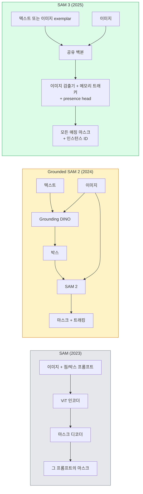

# SAM 3와 Open-Vocabulary Segmentation (SAM 3 & Open-Vocabulary Segmentation)

> 모델에 텍스트 프롬프트와 이미지를 주면 매칭되는 모든 객체의 마스크를 얻습니다. SAM 3가 이를 단일 전방 패스로 만들었습니다.

**Type:** Use + Build
**Languages:** Python
**Prerequisites:** Phase 4 Lesson 07 (U-Net), Phase 4 Lesson 08 (Mask R-CNN), Phase 4 Lesson 18 (CLIP)
**Time:** ~60 minutes

## 학습 목표 (Learning Objectives)

- SAM(시각 프롬프트만), Grounded SAM / SAM 2(검출기 + SAM), SAM 3(Promptable Concept Segmentation을 통한 네이티브 텍스트 프롬프트)를 구분합니다
- SAM 3 아키텍처를 설명합니다: 공유 백본 + 이미지 검출기 + 메모리 기반 비디오 트래커 + presence head + 분리된 detector-tracker 설계
- Hugging Face `transformers` SAM 3 통합으로 텍스트 프롬프트 검출·세그멘테이션·비디오 트래킹을 사용합니다
- 지연, 개념 복잡도, 배포 타깃에 따라 SAM 3, Grounded SAM 2, YOLO-World, SAM-MI 중 고릅니다

## 문제 상황 (The Problem)

2023 SAM은 시각 프롬프트 전용 모델이었습니다: 점을 클릭하거나 박스를 그리면 마스크를 반환합니다. "이 사진의 모든 오렌지를 줘"에는 검출기(Grounding DINO)로 박스를 만든 뒤 SAM으로 각각 세그먼트해야 했습니다. Grounded SAM이 이를 파이프라인으로 만들었지만, 두 동결 모델의 연쇄라 필연적 오차 누적이 있었습니다.

SAM 3(Meta, 2025년 11월, ICLR 2026)가 연쇄를 접었습니다. 짧은 명사구 또는 이미지 exemplar를 프롬프트로 받아 단일 전방 패스로 모든 매칭 마스크와 인스턴스 ID를 반환합니다. 그것이 **Promptable Concept Segmentation (PCS)** 입니다. 2026년 3월 Object Multiplex 업데이트(SAM 3.1)와 결합하면, 같은 개념의 여러 인스턴스를 비디오에서 효율적으로 추적합니다.

이 레슨은 이 구조적 전환에 관한 것입니다. 2D seg, 검출, 텍스트-이미지 그라운딩이 한 모델로 합쳐졌습니다. 프로덕션 질문은 더 이상 "어떤 파이프라인을 연쇄할까"가 아니라 "어떤 promptable 모델이 내 유스케이스를 end-to-end로 다루는가"입니다.

## 핵심 개념 (The Concept)

### 세 세대 (The three generations)



### Promptable Concept Segmentation

"개념 프롬프트"는 짧은 명사구(`"yellow school bus"`, `"striped red umbrella"`, `"hand holding a mug"`) 또는 이미지 exemplar입니다. 모델은 개념에 매칭되는 이미지의 모든 인스턴스에 대한 세그멘테이션 마스크와 매치당 고유 인스턴스 ID를 반환합니다.

고전적 시각 프롬프트 SAM과 세 가지가 다릅니다:

1. 인스턴스별 프롬프트가 필요 없음 — 텍스트 프롬프트 하나가 모든 매치를 반환.
2. Open-vocabulary — 자연어로 기술 가능한 무엇이든 개념이 될 수 있음.
3. 프롬프트당 마스크 하나가 아니라 여러 인스턴스를 한 번에 반환.

### 핵심 아키텍처 조각 (Key architectural pieces)

- **공유 백본** — 단일 ViT가 이미지를 처리합니다. 검출기 헤드와 메모리 기반 트래커가 모두 읽습니다.
- **Presence head** — 개념이 이미지에 아예 있는지 예측합니다. "여기 있는가?"를 "어디에 있는가?"와 분리합니다. 없는 개념에 대한 거짓 양성을 줄입니다.
- **분리된 detector-tracker** — 이미지 수준 검출과 비디오 수준 트래킹이 별도 헤드라 서로 간섭하지 않습니다.
- **메모리 뱅크** — 비디오 트래킹을 위해 프레임 간 인스턴스별 특징을 저장합니다(SAM 2가 쓴 같은 메커니즘).

### 대규모 학습 (Training at scale)

SAM 3는 AI + 사람 검토로 반복 주석·수정하는 데이터 엔진이 생성한 **4백만 고유 개념**으로 학습되었습니다. 새 **SA-CO 벤치마크**는 270K 고유 개념을 담아, 이전 벤치마크보다 50배 큽니다. SAM 3는 SA-CO에서 사람 성능의 75–80%에 도달하고, 이미지 + 비디오 PCS에서 기존 시스템을 두 배로 합니다.

### SAM 3.1 Object Multiplex

2026년 3월 업데이트: **Object Multiplex**는 같은 개념의 많은 인스턴스를 한 번에 공동 추적하는 공유 메모리 메커니즘을 도입합니다. 이전에는 N개 인스턴스 트래킹이 N개 별도 메모리 뱅크를 뜻했습니다. Multiplex는 이를 인스턴스별 쿼리가 있는 하나의 공유 메모리로 접습니다. 결과: 정확도를 희생하지 않으면서 다중 객체 트래킹이 상당히 빨라집니다.

### 2026년에 Grounded SAM이 여전히 중요한 곳 (Where Grounded SAM still matters in 2026)

- 특정 open-vocabulary 검출기를 교체해야 할 때(DINO-X, Florence-2).
- SAM 3 라이선스(HF 게이트)가 걸림돌일 때.
- SAM 3가 노출하는 것보다 검출기 임계값에 대한 제어가 더 필요할 때.
- 검출기 구성요소에 대한 연구 / ablation 작업.

모듈러 파이프라인은 여전히 자리가 있습니다. 대부분의 프로덕션 작업에서는 SAM 3가 더 단순한 답입니다.

### YOLO-World vs SAM 3

- **YOLO-World** — open-vocabulary 검출기만(마스크 없음). 실시간. 높은 fps로 박스가 필요할 때 최고.
- **SAM 3** — 전체 세그멘테이션 + 트래킹. 더 느리지만 출력이 풍부.

프로덕션 분할: 빠른 검출 전용 파이프라인(로보틱스 내비게이션, 빠른 대시보드)에는 YOLO-World, 마스크나 트래킹이 필요하면 SAM 3.

### SAM-MI 효율 (SAM-MI efficiency)

SAM-MI(2025–2026)는 SAM의 디코더 병목을 다룹니다. 핵심 아이디어:

- **희소 점 프롬프팅** — 조밀 프롬프트 대신 잘 고른 소수 점; 디코더 호출을 96% 줄임.
- **얕은 마스크 집계** — 거친 마스크 예측을 하나로 합쳐 더 날카로운 마스크.
- **분리된 마스크 주입** — 디코더가 재실행 대신 사전 계산된 마스크 특징을 받음.

결과: open-vocabulary 벤치마크에서 Grounded-SAM 대비 ~1.6× 속도 향상.

### 세 모델의 출력 형식 (Output format for the three models)

모두 같은 일반 구조(박스 + 라벨 + 점수 + 마스크 + ID)를 반환해 도움이 됩니다 — 다운스트림 파이프라인이 어떤 모델이 돌았는지로 분기할 필요가 없습니다.

```figure
cv3-open-vocab
```

## 직접 만들기 (Build It)

### Step 1: 프롬프트 구성 (Prompt construction)

사용자 문장을 SAM 3 개념 프롬프트 목록으로 바꾸는 헬퍼를 만듭니다. "사용자가 친 것"이 "모델이 소비하는 것"을 만나는 경계입니다.

```python
def split_concepts(sentence):
    """
    Heuristic splitter for multi-concept prompts.
    Returns list of short noun phrases.
    """
    for sep in [",", ";", "and", "or", "&"]:
        if sep in sentence:
            parts = [p.strip() for p in sentence.replace("and ", ",").split(",")]
            return [p for p in parts if p]
    return [sentence.strip()]

print(split_concepts("cats, dogs and balloons"))
```

SAM 3는 전방 패스당 개념 하나를 받습니다; 다중 개념 쿼리에는 루프하거나 배치하세요.

### Step 2: 후처리 헬퍼 (Post-processing helpers)

SAM 3의 원시 출력을 Phase 4 Lesson 16 파이프라인 계약에 맞는 깨끗한 검출 목록으로 바꿉니다.

```python
from dataclasses import dataclass
from typing import List

@dataclass
class ConceptDetection:
    concept: str
    instance_id: int
    box: tuple          # (x1, y1, x2, y2)
    score: float
    mask_rle: str       # run-length encoded


def rle_encode(binary_mask):
    flat = binary_mask.flatten().astype("uint8")
    runs = []
    prev, count = flat[0], 0
    for v in flat:
        if v == prev:
            count += 1
        else:
            runs.append((int(prev), count))
            prev, count = v, 1
    runs.append((int(prev), count))
    return ";".join(f"{v}x{c}" for v, c in runs)
```

RLE는 많은 고해상도 마스크에서도 응답 페이로드를 작게 유지합니다. 같은 포맷이 SAM 2, SAM 3, Grounded SAM 2에서 동작합니다.

### Step 3: 통합 open-vocab 세그멘테이션 인터페이스 (A unified open-vocab segmentation interface)

가진 백엔드(SAM 3, Grounded SAM 2, YOLO-World + SAM 2)를 단일 메서드 뒤에 감쌉니다. 백엔드가 바뀌어도 다운스트림 코드는 바뀌지 않습니다.

```python
from abc import ABC, abstractmethod
import numpy as np

class OpenVocabSeg(ABC):
    @abstractmethod
    def detect(self, image: np.ndarray, concept: str) -> List[ConceptDetection]:
        ...


class StubOpenVocabSeg(OpenVocabSeg):
    """
    Deterministic stub used for pipeline testing when real models are not loaded.
    """
    def detect(self, image, concept):
        h, w = image.shape[:2]
        return [
            ConceptDetection(
                concept=concept,
                instance_id=0,
                box=(w * 0.2, h * 0.3, w * 0.5, h * 0.8),
                score=0.89,
                mask_rle="0x100;1x50;0x200",
            ),
            ConceptDetection(
                concept=concept,
                instance_id=1,
                box=(w * 0.55, h * 0.25, w * 0.85, h * 0.75),
                score=0.74,
                mask_rle="0x80;1x40;0x220",
            ),
        ]
```

실제 `SAM3OpenVocabSeg` 서브클래스는 `transformers.Sam3Model`과 `Sam3Processor`를 감쌉니다.

### Step 4: Hugging Face SAM 3 사용 (참고) (Hugging Face SAM 3 usage)

실제 모델의 `transformers` 통합:

```python
from transformers import Sam3Processor, Sam3Model
import torch

processor = Sam3Processor.from_pretrained("facebook/sam3")
model = Sam3Model.from_pretrained("facebook/sam3").eval()

inputs = processor(images=pil_image, return_tensors="pt")
inputs = processor.set_text_prompt(inputs, "yellow school bus")

with torch.no_grad():
    outputs = model(**inputs)

masks = processor.post_process_masks(
    outputs.masks, inputs.original_sizes, inputs.reshaped_input_sizes
)
boxes = outputs.boxes
scores = outputs.scores
```

프롬프트 하나, 단일 호출로 모든 매치 반환.

### Step 5: Grounded SAM 2가 무료로 주던 것을 측정 (Measure what Grounded SAM 2 gave you for free)

정직한 벤치마크: 실제 파이프라인에서 Grounded SAM 2를 SAM 3로 바꾸면?

- 지연: SAM 3는 전방 패스 하나(별도 검출기 없음)를 아끼지만 모델 자체가 더 무겁습니다; 보통 순중립이거나 약간의 속도 향상.
- 정확도: 드물거나 조합적 개념(`"striped red umbrella"`)에서 SAM 3가 상당히 낫습니다. 흔한 한 단어 개념에서는 비슷.
- 유연성: Grounded SAM 2는 검출기를 교체할 수 있습니다(DINO-X, Florence-2, Grounding DINO 1.5); SAM 3는 모놀리식.

결론: SAM 3가 2026 open-vocab seg의 기본값입니다. 검출기 유연성이나 다른 라이선스 조건이 필요하면 Grounded SAM 2가 여전히 맞는 답입니다.

## 활용하기 (Use It)

프로덕션 배포 패턴:

- **실시간 주석** — SAM 3 + CVAT의 label-as-text-prompt 기능. 주석자가 라벨 이름을 고르면 SAM 3가 매칭 인스턴스를 미리 라벨링. 검토하고 수정.
- **비디오 분석** — 다중 객체 트래킹에 SAM 3.1 Object Multiplex; 프레임을 메모리 기반 트래커에 공급.
- **로보틱스** — open-vocab 조작에 SAM 3("빨간 컵 집어"); 계획 프리미티브로 동작.
- **의료 영상** — 의료 개념에 파인튜닝된 SAM 3; HF 액세스 요청 필요.

Ultralytics가 Python 패키지에 SAM 3를 감쌉니다:

```python
from ultralytics import SAM

model = SAM("sam3.pt")
results = model(image_path, prompts="yellow school bus")
```

YOLO와 SAM 2와 같은 인터페이스.

## 결과물 배포 (Ship It)

이 레슨이 만드는 것:

- `outputs/prompt-open-vocab-stack-picker.md` — 지연·개념 복잡도·라이선스에 따라 SAM 3 / Grounded SAM 2 / YOLO-World / SAM-MI를 고르는 프롬프트.
- `outputs/skill-concept-prompt-designer.md` — 사용자 발화를 잘 형성된 SAM 3 개념 프롬프트로 바꾸는 스킬(분할, 중의성 해소, 폴백).

## 연습 문제 (Exercises)

1. **(Easy)** 고른 개념 프롬프트로 10장 이미지에서 SAM 3를 돌립니다. 같은 이미지에서 SAM 2 + Grounding DINO 1.5와 비교합니다. 각 모델이 놓친 개념을 보고합니다.
2. **(Medium)** SAM 3 위에 "클릭해 포함 / 클릭해 제외" UI를 만듭니다: 텍스트 프롬프트가 후보 인스턴스를 반환; 사용자가 양성으로 칠 것을 클릭. 최종 개념 집합을 JSON으로 출력.
3. **(Hard)** 커스텀 개념 집합(예: 전자 부품 5종)에 각각 라벨된 이미지 20장으로 SAM 3를 파인튜닝합니다. 같은 테스트 집합에서 zero-shot SAM 3와 비교; 마스크 IoU 개선을 측정합니다.

## 핵심 용어 (Key Terms)

| 용어 | 사람들이 말하는 것 | 실제 의미 |
|------|----------------|----------------------|
| Open-vocabulary segmentation | "텍스트로 세그먼트" | 고정 라벨 집합이 아니라 자연어로 기술된 객체의 마스크 생성 |
| PCS | "Promptable Concept Segmentation" | SAM 3의 핵심 과제 — 명사구 또는 이미지 exemplar가 주어지면 모든 매칭 인스턴스를 세그먼트 |
| Concept prompt | "텍스트 입력" | 짧은 명사구 또는 이미지 exemplar; 전체 문장이 아님 |
| Presence head | "여기 있나?" | 위치 추정 전에 개념이 이미지에 있는지 결정하는 SAM 3 모듈 |
| SA-CO | "SAM 3 벤치마크" | 270K 개념 open-vocabulary 세그멘테이션 벤치마크; 이전보다 50배 큼 |
| Object Multiplex | "SAM 3.1 업데이트" | 공유 메모리 다중 객체 트래킹; 많은 인스턴스의 빠른 공동 트래킹 |
| Grounded SAM 2 | "모듈러 파이프라인" | 검출기 + SAM 2 연쇄; 검출기 교체가 중요할 때 여전히 관련 |
| SAM-MI | "효율 SAM 변형" | Grounded-SAM 대비 1.6x 속도 향상을 위한 Mask Injection |

## 더 읽을거리 (Further Reading)

- [SAM 3: Segment Anything with Concepts (arXiv 2511.16719)](https://arxiv.org/abs/2511.16719)
- [SAM 3.1 Object Multiplex (Meta AI, March 2026)](https://ai.meta.com/blog/segment-anything-model-3/)
- [SAM 3 model page on Hugging Face](https://huggingface.co/facebook/sam3)
- [Grounded SAM 2 tutorial (PyImageSearch)](https://pyimagesearch.com/2026/01/19/grounded-sam-2-from-open-set-detection-to-segmentation-and-tracking/)
- [Ultralytics SAM 3 docs](https://docs.ultralytics.com/models/sam-3/)
- [SAM3-I: Instruction-aware SAM (arXiv 2512.04585)](https://arxiv.org/abs/2512.04585)
