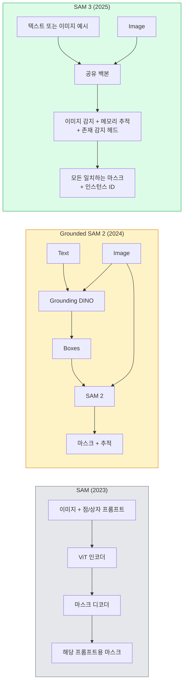

# SAM 3 및 오픈 어휘 분할

> 모델에 텍스트 프롬프트와 이미지를 입력하면 모든 일치하는 객체의 마스크를 얻습니다. SAM 3는 이를 단일 순방향 패스로 수행합니다.

**유형:** 사용 + 구축
**언어:** Python
**선수 요건:** 4단계 07강 (U-Net), 4단계 08강 (Mask R-CNN), 4단계 18강 (CLIP)
**시간:** 약 60분

## 학습 목표

- SAM (시각 프롬프트 전용), Grounded SAM / SAM 2 (디텍터 + SAM), SAM 3 (프롬프트 가능한 개념 분할을 통한 네이티브 텍스트 프롬프트)의 차이를 구분합니다.
- SAM 3 아키텍처를 설명합니다: 공유 백본 + 이미지 디텍터 + 메모리 기반 비디오 트래커 + 존재 헤드 + 디텍터-트래커 분리 설계
- Hugging Face `transformers` SAM 3 통합을 사용하여 텍스트 프롬프트 기반 감지, 분할 및 비디오 추적을 수행합니다.
- 레이턴시, 개념 복잡성 및 배포 대상에 따라 SAM 3, Grounded SAM 2, YOLO-World, SAM-MI 중 하나를 선택합니다.

## 문제점

2023년 SAM은 시각 프롬프트 전용 모델이었습니다. 점을 클릭하거나 상자를 그리면 마스크를 반환합니다. "이 사진 속 모든 오렌지를 주세요"라는 요청을 처리하려면 디텍터(Grounding DINO)가 상자를 생성한 후 SAM이 각각을 분할해야 했습니다. Grounded SAM은 이를 파이프라인으로 전환했지만, 두 개의 고정된 모델의 캐스케이드로 인해 불가피한 오류 누적 문제가 발생했습니다.

SAM 3 (Meta, 2025년 11월, ICLR 2026)는 캐스케이드를 통합했습니다. 짧은 명사구 또는 이미지 예제를 프롬프트로 받아 단일 순방향 패스로 모든 일치하는 마스크와 인스턴스 ID를 반환합니다. 이것이 **프롬프트 가능한 개념 분할 (PCS)**입니다. 2026년 3월 Object Multiplex 업데이트(SAM 3.1)와 결합하면 비디오에서 동일한 개념의 여러 인스턴스를 효율적으로 추적할 수 있습니다.

이 강의는 이러한 구조적 전환에 대해 다룹니다. 2D 분할, 감지 및 텍스트-이미지 그라운딩이 하나의 모델로 통합되었습니다. 생산 환경에서의 질문은 더 이상 "어떤 파이프라인을 연결할 것인가"가 아니라 "어떤 프롬프트 가능한 모델이 내 사용 사례를 엔드투엔드로 처리하는가"입니다.

## 개념

### 세 가지 세대



### 프롬프트 가능한 개념 분할

"개념 프롬프트"는 짧은 명사구 (`"yellow school bus"`, `"striped red umbrella"`, `"hand holding a mug"`) 또는 이미지 예시입니다. 모델은 이미지 내에서 개념과 일치하는 모든 인스턴스에 대한 분할 마스크와 일치하는 항목마다 고유한 인스턴스 ID를 반환합니다.

이 방식은 고전적인 시각 프롬프트 기반 SAM과 세 가지 측면에서 다릅니다:

1. 인스턴스별 프롬프트가 필요 없습니다. 하나의 텍스트 프롬프트가 모든 일치하는 항목을 반환합니다.
2. 오픈 어휘(vocabulary)를 지원합니다. 자연어로 설명할 수 있는 모든 개념이 가능합니다.
3. 프롬프트당 하나의 마스크가 아니라 여러 인스턴스를 한 번에 반환합니다.

### 핵심 아키텍처 구성 요소

- **공유 백본** — 단일 ViT가 이미지를 처리합니다. 감지 헤드와 메모리 기반 추적기가 모두 여기서 읽습니다.
- **존재 감지 헤드** — 이미지 내에 개념이 존재하는지 여부를 예측합니다. "여기에 있는가?"와 "어디에 있는가?"를 분리합니다. 존재하지 않는 개념에 대한 오탐(false positive)을 줄입니다.
- **분리된 감지-추적기** — 이미지 수준 감지와 비디오 수준 추적이 각각 독립적인 헤드를 사용하므로 서로 간섭하지 않습니다.
- **메모리 뱅크** — 비디오 추적을 위해 프레임 간 인스턴스별 특징을 저장합니다 (SAM 2가 사용했던 것과 동일한 메커니즘).

### 대규모 학습

SAM 3는 AI와 인간 검토를 반복적으로 사용하여 주석 및 수정하는 데이터 엔진이 생성한 **400만 개의 고유한 개념**으로 학습되었습니다. 새로운 **SA-CO 벤치마크**는 27만 개의 고유한 개념을 포함하며, 이전 벤치마크보다 50배 더 큽니다. SAM 3는 SA-CO에서 인간 성능의 75-80%에 도달하며, 이미지 및 비디오 PCS에서 기존 시스템을 두 배로 향상시킵니다.

### SAM 3.1 Object Multiplex

2026년 3월 업데이트: **Object Multiplex**는 동일한 개념의 여러 인스턴스를 한 번에 공동 추적하기 위한 공유 메모리 메커니즘을 도입했습니다. 이전에는 N개의 인스턴스를 추적하려면 N개의 별도 메모리 뱅크가 필요했습니다. Multiplex는 이를 하나의 공유 메모리로 통합하며 인스턴스별 쿼리를 지원합니다. 결과: 정확도를 희생하지 않으면서 다중 객체 추적이 현저히 빨라집니다.

### 2026년에도 Grounded SAM이 중요한 경우

- 특정 오픈 어휘 탐지기를 교체해야 할 때 (DINO-X, Florence-2).
- SAM 3 라이선스(HF에서 게이트 적용)가 장애물일 때.
- SAM 3가 노출하는 것보다 탐지기 임계값에 대한 더 많은 제어가 필요할 때.
- 탐지기 구성 요소에 대한 연구 / 제거 실험(ablation work)을 수행할 때.

모듈식 파이프라인은 여전히 자리를 차지합니다. 대부분의 생산 작업에서는 SAM 3가 더 단순한 답입니다.

### YOLO-World vs SAM 3

- **YOLO-World** — 오픈 어휘 탐지기 전용 (마스크 없음). 실시간. 높은 fps로 박스가 필요할 때 최적입니다.
- **SAM 3** — 전체 분할 + 추적. 느리지만 더 풍부한 출력.

생산 환경 분리: YOLO-World는 빠른 탐지 전용 파이프라인(로보틱스 내비게이션, 빠른 대시보드)에, SAM 3는 마스크나 추적이 필요한 모든 것에 사용합니다.

### SAM-MI 효율성

SAM-MI (2025-2026)는 SAM의 디코더 병목 현상을 해결합니다. 주요 아이디어:

- **희소 점 프롬팅** — 잘 선택된 몇 개의 점을 밀집 프롬프트 대신 사용하며, 디코더 호출을 96% 줄입니다.
- **얕은 마스크 집계** — 거친 마스크 예측을 더 선명한 하나의 마스크로 병합합니다.
- **분리된 마스크 주입** — 디코더는 재실행 대신 미리 계산된 마스크 특징을 받습니다.

결과: 오픈 어휘 벤치마크에서 Grounded-SAM 대비 약 1.6배 속도 향상.

### 세 모델의 출력 형식

모두 동일한 일반 구조(박스 + 레이블 + 점수 + 마스크 + ID)를 반환하며, 이는 유용합니다. 다운스트림 파이프라인은 어떤 모델이 실행되었는지 분기할 필요가 없습니다.

```figure
cv3-open-vocab
```

## 구현하기

### 1단계: 프롬프트 구성

사용자 문장을 SAM 3 개념 프롬프트 목록으로 변환하는 헬퍼를 구축하세요. 이는 "사용자가 입력한 내용"과 "모델이 소비하는 내용"이 만나는 경계입니다.

```python
def split_concepts(sentence):
    """
    Heuristic splitter for multi-concept prompts.
    Returns list of short noun phrases.
    """
    for sep in [",", ";", "and", "or", "&"]:
        if sep in sentence:
            parts = [p.strip() for p in sentence.replace("and ", ",").split(",")]
            return [p for p in parts if p]
    return [sentence.strip()]

print(split_concepts("cats, dogs and balloons"))
```

SAM 3는 한 번의 순방향 전파(forward pass)당 하나의 개념만 허용합니다. 다중 개념 쿼리의 경우 반복(loop)하거나 배치(batch)로 처리해 보세요.

### 2단계: 후처리 헬퍼

SAM 3의 원시(raw) 출력 데이터를 4단계 16강의 파이프라인 계약에 부합하는 깔끔한 감지(detection) 목록으로 변환해 보세요.

```python
from dataclasses import dataclass
from typing import List

@dataclass
class ConceptDetection:
    concept: str
    instance_id: int
    box: tuple          # (x1, y1, x2, y2)
    score: float
    mask_rle: str       # 런 길이 인코딩(run-length encoded)


def rle_encode(binary_mask):
    flat = binary_mask.flatten().astype("uint8")
    runs = []
    prev, count = flat[0], 0
    for v in flat:
        if v == prev:
            count += 1
        else:
            runs.append((int(prev), count))
            prev, count = v, 1
    runs.append((int(prev), count))
    return ";".join(f"{v}x{c}" for v, c in runs)
```

RLE는 고해상도 마스크가 많더라도 응답 페이로드를 작게 유지합니다. 이 형식은 SAM 2, SAM 3, Grounded SAM 2 전반에 걸쳐 동일하게 적용됩니다.

### 3단계: 통합 오픈 어휘(open-vocab) 분할(segmentation) 인터페이스

사용 중인 백엔드(SAM 3, Grounded SAM 2, YOLO-World + SAM 2)를 단일 메서드로 래핑(wrap)하세요. 백엔드가 변경되어도 다운스트림(downstream) 코드는 변하지 않습니다.

```python
from abc import ABC, abstractmethod
import numpy as np

class OpenVocabSeg(ABC):
    @abstractmethod
    def detect(self, image: np.ndarray, concept: str) -> List[ConceptDetection]:
        ...


class StubOpenVocabSeg(OpenVocabSeg):
    """
    Deterministic stub used for pipeline testing when real models are not loaded.
    """
    def detect(self, image, concept):
        h, w = image.shape[:2]
        return [
            ConceptDetection(
                concept=concept,
                instance_id=0,
                box=(w * 0.2, h * 0.3, w * 0.5, h * 0.8),
                score=0.89,
                mask_rle="0x100;1x50;0x200",
            ),
            ConceptDetection(
                concept=concept,
                instance_id=1,
                box=(w * 0.55, h * 0.25, w * 0.85, h * 0.75),
                score=0.74,
                mask_rle="0x80;1x40;0x220",
            ),
        ]
```

실제 `SAM3OpenVocabSeg` 하위 클래스(subclass)는 `transformers.Sam3Model`과 `Sam3Processor`를 래핑(wrap)합니다.

### 4단계: Hugging Face SAM 3 사용법 (참고)

실제 모델의 `transformers` 통합은 다음과 같습니다:

```python
from transformers import Sam3Processor, Sam3Model
import torch

processor = Sam3Processor.from_pretrained("facebook/sam3")
model = Sam3Model.from_pretrained("facebook/sam3").eval()

inputs = processor(images=pil_image, return_tensors="pt")
inputs = processor.set_text_prompt(inputs, "yellow school bus")

with torch.no_grad():
    outputs = model(**inputs)

masks = processor.post_process_masks(
    outputs.masks, inputs.original_sizes, inputs.reshaped_input_sizes
)
boxes = outputs.boxes
scores = outputs.scores
```

단일 호출로 하나의 프롬프트에 대한 모든 일치 항목을 반환합니다.

### 5단계: Grounded SAM 2가 무료로 제공한 것 측정하기

솔직한 벤치마크: 실제 파이프라인에서 Grounded SAM 2를 SAM 3으로 교체하면 어떤 일이 일어나나요?

- 지연(Latency): SAM 3는 별도의 검출기가 없으므로 순방향 전파(forward pass) 한 번을 절약하지만, 모델 자체는 더 무겁습니다. 보통 순효과(net-neutral)가 없거나 약간의 속도 향상이 있습니다.
- 정확도(Accuracy): SAM 3는 희귀하거나 복합적인 개념("striped red umbrella")에서 훨씬 더 우수합니다. 일반적인 단일 단어 개념에서는 유사한 성능을 보입니다.
- 유연성(Flexibility): Grounded SAM 2는 검출기를 교체(DINO-X, Florence-2, Grounding DINO 1.5)할 수 있지만, SAM 3는 단일 구조(monolithic)입니다.

결론: SAM 3는 2026년 오픈 어휘 분할(segmentation)의 기본 선택입니다. 검출기 유연성이나 다른 라이선스 조건이 필요할 때는 Grounded SAM 2가 여전히 올바른 선택입니다.

## 사용하기

프로덕션 배포 패턴:

- **실시간 주석** — SAM 3 + CVAT의 텍스트 프롬프트 라벨링 기능. 주석자가 라벨 이름을 선택하면 SAM 3가 모든 일치하는 인스턴스를 사전 라벨링합니다. 검토하고 수정하세요.
- **비디오 분석** — 다중 객체 추적을 위한 SAM 3.1 Object Multiplex. 프레임을 메모리 기반 추적기(tracker)에 입력하세요.
- **로보틱스** — 오픈 어휘 조작("pick up the red cup")을 위한 SAM 3. 계획(planning) 프리미티브(primitive)로 실행됩니다.
- **의료 영상** — 의료 개념에 대해 미세 조정된 SAM 3; HF에서 접근 권한 요청이 필요합니다.

Ultralytics는 Python 패키지에서 SAM 3를 래핑합니다:

```python
from ultralytics import SAM

model = SAM("sam3.pt")
results = model(image_path, prompts="yellow school bus")
```

YOLO 및 SAM 2와 동일한 인터페이스를 사용합니다.

## 출시하기

이 강의에서 생성되는 결과물:

- `outputs/prompt-open-vocab-stack-picker.md` — 지연 시간, 개념 복잡성, 라이선스에 따라 SAM 3 / Grounded SAM 2 / YOLO-World / SAM-MI를 선택하는 프롬프트.
- `outputs/skill-concept-prompt-designer.md` — 사용자 발화를 잘 형성된 SAM 3 개념 프롬프트로 변환하는 스킬 (분할, 모호성 해소, 폴백 포함).

## 연습 문제

1. **(쉬움)** 선택한 개념 프롬프트로 10개의 이미지에 SAM 3를 실행하세요. 동일한 이미지에서 SAM 2 + Grounding DINO 1.5와 비교하세요. 각 모델이 놓친 개념을 보고하세요.
2. **(중간)** SAM 3 위에 "클릭 포함 / 클릭 제외" UI를 구축하세요: 텍스트 프롬프트가 후보 인스턴스를 반환하고, 사용자가 클릭하여 긍정적으로 간주할 대상을 선택합니다. 최종 개념 집합을 JSON으로 출력하세요.
3. **(어려움)** 각 유형당 20개의 라벨이 지정된 이미지를 사용하여 전자 부품 5가지 유형과 같은 맞춤형 개념 집합에 대해 SAM 3를 미세 조정하세요. 동일한 테스트 세트에서 제로샷 SAM 3와 비교하고 마스크 IoU 개선도를 측정하세요.

## 핵심 용어

| 용어 | 사람들이 말하는 표현 | 실제 의미 |
|------|----------------|----------------------|
| 오픈 어휘 분할 | "텍스트로 분할하기" | 고정된 레이블 집합이 아닌 자연어로 설명된 객체에 대해 마스크를 생성하는 것 |
| PCS | "프롬프트 가능한 개념 분할" | SAM 3의 핵심 작업 — 명사구 또는 이미지 예제를 주어 모든 일치하는 인스턴스를 분할하는 것 |
| 개념 프롬프트 | "텍스트 입력" | 짧은 명사구 또는 이미지 예제; 완전한 문장이 아님 |
| 존재 헤더 | "거기에 있나요?" | 위치 파악 전에 개념이 이미지에 존재하는지 결정하는 SAM 3 모듈 |
| SA-CO | "SAM 3 벤치마크" | 270K 개념 오픈 어휘 분할 벤치마크; 이전 오픈 어휘 벤치마크보다 50배 더 큼 |
| Object Multiplex | "SAM 3.1 업데이트" | 공유 메모리 다중 객체 추적; 많은 인스턴스의 빠른 공동 추적 |
| Grounded SAM 2 | "모듈형 파이프라인" | 디텍터 + SAM 2 캐스케이드; 디텍터 교체 시 여전히 관련 있음 |
| SAM-MI | "효율적인 SAM 변형" | Grounded-SAM 대비 1.6배 속도 향상을 위한 마스크 주입 |

## 추가 읽기

- [SAM 3: Segment Anything with Concepts (arXiv 2511.16719)](https://arxiv.org/abs/2511.16719)
- [SAM 3.1 Object Multiplex (Meta AI, March 2026)](https://ai.meta.com/blog/segment-anything-model-3/)
- [SAM 3 model page on Hugging Face](https://huggingface.co/facebook/sam3)
- [Grounded SAM 2 tutorial (PyImageSearch)](https://pyimagesearch.com/2026/01/19/grounded-sam-2-from-open-set-detection-to-segmentation-and-tracking/)
- [Ultralytics SAM 3 docs](https://docs.ultralytics.com/models/sam-3/)
- [SAM3-I: Instruction-aware SAM (arXiv 2512.04585)](https://arxiv.org/abs/2512.04585)
