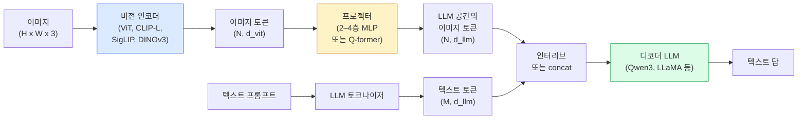

# Vision-Language Models — ViT-MLP-LLM 패턴 (Vision-Language Models — The ViT-MLP-LLM Pattern)

> 비전 인코더가 이미지를 토큰으로 바꿉니다. MLP 프로젝터가 그 토큰을 LLM의 임베딩 공간으로 매핑합니다. 언어 모델이 나머지를 합니다. 그 패턴 — ViT-MLP-LLM — 이 2026의 모든 프로덕션 VLM입니다.

**Type:** Learn + Use
**Languages:** Python
**Prerequisites:** Phase 4 Lesson 14 (ViT), Phase 4 Lesson 18 (CLIP), Phase 7 Lesson 02 (Self-Attention)
**Time:** ~75 minutes

## 학습 목표 (Learning Objectives)

- ViT-MLP-LLM 아키텍처를 말하고 세 구성요소 각각이 기여하는 바를 설명합니다
- 파라미터 수·컨텍스트 길이·벤치마크 성능으로 Qwen3-VL, InternVL3.5, LLaVA-Next, GLM-4.6V를 비교합니다
- DeepStack을 설명합니다: 왜 다중 수준 ViT 특징이 단일 마지막 층 특징보다 비전-언어 정렬을 더 타이트하게 하는지
- Cross-Modal Error Rate(CMER)로 프로덕션 VLM 환각을 측정하고 신호에 따라 행동합니다

## 문제 상황 (The Problem)

CLIP(Phase 4 Lesson 18)은 이미지와 텍스트의 공유 임베딩 공간을 주어, zero-shot 분류와 검색에 충분합니다. "이 이미지에 빨간 차가 몇 대?"에 답할 수 없는 이유는 CLIP이 텍스트를 생성하지 않고 — 유사도만 점수 매기기 때문입니다.

Vision-Language Models(VLM) — Qwen3-VL, InternVL3.5, LLaVA-Next, GLM-4.6V — 는 CLIP 계열 이미지 인코더를 전체 언어 모델에 붙입니다. 모델이 이미지와 질문을 보고 답을 생성합니다. 2026 오픈소스 VLM은 멀티모달 벤치마크(MMMU, MMBench, DocVQA, ChartQA, MathVista, OSWorld)에서 GPT-5와 Gemini-2.5-Pro에 필적하거나 이깁니다.

세 조각(ViT, 프로젝터, LLM)이 표준입니다. 모델 간 차이는 어떤 ViT, 어떤 프로젝터, 어떤 LLM, 학습 데이터, 정렬 레시피입니다. 패턴을 이해하면 어떤 구성요소든 교체는 기계적입니다.

## 핵심 개념 (The Concept)

### ViT-MLP-LLM 아키텍처 (The ViT-MLP-LLM architecture)



1. **비전 인코더** — 사전학습 ViT(CLIP-L/14, SigLIP, DINOv3, 또는 파인튜닝 변형). 패치 토큰을 만듭니다.
2. **프로젝터** — 비전 토큰을 LLM의 임베딩 차원으로 매핑하는 작은 모듈(2–4층 MLP, 또는 Q-former). 파인튜닝의 대부분이 여기서 일어납니다.
3. **LLM** — 디코더 전용 언어 모델(Qwen3, Llama, Mistral, GLM, InternLM). 비전 + 텍스트 토큰을 시퀀스로 읽고 텍스트를 생성합니다.

원칙적으로 세 조각 모두 학습 가능합니다. 실무에서는 비전 인코더와 LLM을 대부분 동결하고 프로젝터만 학습합니다 — 저렴한 비용으로 수십억 파라미터의 신호.

### DeepStack

바닐라 투영은 마지막 ViT 층만 씁니다. DeepStack(Qwen3-VL)은 여러 ViT 깊이에서 특징을 샘플링해 스택합니다. 깊은 층은 고수준 의미; 얕은 층은 세밀한 공간·텍스처 정보를 담습니다. 둘을 LLM에 넣으면 "이미지가 무엇을 담는가"(의미)와 "정확히 어디에"(공간 그라운딩) 사이의 간극을 좁힙니다.

### 세 학습 단계 (Three training stages)

현대 VLM은 단계로 학습합니다:

1. **Alignment** — ViT와 LLM 동결. 이미지-캡션 쌍으로 프로젝터만 학습. 프로젝터가 비전 공간을 언어 공간으로 매핑하도록 가르칩니다.
2. **Pre-training** — 전부 해동. 대규모 인터리브 이미지-텍스트 데이터(5억+ 쌍)로 학습. 모델의 시각 지식을 쌓습니다.
3. **Instruction tuning** — 큐레이션된 (이미지, 질문, 답) 삼중항으로 파인튜닝. 대화 행동과 과제 형식을 가르칩니다. "비전 인식 LM"을 쓸 만한 어시스턴트로 바꾸는 단계입니다.

대부분의 LoRA 파인튜닝은 작은 라벨 데이터셋으로 stage 3을 겨냥합니다.

### 모델 패밀리 비교 (early 2026)

| Model | Params | Vision encoder | LLM | Context | Strengths |
|-------|--------|----------------|-----|---------|-----------|
| Qwen3-VL-235B-A22B (MoE) | 235B (22B active) | custom ViT + DeepStack | Qwen3 | 256K | General SOTA, GUI agent |
| Qwen3-VL-30B-A3B (MoE) | 30B (3B active) | custom ViT + DeepStack | Qwen3 | 256K | Smaller MoE alternative |
| Qwen3-VL-8B (dense) | 8B | custom ViT | Qwen3 | 128K | Production dense default |
| InternVL3.5-38B | 38B | InternViT-6B | Qwen3 + GPT-OSS | 128K | Strong MMBench / MMVet |
| InternVL3.5-241B-A28B | 241B (28B active) | InternViT-6B | Qwen3 | 128K | Competitive with GPT-4o |
| LLaVA-Next 72B | 72B | SigLIP | Llama-3 | 32K | Open, easy to fine-tune |
| GLM-4.6V | ~70B | custom | GLM | 64K | Open-source, strong OCR |
| MiniCPM-V-2.6 | 8B | SigLIP | MiniCPM | 32K | Edge-friendly |

### Visual agents

Qwen3-VL-235B는 OSWorld — GUI(데스크톱, 모바일, 웹)를 조작하는 **visual agents** 벤치마크 — 에서 세계 최고 성능에 도달합니다. 모델이 스크린샷을 보고, UI를 이해하며, 액션(클릭, 타이핑, 스크롤)을 내보냅니다. 도구와 결합하면 흔한 데스크톱 과제의 루프를 닫습니다. 대부분의 2026 "AI PC" 데모가 내부에서 돌리는 것입니다.

### Agentic 능력 + RoPE 변형 (Agentic capabilities + RoPE variants)

VLM은 비디오에서 프레임이 **언제**인지 알아야 합니다. Qwen3-VL은 T-RoPE(시간 rotary position embeddings)에서 **텍스트 기반 시간 정렬** — 비디오 프레임과 인터리브된 명시적 타임스탬프 텍스트 토큰 — 로 진화했습니다. 모델이 "`<timestamp 00:32>` frame, prompt"를 보고 시간 관계를 추론할 수 있습니다.

### 정렬 문제 (The alignment problem)

크롤 데이터셋의 이미지-텍스트 쌍 중 12%가 이미지에 완전히 그라운딩되지 않은 설명을 담습니다. 이로 학습된 VLM은 조용히 환각을 배웁니다 — 객체를 날조하고, 숫자를 잘못 읽고, 관계를 발명합니다. 프로덕션에서 이것이 지배적 실패 모드입니다.

Skywork.ai는 이를 추적하려고 **Cross-Modal Error Rate (CMER)** 를 도입했습니다:

```
CMER = fraction of outputs where the text confidence is high but the image-text similarity (via a CLIP-family checker) is low
```

높은 CMER는 모델이 이미지에 그라운딩되지 않은 말을 자신 있게 한다는 뜻입니다. CMER를 모니터링하고 프로덕션 KPI로 취급하면 그들의 배포에서 환각률이 ~35% 줄었습니다. 트릭은 "모델을 고치는" 것이 아니라 "높은 CMER 출력을 사람 검토로 라우팅하는" 것입니다.

### LoRA / QLoRA 파인튜닝 (Fine-tuning with LoRA / QLoRA)

70B VLM 전체 파인튜닝은 대부분 팀의 손이 닿지 않습니다. 어텐션 + 프로젝터 층의 LoRA(rank 16–64), 또는 4비트 기본 가중치의 QLoRA가 단일 A100 / H100에 맞습니다. 비용: 5,000–50,000 예제, 컴퓨트 $100–$5,000, 학습 2–10시간.

### 공간 추론은 여전히 약함 (Spatial reasoning is still weak)

현재 VLM은 공간 추론 벤치마크(위-아래, 좌-우, 세기, 거리)에서 50–60%입니다. "어느 객체가 어느 위에"에 의존하는 유스케이스면 강하게 검증하세요 — 일반 VLM 성능이 사람 아래입니다. 순수 공간 과제에서 VLM보다 나은 대안: 특화 키포인트/포즈 추정기, 깊이 모델, 또는 박스 기하 후처리가 있는 검출 모델.

```figure
v4-vlm-projector
```

## 직접 만들기 (Build It)

### Step 1: 프로젝터 (The projector)

가장 자주 학습할 부분. GELU가 있는 2–4층 MLP.

```python
import torch
import torch.nn as nn


class Projector(nn.Module):
    def __init__(self, vit_dim=768, llm_dim=4096, hidden=4096):
        super().__init__()
        self.net = nn.Sequential(
            nn.Linear(vit_dim, hidden),
            nn.GELU(),
            nn.Linear(hidden, llm_dim),
        )

    def forward(self, x):
        return self.net(x)
```

입력은 `(N_patches, d_vit)` 토큰 텐서. 출력은 `(N_patches, d_llm)`. LLM은 모든 출력 행을 그냥 또 하나의 토큰으로 취급합니다.

### Step 2: ViT-MLP-LLM end-to-end 조립 (Assemble ViT-MLP-LLM end-to-end)

최소 VLM의 전방 패스 골격. 실제 코드는 `transformers`를 씁니다; 이것은 개념 레이아웃입니다.

```python
class MinimalVLM(nn.Module):
    def __init__(self, vit, projector, llm, image_token_id):
        super().__init__()
        self.vit = vit
        self.projector = projector
        self.llm = llm
        self.image_token_id = image_token_id  # placeholder token in text prompt

    def forward(self, image, input_ids, attention_mask):
        # 1. vision features
        vision_tokens = self.vit(image)                     # (B, N_patches, d_vit)
        vision_embeds = self.projector(vision_tokens)       # (B, N_patches, d_llm)

        # 2. text embeddings
        text_embeds = self.llm.get_input_embeddings()(input_ids)  # (B, M, d_llm)

        # 3. replace image placeholder tokens with vision embeds
        merged = self._merge(text_embeds, vision_embeds, input_ids)

        # 4. run LLM
        return self.llm(inputs_embeds=merged, attention_mask=attention_mask)

    def _merge(self, text_embeds, vision_embeds, input_ids):
        out = text_embeds.clone()
        expected = vision_embeds.size(1)
        for b in range(input_ids.size(0)):
            positions = (input_ids[b] == self.image_token_id).nonzero(as_tuple=True)[0]
            if len(positions) != expected:
                raise ValueError(
                    f"batch item {b} has {len(positions)} image tokens but vision_embeds has {expected} patches."
                    " Every sample in the batch must be pre-padded to the same number of image placeholder tokens.")
            out[b, positions] = vision_embeds[b]
        return out
```

텍스트의 `<image>` placeholder 토큰이 실제 이미지 임베딩으로 교체됩니다 — LLaVA, Qwen-VL, InternVL이 쓰는 같은 패턴.

### Step 3: CMER 계산 (CMER computation)

가벼운 런타임 검사.

```python
import torch.nn.functional as F


def cross_modal_error_rate(image_emb, text_emb, text_confidence, sim_threshold=0.25, conf_threshold=0.8):
    """
    image_emb, text_emb: embeddings of image and generated text (normalised internally)
    text_confidence:     mean per-token probability in [0, 1]
    Returns:             fraction of high-confidence outputs with low image-text alignment
    """
    image_emb = F.normalize(image_emb, dim=-1)
    text_emb = F.normalize(text_emb, dim=-1)
    sim = (image_emb * text_emb).sum(dim=-1)        # cosine similarity
    high_conf_low_sim = (text_confidence > conf_threshold) & (sim < sim_threshold)
    return high_conf_low_sim.float().mean().item()
```

CMER를 프로덕션 KPI로 취급하세요. 엔드포인트별, 프롬프트 유형별, 고객별로 모니터링하세요. 상승하는 CMER는 모델이 어떤 입력 분포에서 환각하기 시작함을 나타냅니다.

### Step 4: 토이 VLM 분류기 (실행 가능) (Toy VLM classifier)

프로젝터가 학습됨을 보여 줍니다. 가짜 "ViT 특징"이 들어가고; 작은 LLM형 토큰이 클래스를 예측합니다.

```python
class ToyVLM(nn.Module):
    def __init__(self, vit_dim=32, llm_dim=64, num_classes=5):
        super().__init__()
        self.projector = Projector(vit_dim, llm_dim, hidden=64)
        self.head = nn.Linear(llm_dim, num_classes)

    def forward(self, vision_tokens):
        projected = self.projector(vision_tokens)
        pooled = projected.mean(dim=1)
        return self.head(pooled)
```

합성 (특징, 클래스) 쌍에 200 스텝 미만으로 맞출 수 있습니다 — 프로젝터 패턴이 동작함을 보이기에 충분합니다.

## 활용하기 (Use It)

2026 프로덕션 팀이 VLM을 쓰는 세 가지 방식:

- **호스티드 API** — OpenAI Vision, Anthropic Claude Vision, Google Gemini Vision. 인프라 제로, 벤더 리스크.
- **오픈소스 셀프호스트** — `transformers`와 `vllm`으로 Qwen3-VL 또는 InternVL3.5. 완전한 제어, 더 높은 선불 노력.
- **도메인 파인튜닝** — Qwen2.5-VL-7B 또는 LLaVA-1.6-7B를 로드하고, 5k–50k 커스텀 예제에 LoRA, `vllm` 또는 `TGI`로 서빙.

```python
from transformers import AutoProcessor, AutoModelForVision2Seq
import torch
from PIL import Image

model_id = "Qwen/Qwen3-VL-8B-Instruct"
processor = AutoProcessor.from_pretrained(model_id)
model = AutoModelForVision2Seq.from_pretrained(model_id, torch_dtype=torch.bfloat16, device_map="auto")

messages = [{
    "role": "user",
    "content": [
        {"type": "image", "image": Image.open("plot.png")},
        {"type": "text", "text": "What does this chart show?"},
    ],
}]
inputs = processor.apply_chat_template(messages, add_generation_prompt=True, tokenize=True, return_dict=True, return_tensors="pt").to("cuda")
generated = model.generate(**inputs, max_new_tokens=256)
answer = processor.decode(generated[0][inputs["input_ids"].shape[1]:], skip_special_tokens=True)
```

`apply_chat_template`이 `<image>` placeholder 토큰화를 숨깁니다; 모델이 내부에서 병합을 처리합니다.

## 결과물 배포 (Ship It)

이 레슨이 만드는 것:

- `outputs/prompt-vlm-selector.md` — 정확도·지연·컨텍스트 길이·예산에 따라 Qwen3-VL / InternVL3.5 / LLaVA-Next / API를 고릅니다.
- `outputs/skill-cmer-monitor.md` — 프로덕션 VLM 엔드포인트에 cross-modal error rate, 엔드포인트별 대시보드, 알림 임계값을 계측하는 코드를 내보냅니다.

## 연습 문제 (Exercises)

1. **(Easy)** 다섯 이미지에서 임의의 오픈 VLM에 세 프롬프트("what is this?", "count the objects", "describe the scene")를 돌립니다. 각 답을 손으로 correct / partially correct / hallucinated로 점수 매깁니다. 1차 CMER형 비율을 계산합니다.
2. **(Medium)** 캡션이 있는 타깃 도메인 이미지 500장에 LoRA(rank 16)로 Qwen2.5-VL-3B 또는 LLaVA-1.6-7B를 파인튜닝합니다. zero-shot vs 파인튜닝 MMBench형 정확도를 비교합니다.
3. **(Hard)** VLM의 이미지 인코더를 기본 SigLIP/CLIP 대신 DINOv3로 교체합니다. 프로젝터만 재학습(동결 LLM + 동결 DINOv3). 조밀 예측 과제(세기, 공간 추론)가 개선되는지 측정합니다.

## 핵심 용어 (Key Terms)

| 용어 | 사람들이 말하는 것 | 실제 의미 |
|------|----------------|----------------------|
| ViT-MLP-LLM | "VLM 패턴" | 비전 인코더 + 프로젝터 + 언어 모델; 모든 2026 VLM |
| Projector | "다리" | 비전 토큰을 LLM 임베딩 공간으로 매핑하는 2–4층 MLP(또는 Q-former) |
| DeepStack | "Qwen3-VL 특징 트릭" | 마지막 층만이 아니라 다중 수준 ViT 특징을 스택 |
| Image token | "<image> placeholder" | 투영된 비전 임베딩으로 교체되는 텍스트 스트림의 특수 토큰 |
| CMER | "환각 KPI" | Cross-Modal Error Rate; 텍스트 신뢰도는 높지만 이미지-텍스트 유사도가 낮을 때 높음 |
| Visual agent | "클릭하는 VLM" | 도구 호출로 GUI(OSWorld, 모바일, 웹)를 조작하는 VLM |
| Q-former | "고정 개수 토큰 다리" | 고정 개수 시각 쿼리 토큰을 만드는 BLIP-2형 프로젝터 |
| Alignment / pre-training / instruction tuning | "세 단계" | 표준 VLM 학습 파이프라인 |

## 더 읽을거리 (Further Reading)

- [Qwen3-VL Technical Report (arXiv 2511.21631)](https://arxiv.org/abs/2511.21631)
- [InternVL3.5 Advancing Open-Source Multimodal Models (arXiv 2508.18265)](https://arxiv.org/html/2508.18265v1)
- [LLaVA-Next series](https://llava-vl.github.io/blog/2024-05-10-llava-next-stronger-llms/)
- [BentoML: Best Open-Source VLMs 2026](https://www.bentoml.com/blog/multimodal-ai-a-guide-to-open-source-vision-language-models)
- [MMMU: Multi-discipline Multimodal Understanding benchmark](https://mmmu-benchmark.github.io/)
- [VLMs in manufacturing (Robotics Tomorrow, March 2026)](https://www.roboticstomorrow.com/story/2026/03/when-machines-learn-to-see-like-experts-the-rise-of-vision-language-models-in-manufacturing/26335/)
