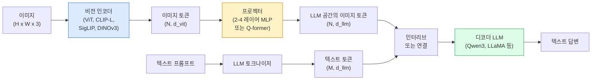

# 비전-언어 모델(Vision-Language Model) — ViT-MLP-LLM 패턴

> 비전 인코더는 이미지를 토큰으로 변환합니다. MLP 프로젝터는 해당 토큰을 LLM의 임베딩 공간으로 매핑합니다. 언어 모델이 나머지 작업을 수행합니다. 이 패턴(ViT-MLP-LLM)은 2026년 모든 프로덕션 VLM의 표준입니다.

**유형:** 학습 + 사용
**언어:** Python
**선수 요건:** 4단계 14강(ViT), 4단계 18강(CLIP), 7단계 02강(셀프 어텐션)
**시간:** 약 75분

## 학습 목표

- ViT-MLP-LLM 아키텍처를 서술하고 세 구성 요소 각각의 기여도를 설명해 보세요
- Qwen3-VL, InternVL3.5, LLaVA-Next, GLM-4.6V를 매개변수 수, 컨텍스트 길이, 벤치마크 성능 측면에서 비교해 보세요
- DeepStack을 설명해 보세요: 다중 레벨 ViT 특징이 단일 최종 레이어 특징보다 비전-언어 정렬을 더 잘 강화하는 이유를 이해해 보세요
- 프로덕션 환경에서 교차 모달 오류율(CMER)로 VLM 환각(Hallucination)을 측정하고 신호에 따라 조치해 보세요

## 문제점

CLIP(4단계 18강)은 이미지와 텍스트를 위한 공유 임베딩 공간을 제공하며, 이는 제로샷 분류와 검색에 충분합니다. CLIP는 텍스트를 생성하지 않고 유사성 점수만 산출하므로 "이 이미지에는 빨간색 자동차가 몇 대 있나요?"라는 질문에 답할 수 없습니다.

비전-언어 모델(VLM) — Qwen3-VL, InternVL3.5, LLaVA-Next, GLM-4.6V —은 CLIP 계열 이미지 인코더를 완전한 언어 모델에 결합합니다. 모델은 이미지와 질문을 입력으로 받아 답변을 생성합니다. 2026년 오픈소스 VLM은 멀티모달 벤치마크(MMMU, MMBench, DocVQA, ChartQA, MathVista, OSWorld)에서 GPT-5 및 Gemini-2.5-Pro에 필적하거나 이를 능가합니다.

세 가지 구성 요소(ViT, 프로젝터, LLM)는 표준입니다. 모델 간 차이는 어떤 ViT를 사용하느냐, 어떤 프로젝터를 사용하느냐, 어떤 LLM을 사용하느냐, 학습 데이터, 정렬 레시피에 있습니다. 패턴을 이해하면 구성 요소를 교체하는 것은 기계적인 작업이 됩니다.

## 개념

### ViT-MLP-LLM 아키텍처



1. **비전 인코더** — 사전 학습된 ViT (CLIP-L/14, SigLIP, DINOv3 또는 미세 조정된 변형). 패치 임베딩(Patch Embedding)을 생성합니다.
2. **프로젝터** — 비전 토큰을 LLM의 임베딩 차원으로 매핑하는 작은 모듈 (2-4층 MLP 또는 Q-former). 미세 조정의 대부분이 여기서 이루어집니다.
3. **LLM** — 디코더 전용 언어 모델 (Qwen3, Llama, Mistral, GLM, InternLM). 비전 + 텍스트 토큰을 순서대로 읽고 텍스트를 생성합니다.

세 부분 모두 원칙적으로 학습 가능합니다. 실제로는 비전 인코더와 LLM은 대부분 동결된 상태로 유지되며 프로젝터가 학습됩니다 — 저비용으로 수십억 파라미터의 신호를 얻습니다.

### DeepStack

기본 투사는 마지막 ViT 레이어만 사용합니다. DeepStack (Qwen3-VL)은 여러 ViT 깊이에서 특징을 샘플링하여 스택합니다. 깊은 레이어는 고수준 시맨틱을 담고, 얕은 레이어는 세밀한 공간 및 텍스처 정보를 담습니다. 둘 다 LLM에 입력하면 "이미지에 무엇이 포함되어 있는가" (시맨틱)와 "정확히 어디에 있는가" (공간적 접지) 사이의 간극을 좁힙니다.

### 세 단계의 학습

현대 VLM은 단계별로 학습합니다:

1. **정렬(Alignment)** — ViT와 LLM을 동결합니다. 이미지-캡션 쌍에 대해서만 프로젝터를 학습합니다. 프로젝터가 비전 공간을 언어 공간으로 매핑하도록 가르칩니다.
2. **사전 학습** — 모든 것을 동결 해제합니다. 대규모 인터리브 이미지-텍스트 데이터 (5억+ 쌍)로 학습합니다. 모델의 비전 지식을 구축합니다.
3. **지시문 미세 조정** — 큐레이션된 (이미지, 질문, 답변) 삼중항으로 미세 조정합니다. 대화 행동 및 작업 형식을 가르칩니다. 이것이 "비전 인식 LM"을 사용 가능한 어시스턴트로 변환합니다.

대부분의 LoRA 미세 조정은 작은 레이블된 데이터셋으로 3단계를 목표로 합니다.

### 모델 계열 비교 (2026년 초)

| 모델 | 파라미터 | 비전 인코더 | LLM | 컨텍스트 | 강점 |
|-------|--------|----------------|-----|---------|-----------|
| Qwen3-VL-235B-A22B (MoE) | 235B (활성 22B) | 커스텀 ViT + DeepStack | Qwen3 | 256K | 일반 SOTA, GUI 에이전트 |
| Qwen3-VL-30B-A3B (MoE) | 30B (활성 3B) | 커스텀 ViT + DeepStack | Qwen3 | 256K | 더 작은 MoE 대안 |
| Qwen3-VL-8B (밀집) | 8B | 커스텀 ViT | Qwen3 | 128K | 프로덕션 밀집 기본값 |
| InternVL3.5-38B | 38B | InternViT-6B | Qwen3 + GPT-OSS | 128K | MMBench / MMVet에서 강함 |
| InternVL3.5-241B-A28B | 241B (활성 28B) | InternViT-6B | Qwen3 | 128K | GPT-4o와 경쟁력 있음 |
| LLaVA-Next 72B | 72B | SigLIP | Llama-3 | 32K | 오픈, 미세 조정 쉬움 |
| GLM-4.6V | ~70B | 커스텀 | GLM | 64K | 오픈소스, OCR 강함 |
| MiniCPM-V-2.6 | 8B | SigLIP | MiniCPM | 32K | 엣지 친화적 |

### 비주얼 에이전트

Qwen3-VL-235B는 GUI(데스크톱, 모바일, 웹)를 조작하는 **비주얼 에이전트**를 위한 벤치마크인 OSWorld에서 전 세계 최고 성능을 달성했습니다. 모델은 스크린샷을 보고 UI를 이해하며, 액션(클릭, 입력, 스크롤)을 출력합니다. 도구와 결합하면 일반적인 데스크톱 작업의 루프를 닫습니다. 대부분의 2026년 "AI PC" 데모가 내부적으로 실행하는 방식입니다.

### 에이전트 기능 + RoPE 변형

VLM은 비디오에서 프레임이 **언제** 위치하는지 알아야 합니다. Qwen3-VL은 T-RoPE(시간적 회전 위치 임베딩)에서 **텍스트 기반 시간 정렬**로 진화했습니다. 이는 비디오 프레임과 교차하는 명시적인 타임스탬프 텍스트 토큰입니다. 모델은 "`<timestamp 00:32>` frame, prompt"를 보고 시간적 관계를 추론할 수 있습니다.

### 정렬 문제

크롤링된 데이터셋의 이미지-텍스트 쌍 중 12%는 이미지에 완전히 그라운딩되지 않은 설명을 포함합니다. 이 데이터셋으로 훈련된 VLM은 조용히 환각을 학습합니다. 즉, 객체를 조작하고, 숫자를 잘못 읽으며, 관계를 발명합니다. 프로덕션에서는 이것이 지배적인 실패 모드입니다.

Skywork.ai는 이를 추적하기 위해 **교차 모달 오류율 (CMER)(Cross-Modal Error Rate (CMER))**을 도입했습니다:

```
CMER = fraction of outputs where the text confidence is high but the image-text similarity (via a CLIP-family checker) is low
```

높은 CMER는 모델이 이미지에 그라운딩되지 않은 내용을 확신하며 말하고 있음을 의미합니다. CMER를 모니터링하고 프로덕션 KPI로 취급하면 배포 환경에서 환각률을 약 35% 줄였습니다. 핵심은 "모델을 고치는 것"이 아니라 "높은 CMER 출력은 인간 검토로 라우팅하는 것"입니다.

### LoRA / QLoRA를 이용한 미세 조정

70B VLM의 전체 미세 조정은 대부분의 팀이 감당하기 어렵습니다. 어텐션 + 프로젝터 레이어에 LoRA (랭크 16-64)를 적용하거나, QLoRA로 4-bit 기본 가중치를 사용하면 단일 A100 / H100에서 실행할 수 있습니다. 비용: 예제 5,000-50,000개, $100-$5,000의 연산량, 학습 시간 2-10시간.

### 공간 추론은 여전히 약합니다

현재 VLM은 공간 추론 벤치마크(위-아래, 좌-우, 개수 세기, 거리)에서 50-60%의 점수를 기록합니다. 사용 사례가 "어떤 객체가 어떤 객체 위에 있는지"에 의존한다면, 철저히 검증해 보세요. 일반적인 VLM의 성능은 인간보다 낮습니다. 순수한 공간 작업에 VLM보다 더 나은 대안: 전문화된 키포인트 / 자세 추정기, 깊이 모델, 또는 박스 기하학을 후처리하는 감지 모델.

```figure
v4-vlm-projector
```

## 구현하기

### 1단계: 프로젝터

가장 자주 학습하는 부분입니다. GELU를 사용하는 2-4 레이어 MLP입니다.

```python
import torch
import torch.nn as nn


class Projector(nn.Module):
    def __init__(self, vit_dim=768, llm_dim=4096, hidden=4096):
        super().__init__()
        self.net = nn.Sequential(
            nn.Linear(vit_dim, hidden),
            nn.GELU(),
            nn.Linear(hidden, llm_dim),
        )

    def forward(self, x):
        return self.net(x)
```

입력은 `(N_patches, d_vit)` 토큰 텐서입니다. 출력은 `(N_patches, d_llm)`입니다. LLM은 모든 출력 행을 단순한 토큰으로 취급합니다.

### 2단계: ViT-MLP-LLM을 엔드투엔드로 조립하기

최소 VLM의 순방향 전파 골격입니다. 실제 코드는 `transformers`를 사용하며, 이는 개념적 레이아웃입니다.

```python
class MinimalVLM(nn.Module):
    def __init__(self, vit, projector, llm, image_token_id):
        super().__init__()
        self.vit = vit
        self.projector = projector
        self.llm = llm
        self.image_token_id = image_token_id  # 텍스트 프롬프트의 자리 표시자 토큰

    def forward(self, image, input_ids, attention_mask):
        # 1. 비전 특징
        vision_tokens = self.vit(image)                     # (B, N_patches, d_vit)
        vision_embeds = self.projector(vision_tokens)       # (B, N_patches, d_llm)

        # 2. 텍스트 임베딩
        text_embeds = self.llm.get_input_embeddings()(input_ids)  # (B, M, d_llm)

        # 3. 이미지 자리 표시자 토큰을 비전 임베딩으로 교체
        merged = self._merge(text_embeds, vision_embeds, input_ids)

        # 4. LLM 실행
        return self.llm(inputs_embeds=merged, attention_mask=attention_mask)

    def _merge(self, text_embeds, vision_embeds, input_ids):
        out = text_embeds.clone()
        expected = vision_embeds.size(1)
        for b in range(input_ids.size(0)):
            positions = (input_ids[b] == self.image_token_id).nonzero(as_tuple=True)[0]
            if len(positions) != expected:
                raise ValueError(
                    f"batch item {b} has {len(positions)} image tokens but vision_embeds has {expected} patches."
                    " Every sample in the batch must be pre-padded to the same number of image placeholder tokens.")
            out[b, positions] = vision_embeds[b]
        return out
```

텍스트의 `<image>` 자리 표시자 토큰은 실제 이미지 임베딩으로 교체됩니다. LLaVA, Qwen-VL, InternVL이 사용하는 패턴과 동일합니다.

### 3단계: CMER 계산

가벼운 런타임 체크입니다.

```python
import torch.nn.functional as F


def cross_modal_error_rate(image_emb, text_emb, text_confidence, sim_threshold=0.25, conf_threshold=0.8):
    """
    image_emb, text_emb: embeddings of image and generated text (normalised internally)
    text_confidence:     mean per-token probability in [0, 1]
    Returns:             fraction of high-confidence outputs with low image-text alignment
    """
    image_emb = F.normalize(image_emb, dim=-1)
    text_emb = F.normalize(text_emb, dim=-1)
    sim = (image_emb * text_emb).sum(dim=-1)        # 코사인 유사도(Cosine Similarity)
    high_conf_low_sim = (text_confidence > conf_threshold) & (sim < sim_threshold)
    return high_conf_low_sim.float().mean().item()
```

CMER를 생산 KPI로 취급하세요. 엔드포인트별, 프롬프트 유형별, 고객별로 모니터링하세요. CMER가 상승하면 모델이 특정 입력 분포에서 환각(Hallucination)을 시작하고 있음을 나타냅니다.

### 4단계: 장난감 VLM 분류기 (실행 가능)

프로젝터가 학습되는 것을 시연하세요. 가짜 "ViT 특징"이 입력되고, 작은 LLM 스타일 토큰이 클래스를 예측합니다.

```python
class ToyVLM(nn.Module):
    def __init__(self, vit_dim=32, llm_dim=64, num_classes=5):
        super().__init__()
        self.projector = Projector(vit_dim, llm_dim, hidden=64)
        self.head = nn.Linear(llm_dim, num_classes)

    def forward(self, vision_tokens):
        projected = self.projector(vision_tokens)
        pooled = projected.mean(dim=1)
        return self.head(pooled)
```

이것은 합성된 (특징, 클래스) 쌍에 대해 200 스텝 미만으로 적합할 수 있으며, 프로젝터 패턴이 작동함을 보여주기 충분합니다.

## 사용하기

2026년 생산 팀이 VLM을 사용하는 세 가지 방법:

- **호스팅 API** — OpenAI Vision, Anthropic Claude Vision, Google Gemini Vision. 인프라 비용이 없고, 벤더 리스크가 있습니다.
- **오픈소스 셀프 호스트** — `transformers` 및 `vllm`를 통해 Qwen3-VL 또는 InternVL3.5를 사용합니다. 완전한 제어권을 가지며, 초기 노력이 더 많이 필요합니다.
- **도메인 미세 조정** — Qwen2.5-VL-7B 또는 LLaVA-1.6-7B를 로드하고, 5k-50k개의 맞춤형 예제에 LoRA를 적용하며, `vllm` 또는 `TGI`로 서빙합니다.

```python
from transformers import AutoProcessor, AutoModelForVision2Seq
import torch
from PIL import Image

model_id = "Qwen/Qwen3-VL-8B-Instruct"
processor = AutoProcessor.from_pretrained(model_id)
model = AutoModelForVision2Seq.from_pretrained(model_id, torch_dtype=torch.bfloat16, device_map="auto")

messages = [{
    "role": "user",
    "content": [
        {"type": "image", "image": Image.open("plot.png")},
        {"type": "text", "text": "What does this chart show?"},
    ],
}]
inputs = processor.apply_chat_template(messages, add_generation_prompt=True, tokenize=True, return_dict=True, return_tensors="pt").to("cuda")
generated = model.generate(**inputs, max_new_tokens=256)
answer = processor.decode(generated[0][inputs["input_ids"].shape[1]:], skip_special_tokens=True)
```

`apply_chat_template`는 `<image>` 자리표시자 토큰화를 숨깁니다. 모델은 병합을 내부적으로 처리합니다.

## 출시하기

이 강의에서 생성되는 결과물:

- `outputs/prompt-vlm-selector.md` — 정확도, 지연 시간, 컨텍스트 길이 및 예산을 고려하여 Qwen3-VL / InternVL3.5 / LLaVA-Next / API를 선택합니다.
- `outputs/skill-cmer-monitor.md` — 교차 모달 오류율, 엔드포인트별 대시보드 및 알림 임계값으로 생산 VLM 엔드포인트를 계측하는 코드를 생성합니다.

## 연습 문제

1. **(쉬움)** 다섯 장의 이미지로 오픈 VLM을 통해 세 가지 프롬프트("이것은 무엇인가요?", "물체를 세어 보세요", "장면을 설명해 보세요")를 실행합니다. 각 답변을 손으로 정답 / 부분 정답 / 환각으로 채점합니다. 첫 번째 CMER 유사 비율을 계산해 보세요.
2. **(중간)** 캡션이 있는 타겟 도메인의 이미지 500장에 대해 LoRA(랭크 16)를 사용하여 Qwen2.5-VL-3B 또는 LLaVA-1.6-7B를 미세 조정합니다. 제로샷과 미세 조정된 MMBench 스타일 정확도를 비교해 보세요.
3. **(어려움)** VLM의 이미지 인코더를 기본 SigLIP/CLIP 대신 DINOv3로 교체합니다. 투사기(projector)만 재학습합니다(동결된 LLM + 동결된 DINOv3). 밀집 예측 작업(세는 작업, 공간 추론)이 개선되는지 측정해 보세요.

## 핵심 용어

| 용어 | 사람들이 말하는 표현 | 실제 의미 |
|------|----------------|----------------------|
| ViT-MLP-LLM | "VLM 패턴" | 비전 인코더 + 투사기 + 언어 모델; 모든 2026 VLM |
| 투사기(Projector) | "다리" | 비전 토큰을 LLM 임베딩 공간으로 매핑하는 2-4층 MLP(또는 Q-former) |
| DeepStack | "Qwen3-VL 기능 트릭" | 마지막 층만 사용하는 것이 아니라 다층 ViT 특성을 쌓은 것 |
| 이미지 토큰(Image token) | "<image> 자리표시자" | 투사된 비전 임베딩으로 대체되는 텍스트 스트림의 특수 토큰 |
| CMER | "환각 KPI" | 텍스트 신뢰도가 높지만 이미지-텍스트 유사도가 낮을 때 높은 교차 모달 오류율 |
| 시각 에이전트 | "클릭하는 VLM" | 도구 호출을 통해 GUI(OSWorld, 모바일, 웹)를 조작하는 VLM |
| Q-former | "고정 개수 토큰 브리지" | 고정된 수의 시각 쿼리 토큰을 생성하는 BLIP-2 스타일 프로젝터 |
| 정렬 / 사전 학습 / 지시문 미세 조정 | "세 단계" | 표준 VLM 학습 파이프라인 |

## 추가 읽기

- [Qwen3-VL Technical Report (arXiv 2511.21631)](https://arxiv.org/abs/2511.21631)
- [InternVL3.5 Advancing Open-Source Multimodal Models (arXiv 2508.18265)](https://arxiv.org/html/2508.18265v1)
- [LLaVA-Next series](https://llava-vl.github.io/blog/2024-05-10-llava-next-stronger-llms/)
- [BentoML: Best Open-Source VLMs 2026](https://www.bentoml.com/blog/multimodal-ai-a-guide-to-open-source-vision-language-models)
- [MMMU: Multi-discipline Multimodal Understanding benchmark](https://mmmu-benchmark.github.io/)
- [VLMs in manufacturing (Robotics Tomorrow, March 2026)](https://www.roboticstomorrow.com/story/2026/03/when-machines-learn-to-see-like-experts-the-rise-of-vision-language-models-in-manufacturing/26335/)
