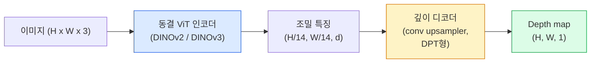

# Monocular Depth와 Geometry Estimation (Monocular Depth & Geometry Estimation)

> Depth map은 각 픽셀이 카메라로부터의 거리인 단일 채널 이미지입니다. 한 RGB 프레임에서 예측하는 것은 스테레오나 LiDAR 없이는 불가능해 보였습니다. 2026년에는 동결 ViT 인코더와 경량 헤드가 ground truth의 몇 퍼센트 안에 들어옵니다.

**Type:** Build + Use
**Languages:** Python
**Prerequisites:** Phase 4 Lesson 14 (ViT), Phase 4 Lesson 17 (Self-Supervised Vision), Phase 4 Lesson 07 (U-Net)
**Time:** ~60 minutes

## 학습 목표 (Learning Objectives)

- 상대 깊이와 메트릭 깊이를 구분하고, 각 프로덕션 모델(MiDaS, Marigold, Depth Anything V3, ZoeDepth)이 어느 쪽을 푸는지 말합니다
- Depth Anything V3(DINOv2 백본)로 캘리브레이션 없이 임의 단일 이미지의 깊이를 예측합니다
- 단일 이미지에서 monocular depth가 왜 동작하는지(원근 단서, 텍스처 그라디언트, 학습된 prior)와 무엇을 복구할 수 없는지(절대 스케일, 가려진 기하)를 설명합니다
- Depth map과 pinhole 카메라 intrinsics로 2D 검출을 3D 점으로 올립니다

## 문제 상황 (The Problem)

깊이는 2D 컴퓨터 비전에서 빠진 축입니다. RGB가 주어지면 이미지 평면에서 사물이 어디에 나타나는지는 알지만, 얼마나 멀리 있는지는 모릅니다. 깊이 센서(스테레오 리그, LiDAR, time-of-flight)가 이를 직접 풀지만 비싸고, 취약하며, 범위가 제한적입니다.

Monocular depth estimation — 단일 RGB 프레임에서 깊이 예측 — 은 한때 흐릿하고 신뢰할 수 없는 출력을 냈습니다. 2026년까지 대규모 사전학습 인코더가 바꿨습니다: Depth Anything V3는 동결 DINOv2 백본을 쓰고 실내·실외·의료·위성 도메인에 일반화되는 depth map을 만듭니다. Marigold는 깊이를 조건부 확산 문제로 재구성합니다. ZoeDepth는 진짜 메트릭 거리를 회귀합니다.

깊이는 또한 2D 검출과 3D 이해 사이의 다리입니다: 검출된 박스의 픽셀에 깊이를 곱하면 2D 객체를 3D 포인트 클라우드로 올립니다. 모든 AR occlusion 시스템, 모든 장애물 회피 파이프라인, 모든 "컵 집어" 로봇의 핵심입니다.

## 핵심 개념 (The Concept)

### 상대 vs 메트릭 깊이 (Relative vs metric depth)

- **상대 깊이** — 실세계 단위 없는 정렬된 `z` 값. "픽셀 A가 픽셀 B보다 가깝지만, 거리 비는 미터에 고정되지 않음."
- **메트릭 깊이** — 카메라로부터의 절대 거리(미터). 모델이 이미지 단서와 실제 거리의 통계적 관계를 배웠어야 합니다.

MiDaS와 Depth Anything V3는 상대 깊이를 냅니다. Marigold도 상대 깊이입니다. ZoeDepth, UniDepth, Metric3D는 메트릭 깊이를 냅니다. 메트릭 모델은 카메라 intrinsics에 민감하고; 상대 모델은 그렇지 않습니다.

### Encoder-decoder 패턴 (The encoder-decoder pattern)



Depth Anything V3는 인코더를 동결하고 DPT형 디코더만 학습합니다. 인코더가 풍부한 특징을 주고; 디코더가 이미지 해상도로 보간해 깊이를 회귀합니다.

### 단일 이미지가 깊이를 내는 이유 (Why a single image produces depth at all)

2D 이미지에는 깊이와 상관하는 많은 monocular 단서가 있습니다:

- **원근** — 3D의 평행선이 2D에서 수렴.
- **텍스처 그라디언트** — 먼 표면은 더 작고 조밀한 텍스처.
- **가림 순서** — 가까운 객체가 먼 객체를 가림.
- **크기 항상성** — 알려진 객체(차, 사람)가 대략적 스케일을 줌.
- **대기 원근** — 실외에서 먼 객체가 더 흐리고 푸르게 보임.

수십억 이미지로 학습된 ViT가 이 단서를 내면화합니다. 충분한 데이터와 강한 백본이면, 명시적 3D 감독 없이도 monocular depth가 합리적인 정확도에 도달합니다.

### Monocular depth가 할 수 없는 것 (What monocular depth cannot do)

- Intrinsics나 장면의 알려진 객체 없이 **절대 메트릭 스케일**. 네트워크는 "컵이 숟가락의 두 배 거리"를 예측할 수 있지만 컵이 1 m인지 10 m인지는 모릅니다.
- **가려진 기하** — 의자 뒷면은 보이지 않아 신뢰 있게 추론할 수 없습니다.
- **진짜 무텍스처 / 반사 표면** — 거울, 유리, 균일 벽. 네트워크가 그럴듯하지만 틀린 깊이를 보고합니다.

### 2026의 Depth Anything V3 (Depth Anything V3 in 2026)

- 인코더로 바닐라 DINOv2 ViT-L/14(동결).
- DPT 디코더.
- 다양한 소스의 posed 이미지 쌍으로 학습(광도 일관성 이상의 명시적 깊이 감독 불필요).
- **알려진 카메라 포즈 유무와 무관하게, 임의 개수의 시각 입력**에서 공간적으로 일관된 기하를 예측.
- Monocular depth, any-view geometry, visual rendering, camera pose estimation에서 SOTA.

2026년에 깊이가 필요할 때 호출하는 drop-in 모델입니다.

### Marigold — 깊이를 위한 확산 (Marigold — diffusion for depth)

Marigold(Ke et al., CVPR 2024)는 깊이 추정을 조건부 image-to-image 확산으로 재구성합니다. 조건화: RGB. 타깃: depth map. 사전학습 Stable Diffusion 2 U-Net을 백본으로 씁니다. 출력 depth map은 객체 경계에서 예외적으로 날카롭습니다. 트레이드오프: feed-forward 모델보다 느린 추론(10–50 디노이징 스텝).

### Intrinsics와 pinhole 카메라 (Intrinsics and the pinhole camera)

깊이 `d`인 픽셀 `(u, v)`를 카메라 좌표의 3D 점 `(X, Y, Z)`로 올리려면:

```
fx, fy, cx, cy = camera intrinsics
X = (u - cx) * d / fx
Y = (v - cy) * d / fy
Z = d
```

Intrinsics는 EXIF 메타데이터, 캘리브레이션 패턴, 또는 monocular intrinsics 추정기(Perspective Fields, UniDepth)에서 옵니다. Intrinsics 없이도 60–70° FOV와 중간 해상도 principal을 가정해 포인트 클라우드를 렌더할 수 있습니다 — 시각화용, 측정용이 아님.

### 평가 (Evaluation)

두 표준 지표:

- **AbsRel** (absolute relative error): `mean(|d_pred - d_gt| / d_gt)`. 낮을수록 좋음. 프로덕션 모델에서 0.05–0.1.
- **delta < 1.25** (threshold accuracy): `max(d_pred/d_gt, d_gt/d_pred) < 1.25`인 픽셀 비율. 높을수록 좋음. SOTA에서 0.9+.

상대 깊이(Depth Anything V3, MiDaS) 평가는 두 지표의 scale-and-shift 불변 버전을 씁니다.

```figure
depth-sweep
```

## 직접 만들기 (Build It)

### Step 1: 깊이 지표 (Depth metrics)

```python
import torch

def abs_rel_error(pred, target, mask=None):
    if mask is not None:
        pred = pred[mask]
        target = target[mask]
    return (torch.abs(pred - target) / target.clamp(min=1e-6)).mean().item()


def delta_accuracy(pred, target, threshold=1.25, mask=None):
    if mask is not None:
        pred = pred[mask]
        target = target[mask]
    ratio = torch.maximum(pred / target.clamp(min=1e-6), target / pred.clamp(min=1e-6))
    return (ratio < threshold).float().mean().item()
```

평가 전에 항상 무효 깊이 픽셀(0, NaN, 포화)을 마스킹하세요.

### Step 2: Scale-and-shift 정렬 (Scale-and-shift alignment)

상대 깊이 모델에서는 지표 계산 전에 예측을 ground truth에 정렬합니다. `a * pred + b = target`의 최소제곱 적합:

```python
def align_scale_shift(pred, target, mask=None):
    if mask is not None:
        p = pred[mask]
        t = target[mask]
    else:
        p = pred.flatten()
        t = target.flatten()
    A = torch.stack([p, torch.ones_like(p)], dim=1)
    coeffs, *_ = torch.linalg.lstsq(A, t.unsqueeze(-1))
    a, b = coeffs[:2, 0]
    return a * pred + b
```

MiDaS / Depth Anything 평가 시 `abs_rel_error` 전에 `align_scale_shift`를 돌리세요.

### Step 3: 깊이를 포인트 클라우드로 올리기 (Lift depth to a point cloud)

```python
import numpy as np

def depth_to_point_cloud(depth, intrinsics):
    H, W = depth.shape
    fx, fy, cx, cy = intrinsics
    v, u = np.meshgrid(np.arange(H), np.arange(W), indexing="ij")
    z = depth
    x = (u - cx) * z / fx
    y = (v - cy) * z / fy
    return np.stack([x, y, z], axis=-1)


depth = np.random.uniform(0.5, 4.0, (240, 320))
intr = (320.0, 320.0, 160.0, 120.0)
pc = depth_to_point_cloud(depth, intr)
print(f"point cloud shape: {pc.shape}  (H, W, 3)")
```

한 함수, 모든 3D-lifted 응용. 포인트 클라우드를 `.ply`로보내 MeshLab 또는 CloudCompare에서 엽니다.

### Step 4: 합성 깊이 장면 스모크 테스트 (Smoke test with a synthetic depth scene)

```python
def synthetic_depth(size=96):
    yy, xx = np.meshgrid(np.arange(size), np.arange(size), indexing="ij")
    # Floor: linear gradient from near (top) to far (bottom)
    depth = 1.0 + (yy / size) * 4.0
    # Box in the middle: closer
    mask = (np.abs(xx - size / 2) < size / 6) & (np.abs(yy - size * 0.6) < size / 6)
    depth[mask] = 2.0
    return depth.astype(np.float32)


gt = torch.from_numpy(synthetic_depth(96))
pred = gt + 0.3 * torch.randn_like(gt)  # simulated prediction
aligned = align_scale_shift(pred, gt)
print(f"before align  absRel = {abs_rel_error(pred, gt):.3f}")
print(f"after align   absRel = {abs_rel_error(aligned, gt):.3f}")
```

### Step 5: Depth Anything V3 사용 (참고) (Depth Anything V3 usage)

```python
import torch
from transformers import pipeline
from PIL import Image

pipe = pipeline(task="depth-estimation", model="LiheYoung/depth-anything-v2-large")

image = Image.open("street.jpg").convert("RGB")
out = pipe(image)
depth_np = np.array(out["depth"])
```

세 줄. `out["depth"]`는 PIL 그레이스케일; 수학을 위해 numpy로 변환하세요. Depth Anything V3 전용이면 출시 후 모델 id만 바꾸면 됩니다; API는 그대로입니다.

## 활용하기 (Use It)

- **Depth Anything V3** (Meta AI / ByteDance, 2024–2026) — 상대 깊이의 기본값. 프로덕션에서 가장 빠른 ViT-large-백본 모델.
- **Marigold** (ETH, 2024) — 최고 시각 품질, 느린 추론.
- **UniDepth** (ETH, 2024) — 카메라 intrinsics 추정이 있는 메트릭 깊이.
- **ZoeDepth** (Intel, 2023) — 메트릭 깊이; 더 오래됐지만 여전히 신뢰할 만함.
- **MiDaS v3.1** — 레거시지만 안정적; 비교용 좋은 베이스라인.

전형적 통합 패턴:

1. RGB 프레임이 도착.
2. 깊이 모델이 depth map을 생성.
3. 검출기가 박스를 생성.
4. 박스 중심을 깊이로 3D에 올리고; 가능하면 포인트 클라우드와 병합.
5. 다운스트림: AR occlusion, 경로 계획, 객체 크기 추정, 스테레오 대체.

실시간 용도에는 Depth Anything V2 Small(INT8 양자화)이 소비자 GPU에서 518x518에 ~30 fps를 냅니다.

## 결과물 배포 (Ship It)

이 레슨이 만드는 것:

- `outputs/prompt-depth-model-picker.md` — 지연·메트릭-vs-상대 필요·장면 유형에 따라 Depth Anything V3, Marigold, UniDepth, MiDaS 중 고릅니다.
- `outputs/skill-depth-to-pointcloud.md` — 올바른 intrinsics 처리와 `.ply`보내기로 depth map에서 포인트 클라우드를 만드는 스킬.

## 연습 문제 (Exercises)

1. **(Easy)** 책상 사진 10장에서 Depth Anything V2를 돌립니다. 깊이를 그레이스케일 PNG로 저장하고 검사합니다. 예측 깊이가 틀려 보이는 객체 하나를 찾아 monocular 단서가 실패한 이유를 설명합니다.
2. **(Medium)** Depth Anything V2의 RGB + 깊이로 포인트 클라우드를 올리고 `open3d`로 렌더합니다. 두 장면(실내 / 실외)을 비교하고 어느 쪽이 더 그럴듯한지 적습니다.
3. **(Hard)** 알려진 객체 위치만 다른 이미지 다섯 쌍을 취합니다(예: 병이 30 cm 가까이 이동). UniDepth로 둘 다 메트릭 깊이를 예측합니다. 예측 거리 델타 vs 실제 30 cm를 보고합니다.

## 핵심 용어 (Key Terms)

| 용어 | 사람들이 말하는 것 | 실제 의미 |
|------|----------------|----------------------|
| Monocular depth | "단일 이미지 깊이" | 스테레오·LiDAR 없이 한 RGB 프레임에서 깊이 추정 |
| Relative depth | "정렬된 깊이" | 실세계 단위 없는 정렬된 z 값 |
| Metric depth | "절대 거리" | 미터 단위 깊이; 캘리브레이션 또는 메트릭 감독으로 학습된 모델 필요 |
| AbsRel | "Absolute relative error" | |d_pred - d_gt| / d_gt의 평균; 표준 깊이 지표 |
| Delta accuracy | "delta < 1.25" | 예측이 ground truth의 25% 안인 픽셀 비율 |
| Pinhole camera | "fx, fy, cx, cy" | (u, v, d)를 (X, Y, Z)로 올리는 데 쓰는 카메라 모델 |
| DPT | "Dense Prediction Transformer" | 깊이용 동결 ViT 인코더 위의 conv 기반 디코더 |
| DINOv2 backbone | "동작하는 이유" | 깊이 라벨 없이 도메인에 일반화되는 자기지도 특징 |

## 더 읽을거리 (Further Reading)

- [Depth Anything V3 paper page](https://depth-anything.github.io/) — DINOv2 인코더의 SOTA monocular depth
- [Marigold (Ke et al., CVPR 2024)](https://marigoldmonodepth.github.io/) — 확산 기반 깊이 추정
- [UniDepth (Piccinelli et al., 2024)](https://arxiv.org/abs/2403.18913) — intrinsics가 있는 메트릭 깊이
- [MiDaS v3.1 (Intel ISL)](https://github.com/isl-org/MiDaS) — 정준 상대 깊이 베이스라인
- [DINOv3 blog post (Meta)](https://ai.meta.com/blog/dinov3-self-supervised-vision-model/) — 깊이 정확도를 올리는 인코더 패밀리
