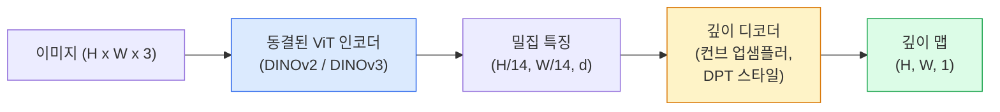

# 단안 깊이 및 기하학 추정

> 깊이 맵은 각 픽셀이 카메라로부터의 거리를 나타내는 단일 채널 이미지입니다. 스테레오나 LiDAR 없이 하나의 RGB 프레임만으로 이를 예측하는 것은 불가능했습니다. 2026년에는 동결된 ViT 인코더와 경량 헤드를 사용하여 정답(ground truth) 대비 몇 퍼센트 이내의 정확도를 달성할 수 있습니다.

**유형:** Build + Use
**언어:** Python
**선수 요건:** 4단계 14강 (ViT), 4단계 17강 (자기 지도 학습 비전), 4단계 07강 (U-Net)
**시간:** 약 60분

## 학습 목표

- 상대적 깊이와 측정 깊이를 구분하고, 각 생산 모델(MiDaS, Marigold, Depth Anything V3, ZoeDepth)이 어떤 문제를 해결하는지 설명해 보세요
- Depth Anything V3 (DINOv2 백본)를 사용하여 캘리브레이션 없이 임의의 단일 이미지에서 깊이를 예측해 보세요
- 단일 이미지에서 단안 깊이가 작동하는 이유(원근 단서, 텍스처 기울기, 학습된 사전 지식)와 절대 스케일, 가려진 기하학 등 복원할 수 없는 부분을 설명해 보세요
- 깊이 맵과 핀홀 카메라 내적(intrinsics)을 사용하여 2D 검출 결과를 3D 점으로 변환해 보세요

## 문제점

깊이는 2D 컴퓨터 비전에서 누락된 축입니다. RGB가 주어지면 이미지 평면에서 물체가 어디에 나타나는지 알 수 있지만, 얼마나 멀리 있는지 알 수 없습니다. 깊이 센서(스테레오 리그, LiDAR, 시간 비행)는 이를 직접 해결하지만 비싸고, 취약하며, 범위가 제한적입니다.

단안 깊이 추정 — 단일 RGB 프레임에서 깊이를 예측하는 것 — 은 과거에는 흐리고 신뢰할 수 없는 출력만 생성했습니다. 2026년 대규모 사전 학습된 인코더가 이를 변화시켰습니다: Depth Anything V3는 동결된 DINOv2 백본을 사용하며 실내, 실외, 의료, 위성 도메인 전반에 걸쳐 일반화되는 깊이 맵을 생성합니다. Marigold는 깊이를 조건부 확산(diffusion) 문제로 재정의합니다. ZoeDepth는 실제 측정 거리를 회귀합니다.

깊이는 또한 2D 검출과 3D 이해를 연결하는 다리입니다. 검출된 박스의 픽셀에 깊이를 곱하면 2D 객체를 3D 점 구름으로 변환할 수 있습니다. 이는 모든 AR 가림(occlusion) 시스템, 모든 장애물 회피 파이프라인, 모든 "컵을 집어" 로봇의 핵심입니다.

## 개념

### 상대적 깊이 vs 측정 깊이

- **상대 깊이** — 실제 세계 단위가 없는 `z` 값의 순서. "픽셀 A가 픽셀 B보다 가깝지만, 거리 비율은 미터에 고정되어 있지 않습니다."
- **메트릭 깊이** — 카메라로부터의 미터 단위 절대 거리. 모델이 이미지 단서와 실제 거리 간의 통계적 관계를 학습해야 합니다.

MiDaS와 Depth Anything V3는 상대 깊이를 생성합니다. Marigold는 상대 깊이를 생성합니다. ZoeDepth, UniDepth, Metric3D는 메트릭 깊이를 생성합니다. 메트릭 모델은 카메라 내부 파라미터에 민감하며, 상대 모델은 그렇지 않습니다.

### 인코더-디코더 패턴



Depth Anything V3는 인코더를 동결하고 DPT 스타일 디코더만 학습합니다. 인코더는 풍부한 특징을 제공하며, 디코더는 이를 이미지 해상도로 보간하여 깊이를 회귀합니다.

### 단일 이미지가 깊이를 생성하는 이유

2D 이미지에는 깊이와 상관관계가 있는 많은 단안 단서가 포함되어 있습니다:

- **원근법** — 3D의 평행한 선은 2D에서 수렴합니다.
- **텍스처 기울기** — 먼 표면은 더 작고 밀집된 텍스처를 가집니다.
- **가림 순서** — 가까운 물체가 먼 물체를 가립니다.
- **크기 상수성** — 알려진 물체(자동차, 사람)는 대략적인 스케일을 제공합니다.
- **대기 원근법** — 야외 장면에서 먼 물체는 더 흐릿하고 푸르게 보입니다.

수십억 장의 이미지로 학습된 ViT는 이러한 단서를 내재화합니다. 충분한 데이터와 강력한 백본을 사용하면 명시적인 3D 감독 없이도 단안 깊이가 합리적인 정확도에 도달합니다.

### 단안 깊이가 할 수 없는 것

- 내부 파라미터나 알려진 물체가 없는 **절대 메트릭 스케일**. 네트워크는 컵이 1m 또는 10m 떨어져 있는지 알지 못하면서 "컵이 숟가락보다 두 배 멀리 있다"라고 예측할 수 있습니다.
- **가려진 기하학** — 의자 뒤쪽은 보이지 않으며, 신뢰할 수 있게 추론할 수 없습니다.
- **진짜 질감이 없는 / 반사 표면** — 거울, 유리, 균일한 벽. 네트워크는 그럴듯하지만 잘못된 깊이를 보고합니다.

### 2026년의 Depth Anything V3

- 인코더로 Vanilla DINOv2 ViT-L/14 사용 (동결).
- DPT 디코더.
- 다양한 출처의 포즈가 지정된 이미지 쌍으로 학습됨 (광학적 일관성 외의 명시적인 깊이 감독은 필요하지 않음).
- **임의의 수의 시각적 입력, 알려진 카메라 포즈가 있든 없든**으로부터 공간적으로 일관된 기하학을 예측합니다.
- 단안 깊이, 임의 뷰 기하학, 시각 렌더링, 카메라 포즈 추정 전반에 걸쳐 SOTA.

2026년에 깊이가 필요할 때 호출할 수 있는 드롭인 모델입니다.

### Marigold — 깊이를 위한 확산

Marigold (Ke et al., CVPR 2024)는 깊이 추정을 조건부 이미지-이미지 확산으로 재정의합니다. 조건: RGB. 대상: 깊이 맵. 사전 학습된 Stable Diffusion 2 U-Net을 백본으로 사용합니다. 출력 깊이 맵은 객체 경계에서 예외적으로 선명합니다. 트레이드오프: 피드포워드 모델보다 추론이 느림 (10-50 디노이징 스텝).

### 내부 파라미터와 핀홀 카메라

깊이 `d`를 가진 픽셀 `(u, v)`를 카메라 좌표계의 3D 점 `(X, Y, Z)`로 리프트하려면:

```
fx, fy, cx, cy = camera intrinsics
X = (u - cx) * d / fx
Y = (v - cy) * d / fy
Z = d
```

내부 파라미터는 EXIF 메타데이터, 캘리브레이션 패턴, 또는 단안 내부 파라미터 추정기(Perspective Fields, UniDepth)에서 가져옵니다. 내부 파라미터가 없어도 60-70° FOV와 중간 해상도의 주점을 가정하여 점 구름을 렌더링할 수 있습니다 — 시각화에는 유용하지만 측정에는 사용할 수 없습니다.

### 평가

두 가지 표준 지표:

- **AbsRel** (절대 상대 오차): `mean(|d_pred - d_gt| / d_gt)`. 낮을수록 좋습니다. 프로덕션 모델은 0.05-0.1.
- **delta < 1.25** (임계값 정확도): `max(d_pred/d_gt, d_gt/d_pred) < 1.25`인 픽셀의 비율. 높을수록 좋습니다. SOTA는 0.9+.

상대 깊이(Depth Anything V3, MiDaS)의 경우, 두 지표 모두 스케일 및 시프트 불변 버전을 사용하여 평가합니다.

```figure
depth-sweep
```

## 구현하기

### 1단계: 깊이 지표

```python
import torch

def abs_rel_error(pred, target, mask=None):
    if mask is not None:
        pred = pred[mask]
        target = target[mask]
    return (torch.abs(pred - target) / target.clamp(min=1e-6)).mean().item()


def delta_accuracy(pred, target, threshold=1.25, mask=None):
    if mask is not None:
        pred = pred[mask]
        target = target[mask]
    ratio = torch.maximum(pred / target.clamp(min=1e-6), target / pred.clamp(min=1e-6))
    return (ratio < threshold).float().mean().item()
```

평가 전에 항상 유효하지 않은 깊이 픽셀(0, NaN, 포화)을 마스킹하세요.

### 2단계: 스케일 및 시프트 정렬

상대 깊이 모델의 경우, 지표를 계산하기 전에 예측값을 실제 값에 정렬합니다. `a * pred + b = target`의 최소 제곱 적합:

```python
def align_scale_shift(pred, target, mask=None):
    if mask is not None:
        p = pred[mask]
        t = target[mask]
    else:
        p = pred.flatten()
        t = target.flatten()
    A = torch.stack([p, torch.ones_like(p)], dim=1)
    coeffs, *_ = torch.linalg.lstsq(A, t.unsqueeze(-1))
    a, b = coeffs[:2, 0]
    return a * pred + b
```

MiDaS / Depth Anything을 평가할 때 `abs_rel_error` 전에 `align_scale_shift`을 실행하세요.

### 3단계: 깊이를 점 클라우드(Point Cloud)로 변환

```python
import numpy as np

def depth_to_point_cloud(depth, intrinsics):
    H, W = depth.shape
    fx, fy, cx, cy = intrinsics
    v, u = np.meshgrid(np.arange(H), np.arange(W), indexing="ij")
    z = depth
    x = (u - cx) * z / fx
    y = (v - cy) * z / fy
    return np.stack([x, y, z], axis=-1)


depth = np.random.uniform(0.5, 4.0, (240, 320))
intr = (320.0, 320.0, 160.0, 120.0)
pc = depth_to_point_cloud(depth, intr)
print(f"point cloud shape: {pc.shape}  (H, W, 3)")
```

모든 3D 변환 애플리케이션에 하나의 함수를 사용하세요. 점 클라우드를 `.ply`으로 내보내고 MeshLab 또는 CloudCompare에서 열어 보세요.

### 4단계: 합성 깊이 장면으로 스모크 테스트(Smoke Test) 수행

```python
def synthetic_depth(size=96):
    yy, xx = np.meshgrid(np.arange(size), np.arange(size), indexing="ij")
    # 바닥: 가까운 곳(위)에서 먼 곳(아래)으로 선형 그라디언트
    depth = 1.0 + (yy / size) * 4.0
    # 중앙의 상자: 더 가까움
    mask = (np.abs(xx - size / 2) < size / 6) & (np.abs(yy - size * 0.6) < size / 6)
    depth[mask] = 2.0
    return depth.astype(np.float32)


gt = torch.from_numpy(synthetic_depth(96))
pred = gt + 0.3 * torch.randn_like(gt)  # 시뮬레이션된 예측
aligned = align_scale_shift(pred, gt)
print(f"before align  absRel = {abs_rel_error(pred, gt):.3f}")
print(f"after align   absRel = {abs_rel_error(aligned, gt):.3f}")
```

### 5단계: Depth Anything V2 사용법 (참조)

```python
import numpy as np
from transformers import pipeline
from PIL import Image

pipe = pipeline(task="depth-estimation", model="depth-anything/Depth-Anything-V2-Large-hf")

image = Image.open("street.jpg").convert("RGB")
out = pipe(image)
depth_np = np.array(out["depth"])
```

세 줄입니다. `out["depth"]`은 PIL 그레이스케일이며, 연산을 위해 numpy로 변환하세요. Depth Anything 3 (2025년 11월)는 이 파이프라인을 통해 로드되지 않습니다. 자체 `depth_anything_3` 패키지를 제공합니다: `DepthAnything3.from_pretrained("depth-anything/DA3MONO-LARGE")`는 상대 단안(monocular) 모델을 로드하고, `model.inference(images).depth`는 `[N, H, W]` 깊이 배열을 반환합니다.

## 사용하기

- **Depth Anything V3** (Meta AI / ByteDance, 2024-2026) — 상대 깊이의 기본값. 프로덕션 환경에서 가장 빠른 ViT-large 백본 모델입니다.
- **Marigold** (ETH, 2024) — 시각적 품질이 가장 높지만 추론이 느립니다.
- **UniDepth** (ETH, 2024) — 카메라 내부 파라미터(intrinsics) 추정과 함께 메트릭 깊이를 제공합니다.
- **ZoeDepth** (Intel, 2023) — 메트릭 깊이; 구버전이지만 여전히 신뢰할 수 있습니다.
- **MiDaS v3.1** — 레거시지만 안정적; 비교를 위한 좋은 기준선입니다.

일반적인 통합 패턴:

1. RGB 프레임이 도착합니다.
2. 깊이 모델이 깊이 맵을 생성합니다.
3. 디텍터가 상자를 생성합니다.
4. 상자의 중심점을 깊이를 통해 3D로 변환하고, 점 클라우드가 있으면 병합하세요.
5. 후속 작업: AR 가림 처리, 경로 계획, 물체 크기 추정, 스테레오 대체.

실시간 사용을 위해, Depth Anything V2 Small (INT8 양자화)은 소비자용 GPU에서 518x518 해상도로 약 30 fps를 달성합니다.

## 출시하기

이 강의는 다음을 생성합니다:

- `outputs/prompt-depth-model-picker.md` — 지연 시간, 메트릭 대 상대 깊이 필요성, 장면 유형에 따라 Depth Anything V3, Marigold, UniDepth, MiDaS 중 하나를 선택합니다.
- `outputs/skill-depth-to-pointcloud.md` — 깊이 맵에서 점 구름을 구축하는 스킬로, 올바른 내부 파라미터 처리와 `.ply` 내보내기를 지원합니다.

## 연습 문제

1. **(쉬움)** 책상 사진 10장에 Depth Anything V2를 실행하세요. 깊이를 grayscale PNG로 저장하고 확인해 보세요. 예측된 깊이가 잘못된 물체 하나를 식별하고, 단안 단서가 실패한 이유를 설명해 보세요.
2. **(중간)** Depth Anything V2에서 RGB + 깊이를 받아 점 구름으로 변환하고 `open3d`로 렌더링하세요. 두 장면(실내 / 실외)을 비교하고, 어느 쪽이 더 신뢰할 수 있는지 기록하세요.
3. **(어려움)** 알려진 물체의 위치만 다른 이미지 5쌍(예: 병을 30cm 더 가까이 이동)을 가져오세요. UniDepth를 사용하여 두 이미지 모두에서 미터 단위 깊이를 예측하세요. 예측된 거리 차이와 실제 30cm를 보고하세요.

## 핵심 용어

| 용어 | 사람들이 말하는 표현 | 실제 의미 |
|------|----------------|----------------------|
| 단안 깊이 | "단일 이미지 깊이" | 스테레오나 LiDAR 없이 하나의 RGB 프레임에서 깊이를 추정하는 것 |
| 상대 깊이 | "순서 있는 깊이" | 실제 세계 단위 없이 순서가 매겨진 z 값 |
| 미터 단위 깊이 | "절대 거리" | 미터 단위의 깊이; 캘리브레이션 또는 미터 단위 감독으로 학습된 모델이 필요 |
| AbsRel | "절대 상대 오차" | |d_pred - d_gt| / d_gt의 평균; 표준 깊이 지표 |
| Delta 정확도 | "delta < 1.25" | 예측값이 정답의 25% 이내인 픽셀의 비율 |
| 핀홀 카메라 | "fx, fy, cx, cy" | (u, v, d)를 (X, Y, Z)로 변환하는 데 사용되는 카메라 모델 |
| DPT | "Dense Prediction Transformer" | 동결된 ViT 인코더 위에 깊이를 위해 사용되는 conv 기반 디코더 |
| DINOv2 백본 | "작동하는 이유" | 깊이 레이블 없이 도메인 전반에 걸쳐 일반화되는 자기 지도 학습 특징 |

## 추가 읽기

- [Depth Anything V3 paper page](https://depth-anything.github.io/) — DINOv2 인코더를 사용한 SOTA 단안 깊이
- [Marigold (Ke et al., CVPR 2024)](https://marigoldmonodepth.github.io/) — 확산 기반 깊이 추정
- [UniDepth (Piccinelli et al., 2024)](https://arxiv.org/abs/2403.18913) — 내부 파라미터를 사용한 미터 단위 깊이
- [MiDaS v3.1 (Intel ISL)](https://github.com/isl-org/MiDaS) — 표준 상대 깊이 기준선
- [DINOv3 blog post (Meta)](https://ai.meta.com/blog/dinov3-self-supervised-vision-model/) — 깊이 정확도를 높이는 인코더 계열
