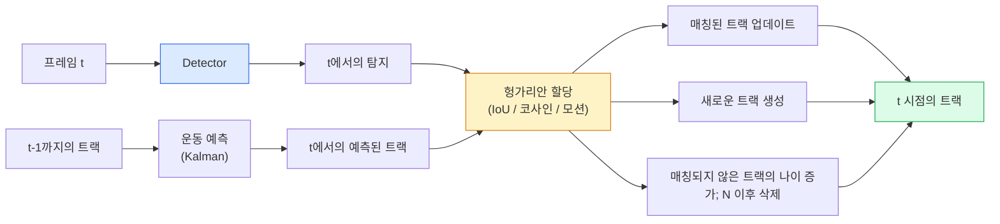

# 다중 객체 추적 및 비디오 메모리

> 추적은 탐지 및 연관입니다. 모든 프레임을 탐지하세요. 이 프레임의 탐지 결과를 이전 프레임의 트랙 ID와 매칭하세요.

**유형:** Build
**언어:** Python
**선수 요건:** 4단계 06강 (YOLO 탐지), 4단계 08강 (Mask R-CNN), 4단계 24강 (SAM 3)
**시간:** 약 60분

## 학습 목표

- 탐지 기반 추적과 쿼리 기반 추적을 구분하고, 알고리즘 계열(SORT, DeepSORT, ByteTrack, BoT-SORT, SAM 2 메모리 추적기, SAM 3.1 Object Multiplex)을 나열하세요
- IoU + Hungarian 할당을 처음부터 구현하여 고전적인 탐지 기반 추적을 수행하세요
- SAM 2의 메모리 뱅크를 설명하고, IoU 기반 연관보다 가림(occlusion)을 더 잘 처리하는 이유를 설명하세요
- 세 가지 추적 지표(MOTA, IDF1, HOTA)를 읽고, 특정 사용 사례에 어떤 지표가 중요한지 선택하세요

## 문제점

탐지기는 단일 프레임에서 객체의 위치를 알려줍니다. 추적기는 `t` 프레임의 탐지 결과가 `t-1` 프레임의 탐지 결과와 같은 객체인지 알려줍니다. 이 정보가 없으면 선을 통과하는 객체를 세거나, 가림을 통과하는 공을 따라가거나, "4번 차량이 차선에서 8초 동안 있었다"는 것을 알 수 없습니다.

추적은 모든 비디오 관련 제품(스포츠 분석, 감시, 자율 주행, 의료 비디오 분석, 야생 동물 모니터링, 워드마크 카운팅)에 필수적입니다. 핵심 구성 요소는 공유됩니다. 프레임별 탐지기, 운동 모델(Kalman 필터 또는 더 복잡한 모델), 연관 단계(IoU / 코사인 / 학습된 특징에 대한 Hungarian 알고리즘), 그리고 트랙 생명주기(생성, 업데이트, 종료)입니다.

2026년은 두 가지 새로운 패턴을 가져왔습니다. **SAM 2 메모리 기반 추적**(운동 모델 연관이 아닌 특징 메모리)과 **SAM 3.1 Object Multiplex**(동일 개념의 여러 인스턴스에 대한 공유 메모리)입니다. 이 강의는 먼저 고전적인 스택을 거친 후, 메모리 기반 접근법을 다룹니다.

## 개념

### 탐지 기반 추적



2026년에 접하게 될 모든 트래커는 이 루프의 변형입니다. 차이점:

- **SORT** (2016): 칼만 필터 + IoU 헝가리안 알고리즘. 단순하고 빠르며, 외형 모델이 없습니다.
- **DeepSORT** (2017): SORT + 트랙별 CNN 기반 외형 특징(ReID 임베딩). 교차 상황을 더 잘 처리합니다.
- **ByteTrack** (2021): 낮은 신뢰도의 탐지를 2단계로 연결합니다. 외형 특징이 필요하지 않지만 MOT17에서 최고 성능을 보여줍니다.
- **BoT-SORT** (2022): Byte + 카메라 모션 보정 + ReID.
- **StrongSORT / OC-SORT** — 모션 및 외형 처리가 개선된 ByteTrack 후속 모델입니다.

### 칼만 필터 한 문단 요약

칼만 필터는 공분산과 함께 트랙별 상태 `(x, y, w, h, dx, dy, dw, dh)`를 유지합니다. 각 프레임에서 **예측** 단계로 등속도 모델을 사용해 상태를 예측한 후, 매칭된 탐지로 **업데이트**합니다. 예측 불확실성이 높을수록 탐지를 더 신뢰합니다. 이를 통해 매끄러운 궤적을 얻고 짧은 가림 현상(1-5 프레임) 동안에도 트랙을 계속 추적할 수 있습니다.

모든 고전적 트래커는 모션 예측 단계에서 칼만 필터를 사용합니다.

### 헝가리안 알고리즘

`M x N` 비용 매트릭스(트랙 x 탐지)가 주어지면 총 비용을 최소화하는 일대일 할당을 찾습니다. 비용은 일반적으로 `1 - IoU(track_bbox, detection_bbox)` 또는 외형 특징의 음의 코사인 유사도입니다. 실행 시간은 O((M+N)^3)이며, M, N이 약 1000까지인 경우 Python의 `scipy.optimize.linear_sum_assignment`를 통해 충분히 빠르게 처리할 수 있습니다.

### ByteTrack의 핵심 아이디어

표준 트래커는 낮은 신뢰도의 탐지(< 0.5)를 버립니다. ByteTrack은 이를 **2단계 후보**로 유지합니다. 트랙을 높은 신뢰도의 탐지와 매칭한 후, 매칭되지 않은 트랙은 약간 느슨한 IoU 임계값으로 낮은 신뢰도의 탐지와 매칭을 시도합니다. 짧은 가림 현상과 군중 근처의 ID 스위치를 복원합니다.

### SAM 2 메모리 기반 추적

SAM 2는 인스턴스별 시공간적 특징을 저장하는 **메모리 뱅크(memory bank)**를 유지하여 비디오를 처리합니다. 한 프레임에서 프롬프트(클릭, 박스, 텍스트)가 주어지면 해당 인스턴스를 메모리에 인코딩합니다. 이후 프레임에서는 메모리가 새 프레임의 특징과 교차 어텐션(Cross-Attention)을 수행하며, 디코더는 새 프레임에서 동일한 인스턴스에 대한 마스크를 생성합니다.

칼만 필터(Kalman filter)나 Hungarian 할당(Hungarian assignment)이 없습니다. 연관성은 메모리-어텐션 연산에 내재되어 있습니다.

장점:
- 대규모 가림 현상(occlusion)에 강건합니다(메모리가 여러 프레임에 걸쳐 인스턴스 식별 정보를 전달합니다).
- SAM 3의 텍스트 프롬프트와 결합하면 오픈 어휘(open-vocabulary)가 가능합니다.
- 별도의 운동 모델(motion model) 없이 작동합니다.

단점:
- 다중 객체 추적(multi-object tracking)에서는 ByteTrack보다 느립니다.
- 메모리 뱅크가 커져 컨텍스트 윈도우(context window)가 제한됩니다.

### SAM 3.1 Object Multiplex

기존 SAM 2 / SAM 3 추적은 인스턴스별로 별도의 메모리 뱅크를 유지합니다. 50개의 객체가 있으면 50개의 메모리 뱅크가 필요합니다. Object Multiplex (2026년 3월)는 이를 **인스턴스별 쿼리 토큰(per-instance query tokens)**과 함께 하나의 공유 메모리로 통합합니다. 비용은 인스턴스 수에 대해 준선형(sub-linear)으로 증가합니다.

Multiplex는 2026년 군중 추적의 새로운 기본값입니다: 콘서트 군중, 창고 작업자, 교통 교차로.

### 알아야 할 세 가지 지표

- **MOTA (Multi-Object Tracking Accuracy)** — 1 - (FN + FP + ID 스위치) / GT. 오류 유형에 따라 가중치가 부여되며, 탐지 및 연관 실패를 하나의 지표로 혼합합니다.
- **IDF1 (ID F1)** — ID 정밀도 및 재현율의 조화 평균. 각 ground-truth 트랙이 시간에 걸쳐 ID를 얼마나 잘 유지하는지에 집중합니다. ID 스위치에 민감한 작업에서는 MOTA보다 더 좋습니다.
- **HOTA (Higher Order Tracking Accuracy)** — 탐지 정확도(DetA)와 연관 정확도(AssA)로 분해됩니다. 2020년 이후 커뮤니티 표준이며, 가장 포괄적입니다.

감시(누가 누구인지)의 경우: IDF1을 보고합니다. 스포츠 분석(패스 횟수 계산)의 경우: HOTA. 일반적인 학술 비교의 경우: HOTA.

```figure
cv3-track-assoc
```

## 구현하기

### 1단계: IoU 기반 비용 매트릭스

```python
import numpy as np


def bbox_iou(a, b):
    """
    a, b: (N, 4) arrays of [x1, y1, x2, y2].
    Returns (N_a, N_b) IoU matrix.
    """
    ax1, ay1, ax2, ay2 = a[:, 0], a[:, 1], a[:, 2], a[:, 3]
    bx1, by1, bx2, by2 = b[:, 0], b[:, 1], b[:, 2], b[:, 3]
    inter_x1 = np.maximum(ax1[:, None], bx1[None, :])
    inter_y1 = np.maximum(ay1[:, None], by1[None, :])
    inter_x2 = np.minimum(ax2[:, None], bx2[None, :])
    inter_y2 = np.minimum(ay2[:, None], by2[None, :])
    inter = np.clip(inter_x2 - inter_x1, 0, None) * np.clip(inter_y2 - inter_y1, 0, None)
    area_a = (ax2 - ax1) * (ay2 - ay1)
    area_b = (bx2 - bx1) * (by2 - by1)
    union = area_a[:, None] + area_b[None, :] - inter
    return inter / np.clip(union, 1e-8, None)
```

### 2단계: 최소한의 SORT 스타일 트래커

간결성을 위해 고정 속도 칼만 필터는 생략했습니다. 여기서는 단순한 IoU 연관 관계를 사용하며, 실제 운영 환경에서는 칼만 예측이 필수적입니다. `sort` Python 패키지가 전체 버전을 제공합니다.

```python
from scipy.optimize import linear_sum_assignment


class Track:
    def __init__(self, tid, bbox, frame):
        self.id = tid
        self.bbox = bbox
        self.last_frame = frame
        self.hits = 1

    def update(self, bbox, frame):
        self.bbox = bbox
        self.last_frame = frame
        self.hits += 1


class SimpleTracker:
    def __init__(self, iou_threshold=0.3, max_age=5):
        self.tracks = []
        self.next_id = 1
        self.iou_threshold = iou_threshold
        self.max_age = max_age

    def step(self, detections, frame):
        if not self.tracks:
            for d in detections:
                self.tracks.append(Track(self.next_id, d, frame))
                self.next_id += 1
            return [(t.id, t.bbox) for t in self.tracks]

        track_boxes = np.array([t.bbox for t in self.tracks])
        det_boxes = np.array(detections) if len(detections) else np.empty((0, 4))

        iou = bbox_iou(track_boxes, det_boxes) if len(det_boxes) else np.zeros((len(track_boxes), 0))
        cost = 1 - iou
        cost[iou < self.iou_threshold] = 1e6

        matched_track = set()
        matched_det = set()
        if cost.size > 0:
            row, col = linear_sum_assignment(cost)
            for r, c in zip(row, col):
                if cost[r, c] < 1.0:
                    self.tracks[r].update(det_boxes[c], frame)
                    matched_track.add(r); matched_det.add(c)

        for i, d in enumerate(det_boxes):
            if i not in matched_det:
                self.tracks.append(Track(self.next_id, d, frame))
                self.next_id += 1

        self.tracks = [t for t in self.tracks if frame - t.last_frame <= self.max_age]
        return [(t.id, t.bbox) for t in self.tracks]
```

60줄입니다. 프레임별 검출 결과를 입력받아 프레임별 트랙 ID를 반환합니다. 실제 시스템에서는 칼만 예측, ByteTrack의 2단계 재매칭, 외형(appearance) 특징을 추가합니다.

### 3단계: 합성 궤적 테스트

```python
def synthetic_frames(num_frames=20, num_objects=3, H=240, W=320, seed=0):
    rng = np.random.default_rng(seed)
    starts = rng.uniform(20, 200, size=(num_objects, 2))
    velocities = rng.uniform(-5, 5, size=(num_objects, 2))
    frames = []
    for f in range(num_frames):
        dets = []
        for i in range(num_objects):
            cx, cy = starts[i] + f * velocities[i]
            dets.append([cx - 10, cy - 10, cx + 10, cy + 10])
        frames.append(dets)
    return frames


tracker = SimpleTracker()
for f, dets in enumerate(synthetic_frames()):
    tracks = tracker.step(dets, f)
```

직선으로 이동하는 세 물체는 20프레임 전체에 걸쳐 ID를 유지해야 합니다.

### 4단계: ID 스위치 지표

```python
def count_id_switches(tracks_per_frame, gt_per_frame):
    """
    tracks_per_frame:  list of list of (track_id, bbox)
    gt_per_frame:      list of list of (gt_id, bbox)
    Returns number of ID switches.
    """
    prev_assignment = {}
    switches = 0
    for tracks, gts in zip(tracks_per_frame, gt_per_frame):
        if not tracks or not gts:
            continue
        t_boxes = np.array([b for _, b in tracks])
        g_boxes = np.array([b for _, b in gts])
        iou = bbox_iou(g_boxes, t_boxes)
        for g_idx, (gt_id, _) in enumerate(gts):
            j = iou[g_idx].argmax()
            if iou[g_idx, j] > 0.5:
                t_id = tracks[j][0]
                if gt_id in prev_assignment and prev_assignment[gt_id] != t_id:
                    switches += 1
                prev_assignment[gt_id] = t_id
    return switches
```

이는 IDF01강 유사한 단순화된 지표입니다: 정답(ground-truth) 객체가 할당된 예측 트랙 ID를 변경한 횟수를 세는 것입니다. 실제 MOTA / IDF1 / HOTA 도구는 `py-motmetrics`과 `TrackEval`에 있습니다.

## 사용하기

2026년 생산용 트래커:

- `ultralytics` — YOLOv8 + ByteTrack / BoT-SORT 내장. `results = model.track(source, tracker="bytetrack.yaml")`. 기본값입니다.
- `supervision` (Roboflow) — ByteTrack 래퍼 및 주석 유틸리티.
- SAM 2 / SAM 3.1 — `processor.track()`을 통한 메모리 기반 트래킹.
- 커스텀 스택: 검출기(YOLOv8 / RT-DETR) + `sort-tracker` / `OC-SORT` / `StrongSORT`.

선택 기준:

- 30fps 이상에서 보행자 / 자동차 / 상자: **ultralytics와 함께 ByteTrack 사용**.
- 군중에서 한 클래스의 다수 인스턴스: **SAM 3.1 Object Multiplex**.
- 식별 가능한 외형이 있는 심한 가림(occlusion): **DeepSORT / StrongSORT** (ReID 특징).
- 스포츠 / 복잡한 상호작용: **BoT-SORT** 또는 학습된 트래커(MOTRv3).

## 출시하기

이 강의는 다음을 생성합니다:

- `outputs/prompt-tracker-picker.md` — 장면 유형, 가림 패턴, 지연(latency) 예산에 따라 SORT / ByteTrack / BoT-SORT / SAM 2 / SAM 3.1을 선택합니다.
- `outputs/skill-mot-evaluator.md` — 정답 트랙에 대한 MOTA / IDF1 / HOTA를 위한 완전한 평가 하네스를 작성합니다.

## 연습 문제

1. **(쉬움)** 위 합성 트래커를 3, 10, 30개의 물체로 실행하세요. 각 경우의 ID 스위치 횟수를 보고하세요. 단순 IoU 전용 연관 관계가 실패하기 시작하는 지점을 식별하세요.
2. **(중간)** 연관 관계 전에 고정 속도 칼만 예측 단계를 추가하세요. 짧은(2-3프레임) 가림이 더 이상 ID 스위치를 유발하지 않음을 보이세요.
3. **(난이도 높음)** SAM 2의 메모리 기반 트래커(`transformers`를 통해)를 대안 트래커 백엔드로 통합하세요. 30초 길이의 군중 클립에서 SimpleTracker와 SAM 2를 모두 실행하고, ID 전환 횟수를 비교하세요. 5명의 두드러진 사람에 대해 ground-truth ID를 수동으로 라벨링하세요.

## 핵심 용어

| 용어 | 사람들이 말하는 것 | 실제 의미 |
|------|----------------|----------------------|
| Tracking-by-detection | "감지 후 연관" | 프레임별 감지기와 IoU / 외형 기반 Hungarian 할당 |
| Kalman filter | "운동 예측" | 선형 동역학 + 공분산을 사용하여 매끄러운 트래커 예측 및 가림 처리 |
| Hungarian algorithm | "최적 할당" | 최소 비용 이분 매칭 문제를 해결합니다; `scipy.optimize.linear_sum_assignment` |
| ByteTrack | "저신뢰도 2차 패스" | 매칭되지 않은 트래커를 저신뢰도 감지 결과와 재매칭하여 짧은 가림을 복구 |
| DeepSORT | "SORT + 외형" | ReID 기능을 추가하여 프레임 간 매칭을 수행; ID 보존에 더 적합 |
| Memory bank | "SAM 2의 비법" | 프레임에 걸쳐 저장되는 인스턴스별 시공간적 기능; 명시적 연관을 대체하는 교차 어텐션 |
| Object Multiplex | "SAM 3.1 공유 메모리" | 인스턴스별 쿼리를 사용하는 단일 공유 메모리로 빠른 다중 객체 추적 |
| HOTA | "현대적 추적 지표" | 감지 정확도와 연관 정확도로 분해; 커뮤니티 표준 |

## 추가 읽기

- [SORT (Bewley et al., 2016)](https://arxiv.org/abs/1602.00763) — 최소한의 tracking-by-detection 논문
- [DeepSORT (Wojke et al., 2017)](https://arxiv.org/abs/1703.07402) — 외형 기능 추가
- [ByteTrack (Zhang et al., 2022)](https://arxiv.org/abs/2110.06864) — 저신뢰도 2차 패스
- [BoT-SORT (Aharon et al., 2022)](https://arxiv.org/abs/2206.14651) — 카메라 운동 보정
- [HOTA (Luiten et al., 2020)](https://arxiv.org/abs/2009.07736) — 분해된 추적 지표
- [SAM 2 video segmentation (Meta, 2024)](https://ai.meta.com/sam2/) — 메모리 기반 트래커
- [SAM 3.1 Object Multiplex (Meta, March 2026)](https://ai.meta.com/blog/segment-anything-model-3/)
