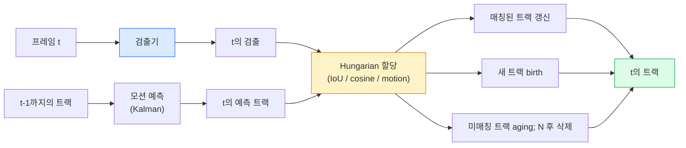

# Multi-Object Tracking과 Video Memory (Multi-Object Tracking & Video Memory)

> 트래킹은 검출과 연관입니다. 매 프레임을 검출합니다. 이 프레임의 검출을 ID로 이전 프레임의 트랙에 맞춥니다.

**Type:** Build
**Languages:** Python
**Prerequisites:** Phase 4 Lesson 06 (YOLO Detection), Phase 4 Lesson 08 (Mask R-CNN), Phase 4 Lesson 24 (SAM 3)
**Time:** ~60 minutes

## 학습 목표 (Learning Objectives)

- Tracking-by-detection과 query 기반 트래킹을 구분하고 알고리즘 패밀리(SORT, DeepSORT, ByteTrack, BoT-SORT, SAM 2 memory tracker, SAM 3.1 Object Multiplex)를 말합니다
- 고전적 tracking-by-detection을 위해 IoU + Hungarian assignment를 처음부터 구현합니다
- SAM 2의 메모리 뱅크와 IoU 기반 연관보다 가림을 더 잘 다루는 이유를 설명합니다
- 세 트래킹 지표(MOTA, IDF1, HOTA)를 읽고 주어진 유스케이스에 맞는 것을 고릅니다

## 문제 상황 (The Problem)

검출기는 단일 프레임에서 객체가 어디에 있는지 알려 줍니다. 트래커는 프레임 `t`의 어느 검출이 프레임 `t-1`의 검출과 같은 객체인지 알려 줍니다. 그것 없이는 선을 넘는 객체를 셀 수 없고, 가림을 통과하는 공을 따라갈 수 없으며, "차 #4가 8초 동안 차선에 있었다"를 알 수 없습니다.

트래킹은 모든 비디오 대면 제품에 필수입니다: 스포츠 분석, 감시, 자율주행, 의료 비디오 분석, 야생동물 모니터링, 로고 카운팅. 핵심 빌딩 블록은 공유됩니다: 프레임당 검출기, 모션 모델(Kalman filter 또는 더 풍부한 것), 연관 단계(IoU / cosine / 학습된 특징에 대한 Hungarian algorithm), 트랙 생명주기(birth, update, death).

2026년은 두 새 패턴을 가져왔습니다: **SAM 2 메모리 기반 트래킹**(모션 모델 연관 대신 feature-memory)과 **SAM 3.1 Object Multiplex**(같은 개념의 많은 인스턴스를 위한 공유 메모리). 이 레슨은 먼저 고전 스택을 걷고, 그다음 메모리 기반 접근을 봅니다.

## 핵심 개념 (The Concept)

### Tracking-by-detection



2026년에 만날 모든 트래커가 이 루프의 변형입니다. 차이:

- **SORT** (2016): Kalman filter + IoU Hungarian. 단순, 빠름, appearance 모델 없음.
- **DeepSORT** (2017): SORT + 트랙당 CNN 기반 appearance 특징(ReID 임베딩). 교차에 더 강함.
- **ByteTrack** (2021): 저신뢰 검출을 2단계로 연관; appearance 특징 없이도 MOT17 상위 성능.
- **BoT-SORT** (2022): Byte + 카메라 모션 보정 + ReID.
- **StrongSORT / OC-SORT** — 더 나은 모션과 appearance를 가진 ByteTrack 후손.

### 한 단락으로 보는 Kalman filter (Kalman filter in one paragraph)

Kalman filter는 공분산과 함께 트랙당 상태 `(x, y, w, h, dx, dy, dw, dh)`를 유지합니다. 매 프레임 **predict**는 등속 모델로 상태를 예측하고, 그다음 매칭된 검출로 **update**합니다. 예측 불확실성이 높을 때 업데이트가 검출을 더 신뢰합니다. 부드러운 궤적과 짧은 가림(1–5 프레임)을 통과해 트랙을 이어가는 능력을 줍니다.

모든 고전적 트래커가 모션 예측 단계에서 Kalman filter를 씁니다.

### Hungarian algorithm

`M x N` 비용 행렬(트랙 x 검출)이 주어지면, 총 비용을 최소화하는 일대일 할당을 찾습니다. 비용은 보통 `1 - IoU(track_bbox, detection_bbox)` 또는 appearance 특징의 음의 코사인 유사도입니다. 런타임은 O((M+N)^3); M, N이 ~1000까지면 `scipy.optimize.linear_sum_assignment`로 Python에서 충분히 빠릅니다.

### ByteTrack의 핵심 아이디어 (ByteTrack's key idea)

표준 트래커는 저신뢰 검출(< 0.5)을 버립니다. ByteTrack은 이를 **2단계 후보**로 유지합니다: 고신뢰 검출에 트랙을 매칭한 뒤, 미매칭 트랙이 약간 느슨한 IoU 임계값으로 저신뢰 검출에 매칭을 시도합니다. 짧은 가림, 군중 근처 ID 전환을 복구합니다.

### SAM 2 메모리 기반 트래킹 (SAM 2 memory-based tracking)

SAM 2는 인스턴스별 시공간 특징의 **메모리 뱅크**를 유지해 비디오를 다룹니다. 한 프레임에 프롬프트(클릭, 박스, 텍스트)가 주어지면 인스턴스를 메모리에 인코딩합니다. 이후 프레임에서 메모리가 새 프레임의 특징과 cross-attention되고, 디코더가 새 프레임에서 같은 인스턴스의 마스크를 만듭니다.

Kalman filter 없음, Hungarian assignment 없음. 연관은 memory-attention 연산에 암묵적입니다.

장점:
- 큰 가림에 견고(메모리가 많은 프레임에 걸쳐 인스턴스 정체성을 유지).
- SAM 3의 텍스트 프롬프트와 결합하면 open-vocabulary.
- 별도 모션 모델 없이 동작.

단점:
- 다객체 트래킹에서 ByteTrack보다 느림.
- 메모리 뱅크가 커짐; 컨텍스트 윈도우를 제한.

### SAM 3.1 Object Multiplex

이전 SAM 2 / SAM 3 트래킹은 인스턴스당 별도 메모리 뱅크를 유지합니다. 50개 객체면 50개 메모리 뱅크. Object Multiplex(2026년 3월)는 이를 **인스턴스별 쿼리 토큰**이 있는 하나의 공유 메모리로 접습니다. 비용이 인스턴스 수에 준선형으로 스케일합니다.

Multiplex는 2026년 군중 트래킹의 새 기본값입니다: 콘서트 군중, 창고 작업자, 교통 교차로.

### 알아야 할 세 지표 (Three metrics to know)

- **MOTA (Multi-Object Tracking Accuracy)** — 1 - (FN + FP + ID switches) / GT. 오류 유형으로 가중; 검출과 연관 실패를 섞는 단일 지표.
- **IDF1 (ID F1)** — ID precision과 recall의 조화평균. 각 ground-truth 트랙이 시간에 걸쳐 ID를 얼마나 잘 유지하는지에 초점. ID-switch에 민감한 과제에서는 MOTA보다 낫습니다.
- **HOTA (Higher Order Tracking Accuracy)** — 검출 정확도(DetA)와 연관 정확도(AssA)로 분해. 2020년 이후 커뮤니티 표준; 가장 포괄적.

감시(누가 누구): IDF1을 보고합니다. 스포츠 분석(패스 세기): HOTA. 일반 학술 비교: HOTA.

```figure
cv3-track-assoc
```

## 직접 만들기 (Build It)

### Step 1: IoU 기반 비용 행렬 (IoU-based cost matrix)

```python
import numpy as np


def bbox_iou(a, b):
    """
    a, b: (N, 4) arrays of [x1, y1, x2, y2].
    Returns (N_a, N_b) IoU matrix.
    """
    ax1, ay1, ax2, ay2 = a[:, 0], a[:, 1], a[:, 2], a[:, 3]
    bx1, by1, bx2, by2 = b[:, 0], b[:, 1], b[:, 2], b[:, 3]
    inter_x1 = np.maximum(ax1[:, None], bx1[None, :])
    inter_y1 = np.maximum(ay1[:, None], by1[None, :])
    inter_x2 = np.minimum(ax2[:, None], bx2[None, :])
    inter_y2 = np.minimum(ay2[:, None], by2[None, :])
    inter = np.clip(inter_x2 - inter_x1, 0, None) * np.clip(inter_y2 - inter_y1, 0, None)
    area_a = (ax2 - ax1) * (ay2 - ay1)
    area_b = (bx2 - bx1) * (by2 - by1)
    union = area_a[:, None] + area_b[None, :] - inter
    return inter / np.clip(union, 1e-8, None)
```

### Step 2: 최소 SORT형 트래커 (Minimal SORT-style tracker)

고정 등속 Kalman은 간결함을 위해 생략 — 여기서는 단순 IoU 연관을 씁니다; 프로덕션에서는 Kalman predict가 필수입니다. `sort` Python 패키지가 전체 버전을 제공합니다.

```python
from scipy.optimize import linear_sum_assignment


class Track:
    def __init__(self, tid, bbox, frame):
        self.id = tid
        self.bbox = bbox
        self.last_frame = frame
        self.hits = 1

    def update(self, bbox, frame):
        self.bbox = bbox
        self.last_frame = frame
        self.hits += 1


class SimpleTracker:
    def __init__(self, iou_threshold=0.3, max_age=5):
        self.tracks = []
        self.next_id = 1
        self.iou_threshold = iou_threshold
        self.max_age = max_age

    def step(self, detections, frame):
        if not self.tracks:
            for d in detections:
                self.tracks.append(Track(self.next_id, d, frame))
                self.next_id += 1
            return [(t.id, t.bbox) for t in self.tracks]

        track_boxes = np.array([t.bbox for t in self.tracks])
        det_boxes = np.array(detections) if len(detections) else np.empty((0, 4))

        iou = bbox_iou(track_boxes, det_boxes) if len(det_boxes) else np.zeros((len(track_boxes), 0))
        cost = 1 - iou
        cost[iou < self.iou_threshold] = 1e6

        matched_track = set()
        matched_det = set()
        if cost.size > 0:
            row, col = linear_sum_assignment(cost)
            for r, c in zip(row, col):
                if cost[r, c] < 1.0:
                    self.tracks[r].update(det_boxes[c], frame)
                    matched_track.add(r); matched_det.add(c)

        for i, d in enumerate(det_boxes):
            if i not in matched_det:
                self.tracks.append(Track(self.next_id, d, frame))
                self.next_id += 1

        self.tracks = [t for t in self.tracks if frame - t.last_frame <= self.max_age]
        return [(t.id, t.bbox) for t in self.tracks]
```

60줄. 프레임당 검출을 받아 프레임당 트랙 ID를 반환합니다. 실제 시스템은 Kalman predict, ByteTrack의 2단계 재매칭, appearance 특징을 추가합니다.

### Step 3: 합성 궤적 테스트 (Synthetic trajectory test)

```python
def synthetic_frames(num_frames=20, num_objects=3, H=240, W=320, seed=0):
    rng = np.random.default_rng(seed)
    starts = rng.uniform(20, 200, size=(num_objects, 2))
    velocities = rng.uniform(-5, 5, size=(num_objects, 2))
    frames = []
    for f in range(num_frames):
        dets = []
        for i in range(num_objects):
            cx, cy = starts[i] + f * velocities[i]
            dets.append([cx - 10, cy - 10, cx + 10, cy + 10])
        frames.append(dets)
    return frames


tracker = SimpleTracker()
for f, dets in enumerate(synthetic_frames()):
    tracks = tracker.step(dets, f)
```

직선으로 움직이는 세 객체가 20프레임 모두에서 ID를 유지해야 합니다.

### Step 4: ID-switch 지표 (ID-switch metric)

```python
def count_id_switches(tracks_per_frame, gt_per_frame):
    """
    tracks_per_frame:  list of list of (track_id, bbox)
    gt_per_frame:      list of list of (gt_id, bbox)
    Returns number of ID switches.
    """
    prev_assignment = {}
    switches = 0
    for tracks, gts in zip(tracks_per_frame, gt_per_frame):
        if not tracks or not gts:
            continue
        t_boxes = np.array([b for _, b in tracks])
        g_boxes = np.array([b for _, b in gts])
        iou = bbox_iou(g_boxes, t_boxes)
        for g_idx, (gt_id, _) in enumerate(gts):
            j = iou[g_idx].argmax()
            if iou[g_idx, j] > 0.5:
                t_id = tracks[j][0]
                if gt_id in prev_assignment and prev_assignment[gt_id] != t_id:
                    switches += 1
                prev_assignment[gt_id] = t_id
    return switches
```

이것은 단순화된 IDF1 인접 지표입니다: ground-truth 객체가 할당된 예측 트랙 ID를 몇 번 바꾸는지 셉니다. 실제 MOTA / IDF1 / HOTA 도구는 `py-motmetrics`와 `TrackEval`에 있습니다.

## 활용하기 (Use It)

2026 프로덕션 트래커:

- `ultralytics` — YOLOv8 + ByteTrack / BoT-SORT 내장. `results = model.track(source, tracker="bytetrack.yaml")`. 기본값.
- `supervision` (Roboflow) — ByteTrack 래퍼와 주석 유틸리티.
- SAM 2 / SAM 3.1 — `processor.track()`을 통한 메모리 기반 트래킹.
- 커스텀 스택: 검출기(YOLOv8 / RT-DETR) + `sort-tracker` / `OC-SORT` / `StrongSORT`.

고르기:

- 보행자 / 차 / 박스, 30+ fps: **ultralytics의 ByteTrack**.
- 군중에서 한 클래스의 많은 인스턴스: **SAM 3.1 Object Multiplex**.
- 식별 가능한 appearance가 있는 강한 가림: **DeepSORT / StrongSORT** (ReID 특징).
- 스포츠 / 복잡한 상호작용: **BoT-SORT** 또는 학습된 트래커(MOTRv3).

## 결과물 배포 (Ship It)

이 레슨이 만드는 것:

- `outputs/prompt-tracker-picker.md` — 장면 유형·가림 패턴·지연 예산에 따라 SORT / ByteTrack / BoT-SORT / SAM 2 / SAM 3.1을 고릅니다.
- `outputs/skill-mot-evaluator.md` — Ground-truth 트랙에 대한 MOTA / IDF1 / HOTA의 완전한 평가 하네스를 작성합니다.

## 연습 문제 (Exercises)

1. **(Easy)** 위 합성 트래커를 3, 10, 30개 객체로 돌립니다. 각 경우의 ID-switch 수를 보고합니다. 단순 IoU만 연관이 실패하기 시작하는 곳을 찾습니다.
2. **(Medium)** 연관 전에 등속 Kalman predict 단계를 추가합니다. 짧은(2–3 프레임) 가림이 더 이상 ID switch를 일으키지 않음을 보입니다.
3. **(Hard)** `transformers`를 통해 SAM 2의 메모리 기반 트래커를 대안 트래커 백엔드로 통합합니다. 군중 30초 클립에서 SimpleTracker와 SAM 2를 둘 다 돌리고 ID-switch 수를 비교하며, 두드러진 사람 5명의 ground-truth ID를 수동 라벨링합니다.

## 핵심 용어 (Key Terms)

| 용어 | 사람들이 말하는 것 | 실제 의미 |
|------|----------------|----------------------|
| Tracking-by-detection | "검출 후 연관" | 프레임당 검출기 + IoU / appearance에 대한 Hungarian assignment |
| Kalman filter | "모션 예측" | 부드러운 트랙 예측과 가림 처리를 위한 선형 역학 + 공분산 |
| Hungarian algorithm | "최적 할당" | 최소 비용 이분 매칭 문제를 풂; `scipy.optimize.linear_sum_assignment` |
| ByteTrack | "저신뢰 2패스" | 짧은 가림을 복구하려고 미매칭 트랙을 저신뢰 검출에 재매칭 |
| DeepSORT | "SORT + appearance" | 교차 프레임 매칭용 ReID 특징을 추가; ID 보존에 더 나음 |
| Memory bank | "SAM 2 트릭" | 프레임 간 저장된 인스턴스별 시공간 특징; cross-attention이 명시적 연관을 대체 |
| Object Multiplex | "SAM 3.1 공유 메모리" | 빠른 다객체 트래킹을 위한 인스턴스별 쿼리가 있는 단일 공유 메모리 |
| HOTA | "현대 트래킹 지표" | 검출·연관 정확도로 분해; 커뮤니티 표준 |

## 더 읽을거리 (Further Reading)

- [SORT (Bewley et al., 2016)](https://arxiv.org/abs/1602.00763) — 최소 tracking-by-detection 논문
- [DeepSORT (Wojke et al., 2017)](https://arxiv.org/abs/1703.07402) — appearance 특징 추가
- [ByteTrack (Zhang et al., 2022)](https://arxiv.org/abs/2110.06864) — 저신뢰 2패스
- [BoT-SORT (Aharon et al., 2022)](https://arxiv.org/abs/2206.14651) — 카메라 모션 보정
- [HOTA (Luiten et al., 2020)](https://arxiv.org/abs/2009.07736) — 분해된 트래킹 지표
- [SAM 2 video segmentation (Meta, 2024)](https://ai.meta.com/sam2/) — 메모리 기반 트래커
- [SAM 3.1 Object Multiplex (Meta, March 2026)](https://ai.meta.com/blog/segment-anything-model-3/)
